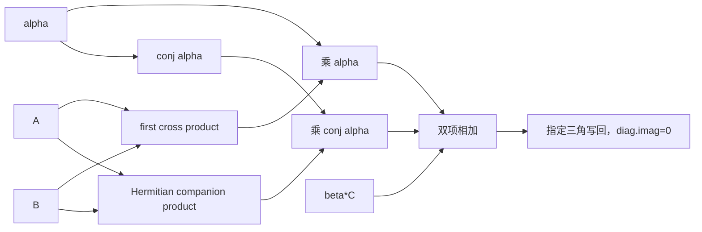
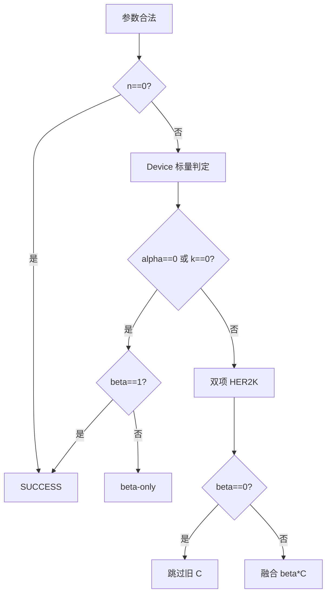
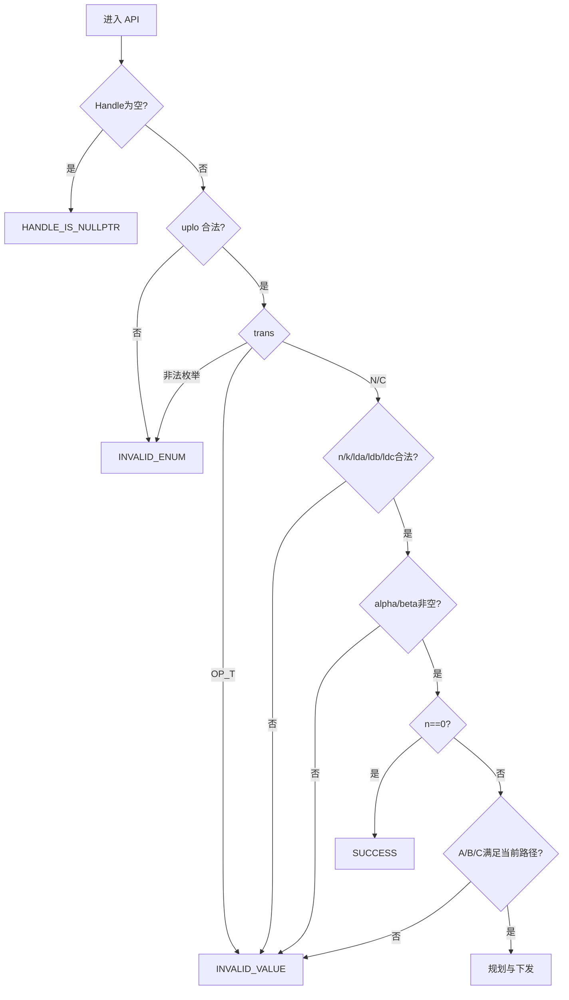
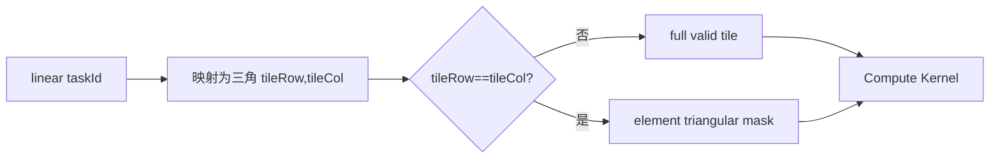
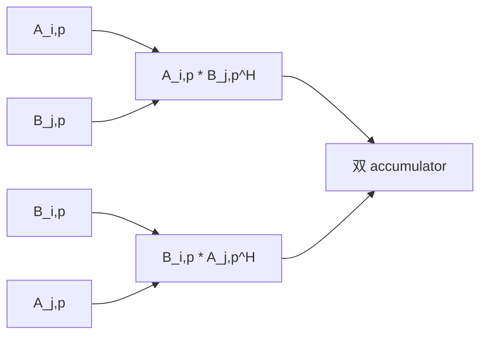
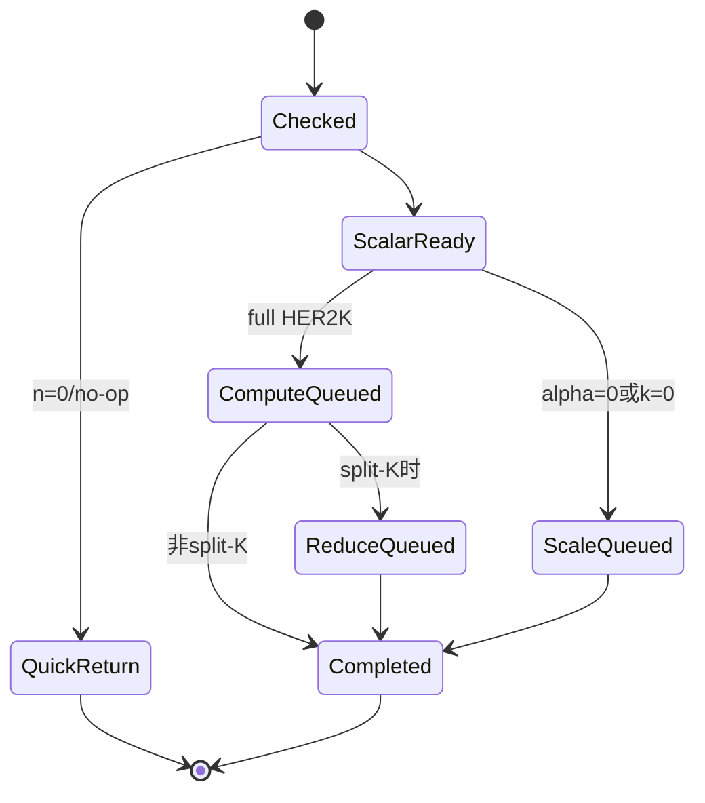

# aclblasCher2k 算子设计文档（Atlas A2/A3）

| 文档版本 | 日期 | 作者/团队 | 说明 |
| --- | --- | --- | --- |
| V1.0 | 2026-08-26 | XYTer | 按社区任务 CheckList 完整整理 A2/A3 评审稿 |

> 目标实现位于 `ops-blas/blas/herk/arch22/`，测试位于 `ops-blas/test/herk/cher2k/arch22/`。本文只描述 Atlas A2/A3（DAV_2201）方案；公共接口与其他产品线共用。

# 一、需求背景

## 1.1 需求来源

本需求来源于 2026 年 8 月社区任务 `aclblasCher2k`，要求参考 cuBLAS `cublasCher2k` 与 Netlib `cher2k`，在 Atlas A2/A3 上实现 complex64 Hermitian rank-2k update，并完成公共 ABI、Host、Kernel、测试和性能验收。

## 1.2 背景介绍

HER2K 属于 BLAS Level 3，用两组复数矩阵 A、B 的交叉乘积更新 Hermitian 矩阵 C。与 HERK 的 `A*A^H` 自相关不同，HER2K 包含 `A*B^H` 与其 Hermitian 对应项，alpha 为复数，因此必须正确处理 A/B 交换、共轭以及 `alpha/conj(alpha)`。

该算子常用于复数协方差交叉更新、分块因子分解和科学计算。若拆成两个通用 GEMM 再做三角合并，会计算无效的另一三角、产生中间矩阵并增加 HBM 往返。本任务设计在一个有效三角 tile 内融合两项乘积和 beta*C。

## 1.3 功能定义

`trans=OP_N`：

$$C\leftarrow \alpha AB^H+\overline{\alpha}BA^H+\beta C$$

其中 A、B 为 `n×k`。

`trans=OP_C`：

$$C\leftarrow \alpha A^HB+\overline{\alpha}B^HA+\beta C$$

其中 A、B 为 `k×n`。

alpha 为 complex64，beta 为 FP32 实数。仅更新 `uplo` 指定三角，对角虚部强制为 0；`OP_T` 不支持。



## 1.4 与 Cherk 的关键差异

| 项目 | Cherk | Cher2k |
| --- | --- | --- |
| 输入矩阵 | A | A、B |
| 主乘积 | `A*A^H` | `A*B^H + B*A^H` |
| alpha | FP32 实数 | complex64 |
| alpha 共轭 | 不涉及 | 第二项使用 `conj(alpha)` |
| 计算量 | 约一个复数 GEMM 三角 | 约两个复数 GEMM 三角 |
| tile 复用 | 复用 A | 同时复用 A/B 及交换角色 |

## 1.5 需求价值

- 补齐 complex64 HER2K 标准 BLAS 接口；
- 通过双项融合避免完整临时矩阵和额外三角裁剪；
- 复用 Cherk 的三角 task、epilogue 和测试基础，同时保留独立的复数 alpha 语义；
- 维持 A2/A3 与其他产品线统一 ABI。

# 二、需求分析

## 2.1 外部依赖

| 依赖 | 用途 | 约束 |
| --- | --- | --- |
| CANN 9.1.0 | Runtime、stream、launch | 验收版本 |
| Ascend C DAV_2201 | A2/A3 Kernel | arch22 |
| ops-blas 公共层 | Handle、complex 类型、workspace | 新增共用声明 |
| Netlib CBLAS | 精度 Golden | `cher2k` |
| cuBLAS | 参数和性能标杆 | `cublasCher2k` |

## 2.2 内部模块

| 模块 | 职责 |
| --- | --- |
| 公共头文件 | 新增 `aclblasCher2k` 声明 |
| `cher2k_host.cpp` | 参数、标量路径、三角 tile、workspace 和 launch |
| `cher2k_tiling_data.h` | Host/Kernel 协议 |
| `cher2k_kernel.cpp` | A/B 双项复数乘加、alpha 缩放和三角 epilogue |
| Cherk 公共 helper | 可复用三角 task、beta-only、对角写回 |
| 测试模块 | CBLAS Golden、属性/标量/安全/性能 |

## 2.3 接口原型

```cpp
aclblasStatus_t aclblasCher2k(
    aclblasHandle_t handle,
    aclblasFillMode_t uplo,
    aclblasOperation_t trans,
    int n,
    int k,
    const aclblasComplex* alpha,
    const aclblasComplex* A,
    int lda,
    const aclblasComplex* B,
    int ldb,
    const float* beta,
    aclblasComplex* C,
    int ldc);
```

## 2.4 参数语义

| 参数 | 角色 | 语义与校验 |
| --- | --- | --- |
| handle | 输入 | 有效 Handle；空返回 `HANDLE_IS_NULLPTR` |
| uplo | 属性 | UPPER/LOWER |
| trans | 属性 | N/C；T 为合法枚举但本算子不支持 |
| n/k | 输入 | 均 `>=0` |
| alpha | 输入 | Device complex64 标量，不可空 |
| A/B | 输入 | Device complex64，只读 |
| lda/ldb | 输入 | N 时 `>=max(1,n)`；C 时 `>=max(1,k)` |
| beta | 输入 | Device FP32 实数标量，不可空 |
| C | 输入/输出 | Device complex64，指定三角原地更新 |
| ldc | 输入 | `>=max(1,n)` |

## 2.5 支持范围

| 维度 | 支持能力 |
| --- | --- |
| 硬件 | Atlas A2/A3 |
| dtype | A/B/C/alpha complex64；beta FP32 |
| trans | N/C |
| uplo | UPPER/LOWER |
| shape | 动态 n/k，允许 0 |
| layout | column-major，允许 ld padding |
| output | C 指定三角原地更新 |
| async | Handle stream |
| deterministic | 不要求 bit-exact |

## 2.6 元素公式与 Hermitian 性质

N 路径指定三角元素：

$$C_{ij}=\alpha\sum_{p=0}^{k-1}A_{ip}\overline{B_{jp}}
+\overline{\alpha}\sum_{p=0}^{k-1}B_{ip}\overline{A_{jp}}+\beta C_{ij}$$

两项互为 Hermitian 对应关系。有限精度下仍在同一 tile 中显式累加两项，并在最终 epilogue 对对角虚部置 0，不能通过读取 C 的另一三角来补齐。

## 2.7 quick return 和特殊标量

| 条件 | 行为 |
| --- | --- |
| n=0 | SUCCESS，不执行计算 |
| `(alpha==0 或 k==0) && beta==1` | SUCCESS |
| `alpha==0 或 k==0`，其他 beta | beta-only 指定三角缩放 |
| beta=0 | 不读取旧 C |
| alpha=0、beta=0 | 指定三角置零 |

alpha/beta 均为 Device 指针。Host 不得直接解引用；路径选择由合法 pointer mode、标量 staging Kernel 或 compute Kernel 内部分支完成。



## 2.8 需求拆解

1. 公共 API、校验和 Device 标量；
2. N/C A/B 逻辑视图；
3. 有效三角输出 task；
4. 两项交叉乘积和 A/B tile 复用；
5. alpha/conj(alpha) 复数缩放、beta epilogue；
6. 对角虚部、另一三角未读写；
7. workspace、资源、精度和性能闭环。

# 三、需求详细设计

## 3.1 总体架构

```mermaid
flowchart TB
    API[aclblasCher2k] --> CHECK[参数校验]
    CHECK --> Q{n==0?}
    Q -- 是 --> S[SUCCESS]
    Q -- 否 --> SCALAR[Device scalar 路径选择]
    SCALAR --> PATH{no-op/scale/full}
    PATH -- no-op --> S
    PATH -- scale --> SK[复用三角 beta-only Kernel]
    PATH -- full --> PLAN[规划有效三角 tile 和 workspace]
    PLAN --> CK[HER2K Compute Kernel]
    CK --> LOAD[搬入 A/B tile]
    LOAD --> DUAL[融合两项 complex MAC]
    DUAL --> EP[alpha/conj(alpha)/beta epilogue]
    EP --> STORE[三角写回，diag.imag=0]
```

## 3.2 Host 侧设计

### 3.2.1 参数检查流程



所有 shape/ld 到字节数的乘法使用 64 位检查。n>0 的 C 输出地址必须有效；beta=0 只表示旧内容无效，不表示可没有输出地址。

### 3.2.2 N/C 逻辑视图

| trans | 第一项左/右 | 第二项左/右 | A/B 物理 shape |
| --- | --- | --- | --- |
| N | A / `B^H` | B / `A^H` | n×k |
| C | `A^H` / B | `B^H` / A | k×n |

Host dispatch 记录四个 tile 访问方向及共轭标志，Kernel 不创建完整转置/共轭矩阵。

### 3.2.3 有效三角 tile

与 Cherk 共用三角 task 编码：UPPER 只生成 `tileRow<=tileCol`，LOWER 只生成 `tileRow>=tileCol`。非对角 tile 完整写回；对角 tile 做元素级 mask。



### 3.2.4 TilingData 和分核

| 字段 | 含义 |
| --- | --- |
| n/k/lda/ldb/ldc | 基本维度 |
| uplo/trans | 属性 |
| mTile/nTile/kTile | 输出/归约 tile |
| taskCount/blockDim | 三角任务和核心数 |
| alpha/beta mode | 标量路径或 Device 判定 |
| tailM/tailN/tailK | 尾块 |
| workspace layout | partial/staging 偏移 |

每个核处理若干独立 C tile。默认不拆分单个 tile 的 K 维；当 k 极大且输出 tile 数不足时，可启用 split-K，将两项 partial 以固定顺序写 workspace，再二阶段归约，避免原子导致误差和非确定性。

### 3.2.5 workspace

workspace 用于 split-K partial、标量 staging、Matmul 引擎临时区或必要的数据重排。需求按两项乘积的最大并发资源统一规划，不能让 A/B 临时区重叠。Host 检查地址、容量、对齐和与 A/B/C 的破坏性别名。

## 3.3 Kernel 侧设计

### 3.3.1 双项融合主流程

```mermaid
flowchart TD
    A[取得一个有效 C tile] --> B[清零 acc1/acc2]
    B --> C{还有 K tile?}
    C -- 是 --> D[搬入 A row/col tiles]
    D --> E[搬入 B row/col tiles]
    E --> F[acc1 += first cross product]
    F --> G[acc2 += companion cross product]
    G --> C
    C -- 否 --> H[out=alpha*acc1+conj(alpha)*acc2]
    H --> I{beta==0?}
    I -- 否 --> J[out += beta*C]
    I -- 是 --> K[不读取 C]
    J --> L[三角 mask和对角清虚部]
    K --> L
    L --> M[写回指定三角]
```

### 3.3.2 A/B tile 复用

同一输出 tile `(i,j)`、同一 K tile 需要：

- 第一项：A 的 i tile 与 B 的 j tile；
- 第二项：B 的 i tile 与 A 的 j tile。



当 i=j 时 Ai/Aj、Bi/Bj 相同，可复用加载并减少一半同矩阵 tile 搬运；非对角 tile 保留四个逻辑 tile，但可通过缓存/双缓冲减少重复 GM 访问。

### 3.3.3 N/C 访问与共轭

N 路径：

$$acc1=\sum A(i,p)\overline{B(j,p)},\quad acc2=\sum B(i,p)\overline{A(j,p)}$$

C 路径：

$$acc1=\sum \overline{A(p,i)}B(p,j),\quad acc2=\sum \overline{B(p,i)}A(p,j)$$

只对公式规定的操作数虚部取负。共轭在 UB 内通过符号操作完成，不生成完整 Device 副本。

### 3.3.4 复数 alpha epilogue

设 `alpha=ar+i*ai`，`acc1=r1+i*i1`，`acc2=r2+i*i2`：

$$alpha\cdot acc1=(ar\,r1-ai\,i1)+i(ar\,i1+ai\,r1)$$

$$conj(alpha)\cdot acc2=(ar\,r2+ai\,i2)+i(ar\,i2-ai\,r2)$$

```mermaid
flowchart TD
    A[acc1,acc2] --> B[读取 alpha real/imag]
    B --> C[alpha*acc1]
    B --> D[conj(alpha)*acc2]
    C --> E[双项相加]
    D --> E
    E --> F{beta==0?}
    F -- 否 --> G[加 beta*C]
    F -- 是 --> H[跳过 C read]
    G --> I[triangle/diagonal epilogue]
    H --> I
```

beta 为实数，只分别缩放 C 的实部和虚部。

### 3.3.5 Hermitian 三角写回

1. 非指定三角不读不写；
2. beta 非零时只读取指定三角旧 C；
3. beta=0 时完全跳过旧 C；
4. 对角虚部无条件强制为 0；
5. 对角实部保留双项有限精度累加结果；
6. ldc padding 保持不变。

### 3.3.6 beta-only 路径

alpha=0 或 k=0 时复用 Cherk 的通用 Hermitian Scale Kernel：beta=1 no-op，beta=0 清零指定三角，其他 beta 缩放指定三角，对角只保留实部并将虚部置 0。A/B 不应被读取。

### 3.3.7 LocalMemory/UB 规划

| 区域 | 用途 |
| --- | --- |
| Ai/Aj/Bi/Bj tiles | 两项交叉乘积输入 |
| real/imag split | 复数向量/Matmul 分量 |
| acc1 real/imag | 第一项累加 |
| acc2 real/imag | 第二项累加 |
| C staging | beta 非零 epilogue |
| transpose/mask work | 布局变换和尾块 |

HER2K 比 HERK 需要更多输入和 accumulator。若同时驻留超过 UB/L1，采用两种合法降级之一：

1. 缩小 m/n/k tile；
2. 先计算 acc1，再复用输入缓冲计算 acc2，但保留输出 accumulator。

不得通过 LocalTensor 地址重叠绕过容量限制。Host/编译期需要提供每条 dispatch 路径的资源字节表。

## 3.4 性能策略

1. 只调度指定三角，避免完整两次 GEMM；
2. 在一个 Kernel/tile 内融合双项与 beta epilogue；
3. 对角 tile 复用 Ai/Aj 和 Bi/Bj；
4. A/B 双缓冲，重叠 K tile 搬运和计算；
5. beta=0 跳过 C read，alpha=0/k=0 走 scale Kernel；
6. N/C 分离 dispatch；
7. 资源不足时缩 tile 或顺序双项，避免溢出 UB；
8. 优先复用仓内 Matmul 引擎而非标量循环。

## 3.5 异步与生命周期



标量 staging、Compute、可选 Reduce 和写回均在 Handle stream 上。Host 不做全设备同步；用户在完成前保持 alpha/beta、A/B/C、workspace 和 Handle 有效。

## 3.6 与“两次 GEMM”方案对比

| 方案 | 中间内存 | 无效计算 | C 读写 | 采用情况 |
| --- | ---: | ---: | ---: | --- |
| 两次完整 GEMM + add + triangle | 两个 n*n 临时矩阵 | 另一三角约 50% | 多次 | 不采用 |
| 两次三角 tile 分开 Kernel | partial workspace | 较少 | 至少两次 | 资源不足时备选 |
| 单 tile 双项融合 | accumulator/tile | 最少 | 一次 | 默认方案 |

# 四、特性交叉分析

## 4.1 兼容性分析

| 特性 | 风险 | 处理方案 |
| --- | --- | --- |
| A/B 交换 × 共轭 | 符号/矩阵错位 | 元素公式表驱动和纯虚手工测试 |
| complex alpha | 第二项误用 alpha | 独立 `alpha`/`conj(alpha)` epilogue |
| U/L × N/C | 三角坐标错误 | 4 组合和对角/非对角 tile 测试 |
| beta=0 × C NaN | NaN 错误传播 | 明确不读 C 路径 |
| 双 accumulator × UB | 资源超限 | 字节表、缩 tile、顺序双项降级 |
| A2/A3 | 核数/UB 差异 | 平台能力生成 tiling |

## 4.2 安全与资源

- n/k/ld 和 workspace 使用 64 位字节计算；
- A/B 只读，C 仅指定三角写；
- Device alpha/beta 不由 Host 非法解引用；
- split-K partial 区域按 task/split 独占；
- workspace 不足或破坏性别名在 launch 前报错；
- ldc padding、另一三角和输入 A/B canary 不变。

## 4.3 风险与规避

| 风险 | 影响 | 规避措施 |
| --- | --- | --- |
| 第二项共轭错误 | 虚部精度全面失败 | 与 CPU 元素公式逐项对比 |
| 对角虚部舍入残留 | 不符合 BLAS | epilogue 最后一步强制 0 |
| A/B tile 重复搬运 | 性能不足 | 对角复用、双缓冲和缓存策略 |
| 双项同时驻留 UB 超限 | 运行异常 | 明确资源核算和顺序双项降级 |
| split-K 无序归约 | 精度波动 | 固定 partial 布局和归约顺序 |

# 五、可维可测分析

## 5.1 可维护性

- 与 Cherk 共用三角 task、beta-only 和对角 epilogue helper；
- HER2K 特有的 A/B 访问和复数 alpha 逻辑保持独立；
- N/C 逻辑视图表驱动；
- TilingData 固定宽度，资源字节表随 dispatch 维护；
- 日志记录 n/k/ld、标量路径、tile、split-K 和 workspace。

## 5.2 测试设计

### 5.2.1 测试层级与证据追踪

测试采用“接口层—Kernel 层—基准层—资源层”的闭环；每一层都保留可复现输入、日志和判定结果，重点确认 A/B 交叉项与 `alpha/conj(alpha)` 的配对关系。

| 层级 | 验证内容 | 主要证据 | 通过门槛 |
| --- | --- | --- | --- |
| 接口层 | 枚举、n/k/ld、标量指针、quick return | GTest/CSV 返回值日志 | 与任务书逐项一致 |
| Kernel 层 | U/L、N/C、双项融合、对角虚部、beta=0 | NPU 输出、canary、NaN 保护值 | 无越界且指定三角正确 |
| Golden 层 | Netlib `cher2k` 对照及 A/B 交换恒等式 | 实部/虚部误差、匹配率、代数检查 | 容差和恒等式同时达标 |
| 资源层 | 双 accumulator、workspace、split-K、stream | Profiler、资源边界日志 | 无无序归约/fallback，资源不越界 |
| 性能层 | 任务书 P-01/P-02/P-03 | warmup、有效采样、平均耗时 | 不高于任务书标杆 |

### 5.2.2 可复现执行口径

CSV 用例、随机种子、编译目标和 CANN/驱动版本写入测试报告；性能测试先 warmup，再进行超过 50 次有效采样，报告平均值并附 Kernel/Profiler 原始证据。alpha=0、k=0、beta=0 和一般复数 alpha 的路径分别统计，避免双项融合错误被平均值掩盖。

| 分类 | 覆盖内容 |
| --- | --- |
| 属性 | U/L × N/C；OP_T 和非法枚举负向 |
| shape | n/k=0/1、质数、2 的幂及 ±1、tile 边界、大尺寸 |
| layout | lda/ldb/ldc 最小和多种 padding |
| alpha | 0、1、负实、纯虚、一般复数、大/小值 |
| beta | 0、1、负值、大/小值 |
| A/B | A=B、A!=B、纯实、纯虚、交换 A/B、Inf/NaN |
| triangle | 另一三角填 NaN/canary，验证不读写 |
| diagonal | 输出虚部精确为 0 |
| exception | 空 Handle/标量/A/B/C、负维度、非法 ld/枚举 |
| workspace | 空、不足、split-K 边界、别名、非默认 stream |
| performance | 三个任务书 case，warmup 后 >50 次 |

专项代数一致性：交换 A/B 并将 alpha 替换为 `conj(alpha)`，结果应保持一致；当 A=B 且 alpha 为实数时，可与等价缩放 HERK 结果交叉检查，但最终 Golden 仍以 Netlib `cher2k` 为准。

## 5.3 精度标准

complex64 实部和虚部分别按 FP32 标准比较：`rtol=2^-10`、`atol=2^-16`、匹配率 `>=0.99`，最大绝对误差 `<=1e-2` 或 `32 ULP`。只比较指定三角；对角虚部要求精确为 0。

## 5.4 性能标准

| case | uplo | trans | n | k | Avg time 上限 |
| --- | --- | --- | ---: | ---: | ---: |
| P-01 | UPPER | N | 1024 | 1024 | 933.70 us |
| P-02 | UPPER | N | 2048 | 2048 | 3354.04 us |
| P-03 | LOWER | C | 1024 | 1024 | 692.42 us |

测试设备为 Atlas 800I A2（910B3）。Profiler 记录双项 compute、可选 split-K reduce、HBM/UB/L1 搬运、Matmul/Vector 利用率、A/B tile 重用和核间负载。

## 5.5 交付件

1. 本设计文档和评审记录；
2. 公共 API、Host、Kernel、Tiling 代码；
3. CSV、Netlib Golden、异常和代数一致性测试；
4. 精度、性能、Profiler 自测报告；
5. README 和待验收代码分支。
