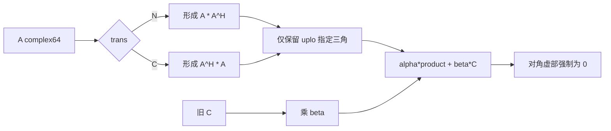
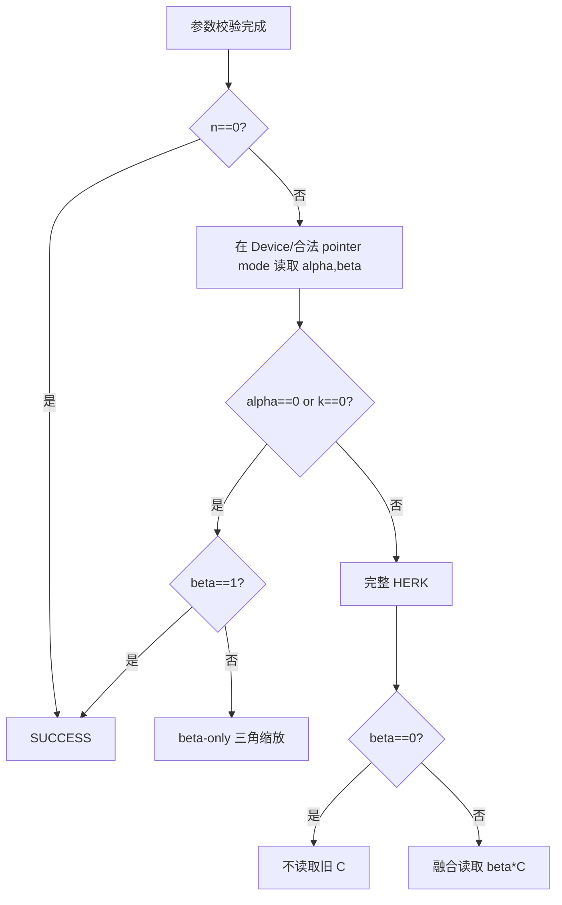
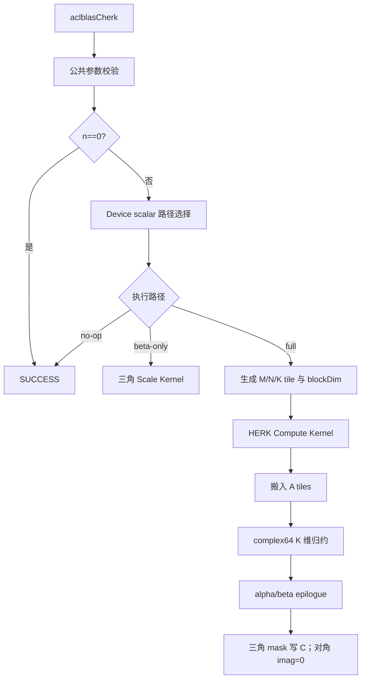
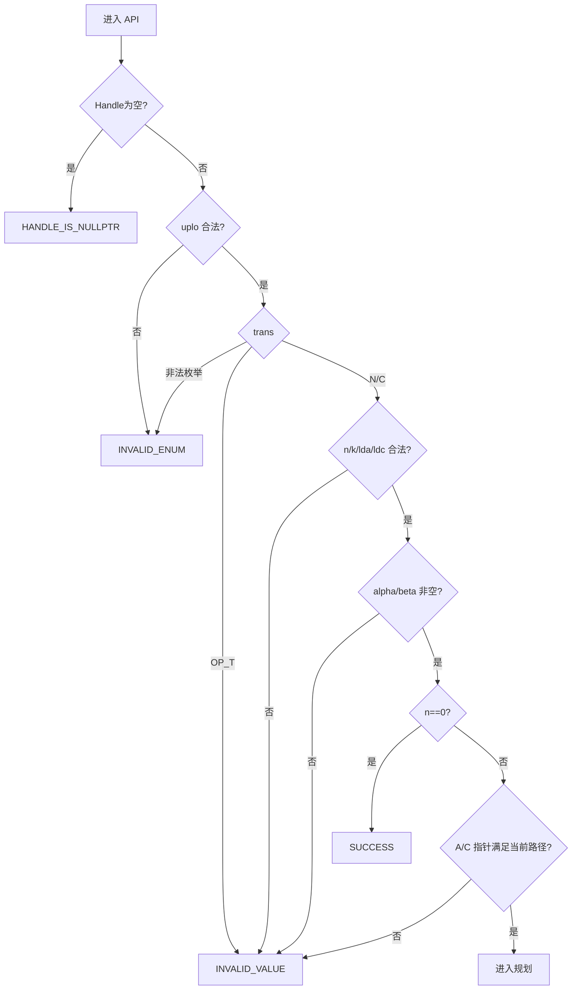
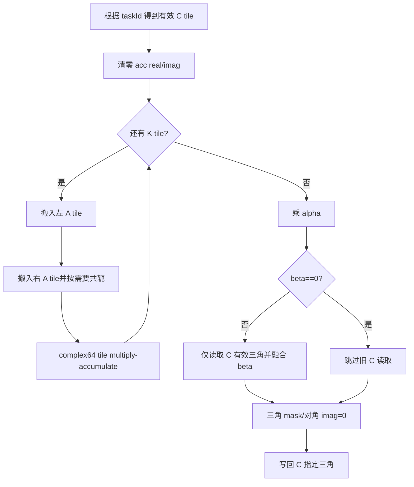
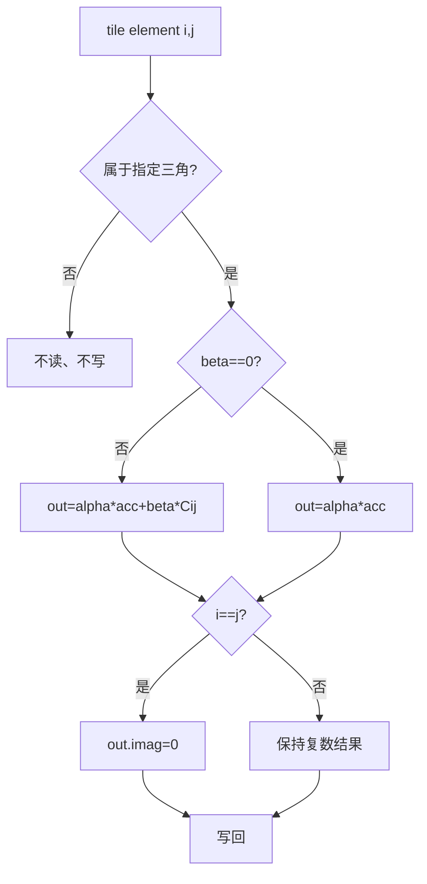
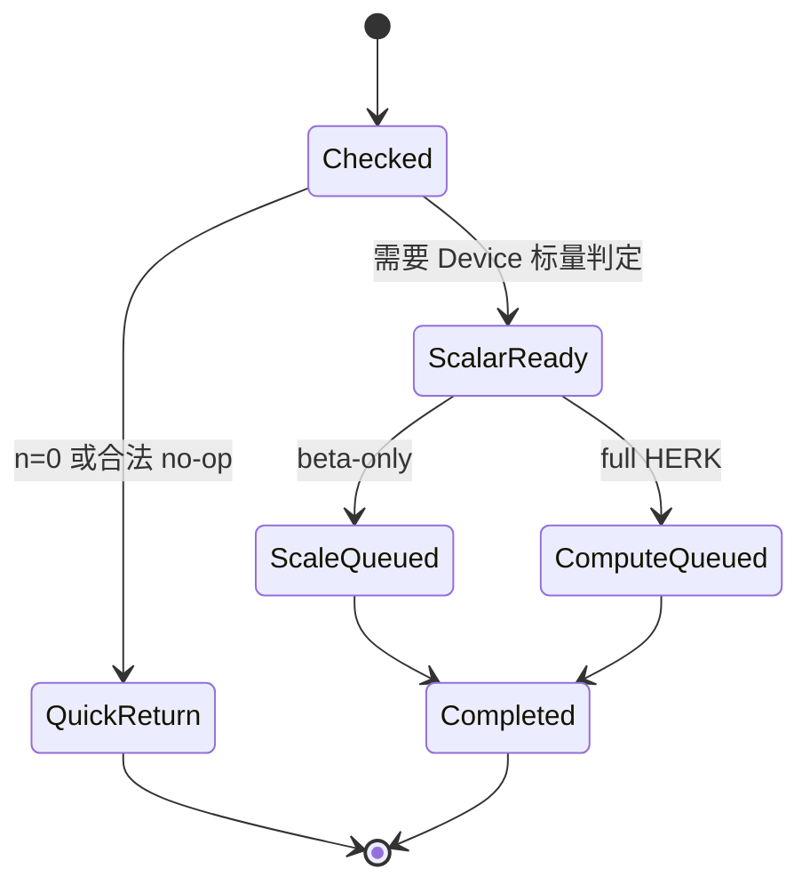

# aclblasCherk 算子设计文档（Atlas A2/A3）

| 文档版本 | 日期 | 作者/团队 | 说明 |
| --- | --- | --- | --- |
| V1.0 | 2026-08-26 | TreamTik | 按社区任务 CheckList 完整整理 A2/A3 评审稿 |

> 目标实现位于 `ops-blas/blas/herk/arch22/`，测试位于 `ops-blas/test/herk/cherk/arch22/`。公开 API 已存在并由各产品线共用，本文只设计 Atlas A2/A3（DAV_2201）路径。

# 一、需求背景

## 1.1 需求来源

本需求来源于 2026 年 8 月社区任务 `aclblasCherk`，要求在 Atlas A2/A3 上用 Ascend C 实现单精度复数厄米特秩-k 更新，与 cuBLAS `cublasCherk` 和 Netlib `cherk` 的接口、三角引用、quick return 和数值语义一致。

## 1.2 背景介绍

HERK 属于 BLAS Level 3，是构造 Gram 矩阵、协方差矩阵及复数相关矩阵的基础算子。A 为 complex64，C 为 n 阶 Hermitian 矩阵，alpha/beta 为 FP32 实数。由于 C 具有共轭对称性，只需要引用和更新 `uplo` 指定的一半三角区域。

仓内已有其他架构的同名公开接口和矩阵乘基础设施。本任务增加 `arch22` Host/Kernel，实现 A2/A3 复数乘加、三角 tile 裁剪、对角虚部清零、Device 标量读取和性能优化，不建立产品私有 API。

## 1.3 功能定义

`trans=OP_N`：

$$C\leftarrow \alpha AA^H+\beta C,\quad A\in\mathbb{C}^{n\times k}$$

`trans=OP_C`：

$$C\leftarrow \alpha A^HA+\beta C,\quad A\in\mathbb{C}^{k\times n}$$

其中 `alpha,beta` 为实数。`OP_T` 不属于 HERK 定义，返回 `INVALID_VALUE`。输出满足：

$$C_{ij}=\overline{C_{ji}},\qquad Im(C_{ii})=0$$

任务书要求仅 `uplo` 指定三角被引用和更新。实现不应写另一三角；Hermitian 性质按 BLAS 的三角存储语义由指定三角代表，若测试/上层要求完整矩阵，则由独立展开逻辑处理。



## 1.4 标杆与需求价值

| 项目 | 标杆语义 | 本任务 |
| --- | --- | --- |
| dtype | A/C complex64，alpha/beta FP32 | 完全对齐 |
| trans | N/C | 完全对齐，T 拒绝 |
| uplo | UPPER/LOWER | 只读写指定三角 |
| layout | column-major | 完全对齐 lda/ldc |
| output | C 原地更新 | 完全对齐 |
| async | 库 stream | Handle stream 异步执行 |

实现该算子可避免将 HERK 拆成通用 GEMM 加三角修正，减少无效的另一三角计算和额外 Kernel/HBM 往返。

# 二、需求分析

## 2.1 外部依赖

| 依赖 | 用途 | 约束 |
| --- | --- | --- |
| CANN 9.1.0 | Runtime、stream、Kernel launch | 验收版本 |
| Ascend C DAV_2201 | A2/A3 Kernel | arch22 |
| ops-blas 公共层 | Handle、类型、错误码、workspace | 复用已有 Cherk 声明 |
| Netlib CBLAS | Golden | `cherk` |
| cuBLAS | 性能和接口标杆 | `cublasCherk` |

## 2.2 内部模块

| 模块 | 职责 |
| --- | --- |
| `cherk_host.cpp` | 校验、quick return、路径选择、tiling、workspace、launch |
| `cherk_tiling_data.h` | Host/Kernel 参数协议 |
| `cherk_kernel.cpp` | complex64 tile 搬运、乘加、beta 融合、三角写回 |
| 公共 Matmul/helper | 可复用时提供 A2/A3 向量/矩阵乘基础能力 |
| 测试模块 | CSV、CBLAS Golden、未读三角、精度、性能和安全 |

## 2.3 接口原型

```cpp
aclblasStatus_t aclblasCherk(
    aclblasHandle_t handle,
    aclblasFillMode_t uplo,
    aclblasOperation_t trans,
    int n,
    int k,
    const float* alpha,
    const aclblasComplex* A,
    int lda,
    const float* beta,
    aclblasComplex* C,
    int ldc);
```

## 2.4 参数语义

| 参数 | 角色 | 语义与校验 |
| --- | --- | --- |
| handle | 输入 | 有效 Handle；空返回 `HANDLE_IS_NULLPTR` |
| uplo | 属性 | UPPER/LOWER；非法返回 `INVALID_ENUM` |
| trans | 属性 | N/C；T 返回 `INVALID_VALUE`，其他非法枚举返回 `INVALID_ENUM` |
| n/k | 输入 | `n>=0`,`k>=0` |
| alpha/beta | 输入 | Device FP32 标量指针，均不可空 |
| A | 输入 | Device complex64；n>0 且 k>0 时有效 |
| lda | 输入 | N 时 `>=max(1,n)`；C 时 `>=max(1,k)` |
| C | 输入/输出 | Device complex64，n*n 逻辑矩阵 |
| ldc | 输入 | `>=max(1,n)` |

## 2.5 支持范围

| 维度 | 支持能力 |
| --- | --- |
| 硬件 | Atlas A2/A3 |
| dtype | A/C complex64；alpha/beta FP32 |
| trans | N/C |
| uplo | UPPER/LOWER |
| shape | 动态 n/k，允许 0 |
| layout | column-major，lda/ldc padding |
| output | C 指定三角原地更新 |
| deterministic | 不作 bit-exact 承诺 |
| async | Handle stream |

## 2.6 quick return 与 beta-only

| 条件 | 行为 |
| --- | --- |
| `n==0` | SUCCESS，不执行计算 |
| `(alpha==0 或 k==0) 且 beta==1` | SUCCESS，不引用 A/C 数据 |
| `alpha==0 或 k==0`，其他 beta | 仅缩放 C 指定三角 |
| `beta==0` | 不读取旧 C，直接写 product |
| `alpha==0 && beta==0` | 指定三角置零，对角虚部为 0 |

alpha/beta 位于 Device，Host 不能在不符合 pointer mode/异步语义的情况下直接解引用。设计采用标量预取小 Kernel，或在主 Kernel 内读取并选择路径；只有 Host 可合法获知标量值时才能做 Host quick return。



## 2.7 需求拆解

1. API 校验和 Device 标量处理；
2. N/C 两种矩阵视图和三角 tile 规划；
3. complex64 GEMM-like 乘加；
4. alpha/beta 融合、beta=0 未读 C；
5. 对角虚部清零和另一三角不读写；
6. workspace、分核、UB/L1 规划；
7. 精度、异常、安全和性能闭环。

# 三、需求详细设计

## 3.1 总体架构



## 3.2 Host 侧设计

### 3.2.1 参数检查流程



由于 beta 值在 Device，C 是否可空的精确判断需遵循任务书和仓库 pointer mode 约定。常规 n>0 输出 C 必须有效；`beta=0` 表示旧 C 内容可无效，不代表输出地址可为空。

### 3.2.2 逻辑矩阵归一化

Host 将两种 trans 归一为输出维 M=N=n、归约维 K=k：

| trans | 左操作数 | 右操作数 | A 物理 shape |
| --- | --- | --- | --- |
| N | A | `A^H` | n×k |
| C | `A^H` | A | k×n |

dispatch 中记录 A 的连续方向、是否对左/右 tile 取共轭以及 lda。Kernel 不生成显式转置矩阵。

### 3.2.3 输出三角分块

只为指定三角生成输出 tile：

```mermaid
flowchart TD
    A[输出 n*n tile 网格] --> B{uplo}
    B -- UPPER --> U[仅调度 tileRow <= tileCol]
    B -- LOWER --> L[仅调度 tileRow >= tileCol]
    U --> D{对角 tile?}
    L --> D
    D -- 否 --> F[完整 tile 写回]
    D -- 是 --> M[元素级三角 mask + imag(diag)=0]
```

非对角 tile 完整位于有效三角时直接连续写回；对角 tile 使用 mask，禁止读取/覆盖另一半。

### 3.2.4 分核与 TilingData

| 字段 | 含义 |
| --- | --- |
| n/k/lda/ldc | 基本维度 |
| uplo/trans | 属性 |
| mTile/nTile/kTile | 输出和归约 tile |
| tileCount | 有效三角 tile 数 |
| blockDim | 使用 AIV/AIC 核数 |
| scalarMode | full/beta-only/no-op 或 Device 判定 |
| tailM/tailN/tailK | 尾块 |
| workspaceOffset | 临时区布局 |

有效三角 tile 按线性任务号分配给核心，每个 tile 独占输出，避免原子。大 n/k 使用多核和 K 分块；若 K 维需要跨核分割，则使用确定的 partial workspace 和二阶段归约，不允许无序写 C。

### 3.2.5 workspace

workspace 可能包含：K 分块 partial C、标量 staging、转置/规整 tile（仅确有收益时）和 Kernel 库所需空间。Host 用 64 位计算需求并验证 Handle workspace；beta=0 路径不得为了 epilogue 读取旧 C。

## 3.3 Kernel 侧设计

### 3.3.1 Compute 主流程



### 3.3.2 复数乘加

对 `a=ar+i*ai`、`b=br+i*bi`：

$$real\mathrel{+}=ar\cdot br-ai\cdot bi$$

$$imag\mathrel{+}=ar\cdot bi+ai\cdot br$$

HERK 的右操作数包含共轭。实现可使用实虚拆分的四次实数乘加，也可复用已验证的 complex Matmul helper。FP32 分量累加，K 尾块以 mask/padding 控制。

### 3.3.3 A tile 访问

```mermaid
flowchart LR
    T{trans} -- N --> LN[左: A(row,k)]
    T -- N --> RN[右: conj(A(col,k))]
    T -- C --> LC[左: conj(A(k,row))]
    T -- C --> RC[右: A(k,col)]
    LN --> M[complex MAC]
    RN --> M
    LC --> M
    RC --> M
```

共轭仅改变虚部符号，不生成完整共轭副本。优先按列主序连续方向搬运，并通过 tile 转置/重排形成计算布局。

### 3.3.4 Epilogue 与三角语义

输出 tile 计算完成后：

1. `acc *= alpha`，alpha 为实数；
2. beta 非零时，仅对有效三角位置读取旧 C 并执行 `acc += beta*C`；
3. 对角元素虚部无条件写 0；
4. 只写 `uplo` 指定位置，另一三角保持调用前内容；
5. beta=0 时对旧 C 的 NaN/Inf 不传播。



### 3.3.5 beta-only Kernel

当 alpha=0 或 k=0：

- beta=1 直接返回；
- beta=0 将指定三角清零；
- 其他 beta 将有效三角乘 beta；
- 对角只使用旧 C 实部并令输出虚部为 0；
- 仍不得访问另一三角。

该路径为 O(n²/2)，不进入 A/K 循环。

### 3.3.6 LocalMemory 规划

| 区域 | 用途 |
| --- | --- |
| left/right A tile | complex64 输入块 |
| real/imag split | 复数计算分量 |
| acc real/imag | FP32 输出累加 |
| C staging | beta 非零时的有效输出 tile |
| transpose/work | 搬运重排、尾块和 mask |

tile 大小由 UB/L1 容量、Matmul API 临时区和双缓冲共同确定。设计阶段记录各路径的实际字节表；编译期/Host tiling 保证不超过平台资源。

## 3.4 性能策略

1. 只调度约一半输出 tile；
2. 非对角有效 tile 使用无 mask 连续快路；
3. A tile 在多个输出 tile/K 循环中尽量复用；
4. 双缓冲重叠 GM 搬运和计算；
5. beta=0 跳过 C read，alpha=0/k=0 使用 scale Kernel；
6. N/C 分离 dispatch，减少热循环分支；
7. 优先复用仓内已验证 Matmul 引擎，避免手写低效标量 GEMM。

## 3.5 异步和生命周期



所有标量读取、数据搬运、计算和写回使用 Handle stream。Host 不做全设备同步；调用方在完成前保持 alpha、beta、A、C、workspace 和 Handle 有效。

# 四、特性交叉分析

## 4.1 兼容性分析

| 特性 | 风险 | 处理方案 |
| --- | --- | --- |
| U/L × N/C | 坐标/共轭错误 | 4 组合及手工小矩阵测试 |
| Device scalar × quick return | Host 非法解引用/同步 | 主 Kernel 或合法 pointer mode 判定 |
| beta=0 × C NaN | 错误传播 | 独立不读 C fast path |
| 对角 tile × uplo | 覆盖另一三角 | 元素 mask 和 canary |
| lda/ldc padding | 地址错误 | 64 位列主序 helper 和 padding 测试 |
| A2/A3 资源差异 | tile 超限 | 平台查询和按资源 tiling |

## 4.2 安全和资源

- n/k/lda/ldc 的字节范围使用 64 位检查；
- alpha/beta 按 Device 指针处理，不在 Host 直接解引用；
- beta=0 不读取 C，UNIT 类规则不适用；
- 另一三角和 C padding 不写；
- workspace 不足在 launch 前返回；
- 每个输出 tile 独占，不使用无序原子。

## 4.3 风险与规避

| 风险 | 影响 | 规避 |
| --- | --- | --- |
| 共轭放错操作数 | 虚部符号错误 | 纯虚 A 和 N/C 对照测试 |
| 三角 mask 错位 | 非法写/精度错误 | 对角 tile canary 和 U/L 全覆盖 |
| 对角虚部未清零 | 标准不符 | epilogue 强制处理和逐项检查 |
| 通用 GEMM 后裁剪 | 浪费近半计算 | Host 只生成有效三角 tile |
| Device scalar 造成同步 | 性能下降 | 标量 staging 与主 Kernel 融合 |

# 五、可维可测分析

## 5.1 可维护性

- 校验、标量路径、tile 规划、compute 和 epilogue 分层；
- N/C 的 A 坐标映射表驱动；
- 三角 taskId 到 tile 坐标的映射独立单测；
- TilingData 固定布局并记录资源字节表；
- 日志包含 n/k/lda/ldc、路径、tile、blockDim、workspace。

## 5.2 测试设计

### 5.2.1 测试层级与证据追踪

测试采用“接口层—Kernel 层—基准层—资源层”的闭环；每一层都保留可复现输入、日志和判定结果，重点确认只访问/更新指定 Hermitian 三角。

| 层级 | 验证内容 | 主要证据 | 通过门槛 |
| --- | --- | --- | --- |
| 接口层 | 枚举、n/k/ld、标量指针、quick return | GTest/CSV 返回值日志 | 与任务书逐项一致 |
| Kernel 层 | U/L、N/C、三角 tile、对角虚部、beta=0 | NPU 输出、canary、NaN 保护值 | 无越界且指定三角正确 |
| Golden 层 | Netlib `cherk` 对照 | 实部/虚部误差、匹配率、对角检查 | 容差和对角语义同时达标 |
| 资源层 | workspace、Device scalar、stream、tile 负载 | Profiler、资源边界日志 | 不读旧 C（beta=0），无 fallback |
| 性能层 | 任务书 P-01/P-02/P-03 | warmup、有效采样、平均耗时 | 不高于任务书标杆 |

### 5.2.2 可复现执行口径

CSV 用例、随机种子、编译目标和 CANN/驱动版本写入测试报告；性能测试先 warmup，再进行超过 50 次有效采样，报告平均值并附 Kernel/Profiler 原始证据。alpha/beta 的 Device pointer mode、beta-only 和 n/k=0 路径分别留存日志，不能只报告完整 HERK 路径。

| 分类 | 覆盖内容 |
| --- | --- |
| 属性 | U/L × N/C；OP_T 和非法枚举负向 |
| shape | n/k=0/1、小质数、2 的幂及 ±1、tile 边界、大尺寸 |
| layout | lda/ldc 最小值和多种 padding |
| scalar | alpha=0/1/负/大值，beta=0/1/负值 |
| complex | 纯实、纯虚、抵消、随机、Inf/NaN |
| triangle | 另一三角填 NaN/canary，验证不读写 |
| diagonal | 输入任意虚部，输出虚部恒 0 |
| exception | 空 Handle/标量/A/C、负维度、非法 ld、非法枚举 |
| workspace | 空、不足、别名、非默认 stream |
| performance | 三个任务书 case，warmup 后 >50 次 |

## 5.3 精度标准

Golden 使用 Netlib/CBLAS `cherk`，仅比较指定三角，实部/虚部分别满足 FP32 标准：`rtol=2^-10`、`atol=2^-16`、匹配率 `>=0.99`，最大绝对误差 `<=1e-2` 或 `32 ULP`。对角虚部要求精确为 0。

## 5.4 性能标准

| case | uplo | trans | n | k | Avg time 上限 |
| --- | --- | --- | ---: | ---: | ---: |
| P-01 | UPPER | N | 1024 | 1024 | 472.38 us |
| P-02 | UPPER | N | 2048 | 2048 | 1674.42 us |
| P-03 | LOWER | C | 1024 | 1024 | 311.00 us |

测试设备为 Atlas 800I A2（910B3）。Profiler 至少记录计算核耗时、HBM/UB/L1 搬运、Vector/Matmul 利用率、有效三角 tile 数和各核负载。

## 5.5 交付件

1. 本设计文档和评审记录；
2. `blas/herk/arch22` Host/Kernel/Tiling 代码；
3. `test/herk/cherk/arch22` CSV、Golden 和测试；
4. 精度、异常、性能、Profiler 自测报告；
5. README、公共 API 兼容说明和代码分支。
