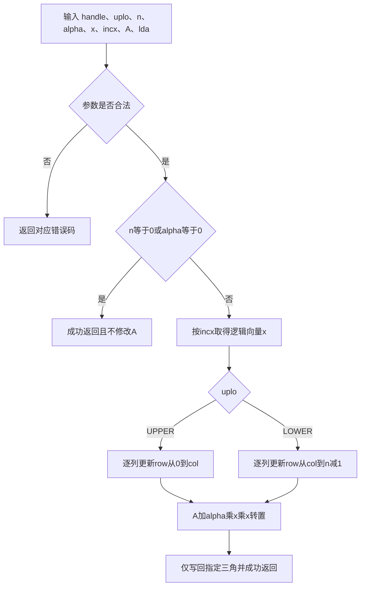
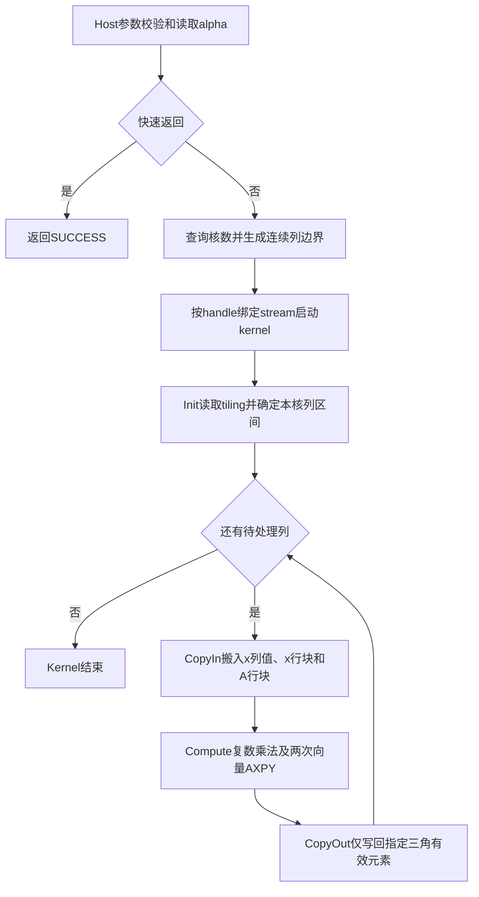

# 【社区任务】aclblasCsyr算子设计文档

## 需求背景（required）

### 需求来源

本需求来源于“算子实操工坊-广州站-aclblasCsyr算子开发（A2/A3）”社区任务。任务要求基于 `cann/ops-blas` 开源仓，使用 Ascend C/CATLASS 编程语言为 Atlas A2/A3 系列产品实现单精度复数对称秩-1更新接口 `aclblasCsyr`，完成设计、开发、精度验证、性能验证及开源合入。

目标验收环境为 CANN 9.1.0，A2/A3 对应 `arch22`，性能验收设备按任务书性能章节采用 Atlas 800I A2（910B3）。

对标接口为 cuBLAS `cublasCsyr`，目标接口声明如下：

```cpp
aclblasStatus_t aclblasCsyr(
    aclblasHandle_t handle, aclblasFillMode_t uplo, const int n,
    const aclblasComplex* alpha,
    const aclblasComplex* x, const int incx,
    aclblasComplex* A, const int lda);
```

### 背景介绍

#### aclblasCsyr算子功能

`aclblasCsyr` 用于完成单精度复数对称矩阵的秩-1更新：

```text
A := alpha * x * x^T + A
```

其中：

- `x` 为包含 `n` 个逻辑元素的 complex64 向量；
- `A` 为 `n × n` 的 complex64 对称矩阵，按列主序存储，物理主维为 `lda`；
- `alpha` 为 complex64 标量；
- `x^T` 为普通转置，不进行共轭；
- 仅 `uplo` 指定的三角区域被读取和更新，另一三角区域不读不写；
- 对角元素是普通复数元素，虚部不置零。

当 `uplo == ACLBLAS_UPPER` 时更新 `0 <= row <= col < n`；当 `uplo == ACLBLAS_LOWER` 时更新 `0 <= col <= row < n`。

#### 标杆及同族算子实现现状分析

本任务对标接口为 cuBLAS `cublasCsyr`，不是对已有 TBE 算子的改写，因此不存在需要保持一致的 TBE 源码路径、算子信息库路径或 TBE 实现流程。接口语义以任务书冻结的 `aclblasCsyr` 定义及 cuBLAS 文档为准；工程和实现方式以 `ops-blas` 中同族算子为参考。

当前 `ops-blas` 仓中已有实数同族接口 `aclblasSsyr`，A2/A3 实现位于 `blas/syr/arch22/`。该实现提供了三角区域任务划分和 Vector Core 计算的参考，但当前 arch22 代码没有完整承载 `incx`、`lda` 等运行时语义，并使用固定核数、运行期临时内存申请和同步等方式，因此 `aclblasCsyr` 不直接复制该实现。

仓内以下算子为本设计提供参考：

| 参考算子 | 可复用设计 | 不直接复用的部分 |
| --- | --- | --- |
| `aclblasSsyr` | SYR 接口语义、UPPER/LOWER 三角计算思路 | complex64、完整 incx/lda 支持及异步性能路径 |
| `aclblasSger` | 列主序 lda、正负步长、DataCopyPad、A 搬入/更新/搬出、异步 kernel 启动 | 无三角约束且为实数计算 |
| `aclblasChpr` | complex64 数据访问、正负 incx、UPPER/LOWER、连续步长快速路径 | HPR 使用共轭且为 packed 矩阵，alpha 为实数 |
| `aclblasCgerc` 等复数算子 | complex64 实虚部拆解及复数乘法 | GER 无三角约束，部分 Host 实现不满足本任务完整接口要求 |

标杆语义流程如下：



#### aclblasCsyr输入输出规格

| 参数 | 含义 | 数据位置/类型 | 约束 |
| --- | --- | --- | --- |
| handle | ops-blas 上下文句柄，携带 stream | Host，`aclblasHandle_t` | 非空 |
| uplo | 指定更新上三角或下三角 | Host，枚举 | `ACLBLAS_UPPER` 或 `ACLBLAS_LOWER` |
| n | 矩阵阶数 | Host，int | `n >= 0` |
| alpha | 复数乘数 | Host/Device，complex64 指针 | 指针非空 |
| x | 输入复数向量 | Device，complex64 | 物理长度至少 `1+(n-1)*abs(incx)` |
| incx | x 的复数元素步长 | Host，int | 非零，支持负数 |
| A | 原地更新的复数矩阵 | Device，complex64 | 列主序，物理形状 `(lda,n)` |
| lda | A 的前导维度 | Host，int | `lda >= max(1,n)` |

## 需求分析（required）

### 需求描述

在 Atlas A2/A3 系列产品上实现 `aclblasCsyr`。接口行为与任务书及 cuBLAS `cublasCsyr` 对齐，支持 complex64、UPPER/LOWER、任意非零正负 `incx`、列主序 `lda` 和 A 原地更新，并满足规定的异常返回、quick return、精度和性能要求。

### 需求拆解

1. 在公共头文件 `include/cann_ops_blas.h` 中新增 `aclblasCsyr` 声明，不定义产品私有平行接口。
2. 在 `blas/syr/arch22/` 中实现 A2/A3 Host API、tiling 数据和 Ascend C kernel。
3. 支持 complex64 复数乘加，计算过程中不对 x 共轭。
4. 支持 `ACLBLAS_UPPER` 和 `ACLBLAS_LOWER`，未指定三角不读不写。
5. 支持 `lda >= max(1,n)`，地址按 `row + col * lda` 计算。
6. 支持任意非零 `incx`，包括负步长反向逻辑遍历。
7. 支持 `n == 0` 和 `alpha == (0,0)` 的成功快速返回，且不修改 A。
8. 完成 handle、枚举、n、alpha、x、incx、A、lda 等参数校验并返回规定状态码。
9. 保持基于 handle 绑定 stream 的异步执行语义，接口内部不进行无必要的 stream 同步。
10. 在 `test/syr/csyr/arch22/` 建立 CSV 驱动测试，使用自实现 complex64 Csyr golden。
11. 精度满足 FLOAT32 分量标准，性能满足任务书给出的四个标杆 case。
12. n 为运行时标量参数，不要求框架 dynamic shape 适配；不要求确定性计算，不涉及广播。
13. 算子不要求额外内存验收指标，但自测报告仍按交付模板记录运行期内存占用数据。
14. 提供算子 README、测试 README、自测用例、自测代码和可复现的自测报告。

### 外部组件依赖

不新增第三方组件依赖。算子依赖目标环境已有的 CANN Runtime、Ascend C 编译器以及 `ops-blas` 公共构建基础设施；精度 golden 由测试工程自行实现，不依赖不存在的 Netlib/CBLAS complex SYR 接口。

### 内部适配模块

| 模块 | 适配内容 |
| --- | --- |
| `include/cann_ops_blas.h` | 新增公共接口 `aclblasCsyr` 声明 |
| `blas/syr/arch22/` | 新增 A2/A3 Host、tiling 数据及 Ascend C kernel |
| handle 公共模块 | 复用 handle 中的 stream，保持句柄式 BLAS 调用语义 |
| Host 公共辅助模块 | 复用核数查询、指针位置判断和状态码约定 |
| `test/syr/csyr/arch22/` | 新增 CSV 驱动测试、C++ GTest 和自实现 golden |

除任务书明确不要求适配的部分外，接口参数、返回值、调用顺序和公共头文件风格均与 `aclblasSsyr` 及 `ops-blas` 现有规范对齐。

## 详细设计（required）

### 调用方式

采用任务书指定的 Ascend C kernel 直调方式。用户调用 `aclblasCsyr` Host API；Host API 完成校验和 tiling，取得 handle 绑定的 stream 后异步启动 `arch22` kernel。该任务不新增 ACLNN、PyTorch 或图模式算子入口。

```text
用户程序 -> aclblasCsyr Host API -> 参数校验/tiling -> handle stream -> Ascend C kernel -> 原地更新A
```

### 算子分析

#### 数学公式

对指定三角区域内的每个元素执行：

```text
A(row,col) := A(row,col) + alpha * x(row) * x(col)
```

设：

```text
alpha = ar + ai*i
x(col) = cr + ci*i
x(row) = xr + xi*i
```

先计算列标量：

```text
pr = ar*cr - ai*ci
pi = ar*ci + ai*cr
```

再完成向量更新：

```text
A.real += pr*xr - pi*xi
A.imag += pr*xi + pi*xr
```

上述公式不包含共轭；对角线使用相同公式，虚部正常保留。

#### 支持数据类型

| 对象 | 数据类型 |
| --- | --- |
| alpha | `aclblasComplex`，实部/虚部均为 float32 |
| x | `aclblasComplex`（COMPLEX64） |
| A | `aclblasComplex`（COMPLEX64） |

#### 支持形状和存储

- x 的逻辑长度为 `n`，物理长度至少为 `1+(n-1)*abs(incx)`；
- A 的逻辑形状为 `n × n`，物理形状为 `(lda,n)`；
- A 使用列主序，元素地址为 `A[row + col*lda]`；
- 不涉及广播和额外的非连续 Tensor 语义。

#### 参数校验与快速返回

参数处理顺序遵循任务书约定：

1. `handle == nullptr`：返回 `ACLBLAS_STATUS_HANDLE_IS_NULLPTR`；
2. `uplo` 非 UPPER/LOWER：返回 `ACLBLAS_STATUS_INVALID_ENUM`；
3. `n < 0`、`incx == 0`、`lda < max(1,n)` 或 `alpha == nullptr`：返回 `ACLBLAS_STATUS_INVALID_VALUE`；
4. `n == 0`：返回 `ACLBLAS_STATUS_SUCCESS`，不访问 x/A；
5. 有效计算场景下 `x == nullptr` 或 `A == nullptr`：返回 `ACLBLAS_STATUS_INVALID_VALUE`；
6. `alpha == (0,0)`：返回 `ACLBLAS_STATUS_SUCCESS`，不更新 A。

`incx == INT_MIN` 会导致有符号绝对值溢出。虽然任务书只显式规定 `incx != 0`，实现仍需用无符号/64 位运算安全处理绝对值和物理长度，不能因内部实现方便而擅自缩小任务书允许的非零 int 值域；若 CANN 地址空间或搬运接口无法表达该跨度，应通过安全边界检查返回仓库约定的错误码，并在 README 中说明实际限制。

alpha 同时支持 Host/Device 指针。实现使用仓内 `CheckPtrLocation` 判断地址位置：Host alpha 直接读取，Device alpha 使用运行时支持的 D2H 标量拷贝读取，从而完成 `alpha==(0,0)` quick return 以及“仅在 alpha 非零时校验 x/A 非空”的同步返回值语义。不得在 Host 直接解引用 Device 地址。Device scalar 路径允许为读取 8 字节 alpha 引入必要同步；四个官方性能 case 使用 Host alpha，不受该分支影响。

### 算子实现

#### 实现方案

##### 3.2.1 Host侧设计

Host 侧负责参数校验、获取 handle 绑定的 stream、查询 AIV 核数、生成轻量 tiling 参数并启动 kernel。Host alpha 的正常计算路径保持异步执行，不调用无必要的 `aclrtSynchronizeStream`，也不在每次调用中额外申请大块 workspace。Device alpha 为满足条件性 quick return 和空指针返回值语义，允许通过配套仓的标量读取机制进行最小范围同步；用户在读取最终 Device 结果前仍须同步 handle 绑定的 stream。

tiling 数据设计如下：

```cpp
struct CsyrTilingData {
    uint64_t x;
    uint64_t A;
    uint32_t n;
    uint32_t lda;
    int64_t incx;
    uint32_t uplo;
    uint32_t useCoreNum;
    float alphaReal;
    float alphaImag;
    uint32_t colBegin[MAX_AIV_CORE_NUM];
    uint32_t colEnd[MAX_AIV_CORE_NUM];
};
```

alpha 在完成 Host/Device 标量读取后以两个 float32 值写入 tiling，因此 kernel 无需区分 alpha 原始地址位于 Host 还是 Device。最终结构的字段布局和直接传参能力以 CANN 9.1.0 编译结果为准。

###### 1. 分核策略

采用三角工作量前缀和进行连续列分核。每个核负责连续且互不重叠的若干列，同一矩阵元素只由一个核写入，因此不需要 AtomicAdd。

```text
totalWork = n * (n + 1) / 2
targetBegin(k) = floor(k * totalWork / useCoreNum)
targetEnd(k) = floor((k + 1) * totalWork / useCoreNum)
```

UPPER 的列前缀工作量为 `prefixUpper(col)=col*(col+1)/2`，LOWER 的列前缀工作量为 `prefixLower(col)=col*(2*n-col+1)/2`。Host 侧分别查找最接近每个 target 边界的列号，生成各核 `colBegin/colEnd`。UPPER 第 `col` 列处理 `row=[0,col]`；LOWER 第 `col` 列处理 `row=[col,n-1]`。

列边界保存在容量为 64 的 tiling 数组中，实际核数取 `min(n, GetAivCoreCount(), 64)`，因此不会发生数组越界；设备可用 AIV 核数超过 64 时按 64 核运行。由于边界只能落在整列之间，各核工作量允许相差最多一个边界列；这避免 kernel 内求逆和跨核写冲突，同时显著优于简单等列数切分。

###### 2. 数据分块与UB规划

每核按列处理，单列再按 row 方向切分为多个 chunk。每个 chunk 在 UB 中至少保存：

- x 的 complex64 行片段；
- A 的 complex64 行片段；
- 必要的实部/虚部临时数据；
- 输出数据；
- 双缓冲时的 ping/pong 缓冲。

连续 `incx == 1` 时通过连续 `DataCopyPad` 搬入 x；正非单位步长优先使用带 stride 的搬运/Gather；负步长及超出搬运接口 stride 范围的场景使用通用索引路径。A 始终按照 `row + col*lda` 连续搬运列片段，尾块通过 `DataCopyPad` 处理。

初始 row tile 取 2048 个 complex64 元素（16 KiB），并按 4 个 complex64 元素即 32 字节对齐。x、A、输出及复数旋转临时量采用双缓冲时仍需控制在目标 A2/A3 单核 UB 容量内；尾块记录有效元素数并使用补齐搬运。若 CANN 9.1.0 编译器为具体向量 API 分配额外临时空间，则在不改变接口和 tiling 语义的前提下按编译报告下调 tile，最终值通过 UB 编译检查和 910B3 profiling 确认。

###### 3. tiling key与路径规划

Host 侧通过 tiling 字段或 tiling key 区分：

- `incx == 1`：连续访存快速路径，也是四个性能标杆 case 使用的路径；
- `incx > 1`：正步长 Gather/stride 路径；
- `incx < 0`：负步长通用路径；
- UPPER 与 LOWER 三角路径。

`alpha == (1,0)` 可保留专用快速分支，减少复数标量乘法；是否启用由 A2 实测收益决定。

##### 3.2.2 Kernel侧设计

kernel 包含 Init 和 Process 阶段，Process 以 CopyIn、Compute、CopyOut 组织流水。

###### 1. Init

- 读取 n、lda、incx、uplo、核数和 alpha；
- 建立 x/A 的 GlobalTensor；
- 根据 blockIdx 确定本核列区间或等工作量任务区间；
- 初始化 UB 队列和临时缓冲。

负步长 x 的逻辑索引映射为：

```text
incx > 0: physical(logical) = logical * incx
incx < 0: physical(logical) = (n - 1 - logical) * (-incx)
```

###### 2. CopyIn

- 根据当前列读取 `x(col)`；
- 根据 UPPER/LOWER 确定 row 范围；
- 分块搬入 `x(row)` 和对应 A 列片段；
- complex64 在 GM 中按实虚交错 float32 存储；kernel 使用仓内已验证方式进行交错向量计算或实虚拆分。

###### 3. Compute

先在 Scalar 侧计算 `p = alpha*x(col)=(pr,pi)`。UB 中构造两个交错向量：`xVec=[xr0,xi0,xr1,xi1,...]` 和 `ixVec=[-xi0,xr0,-xi1,xr1,...]`，随后执行两个向量 AXPY：

```text
A_interleaved += pr * xVec
A_interleaved += pi * ixVec
```

由此得到 `A.real += pr*xr-pi*xi`、`A.imag += pr*xi+pi*xr`。计算不读取未指定三角，也不对 x 做共轭。

###### 4. CopyOut

仅将当前有效 row 范围写回 `A[row + col*lda]`。由于按列限定 row 区间，不需要读取或覆盖未指定三角。尾块只写有效 complex64 元素，避免越界和破坏另一三角。

###### 5. 流水与同步

优先采用双缓冲，使下一 row chunk 的 GM→UB 搬运与当前 chunk 计算/写回重叠。队列严格保持 AllocTensor、EnQue、DeQue、FreeTensor 配对。各核写入互不重叠，不使用跨核同步和原子加。

Ascend C 实现流程如下：



与标杆语义流程相比，Ascend C 实现增加了 Host tiling、多核列区间划分、GM/UB 分块搬运和流水并行。这些差异只改变执行组织，不改变数值公式和可见内存范围；其原因是利用 A2/A3 多核与片上 UB 提升吞吐，同时保证各核写入互斥、未指定三角不被访问。

#### 测试设计

在 `test/syr/csyr/arch22/` 新增 CSV 驱动测试。Golden 自实现以下循环，不调用不存在的 CBLAS complex SYR：

```text
for col in [0,n):
    rows = [0,col] for UPPER, [col,n) for LOWER
    for row in rows:
        A[row + col*lda] += alpha * x[row] * x[col]
```

测试覆盖：

1. n=0、n=1、小质数、2 的幂、2 的幂±1及非对齐尺寸；
2. UPPER/LOWER；
3. alpha=(0,0)、实数、纯虚数、一般复数及大/小值；
4. incx=±1、±2、±3；
5. lda=n及带 padding 的 lda；
6. x/A 的随机、全零、交替、极值、Inf、NaN；
7. handle、uplo、n、alpha、x、incx、A、lda 的负向用例；
8. 验证指定三角精度，并额外验证未指定三角保持不变；
9. 四个官方性能 case，warmup 后有效采样超过50次。

输入生成遵循任务书规定：alpha、x、A 的实部和虚部分别采样；普通随机用例采用均匀分布和正态分布各 50%。alpha 的均匀分布范围为 [-5,5]，正态分布参数满足 `mu` 位于 [-5,5]、`sigma` 位于 [0.1,2]。除配套用例外，测试工程还检查对齐偏移、最大允许规模以及规格允许的 Inf/NaN 传播行为。

随任务提供的 `csyr_test.csv` 默认包含 1000 条精度/边界用例和 200 条性能用例。正式自验以随任务提供的全部用例为下限；若配套用例未覆盖任务书要求的场景，则补充用例并在测试 README 和自测报告中列明。

### 支持硬件

| 支持的芯片版本 | 涉及勾选 |
| --- | --- |
| Atlas A2 系列产品（含性能验收设备 910B3） | √ |
| Atlas A3 系列产品 | √ |

### 算子约束限制

1. 仅支持 `aclblasComplex`（COMPLEX64）。
2. A 为列主序，`lda >= max(1,n)`。
3. 仅更新 uplo 指定三角，另一三角不读不写。
4. `incx != 0`，支持正负步长。
5. 不支持超出 incx/lda 语义的其他非连续 Tensor。
6. 不涉及广播，不返回视图，A 原地更新。
7. `n == 0` 或 `alpha == (0,0)` 为合法 quick return。
8. n 是运行时参数，但本任务不要求框架层 dynamic shape 支持。
9. 不要求确定性计算。

## 特性交叉分析

| 特性 | 是否涉及 | 分析结论 |
| --- | --- | --- |
| 动态 shape | 否 | n、lda、incx 是运行时标量，但不涉及框架图模式 dynamic shape 适配 |
| 空 Tensor/no-op | 是 | n=0 或 alpha=(0,0) 成功返回；按任务书规定避免访问不必要的 x/A |
| 广播 | 否 | x 与 A 为独立 BLAS 操作数，无广播语义 |
| 非连续内存 | 有限支持 | 仅支持接口定义的 x 步长 incx 和 A 前导维 lda，不扩展到任意 Tensor stride |
| 原地更新 | 是 | A 为输入输出；每个指定三角元素只由一个核更新，避免写冲突 |
| 确定性 | 不要求 | 每个元素计算顺序固定且无原子归约，当前方案实际具备稳定的单元素计算路径 |
| Inf/NaN | 是 | 按 FLOAT32 复数算术自然传播，不增加饱和或清零处理 |
| 对齐与尾块 | 是 | 主路径按32字节对齐搬运，尾块通过有效长度与补齐搬运防止越界 |
| 多 stream | 是 | 每次调用只使用传入 handle 绑定的 stream，不使用全局同步 |
| Host/Device scalar | 是 | alpha 支持 Host/Device 地址，Device 标量经安全 D2H 读取 |

## 可维可测分析

### 精度标准/性能标准

| 验收标准 | 描述 | 标准来源 |
| --- | --- | --- |
| 精度标准 | complex64 实部、虚部分别按 FLOAT32 判定：rtol=2^-10，atol=2^-16，matched ratio≥0.99，且 max absolute error≤1e-2 或 32 ULP | 任务书及生态算子开源精度标准 |
| 性能标准 | Atlas 800I A2（910B3），warmup 后采样>50次；n=512 UPPER≤6.76us，n=1024 LOWER≤8.91us，n=2048 UPPER≤17.57us，n=4096 LOWER≤116.93us，四组均为 incx=1、alpha=(1,0)、lda=n | aclblasCsyr A2/A3任务书 |

精度测试对指定三角内 complex64 的实部和虚部分别统计。`alpha==(0,0)` 的 quick return 以及未指定三角区域采用精确不变检查。

性能测试只统计接口/kernel 的有效执行时间，不把 Host 数据准备、CPU golden 和结果比对计入 kernel 时间。使用目标仓测试框架或 NPU event 测时，并以 msprof 数据辅助定位计算、搬运和 launch 开销。

### 兼容性分析

`aclblasCsyr` 为新增公共接口，不改变已有接口 ABI。接口签名与 cuBLAS `cublasCsyr` 参数顺序一一对应，并与仓内 `aclblasSsyr` 同构，仅将 alpha、x、A 扩展为 `aclblasComplex`。声明放入公共头文件 `include/cann_ops_blas.h`，供不同产品线共用；A2/A3 实现位于 `blas/syr/arch22/`。

实现使用的 Ascend C API、内核参数传递方式和构建规则需在任务指定的 CANN 9.1.0 环境验证。当前基于 ops-blas master 的分析结果用于方案设计，不以未经目标环境验证的新版本 API 作为最终依赖。

### 交付与可复现性

最终交付内容包括：

1. 本设计文档在 `cann/cann-ops-competitions` 的 `04_tasks/01_community-task-2026/tasklist/` 指定目录提交并合入；
2. `include/cann_ops_blas.h` 中的公共接口声明；
3. `blas/syr/arch22/` 下的 Host、tiling 与 kernel 实现；
4. `test/syr/csyr/arch22/` 下的测试工程和 CSV；
5. 算子 README，产品支持表明确标注 Atlas A2/A3 系列产品支持；
6. 测试 README，包含环境准备、编译、精度测试、性能测试和结果复现命令；
7. 自测报告，包含用例参数、实部/虚部精度结果与截图、性能数据与截图以及内存占用数据。

所有交付件在提交社区任务 IT 验收前完成自验证。后台测试通过后，算子代码申请合入 `cann/ops-blas` 的 `blas/syr/arch22/`，测试代码申请合入 `test/syr/csyr/arch22/`。

说明：本文档撰写过程中使用了 AI 辅助工具，生成内容已由提交者逐节人工复核。
