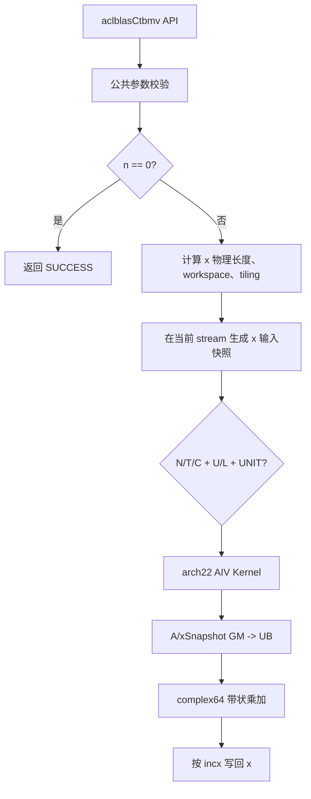
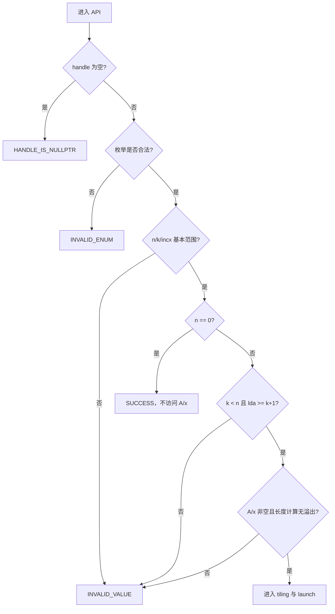
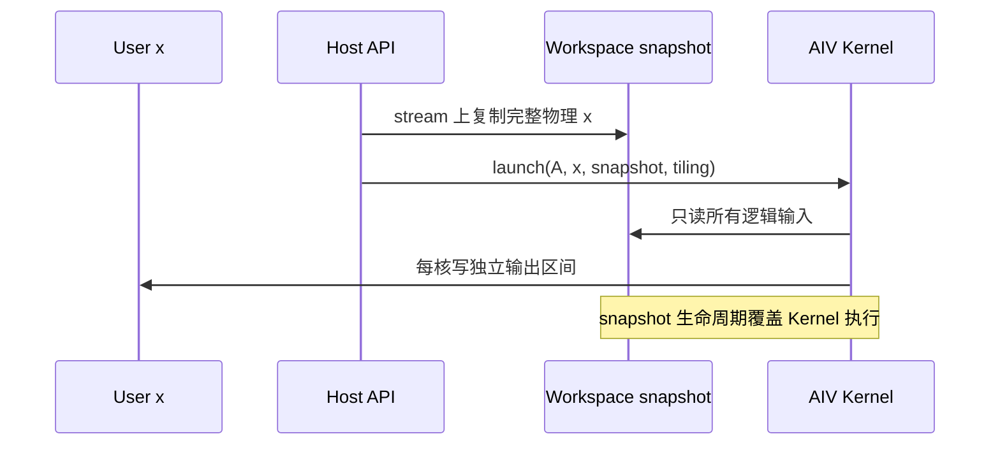
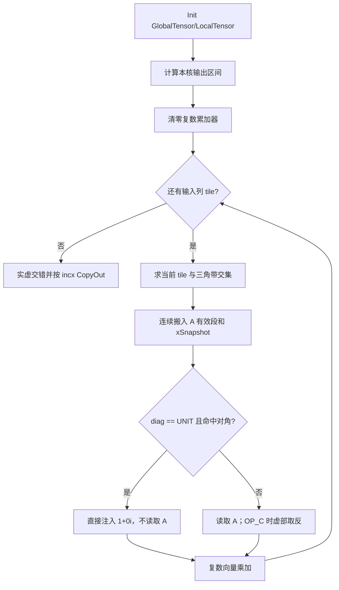
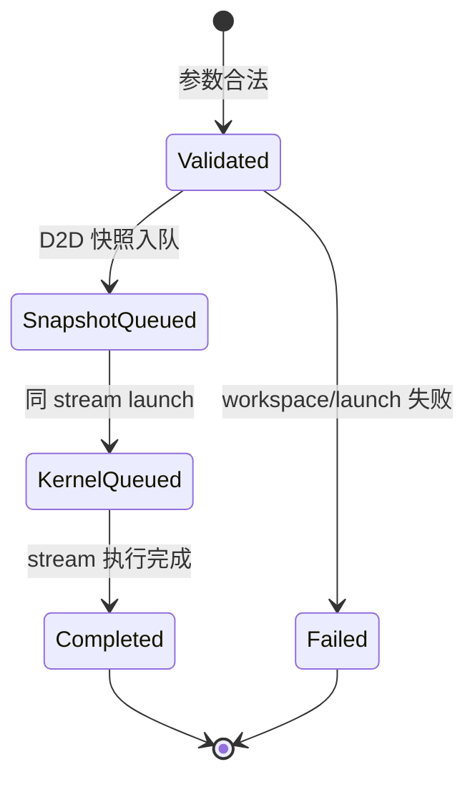

# aclblasCtbmv 算子设计文档（Atlas A2/A3）

| 文档版本 | 日期 | 作者/团队 | 说明 |
| --- | --- | --- | --- |
| V1.0 | 2026-08-26 | m0_69357246 | 按社区任务设计文档 CheckList 完整整理 A2/A3 评审稿 |

> 本文档按照 CANN 社区任务 2026 `design_template.md` 编写。目标代码位于 `ops-blas/blas/tbmv/arch22/`，测试位于 `ops-blas/test/tbmv/ctbmv/arch22/`。本文只描述 Atlas A2/A3（DAV_2201）实现，不包含 950PR/arch35 方案。

# 一、需求背景

## 1.1 需求来源

本需求来源于 2026 年 8 月社区任务 `aclblasCtbmv`。任务要求在 `ops-blas` 中补齐单精度复数三角带状矩阵-向量乘接口，在 Atlas A2/A3 上使用 Ascend C 完成 Host、Kernel、测试和性能验证，并与 cuBLAS `cublasCtbmv`、Netlib BLAS `ctbmv` 的功能及参数语义保持一致。

## 1.2 背景介绍

TBMV 属于 BLAS Level 2 算子。相比完整三角矩阵-向量乘，三角带状矩阵只保存主对角线附近 `k` 条副对角线或超对角线，存储量由 `n*n` 降为 `(k+1)*n`，理论计算量由 `O(n^2)` 降为 `O(n*k)`。该算子用于带状线性系统、有限差分、信号处理和稀疏结构明确的科学计算。

仓内已有 `aclblasStbmv` 的实数实现、公共 Handle/stream 机制和 BLAS 测试框架。本任务在复用公共工程能力的基础上新增：

1. complex64 虚实交错数据搬运与复数乘加；
2. `OP_C` 共轭转置路径；
3. 带步长复数向量的正向、反向逻辑索引；
4. 原地输出条件下的输入快照和跨核读写隔离；
5. 与公共头文件共用的 `aclblasCtbmv` ABI。

## 1.3 标杆接口与现状

| 项目 | cuBLAS/Netlib 标杆 | 本任务设计 |
| --- | --- | --- |
| 计算 | `x <- op(A) * x` | 完全对齐 |
| dtype | complex64 | complex64 |
| 矩阵 | 上/下三角带状、列主序 | 完全对齐 |
| operation | N/T/C | 完全对齐 |
| diagonal | UNIT/NON_UNIT | 完全对齐，UNIT 不读对角 |
| vector stride | 正/负非零 `incx` | 完全对齐 |
| 执行设备 | NVIDIA GPU/CPU | Atlas A2/A3 AIV |
| 调度 | 库内部实现 | Handle 绑定 stream，Kernel 直调 |

标杆语义可抽象为：

```mermaid
flowchart LR
    A[读取 uplo/trans/diag] --> B[确定 op(A) 的有效三角带]
    B --> C[按 incx 读取逻辑向量 x]
    C --> D[逐输出元素执行 complex64 点积]
    D --> E[覆盖原向量的对应逻辑元素]
```

## 1.4 需求价值

- 补齐 `ops-blas` complex64 三角带状矩阵-向量乘能力；
- 避免调用方将带状矩阵展开为稠密矩阵造成额外显存和 HBM 流量；
- 为同族 `tbsv`、`tpmv`、`trmv` 的复数实现沉淀带状坐标、步长和复数向量化方案；
- 统一 A2/A3 与其他产品线的公开 API，避免形成产品私有接口。

# 二、需求分析

## 2.1 外部依赖

| 依赖 | 用途 | 约束 |
| --- | --- | --- |
| CANN 9.1.0 | ACL Runtime、Kernel launch、stream | 验收环境版本 |
| Ascend C / DAV_2201 工具链 | 编译 A2/A3 Kernel | `arch22` 构建目标 |
| `ops-blas` 公共层 | Handle、错误码、类型、构建框架 | 不新增平行 ABI |
| Netlib CBLAS | 精度 Golden | 复数实部/虚部分别比较 |
| cuBLAS | 参数和性能标杆 | 对齐 `cublasCtbmv` |

## 2.2 内部模块

| 模块 | 职责 |
| --- | --- |
| `include/cann_ops_blas.h` | 声明公共 `aclblasCtbmv` 接口 |
| `ctbmv_host.cpp` | 参数校验、溢出检查、workspace、tiling、分核和 launch |
| `ctbmv_tiling_data.h` | Host/Kernel 共用的定长 POD 参数 |
| `ctbmv_kernel.cpp/.h` | AIV 搬运、复数乘加、共轭和原地写回 |
| `test/tbmv/ctbmv` | CSV、NPU wrapper、Golden、精度/异常/性能验证 |

## 2.3 接口原型

```cpp
aclblasStatus_t aclblasCtbmv(
    aclblasHandle_t handle,
    aclblasFillMode_t uplo,
    aclblasOperation_t trans,
    aclblasDiagType_t diag,
    int n,
    int k,
    const aclblasComplex* A,
    int lda,
    aclblasComplex* x,
    int incx);
```

## 2.4 参数语义

| 参数 | 角色 | 语义与校验 |
| --- | --- | --- |
| `handle` | 输入 | 有效 BLAS Handle，携带 stream；空返回 `HANDLE_IS_NULLPTR` |
| `uplo` | 属性 | `UPPER` 或 `LOWER`，其他值返回 `INVALID_ENUM` |
| `trans` | 属性 | `OP_N`、`OP_T`、`OP_C`，其他值返回 `INVALID_ENUM` |
| `diag` | 属性 | `NON_UNIT` 或 `UNIT`；UNIT 时禁止读取 A 对角位置 |
| `n` | 输入 | 矩阵阶数，`n>=0`；`n=0` quick return |
| `k` | 输入 | 带宽，`0<=k<n`（当 `n>0`） |
| `A` | 输入 | Device complex64 带状矩阵，物理范围至少 `lda*n` |
| `lda` | 输入 | 带状数组前导维，`lda>=k+1` |
| `x` | 输入/输出 | Device complex64 向量，原地覆盖 |
| `incx` | 输入 | 非零步长，支持正负；拒绝 `INT_MIN` 以避免绝对值溢出 |

## 2.5 功能规格与边界

| 维度 | 支持范围 |
| --- | --- |
| 硬件 | Atlas 800I/T A2、Atlas 800I A3 |
| dtype | `aclblasComplex` / complex64 |
| `uplo` | UPPER、LOWER |
| `trans` | N、T、C |
| `diag` | NON_UNIT、UNIT |
| shape | `n>=0`，运行时动态 |
| band | `0<=k<n`；`k=0` 退化为对角乘法 |
| padding | `lda>=k+1`，允许额外 padding |
| stride | `incx!=0`，支持 `±1/±2/±3` 等 |
| 异步性 | 在 Handle stream 上异步执行，Host 不做全设备同步 |
| 原地性 | x 原地覆写，但计算必须读取调用入口时的完整逻辑 x |

## 2.6 带状存储定义

对原矩阵元素 `A(i,j)`，仅有效三角带可访问：

$$UPPER:\quad \max(0,j-k)\le i\le j$$

$$LOWER:\quad j\le i\le \min(n-1,j+k)$$

对应的一维 complex64 元素下标为：

$$UPPER:\quad index=(k+i-j)+j\times lda$$

$$LOWER:\quad index=(i-j)+j\times lda$$

```mermaid
flowchart TD
    A[逻辑坐标 i,j] --> B{uplo}
    B -- UPPER --> C{max(0,j-k) <= i <= j?}
    B -- LOWER --> D{j <= i <= min(n-1,j+k)?}
    C -- 否 --> X[带外元素，不访问]
    D -- 否 --> X
    C -- 是 --> E[bandRow = k+i-j]
    D -- 是 --> F[bandRow = i-j]
    E --> G[index = bandRow+j*lda]
    F --> G
```

## 2.7 需求拆解

1. 公共 ABI 与参数校验；
2. 带状地址和转置后逻辑坐标映射；
3. x 输入快照、负步长起点和原地安全；
4. 窄带/一般带宽 Kernel、复数乘加与共轭；
5. AIV 分核、UB 规划和尾块处理；
6. 精度、异常、越界、性能及 Profiler 验证。

# 三、需求详细设计

## 3.1 总体架构



## 3.2 Host 侧设计

### 3.2.1 参数检查顺序

参数检查顺序保持稳定，避免非法指针在 quick return 前被访问：



所有长度均使用 64 位或 `size_t` 中间量。重点检查：

$$xCount=1+(n-1)\times |incx|$$

$$aCount=lda\times n$$

两者转换为字节数前均检查乘法和加法溢出。

### 3.2.2 原地语义和 workspace

TBMV 每个输出都可能依赖多个尚未写回的输入元素。多核直接从 x 读取并写回会产生跨核读后写竞争，因此设计使用只读快照：



- workspace 字节数为 `xCount*sizeof(aclblasComplex)`；
- 必须同时检查 workspace 指针非空和容量足够；
- 快照复制使用 Handle 绑定 stream 的异步 D2D 搬运，禁止隐式默认 stream；
- API 返回后 workspace 仍由 Handle/调用方管理，Kernel 完成前不得复用重叠区域；
- workspace、A、x 不允许发生破坏性重叠。

### 3.2.3 TilingData

| 字段 | 类型 | 含义 |
| --- | --- | --- |
| `n/k/lda` | uint32 | 逻辑尺寸和带状布局 |
| `incx` | int64 | x 逻辑步长 |
| `uplo/trans/diag` | uint32 | 分支属性 |
| `rowsPerBlock` | uint32 | 每个 AIV 处理的输出范围 |
| `tileRows/tileCols` | uint32 | 单次 UB tile 大小 |
| `xCount` | uint64 | 快照物理元素数 |
| `tailRows/tailCols` | uint32 | 边界 tile 有效长度 |

TilingData 为 Host/Kernel 共用的标准布局 POD，字段顺序、宽度和对齐必须静态断言一致。

### 3.2.4 分核策略

- 输出逻辑行互不重叠，每个输出只由一个 AIV 核最终写回，不使用原子操作；
- `k` 较小时按连续输出行切分，提高 A 和 x 的局部性；
- `k` 接近 `n-1` 时按输出 tile 切分，每核内部遍历多个输入 tile；
- `blockDim=min(aivCoreNum, ceil(n/tileRows))`，避免小尺寸启动空核；
- 各核按有效乘加数近似均衡，UPPER/LOWER 边界差异通过首尾核尾块处理。

### 3.2.5 Dispatch/TilingKey

| 维度 | 编码 | 用途 |
| --- | --- | --- |
| uplo | U/L | 选择带状坐标公式 |
| trans | N/T/C | 选择访问方向和共轭 |
| diag | non-unit/unit | 是否读取主对角 |
| stride | contiguous/strided | `abs(incx)==1` 连续快路 |
| band | diagonal/narrow/general | `k=0`、窄带、一般路径 |

## 3.3 Kernel 侧设计

### 3.3.1 Kernel 主流程



### 3.3.2 逻辑坐标映射

对输出 `out` 和输入 `j`：

| trans | 原矩阵 row | 原矩阵 col | 是否共轭 |
| --- | ---: | ---: | --- |
| N | `out` | `j` | 否 |
| T | `j` | `out` | 否 |
| C | `j` | `out` | 是 |

坐标映射完成后再执行 `uplo/k` 合法性判断，只有合法时才计算 GM 地址。这样可以保证带外、另一三角和 UNIT 对角均不被预取。

### 3.3.3 复数计算

输入以 `[real0, imag0, real1, imag1, ...]` 交错存储。UB 中可以拆成实部和虚部向量，执行：

$$acc_r\mathrel{+}=a_r x_r-a_i x_i$$

$$acc_i\mathrel{+}=a_r x_i+a_i x_r$$

`OP_C` 在乘法前令 `a_i=-a_i`。每个 tile 的无效 lane 在向量计算前显式清零，并用有效长度 mask 控制尾块；禁止依赖未初始化 UB 数据。

### 3.3.4 x 步长映射

逻辑元素 `i` 的物理下标：

$$incx>0:\quad p(i)=i\times incx$$

$$incx<0:\quad p(i)=(n-1-i)\times |incx|$$

```mermaid
flowchart LR
    I[逻辑索引 i] --> S{incx 符号}
    S -- 正 --> P[p=i*incx]
    S -- 负 --> N[p=(n-1-i)*abs(incx)]
    P --> R[读取 snapshot[p] / 写回 x[p]]
    N --> R
```

`abs(incx)==1` 使用连续搬运；其他步长使用 Gather/分段搬运。Host 已拒绝 `INT_MIN`，Kernel 中的绝对值转换不会溢出。

### 3.3.5 UB/LocalMemory 规划

以 `64x64` 一般 tile 为示意，具体大小由编译目标 UB 容量约束：

| 区域 | 元素/用途 | 估算字节 |
| --- | --- | ---: |
| A interleaved tile | `64*64*2` FP32 | 32 KiB |
| A real/imag | 各 `64*64` FP32 | 32 KiB |
| x interleaved + real/imag | `64*2 + 64 + 64` FP32 | 1 KiB |
| output real/imag/interleaved | `64+64+128` FP32 | 1 KiB |
| reduction/work | 按向量归约实现 | 不超过剩余 UB |

若完整拆分矩阵导致 UB 超限，优先缩小 `tileRows/tileCols`，而不是越界申请。所有 LocalTensor 起始地址按 DataCopy/向量 API 要求对齐，尾块通过 mask 或带 padding 的 DataCopy 处理。

## 3.4 性能设计

1. `k=0` 走对角专用路径，避免二维循环；
2. `k` 较小采用窄带连续段搬运，不展开为稠密矩阵；
3. `incx=1` 为性能主路径，x 连续搬入；
4. N/T/C 在 Host dispatch，减少 Kernel 热循环内的属性判断；
5. A 实虚拆分后用 FP32 vector 指令完成复乘，减少 scalar `GetValue/SetValue`；
6. 输出按核独占，不使用原子累加；
7. 快照只复制 x，不生成 `n*n` 临时矩阵。

## 3.5 异步、生命周期与错误处理



- Host 不执行 `aclrtSynchronizeDevice`；
- launch 和 memcpy 错误转换为仓库统一状态码；
- 调用方在 stream 完成前保持 A、x、workspace 和 Handle 有效；
- 只允许由同一 stream 的顺序保证快照先于 Kernel；
- 不在 API 内部分配难以异步释放的临时 Device 内存。

## 3.6 方案与标杆差异

| 差异 | 原因与处理 |
| --- | --- |
| NPU 使用 AIV SIMD tile | A2/A3 架构特性，数学语义不变 |
| 使用 workspace 快照 x | 多核原地更新需要消除读写竞争 |
| complex64 拆分 FP32 计算 | 便于使用向量指令，输出仍为交错 complex64 |
| Host 预选窄带/一般路径 | 避免 Kernel 内高频分支 |

# 四、特性交叉分析

## 4.1 兼容性分析

| 交叉特性 | 风险 | 处理方案 |
| --- | --- | --- |
| A2/A3 共用 arch22 | UB/核数可能不同 | 运行时查询平台能力，Tiling 不写死核数 |
| 与 `Stbmv` 共目录 | 公共文件冲突 | 仅复用通用 helper，保留 dtype 专属 Kernel |
| N/T/C × U/L × UNIT | 12 组合易漏分支 | allowlist dispatch，测试正交全覆盖 |
| 原地 x × 多核 | 读写竞争 | 只读快照和输出独占分核 |
| 负步长 × 尾块 | 起点/越界错误 | 64 位物理下标和 canary 测试 |
| padding lda | 错把 padding 当数据 | 坐标公式只访问 `0..k` 带行 |

## 4.2 安全与资源分析

- GM 地址均由已校验的 `n/k/lda/incx` 通过 64 位计算获得；
- workspace 查询不足时在 launch 前失败，不允许 Kernel 越界；
- A 只读，x 只在合法物理位置写入；
- UNIT 对角、带外及另一三角可填 NaN/保护值验证未读；
- 测试在 x 首尾布置 canary，检查负步长和尾块无越界写；
- Kernel 不使用无序原子，输出具备固定计算顺序。

## 4.3 风险与降级

| 风险 | 影响 | 规避/降级 |
| --- | --- | --- |
| workspace 未配置或不足 | API 执行失败 | 明确查询/配置约束并返回统一错误码 |
| 转置 tile 的 m/n 混用 | 边界错误或 UB 越界 | N/T/C 分别测试非 64 对齐尺寸 |
| 复数拆分 mask 错误 | 虚实错位 | 用纯实、纯虚、交替值专项测试 |
| 快照使用错误 stream | 异步竞态 | memcpy 与 Kernel 必须使用 Handle stream |
| 窄带性能未达标 | 验收失败 | 保留 k=0/窄带专用 dispatch，Profiler 定位搬运和标量瓶颈 |

# 五、可维可测分析

## 5.1 可维护性

- Host 校验、tiling、Kernel 计算和测试 Golden 分层；
- 带状坐标和 x 物理坐标封装成单一 helper，Host 测试与 Kernel 使用同一数学定义；
- TilingData 使用固定宽度字段和静态布局检查；
- dispatch key 显式描述路径，不在 Kernel 中散落魔法枚举；
- 日志至少包含 n/k/lda/incx、属性组合、workspace 需求和 blockDim。

## 5.2 测试设计

### 5.2.1 测试层级与证据追踪

测试采用“接口层—Kernel 层—基准层—资源层”的闭环；每一层都保留可复现输入、日志和判定结果，不以单个随机用例代替验收证据。

| 层级 | 验证内容 | 主要证据 | 通过门槛 |
| --- | --- | --- | --- |
| 接口层 | 枚举、维度、指针、quick return、错误码 | GTest/CSV 返回值日志 | 与任务书逐项一致 |
| Kernel 层 | U/L、N/T/C、UNIT、带宽、stride、尾块 | NPU 输出、canary、未读保护值 | 无越界且逐元素进入容差 |
| Golden 层 | Netlib `ctbmv` 对照 | 实部/虚部误差、匹配率、最大误差 | `rtol/atol`、匹配率和 max error 同时达标 |
| 资源层 | workspace、stream、核间负载和 HBM/UB | Profiler、workspace 边界日志 | 无隐式同步/fallback，资源不越界 |
| 性能层 | 任务书 P-01/P-02/P-03 | warmup、有效采样、平均耗时 | 不高于任务书标杆 |

### 5.2.2 可复现执行口径

CSV 用例、随机种子、编译目标和 CANN/驱动版本写入测试报告；性能测试先 warmup，再进行超过 50 次有效采样，报告平均值并附 Kernel/Profiler 原始证据。异常用例单独统计，不能因测试 wrapper 提前返回而跳过正式 Host 参数校验。

| 层级 | 测试内容 |
| --- | --- |
| API 正向 | U/L × N/T/C × UNIT/NON_UNIT 共 12 组合 |
| shape | n=0/1、质数、2 的幂及 ±1、非 64 对齐、大尺寸 |
| band | k=0、1、小带宽、中带宽、k=n-1 |
| layout | `lda=k+1`、padding 1/3/16 |
| stride | incx=±1/±2/±3，物理空洞保持不变 |
| complex | 纯实、纯虚、共轭敏感、抵消、随机、Inf/NaN |
| 未读验证 | 另一三角/带外/UNIT 对角放 NaN 或保护值 |
| 异常 | 空 Handle/A/x、非法枚举、负 n/k、k>=n、lda 不足、incx=0/INT_MIN |
| 安全 | workspace 少一字节、A/x/workspace 非法重叠、输出 canary |
| 性能 | 任务书 P-01/P-02/P-03，warmup 后采样 >50 次 |

## 5.3 精度标准

Golden 使用 Netlib/CBLAS `ctbmv`。complex64 的实部和虚部分别按 FP32 标准比较：

$$|actual-golden|\le atol+rtol\times |golden|$$

| 指标 | 标准 |
| --- | --- |
| rtol | `2^-10`（约 `9.77e-4`） |
| atol | `2^-16`（约 `1.53e-5`） |
| required matched ratio | `>=0.99` |
| max absolute error | `<=1e-2` 或 `32 ULP` |

## 5.4 性能标准

设备为 Atlas 800I A2（910B3），先 warmup，再有效采样超过 50 次取平均：

| case | n | k | uplo | trans | diag | incx | Avg time 上限 |
| --- | ---: | ---: | --- | --- | --- | ---: | ---: |
| P-01 | 512 | 8 | UPPER | N | NON_UNIT | 1 | 6.40 us |
| P-02 | 1024 | 16 | UPPER | N | NON_UNIT | 1 | 10.57 us |
| P-03 | 2048 | 32 | LOWER | T | NON_UNIT | 1 | 12.65 us |

Profiler 至少记录 Kernel 总耗时、AIV 利用率、HBM/UB 搬运、Vector 指令占比和各核尾差，证明无额外 CPU fallback 或全设备同步。

## 5.5 验收交付

1. 本设计文档及评审记录；
2. `blas/tbmv/arch22` Host/Kernel/Tiling 代码；
3. `test/tbmv/ctbmv/arch22` CSV、Golden 和测试程序；
4. 精度、异常、性能及 Profiler 自测报告；
5. README、公共头文件声明和待验收代码分支。
