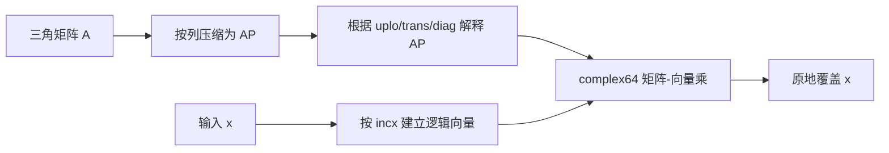
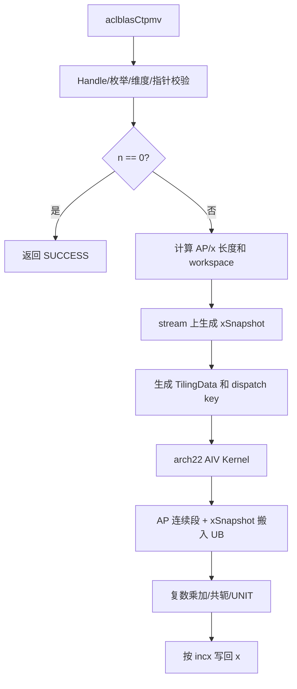
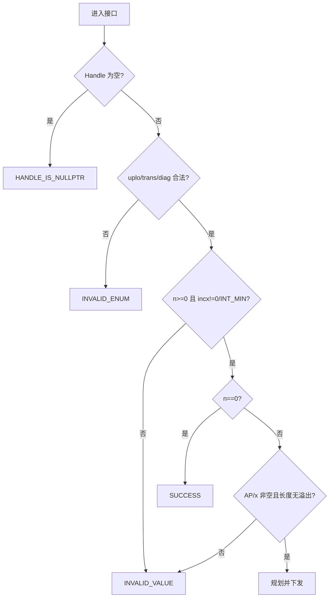
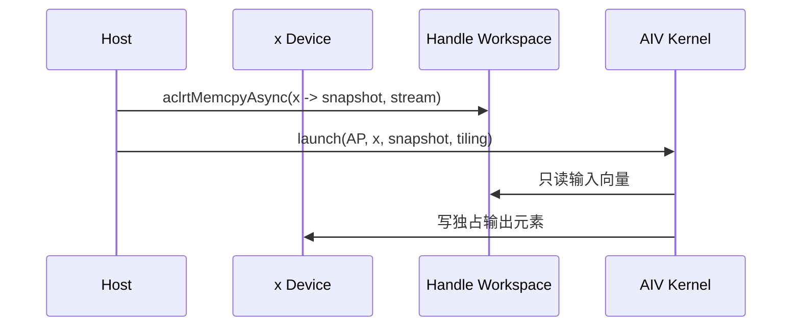
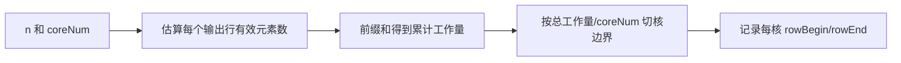
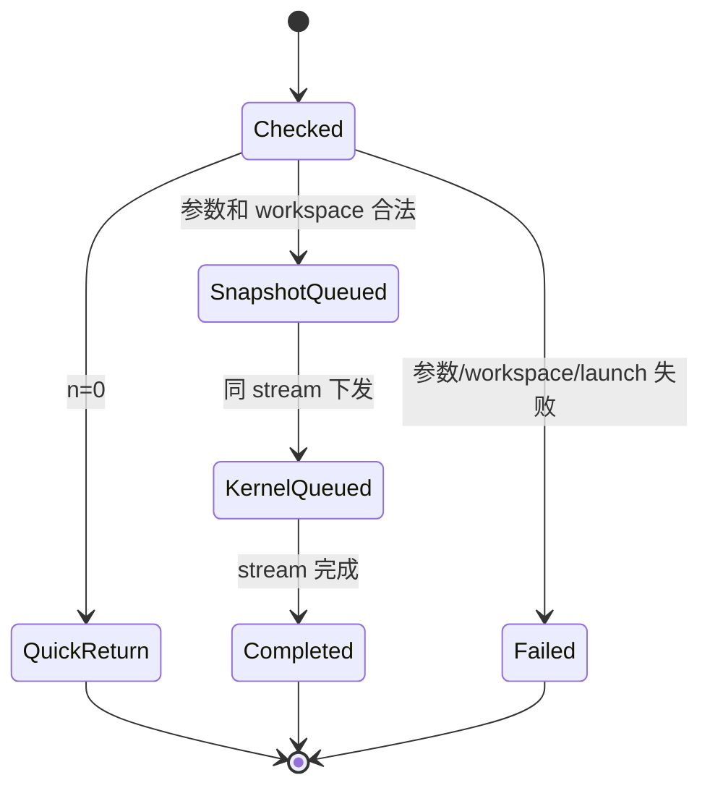

# aclblasCtpmv 算子设计文档（Atlas A2/A3）

| 文档版本 | 日期 | 作者/团队 | 说明 |
| --- | --- | --- | --- |
| V1.0 | 2026-08-26 | BaoBao2076 | 按社区任务 CheckList 完整整理 A2/A3 评审稿 |

> 目标代码目录为 `ops-blas/blas/tpmv/arch22/`，测试目录为 `ops-blas/test/tpmv/ctpmv/arch22/`。本文只描述 Atlas A2/A3（DAV_2201）方案。

# 一、需求背景

## 1.1 需求来源

本需求来源于 2026 年 8 月社区任务 `aclblasCtpmv`，要求在 Atlas A2/A3 上用 Ascend C 实现单精度复数三角压缩矩阵-向量乘，完成公共 API、Host、Kernel、精度、异常和性能验证，语义与 cuBLAS `cublasCtpmv`、Netlib `ctpmv` 一致。

## 1.2 背景介绍

TPMV 属于 BLAS Level 2。对 n 阶三角矩阵，仅保存上三角或下三角的 `n(n+1)/2` 个元素，并按列连续压缩到一维 AP 中，相比完整矩阵将存储从 `n*n` 降低近一半。与 TBMV 不同，TPMV 保存整个三角区域，不存在带宽 k 和前导维 lda。

仓内已有实数版 `aclblasStpmv` 的工程结构。本任务新增 complex64 乘加、`OP_C` 共轭转置、正负 `incx`、UNIT 对角不读以及原地并行安全，并在公共头文件中新增与其他产品线共用的接口声明。

## 1.3 功能与标杆

计算公式：

$$x\leftarrow op(A)x,\quad op(A)\in\{A,A^T,A^H\}$$

| 项目 | 标杆语义 | 本任务 |
| --- | --- | --- |
| dtype | complex64 | complex64 |
| matrix format | triangular packed | 完全对齐 |
| operation | N/T/C | 完全对齐 |
| diagonal | UNIT/NON_UNIT | UNIT 不读取 AP 对角 |
| stride | `incx!=0`，支持负值 | 完全对齐 |
| execution | 库内部并行 | Handle stream 上 AIV Kernel |



## 1.4 需求价值

- 补齐复数 packed BLAS 能力并与同族实数接口一致；
- 直接消费压缩矩阵，避免展开到稠密矩阵造成额外显存和带宽；
- 为 TPSV 等 packed 三角算子沉淀 AP 下标、步长和原地处理能力；
- 在 A2/A3 和其他产品线之间保持同一公开 ABI。

# 二、需求分析

## 2.1 外部依赖

| 依赖 | 用途 | 约束 |
| --- | --- | --- |
| CANN 9.1.0 | ACL Runtime、stream、Kernel launch | 验收版本 |
| Ascend C DAV_2201 | A2/A3 Kernel 编译 | arch22 |
| ops-blas 公共层 | Handle、类型、状态码、构建 | 不新增私有 API |
| Netlib CBLAS | 精度 Golden | `ctpmv` |
| cuBLAS | 参数与性能标杆 | `cublasCtpmv` |

## 2.2 内部模块

| 模块 | 职责 |
| --- | --- |
| 公共头文件 | 声明 `aclblasCtpmv` |
| `ctpmv_host.cpp` | 校验、长度溢出、workspace、tiling、launch |
| `ctpmv_tiling_data.h` | Host/Kernel 定长参数协议 |
| `ctpmv_kernel.cpp` | AP 解码、复数乘加、共轭、写回 |
| 测试模块 | CSV、Golden、NPU wrapper、精度/性能/异常 |

## 2.3 接口原型

```cpp
aclblasStatus_t aclblasCtpmv(
    aclblasHandle_t handle,
    aclblasFillMode_t uplo,
    aclblasOperation_t trans,
    aclblasDiagType_t diag,
    int n,
    const aclblasComplex* AP,
    aclblasComplex* x,
    int incx);
```

## 2.4 参数语义

| 参数 | 角色 | 语义与校验 |
| --- | --- | --- |
| handle | 输入 | 有效 Handle，空返回 `HANDLE_IS_NULLPTR` |
| uplo | 属性 | UPPER/LOWER，非法返回 `INVALID_ENUM` |
| trans | 属性 | N/T/C，非法返回 `INVALID_ENUM` |
| diag | 属性 | NON_UNIT/UNIT，UNIT 对角禁止读取 |
| n | 输入 | `n>=0`；n=0 quick return |
| AP | 输入 | Device complex64，长度 `n(n+1)/2` |
| x | 输入/输出 | Device complex64，原地覆盖 |
| incx | 输入 | 非零正负步长；拒绝 INT_MIN |

## 2.5 支持范围

| 维度 | 支持能力 |
| --- | --- |
| 硬件 | Atlas 800I/T A2、Atlas 800I A3 |
| dtype | complex64 |
| storage | UPPER/LOWER packed column-major |
| operation | N/T/C |
| diagonal | UNIT/NON_UNIT |
| shape | 动态 n，n>=0 |
| stride | `incx!=0`，正负均支持 |
| original output | x 原地更新 |
| async | Handle stream 异步执行 |

## 2.6 AP 存储规则

UPPER 模式按列保存 `A(0,j)..A(j,j)`：

$$APIndex_U(i,j)=i+\frac{j(j+1)}{2},\quad i\le j$$

LOWER 模式按列保存 `A(j,j)..A(n-1,j)`：

$$APIndex_L(i,j)=i+\frac{(2n-j-1)j}{2},\quad i\ge j$$

等价写法也可将列起点表示为 `j*(2*n-j+1)/2`，再加 `i-j`。实现必须统一使用一个经单元测试验证的公式，所有乘法使用 64 位中间量。

```mermaid
flowchart TD
    A[逻辑坐标 i,j] --> B{uplo}
    B -- UPPER --> C{i <= j?}
    B -- LOWER --> D{i >= j?}
    C -- 否 --> X[未存储，不访问]
    D -- 否 --> X
    C -- 是 --> U[idx=i+j*(j+1)/2]
    D -- 是 --> L[idx=i+(2*n-j-1)*j/2]
    U --> P[读取 AP[idx]]
    L --> P
```

## 2.7 边界和 quick return

- n=0 返回 SUCCESS，不引用 AP/x；
- n>0 时 AP/x 不得为空；
- AP 长度通过 `n*(n+1)/2` 计算，Host 检查乘法溢出；
- x 物理长度为 `1+(n-1)*abs(incx)`；
- UNIT 对角位置即使包含 NaN/Inf 也不能读取；
- 未存储三角不参与计算；不支持批处理和任意 stride view。

## 2.8 需求拆解

1. 公共 ABI 与参数合法性；
2. UPPER/LOWER AP 地址解析；
3. N/T/C、UNIT/NON_UNIT 组合语义；
4. x 快照、负步长和输出独占分核；
5. packed 连续段搬运、UB tile 和复数向量化；
6. 精度、异常、安全和性能闭环。

# 三、需求详细设计

## 3.1 总体架构



## 3.2 Host 侧设计

### 3.2.1 参数检查流程



quick return 发生在 AP/x 检查之前，但 Handle、枚举和 n/incx 基本合法性之后。这样 n=0 时空 AP/x 合法，同时非法属性仍返回确定错误。

### 3.2.2 原地安全和 workspace

并行输出不能读取正在被其他核覆盖的 x，因此使用完整物理 x 快照。所需空间：

$$workspaceBytes=(1+(n-1)|incx|)\times sizeof(complex64)$$



Host 检查 workspace 地址、容量和与 AP/x 的别名关系。快照和 Kernel 必须进入同一 Handle stream；API 内不做全设备同步，也不临时申请无法安全异步释放的 Device 内存。

### 3.2.3 TilingData 与 dispatch

| 字段 | 含义 |
| --- | --- |
| n/incx/xCount | 逻辑维度、步长、物理长度 |
| uplo/trans/diag | 属性组合 |
| rowsPerBlock | 本核连续输出范围 |
| tileRows/tileCols | UB tile |
| apCount | AP 元素数，调试/边界校验 |
| tailRows/tailCols | 边界有效长度 |

Dispatch key 由 `uplo × trans × diag × contiguousStride × shapeClass` 组成。`n=1` 和 diagonal/UNIT 可走轻量路径；N/T/C 分离实例化，避免热循环反复判断。

### 3.2.4 分核策略

- 每个输出逻辑元素只由一个核负责，输出无需原子；
- 按连续输出行分核，核内按输入列 tile 遍历；
- UPPER/LOWER 的每行有效长度不同，Host 以近似三角乘加数做负载均衡，而非只按行数平均；
- 小 n 限制 blockDim，避免启动大量空核；
- 大 n 的三角长尾可通过非等长输出区间使每核乘加量接近。



## 3.3 Kernel 侧设计

### 3.3.1 主流程

```mermaid
flowchart TD
    A[初始化 GM/UB Tensor] --> B[读取本核输出范围]
    B --> C[清零 output real/imag]
    C --> D{输入 tile 完成?}
    D -- 否 --> E[将 op(A) 坐标映射回原矩阵]
    E --> F[求 AP 连续段并搬入 UB]
    F --> G{UNIT 对角?}
    G -- 是 --> H[使用 1+0i，不读 AP]
    G -- 否 --> I[读取 AP，OP_C 虚部取反]
    H --> M[与 xSnapshot 做复数乘加]
    I --> M
    M --> D
    D -- 是 --> O[实虚交错，按 incx 写回]
```

### 3.3.2 坐标和转置

| trans | 原矩阵坐标 | 共轭 |
| --- | --- | --- |
| N | `(out,j)` | 否 |
| T | `(j,out)` | 否 |
| C | `(j,out)` | 是 |

先映射坐标，再判断其是否属于 UPPER/LOWER，最后计算 AP 下标。禁止先计算无符号下标再判断，因为 `i-j` 或 `j-i` 可能下溢。

### 3.3.3 packed 连续段搬运

AP 按原矩阵列连续压缩。N 路径对某一输出行的 AP 访问可能是跨列 gather；T/C 路径往往能消费原矩阵某一列的连续区间。设计分两类搬运：

1. 连续列段：使用对齐 DataCopy 一次搬入；
2. 跨列点集：先生成合法下标，使用 Gather 或合并相邻短段，避免逐元素 GM 标量读取成为热路径。

```mermaid
flowchart TD
    A[当前 op(A) tile] --> B[生成合法原矩阵坐标]
    B --> C{AP 下标连续?}
    C -- 是 --> D[单次连续 DataCopy]
    C -- 否 --> E[合并相邻 segment]
    E --> F[分段 DataCopy/Gather]
    D --> G[UB complex tile]
    F --> G
```

### 3.3.4 复数计算和尾块

复数乘加采用 FP32 分量：

$$r\mathrel{+}=a_r x_r-a_i x_i,\quad i\mathrel{+}=a_r x_i+a_i x_r$$

`OP_C` 对 `a_i` 取负。所有 UB 缓冲先清零；尾块以有效元素数生成 mask；输出交错前确保无效 lane 不参与归约。UNIT 判断必须早于 AP load，避免对角 NaN 传播。

### 3.3.5 x 正负步长

$$p(i)=\begin{cases}i\cdot incx,&incx>0\\(n-1-i)\cdot |incx|,&incx<0\end{cases}$$

`abs(incx)==1` 走连续快路；大步长使用 Gather/Scatter。物理空洞元素不应改变，测试以初始值和 canary 验证。

### 3.3.6 UB 规划

| 区域 | 用途 |
| --- | --- |
| AP segment buffer | packed 连续段 |
| A real/imag | 解包后的复数系数 tile |
| x interleaved/real/imag | 输入快照 tile |
| acc real/imag | 输出累加器 |
| index/mask | AP gather 下标和尾块 mask |
| output interleaved | 写回 staging |

tile 大小根据 DAV_2201 UB 容量和对齐要求计算。总量必须在编译/tiling 阶段明确核算，保留 API 临时区和安全余量。若不足则缩小 tile，不允许覆盖相邻 LocalTensor。

## 3.4 性能策略

1. N/T/C 分离编译，减少属性分支；
2. 优先利用 AP 原始列连续性，跨列访问合并 segment；
3. `incx=1` 连续搬运，性能用例走快路；
4. complex64 实虚向量化，避免循环内大量 `GetValue/SetValue`；
5. 工作量分核缓解三角行长不均；
6. 仅生成 x 快照，不展开 A；
7. `n=1`、UNIT 等退化场景走短路径。

## 3.5 异步、生命周期和错误处理



- API 成功表示任务已入队，不代表 Device 已完成；
- 用户在同步前保持 AP、x、workspace、Handle 有效；
- memcpy/launch 错误映射到统一 BLAS 状态码；
- Kernel 不读取未存储三角，不写 x 物理空洞。

## 3.6 与 TBMV/稠密 TRMV 的差异

| 算子 | 存储 | Host 关键量 | Kernel 关键点 |
| --- | --- | --- | --- |
| TRMV | lda*n 完整三角容器 | lda | 规则二维地址 |
| TBMV | `(k+1)*n` 带状 | k、lda | 带行坐标 |
| TPMV | `n(n+1)/2` packed | 无 lda | 三角数下标、连续段变化 |

# 四、特性交叉分析

## 4.1 兼容性分析

| 特性 | 风险 | 方案 |
| --- | --- | --- |
| A2/A3 UB/核数差异 | 固定参数失效 | 平台查询后生成 tile/blockDim |
| 与 Stpmv 同族 | API/构建冲突 | 复用公共框架，complex Kernel 独立 |
| N/T/C × U/L × UNIT | 分支遗漏 | 12 组合正交测试 |
| packed × 大 n | 三角数溢出 | 64 位计算和上限校验 |
| 原地 × 多核 | 数据竞争 | 完整 x 快照、输出独占 |
| 负 incx | 下标反向/越界 | Host 拒绝 INT_MIN，Kernel 64 位映射 |

## 4.2 安全和资源

- AP/x/workspace 的字节区间在 Host 侧计算并校验；
- AP 只读，UNIT 对角和另一三角不可产生 GM load；
- 每核写独占的逻辑输出，物理映射仍一一对应；
- workspace 少一字节必须在 launch 前失败；
- 首尾 canary、空洞元素和保护值验证无越界读写；
- 固定归约顺序，不依赖无序原子。

## 4.3 风险与规避

| 风险 | 影响 | 规避措施 |
| --- | --- | --- |
| LOWER AP 公式 off-by-one | 全面精度错误/越界 | 小矩阵手工表和 n=1/2/3 单测 |
| 无符号减法下溢 | 超大非法地址 | 合法性判断早于下标计算 |
| AP gather 过于离散 | 性能不达标 | 合并 segment、T/C 连续列快路 |
| x 快照 stream 不一致 | 随机错误 | 同一 Handle stream 的异步复制和 launch |
| UB 规划超限 | 编译/运行异常 | 字节表核算、静态断言、缩 tile 降级 |

# 五、可维可测分析

## 5.1 可维护性

- AP 下标封装为经过 Host 单测的 helper；
- Host、Kernel、Golden 分别实现但共享同一数学规范；
- dispatch key、TilingData 字段和 LocalMemory 字节表显式记录；
- 日志包含 n/incx、属性、AP/x/workspace 字节数和 blockDim；
- packed 搬运策略与复数计算解耦，便于后续优化。

## 5.2 测试设计

### 5.2.1 测试层级与证据追踪

测试采用“接口层—Kernel 层—基准层—资源层”的闭环；每一层都保留可复现输入、日志和判定结果，重点覆盖 packed 下标和空洞步长。

| 层级 | 验证内容 | 主要证据 | 通过门槛 |
| --- | --- | --- | --- |
| 接口层 | 枚举、n/incx、空指针、quick return | GTest/CSV 返回值日志 | 与任务书逐项一致 |
| Kernel 层 | U/L、N/T/C、UNIT、AP 下标、stride、尾块 | NPU 输出、canary、AP 保护值 | 无越界且指定元素正确 |
| Golden 层 | Netlib `ctpmv` 对照 | 实部/虚部误差、匹配率、最大误差 | `rtol/atol`、匹配率和 max error 同时达标 |
| 资源层 | x snapshot、workspace、stream、AP 搬运 | Profiler、workspace 边界日志 | 无隐式同步/fallback，资源不越界 |
| 性能层 | 任务书 P-01/P-02/P-03 | warmup、有效采样、平均耗时 | 不高于任务书标杆 |

### 5.2.2 可复现执行口径

CSV 用例、随机种子、编译目标和 CANN/驱动版本写入测试报告；性能测试先 warmup，再进行超过 50 次有效采样，报告平均值并附 Kernel/Profiler 原始证据。packed AP 的 n=1/2/3 手工下标表作为回归附件。

| 分类 | 覆盖内容 |
| --- | --- |
| 属性 | U/L × N/T/C × UNIT/NON_UNIT 12 组合 |
| shape | n=0/1/2/3、质数、2 的幂及 ±1、非对齐、大尺寸 |
| stride | incx=±1/±2/±3，空洞保持不变 |
| AP 手工 | n=1/2/3 的 UPPER/LOWER 下标逐项核对 |
| complex | 纯实、纯虚、共轭敏感、抵消、随机、Inf/NaN |
| 未读 | UNIT 对角填 NaN，验证输出不传播 |
| 异常 | 空 Handle/AP/x、非法枚举、负 n、incx=0/INT_MIN |
| workspace | 空、不足一字节、别名和非默认 stream |
| 安全 | AP/x 首尾 canary、x 空洞和边界 tile |
| 性能 | 三个任务书 case，warmup 后采样 >50 次 |

## 5.3 精度标准

Golden 使用 Netlib/CBLAS `ctpmv`。实部、虚部分别满足：

$$|actual-golden|\le 2^{-16}+2^{-10}|golden|$$

匹配率不低于 0.99，最大绝对误差不超过 `1e-2` 或 `32 ULP`。

## 5.4 性能标准

| case | n | uplo | trans | diag | incx | Avg time 上限 |
| --- | ---: | --- | --- | --- | ---: | ---: |
| P-01 | 512 | UPPER | N | NON_UNIT | 1 | 18.53 us |
| P-02 | 1024 | LOWER | N | NON_UNIT | 1 | 39.34 us |
| P-03 | 2048 | UPPER | T | NON_UNIT | 1 | 86.02 us |

设备为 Atlas 800I A2（910B3）。Profiler 报告 Kernel 总耗时、AIV/HBM 指标、AP 搬运 segment 数、各核耗时分布，并确认无 CPU fallback 和隐式全设备同步。

## 5.5 交付件

1. 设计文档及评审记录；
2. 公共 API、Host、Kernel、Tiling 代码；
3. CSV、Golden、NPU wrapper 和测试说明；
4. 精度、异常、性能、Profiler 自测报告；
5. README 和待验收代码地址。
