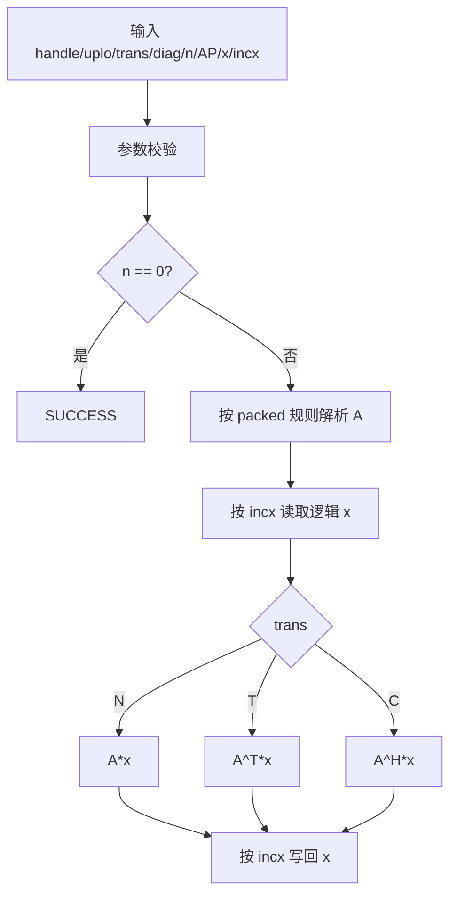
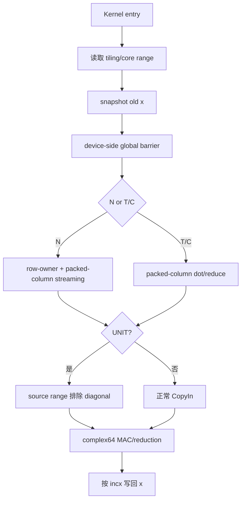

# aclblasCtpmv 算子设计文档
> TeamName：hlw246
> 目标产品：Atlas A2/A3（arch22）
> 数据类型：COMPLEX64

# 一、需求背景

## 1.1 需求来源
本任务来自 CANN 2026 社区任务，目标是在 Atlas A2/A3 上使用 Ascend C 实现
单精度复数三角压缩矩阵-向量乘算子 `aclblasCtpmv`，并完成公共 API、Host、
Kernel、精度、异常和性能验证。
接口语义以任务书为准，packed 数学语义参考 Netlib `ctpmv`，实现接入
`ops-blas` 现有 handle/stream 直调框架。

## 1.2 背景介绍

### 1.2.1 标杆算子支持的数据类型和数据格式
TPMV（Triangular Packed Matrix-Vector Multiply）属于 BLAS Level-2，计算：
`x = op(A) * x`，其中 `op(A) ∈ {A, A^T, A^H}`。
其中 A 为 n 阶三角矩阵，只保存 UPPER 或 LOWER 三角区域的
`n(n+1)/2` 个元素，并按列压缩到一维数组 AP。
本任务支持：

| 项目 | 支持范围 |
| --- | --- |
| 数据类型 | COMPLEX64 / `aclblasComplex` |
| matrix | UPPER / LOWER |
| operation | N / T / C |
| diagonal | NON_UNIT / UNIT |
| vector stride | 非零正负 `incx` |
| output | x 原地更新 |
| storage | column-major packed |
公共接口为：

```cpp
aclblasStatus_t aclblasCtpmv(
    aclblasHandle_t handle,
    aclblasFillMode_t uplo,
    aclblasOperation_t trans,
    aclblasDiagType_t diag,
    int n,
    const aclblasComplex* AP,
    aclblasComplex* x,
    int incx);
```
不新增 Atlas A2/A3 私有 legacy API。

### 1.2.2 标杆算子实现描述
UPPER 按列保存：
`A00, A01, A11, A02, A12, A22, ...`
对应下标：
`upperIndex(i,j) = i + j*(j+1)/2, i<=j`。
LOWER 按列保存：
`A00, A10, ..., A(n-1)0, A11, A21, ..., A(n-1)1, ...`
对应下标：
`lowerColumnStart(j)=j*(2*n-j+1)/2`，`lowerIndex(i,j)=lowerColumnStart(j)+(i-j)=i+j*(2*n-j-1)/2, i>=j`。
任务材料中的 LOWER 展开式与 Netlib/CBLAS 的 0-based packed column-major
定义在 `j>0` 时存在索引表达差异，实现和 golden 采用标准 packed 语义。
手工校验：
`n=2 LOWER: [A00,A10,A11]`；`n=3 LOWER: [A00,A10,A20,A11,A21,A22]`。
逻辑向量元素对应物理位置：
`incx>0` 时 `physicalPos(i)=i*incx`；`incx<0` 时 `physicalPos(i)=(n-1-i)*abs(incx)`。
`diag=UNIT` 时主对角视为 `1+0i`，实现不得读取 AP 中对应对角槽。

### 1.2.3 标杆算子实现流程图



# 二、需求分析

## 2.1 外部组件依赖

| 依赖 | 用途 |
| --- | --- |
| CANN Runtime | device 指针、stream、Kernel launch、错误返回 |
| Ascend C | AIV Kernel、GM/UB 搬运、Vector 计算 |
| Netlib/CBLAS | packed 语义和精度 golden |
| ops-blas 公共层 | handle、状态码、公共类型和构建框架 |
不引入新的第三方运行时依赖。

## 2.2 内部适配模块
实现目录：
`blas/tpmv/arch22/`
测试目录：
`test/tpmv/ctpmv/arch22/`
主要参考现有模块：
- Stpmv：packed 地址、AIV launch、DataCopy/DataCopyPad、stride 处理；
- Cdot/Sdot：active workspace、异步 launch、device-side 跨核同步；
- Cgemv/Ctrmv：COMPLEX64 实虚分量计算与向量化方式。
Ctpmv 只复用工程模式和可验证的数据流，不继承 legacy API、旧 packed 公式、
内部 malloc/free 或不符合本任务约束的同步行为。

## 2.3 需求模块设计

### 2.3.1 Ascend C 算子原型
公共 API：

```cpp
aclblasStatus_t aclblasCtpmv(
    aclblasHandle_t handle,
    aclblasFillMode_t uplo,
    aclblasOperation_t trans,
    aclblasDiagType_t diag,
    int n,
    const aclblasComplex* AP,
    aclblasComplex* x,
    int incx);
```
参数检查顺序：
1. handle；
2. uplo/trans/diag；
3. n<0；
4. incx==0；
5. n==0 quick return；
6. n>0 时 AP/x 非空；
7. 派生长度、workspace 和 launch 条件。
状态码：

| 场景 | 返回 |
| --- | --- |
| handle 为空 | `ACLBLAS_STATUS_HANDLE_IS_NULLPTR` |
| enum 非法 | `ACLBLAS_STATUS_INVALID_ENUM` |
| n<0 / incx=0 / AP或x非法 | `ACLBLAS_STATUS_INVALID_VALUE` |
| workspace 不足 | `ACLBLAS_STATUS_ALLOC_FAILED` |
| runtime / launch 失败 | `ACLBLAS_STATUS_EXECUTION_FAILED` |

### 2.3.2 Ascend C 算子相关约束
支持 `2 × 3 × 2 = 12` 种 UPPER/LOWER × N/T/C × UNIT/NON_UNIT 组合。
`n=0` 为合法 no-op：
- 不访问 AP；
- 不访问 x；
- 不使用 workspace；
- 不 launch Kernel；
- 返回 SUCCESS。
x 为原地输入输出。多核直接一边读取旧 x、一边写新 x 会产生读写依赖，
因此主计算前先保存调用前逻辑 x。

# 三、需求详细设计

## 3.1 调用方式

```text
应用
  ↓
aclblasCtpmv
  ↓
Host 参数检查 / tiling / workspace 检查
  ↓
N   → ctpmv_n
T/C → ctpmv_tc
  ↓
Kernel
  snapshot old x
  → device barrier
  → compute
  → writeback x
```
API 内不执行 `aclrtMalloc`、`aclrtFree` 或 `aclrtSynchronizeStream`。

## 3.2 需求总体设计

### 3.2.1 Host 侧设计

#### 3.2.1.1 分核策略
三角矩阵每个输出元素的有效乘加数不同，采用 MAC-weighted contiguous
partition，而不是按行数平均切分。
OP_N：
`UPPER: work(i)=n-i`；`LOWER: work(i)=i+1`。
累计工作量：
`Pupper(k)=k*(2*n-k+1)/2`；`Plower(k)=k*(k+1)/2`。
OP_T/OP_C 的 UPPER/LOWER 使用相反两种工作量。
对候选核数 p：
`target(c)=floor(c*totalWork/p)`，`boundary(c)=min{k | P(k)>=target(c)}`。
使用宽整数计算边界，生成连续且互不重叠的输出区间。
候选核数根据平台 AIV core 数、n 和最小有效输出 tile 动态确定，
避免小 n 启动过多空核或大量过短 DMA。
最终每个输出逻辑元素只有一个 owner，不使用跨核 atomic 作为正确性基础。

#### 3.2.1.2 数据分块和内存优化策略
x 为原地参数，使用 handle active workspace 保存连续逻辑快照。
workspace 逻辑布局：

```text
[ sync/control region ][ aligned xSnapshot[0:n) ]
```
Phase 1：

```text
incx == 1:
连续 GM → UB → xSnapshot
abs(incx) > 1:
按 physicalPos(i) gather → UB → xSnapshot
```
所有参与计算的 core 完成 snapshot 后进入 device-side barrier，
barrier 完成后才允许写回原 x。
N 路径按输出 row tile 累加；当 owner range 大于 UB 可容纳的 TY 时，
继续划分为多个连续 output sub-tile。
LocalMemory 主要包含：
- AP tile；
- AP real/imag；
- xSnapshot tile；
- accumulator real/imag；
- product/reduction 临时区；
- output pack；
- padding/event scratch。
定义：

```text
C8(q) = AlignUp(8*q, 32)
F4(q) = AlignUp(4*q, 32)
```
保守预算：

```text
B_N =
    D_A*(C8(TA)+2*F4(TA))
  + D_X*(C8(TX)+2*F4(TX))
  + 4*F4(TY)
  + C8(TY)
  + R_N + M_extra
B_TC =
    D_A*(C8(TA)+2*F4(TA))
  + D_X*(C8(TX)+2*F4(TX))
  + 2*F4(TY)
  + C8(TY)
  + R_TC + M_extra
```
要求：

```text
U_available >= max(B_N, B_TC)
```
`TA/TX/TY`、queue depth 和临时区大小根据实际 Ascend C API、编译资源和
正式设备 profiling 决定。

#### 3.2.1.3 tilingKey 规划策略
N 与 T/C 的访问方向和计算模式不同，Host 在 launch 前区分两类数据流：

```text
OP_N   → ctpmv_n
OP_T/C → ctpmv_tc
```
当前方案不额外使用数值 tilingKey，而是通过不同 Kernel entry 消除主路径
的大段运行时分支。
T/C 共用 `ctpmv_tc`，使用 `conjugate` 标志区分 T 和 C。
tiling data 至少包含：

```text
n / uplo / diag / conjugate
incx / absInc
useCoreNum
per-core [start,end)
TA / TX / TY
queue depth
snapshot offset
```
未来若 profiling 证明 UPPER/LOWER 或 shape class 需要进一步特化，
再增加对应 tilingKey，不按公开性能 case 硬编码。

### 3.2.2 Kernel 侧设计

#### 3.2.2.1 Kernel 实现原理
Kernel 首先由所有 active core 协作生成连续 `xSnapshot`，随后执行
device-side global barrier，再进入主计算。
OP_N 最终采用：
`row-owner + packed-column streaming + local accumulator + no atomic`。
每个 core 独占一个连续输出 row range，并遍历 packed column j。
UPPER 第 j 列有效行：
`[0,j]`。
LOWER 第 j 列有效行：
`[j,n-1]`。
本核只搬该列与 row tile 的连续交集。每个 AP 元素只有一个输出 owner，
同一列可能被多个 core 分成多个连续 DMA segment。
T/C 固定输出 i 时直接读取原矩阵第 i 列：

```text
UPPER:
AP        = A(0,i) ... A(i,i)
xSnapshot = x(0) ... x(i)
LOWER:
AP        = A(i,i) ... A(n-1,i)
xSnapshot = x(i) ... x(n-1)
```
AP 和 xSnapshot 均为连续 segment。
OP_C 只对矩阵 A 的虚部取反，不对 x 做共轭。
COMPLEX64 计算：
`prodReal=ar*xr-ai*xi`，`prodImag=ar*xi+ai*xr`，并分别累加到实部、虚部；OP_C 先执行 `ai=-ai`。
中间计算保持 FP32。
UNIT 时必须在 GM CopyIn 前排除对角：

```text
UPPER: diagonal 位于 segment 末端 → source length 减一
LOWER: diagonal 位于 segment 起点 → source start 加一
```
随后显式加入 `xSnapshot[i]`。禁止先读取 AP diagonal 再在 UB 中覆盖。

#### 3.2.2.2 Ascend C 实现流程图



#### 3.2.2.3 Ascend C 流程与标杆流程差异及原因

| 差异 | Ascend C 设计 | 原因 |
| --- | --- | --- |
| 原地更新 | 先生成 xSnapshot，再 barrier | 避免多核读取被提前覆盖的旧 x |
| N 路径 | 按 packed column 与 row tile 求连续交集 | AP 按原矩阵列连续，减少跨列 gather |
| T/C 路径 | 直接消费连续 packed column | 转置后每个输出对应原矩阵一列 |
| 多核输出 | 每个输出唯一 owner | 避免 atomic 和跨核 partial reduction |
| UNIT | GM source range 直接排除 diagonal | 满足任务要求的“不读取 AP 对角” |
| stride | snapshot/writeback 处理物理 stride | 主计算统一使用连续逻辑 x |

## 3.3 支持硬件

| 产品 | 支持 |
| --- | --- |
| Atlas A2（910B3） | √ |
| Atlas A3 | √ |
实现路径：
`blas/tpmv/arch22/`
正式性能验收环境为 Atlas A2（910B3）/CANN 9.1.0。

## 3.4 算子约束限制
- 仅支持 COMPLEX64；
- n>=0；
- incx!=0；
- n>0 时 AP/x 有效；
- 标准 UPPER/LOWER packed column-major；
- UNIT 不读取 AP diagonal；
- x 原地覆盖，stride gap 保持不变；
- 不支持 lda、batch、broadcast 或矩形矩阵；
- 不展开 A 为 dense matrix；
- workspace 不足不使用整算子 fallback。

# 四、特性交叉分析

| 交叉特性 | 风险 | 设计处理 |
| --- | --- | --- |
| 原地 × 多核 | 新 x 覆盖旧 x | snapshot → barrier → compute |
| packed × N | 单行跨列访问离散 | packed-column streaming |
| packed × T/C | 需要连续归约 | 直接读取 packed column |
| UNIT × DataCopy | 对角被批量读入 | source start/length 排除 diagonal |
| negative incx × 原地 | 逻辑/物理地址反向 | snapshot/writeback 使用 physicalPos |
| complex × OP_C | 共轭对象错误 | 仅对 A imag 取反 |
| 三角形 × 多核 | 工作量不均 | MAC-weighted partition |
| UB × 大 n | accumulator 无法整体驻留 | output sub-tile |

# 五、可维可测分析

## 5.1 精度标准 / 性能标准
Golden 使用 Netlib/CBLAS `ctpmv`。
COMPLEX64 实部、虚部分别按 FLOAT32 判定：
`rtol=2^-10`，`atol=2^-16`，`required_matched_ratio>=0.99`，`max_abs_error<=1e-2` 或满足 32 ULP 条件。
逐分量：
逐分量满足 `|actual-golden| <= atol + rtol*|golden|`。
功能测试覆盖：
- 12 种 U/L × N/T/C × UNIT/NON_UNIT；
- `incx=±1/±2/±3`；
- n=0/1/2/3、奇数、2 的幂、非对齐和扩展尺寸；
- uniform / normal / zero / alternating / extreme；
- Inf / NaN；
- nullptr、非法 enum、n<0、incx=0；
- LOWER n=2/n=3 手工 packed case；
- UNIT diagonal poison；
- stride gap/canary；
- workspace 和分核边界。
UNIT poison 只用于验证结果不依赖 AP diagonal value；物理 no-read 通过
source range、DataCopy source count 和代码静态审查确认。
正式性能硬指标：

| n | uplo | trans | diag | incx | Avg time 上限 |
| ---: | --- | --- | --- | ---: | ---: |
| 512 | UPPER | N | NON_UNIT | 1 | 28.95 us |
| 1024 | LOWER | N | NON_UNIT | 1 | 61.46 us |
| 2048 | UPPER | T | NON_UNIT | 1 | 134.41 us |
性能测试先 warmup，再取得 >50 次有效采样，使用微秒级 device/stream timing
并报告 Avg time。GTest 整数毫秒 wall time 不作为硬性能证明。

## 5.2 兼容性分析
- 只新增公共 `aclblasCtpmv`，不改变已有 BLAS API；
- A2/A3 共用 arch22 实现；
- 公共 API 不依赖固定测试 shape；
- 正负 incx 共用相同主计算语义；
- workspace 沿用 handle 既有生命周期；
- 不使用 CPU、其他 backend 或 whole-op fallback；
- 当前开发环境数据不替代正式 910B3/CANN 9.1.0 结果。

# 六、交付和验证闭环
实现阶段涉及：
`include/cann_ops_blas.h`、`blas/tpmv/arch22/`、`test/tpmv/ctpmv/arch22/`。
代码 PR 前完成：
- 全量功能和异常测试；
- LOWER hand case；
- UNIT no-read 白盒检查；
- workspace/stride/canary；
- 精度报告；
- 三条正式 hard case 性能报告；
- 910B3/CANN 9.1.0 环境记录。
本设计只保留 checklist 所需的最终方案、流程和验收边界；
详细调研、备选方案比较和开发机探测结果另行保存。
