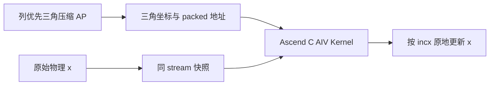
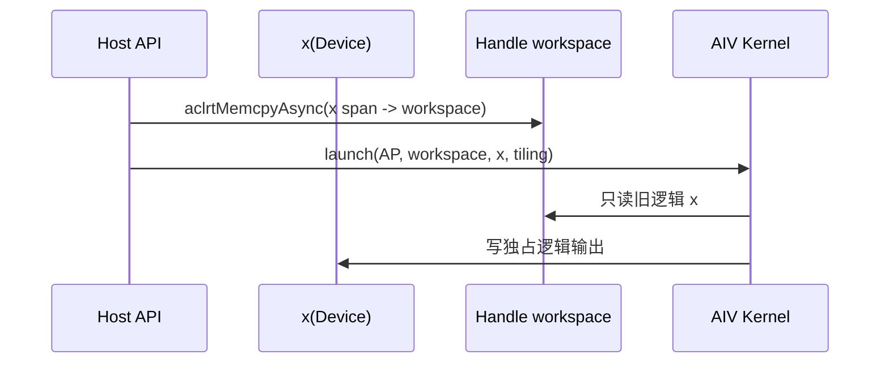
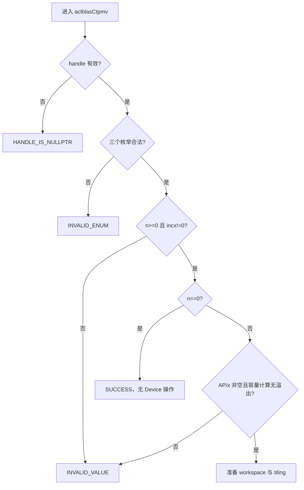
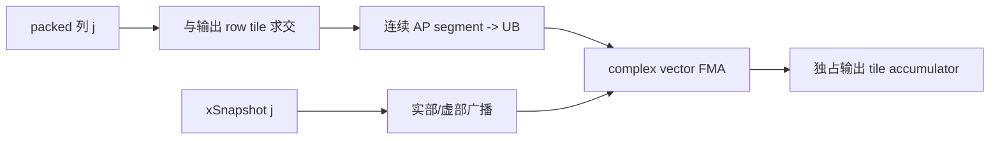

# aclblasCtpmv 算子设计文档（Atlas A2/A3）

| 文档版本 | 日期 | 作者/团队 | 状态 |
| --- | --- | --- | --- |
| V1.0 | 2026-08-28 | maxwell_0401 | 设计评审稿，尚未包含实现与实测结论 |

> 本文面向 `cann/ops-blas` 的 `blas/tpmv/arch22/` 实现，只描述 Atlas A2/A3 路径。公共接口声明放入 `include/cann_ops_blas.h`，不新增产品私有平行接口。

# 需求背景（required）

## 需求来源

本需求来自 2026 年 8 月社区任务 `aclblasCtpmv`。任务要求在 Atlas A2/A3 上使用 Ascend C 实现单精度复数三角压缩矩阵向量乘，以 cuBLAS `cublasCtpmv` 为接口和性能参考，以 Netlib `ctpmv` 为数学语义参考，最终合入 `cann/ops-blas`。

## 背景介绍

TPMV（Triangular Packed Matrix-Vector Multiply）属于 BLAS Level 2，计算：

$$
x \leftarrow op(A)x, \qquad op(A) \in \{A,A^T,A^H\}.
$$

`A` 是 `n x n` 三角矩阵。TPMV 不保存未引用三角，也不使用 `lda`，而是将指定三角按列连续压缩到 `AP`，元素数从 `n^2` 减少为 `n(n+1)/2`。输入向量 `x` 同时是原地输出，因此并行实现必须保证任何输出写回前，所有核后续需要的旧 `x` 值仍然可见。

与同族实数 `aclblasStpmv` 相比，本任务新增以下主要能力：

- `aclblasComplex` 的 FP32 实部、虚部复数乘加；
- `ACLBLAS_OP_C` 的共轭转置语义；
- UNIT 对角槽严格不读；
- 正负 `incx` 与物理空洞保持；
- 多核原地计算的数据竞争消除。



# 需求分析（required）

## 需求描述

新增下列公共接口，并在 Atlas A2/A3 的 arch22 目录提供实现：

```cpp
aclblasStatus_t aclblasCtpmv(
    aclblasHandle_t handle,
    aclblasFillMode_t uplo,
    aclblasOperation_t trans,
    aclblasDiagType_t diag,
    int n,
    const aclblasComplex* AP,
    aclblasComplex* x,
    int incx);
```

接口在 `handle` 绑定的 stream 上异步执行。`n=0` 是合法 no-op；`n>0` 时读取 `AP` 和旧 `x`，并只覆盖 `x` 中对应逻辑向量的元素。

## 功能合同

| 参数 | 位置 | 合同与异常行为 |
| --- | --- | --- |
| `handle` | Host | 必须是有效句柄；空指针返回 `ACLBLAS_STATUS_HANDLE_IS_NULLPTR` |
| `uplo` | Host | 仅支持 `ACLBLAS_UPPER/LOWER`；非法值返回 `ACLBLAS_STATUS_INVALID_ENUM` |
| `trans` | Host | 仅支持 `ACLBLAS_OP_N/T/C`；非法值返回 `ACLBLAS_STATUS_INVALID_ENUM` |
| `diag` | Host | 仅支持 `ACLBLAS_NON_UNIT/UNIT`；非法值返回 `ACLBLAS_STATUS_INVALID_ENUM` |
| `n` | Host | `n >= 0`；负值返回 `ACLBLAS_STATUS_INVALID_VALUE` |
| `AP` | Device | complex64 packed 输入，长度 `n(n+1)/2`；`n>0` 时不得为空 |
| `x` | Device | complex64 输入/输出，物理长度 `1+(n-1)*abs(incx)`；`n>0` 时不得为空 |
| `incx` | Host | 任意非零 `int`；零返回 `ACLBLAS_STATUS_INVALID_VALUE` |

属性组合必须完整支持 `2 x 3 x 2 = 12` 种情况，不按公开 case、固定 `n` 或 case 名称分派。

## Packed 存储规则

所有下标均为 0-based，并使用 64 位中间量计算。

UPPER 的第 `j` 列保存 `A(0,j)` 到 `A(j,j)`：

$$
APIndex_U(i,j)=i+\frac{j(j+1)}{2}, \qquad 0\le i\le j<n.
$$

LOWER 的第 `j` 列保存 `A(j,j)` 到 `A(n-1,j)`。列起点和元素下标分别为：

$$
LowerBase(j)=\frac{j(2n-j+1)}{2},
$$

$$
APIndex_L(i,j)=LowerBase(j)+(i-j)
=i+\frac{j(2n-j-1)}{2}, \qquad 0\le j\le i<n.
$$

任务书在声明 0-based 的同时给出了 `i+j(2n-j+1)/2`。该式比标准 LOWER packed 地址多出 `j`，会在列间产生空洞。实现采用 Netlib 逐列无间隙顺序和 cuBLAS 行为一致的 `-1` 元素公式；Host 单元测试用 `n=1/2/3` 的手工序列冻结这一边界。

例如 `n=3` 的 LOWER 存储必须是：

```text
[A00, A10, A20, A11, A21, A22]
```

## 转置、对角与步长语义

| `trans` | 第 `r` 个输出读取的原矩阵坐标 | 系数处理 |
| --- | --- | --- |
| `N` | `A(r,j)` | 不转置、不共轭 |
| `T` | `A(j,r)` | 只转置 |
| `C` | `A(j,r)` | 转置后对系数取共轭 |

`diag=ACLBLAS_UNIT` 时，对角系数直接使用 `1+0i`。实现必须在 GM 搬运前拆分区间，不能先读取对角槽再覆盖其值，因此 AP 对角放入 NaN/Inf 也不得污染输出。

逻辑元素 `x(i)` 的物理位置为：

$$
XPos(i)=
\begin{cases}
i\cdot incx,&incx>0,\\
(n-1-i)\cdot |incx|,&incx<0.
\end{cases}
$$

计算 `abs(incx)` 时先提升到 `int64_t` 再取负，避免 `INT_MIN` 的有符号溢出。只有物理跨度、字节数或 workspace 容量无法表示/满足时才返回资源或参数错误，不额外缩窄非零步长合同。

## 支持范围与约束

| 维度 | 支持范围 |
| --- | --- |
| 硬件 | Atlas A2 训练系列、Atlas A3 系列（arch22） |
| CANN | 9.1.0 验收环境 |
| dtype | `aclblasComplex`，实部/虚部均为 FP32 |
| matrix | 方阵、UPPER/LOWER、column-major packed |
| operation | N/T/C |
| diagonal | NON_UNIT/UNIT |
| vector | 原地、`incx!=0`、正负步长 |
| shape | 运行时 `n>=0` |

不涉及 `alpha`、`lda`、非方阵、broadcast、batch 或 AP 的任意 view。任务书自验章节中的 `alpha`、矩形矩阵和 `lda` 属于其他 BLAS 模板残留，不进入 TPMV 合同。

## 需求拆解

1. 在公共头文件新增唯一的 `aclblasCtpmv` ABI，并接入 arch22 构建。
2. Host 完成参数校验、64 位容量检查、workspace 规划、x 快照和 tiling。
3. Kernel 完成 N/T/C、UPPER/LOWER、UNIT/NON_UNIT 的复数 packed 计算。
4. 对连续 `incx=1` 和一般 signed stride 分别优化，但保持同一数学实现边界。
5. 以完整任务语料完成接口、精度、安全与性能验收，不使用 CPU 或其他算子回退。

# 详细设计（required）

## 总体方案

`x` 是原地参数。若多个核直接一边读取旧 `x` 一边写新 `x`，一个核的输出可能覆盖另一个核尚未读取的输入。设计使用 handle workspace 保存旧 `x` 的完整物理快照：

1. `n=0` 直接返回，不访问 AP/x，不执行复制或 Kernel。
2. `n=1` 由单核读后写，可跳过快照。
3. `n>1` 在 handle stream 上执行一次 Device-to-Device 异步复制，将物理跨度内的 x 保存到 workspace。
4. 紧随其后启动一个 AIV Kernel；Kernel 只读 AP/workspace，并按互斥输出区间写 x。

同一 stream 的顺序性保证 Kernel 看到完整快照。不同核的输出地址互不重叠，因此不需要原子加或核间同步。热路径不执行 stream synchronize，也不展开 packed A。



该方案每个有效调用只启动一个计算 Kernel。异步 D2D 快照是原地正确性的前置数据移动，不引入第二个 gather/scatter Kernel。

## Host 侧设计

### 参数检查与 quick return

检查顺序固定如下：



`n=0` 的 AP/x 校验必须位于 quick return 之后；枚举和 `incx` 仍按接口合同校验。下列量均用无符号 64 位或 `size_t` 检查乘加溢出：

```text
apCount   = n * (n + 1) / 2
absIncx   = incx < 0 ? -int64_t(incx) : int64_t(incx)
xSpan     = 1 + (n - 1) * absIncx
snapshotBytes = xSpan * sizeof(aclblasComplex)
```

### Workspace 生命周期

通过 ops-blas handle 现有的 `EnsureDefaultWorkspace` 与 `GetEffectiveWorkspace` 取得快照区。库管理的 workspace 可按现有上限扩容；用户注入的 workspace 容量不足时返回 `ACLBLAS_STATUS_ALLOC_FAILED`，不改用临时同步分配或 CPU 路径。

Host 还需检查 workspace 与 AP/x 的地址区间不重叠。默认 workspace 建议在性能测量前准备好容量；扩容沿用 handle 的生命周期规则，稳定热路径只入队 D2D copy 和一个 Kernel。

### TilingData

| 字段 | 类型 | 含义 |
| --- | --- | --- |
| `n` | `uint32_t` | 矩阵阶数 |
| `absIncx` | `uint64_t` | x 物理步长绝对值 |
| `xStart` | `uint64_t` | 负步长的逻辑起点，正步长为 0 |
| `uplo/trans/diag` | `uint32_t` | 属性组合 |
| `rowTile` | `uint32_t` | 单个输出 tile 的行数 |
| `colTile` | `uint32_t` | packed/x 输入 tile 长度 |
| `useCoreNum` | `uint32_t` | 实际 AIV 核数 |
| `workPerCore` | 定长数组或边界表 | 基于三角工作量的输出区间 |

属性分支在 Host 侧编码成有限 tiling key，Kernel 用模板实例化 `uplo x trans x diag`，避免在复数乘加热循环中重复判断。shape class 只由通用容量阈值决定，不绑定公开 case。

### 分核与负载均衡

每个核拥有一段连续输出行。单行有效乘加数随三角方向变化：

| 路径 | UPPER 行工作量 | LOWER 行工作量 |
| --- | ---: | ---: |
| N | `n-r` | `r+1` |
| T/C | `r+1` | `n-r` |

Host 对行工作量做 64 位前缀和，按累计乘加数切分核边界，使长短三角行均匀分布。小 `n` 限制 blockDim，避免空核和启动浪费；大 `n` 使用可用 AIV 核数，但每个输出仍只有一个写入者。

## Kernel 侧设计

### 两类访问路径

AP 按原矩阵列连续存储。为了同时保证合并搬运和输出独占，Kernel 分为两类数据流。

#### N 路径：packed 列流式更新输出 tile

每个核保留一组输出行的实部/虚部累加器，并遍历原矩阵列 `j`：

1. 求该 packed 列与当前输出 tile、指定三角的交集。
2. 交集在 AP 中必然是连续段，使用对齐 DataCopy 搬入 UB。
3. 从 workspace 读取一个逻辑 `x(j)`，广播其实部/虚部。
4. 对交集执行复数向量乘加，更新该核独占的输出 accumulator。



该路径避免按输出行跨 packed 列逐元素 gather，是 `UPPER/N` 与 `LOWER/N` 性能 case 的主路径。

#### T/C 路径：连续 packed 列归约

转置后第 `r` 个输出对应原矩阵第 `r` 列。该列在 AP 中连续，因此按 `colTile` 搬入系数，并从 workspace 读取相同逻辑范围的 x：

- T：直接执行复数点积；
- C：在 UB 中对系数虚部取反后执行复数点积；
- 长列分 tile 累加，尾块以有效长度 mask；
- 每个输出归约完毕后写到 `x[XPos(r)]`。

该路径是 `UPPER/T` 性能 case 的主路径，也覆盖所有 C 组合。

### UNIT 对角不读

UNIT 语义在 CopyIn 前处理：

- N 路径若列交集包含 `(j,j)`，将连续段拆成对角前、后两个段，只搬运非对角元素，并把 `x(j)` 直接加到输出 `j`。
- T/C 路径把 packed 列拆成非对角段归约，并把逻辑 `x(r)` 作为单位对角贡献加入 accumulator。

任何 DataCopy/Gather 的源地址区间都不得覆盖 AP 对角槽。测试将对角槽填充 NaN，并通过 profiler/debug 地址范围与输出共同验证“不读”而不只是“读后覆盖”。

### 复数计算

`aclblasComplex` 在 GM 中按 `{real, imag}` 交错排列。搬入 UB 后拆分为 FP32 实部、虚部向量，计算：

$$
y_r \mathrel{+}=a_r x_r-a_i x_i,
$$

$$
y_i \mathrel{+}=a_r x_i+a_i x_r.
$$

OP_C 仅对 `a_i` 取负。累加保持 FP32，不转为 FP16/BF16，也不提升到 FP64。输出写回前重新交错；非有限数沿 IEEE FP32 运算传播，checker 对 NaN 和有符号 Inf 单独判定。

### signed stride

`absIncx==1` 时，workspace 逻辑 x 连续，可直接块搬运。其他正负步长根据 `xStart + logical*incx` 生成 64 位地址，在 UB 中聚合为连续计算 tile。写回只触碰这些逻辑位置，物理跨度内的 gap 保持调用前内容不变。

signed stride 是同一 Ascend C Kernel 的一般路径，不调用 Host/CPU、cuBLAS、其他 ACLNN 算子或其他 backend。性能优化不得以缩窄 `incx` 合法范围为代价。

### UB 规划与流水

| UB 区域 | 用途 |
| --- | --- |
| `apQueue[2]` | packed 连续段双缓冲 |
| `xQueue[2]` | 快照 x tile 双缓冲 |
| `aReal/aImag` | 复数系数分量 |
| `xReal/xImag` | 复数向量分量 |
| `accReal/accImag` | N 路径输出 tile或 T/C 归约临时量 |
| `tmp` | Mul/Add/Sub、ReduceSum 和尾块 mask |
| `outInterleaved` | 写回 staging |

`rowTile/colTile` 由可用 UB、32 B 搬运对齐和 256 B 向量 repeat 共同计算。CopyIn、Compute、CopyOut 使用队列事件形成双缓冲流水；尾块只在最后一个 tile 使用 pad/mask。若 UB 核算不足，Host 缩小通用 tile，不进入未验证的备用实现。

### 小规模路径

- `n=0`：Host no-op，0 Kernel。
- `n=1`：1 个 AIV 核直接读取所需 AP/x 并写回；UNIT 时不读 AP，可跳过 workspace 快照。
- 其他小 `n`：保持相同 Kernel 和数学路径，仅缩小 blockDim/tile，避免为固定 shape 增加分支。

## 文件与构建闭环

计划修改或新增的源码范围如下：

```text
include/cann_ops_blas.h
blas/tpmv/CMakeLists.txt
blas/tpmv/README.md
blas/tpmv/arch22/ctpmv_host.cpp
blas/tpmv/arch22/ctpmv_kernel.cpp
blas/tpmv/arch22/ctpmv_kernel.h
blas/tpmv/arch22/ctpmv_tiling_data.h
test/tpmv/ctpmv/ctpmv_param.h
test/tpmv/ctpmv/ctpmv_golden.h
test/tpmv/ctpmv/arch22/ctpmv_npu_wrapper.h
test/tpmv/ctpmv/arch22/ctpmv_test.cpp
test/tpmv/ctpmv/arch22/ctpmv_test.csv
test/tpmv/ctpmv/README.md
docs/zh/api_list.md
```

复用 ops-blas 公共 handle、状态码、日志和测试框架；AP 下标、complex 运算和 tiling 归 `ctpmv` 模块所有。arch22 不引用 arch35 或其他产品线二进制，也不在运行时加载任务文件。

## 错误处理与无回退边界

- 参数错误在任何 Device 操作前返回对应状态码。
- workspace 获取、D2D copy 或 Kernel launch 失败映射到现有 ACLBLAS 状态码。
- 正常热路径不做 stream synchronize；结果读取前由调用者同步 handle stream。
- 不展开 AP 为 `n x n` 稠密矩阵。
- 不调用 CPU、cuBLAS、TBE、ACLNN 组合实现、同族实数算子或其他 backend 作为 whole-op fallback。
- 任一合法组合尚未实现时，开发阶段显式失败，不能静默返回近似结果。

## 性能优化计划

1. N 路径采用 packed 列与输出 tile 的连续交集，避免跨列标量 gather。
2. T/C 路径直接消费连续 packed 列，并用向量 ReduceSum 完成复数点积。
3. 将 12 个属性组合模板实例化，移除热循环属性判断。
4. `incx=1` 使用连续 D2D 快照和连续 x tile；一般 stride 保持正确性路径。
5. 按三角乘加数而非行数均分多核负载。
6. AP/x 双缓冲，MTE2 与 Vector 计算重叠；尾块单独处理。
7. 只保存 x 快照，不展开 A、不保存多核 partial 矩阵。
8. profiler 证明瓶颈后再调整通用 tile 和核数，不按三个性能 shape 硬编码。

# 可维可测分析

## 可维护性

- 公共 ABI 与 `aclblasStpmv` 参数顺序一致，complex 实现保持独立类型边界。
- packed 地址 helper 只保留一份规范公式，并由 Host 小矩阵单测覆盖。
- TilingData 使用定宽字段；Host 与 Kernel 对结构大小做静态断言。
- 日志记录属性、n、incx、AP/x/workspace 字节数、tiling key 和 blockDim。
- N 与 T/C 数据流分别封装，但共享 complex FMA、stride 和写回 helper。
- 后续产品线复用公共 API，不复制 Atlas A2/A3 接口。

## 精度标准/性能标准

Golden 使用 Netlib CBLAS `ctpmv`。complex64 实部、虚部分别满足：

$$
|actual-golden| \le 2^{-16}+2^{-10}|golden|.
$$

每个 case 同时要求：

- `matched_ratio >= 0.99`；
- `max_abs_error <= 1e-2` 或满足任务规定的 `32 ULP` 替代门；
- NaN 和有符号 Inf 按分量正确匹配；
- UNIT 对角 poison 不传播；
- x 的非逻辑 stride gap 与 canary 不改变。

任务书直接性能门如下，设备为 Atlas 800I A2（910B3），先 warmup，再进行超过 50 次有效采样并取算术平均：

| case | n | uplo | trans | diag | incx | Avg time 上限 |
| --- | ---: | --- | --- | --- | ---: | ---: |
| P-01 | 512 | UPPER | N | NON_UNIT | 1 | 18.53 us |
| P-02 | 1024 | LOWER | N | NON_UNIT | 1 | 39.34 us |
| P-03 | 2048 | UPPER | T | NON_UNIT | 1 | 86.02 us |

随包 200 个性能 case 还要求 `gpu_time / npu_time >= 0.8`。设计阶段只冻结上述验收门，不声明已有 NPU 性能结果；最终报告必须附实际设备、CANN 版本、warmup/repeat、完整 API active window 和 Kernel profiler 证据。

## 测试设计

| 层级 | 覆盖内容 | 通过条件 |
| --- | --- | --- |
| Host 单测 | 三种枚举、n/incx、null、溢出、n=0 | 状态码和 Device 操作次数符合合同 |
| packed 单测 | n=1/2/3 的 UPPER/LOWER 手工序列 | 每个合法坐标地址完全一致 |
| 组合精度 | U/L x N/T/C x UNIT/NON_UNIT | 12 组合全部通过 complex64 门 |
| shape | 0、1、小质数、2 的幂及正负 1、非对齐、大规模 | 全部合法尺寸正确 |
| stride | `incx=+/-1,+/-2,+/-3` | 逻辑输出正确且 gap 不变 |
| 特殊值 | zero、alternating、extreme、Inf/NaN | 符合 FP32 与 checker 规则 |
| UNIT 不读 | AP 对角 NaN/Inf、保护页或地址探针 | 输出不污染且无对角 GM 访问 |
| 安全 | AP/x/workspace 边界、尾块、canary | 无越界、无竞态、无未初始化数据 |
| 性能 | 3 个直接门和随包 200 case | 同时满足绝对耗时与比例门 |

随包 CSV 共 1200 行，其中 1000 行精度/状态用例、200 行性能用例。全部语料进入最终自验。任务书要求随机输入一半均匀、一半正态，但随包生成器当前随机分支仅生成均匀分布；测试实现会保留随包 CSV，并新增独立的正态分布覆盖，不把来源差异误写成已覆盖结论。

## 可观测性与性能归因

最终自测报告至少记录：

- API 总 active time、D2D 快照耗时和单个 AIV Kernel 耗时；
- 每核输出范围、理论乘加数与实际耗时分布；
- MTE2/Vector 利用率、GM 带宽、UB 占用和 pipeline stall；
- N 路径每列连续 segment 数、T/C 路径 ReduceSum tile 数；
- Candidate 与 cuBLAS 的逐 case 平均耗时及比值；
- Kernel 启动数、无 CPU/其他算子 fallback 的调用链证据。

性能结论只基于最终代码和指定设备的原始日志/Profiler，不从设计估算、部分 case 或外部表格推导完成状态。

## 兼容性分析

| 项目 | 影响与处理 |
| --- | --- |
| 公共 ABI | 只新增 `aclblasCtpmv` 声明，不改变已有接口 |
| A2/A3 差异 | 从平台能力取得 AIV 核数和 UB 约束，tiling 不固定 SKU 参数 |
| 其他产品线 | 共用声明；本提交只提供 arch22 实现，不伪装支持未实现架构 |
| handle workspace | 沿用现有所有权和扩容规则；用户 workspace 不足时显式失败 |
| stream | copy 与 Kernel 使用同一 handle stream，保持异步顺序 |
| 同族 Stpmv | 复用工程框架和测试模式，不复用实数 Kernel 充当 complex fallback |

## 风险与规避

| 风险 | 后果 | 规避措施 |
| --- | --- | --- |
| LOWER packed off-by-one | 全量错误或越界 | 标准 `base+(i-j)` 公式和 n=1/2/3 手工表 |
| UNIT 对角被批量搬入 | NaN/Inf 错误传播 | CopyIn 前拆段，地址探针验证 |
| 多核直接覆盖旧 x | 非确定性精度错误 | 同 stream 完整物理快照，Kernel 只读 workspace |
| 三角行工作量不均 | 长尾核拖慢 | 按乘加数前缀和分核 |
| N 路径离散 AP 访问 | 性能不达标 | packed 列与输出 tile 求连续交集 |
| stride 乘法溢出 | 非法 GM 地址 | 提升到 64 位并逐步检查乘加/字节数 |
| workspace 与输入别名 | 快照或 AP 被覆盖 | Host 地址区间检查并显式报错 |
| 来源语料分布不一致 | 覆盖声明失真 | 保留原 CSV并补充独立正态用例 |

## 交付边界

本 PR 只提交设计文档。算子代码、完整 1200 行自验、精度结果、性能数据和 profiler 证据将在设计评审后进入 `cann/ops-blas` 源码 PR；本文不将计划项表述为已经完成的测试或性能结论。
