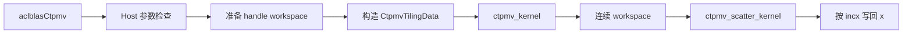
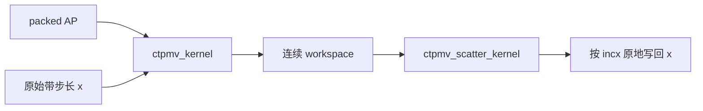

# aclblasCtpmv 算子设计文档

本文档描述 Atlas A2/A3（DAV 2201）平台上 `aclblasCtpmv` 的功能、
Host/Tiling、Kernel 数据流、硬件约束和验证方案，设计依据为任务书、算子
设计规范和仓库目录约定。具体调度参数在开发阶段确定。

| 项目 | 内容 |
| --- | --- |
| 文档状态 | 评审修订版 |
| 任务依据 | 《aclblasCtpmv 算子开发任务书》 |
| 目标仓库 | `cann/ops-blas` |
| 接口声明 | `include/cann_ops_blas.h` |
| 算子目录 | `blas/tpmv/arch22/` |
| Host 文件 | `blas/tpmv/arch22/ctpmv_host.cpp` |
| Kernel 文件 | `blas/tpmv/arch22/ctpmv_kernel.cpp` |
| Tiling 文件 | `blas/tpmv/arch22/ctpmv_tiling_data.h` |
| 测试目录 | `test/tpmv/ctpmv/arch22/` |
| 编译架构 | `--npu-arch=dav-2201` |
| 适配硬件 | Atlas A2/A3 系列产品；性能验收使用 910B3 |
| CANN 版本 | 9.1.0 |
| 数据类型 | `COMPLEX64`，实部和虚部均为 FLOAT32 |

## 需求背景

本节说明任务来源、算子定位、应用价值、现有能力、待解决问题和交付边界，
明确为什么需要在 `ops-blas` 中新增单精度复数 packed 三角矩阵向量乘法
能力，以及该能力需要达到什么验收目标。

### 需求来源

《aclblasCtpmv 算子开发任务书》要求参考 cuBLAS `cublasCtpmv` 和 Netlib
BLAS `ctpmv` 的参数及计算语义，在 Atlas A2/A3 上使用 Ascend C 实现
`aclblasCtpmv`。公共接口声明新增到 `include/cann_ops_blas.h`，A2/A3 实现
放入 `blas/tpmv/arch22/`，测试放入 `test/tpmv/ctpmv/arch22/`，并与同族
`aclblasStpmv` 的工程组织保持一致。

本任务属于 BLAS 基础算子能力补齐。实现必须遵循仓内 handle、stream、
workspace、错误码和测试框架约定，并以任务书规定的接口语义、CANN 9.1.0、
精度阈值、三组性能场景、自验规则和正式交付路径作为验收依据。架构编译
参数为 `--npu-arch=dav-2201`。

### 算子定位与应用场景

TPMV（Triangular Packed Matrix-Vector Multiply）属于 BLAS Level 2 运算，
计算量随矩阵阶数按平方增长，数据访问量也主要由矩阵元素决定。它使用
packed 格式保存三角矩阵，只存储 `uplo` 指定的有效区域，将矩阵存储量从
`n²` 个元素降低到 `n(n+1)/2` 个元素，适合上层算法已经持有 packed 三角
因子的场景。

`aclblasCtpmv` 可用于以下线性代数流程：

| 应用场景 | TPMV 的作用 | 对本算子的关键要求 |
| --- | --- | --- |
| 三角因子变换 | 将复数向量乘以上三角或下三角因子 | 正确解释 UPPER/LOWER packed 布局 |
| 分解算法后处理 | 使用分解得到的三角因子更新向量 | 支持单位与非单位对角 |
| 预条件与迭代计算 | 在迭代步骤中重复应用三角算子 | 保持异步执行并控制额外内存开销 |
| 复数信号与科学计算 | 对复数系数和复数状态执行线性变换 | 支持复数乘加、转置和共轭转置 |
| 跨平台 BLAS 迁移 | 将现有 `cublasCtpmv` 调用迁移至 Ascend | 保持参数顺序、步长和边界语义一致 |

这些场景共同要求算子既满足标准 BLAS 语义，又能直接处理 packed 数据，
不能先把 AP 展开成完整矩阵再调用其他矩阵向量乘法算子，否则会增加
`O(n²)` 的额外存储、数据搬运和预处理开销。

### 数学操作与接口特征

`aclblasCtpmv` 执行以下原地运算：

```text
x = op(A) * x
```

其中 `A` 是 `n × n` 单精度复数三角矩阵，AP 按列优先 packed 格式保存，
`x` 是带步长的单精度复数向量。`op(A)` 由 `trans` 决定：

- `ACLBLAS_OP_N`：`op(A) = A`；
- `ACLBLAS_OP_T`：`op(A) = Aᵀ`，只转置，不执行共轭；
- `ACLBLAS_OP_C`：`op(A) = Aᴴ = conj(Aᵀ)`。

接口采用原地语义，输入向量和输出向量共用指针 `x`。一个输出元素通常
依赖多个输入元素，如果计算尚未读取完原始向量就覆盖 `x`，后续计算会
读取到已更新的数据并破坏结果。因此，原地语义不仅影响最终写回方式，也
直接决定 Kernel 必须保护调用前的逻辑输入。

`incx` 定义逻辑向量元素之间的物理间隔。正步长从低地址向高地址访问，
负步长按 BLAS 规则反向映射逻辑元素，绝对值大于 1 时相邻有效元素之间
存在空洞。算子只能更新有效逻辑位置，不能修改这些空洞位置。

### 可复用能力与能力缺口

仓库已有实数接口 `aclblasStpmv`，可复用公共框架能力，但不能通过简单替换
数据类型得到复数实现。可复用项和新增设计点如下：

| 分类 | 可复用或参考内容 | `aclblasCtpmv` 需要新增的内容 |
| --- | --- | --- |
| 接口框架 | handle、stream、公共状态码和诊断约定 | 新增 complex64 公共接口及复数参数语义 |
| Host 管理 | 参数检查、workspace 获取和 Kernel 下发模式 | 处理复数 workspace 容量和两阶段写回 |
| packed 布局 | 上三角、下三角的列优先索引规则 | 在转置和共轭转置下保持索引与共轭语义 |
| 向量步长 | BLAS 正负步长的逻辑顺序 | 对复数实部、虚部同时执行步长映射 |
| 对角模式 | `UNIT` 与 `NON_UNIT` 的语义 | 单位对角使用 `(1, 0)` 且不得读取 AP 对角 |
| 测试框架 | GTest、CSV 参数化和参考 BLAS 接入 | 复数数据生成、实虚分量比较和特殊值检查 |
| 性能验证 | PF 用例组织和 profiler 流程 | packed 复数访存、复数乘加和 Scatter 开销分析 |

现有能力的主要缺口包括：

- 复数乘法需要分别处理实部和虚部，运算与数据搬运量高于实数路径；
- `ACLBLAS_OP_C` 必须只对矩阵元素执行共轭，不能错误共轭向量；
- `diag=ACLBLAS_UNIT` 时对角值由语义隐含，AP 对角位置即使包含 NaN 也
  不得被读取；
- 原地接口需要保护旧向量，并在计算完成后按 `incx` 写回；
- Inf、NaN、极大值和普通有限值需要与参考 BLAS 保持可验收的结果结构；
- packed 地址和带步长向量地址需要使用足够宽的中间类型，避免乘法溢出。

### 核心技术问题

本设计需要解决的问题不仅是公式计算，还包括数据布局、依赖关系和设备执行
方式。主要问题及设计响应如下：

| 技术问题 | 可能造成的影响 | 设计响应 |
| --- | --- | --- |
| packed 行长度不均匀 | 不同输出的计算量不均衡，尾部访问不规则 | 按 packed 连续片段组织遍历并处理尾块 |
| 输入输出共用 `x` | 提前写回会污染后续输入 | 主计算写入连续 workspace，完成后统一 Scatter |
| `N/T/C` 访问方向不同 | 单一路径可能产生大量离散访存 | `N` 使用列贡献路径，`T/C` 使用行点积路径 |
| 复数实虚交错布局 | 向量运算前需要拆分或重排数据 | 在 UB 中组织实部、虚部计算并复用中间结果 |
| 正负及非单位步长 | 地址离散且容易写错逻辑顺序 | 统一逻辑到物理位置映射，连续步长设置快速路径 |
| 单位对角不可读取 | 读取后覆盖仍可能传播 NaN | 从 AP 有效访问范围中直接排除对角位置 |
| 特殊值传播 | 快速向量路径可能改变 Inf/NaN 结构 | 普通值使用性能路径，特殊值使用保守路径 |
| 大规模地址计算 | `n(n+1)/2` 可能发生中间溢出 | packed 和向量偏移统一使用 64 位中间量 |

### 本次交付范围

本次交付包含以下内容：

- 在 `include/cann_ops_blas.h` 新增 `aclblasCtpmv` 公共接口声明；
- 在 `blas/tpmv/arch22/` 提交 Host、TilingData、主 Kernel 和 Scatter
  Kernel；
- 在 `blas/tpmv/README.md` 的产品支持表中标记 Atlas A2/A3 支持状态；
- 在 `test/tpmv/ctpmv/arch22/` 提交 C++ GTest 和 CSV 用例；
- 在 `test/tpmv/ctpmv/` 提交参数解析、golden、精度和性能验证脚本；
- 覆盖 12 组枚举组合、正负步长、单位对角、quick return、特殊值和任务书
  三组性能场景；
- 提供设计文档、自测用例与测试代码等任务书规定的交付件。

本次交付不包含以下工作：

- 不修改 `aclblasStpmv` 或 legacy 接口的行为；
- 不增加批处理、广播、稀疏矩阵或非 packed 矩阵语义；
- 不增加 Atlas A2/A3 私有的平行公共 API；
- 不支持超出 `incx` 语义的其他非连续 Tensor；
- 不承诺任务书范围之外的内存重叠、视图或确定性计算行为。
### 建设目标与验收价值

完成本任务后，`ops-blas` 将具备标准 complex64 TPMV 能力，上层调用方可以
直接复用既有 packed 三角数据，并通过 handle stream 异步执行。设计验收
需要同时证明以下结果：

1. **接口可用。** 参数顺序、枚举、状态码、quick return 和异步行为明确；
2. **语义完整。** 覆盖 UPPER/LOWER、N/T/C、UNIT/NON_UNIT 和正负步长；
3. **结果正确。** 普通值、边界值和 Inf/NaN 均可与参考 BLAS 比较；
4. **原地安全。** 计算过程不因提前覆盖 `x` 破坏原始输入；
5. **性能可测。** 典型性能场景有明确输入、测量方法和结果记录；
6. **交付可复现。** 目录、构建、CSV、测试和验证脚本可以独立复验。
## 需求分析

本节把任务要求转换为可实现、可检查和可验收的条目，覆盖调用场景、完整
接口、输入输出契约、参数组合、异常行为、异步语义、性能目标和交付标准。
每项需求都需要在详细设计或测试方案中找到对应落点。

### 使用场景与调用流程

典型调用方已经在设备内存中准备 AP 和 `x`，并通过
`aclblasHandle_t` 绑定执行 stream。一次正常调用包含以下逻辑步骤：

1. 调用方创建或复用 handle，并设置执行 stream；
2. 调用方按照列优先 packed 规则准备 AP，按照 `incx` 准备逻辑向量 `x`；
3. Host 校验参数，计算 workspace 需求并生成 TilingData；
4. Host 在 handle stream 上依次下发主 Kernel 和 Scatter Kernel；
5. 接口返回后，设备任务仍可异步执行；
6. 调用方在读取结果前按照框架约定同步 stream；
7. 有效逻辑位置保存 `op(A) * x_old`，步长空洞位置保持不变。

调用方不需要提供显式输出指针，也不需要理解内部 workspace。workspace 的
申请、复用和释放由 handle 管理，不能改变公共接口参数或调用生命周期。

### 接口定义

接口定义如下：

```cpp
aclblasStatus_t aclblasCtpmv(
    aclblasHandle_t handle,
    aclblasFillMode_t uplo,
    aclblasOperation_t trans,
    aclblasDiagType_t diag,
    int n,
    const aclblasComplex* AP,
    aclblasComplex* x,
    int incx);
```

接口不增加 Atlas A2/A3 私有参数，不定义产品线专用的平行 API，也不改变
现有实数 TPMV 接口的 ABI。返回值只表示参数检查、资源准备和任务下发状态，
不等价于设备侧计算已经完成。

### 输入、输出与内存契约

下表定义每个数据对象的逻辑含义、内存范围和访问要求：

| 对象 | 数据类型与长度 | 输入/输出 | 内存与访问契约 |
| --- | --- | --- | --- |
| AP | `aclblasComplex[n(n+1)/2]` | 只读输入 | 列优先 packed；仅访问 `uplo` 指定区域 |
| `x` | 至少 `1+(n-1)*abs(incx)` 个 complex64 | 输入输出 | 只更新有效逻辑位置，空洞位置保持不变 |
| workspace | `n` 个 complex64 | 内部临时输出 | 连续保存逻辑结果，由 handle 管理 |
| stream | handle 绑定的设备 stream | 执行上下文 | 主 Kernel 与 Scatter 按下发顺序执行 |

AP 与 `x` 视为互不重叠的设备内存。接口不保证 AP 与 `x` 重叠时的结果。
`x` 的有效逻辑元素数量始终为 `n`，物理跨度由 `incx` 决定。负步长不改变
逻辑向量顺序，只改变逻辑元素映射到物理地址的方向。

### 参数规格与合法范围

下表定义接口参数、合法范围、作用阶段和错误行为：

| 参数 | 类型 | 合法范围与含义 | 异常行为 |
| --- | --- | --- | --- |
| `handle` | `aclblasHandle_t` | 有效 ops-blas 上下文，包含 stream 和 workspace | 空指针返回 `ACLBLAS_STATUS_HANDLE_IS_NULLPTR` |
| `uplo` | `aclblasFillMode_t` | `ACLBLAS_UPPER` 或 `ACLBLAS_LOWER` | 非法值返回 `ACLBLAS_STATUS_INVALID_ENUM` |
| `trans` | `aclblasOperation_t` | `ACLBLAS_OP_N/T/C` | 非法值返回 `ACLBLAS_STATUS_INVALID_ENUM` |
| `diag` | `aclblasDiagType_t` | `ACLBLAS_NON_UNIT` 或 `ACLBLAS_UNIT` | 非法值返回 `ACLBLAS_STATUS_INVALID_ENUM` |
| `n` | `int` | `n>=0`，表示矩阵阶数和逻辑向量长度 | `n<0` 返回 `ACLBLAS_STATUS_INVALID_VALUE` |
| AP | `const aclblasComplex*` | `n>0` 时指向 packed 矩阵 | `n>0` 且为空返回 `ACLBLAS_STATUS_INVALID_VALUE` |
| `x` | `aclblasComplex*` | `n>0` 时指向输入输出向量 | `n>0` 且为空返回 `ACLBLAS_STATUS_INVALID_VALUE` |
| `incx` | `int` | 非零整数，表示逻辑元素步长 | `incx=0` 返回 `ACLBLAS_STATUS_INVALID_VALUE` |

`n=0` 是合法 quick return，不是异常。该场景不需要 AP、`x`、workspace 或
Kernel 下发，因此 AP 和 `x` 可以为空。接口仍需要有效 handle，并按照既定
检查顺序处理枚举和维度，确保同一组非法参数始终得到确定的状态码。

### 功能需求拆解

功能需求按可验证条目编号，便于设计、实现和测试建立追踪关系：

| 编号 | 功能需求 | 设计要求 | 验收方式 |
| --- | --- | --- | --- |
| R1 | 支持 complex64 | 实部、虚部均按 FP32 参与复数乘加 | CBLAS golden 与实虚分量比较 |
| R2 | 支持 UPPER/LOWER | 按列优先 packed 规则解释有效三角区域 | 上下三角边界和索引专项用例 |
| R3 | 支持 `OP_N` | 计算 `A*x_old` | 组合用例与参考 BLAS 比较 |
| R4 | 支持 `OP_T` | 计算 `Aᵀ*x_old`，不执行共轭 | 使用虚部非零数据验证 |
| R5 | 支持 `OP_C` | 计算 `conj(Aᵀ)*x_old` | 与 `OP_T` 结果差异专项用例 |
| R6 | 支持对角模式 | 覆盖 UNIT/NON_UNIT | 对角填充普通值和 NaN 的用例 |
| R7 | 支持正负步长 | 统一逻辑到物理地址映射 | `incx=±1/±2/±3` 用例 |
| R8 | 保持原地语义 | 主计算读取 `x_old`，完成后再覆盖 `x` | workspace 与空洞保护检查 |
| R9 | 支持 quick return | `n=0` 返回成功且不引用 AP、`x` | 空指针 quick return 用例 |
| R10 | 防止地址溢出 | packed 和向量偏移使用 64 位中间量 | 大尺寸静态检查和边界用例 |
| R11 | 保持异步语义 | 正常路径不主动同步 handle stream | 连续下发与同步责任检查 |
| R12 | 支持可重复验收 | 提供固定 CSV、golden、脚本和构建入口 | 从干净构建目录执行验证 |

### 枚举组合与路径覆盖

矩阵语义由 `uplo × trans × diag` 组成，共 12 组基础组合。每组组合还需要
覆盖连续步长、非单位正步长和负步长：

| 维度 | 取值 | 对设计的影响 |
| --- | --- | --- |
| `uplo` | UPPER、LOWER | 决定 packed 列起点、长度和对角所在端 |
| `trans` | N、T、C | 决定列贡献或行点积，并决定是否共轭 |
| `diag` | NON_UNIT、UNIT | 决定是否读取 AP 对角元素 |
| `incx` | 1、正非单位、负值 | 决定连续搬运或通用地址映射 |
| `n` | 0、1、小规模、非对齐、大规模 | 决定 quick return、尾块和性能规模 |

最低功能覆盖不能只测试 12 组枚举本身，还必须把容易发生地址错误的负步长、
单位对角和非对齐规模与枚举组合交叉。性能用例可以集中在任务书指定的连续
步长场景，但功能路径不能因此省略通用步长支持。

### 参数检查与 quick return 顺序

Host 侧计划按以下顺序执行参数检查：

1. 检查 `handle` 是否有效；
2. 检查 `uplo`、`trans` 和 `diag` 是否为支持的枚举；
3. 检查 `n>=0` 和 `incx!=0`；
4. 当 `n=0` 时直接返回 `ACLBLAS_STATUS_SUCCESS`；
5. 当 `n>0` 时检查 AP 和 `x` 是否为空；
6. 计算 workspace 大小并检查容量；
7. 填充 TilingData，在 handle stream 上下发 Kernel；
8. 返回任务下发状态，不在正常路径等待设备执行完成。

该顺序必须在 Host 实现和异常测试中保持一致。例如，`n=0` 且 AP、`x`
为空属于合法调用；`n=0` 但 `incx=0` 仍属于非法步长；非法枚举不能因
quick return 被静默接受。

### 结果正确性要求

结果正确性按逻辑元素而不是物理连续内存判断。令 `x_old(i)` 表示调用前的
第 `i` 个逻辑元素，则输出必须满足：

```text
x_new(i) = Σ op(A)(i,j) * x_old(j),  0 <= i,j < n
```

同时满足以下附加语义：

- `diag=UNIT` 时 `A(i,i)` 按 `(1,0)` 参与计算，不读取 AP 对角位置；
- `OP_T` 只交换矩阵行列，不能对实部或虚部取共轭；
- `OP_C` 对转置后的矩阵元素取共轭，不对 `x_old` 取共轭；
- 负步长按照 BLAS 逻辑顺序读取和写回；
- 物理存储中不属于逻辑向量的空洞位置保持调用前数值；
- 有限值按误差阈值判断，Inf/NaN 按参考结果的特殊值结构判断；
- 结果不要求逐 bit 一致，但必须满足任务书规定的匹配比例和最大误差。

### workspace 与异步执行要求

原地接口要求主计算阶段保留完整的 `x_old`。本设计使用连续 workspace
保存 `n` 个逻辑结果，所需容量为：

```text
workspaceBytes = n * sizeof(aclblasComplex)
```

workspace 由 handle 获取和复用，不暴露给调用方。主 Kernel 与 Scatter
Kernel 在同一 stream 上顺序执行，因此主 Kernel 写入 workspace 完成后，
Scatter 才能覆盖 `x`。正常调用不执行 Host 侧 stream 同步；如果内部
workspace 扩容需要同步，其行为必须遵循公共 handle 的资源管理约定。

### 性能需求

性能需求以任务书列出的三组典型场景为主，并同时关注主计算和写回开销。
需求分析阶段将性能目标拆成以下可观察项：

- 主 Kernel 的 AP 搬运连续性和复数乘加效率；
- 连续 `incx=1` 路径的向量读取效率；
- workspace 写入和 Scatter 写回的固定开销；
- 不同 `uplo/trans` 组合的负载均衡；
- 小规模场景的 Kernel 启动开销；
- 大规模场景的 UB 利用率、搬运与计算重叠程度。

性能判定必须以功能和精度符合标准为前提。性能测试需要固定硬件、CANN
版本、设备编号、输入参数和统计口径。具体场景及阈值在“性能优化方案”
章节列出。

### 非功能需求

除数学结果外，设计还需要满足以下工程要求：

| 类别 | 要求 |
| --- | --- |
| 可维护性 | Host、Tiling、主 Kernel、Scatter 和测试职责清晰，路径可定位 |
| 可测试性 | 功能、异常、精度、性能用例可以分别执行和定位失败原因 |
| 可复现性 | 固定构建命令、CSV、golden 来源和脚本参数 |
| 兼容性 | 不改变实数 TPMV、legacy 接口及公共 handle 语义 |
| 异步性 | 正常调用不引入额外 Host 同步点 |
| 可观测性 | 性能脚本和 profiler 能区分计算与写回阶段 |
| 健壮性 | 地址计算、尾块、负步长和特殊值均有明确保护策略 |

### 自验输入覆盖

任务书要求测试输入同时覆盖随机分布、确定性填充、边界和特殊值。计划采用
以下输入生成和属性组合：

| 参数 | 任务书要求的覆盖方式 |
| --- | --- |
| `uplo/trans/diag` | `2×3×2` 共 12 组正交组合全覆盖 |
| `n` | 覆盖 0、1、小质数、2 的幂、2 的幂 ±1、非对齐值和大规模 |
| AP | 均匀分布 `[-5,5]` 约 50%，正态分布约 50%，另含全零、交替、极值、Inf/NaN |
| `x` | 与 AP 相同的实部、虚部独立采样和特殊填充规则 |
| `incx` | 覆盖 `±1`、`±2`、`±3` |
| 异常参数 | 空指针、非法枚举、负维度和零步长 |

任务书自验条款中出现“空指针 x/y”的通用表述，本接口只有输入输出参数
`x`，没有独立 `y`。设计将其映射为 `x==nullptr`，并使用 workspace 与
Scatter 用例验证原地输出语义。
### 验收判定

本次需求在以下条件全部满足时视为完成：

1. 公共接口、`arch22` Host/Kernel/Tiling、测试和验证脚本文件齐全；
2. 接口、参数约束、状态码和 quick return 与设计一致；
3. 12 组枚举组合及正负步长功能用例通过；
4. 单位对角不读取 AP 对角位置，步长空洞不被修改；
5. complex64 精度、匹配比例和 Inf/NaN 结构达到任务书要求；
6. 三组典型性能场景按统一口径完成测量并达到目标；
7. 构建、L0、全量精度和性能验证命令能够重复执行；
8. 未完成的设备验证或任务冲突已记录在风险与待确认项中。
## 详细设计

本节给出算子数学语义、Host/Tiling 设计、Kernel 设计、硬件约束和可验证
的不变量。

### 算子分析

本节说明矩阵、向量和复数运算的数学语义，以及 packed 布局和步长映射。

#### 数学公式

对输出向量第 `i` 个逻辑元素，使用调用前的输入 `x_old` 计算：

```text
y[i] = sum(op(A)[i, j] * x_old[j])
x    = y
```

当 `op(A)` 为上三角时，`j` 的有效范围为 `[i, n)`；当
`op(A)` 为下三角时，`j` 的有效范围为 `[0, i]`。实现不改变矩阵
的物理 packed 布局，而是根据 `trans` 解释原矩阵的逻辑行列关系。

#### complex64 语义

`aclblasComplex` 在内存中保存交错的实部和虚部。设
`a=a_r+i·a_i`、`b=b_r+i·b_i`，乘法语义为：

```text
real(a*b) = a_r*b_r - a_i*b_i
imag(a*b) = a_r*b_i + a_i*b_r
```

`ACLBLAS_OP_C` 只对矩阵操作数执行共轭，向量不执行共轭。实部和虚部
分别累加，结果按任务书规定的 FLOAT32 标准验收。对 Inf、NaN 等 IEEE
特殊值，Kernel 采用与参考 BLAS 兼容的保守计算路径，以保证特殊值结构
可比较。

#### packed 存储语义

AP 采用 0-based、列优先 packed 布局：

- 上三角 `A(row,col)`（`row <= col`）的逻辑位置为
  `row + col * (col + 1) / 2`；
- 下三角 `A(row,col)`（`row >= col`）的逻辑位置为
  `row + (2 * n - col + 1) * col / 2`。

转置或共轭转置不生成新的矩阵。Kernel 在访问 AP 时解释原矩阵的逻辑
行列关系，再依据原矩阵的 `uplo` 访问 packed 位置。地址中间计算使用
64 位无符号量，避免阶数较大时的中间溢出。

#### 向量步长

逻辑位置 `i` 映射到 `x` 的物理位置如下：

```text
incx > 0: physical(i) = i * abs(incx)
incx < 0: physical(i) = (n - 1 - i) * abs(incx)
```

`|incx|>1` 时，步长间的空洞不属于输出逻辑元素，写回只更新上述物理
位置。结果 workspace 始终按逻辑顺序连续保存，最后由写回 Kernel 完成
物理映射。

### 总体执行流程

Host、主计算 Kernel 和写回 Kernel 在同一个 handle stream 上按顺序执行：



主计算 Kernel 只负责读取原始 AP 和 `x`、计算逻辑结果并写入连续
workspace。写回 Kernel 只负责 workspace 到 `x` 的映射，因此原地覆盖的
依赖关系被拆成可观察的两个阶段。

### Host/Tiling 设计

本节说明 Host 如何完成校验、workspace 管理、Tiling 传递和 Kernel 下发。

#### Host 职责

Host 侧的职责是参数校验、workspace 获取、Tiling 填充和 Kernel 下发：

- 使用统一错误码返回非法 handle、枚举、维度、步长和空指针错误；
- 通过 `EnsureDefaultWorkspace` 确保 workspace 容量，通过
  `GetEffectiveWorkspace` 获取设备地址；
- 将 `n`、`incx`、`uplo`、`trans`、`diag` 和调度信息传入
  `CtpmvTilingData`；
- 在同一 stream 上依次下发主计算和写回 Kernel；
- 不在正常执行路径主动调用 `aclrtSynchronizeStream`。

#### workspace 规划

workspace 的结果区按逻辑顺序保存 `n` 个 complex64 元素，Host 按实际结果
长度申请 handle 管理的公共 workspace：

```text
workspaceBytes = n * sizeof(aclblasComplex)
```
`useCoreNum` 作为设备侧调度参数由 Host 传入 Tiling；具体取值、核间切分
和归约策略在开发阶段结合硬件资源确定。workspace 由 handle 复用，不在
每次算子调用中单独申请和释放。

#### TilingData

TilingData 设计只传递执行语义和调度信息，不把源码级 UB 参数暴露到
Host 接口：

```cpp
struct CtpmvTilingData {
    uint32_t n;
    uint32_t useCoreNum;
    int64_t incx;
    uint32_t uplo;
    uint32_t trans;
    uint32_t diag;
};
```

Kernel 内部根据硬件 UB 容量和数据类型安排分块大小。具体 buffer 偏移和
分块常数在开发阶段确定；尾块必须安全处理，不得读取填充数据，所有有效
结果最终写入 workspace。

### Kernel 设计

本节说明 Kernel 的设计目标、输入输出、内存布局、任务切分、分支选择、
数据搬运、复数计算、边界处理、写回流程和正确性约束。Kernel 设计需要在
不展开完整矩阵的前提下完成 complex64 TPMV，并同时保证原地语义、负步长、
单位对角和特殊值行为可验证。

#### 设计目标

Kernel 设计围绕正确性、访存效率、并行性和可测性展开：

| 目标 | 设计要求 | 验证方式 |
| --- | --- | --- |
| packed 直接计算 | 不生成 `n×n` 完整矩阵 | 检查 workspace 大小和 GM 访问范围 |
| 原地结果安全 | 主计算期间不覆盖输入 `x` | workspace 与 Scatter 两阶段验证 |
| 枚举语义完整 | 覆盖 UPPER/LOWER、N/T/C、UNIT/NON_UNIT | 12 组组合用例 |
| 步长语义完整 | 支持正、负及绝对值大于 1 的 `incx` | INC 用例与空洞保护检查 |
| 地址计算安全 | packed 和向量偏移使用 64 位中间量 | 大规模与边界用例 |
| 数值行为可控 | 普通值走性能路径，特殊值走保守路径 | FL 特殊值用例 |
| 性能可分析 | 主计算与写回阶段可以分别观测 | PF 用例和 profiler |

#### Kernel 组成

设备侧由主 Kernel 和 Scatter Kernel 组成。两者通过连续 workspace 连接，
由 Host 在同一个 stream 上顺序下发：



两个 Kernel 的职责边界如下：

| Kernel | 输入 | 输出 | 主要职责 |
| --- | --- | --- | --- |
| `ctpmv_kernel` | AP、原始 `x`、TilingData | 连续 workspace | 解释 packed 布局并计算全部逻辑结果 |
| `ctpmv_scatter_kernel` | workspace、`incx`、`n` | 原地 `x` | 将连续结果映射到有效物理位置 |

主 Kernel 不提前修改 `x`，Scatter Kernel 不重新读取 AP 或执行矩阵乘法。
这种职责分离使矩阵计算、原地保护和步长写回可以分别验证，也避免把离散
写回逻辑放入主计算内层循环。

#### 输入输出与内存布局

Kernel 访问三个 GM 区域，TilingData 只保存执行所需的标量信息：

| 区域 | 布局 | 访问方式 | 生命周期 |
| --- | --- | --- | --- |
| AP | complex64 实虚交错、列优先 packed | 主 Kernel 只读 | 调用方管理 |
| `x` | complex64 实虚交错、按 `incx` 分布 | 主 Kernel 只读，Scatter 写 | 调用方管理 |
| workspace | `n` 个连续 complex64 | 主 Kernel 写，Scatter 读 | handle 管理 |
| TilingData | `n/incx/uplo/trans/diag` 及调度信息 | 两个 Kernel 只读 | 随任务下发 |

AP 的逻辑元素数量为 `n(n+1)/2`，换算为实虚分量后需要访问两倍 FP32
分量。`x` 的物理跨度为 `1+(n-1)*abs(incx)` 个 complex64 元素。所有长度
和偏移计算使用 64 位中间量，避免 `n`、列起点或步长乘法在计算过程中
溢出。

workspace 仅保存逻辑顺序结果：

```text
workspace[i] = result of logical element i,  0 <= i < n
```

workspace 不包含 `incx` 产生的空洞，因此主 Kernel 的输出保持连续，Scatter
负责唯一一次逻辑到物理地址转换。

#### TilingData 与分支选择

Kernel 使用以下 TilingData 字段：

```cpp
struct CtpmvTilingData {
    uint32_t n;
    uint32_t useCoreNum;
    int64_t incx;
    uint32_t uplo;
    uint32_t trans;
    uint32_t diag;
};
```

各字段对 Kernel 的影响如下：

| 字段 | 作用 |
| --- | --- |
| `n` | 决定 packed 长度、逻辑输出数量、循环边界和尾块大小 |
| `useCoreNum` | 决定参与主计算或写回的 AIV 核数量 |
| `incx` | 决定 `x` 的逻辑到物理地址映射和连续路径选择 |
| `uplo` | 决定 packed 上三角或下三角索引公式 |
| `trans` | 决定列贡献、行点积和共轭处理 |
| `diag` | 决定是否访问 AP 对角元素 |

分支在进入主要计算循环前完成选择，避免在每次复数乘加中重复判断全部
枚举。逻辑上先确定 UPPER/LOWER，再确定 N/T/C，随后选择 UNIT/NON_UNIT
和连续/通用步长路径。具体模板组合或 TilingKey 编码在开发阶段根据编译
体积和性能结果确定，不改变上述语义分支。

#### 分核与任务所有权

核数在开发阶段根据 `n`、有效计算量和平台可用 AIV 核数确定。分核必须
满足“一个逻辑输出在同一阶段只有一个写入者”的原则，避免无序覆盖和原子
操作带来的额外开销。

`OP_T/OP_C` 的输出行彼此独立，适合按输出行或连续行区间分配。每个 Core
负责自己的输出集合，完成点积后直接写入对应 workspace 位置。三角矩阵各行
有效长度不同，任务分配需要考虑长行和短行的计算量差异，不能只按行数平均
切分。

`OP_N` 采用 packed 列贡献路径时，一列可能影响多个输出。为避免不同 Core
同时更新同一 workspace 元素，本设计要求按输出区间建立所有权：每个 Core
只累加属于自身区间的输出，即使需要扫描多个 packed 列，也不能写入其他
Core 的结果区。另一种可选实现是使用独立局部结果区再归约，但会增加
workspace 和归约开销，只有 profiling 证明有收益时才采用。

Scatter Kernel 的元素之间没有依赖，可按以下方式分配：

```text
logical = blockIdx + k * useCoreNum
```

每个逻辑位置只写入一次，正负步长映射也不会使两个合法逻辑元素落到同一
物理位置。

#### 主 Kernel 总体流程

主 Kernel 按以下阶段执行：

1. **解析参数。** 读取 TilingData，确定 packed 布局、转置模式、对角模式、
   步长路径和本 Core 的任务范围；
2. **建立 GM 视图。** 建立 AP、`x` 和 workspace 的 GlobalTensor 视图，
   使用 64 位长度计算限制访问范围；
3. **定位逻辑输入。** 根据 `incx` 将逻辑元素映射到原始 `x` 的物理位置，
   负步长从对应反向位置读取；
4. **选择遍历路径。** `OP_N` 进入列贡献路径，`OP_T/OP_C` 进入行点积路径；
5. **准备 UB。** 为 AP tile、向量 tile、复数中间量和累加结果分配 UB 空间；
6. **分块搬运。** 将当前 packed 连续片段及对应向量元素搬入 UB，通用步长
   使用逻辑地址映射收集数据；
7. **复数计算。** 完成实部、虚部乘法与累加，并按 `diag/trans` 处理单位
   对角和共轭；
8. **处理尾块。** 对不足搬运粒度的片段使用 mask、补齐或安全逐元素路径，
   补齐值不参与有效结果；
9. **写入 workspace。** 每个逻辑输出写入连续且唯一的位置；
10. **结束任务。** 主 Kernel 不写回 `x`，由同一 stream 上后续 Scatter
    完成原地更新。

#### `OP_N` 列贡献路径

当 `trans=ACLBLAS_OP_N` 时，计算目标为 `A*x_old`。packed 数据按原矩阵列
连续保存，因此主循环按列读取 AP，可以减少跨列离散访存。

对第 `j` 列，Kernel 读取 `x_old(j)`，再把该标量与列中有效矩阵元素相乘，
累加到受该列影响的输出位置：

```text
result(i) += A(i,j) * x_old(j)
```

UPPER 模式只更新 `i<=j` 的输出，LOWER 模式只更新 `i>=j` 的输出。每个 Core
只处理自身拥有的输出区间与当前列的交集，从而保证 workspace 写入不存在
跨核竞争。

`diag=NON_UNIT` 时读取 AP 中的对角元素并参与乘法；`diag=UNIT` 时直接把
`x_old(j)` 的贡献加入对应输出，不读取 AP 对角位置。UPPER 的对角位于
packed 列末端，LOWER 的对角位于 packed 列首端，Kernel 通过调整有效片段
起点和长度排除该元素。

列贡献路径的性能重点是 AP 连续搬运和输出累加复用。输出 tile 在 UB 中
保留期间尽量处理所有与之相交的 packed 列，减少同一输出区间在 GM 与 UB
之间的重复搬运。

#### `OP_T/OP_C` 行点积路径

当 `trans=ACLBLAS_OP_T` 或 `ACLBLAS_OP_C` 时，每个逻辑输出可以表示为原
矩阵一列与 `x_old` 对应区间的点积：

```text
result(i) = Σ op(A)(i,j) * x_old(j)
```

该路径按输出逻辑行形成结果，一个输出只由一个 Core 计算。UPPER 和 LOWER
决定有效点积区间的起点与长度，Kernel 只访问三角区域内的 packed 元素。

`OP_T` 直接使用 AP 的实部和虚部；`OP_C` 在复数乘法前将矩阵元素虚部取
相反数，实现 `conj(A)`。向量 `x_old` 不执行共轭。两条路径除共轭处理外
共享索引、搬运、尾块和归约结构，减少重复实现导致的语义差异。

`diag=UNIT` 时，点积中的对角贡献直接使用 `x_old(i)`。AP 对角不进入搬运
范围，不能先搬入 UB 再覆盖，因为 AP 对角可能包含 NaN 或无效填充值。

#### UPPER 与 LOWER packed 访问

packed 索引由矩阵原始坐标决定，转置只改变要查询的逻辑坐标，不改变 AP
本身的存储方式：

```text
UPPER: index(i,j) = i + j*(j+1)/2,                  i <= j
LOWER: index(i,j) = i + (2*n-j+1)*j/2,             i >= j
```

访问设计需要满足以下规则：

| 模式 | packed 列有效范围 | 对角位置 | 尾块关注点 |
| --- | --- | --- | --- |
| UPPER | 行号 `0..j` | 列片段末端 | 短列和末端对角排除 |
| LOWER | 行号 `j..n-1` | 列片段首端 | 首端对角排除和末列短片段 |

所有乘法、加法和列起点计算使用无符号 64 位中间值。只有在确认值落入设备
接口要求范围后，才能转换为搬运长度或局部循环计数类型。

#### `incx` 与逻辑地址映射

Kernel 使用统一函数把逻辑位置 `i` 映射到物理位置：

```text
physical(i, n, incx) =
    i * abs(incx),                     incx > 0
    (n - 1 - i) * abs(incx),           incx < 0
```

`incx=1` 时，逻辑窗口在 GM 中连续，可直接分块搬运。`abs(incx)>1` 时，
Kernel 按逻辑位置收集有效元素，不能把物理空洞当作输入。负步长路径复用
同一数学逻辑，仅改变物理地址，不反转输出的逻辑编号。

Scatter 使用同一映射写回，确保主计算读取顺序、golden 比较顺序和最终写回
位置一致。测试在调用前向空洞写入哨兵值，调用后检查哨兵不变，以发现越界
或错误连续写回。

#### UB 与数据搬运设计

UB 需要容纳当前 AP tile、向量 tile、实部和虚部中间量、累加结果及必要的
搬运对齐空间。tile 大小根据可用 UB、complex64 元素大小和同时存活的
Tensor 数量计算，并向设备搬运粒度对齐。

数据搬运遵循以下原则：

- packed 列中的连续区间优先使用批量搬运；
- `incx=1` 的向量区间使用连续搬运；
- 通用步长路径只收集有效逻辑元素，不搬运空洞；
- 当 UB 资源允许时，AP tile 和计算 tile 使用双缓冲，使 MTE2 搬运与
  Vector 计算重叠；
- 输出累加值在 UB 中尽量复用，减少反复读写 workspace；
- 尾块补齐区域必须初始化，并通过有效长度或 mask 排除。

设计阶段不固定 tile 元素数、队列深度和具体 buffer 偏移。这些参数由
Ascend C 编译结果、UB 占用和目标设备 profiling 共同确定，但尾块安全、
对角不读取和结果唯一写入属于不可改变的正确性约束。

#### complex64 计算设计

GM 中的 complex64 使用实虚交错布局。设矩阵元素 `a=a_r+i·a_i`，向量元素
`b=b_r+i·b_i`，复数乘法为：

```text
real(a*b) = a_r*b_r - a_i*b_i
imag(a*b) = a_r*b_i + a_i*b_r
```

Kernel 在 UB 中按计算需要拆分实部和虚部，分别完成乘法、加减和归约，再
恢复为实虚交错结果写入 workspace。`OP_C` 通过令 `a_i=-a_i` 复用同一复数
乘法结构。

FP32 累加顺序会影响末位舍入。设计优先保持同一路径内确定的遍历顺序，
避免同一输出在不同 Core 间使用不确定顺序归约。普通有限值按任务书误差
阈值验收，不要求逐 bit 等于参考实现。

#### 特殊值处理

Inf、NaN 和极大值可能因乘法拆分、归约顺序或 FMA 合并产生不同结构。
本设计将数值路径分为普通性能路径和保守路径：

| 路径 | 适用输入 | 处理原则 |
| --- | --- | --- |
| 普通性能路径 | 有限且处于正常范围的数据 | 使用 UB 分块和向量化复数乘加 |
| 保守路径 | 包含 Inf、NaN 或可能溢出的极端值 | 保持标量表达式顺序和 IEEE 传播结构 |

特殊值检测不能改变 AP、`x` 或 workspace 的逻辑布局。无论选择哪条数值
路径，packed 索引、单位对角、步长映射和 Scatter 行为必须相同。专项测试
分别比较实部和虚部，并统计特殊值结构不匹配数量。

#### 单位对角处理

单位对角是独立的语义分支，不是普通对角读取后的数值替换。Kernel 必须：

1. 在计算有效 AP 片段时排除对角地址；
2. 使用复数 `(1,0)` 形成对角贡献；
3. 不因向量化对齐扩大搬运范围而读取对角位置；
4. 在 UPPER 和 LOWER 两种对角端点位置分别处理；
5. 使用 AP 对角填充 NaN 的用例证明该位置未被读取。

该设计同时适用于 `OP_N`、`OP_T` 和 `OP_C`。单位对角的共轭仍为 `(1,0)`，
因此 `OP_C` 不需要额外处理对角虚部。

#### 尾块与未对齐处理

packed 列长度、点积长度和输出区间不一定是搬运或向量计算粒度的整数倍。
每个分块需要同时记录实际元素数和对齐后元素数：

- 搬入时只读取合法 GM 范围；
- 使用 DataCopyPad 时明确填充值并排除其计算贡献；
- 使用 mask 时 mask 只覆盖实际元素；
- 不能通过向下或向上取整访问相邻 packed 列；
- `diag=UNIT` 的尾块不能因对齐读取被排除的对角位置；
- 输出写回只覆盖实际逻辑元素，不能写入 workspace 尾部之外。

对于过短片段或无法安全使用批量搬运的边界，允许使用逐元素兜底路径。
兜底路径与性能路径共享索引函数和复数语义，避免形成第二套结果定义。

#### Scatter Kernel 设计

Scatter Kernel 对每个逻辑位置 `i` 执行：

```text
dst = physical(i, n, incx)
x[dst] = workspace[i]
```

Scatter 不访问 AP，不解释 `uplo`、`trans` 或 `diag`，也不改变步长空洞。
各逻辑元素独立，可按 Core 编号跨步遍历，不需要原子操作或跨核归约。

`incx=1` 时写回地址连续，优先使用连续搬运；`incx!=1` 时必须使用地址映射
写回。两种路径均在主计算完成后覆盖 `x`，并保持相同的逻辑结果语义。

#### stream 顺序与同步

Host 在同一 handle stream 上先下发主 Kernel，再下发 Scatter Kernel。
stream 的顺序执行关系保证主 Kernel 写入先于 Scatter 读取 workspace，
因此正常路径不需要 Host 调用 `aclrtSynchronizeStream`。

接口返回成功表示任务已成功下发，不表示 `x` 已经可以由 Host 或其他 stream
立即读取。调用方在读取结果或跨 stream 使用 `x` 前负责建立同步关系。该
责任与其他 ops-blas 异步接口保持一致。

#### 边界与异常保护

Host 已过滤非法参数，Kernel 仍需要在合法输入范围内保护边界：

- `n=0` 由 Host quick return，不下发任何 Kernel；
- `n=1` 只处理唯一对角元素，UNIT 模式不得访问 AP；
- 每次 AP 搬运前验证 packed 起点和实际长度；
- 每次 `x` 访问使用 64 位物理偏移；
- 每个 Core 在无任务时直接结束，不访问 GM；
- workspace 写入位置必须小于 `n`；
- Scatter 写入位置必须处于调用方提供的向量物理跨度内。

异常状态由 Host 返回，Kernel 不通过写入输出值表达错误。Kernel 下发失败
或资源准备失败时，Host 返回对应状态码，不能继续下发依赖无效 workspace
的后续阶段。

#### 性能路径与功能兜底

Kernel 路径按照输入特征区分，但所有路径共享数学定义：

| 输入特征 | 优先路径 | 设计目的 |
| --- | --- | --- |
| `incx=1`、普通有限值 | 连续搬运和向量计算 | 覆盖任务书典型性能场景 |
| `abs(incx)>1` | 通用步长收集与 Scatter | 保证任意合法步长正确 |
| `incx<0` | 反向物理地址映射 | 保持 BLAS 逻辑顺序 |
| Inf/NaN/极端值 | 保守数值路径 | 保持特殊值结构 |
| 短尾块或未对齐 | mask、补齐或逐元素兜底 | 防止越界和无效元素参与计算 |
| `diag=UNIT` | 排除对角读取的专用分支 | 满足标准 BLAS 单位对角语义 |

性能优化不得绕过通用路径测试。每次调整分块、双缓冲、分核或模板分支后，
都需要重新运行 12 组枚举、负步长、单位对角、特殊值和 PF 用例。

#### Kernel 正确性不变量

以下不变量是实现评审和专项测试的共同依据：

- 主计算期间读取的 `x` 始终表示调用前的逻辑输入；
- AP 只读，且只访问 `uplo` 指定的 packed 有效区域；
- packed 和向量地址使用 64 位中间量；
- 一个逻辑输出在同一阶段只有一个写入者；
- 每个逻辑输出只写入 workspace 的对应连续位置；
- Scatter 只写入 `incx` 描述的有效物理位置；
- 步长空洞在调用前后保持不变；
- `diag=UNIT` 不读取 AP 对角位置；
- `OP_T` 不执行共轭，`OP_C` 只对矩阵元素执行共轭；
- 补齐元素和 mask 外元素不参与有效归约；
- `n=0` 不下发 Kernel，不引用 AP 或 `x`；
- 主 Kernel 完成后才允许覆盖 `x`；
- 普通路径和兜底路径使用相同的 packed、步长和对角语义。

#### Kernel 可测性设计

Kernel 的每个关键分支都需要有独立可定位的测试入口：

| Kernel 设计点 | 对应用例或观测方式 |
| --- | --- |
| UPPER/LOWER packed 索引 | 首元素、对角、末元素和随机矩阵用例 |
| N/T/C 分支 | 12 组枚举组合，T/C 使用虚部非零数据 |
| UNIT 不读对角 | AP 对角填充 NaN 的专项用例 |
| 正负步长 | `incx=±1/±2/±3` 与空洞哨兵检查 |
| 尾块和未对齐 | 奇数、质数及非搬运粒度尺寸 |
| 64 位地址计算 | 大尺寸边界和静态检查 |
| 特殊值路径 | 零、极值、Inf、NaN 和交替符号数据 |
| workspace 原地保护 | 与保存的 `x_old` 参考结果比较 |
| Scatter | 有效位置结果与空洞位置保持检查 |
| 性能路径 | PF 用例、Kernel 调用链和 profiler 指标 |

测试按数学计算、packed 索引、步长映射、单位对角、特殊值、workspace 和
Scatter 分别设置定位维度，使各类问题能够对应到具体设计分支。
## 支持硬件

任务书的功能目标为 Atlas A2/A3 系列产品，CANN 版本为 9.1.0，A2/A3
实现使用 `arch22` 目录并以 `--npu-arch=dav-2201` 编译。性能验收设备按
任务书 §3.3 使用 Atlas 800I A2（910B3）。

| 支持的产品或环境 | 支持与验证要求 |
| --- | --- |
| Atlas 800I A2（910B3） | 三组性能 case 的指定验收设备 |
| Atlas A2 其他系列产品 | 目标支持，执行功能、精度和兼容性验证 |
| Atlas A3 系列产品 | 任务概述和 README 要求标记支持，需完成设备验证 |
| CANN 9.1.0 | 编译、运行和验收的固定软件版本 |
| AIV-only Kernel | 主计算与写回使用的设备核类型 |

精度 golden 使用带 CBLAS 接口的 Netlib BLAS complex 实现生成。任务书
§3.1 写有“Atlas 800T A2（910B3）”，§3.3 写有“Atlas 800I A2
（910B3）”；本文性能章节采用更具体的 §3.3 表述，并在风险项保留确认。
## 算子约束限制

本接口与设计方案遵循任务书 §2.4、§2.5 和 §3 的约束：

1. 数据类型仅支持 `COMPLEX64`，实部和虚部均为 FLOAT32；
2. AP 只保存 `uplo` 指定的三角区域，长度为 `n(n+1)/2`，不含 `lda`；
3. `diag=ACLBLAS_UNIT` 时 AP 对角位置不被访问；
4. `x` 是一维带步长向量，不支持超出 `incx` 语义的非连续 Tensor；
5. AP 与 `x` 是独立张量，不涉及广播，内存重叠不属于保证范围；
6. `n` 是运行时参数，任务书未规定接口最大值，地址计算使用 64 位中间量；
7. `incx` 必须非零，物理存储至少覆盖
   `1+(n-1)*abs(incx)` 个 complex64 元素；
8. `n=0` 是合法 no-op，返回成功且不引用 AP、`x`；
9. 算子不返回视图，不要求确定性计算或逐 bit 一致；
10. 接口返回成功表示任务已按 stream 下发，调用方读取结果前负责同步；
11. 任务书 §3.4 不设置独立内存验收指标，内部 workspace 仍需按设计正确
    申请、复用和边界保护；
12. Inf/NaN 结构、匹配比例、最大误差和性能按任务书及自验程序判定。
## 性能优化方案

性能优化围绕 packed 访存、复数计算、原地写回和 Kernel 启动开销展开。
所有性能结论必须使用任务书指定设备、输入和统计口径测量，不能以 GTest
整例耗时替代设备侧平均单次耗时。

### 优化目标

任务书 §3.3 规定以下 COMPLEX64 性能场景和平均单次耗时上限：

| case | n | uplo | trans | diag | incx | 标杆耗时（Avg time，μs） |
| --- | ---: | --- | --- | --- | ---: | ---: |
| 1 | 512 | UPPER | N | NON_UNIT | 1 | 28.95 |
| 2 | 1024 | LOWER | N | NON_UNIT | 1 | 61.46 |
| 3 | 2048 | UPPER | T | NON_UNIT | 1 | 134.41 |

性能测试设备为 Atlas 800I A2（910B3）。每个 case 必须先 warmup，再执行
超过 50 次有效采样，使用有效采样的平均值作为 Avg time。

### 优化方向

设计采用以下高层优化方向：

- 复用 handle workspace，避免每次调用单独申请结果缓存；
- 保持 AP 的 packed 访问，避免构造完整矩阵；
- `incx=1` 使用连续搬运，任务书三组性能 case 均走连续步长路径；
- 使用 UB 分块和向量化实虚部计算，尾块单独处理；
- `OP_N` 使用列贡献方式，`OP_T/OP_C` 使用行点积方式；
- 将原地写回与主计算分离，并分别观测主 Kernel 与 Scatter 耗时；
- 对普通有限值使用性能路径，对 Inf/NaN 和极端值使用保守路径；
- 根据 `n` 和三角有效元素数量调整分核，减少负载不均和空闲 Core。

### 测量口径

性能测量必须满足以下条件：

1. 固定 CANN 9.1.0、设备型号、设备编号和测试进程环境；
2. 使用任务书三组参数生成 COMPLEX64 输入；
3. 在正式采样前执行 warmup；
4. 有效采样次数大于 50；
5. 统计主计算与写回组成的完整算子调用链平均耗时；
6. 必要时使用 profiler 分解 AP 搬运、Vector 计算和 Scatter 开销；
7. 将 Avg time 与任务书绝对阈值逐 case 比较，不使用未回填基线代替任务书
   阈值；

### 性能风险及应对

下表列出主要性能风险和处理方向，分块与分核参数通过目标设备性能测试确定：

| 风险 | 影响 | 应对方案 |
| --- | --- | --- |
| packed 列或行尾块不规整 | 搬运效率下降或越界风险 | 使用安全尾块并通过 profiling 调整分块 |
| complex64 实虚部拆分 | Vector 指令和临时空间增加 | 在 UB 中复用中间数据，减少布局转换 |
| 三角行长度差异 | Core 负载不均 | 按有效乘加量而不是仅按行数分配任务 |
| Scatter 增加一次 Kernel | 小规模固定开销上升 | 分别观测写回耗时并评估连续写回优化 |
| 特殊值保守路径 | 特殊用例耗时增加 | 保守路径只用于功能验收，不作为 PF 主路径 |
| A2/A3 工具链差异 | 编译或设备行为差异 | 固定 CANN 9.1.0 并分别执行精度验证 |
## 可维可测分析

本节给出需求、设计落点与验证方式的对应关系，并规定精度、性能和异常
测试方案。

### 需求追踪关系

下表将需求映射到实现文件和验证入口，便于评审后逐项复核。

| 需求 | 设计落点 | 验证方式 |
| --- | --- | --- |
| 接口和参数检查 | `ctpmv_host.cpp` | ED 异常用例、NullHandle |
| packed 语义 | `ctpmv_kernel.cpp` | L0、SQ、EX 与边界元素用例 |
| 12 组枚举组合 | Tiling 语义分支 | L0 和全量 CSV |
| 负步长 | 主 Kernel 与 Scatter 地址映射 | INC 组及 `incx=-1/-2/-3` |
| 单位对角 | 对角项处理路径 | AP 对角填充 NaN 的专项用例 |
| 原地写回 | workspace + Scatter 两阶段 | 全量精度用例和 stream 同步检查 |
| complex64 精度 | 实部、虚部独立判定 | CBLAS golden、FLOAT32 阈值 |
| 性能 | 主 Kernel + Scatter 调用链 | PF 用例、验收脚本、profiling |
| 交付可复现 | CMake、CSV、脚本 | 固定命令重新构建和执行 |

### 精度标准

任务书 §3.2 要求 golden 由 CBLAS（Netlib `ctpmv`）生成，对输出向量的
实部和虚部分别按 FLOAT32 标准判定：

| 验收项 | 任务书标准 |
| --- | --- |
| 相对误差 | `rtol = 2^-10 ≈ 9.7656e-4` |
| 绝对误差 | `atol = 2^-16 ≈ 1.5259e-5` |
| 匹配比例 | `matched_ratio >= 0.99` |
| 最大绝对误差 | `max_abs_error <= 1e-2` 或 `<= 32 * ULP` |
| 特殊值 | Inf/NaN 结构与参考结果一致 |
| golden | CBLAS/Netlib `ctpmv`，列优先 packed 语义 |

单个实部或虚部分量满足以下条件时判定为匹配：

```text
abs(actual - golden) <= atol + rtol * abs(golden)
```

一个用例需要同时满足匹配比例和最大绝对误差上限。`diag=UNIT` 的 golden
同样不得读取 AP 对角位置。本算子属于浮点乘加，不要求 bit-exact；Inf 和
NaN 不使用普通有限值误差公式，而是比较特殊值类型和位置结构。
### 功能测试设计

测试代码按任务书放在 `test/tpmv/ctpmv/`，其中 C++ GTest 和正式 CSV 位于
`test/tpmv/ctpmv/arch22/`。`ctpmv_test.cpp` 加载 CSV，调用
`aclblasCtpmv`，并使用 CBLAS `ctpmv` 生成 golden。实部、虚部分别比较，
正负步长只比较逻辑有效位置，同时检查物理空洞没有被修改。

计划使用的 CSV 共 1200 条用例，分类如下：

| 类别 | 数量 | 主要覆盖内容 |
| --- | ---: | --- |
| `TC_L0` | 24 | 基础尺寸和 12 组枚举语义 |
| `TC_SQ` | 23 | 0、1、质数、2 的幂、±1 和非对齐规模 |
| `TC_INC` | 72 | `incx=±1/±2/±3` 与枚举组合 |
| `TC_FL` | 12 | 均匀、正态、全零、交替、极端值、Inf 和 NaN |
| `TC_CV` | 96 | 中等尺寸和组合覆盖 |
| `TC_ED` | 10 | quick return、空指针、非法枚举、负维度和零步长 |
| `TC_EX` | 763 | 尺寸、枚举、步长和填充的确定性组合 |
| `TC_PF` | 200 | 三组标杆场景和扩展性能规模 |

### 关键专项用例

实现和验收阶段重点检查以下场景：

- `n=1` 下六种 `trans/diag` 行为；
- `diag=UNIT` 且 AP 对角填充 NaN，验证实现不读取对角；
- `OP_T` 与 `OP_C` 使用虚部非零数据，验证二者结果不同；
- UPPER/LOWER packed 首元素、对角元素和末元素；
- `incx=-1/-2/-3` 的输入逻辑顺序与结果写回位置；
- 尾块元素数不是搬运对齐粒度整数倍；
- `n=0` 且 `AP/x=nullptr` 的 quick return；
- 大规模 packed 地址的 64 位中间计算；
- 普通有限值与 Inf/NaN 填充的结果结构。

### 异常测试

异常状态按下表验证：

| 场景 | 预期结果 |
| --- | --- |
| `handle == nullptr` | `ACLBLAS_STATUS_HANDLE_IS_NULLPTR` |
| 非法 `uplo/trans/diag` | `ACLBLAS_STATUS_INVALID_ENUM` |
| `n < 0` | `ACLBLAS_STATUS_INVALID_VALUE` |
| `incx == 0` | `ACLBLAS_STATUS_INVALID_VALUE` |
| `n > 0` 且 `AP == nullptr` | `ACLBLAS_STATUS_INVALID_VALUE` |
| `n > 0` 且 `x == nullptr` | `ACLBLAS_STATUS_INVALID_VALUE` |
| 合法 `n == 0` | `ACLBLAS_STATUS_SUCCESS`，不引用 `AP/x` |

### 性能测试方法

性能测试按照任务书 §3.3 和 §7.4 在 Atlas 800I A2（910B3）上执行：

1. 固定 CANN 9.1.0、设备编号、设备频率和测试进程环境；
2. 构建 `ctpmv_test` 并先执行 L0 和全量精度测试；
3. 分别准备任务书三个 COMPLEX64 性能 case；
4. 每个 case 在正式采样前执行 warmup；
5. warmup 后执行超过 50 次有效采样；
6. 统计完整算子调用链的平均单次耗时，单位为 μs；
7. 将三个 Avg time 分别与 28.95、61.46 和 134.41 μs 比较；
8. 对超过阈值的场景使用 profiler 分解主 Kernel、数据搬运和 Scatter 耗时。

GTest 整例耗时可能包含 Host 准备、golden 和结果比较，不能直接作为任务书
Avg time。性能判定值以设备事件或 profiler 统计的完整算子调用链耗时为
准，统计区间不包含输入生成和 golden 计算。
### 构建与复验入口

在 ops-blas 根目录准备 CANN 9.1.0 环境后，按正式 `arch22` 工程构建：

```bash
source "${ASCEND_HOME_PATH}/set_env.sh"
bash build.sh --soc=ascend910b3 --ops=ctpmv
```

基础 GTest 可使用：

```bash
./build/test/tpmv/ctpmv/ctpmv_test --gtest_filter='*TC_L0*'
```

运行除性能用例外的全量精度测试：

```bash
./build/test/tpmv/ctpmv/ctpmv_test --gtest_filter='*-*TC_PF*'
```

运行性能用例并按任务书完成 warmup 和超过 50 次采样：

```bash
python test/tpmv/ctpmv/verify_performance.py \
  --repo . --soc ascend910b3
```

### 兼容性分析

`aclblasCtpmv` 是新增公共接口，不改变现有 `aclblasStpmv` 和 legacy
接口。参数顺序与 cuBLAS `cublasCtpmv` 及仓内标准 TPMV 接口保持一致，
便于共享声明和调用代码。

非法枚举的返回码以任务书和本设计规定为准，即
`ACLBLAS_STATUS_INVALID_ENUM`。合入主仓时需要保持公共头文件声明、
`arch22` 源文件、公共头文件、CMake 注册和测试目录注册的一致性。

## 交付文件规划

任务书要求正式实现放入 `blas/tpmv/arch22/`，正式测试放入
`test/tpmv/ctpmv/arch22/`，并在公共头文件中新增接口声明。本节只列出本
算子相关交付件和配套验证文件。

### 代码与测试文件结构

```text
include/
└── cann_ops_blas.h                       # 新增 aclblasCtpmv 声明
blas/tpmv/
├── README.md                             # A2/A3 产品支持说明
└── arch22/
    ├── ctpmv_host.cpp
    ├── ctpmv_kernel.cpp
    ├── ctpmv_kernel.h
    └── ctpmv_tiling_data.h
test/tpmv/ctpmv/
├── CMakeLists.txt
├── ctpmv_param.h
├── ctpmv_golden.h
├── gen_csv.py
├── verify_accuracy.py
├── verify_performance.py
├── gpu_baseline.csv
└── arch22/
    ├── ctpmv_test.cpp
    └── ctpmv_test.csv
```

公共设计文档位于：

```text
tasklist/08-26-aclblasCtpmv/mpmswj/docs/design.md
```

## 风险与待确认项

下列风险来源于任务书内部表述差异及跨设备验证要求。设计和测试按以下
原则处理：

1. **LOWER packed 公式。** 任务书 §2.1 给出的公式为
   `i+(2*n-j+1)*j/2`，Netlib 标准 packed 下三角常用公式为
   `i+(2*n-j-1)*j/2`。设计按任务书原文采用前一公式；验收接口定义必须统一
   该公式，否则会影响所有 LOWER 用例的 AP 地址；
2. **性能设备名称。** 任务书 §3.1 写为 Atlas 800T A2（910B3），§3.3
   写为 Atlas 800I A2（910B3）。性能测试按专章 §3.3 使用 Atlas 800I A2；
   验收环境若采用 §3.1 的名称，需要先统一设备定义；
3. **A3 设备验证。** 任务概述和 README 要求支持 Atlas A2/A3，但性能
   门槛只指定 A2 设备。A3 至少需要完成编译、功能和精度验证；
4. **性能统计实现。** 验收脚本必须实现 warmup 和超过 50 次有效采样，
   不能仅解析 GTest 整例毫秒数；
5. **workspace 与 UB。** 任务书不设独立内存门槛，但大规模测试前需要确认
   workspace 容量、UB 分块和地址类型满足测试范围；
6. **设备验证判定。** 仅当 CANN 9.1.0 和 910B3 上的编译、L0、全量精度、
   特殊值和三组 PF 测试均符合对应标准时，才判定满足验收要求。
## 参考资料

本文档按以下资料确定接口、路径、精度、性能和验收要求：

- 《aclblasCtpmv 算子开发任务书》：
  `aclblasCtpmv_Atlas800IA3_task_doc.md`
- [CANN 社区任务 2026](https://gitcode.com/cann/cann-ops-competitions/tree/master/04_tasks/01_community-task-2026)
- [ops-blas 开源仓](https://gitcode.com/cann/ops-blas)
- [生态算子开源精度标准](https://gitcode.com/cann/opbase/blob/master/docs/zh/ops_precision_standard/experimental_standard.md)
- [cuBLAS TPMV 文档](https://docs.nvidia.com/cuda/cublas/index.html#cublas-t-tpmv)
- [Netlib ctpmv 参考实现](https://www.netlib.org/blas/ctpmv.f)
- [Ascend C 算子开发文档](https://www.hiascend.com/document/detail/zh/CANNCommunityEdition/850/opdevg/Ascendcopdevg/atlas_ascendc_map_10_0002.html)
