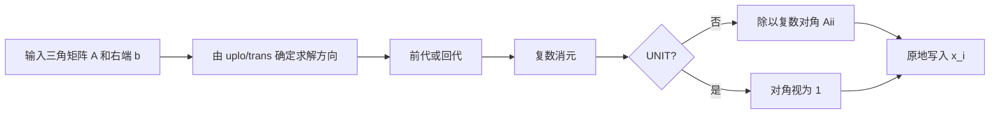
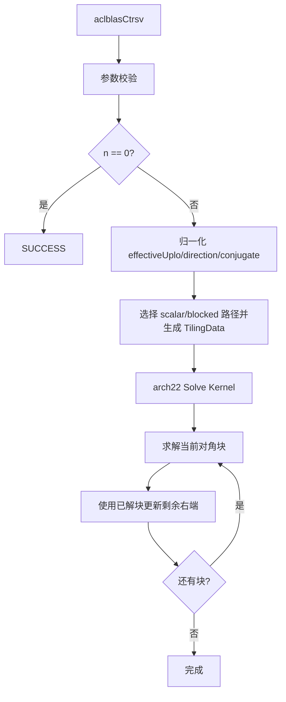
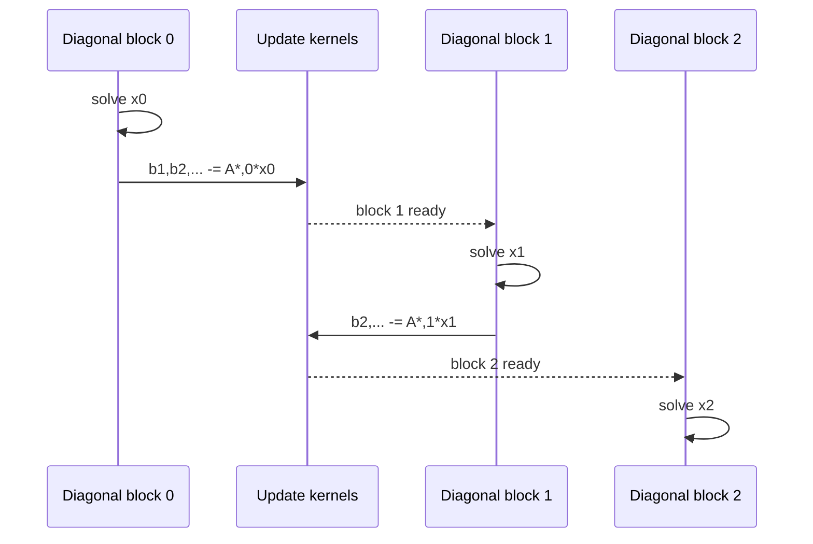
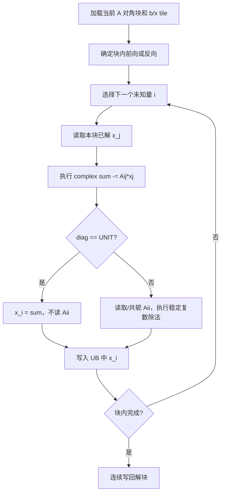
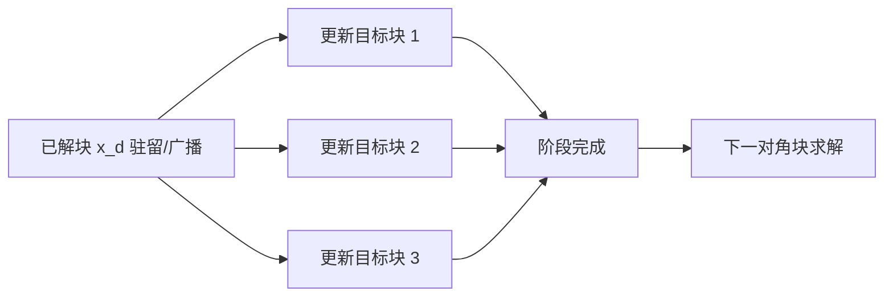
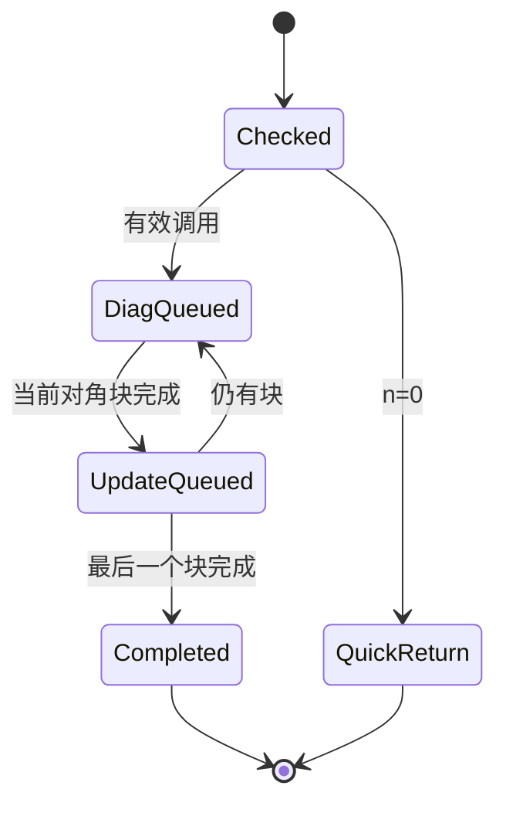

# aclblasCtrsv 算子设计文档（Atlas A2/A3）

| 文档版本 | 日期 | 作者/团队 | 说明 |
| --- | --- | --- | --- |
| V1.0 | 2026-08-26 | nudt_wsy | 按社区任务 CheckList 完整整理 A2/A3 评审稿 |

> 目标代码目录为 `ops-blas/blas/trsv/arch22/`，测试目录为 `ops-blas/test/trsv/ctrsv/arch22/`。公开接口由所有产品线共用，本文只设计 Atlas A2/A3（DAV_2201）路径。

# 一、需求背景

## 1.1 需求来源

本需求来源于 2026 年 8 月社区任务 `aclblasCtrsv`，要求参考 cuBLAS `cublasCtrsv` 和 Netlib `ctrsv`，在 Atlas A2/A3 上使用 Ascend C 实现单精度复数三角线性系统求解，完成设计、开发、精度、异常和性能验收。

## 1.2 背景介绍

TRSV 属于 BLAS Level 2，用于求解单右端三角线性系统：

$$op(A)x=b$$

A 为 n 阶上/下三角矩阵，x 入口保存 b，出口原地保存解。与 TRMV 不同，TRSV 的每个新解分量依赖之前已经求出的分量，存在严格的前代/回代顺序，不能将所有输出元素无依赖地并行计算。

仓内已有 `aclblasStrsv` 实数实现及公共 Handle/stream 框架。本任务增加 complex64 乘减、稳定复数除法、`OP_C` 共轭转置和正负步长处理，同时保持公共 ABI 和错误码风格一致。

## 1.3 标杆语义与现状

| 项目 | cuBLAS/Netlib | 本任务 |
| --- | --- | --- |
| 方程 | `op(A)x=b` | 完全对齐 |
| dtype | complex64 | complex64 |
| matrix | 列主序上/下三角 | 完全对齐 |
| operation | N/T/C | 完全对齐 |
| diagonal | UNIT/NON_UNIT | UNIT 不读取对角 |
| stride | 正/负非零 incx | 完全对齐 |
| singular check | 不检查 | 不检查，由调用方保证非奇异 |



## 1.4 需求价值

- 补齐 complex64 三角求解基础能力；
- 为 TRSM、TPSV 和稀疏三角求解提供复数数值及波前设计参考；
- 避免调用方显式求逆后再乘向量，降低计算量和数值误差；
- 统一 A2/A3 与其他产品线公开 API。

# 二、需求分析

## 2.1 外部依赖

| 依赖 | 用途 | 约束 |
| --- | --- | --- |
| CANN 9.1.0 | Runtime、stream、launch | 验收版本 |
| Ascend C DAV_2201 | A2/A3 Kernel | arch22 |
| ops-blas 公共层 | Handle、类型、错误码 | 与 Strsv 同风格 |
| Netlib CBLAS | 复数三角求解 Golden | `ctrsv` |
| cuBLAS | 参数和性能标杆 | `cublasCtrsv` |

## 2.2 内部模块

| 模块 | 职责 |
| --- | --- |
| 公共头文件 | 新增 `aclblasCtrsv` 声明 |
| `ctrsv_host.cpp` | 校验、方向归一化、tiling、workspace、launch |
| `ctrsv_tiling_data.h` | Host/Kernel 协议 |
| `ctrsv_kernel.cpp` | 块级前代/回代、复数乘减和除法 |
| 测试模块 | CSV、CBLAS Golden、残差、安全和性能 |

## 2.3 接口原型

```cpp
aclblasStatus_t aclblasCtrsv(
    aclblasHandle_t handle,
    aclblasFillMode_t uplo,
    aclblasOperation_t trans,
    aclblasDiagType_t diag,
    int n,
    const aclblasComplex* A,
    int lda,
    aclblasComplex* x,
    int incx);
```

## 2.4 参数语义

| 参数 | 角色 | 语义与校验 |
| --- | --- | --- |
| handle | 输入 | 有效 Handle；空返回 `HANDLE_IS_NULLPTR` |
| uplo | 属性 | UPPER/LOWER |
| trans | 属性 | N/T/C |
| diag | 属性 | NON_UNIT/UNIT；UNIT 不读取 Aii |
| n | 输入 | `n>=0`；n=0 quick return |
| A | 输入 | n*n 逻辑矩阵，Device complex64，列主序 |
| lda | 输入 | `lda>=max(1,n)` |
| x | 输入/输出 | 右端 b / 解 x，原地覆盖 |
| incx | 输入 | 非零正负步长；拒绝 INT_MIN |

根据任务书，非法维度、指针、步长和不支持的值返回 `ACLBLAS_STATUS_INVALID_VALUE`；实现应以仓库公共错误码规范为最终准则，测试与 Host 保持一致。

## 2.5 支持范围与约束

| 维度 | 支持能力 |
| --- | --- |
| 硬件 | Atlas A2/A3 |
| dtype | complex64 |
| matrix layout | column-major，允许 lda padding |
| operation | N/T/C |
| diagonal | UNIT/NON_UNIT |
| stride | incx 正/负非零 |
| singularity | 不检测奇异或近奇异 |
| async | Handle stream 异步执行 |
| output | x 原地覆盖，不返回额外 Tensor |

## 2.6 数学与依赖方向

以 `op(A)` 为有效下三角时，前代为：

$$x_i=\frac{b_i-\sum_{j=0}^{i-1}op(A)_{ij}x_j}{op(A)_{ii}},\quad i=0,1,\ldots,n-1$$

有效上三角时，回代为：

$$x_i=\frac{b_i-\sum_{j=i+1}^{n-1}op(A)_{ij}x_j}{op(A)_{ii}},\quad i=n-1,\ldots,0$$

| uplo | trans | `op(A)` 三角 | 求解方向 | 共轭 |
| --- | --- | --- | --- | --- |
| LOWER | N | LOWER | 前向 | 否 |
| UPPER | N | UPPER | 反向 | 否 |
| LOWER | T | UPPER | 反向 | 否 |
| UPPER | T | LOWER | 前向 | 否 |
| LOWER | C | UPPER | 反向 | 是 |
| UPPER | C | LOWER | 前向 | 是 |

```mermaid
flowchart TD
    A[uplo/trans] --> B{trans == N?}
    B -- 是 --> C[effectiveUplo = uplo]
    B -- 否 --> D[effectiveUplo = opposite(uplo)]
    D --> E{trans == C?}
    E -- 是 --> F[conjugate = true]
    E -- 否 --> G[conjugate = false]
    C --> H{effectiveUplo}
    F --> H
    G --> H
    H -- LOWER --> I[前向求解 0 -> n-1]
    H -- UPPER --> J[反向求解 n-1 -> 0]
```

## 2.7 边界行为

- n=0 返回 SUCCESS，不引用 A/x；
- n>0 时 A/x 非空，lda 满足要求；
- UNIT 对角位置不读取，即使填入 NaN/Inf；
- NON_UNIT 不检查零对角，调用方必须提供非奇异矩阵；
- 仅指定三角读取，另一三角可为任意值；
- x 物理长度为 `1+(n-1)*abs(incx)`。

## 2.8 需求拆解

1. API、参数校验和方向归一化；
2. 标量/块级三角前代与回代；
3. 复数乘减和稳定除法；
4. N/T/C 地址路径及正负 incx；
5. 对角块依赖、波前同步和 workspace；
6. Golden、残差、异常、安全及性能验证。

# 三、需求详细设计

## 3.1 总体架构



## 3.2 Host 侧设计

### 3.2.1 参数检查流程

```mermaid
flowchart TD
    A[进入 API] --> H{Handle 为空?}
    H -- 是 --> EH[HANDLE_IS_NULLPTR]
    H -- 否 --> E{枚举合法?}
    E -- 否 --> EV[按公共规范返回错误]
    E -- 是 --> N{n>=0, incx!=0/INT_MIN?}
    N -- 否 --> EV
    N -- 是 --> Q{n==0?}
    Q -- 是 --> OK[SUCCESS，不访问 A/x]
    Q -- 否 --> L{lda>=max(1,n), A/x非空?}
    L -- 否 --> EV
    L -- 是 --> RUN[进入规划]
```

Host 使用 64 位中间量检查 `lda*n` 和 x 物理长度，避免地址计算溢出。API 不读取 Device 对角值，因此不做奇异性检查。

### 3.2.2 算法选择

| shape class | 路径 | 目的 |
| --- | --- | --- |
| 很小 n | 单核 scalar/vector | 降低启动和同步开销 |
| 中等 n | 单核 blocked | 对角块驻留 UB，批量更新 |
| 大 n | 块级波前 | 对角块顺序、更新块并行 |
| UNIT | 跳过对角加载/除法 | 正确性与性能快路 |
| `abs(incx)==1` | 连续 x 路径 | 性能主路径 |

### 3.2.3 TilingData

| 字段 | 含义 |
| --- | --- |
| n/lda/incx | 基本布局 |
| effectiveUplo | op(A) 的有效三角 |
| direction | 前向/反向 |
| conjugate/diag | 共轭与单位对角 |
| blockSize | 对角块阶数 |
| blockCount/tail | 块数和尾块 |
| xCount | x 物理长度 |
| pathKey | scalar/blocked/wavefront |

### 3.2.4 块级波前

三角求解不能让所有对角块同时求解，但当前对角块完成后，对剩余右端的多个更新 tile 可以并行：



同一 stream 上多个 Kernel launch 天然提供阶段顺序，或在单 Kernel 内用平台支持的全局同步机制。设计优先选择仓内已验证的执行模型，禁止使用无保障的跨 AIV 自旋等待。

### 3.2.5 workspace

blocked 路径可按需要保存：

- 规整后的连续 x（当 `abs(incx)>1`）；
- 当前/已解对角块；
- 更新阶段的临时右端；
- 波前状态或 tiling 数据。

workspace 查询、地址、容量和别名在 launch 前校验。若仅在 x 原位完成更新，可不额外复制完整矩阵。API 内不申请无法按 stream 生命周期释放的临时 Device 内存。

## 3.3 Kernel 侧设计

### 3.3.1 单块求解流程



### 3.3.2 A 地址映射

原矩阵列主序下标为 `row+col*lda`。对输出方程 i、依赖分量 j：

| trans | row | col | 系数 |
| --- | ---: | ---: | --- |
| N | i | j | `A(i,j)` |
| T | j | i | `A(j,i)` |
| C | j | i | `conj(A(j,i))` |

只有指定三角的合法坐标允许计算 GM 地址。UNIT 对角在任何 DataCopy/Gather 前判断并直接注入 `(1,0)`。

### 3.3.3 复数乘减

$$s_r\mathrel{-}=a_r x_r-a_i x_i$$

$$s_i\mathrel{-}=a_r x_i+a_i x_r$$

块内已解向量驻留 UB，矩阵按列段或转置所需的行片段搬入。尾块无效 lane 显式清零并用 mask 控制，避免参与归约。

### 3.3.4 稳定复数除法

直接计算 `(s*conj(a))/(ar^2+ai^2)` 在极大或极小分量下容易溢出/下溢。采用按较大分量缩放的 Smith 形式：

```mermaid
flowchart TD
    A[计算 s / a] --> B{|ar| >= |ai|?}
    B -- 是 --> C[r=ai/ar, den=ar+ai*r]
    C --> D[xr=(sr+si*r)/den]
    C --> E[xi=(si-sr*r)/den]
    B -- 否 --> F[r=ar/ai, den=ai+ar*r]
    F --> G[xr=(sr*r+si)/den]
    F --> H[xi=(si*r-sr)/den]
```

本算子不检查 `a==0` 或近奇异性；零对角结果遵循浮点运算传播。测试正常用例保证对角远离零，特殊 Inf/NaN 用例单独记录语义。

### 3.3.5 块更新

对已求解块 `x_d`，更新未解右端块：

$$b_r\leftarrow b_r-op(A)_{r,d}x_d$$

这是可并行的矩阵-向量更新。每个核拥有不重叠的目标 b/x 区间，不使用原子；更新完成后才能启动下一对角块求解。



### 3.3.6 x 步长

逻辑下标映射：

$$p(i)=i\cdot incx\ (incx>0),\qquad p(i)=(n-1-i)|incx|\ (incx<0)$$

`abs(incx)==1` 使用连续搬运；其他步长可先 Gather 到连续 workspace，求解后 Scatter 回原物理位置。x 物理空洞不得改写。

### 3.3.7 UB 规划

| 区域 | 用途 |
| --- | --- |
| A diagonal tile | 当前三角对角块 |
| A update tile | 块更新系数 |
| x solved tile | 已求解分量 |
| rhs tile | 当前/待更新右端 |
| real/imag work | 复数乘减与除法 |
| mask/index | 尾块和 stride gather |

blockSize 由 UB 容量、complex64 双分量、更新 tile 和临时区共同确定。字节核算必须留出队列/对齐余量，不依赖越界重叠 LocalTensor。

## 3.4 性能和数值策略

1. 小 n 单 Kernel，避免波前多次启动；
2. 大 n 使用 blocked TRSV，对角求解串行、块更新并行；
3. 已解 x block 复用，减少重复 GM 读取；
4. `incx=1` 连续快路；
5. UNIT 跳过对角读取与除法；
6. N/T/C 分离 dispatch，减少热循环属性判断；
7. FP32 分量累加和缩放复除法控制数值风险。

## 3.5 异步和生命周期



所有阶段在 Handle stream 上按序下发。Host 不做 `aclrtSynchronizeDevice`；用户在 stream 完成前保持 A、x、workspace 和 Handle 有效。Kernel/launch 错误转换为公共状态码。

# 四、特性交叉分析

## 4.1 兼容性分析

| 特性 | 风险 | 处理 |
| --- | --- | --- |
| N/T/C × U/L | 方向映射错误 | effectiveUplo 表驱动和 6 组合测试 |
| UNIT × NaN 对角 | 错误读取传播 | load 前判断，保护值测试 |
| NON_UNIT × 病态矩阵 | 误差放大 | 正常随机用例对角增强，另报残差 |
| 多核 × 依赖 | 未完成数据被读取 | 块级波前和阶段同步 |
| 负 incx × 方向 | 双重反向混淆 | 求解逻辑方向与物理地址映射解耦 |
| A2/A3 | UB/核数差异 | 平台查询产生 tiling |

## 4.2 安全与资源

- `lda*n`、xCount 和 workspace 使用 64 位溢出检查；
- A 只读且只访问指定三角；
- x 只写逻辑元素，padding/canary 不变；
- 不做未经同步的跨核通信；
- workspace 不足或重叠在 launch 前报错；
- UNIT 对角不产生 GM load。

## 4.3 风险与规避

| 风险 | 影响 | 规避措施 |
| --- | --- | --- |
| 前代/回代方向错误 | 全量结果错误 | 手工 3x3 六组合用例 |
| 波前同步不正确 | 随机非确定性 | stream 多 Kernel 或已验证全局同步原语 |
| 复数除法溢出 | 精度失败 | 缩放算法和极值专项 |
| 过多 Kernel launch | 小尺寸性能差 | shape-based 单核/blocked dispatch |
| 残差小但逐点误差大 | 验收口径不一致 | 同时执行 Golden 逐点比较和残差报告 |

# 五、可维可测分析

## 5.1 可维护性

- 方向归一化集中在 Host helper；
- 对角求解与块更新解耦，可分别优化和测试；
- 复数乘减/除法为独立 device helper；
- TilingData 固定宽度并做 Host/Kernel 布局检查；
- 日志记录属性、方向、blockSize、blockCount、workspace 和 pathKey。

## 5.2 测试设计

### 5.2.1 测试层级与证据追踪

测试采用“接口层—Kernel 层—基准层—资源层”的闭环；每一层都保留可复现输入、日志和判定结果，三角依赖顺序与复数除法单独留证。

| 层级 | 验证内容 | 主要证据 | 通过门槛 |
| --- | --- | --- | --- |
| 接口层 | 枚举、n/lda/incx、空指针、quick return | GTest/CSV 返回值日志 | 与任务书逐项一致 |
| Kernel 层 | 6 种有效方向、UNIT、波前、stride、尾块 | NPU 输出、canary、依赖日志 | 无越界且解向量正确 |
| Golden 层 | Netlib `ctrsv` 与残差 | 实部/虚部误差、匹配率、残差 | 容差和残差均满足门槛 |
| 资源层 | workspace、阶段顺序、stream、核间依赖 | Profiler、阶段日志 | 无竞态、隐式同步/fallback |
| 性能层 | 任务书 P-01/P-02/P-03 | 分阶段 warmup/采样数据 | 不高于任务书标杆 |

### 5.2.2 可复现执行口径

CSV 用例、随机种子、编译目标和 CANN/驱动版本写入测试报告；性能测试先 warmup，再进行超过 50 次有效采样。正常 NON_UNIT 用例记录对角最小幅值，避免把病态系统误判为 Kernel 错误。

| 分类 | 覆盖内容 |
| --- | --- |
| 属性 | U/L × N/T/C × UNIT/NON_UNIT 12 组合 |
| shape | n=0/1/2/3、质数、2 的幂及 ±1、block 边界、大尺寸 |
| layout | lda=n、n+1、n+7，另一三角填 NaN |
| stride | incx=±1/±2/±3，空洞保持不变 |
| diagonal | UNIT 未读；NON_UNIT 对角增强、纯实/纯虚/复数 |
| numerical | 大小量级、抵消、Inf/NaN、近病态专项 |
| exception | 空 Handle/A/x、非法枚举、负 n、lda 不足、incx=0/INT_MIN |
| safety | workspace 少一字节、首尾 canary、非默认 stream |
| performance | 三个任务书 case，warmup 后 >50 次 |

除与 Netlib `ctrsv` 逐元素比较外，计算归一化残差：

$$residual=\frac{\|op(A)x-b\|_\infty}{\|A\|_\infty\|x\|_\infty+\|b\|_\infty}$$

残差用于诊断数值稳定性，不替代任务书规定的逐元素验收。

## 5.3 精度标准

complex64 实部/虚部分别按 FP32 比较：`rtol=2^-10`、`atol=2^-16`、匹配率不低于 0.99，最大绝对误差不超过 `1e-2` 或 `32 ULP`。正常 NON_UNIT 用例保证对角远离零，避免用病态条件数掩盖实现错误。

## 5.4 性能标准

| case | n | uplo | trans | diag | incx | Avg time 上限 |
| --- | ---: | --- | --- | --- | ---: | ---: |
| P-01 | 512 | UPPER | N | NON_UNIT | 1 | 48.28 us |
| P-02 | 1024 | LOWER | N | NON_UNIT | 1 | 95.79 us |
| P-03 | 2048 | UPPER | T | NON_UNIT | 1 | 155.81 us |

测试设备为 Atlas 800I A2（910B3）。Profiler 记录对角求解、块更新、Kernel launch 总耗时、各阶段 AIV/HBM 指标和核间尾差。

## 5.5 交付件

1. 设计文档和评审记录；
2. 公共声明、Host、Kernel、Tiling 代码；
3. CSV、CBLAS Golden、残差和异常测试；
4. 精度、性能、Profiler 自测报告；
5. README 和代码分支地址。
