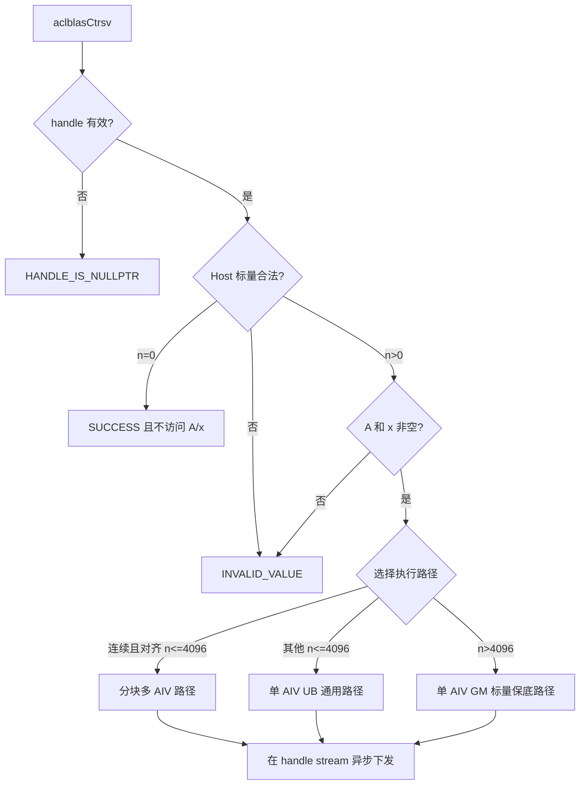
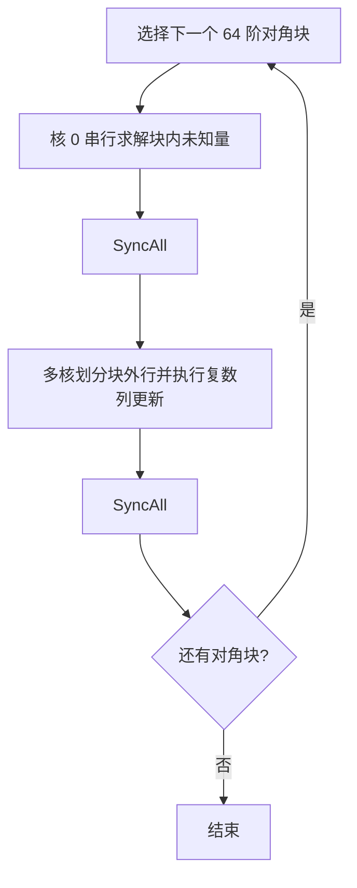
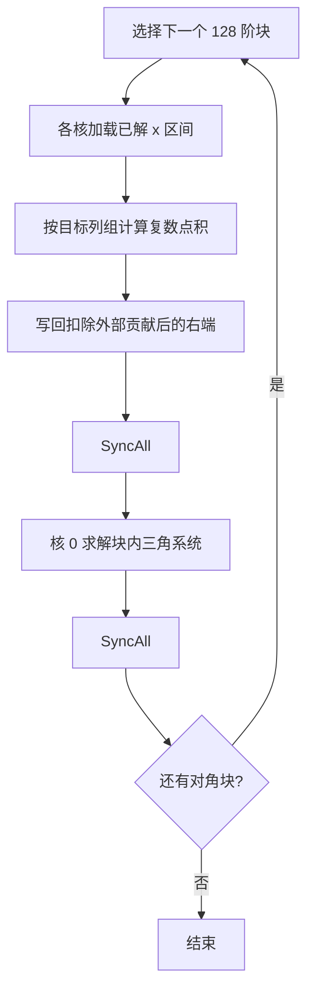

# aclblasCtrsv 算子设计文档

# 需求背景（required）

## 需求来源

本设计面向 CANN 社区任务“aclblasCtrsv 算子开发（A2/A3）”。目标是在 Atlas 800I A2/A3 系列产品上，以 Ascend C Kernel 直调方式补充单精度复数三角方程求解能力，并通过 ops-blas 的句柄式接口异步执行。

公共接口放在 `include/cann_ops_blas.h`，A2/A3 实现放在 `blas/trsv/arch22/`。接口语义对齐 cuBLAS `cublasCtrsv` 和 Netlib BLAS `ctrsv`，不新增产品私有接口。

## 背景介绍

`aclblasCtrsv` 属于 BLAS Level 2，求解单右端三角线性系统：

$$
op(A)x=b
$$

矩阵 $A$ 为 $n\times n$ 的 complex64 上三角或下三角矩阵，`x` 在入口保存右端向量 $b$，完成后原地保存解。`op(A)` 支持原矩阵、转置和共轭转置。

三角求解的当前未知量依赖已经求出的未知量，不能把所有行完全独立地并行。设计采用对角块串行求解、块外更新并行的方法：块之间保持数学依赖，块外的大规模复数向量运算分配给多个 AIV 核。

# 需求分析（required）

## 需求描述

1. 支持 `UPPER/LOWER × N/T/C × UNIT/NON_UNIT` 共 12 种属性组合。
2. `A` 为列主序，`lda >= max(1,n)`；只引用 `uplo` 指定的三角区域。
3. `diag=ACLBLAS_UNIT` 时对角按复数 $(1,0)$ 处理，不读取 `A` 的对角元素。
4. `x` 原地更新，支持任意非零正、负 `incx`；物理长度为 `1+(n-1)|incx|`。
5. `n=0` 为合法空操作，不访问 `A` 或 `x`，直接返回成功。
6. 不检测奇异或近奇异矩阵；NON_UNIT 场景由调用方保证对角非零。
7. 调用在 handle 绑定的 stream 上异步下发，接口内部不执行 stream 同步。

## 算子原型

```cpp
aclblasStatus_t aclblasCtrsv(
    aclblasHandle_t handle,
    aclblasFillMode_t uplo,
    aclblasOperation_t trans,
    aclblasDiagType_t diag,
    int n,
    const aclblasComplex* A,
    int lda,
    aclblasComplex* x,
    int incx);
```

## 参数和异常语义

| 参数 | 位置 | 说明 | 非法行为 |
| --- | --- | --- | --- |
| `handle` | Host | ops-blas 上下文和 stream | 空指针返回 `ACLBLAS_STATUS_HANDLE_IS_NULLPTR` |
| `uplo` | Host | `ACLBLAS_UPPER` 或 `ACLBLAS_LOWER` | 其他值返回 `ACLBLAS_STATUS_INVALID_VALUE` |
| `trans` | Host | `ACLBLAS_OP_N/T/C` | 其他值返回 `ACLBLAS_STATUS_INVALID_VALUE` |
| `diag` | Host | `ACLBLAS_NON_UNIT/UNIT` | 其他值返回 `ACLBLAS_STATUS_INVALID_VALUE` |
| `n` | Host | 阶数，`n>=0` | 负值返回 `ACLBLAS_STATUS_INVALID_VALUE` |
| `A` | Device | `lda × n` complex64 列主序数组 | `n>0` 时为空返回 `ACLBLAS_STATUS_INVALID_VALUE` |
| `lda` | Host | 前导维，`lda>=max(1,n)` | 不满足时返回 `ACLBLAS_STATUS_INVALID_VALUE` |
| `x` | Device | complex64 输入/输出向量 | `n>0` 时为空返回 `ACLBLAS_STATUS_INVALID_VALUE` |
| `incx` | Host | 非零存储增量 | 0 或无法安全取绝对值的 `INT_MIN` 返回 `ACLBLAS_STATUS_INVALID_VALUE` |

校验先检查 handle、枚举、`n`、`lda` 和 `incx`。`n=0` 在这些 Host 标量合法时直接返回成功，不检查也不访问 `A` 和 `x`；`n>0` 再要求两个 Device 指针非空。

## 需求拆解

1. 增加公共 API 声明、arch22 Host 入口和共享 tiling 数据。
2. 将属性组合归一为前代或回代，并确定原矩阵列中的合法访问区间。
3. 为连续、对齐的验收规模提供分块多核路径。
4. 为非对齐尺寸、带步长向量和大于 UB 驻留上限的输入提供通用路径。
5. 使用一个 Kernel 入口覆盖全部组合，控制核函数数量和代码规模。
6. 建立 CSV 驱动的功能、精度、异常、性能和内存验证。

# 详细设计（required）

## 算子分析

### 数学公式

当 $op(A)$ 为下三角矩阵时执行前代：

$$
x_i=\frac{b_i-\sum_{j=0}^{i-1}op(A)_{ij}x_j}{op(A)_{ii}},
\quad i=0,1,\ldots,n-1
$$

当 $op(A)$ 为上三角矩阵时执行回代：

$$
x_i=\frac{b_i-\sum_{j=i+1}^{n-1}op(A)_{ij}x_j}{op(A)_{ii}},
\quad i=n-1,n-2,\ldots,0
$$

属性映射为：

| `uplo` | `trans` | $op(A)$ 三角性 | 顺序 | 系数共轭 |
| --- | --- | --- | --- | --- |
| LOWER | N | LOWER | 前代 | 否 |
| UPPER | N | UPPER | 回代 | 否 |
| UPPER | T | LOWER | 前代 | 否 |
| LOWER | T | UPPER | 回代 | 否 |
| UPPER | C | LOWER | 前代 | 是 |
| LOWER | C | UPPER | 回代 | 是 |

对于 $a=a_r+i a_i$、$z=z_r+i z_i$：

$$
az=(a_rz_r-a_iz_i)+i(a_rz_i+a_iz_r)
$$

NON_UNIT 对角采用 FP32 分量计算：

$$
\frac{x_r+i x_i}{a_r+i a_i}=
\frac{(x_ra_r+x_ia_i)+i(x_ia_r-x_ra_i)}{a_r^2+a_i^2}
$$

`OP_C` 在参与运算前对矩阵虚部取反。算子不额外检测零对角，NaN/Inf 按 FP32 运算规则传播。

### 数据布局

GM 中 `aclblasComplex` 以实部、虚部交织存放。矩阵元素地址为：

$$
A(row,col)\rightarrow 2(col\cdot lda+row)
$$

逻辑向量元素地址为：

$$
index_x(i)=
\begin{cases}
i\cdot incx,&incx>0\\
(n-1-i)\cdot |incx|,&incx<0
\end{cases}
$$

所有跨度计算使用 64 位无符号中间量，避免 `lda*n` 和负步长地址计算溢出。

## 算子实现

### 总体流程



工程文件职责：

| 文件 | 职责 |
| --- | --- |
| `include/cann_ops_blas.h` | 公共 API 声明 |
| `blas/trsv/arch22/ctrsv_host.cpp` | 参数校验、分核选择、workspace 准备和 Kernel 下发 |
| `blas/trsv/arch22/ctrsv_tiling_data.h` | Host/Kernel 共享参数 |
| `blas/trsv/arch22/ctrsv_kernel.cpp` | 唯一 AIV Kernel 入口及全部求解路径 |

### Host 侧设计

Host 侧获取可用 AIV 核数并生成以下固定布局的 tiling 数据：

```cpp
struct CtrsvTilingData {
    uint32_t n;
    uint32_t lda;
    uint32_t useCoreNum;
    uint32_t uplo;
    uint32_t trans;
    uint32_t diag;
    int32_t incx;
};
```

分核规则如下：

| 条件 | 路径与核数上限 |
| --- | --- |
| `incx=1`、`trans=N`、`n>=128` 且 `n%32=0` | 64 阶对角块；n<1024 使用最多 8 核，n<2048 使用最多 16 核，其余最多 32 核 |
| `incx=1`、`trans=T/C`、`n>=128` 且 `n%128=0` | 128 阶对角块，最多 32 核 |
| 其他情况 | 单 AIV 通用路径 |

实际核数不超过设备的 AIV 核数。Host 只传递标量元数据，不读取用户 Device 数据；Kernel 下发后立即返回。

### Kernel 路径

#### 无转置分块路径

列主序下，同一列的有效三角片段连续。LOWER 从左向右、UPPER 从右向左处理 64 阶对角块：



块内只搬运当前 x 子向量。每个 pivot 仅从原矩阵合法三角片段读取系数；UNIT 分支不读取对角。块外更新将连续行按 4 个 complex64 元素为最小组分配给各核，并以 64 行 tile 搬入矩阵面板和 x。

#### 转置/共轭转置分块路径

转置后第 $j$ 个方程所需系数仍位于原矩阵第 $j$ 列。每个 128 阶块先并行计算已解块对当前右端的贡献，再由核 0 串行解对角块：



外部依赖不超过 2048 个元素时，相邻两个目标列共用一次面板搬运；更长依赖按单列处理，避免 UB 超量。尾部在规约前清零，保证 padding 不进入求和。

#### 通用路径

- `n<=4096`：x 可放入固定 UB 区域。`incx=1` 使用连续搬运，其他步长按逻辑索引 gather/scatter；矩阵按合法列片段分批搬运，实部/虚部分离后做 Vector 更新或点积。
- `n>4096`：由核 0 直接在 GM 上按数学依赖顺序计算。该路径不依赖固定 UB 容量，保证运行时维度的功能完整性，但不作为性能路径。

三个路径使用同一地址映射、共轭规则和前代/回代方向，不根据测试 case 名称或固定随机数据选择实现。

### 内存与同步

- 只提供一个 `ctrsv_kernel` 全局入口；不同属性和规模在入口内分派。
- 验收规模的 UB 区域用于交织矩阵、x 实部/虚部、矩阵实部/虚部、复乘临时量和规约工作区，静态上限对应 4096 个 complex64 向量元素。
- MTE2 到 Vector、Vector 到 MTE3 使用 `SetFlag/WaitFlag`；连续 Vector 指令使用 `PipeBarrier<PIPE_V>`。
- 分块多核路径仅在对角块求解和块外更新的边界使用 `SyncAll`，保证后续块只观察到完整的已解结果。
- Kernel 不把 `A` 写回，x 只覆盖逻辑元素；带步长向量的空洞保持不变。

### 特殊值与三角引用

- 未引用三角、`lda` padding 和 UNIT 对角不参与任何系数访问。
- NON_UNIT 只读取当前 pivot 对角，不进行奇异性判断。
- 不裁剪或替换 NaN/Inf；有效输入中的特殊值自然传播。
- 尾块先清零再参与向量规约，避免 DMA padding 污染有效结果。

## 支持硬件

| 产品 | 架构目录 | 支持情况 |
| --- | --- | --- |
| Atlas 800I/T A2 系列 | `arch22` | 支持 |
| Atlas A3 系列 | `arch22` | 支持 |

## 算子约束限制

- `n>=0`、`lda>=max(1,n)`、`incx!=0`。
- `n>0` 时 `A`、`x` 必须指向有效 Device 内存。
- `A` 仅支持列主序；不支持 `lda/incx` 之外的任意 Tensor 视图。
- `x` 原地覆写；Kernel 完成前调用方不得释放或复用相关 Device 内存。
- 不检测奇异或近奇异矩阵，不返回奇异位置。
- 不涉及 broadcast，不保证确定性位级结果。

# 可维可测分析

## 可维护性设计

1. Host 校验、tiling、Kernel 和测试分文件组织，职责单一。
2. `CtrsvTilingData` 只包含 Kernel 实际消费的七个字段，避免隐藏状态。
3. 复数拆分、矩阵片段搬运、点积、列更新和逻辑 x 地址映射封装为独立 helper。
4. 快速路径和通用路径共用数学方向与地址公式，减少组合分支漂移。
5. 测试数据由固定种子生成，不依赖预期输出硬编码。

## 测试设计

| 类别 | 覆盖 |
| --- | --- |
| 属性 | 12 种 `uplo/trans/diag` 组合 |
| 尺寸 | 0、1、小质数、2 的幂及相邻值、非对齐值，精度到 2048、性能到 4096 |
| 布局 | `lda=n`、padding、`incx=±1/±2/±3` |
| 引用边界 | 未引用三角、UNIT 对角和 padding 填 NaN |
| 异常 | 空 handle/A/x、非法枚举、负 n、非法 lda、零步长 |
| 特殊值 | 零、交替值、极端值、Inf、NaN |
| 性能 | 64 次 warmup，100 次 event 有效采样 |
| 内存 | 性能进程峰值 Host RSS |

Golden 使用 CBLAS `cblas_ctrsv`。complex64 实部、虚部分别按 FLOAT32 标准比较。

## 精度标准/性能标准

| 精度指标 | 门槛 |
| --- | ---: |
| `rtol` | $2^{-10}$ |
| `atol` | $2^{-16}$ |
| 匹配率 | `>=0.99` |
| 最大绝对误差 | `<=1e-2` 或逐元素 `32×ULP` |

性能门槛采用任务书正文与附件的并集：

| n | uplo | trans | diag | incx | 平均耗时上限（us） |
| ---: | --- | --- | --- | ---: | ---: |
| 512 | UPPER | N | NON_UNIT | 1 | 75.43 |
| 1024 | LOWER | N | NON_UNIT | 1 | 149.67 |
| 2048 | UPPER | T | NON_UNIT | 1 | 243.46 |
| 4096 | LOWER | C | NON_UNIT | 1 | 666.79 |
| 4096 | UPPER | N | UNIT | 1 | 409.46 |

附件另给出单用例 Host 内存不超过 512 MiB，本设计使用同一更严格口径。

## 兼容性分析

- 参数顺序、列主序、原地语义和属性含义与 `cublasCtrsv` 对齐。
- 参数类型和状态码沿用 ops-blas 公共定义，与 `aclblasStrsv` 保持同族风格。
- 公共声明不绑定产品线；本次只新增 arch22 实现，不改变其他架构和既有接口。
- 异步 stream 行为沿用 ops-blas handle 约定，调用方在读回结果前负责同步。

## 参考资料

1. [Netlib BLAS CTRSV](https://www.netlib.org/blas/ctrsv.f)
2. [NVIDIA cuBLAS TRSV](https://docs.nvidia.com/cuda/cublas/index.html#cublas-t-trsv)
3. [ops-blas](https://gitcode.com/cann/ops-blas)
4. [CANN 生态算子精度标准](https://gitcode.com/cann/opbase/blob/master/docs/zh/ops_precision_standard/experimental_standard.md)
