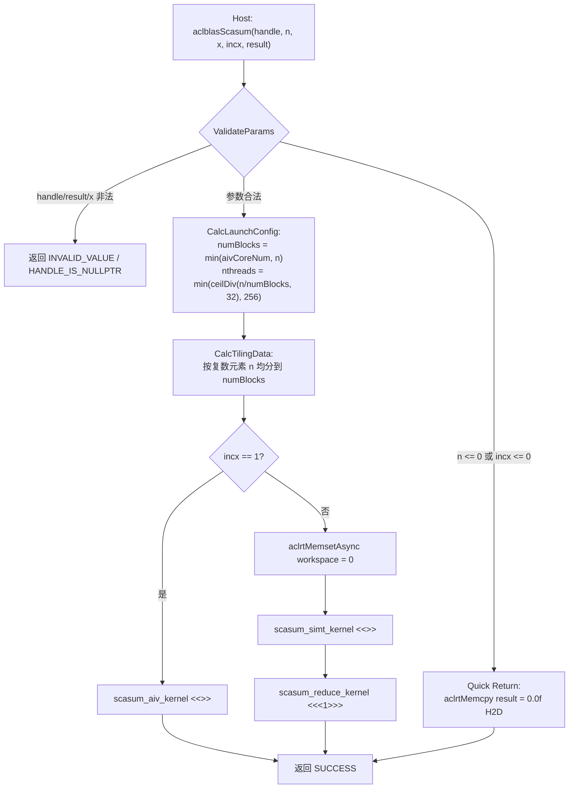
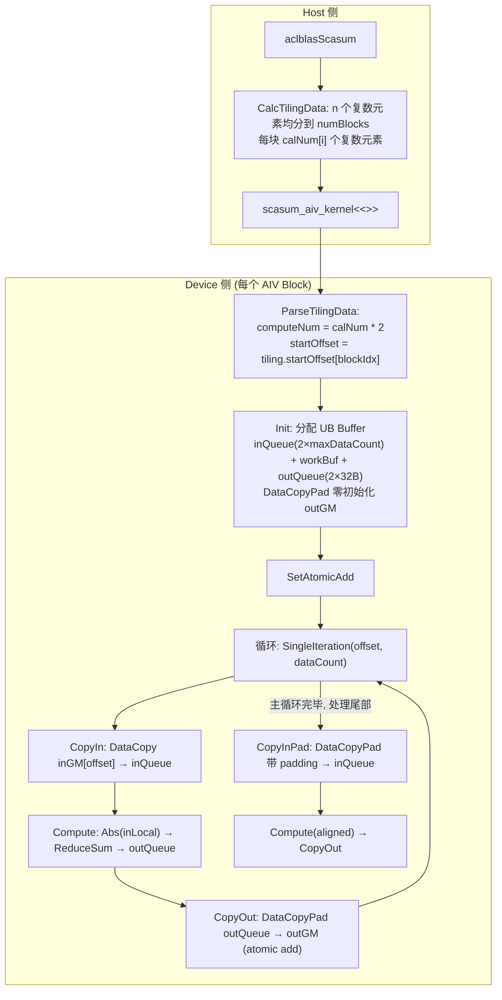
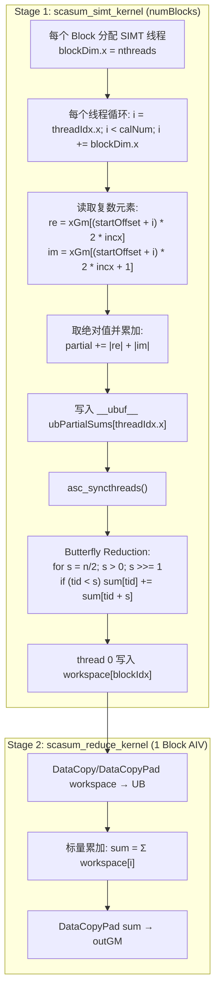

# 【社区任务】aclblasScasum 算子设计文档

## 一、需求描述

### 1.1 需求来源

本需求来源于 CANN 社区任务 2026 中的「8月社区任务 - aclblasScasum 算子开发（950PR）」。任务要求基于 Ascend C 编程语言在 ops-blas 开源仓 `blas/asum/arch35/` 目录下开发单精度复数（COMPLEX64）向量绝对值分量之和算子 `aclblasScasum`，对标 cuBLAS `cublasScasum`，完成算子设计、开发、测试全流程。

目标硬件：Ascend 950PR（DAV_3510 / arch35），CANN 版本 9.1.0。

本算子为 ops-blas 仓 BLAS Level-1 向量归约算子，以句柄式接口通过 handle 绑定 stream 直调 NPU kernel，不属于 examples 样例程序。

### 1.2 需求分析

aclblasScasum 的数学定义：

$$
\text{result} = \sum_{i=1}^{n} \left( |\text{real}(x_i)| + |\text{imag}(x_i)| \right)
$$

其中 $x_i$ 为单精度复数（COMPLEX64），实部与虚部各为 float32，交错存储（interleaved）。n 个复数元素在物理上对应 2n 个 float。

| 参数   | 类型                  | 语义                                       |
| ------ | --------------------- | ------------------------------------------ |
| handle | aclblasHandle_t       | ops-blas 库上下文句柄，携带 stream         |
| n      | int                   | 向量 x 的复数元素个数                      |
| x      | const aclblasComplex* | 单精度复数向量（Device 内存，只读）        |
| incx   | int                   | x 中连续元素之间的步长（以复数元素为单位） |
| result | float*                | 输出标量（Device 内存）                    |

**Quick Return 语义**（与 cuBLAS / Netlib scasum 一致）：n <= 0 或 incx <= 0 时，不触发 kernel，直接写 `result = 0.0f` 并返回成功。

**计算路径分析**：

**incx == 1（连续访问）**：复数数据在 GM 中连续排布，n 个复数 = 2n 个 float 连续存储。此时可将复数数据直接视为 2n 个 float，利用 AIV Vector 硬件执行逐元素 Abs + ReduceSum 归约。多 Block 并行计算时，各 Block 的 ReduceSum 结果通过 Atomic Add 累加到同一输出标量。

**incx != 1（跨步访问）**：相邻复数元素间距为 incx 个复数（即 incx × 2 个 float）。此时无法将数据当作连续 float 数组处理。采用 SIMT 路径：每个线程按步长 stride = incx × 2 读取实部和虚部两个 float，取绝对值后局部累加；Block 内通过 Butterfly Reduction 归约得到 Block 的部分和写入 workspace；最终由单独的 Reduce Kernel（1 Block AIV）将 workspace 中所有部分和归约为最终结果。

**Tiling 语义约定**：Host 侧 Tiling 按复数元素个数 n 切分（非 2n）。AIV 路径在 Kernel 内部将 calNum × 2 转换为 float 语义；SIMT 路径直接使用复数元素语义进行索引。

本实现复用同目录 sasum 的 UB 分配模型与常量定义（UB_MAX_CHUNK_FLOATS = 27392、SAFETY_MARGIN = 32KB、ELEMENTS_PER_BLOCK = 8），新增独立的 scasum_host.cpp / scasum_kernel.cpp / scasum_tiling_data.h 三个文件，不修改 sasum 已有代码。

## 二、方案设计

### 2.1 整体计算流程



图1 aclblasScasum 整体调度流程图

### 2.2 AIV 路径（incx == 1）数据流



图2 AIV 路径（incx == 1）数据流图

#### AIV 路径核心计算逻辑

AIV 路径将复数数据视为 2n 个连续 float，利用硬件 Abs 指令逐元素取绝对值，再通过 ReduceSum（Level-1）归约为标量。ReduceSum 每处理 256B（64 个 float）产生一个中间结果，存入 workBuf；最终 ReduceSum 输出一个 float 标量，通过 DataCopyPad 以 Atomic Add 方式写入 outGM。

多 Block 并行时，各 Block 的 partial sum 通过 Atomic Add 累加到同一 result 地址。Init 阶段先通过 DataCopyPad 将 outGM 零初始化，确保 Atomic Add 的初始值为 0。

Process 中的三阶段迭代：

1. **主循环**：`repeatTimes = computeNum / maxDataCount`，每次处理 maxDataCount = 27392 个 float，使用 DataCopy（要求 dataCount 为 ELEMENTS_PER_BLOCK = 8 的倍数，由 tiling 保证）。
2. **大块尾部**：剩余 `remainNum >= maxCopyPadNum = 16376` 时，使用 DataCopyPad 处理（maxCopyPadNum 由 UINT16_MAX 字节上限推导：`UINT16_MAX / 4 / 8 * 8 = 16376`）。
3. **小块尾部**：`remainNum < maxCopyPadNum` 时，使用 CopyInPad 带 padding 到 ELEMENTS_PER_BLOCK 对齐后计算。

### 2.3 SIMT 路径（incx != 1）数据流



图3 SIMT 路径（incx != 1）两阶段归约流程图

#### SIMT 路径关键设计

SIMT 路径按复数元素语义索引。每个线程每次迭代读取一个复数元素的实部和虚部（2 个 float），地址计算为 `(startOffset + i) * 2 * stride`，其中 stride = incx。这样即使 incx > 1 也能正确跳过中间不需要的复数元素。

Block 内归约采用 Butterfly Reduction：线程数取 `min(ceilDiv(ceilDiv(n, numBlocks), 32), 256)` 并向上对齐到 2 的幂（`RoundUpPow2`），确保 Butterfly 树归约的步长能正确折半至 0。部分和写入 `__ubuf__` 数组（非 GM），通过 `asc_syncthreads()` 同步。

### 2.4 架构设计

#### Host / Device 分层

```
Host 侧（CPU）:
  1. ValidateScasumParams: handle / result / x 空指针检查
  2. Quick Return: n <= 0 || incx <= 0 → aclrtMemcpy(result, 0.0f, H2D)
  3. CalcScasumLaunchConfig: numBlocks = min(aivCoreNum, n), nthreads for SIMT
  4. CalcScasumTilingData: 按复数元素 n 均分到各 Block
  5. ScasumExecuteKernel:
     - incx == 1: scasum_kernel_do → scasum_aiv_kernel
     - incx != 1: aclrtMemsetAsync(workspace) → scasum_kernel_do
                  → scasum_simt_kernel → scasum_reduce_kernel

Device 侧（AI Core）:
  AIV 路径 (incx == 1):
    GM ──[MTE2/DataCopy]──> UB ──[LoadAlign]──> Vector Reg ──[Abs]──>
    ──[ReduceSum]──> UB ──[MTE3/DataCopyPad+AtomicAdd]──> GM

  SIMT 路径 (incx != 1):
    Stage 1: 各 Block SIMT 线程 → 部分和 → workspace (GM)
    Stage 2: 1-Block AIV → workspace 归约 → result (GM)
```

#### Memory Layout

```
Global Memory (GM)
│  x: [aclblasComplex × physical_length]
│     物理存储: [re0, im0, re1, im1, ..., re(n-1), im(n-1)]
│     incx == 1: 连续 2n 个 float
│     incx != 1: 第 i 个复数位于 float 偏移 i * 2 * incx
│
├─── incx == 1 ──────────────────────────────────────────────
│
│  AIV Path (per Block):
│
│  Unified Buffer (UB)
│  │  inQueue: [float × maxDataCount]  (BUFFER_NUM=2, double buffer)
│  │  workBuf: [float × level1AlignEnd] (ReduceSum 中间结果)
│  │         + UB_BYTENUM_PER_BLOCK    (MTE 对齐 padding)
│  │  outQueue: [float × ELEMENTS_PER_BLOCK] (BUFFER_NUM=2, 32B)
│  │
│  Vector Register
│  │  Abs(inLocal): 逐元素取绝对值
│  │  ReduceSum → 标量 partial sum
│  │
│  GM (outGM): DataCopyPad + AtomicAdd → result (1 float)
│
├─── incx != 1 ──────────────────────────────────────────────
│
│  SIMT Stage 1 (per Block):
│  │  __ubuf__ ubPartialSums[SIMT_MAX_THREAD_NUM]
│  │  线程局部累加 → Butterfly Reduction → workspace[blockIdx]
│
│  SIMT Stage 2 (1 Block AIV):
│  │  inQueue: [float × paddedCount] (workspace partials)
│  │  标量累加 → outQueue → result (GM)
```

scasum 为归约算子（向量 → 标量），不涉及矩阵运算，不需要 Cube 路径和 L0A/L0B/L0C。AIV 路径中间结果驻留 Vector Register（ReduceSum 输出），不在 UB 中物化最终结果。SIMT 路径中间结果在 `__ubuf__` 数组中完成 Butterfly Reduction 后写入 GM workspace。

#### AI Core 流水线

```
AIV 路径:
PIPE_MTE2 (数据搬入)        PIPE_V (向量计算)           PIPE_MTE3 (数据搬出)
┌────────────────┐      ┌──────────────────────┐      ┌────────────────────┐
│ DataCopy /     │      │ Abs(inLocal,         │      │ DataCopyPad        │
│ DataCopyPad    │ ──►  │   inLocal, count)    │ ──►  │ (outGM, outLocal,  │
│ GM → UB        │      │ ReduceSum(out,       │      │  atomic add)       │
│                │      │   in, work, count)   │      │ UB → GM            │
└────────────────┘      └──────────────────────┘      └────────────────────┘
         ── TQue EnQue/DeQue 隐式同步 ──►     ── TQue EnQue/DeQue 隐式同步 ──►

SIMT 路径 (Stage 1):
PIPE_SCALAR (SIMT 线程并行)
┌──────────────────────────────────────────────────────────┐
│ 循环: 按 stride 读 GM → |re| + |im| 累加到 partial     │
│ → ubPartialSums[tid] = partial                          │
│ → asc_syncthreads()                                     │
│ → Butterfly Reduction: sum[tid] += sum[tid + s]         │
│ → workspace[blockIdx] = sum[0]                          │
└──────────────────────────────────────────────────────────┘
```

AIV 路径通过 TQue 的 EnQue / DeQue 机制实现流水线间同步：MTE2 搬入完成 → EnQue → PIPE_V DeQue 计算 → 计算完成 → EnQue → PIPE_MTE3 DeQue 搬出。Double Buffer（BUFFER_NUM = 2）使得搬入与计算可以重叠。

#### Tiling 分块策略

Host 侧按复数元素个数 n 进行 Tiling 分块：

```
n = 1000, numBlocks = 4:
  Block 0: startOffset=0,   calNum=250  (复数元素 0~249)
  Block 1: startOffset=250, calNum=250  (复数元素 250~499)
  Block 2: startOffset=500, calNum=250  (复数元素 500~749)
  Block 3: startOffset=750, calNum=250  (复数元素 750~999)

AIV 路径 (incx == 1):
  Block 0: computeNum = calNum * 2 = 500 (float)
           startOffset = 250 (复数元素偏移, 对应 float 偏移 500)
  → DataCopy inGM[500] 起连续 500 个 float

SIMT 路径 (incx != 1, 设 incx = 2):
  Block 0: 线程循环 i=0..249
           读 xGm[(0 + i) * 2 * 2] 和 xGm[(0 + i) * 2 * 2 + 1]
           即 float 偏移 0, 4, 8, ..., 996 和 1, 5, 9, ..., 997
```

numBlocks 取值：`min(aivCoreNum, n)`，上限 SCASUM_MAX_CORE_NUM = 64。当 n < aivCoreNum 时，部分 Block 的 calNum = 0，在 Kernel 内 early return。

#### UB 分配与关键常量

```
UB 分配约束（AIV 路径）:
  UB_SIZE = 248KB = 253952 byte
  SAFETY_MARGIN = 32KB (TPipe/TQue 运行时元数据)
  可用空间 = 253952 - 32768 = 221184 byte

  inQueue:  BUFFER_NUM(2) × maxDataCount × 4 byte
  outQueue: BUFFER_NUM(2) × 32 byte = 128 byte
  workBuf:  ((ceil(maxDataCount/64) + 7) / 8 * 8) × 4 + 32 byte

  约束: 8M + ((ceil(M/64)+7)/8*8)*4 ≤ 221088
  数值求解: M ≤ 27392 (取 64 的倍数对齐 ReduceSum repeat)

  → UB_MAX_CHUNK_FLOATS = 27392
  → maxCopyPadNum = 16376 (UINT16_MAX / 4 / 8 * 8, DataCopyPad blockSize 字节上限)
```

### 2.5 接口设计

#### 公共接口

```cpp
aclblasStatus_t aclblasScasum(
    aclblasHandle_t handle,
    int n,
    const aclblasComplex* x,
    int incx,
    float* result);
```

| 参数名 | 输入/输出 | 描述                                | 数据类型              | 值域范围                  |
| ------ | --------- | ----------------------------------- | --------------------- | ------------------------- |
| handle | 输入      | ops-blas 库上下文句柄，携带 stream  | aclblasHandle_t       | 有效句柄                  |
| n      | 输入      | 复数元素个数（Host 内存）           | int                   | n <= 0 走 quick return    |
| x      | 输入      | 单精度复数向量（Device 内存，只读） | const aclblasComplex* | COMPLEX64 全集            |
| incx   | 输入      | 连续元素步长（Host 内存）           | int                   | incx <= 0 走 quick return |
| result | 输出      | 归约结果标量（Device 内存）         | float*                | 非负实数（可溢出至 Inf）  |

**返回值**：`aclblasStatus_t`，与 ops-blas 仓 `cann_ops_blas_common.h` 定义一致。

#### Kernel 侧接口

```cpp
// AIV 路径入口 (incx == 1)
__global__ __aicore__ void scasum_aiv_kernel(
    GM_ADDR inGM, GM_ADDR outGM, ScasumTilingData tdata);

// SIMT 路径入口 (incx != 1) — 阶段 1
__global__ __aicore__ void scasum_simt_kernel(
    GM_ADDR inGM, GM_ADDR workSpace, ScasumTilingData tdata);

// SIMT 路径 — 阶段 2 (归约 workspace partials → result)
__global__ __aicore__ void scasum_reduce_kernel(
    GM_ADDR workSpace, GM_ADDR outGM, uint32_t count);

// Host → Kernel 调度函数
void scasum_kernel_do(
    uint8_t* inGM, uint8_t* outGM, uint8_t* workSpace,
    const ScasumTilingData& tiling, uint32_t numBlocks, void* stream);
```

#### Tiling 数据结构

```cpp
constexpr uint32_t SCASUM_MAX_CORE_NUM = 64;

struct ScasumTilingData {
    int64_t n;                                    // 复数元素总数
    int64_t incx;                                 // 步长
    uint32_t useCoreNum;                          // 实际使用的 Block 数
    uint32_t startOffset[SCASUM_MAX_CORE_NUM];    // 各 Block 起始复数元素偏移
    uint32_t calNum[SCASUM_MAX_CORE_NUM];         // 各 Block 分配的复数元素数
    uint32_t nthreads;                            // SIMT 线程数 (incx != 1 时使用)
};
```

#### 关键常量

| 常量                 | 值    | 说明                                |
| -------------------- | ----- | ----------------------------------- |
| BYTENUM_PER_FLOAT32  | 4     | float32 字节数                      |
| UB_BYTENUM_PER_BLOCK | 32    | UB 对齐粒度（字节）                 |
| ELEMENTS_PER_BLOCK   | 8     | UB 对齐粒度（float 元素数）         |
| REDUCE_REPEAT_BYTES  | 256   | ReduceSum Level-1 单次处理字节数    |
| ELEMENTS_PER_REPEAT  | 64    | ReduceSum Level-1 单次处理 float 数 |
| BUFFER_NUM           | 2     | TQue Double Buffer 深度             |
| SAFETY_MARGIN        | 32768 | TPipe/TQue 元数据预留（字节）       |
| UB_MAX_CHUNK_FLOATS  | 27392 | 单次 AIV 处理最大 float 数          |
| SCASUM_MAX_CORE_NUM  | 64    | Tiling 数组上限（最大 AI Core 数）  |

### 2.6 测试用例设计

测试框架基于 ops-blas 仓 test 目录的 GTest 工程，CSV 文件描述用例参数，golden 由 cblas（Netlib BLAS scasum）生成。

#### 精度测试用例

| 用例类别  | 覆盖内容                                    | 说明                             |
| --------- | ------------------------------------------- | -------------------------------- |
| 基础用例  | n = 0, 1, 2, 3, 7                           | 小尺寸基本验证                   |
| 尺寸扫描  | n = 2^k, 2^k ± 1 (k = 4..20)                | 覆盖 2 的幂及边界                |
| 负维度    | n = -1, -100                                | Quick return，期望 result = 0.0f |
| 步长覆盖  | incx = 1, 2, 3                              | 正常计算路径                     |
| 零/负步长 | incx = 0, -1                                | Quick return，期望 result = 0.0f |
| 数据分布  | 均匀 [-5, 5] 50% + 正态分布 50%             | 实部/虚部独立采样                |
| 特殊值    | 全零、正负交替、极端值、Inf/NaN             | 边界行为验证                     |
| 溢出场景  | 大 n × 极端值（接近 FLT_MAX）               | 累加溢出 → Inf 一致性            |
| 空指针    | result = nullptr; x = nullptr (n>0, incx>0) | 负向用例，期望 INVALID_VALUE     |

#### 性能测试用例

| case | n        | incx | 标杆耗时 (Avg time, us) |
| ---- | -------- | ---- | ----------------------- |
| 1    | 1048576  | 1    | 4.70                    |
| 2    | 4194304  | 1    | 4.88                    |
| 3    | 16777216 | 1    | 5.68                    |

性能测试须先 warmup 再有效采样 > 50 次取平均。

#### 精度判据

FLOAT32 输出标量，按 FLOAT32 标准判定：

| 数据类型 | rtol            | atol            | required_matched_ratio | max_abs_error_limit |
| -------- | --------------- | --------------- | ---------------------- | ------------------- |
| FLOAT32  | 2^-10 (9.77e-4) | 2^-16 (1.53e-5) | 0.99                   | 1e-2 或 32 * ULP    |

通过条件：`|actual - golden| ≤ atol + rtol × |golden|`；标量输出 matched_ratio 退化为单值判定。

## 三、可维可测

### 3.1 精度标准/性能标准

| 验收标准 | 描述                                                         | 标准来源                                                     |
| -------- | ------------------------------------------------------------ | ------------------------------------------------------------ |
| 精度标准 | FLOAT32：rtol = 9.77e-4，atol = 1.53e-5，matched_ratio ≥ 0.99，max_abs_error ≤ 1e-2 或 32 * ULP | [生态算子开源精度标准](https://gitcode.com/cann/opbase/blob/master/docs/zh/ops_precision_standard/experimental_standard.md) |
| 性能标准 | n=1M → 4.70us, n=4M → 4.88us, n=16M → 5.68us (incx=1)        | 任务书 §3.3                                                  |

### 3.2 兼容性分析

aclblasScasum 为 ops-blas 仓新增接口，不修改任何既有 sasum 接口或行为。新增的 scasum_host.cpp / scasum_kernel.cpp / scasum_tiling_data.h 与同目录 sasum 文件并存，共用 `include/cann_ops_blas.h` 头文件声明。接口签名与 cuBLAS `cublasScasum` 逐参数对齐，禁止定义 950PR 私有平行 API。产品限定 Ascend 950PR（arch35），CANN 9.1.0。

### 3.3 代码工程结构

```
blas/asum/arch35/
├── sasum_host.cpp          (既有，实数 asum host 调度)
├── sasum_kernel.cpp        (既有，实数 asum kernel 实现)
├── sasum_tiling_data.h     (既有，实数 asum tiling 结构)
├── scasum_host.cpp         (新增，复数 scasum host 调度)
├── scasum_kernel.cpp       (新增，复数 scasum kernel 实现)
└── scasum_tiling_data.h    (新增，复数 scasum tiling 结构)

include/
└── cann_ops_blas.h         (新增 aclblasScasum 声明)

test/asum/scasum/arch35/    (新增，测试代码)
├── scasum_param.h
├── scasum_golden.h
├── scasum_npu_wrapper.h
├── scasum_test.cpp
└── scasum_*.csv
```

## 附录：aclblasScasum 参数说明

| 参数   | 类型                  | 默认值 | 说明                   |
| ------ | --------------------- | ------ | ---------------------- |
| handle | aclblasHandle_t       | -      | ops-blas 库上下文句柄  |
| n      | int                   | -      | 复数元素个数           |
| x      | const aclblasComplex* | -      | 输入复数向量           |
| incx   | int                   | -      | 步长（复数元素为单位） |
| result | float*                | -      | 输出标量               |

aclblasComplex 定义见 `include/cann_ops_blas_common.h`，实部/虚部各 float32，交错存储。