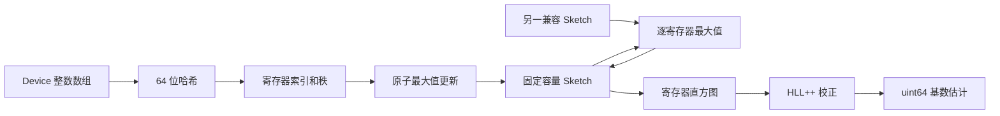
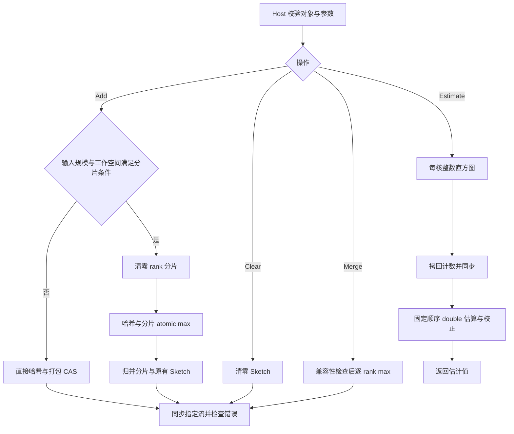

# HyperLogLog 容器及算子设计文档（Atlas 950）

| 项目 | 内容 |
| --- | --- |
| 设计对象 | `aclco::HyperLogLog` 基数估算容器及 Create、Destroy、Clear、Add、Merge、Estimate |
| 工程模式 | ops-collections 纯头文件容器；C++ Host 管理 + Ascend C AIV/SIMT Kernel |
| 目标平台 | Atlas 950 系列；CANN 9.0.0-beta.2 及以上 |
| 输入类型 | I32（`int32_t`）、I64（`int64_t`） |
| 设计依据 | 《hyperloglog容器开发任务书》及随附功能、性能测试源码 |
| 代码基线 | ops-collections，`432c15a` |
| 文档性质 | 新增容器的实现设计与验收方法|

# 1. 需求背景

## 1.1 需求来源

本任务要求参考 NVIDIA cuCollections 的 HyperLogLog，在昇腾 NPU 上提供固定容量、可合并、结果可重复的近似去重计数能力。设计遵循任务书指定的[算子设计模板](https://gitcode.com/cann/cann-ops-competitions/blob/master/04_tasks/01_community-task-2026/resources/design_template.md)，保留需求背景、需求分析、详细设计、可维可测分析四部分，并针对容器工程补充生命周期、接口、内存与测试集成设计。

任务书和附带测试确定验收契约；cuCollections 用于解释算法及接口语义；本地仓库用于确定工程组织、公共组件和构建方式。源码基线尚不包含 HyperLogLog 头文件、实现目录及测试构建入口，本文定义这些新增模块的目标行为。

## 1.2 背景介绍

HyperLogLog（HLL）以固定大小的 Sketch 估计输入集合的去重基数。每个输入经均匀哈希后，使用一部分比特选择寄存器，其余比特计算前导零长度；寄存器保存已观察到的最大秩。Sketch 不保存原始 key，空间由精度决定，不随累计输入数量增长。

本容器适用于大批量整数去重规模估算、分片统计汇总和流式累计统计。Add 对输入顺序、重复次数不敏感；Merge 对两个兼容 Sketch 做逐寄存器最大值运算，表达集合并集。Estimate 返回近似值，不提供成员查询、精确去重结果、删除或交集计数能力。

## 1.3 参考实现与工程现状

参考对象为 [`cuco::hyperloglog`](https://github.com/NVIDIA/cuCollections/blob/dev/include/cuco/hyperloglog.cuh)。它将 owning 容器、非 owning 引用、哈希更新和 HLL++ 估算分层实现。构造配置在前，hash、allocator、stream 依次在后；批量 Add 使用输入迭代器范围，Merge 接收另一容器，Estimate 返回主机侧标量。目标接口将迭代器范围替换为 Device 首地址和元素数量，保留参数的相对顺序与含义。

两者的物理布局不能直接等同：所核对的 cuCollections 实现使用 32 位寄存器，任务配套 `hll_test_common.h::RegisterCount` 明确采用每寄存器 1 字节。本设计以任务测试为准，定义 `m = SketchSizeKB × 1024`。对标寄存器状态时必须使用相同 `p`、`m`、hash 和 seed；相同 KB 标签不代表两端寄存器数相同。性能比较仍严格使用任务书给定的 KB 标签与基线，不自行更换标杆数据。

可复用的仓库组件如下，依据均对应上述源码基线。

| 已有模块 | 复用或参照内容 |
| --- | --- |
| `include/bloom_filter.h`、`include/bloom_filter_ref.h` | owning/ref 分离、禁用复制、移动所有权、同步流接口 |
| `include/detail/bloom_filter/bloom_filter.inl` | Host 参数校验、同步错误传播、平台 AIV 核数查询 |
| `include/detail/bloom_filter/kernels.h` | AIV 入口、`VF_CALL`、SIMT 线程划分、地址空间限定 |
| `include/hash_functions.h`、`include/detail/hash_functions/xxhash.h` | I32/I64 的 `xxhash_64`、固定 seed 和哈希策略比较 |
| `include/extent.h`、`include/utility/allocator.h` | 元素数量、Device 内存分配与释放 |
| `include/macros.h` | `COLLECTION_AIV_GLOBAL`、`COLLECTION_SIMT_VF` 等声明 |
| `tests/CMakeLists.txt` | 单功能源文件对应独立测试程序；单性能源文件对应独立性能程序 |



# 2. 需求分析

## 2.1 需求描述与拆解

| 编号 | 需求 | 设计约束与验收方式 |
| --- | --- | --- |
| R01 | 三种构造方式 | 按 SketchSizeKB、标准差、精度构造，统一换算为 `p` 和 `m` |
| R02 | 生命周期 | Create/Destroy、析构、移动构造和移动赋值；禁止复制所有权 |
| R03 | Clear | 全部寄存器归零；重复 Clear 幂等；清空后可重用 |
| R04 | Add | I32/I64 Device 数组；空输入、重复输入、分批输入及尾部均正确 |
| R05 | Merge | 同类型、精度、布局、设备及哈希策略兼容；源容器不变 |
| R06 | Estimate | 返回 `uint64_t`，空 Sketch 返回 0，估算不修改 Sketch |
| R07 | 可重复 | 相同 key 集合、配置、hash 和 seed 得到相同寄存器及估算结果 |
| R08 | 精度 | 非空集合满足 `abs(estimate − N) / N ≤ 3 × 1.04 / sqrt(m)` |
| R09 | 性能 | 全部 72 个参数组合逐项比较，`T_actual ≤ T_baseline / 0.4` |
| R10 | 内存 | 不复制完整 Device 输入；Sketch 和工作空间不按输入规模线性增长 |
| R11 | 集成 | 新增指定头文件、detail 目录、功能/性能测试目录及 README 入口 |
| R12 | 验证范围 | 1280 个功能执行组合、72 个性能组合及必要边界补充用例 |

## 2.2 输入输出与参数约束

| 参数 | 类型及位置 | 形状/范围 | 行为与校验 |
| --- | --- | --- | --- |
| `hll` | Host C++ 对象 | 已初始化且拥有 Device Sketch | 不引入额外 C handle；对象表达任务书中的句柄 |
| `keys` | Device `void*`，按 `Key` 读取 | ND 连续数组 `[keyNum]` | `keyNum > 0` 时非空、按 `alignof(Key)` 对齐、可访问范围充分 |
| `keyNum` | `Extent<std::size_t>` | 64 位目标平台上的非负整数 | 检查字节数乘法和地址范围算术溢出；0 时允许 `keys == nullptr` |
| `sketchSizeKb` | Host `uint32_t` | 8、16、32、64、128、256 | 其他值报错，不静默舍入为合法容量 |
| `precision` | Host `uint32_t` | 13～18 | `m = 2^precision`，其余值报错 |
| `standardDeviation` | Host `double` | 有限正数且能在支持容量内满足目标 | 按 3.1.1 换算；NaN、无穷大、非正值及精度要求过高时报错 |
| `otherHll` | 同模板类型容器的只读引用 | 与目标容器兼容 | 不兼容时在 Kernel 启动前报错 |
| `stream` | `aclrtStream` | 当前设备/上下文上的有效流 | `nullptr` 使用 ACL 默认流语义，不将其视为必然非法 |
| `estimate` | Host `uint64_t` 返回值 | 非负整数 | Estimate 完成所需 Device 工作及 D2H 后返回 |

`Key` 类型通过模板限定，`void*` 本身不携带运行时 dtype。Host 可检查空指针、对齐和数值溢出，但不能仅凭指针推断外部分配的真实长度与数据类型；调用方必须提供有效 Device 缓冲区。可由 ACL 检测的地址或流错误通过返回码或同步错误传播，补充测试使用可控的非法输入验证这些边界，不声称能预先识别任意悬空指针。

任务书通用表中的 `NumInputs` 对 Estimate、Merge 表示构造测试状态时的输入规模。两接口只读取 Sketch，不扫描历史输入，因此公开接口不增加无实际含义的 `numInputs` 参数。

## 2.3 容量、精度与标准差

一个逻辑寄存器占 8 位，4 个寄存器打包为一个对齐的 `uint32_t` 存储字。这样保持任务规定的容量，同时使用硬件支持的 32 位原子操作。

| SketchSizeKB | 寄存器数 m | 精度 p | 理论标准差 | 三倍标准差验收阈值 |
| ---: | ---: | ---: | ---: | ---: |
| 8 | 8192 | 13 | 1.149049% | 3.447146% |
| 16 | 16384 | 14 | 0.812500% | 2.437500% |
| 32 | 32768 | 15 | 0.574524% | 1.723573% |
| 64 | 65536 | 16 | 0.406250% | 1.218750% |
| 128 | 131072 | 17 | 0.287262% | 0.861786% |
| 256 | 262144 | 18 | 0.203125% | 0.609375% |

此处 `1.04 / sqrt(m)` 是标准误差模型，三倍标准误差是任务规定的样本验收阈值，并非对任意整数集合的确定性误差上界。不得通过更换测试数据、忽略超阈值样本或使用精确集合替代 HLL 来满足验收。

## 2.4 对外接口设计

以下为拟新增接口的声明约定；`HllSketchSizeKB`、`HllStandardDeviation`、`HllPrecision` 是分别包装整数容量、浮点标准差、整数精度的强类型，避免构造参数歧义。

```cpp
namespace aclco {
template<class Key,
         class Extent = aclco::Extent<std::size_t>,
         class Hash = aclco::xxhash_64<Key>,
         class Allocator = aclco::DefaultAllocator<std::uint32_t>>
class HyperLogLog {
public:
    static HyperLogLog Create(HllSketchSizeKB config,
        Hash const& hash = {}, Allocator const& allocator = {},
        aclrtStream stream = nullptr);
    static HyperLogLog Create(HllStandardDeviation config,
        Hash const& hash = {}, Allocator const& allocator = {},
        aclrtStream stream = nullptr);
    static HyperLogLog Create(HllPrecision config,
        Hash const& hash = {}, Allocator const& allocator = {},
        aclrtStream stream = nullptr);

    // 与配套测试直接对应的默认 hash/allocator 便捷入口。
    static HyperLogLog CreateWithSketchSizeKB(
        std::uint32_t sketchSizeKb, aclrtStream stream = nullptr);
    static HyperLogLog CreateWithStandardDeviation(
        double standardDeviation, aclrtStream stream = nullptr);
    static HyperLogLog CreateWithPrecision(
        std::uint32_t precision, aclrtStream stream = nullptr);

    HyperLogLog(HyperLogLog const&) = delete;
    HyperLogLog& operator=(HyperLogLog const&) = delete;
    HyperLogLog(HyperLogLog&& other);  // 默认策略可保证 noexcept。
    HyperLogLog& operator=(HyperLogLog&& other);
    ~HyperLogLog() noexcept;

    void Destroy();
    void Clear(aclrtStream stream = nullptr);
    void Add(void* keys, Extent keyNum, aclrtStream stream = nullptr);
    void Merge(HyperLogLog const& other, aclrtStream stream = nullptr);
    std::uint64_t Estimate(aclrtStream stream = nullptr) const;

    std::uint32_t SketchSizeKB() const;
    std::uint32_t Precision() const;
    std::uint64_t RegisterCount() const;
};
}
```

| 目标接口 | 参考接口含义 | 同步与状态约定 |
| --- | --- | --- |
| 三个 `Create` 重载 | 三种配置构造，随后为 hash、allocator、stream | 分配、初始化并同步成功后返回有效对象 |
| 三个 `CreateWith…` | 上述构造的默认策略便捷入口 | 委托给完整 Create，覆盖配套测试签名 |
| `Destroy` / 析构 | 释放容器拥有的资源 | 重复 Destroy 安全；析构不抛异常；不销毁借用的 ACL 流 |
| `Clear(stream)` | `clear(stream)` | 清零后同步指定流 |
| `Add(keys, keyNum, stream)` | `add(first, last, stream)` | 输入首地址、范围、流的相对顺序不变；完成更新后同步 |
| `Merge(other, stream)` | `merge(other, stream)` | 源在前、流在后；完成合并后同步 |
| `Estimate(stream)` | `estimate(stream)` | 返回 Host 标量；等待统计 Kernel 与 D2H 完成 |

本任务的六类公开操作采用同步语义，内部多 Kernel 在同一流顺序提交并在接口末尾同步一次。同步边界也与所附性能测试的计时方式一致。cuCollections 的 AddIf、异步接口和不同 thread scope 等扩展能力不属于本次六接口验收范围；本文不将其列为已支持能力。

## 2.5 外部依赖与支持硬件

| 组件 | 要求或用途 |
| --- | --- |
| Atlas 950 | AIV、SIMT、GM/UB、32 位原子操作 |
| CANN | 9.0.0-beta.2 及以上；实际安装版本还须提供所使用的 SIMT API |
| 编译器 | 仓库支持的 `ccec` 或毕昇 ASC；架构参数与编译器/安装包匹配 |
| C++ / CMake | C++17，CMake ≥ 3.16 |
| Catch2 | ≥ 3.5.4；仓库脚本默认可获取 v3.5.4 |
| ACL Runtime | 内存分配、执行流、Kernel 调用、D2H 与同步 |
| cuCollections | 算法与 API 参考，不作为 NPU 运行时依赖 |

不默认支持 A2/A3；后续产品只有在具备所需 SIMT 和原子能力并完成验证后才纳入支持范围。

# 3. 详细设计

## 3.1 算子分析

### 3.1.1 配置归一化

按容量构造时，先检查离散合法值，再计算 `m = sketchSizeKb × 1024`、`p = log2(m)`。按精度构造时，先检查 `13 ≤ p ≤ 18`，再计算 `m = 1ULL << p`。所有移位均在校验后执行。

按标准差 `sigma` 构造时，选择支持范围中满足 `1.04 / sqrt(2^p) ≤ sigma` 的最小 `p`：

```text
p_required = ceil(2 × log2(1.04 / sigma))
p = max(13, p_required)
若 sigma 非有限正数，或 sigma < 1.04 / sqrt(2^18)，拒绝构造。
```

实现中可直接遍历六个合法 `p` 并比较理论标准差，避免临界点的 log2 舍入误判。配套标准差 `0.0115/0.0082/0.0058/0.0041/0.0029/0.0021` 分别对应 8/16/32/64/128/256 KB。

该换算采用任务书的 1.04 模型。所核对 cuCollections 标准差构造使用 1.106 系数，且寄存器宽度不同；本设计不承诺两端相同 `sigma` 得到相同物理布局。跨实现精确比较通过显式 `precision` 对齐，保留“配置所需误差水平”的参数含义。

### 3.1.2 哈希、索引和秩

默认使用 `aclco::xxhash_64<Key>`，seed 固定为 0；自定义 seed 或 Hash 必须与容器配置一同保存。I32 按 4 字节整数表示、I64 按 8 字节整数表示计算哈希，不将 I32 统一扩展到 I64 再哈希。负数按无符号位模式参与哈希，不做绝对值运算。

对每个输入 `x`，设 `h = Hash(x)` 为 64 位无符号整数：

```text
j   = h >> (64 - p)
w   = (h << p) | (1ULL << (p - 1))
rho = clz64(w) + 1
R[j] = max(R[j], rho)
```

最高 `p` 位用于索引，其余位用于秩；填充位保证 `w != 0`，避免对 0 执行未定义的前导零计数。`0 ≤ j < m`，`1 ≤ rho ≤ 65 − p`。支持的最大秩为 52，8 位寄存器足以无损保存，0 专门表示未命中。

Hash 扩展须可在目标 Device 编译、返回 64 位值，且具有可验证的一致性比较。Merge 比较完整哈希语义配置；默认 xxhash 可直接比较 seed。仅比较 Hash 类型或对象地址不足以判断兼容，未知有状态 Hash 不提供不安全的默认“相等”判断。

### 3.1.3 Sketch 合并与代数性质

```text
R_dst[j] = max(R_dst[j], R_src[j]),  j = 0 ... m-1
```

逐寄存器最大值满足交换律、结合律和幂等性，因此重复 Add、分批 Add、改变顺序、对集合分片后 Merge 都应得到相同寄存器状态。`Merge(hll, hll)` 可直接返回；源和目标相同之外，不允许不同 owning 对象别名同一分配。

兼容条件包括 Key 类型、`p/m`、寄存器布局版本、Hash 配置、Device 与 context。禁止将不同精度的 Sketch 直接拼接、截断或逐字节合并，也不把 Merge 定义为两个估计值相加。

### 3.1.4 确定性估算与 HLL++ 校正

先计算整数直方图 `C[r] = count(R[j] == r)`，`r ∈ [0, 65 − p]`，再在 Host 以固定的秩顺序计算：

```text
V     = C[0]
Z     = sum(C[r] × 2^(-r))
alpha = 0.7213 / (1 + 1.079 / m)       // 本任务 m 均大于 64
E_raw = alpha × m × m / Z
```

所有 `C[r]`、`V` 和总寄存器数使用整数归约，Host 的 `Z`、`E_raw`、对数和偏差校正使用 double。禁止用无固定顺序的浮点原子累加决定最终结果。

估算终结器与参考的 [HLL++ finalizer](https://github.com/NVIDIA/cuCollections/blob/dev/include/cuco/detail/hyperloglog/finalizer.cuh) 对齐：

1. `V == m` 时直接返回 0。
2. `V > 0` 时计算 `H = m × log(m / V)`。当 `E_raw ≤ 2.5m` 时使用线性计数 `H`。
3. 其余情况按精度对应的阈值选择线性计数或偏差校正；`E_raw < 5m` 时采用该精度经验表的 6 点近邻平均偏差，达到 5m 后使用原始估计。
4. 对非负结果执行参考规则的四舍五入，再转换为 `uint64_t`。转换前处理非有限值及超出 `uint64_t` 可表示范围的情况，防止未定义转换；超范围时返回最大可表示值并在 API 文档说明饱和语义。

校正阈值与表仅覆盖本任务 `p=13…18`，从固定参考版本转写为 Host `constexpr` 数据，保留所需来源与许可声明，不凭经验改成一个统一阈值。表索引、距离相等时的选择和求和顺序固定。对小基数可用 `log1p((m − V) / V)` 的数学等价形式，但若与参考舍入发生差异，应按明确的对标规则验证，不能以浮点误差掩盖算法错误。

直方图取决于最终寄存器状态而不取决于执行调度；相同平台与构建下重复调用 Estimate 必须逐次一致。不同平台 math 库的末位舍入单独核查，不宣称任务未要求的所有平台逐位数值一致。

## 3.2 算子实现

### 3.2.1 模块与文件组织

```text
ops-collections/
├── include/
│   ├── hyperloglog.h
│   ├── hyperloglog_ref.h
│   └── detail/hyperloglog/
│       ├── hyperloglog.inl       # Host 管理、接口实现、流同步
│       ├── hyperloglog_impl.h    # 索引、秩、打包原子更新
│       ├── kernels.h            # Clear/Add/Merge/Histogram 入口
│       ├── estimator.h          # Host 确定性归约及终结器
│       └── bias_tables.h        # p=13…18 的 HLL++ 常量
├── tests/
│   ├── common/hll_test_common.h
│   ├── hyperloglog/             # 六类功能测试及补充测试
│   └── performance/hyperloglog/ # 六个 perf_*.cpp
└── docs/
    └── hyperloglog_API文档和使用示例.md
```

`hyperloglog.h` 声明公共接口并包含 `.inl`；Device 引用只携带 GM 指针、`p/m` 和 Hash，不拥有内存，不分配、不同步、不释放。`HyperLogLogRef` 的逐元素 Add 复用打包原子更新；公开 owning 操作使用批量 Kernel。Device ref 的寿命不得超过所属容器，外部 Kernel 对 ref 的访问必须由调用方建立流依赖并在 Destroy 前完成。

任务附件 `test-cases/benchmark/hyperloglog/` 是材料目录，集成到仓库时对应 `tests/performance/hyperloglog/`，保留与 `performance_test_framework.h` 的正确相对包含关系。

### 3.2.2 Host 侧设计

**存储与所有权。** 容器保存对齐的 `uint32_t* packedRegisters`、`p/m`、Hash、allocator、Device/context 信息及可重用工作空间。分配 `m/4` 个 32 位存储字，实际 Sketch 字节数为 `m`。Allocator 采用仓内 `Allocate/Deallocate` 契约；所有数量转换和字节乘法均先做溢出检查。

Create 先校验配置、分配资源，随后提交 Clear 并同步。任一步失败都释放已取得资源，不返回半初始化对象。移动操作转移 Sketch、工作空间和策略，将源置为无资源状态；移动赋值先释放目标已有资源。对已 Destroy 或被移出的对象，Clear/Add/Merge/Estimate 报 `logic_error`，即使 Add 输入为空也不能绕过对象有效性检查。

Destroy 与析构使用同一幂等释放逻辑。公开同步接口成功返回时不存在它们遗留的异步任务；析构不调用 `aclrtFinalize`、不重置设备、不销毁传入流。异常退出时若已提交 Device 工作，先尽力完成/同步该工作，再释放可能被访问的内存。析构不能抛异常；自定义 allocator 的释放诊断能力不得超过其契约，仓内默认 allocator 的 `Deallocate` 不提供可传播的返回值。

**执行流。** Clear/Add/Merge/Estimate 接收并使用调用方指定流；同一调用中的工作空间清零、更新、合并或 D2H 均排在该流上。返回前统一检查同步结果。多个 Host 线程同时访问同一对象需由调用方互斥；跨流调用的前一次同步操作完成后才能开始下一次。外部 ref 使用以及外部写入的输入数据由调用方显式同步，不隐含 Device 全局同步。

**参数校验与错误分类。** 非法配置、非空数量配空地址、Merge 不兼容使用 `invalid_argument`；算术溢出使用 `overflow_error`；对象无资源使用 `logic_error`；必要分配失败使用 `bad_alloc`；ACL 操作失败使用含操作名和错误码的 `runtime_error`。可选 Add 工作空间不足时走正确的直接更新路径，不能把必要 Sketch 分配失败也当作可恢复的成功。

**核数与 tiling。** 查询实际 `GetCoreNumAiv()`，按工作量限制启动核数，不硬编码平台核数。SIMT 每块线程数设计值为 256，须满足目标编译器的 launch 约束；所有线程索引和输入步长使用 64 位计算。对长度 `L` 的连续任务可采用：

```text
blocks = min(availableAivCores, max(1, ceil(L / 256)))
i      = blockIndex × 256 + threadIndex
stride = blocks × 256
```

`L=0` 在 Host 返回；循环尾部检查 `i<L`，以剩余长度判断下一次步进，避免极大数量上的加法溢出。Clear/Merge 以 `m/4` 个打包字为任务单位，Add 以 key 数为单位，Estimate 以寄存器数为单位。

不引入 Tensor OpDef、ACLNN 注册、动态二进制配置或独立算子工程。分派采用头文件模板与 Host launch 参数：操作类别、Key 类型、精度、工作量、路径、分片数和工作空间指针；这里的 tiling 是容器内的任务切分，不需要套用框架算子 tiling 注册。

### 3.2.3 Kernel 侧设计

Kernel 采用 `COLLECTION_AIV_GLOBAL` 入口，通过 `AscendC::Simt::VF_CALL` 调用 SIMT 函数。GM 和 UB 指针分别保留 `__gm__`、`__ubuf__` 地址空间限定；先引入 `kernel_operator.h`，再引入 SIMT 依赖，与已有容器保持一致。

| Kernel | 工作划分 | 结果与同步 |
| --- | --- | --- |
| Clear | 连续分片清零打包字 | 全 Sketch 清零；接口末尾同步 |
| AddDirect | grid-stride 扫描 key、哈希、更新目标字节 | 对齐 U32 CAS 防止并发丢失更新 |
| AddShardClear | 清零本次使用的 U32 分片寄存器 | 与更新 Kernel 由同一流排序 |
| AddShard | 扫描输入并更新分片中的 U32 rank | 原子 max；只保存 rank，不保存 key |
| AddShardMerge | 每线程独占一个最终打包字，逐字节归并分片 | 同时取原有 Sketch 最大值，保留历史 Add 状态 |
| Merge | 每线程独占一个目标打包字 | 四个字节分别 max，源只读 |
| Histogram | 每核建立寄存器整数直方图，写到独占 GM 区域 | Kernel 完成后 D2H，Host double 终结 |

**Clear。** 清零范围严格为实际分配的 `m` 字节，不能只修改 Host 标志。清空和 Add/Merge 不可并发访问同一 Sketch。清空无需立即清零所有缓存工作空间，各工作空间在下次使用前按其算法独立初始化。

**Add 的打包原子更新。** 设 `word=j/4`、`shift=8×(j%4)`。读取旧字后提取目标字节，只提高该字节，其余三个字节原样保留，再通过 `asc_atomic_cas` 提交；CAS 失败时以返回的新旧值重新计算。概念算法如下：

```text
old = AtomicRead32(words + word)        // 可用 CAS(address, 0, 0) 表达
loop:
    oldRank = (old >> shift) & 0xff
    if rho <= oldRank: return
    desired = (old & ~(0xff << shift)) | (rho << shift)
    seen = CAS(words + word, old, desired)
    if seen == old: return
    old = seen
```

不能对打包 U32 直接做整数 max：较高字节可能掩盖另一个较低字节的独立增长；也不能用普通 byte store 覆盖并发更新。上述 CAS 是正确性通路。若使用 cache-bypass load 做提前跳过，必须确认所用加载 API 的对齐及并发可见性语义；在本次 Add 期间寄存器只增不减，读取较旧的小值只会增加 CAS 重试，不能改变最终结果。此优化不得跨 Clear、workspace 复用或 Kernel 边界使用陈旧状态。

SIMT [U32 CAS](https://asc.gitcode.com/api/SIMT-API/atomic_operations/asc_atomic_cas.html) 与 [U32 atomic max](https://asc.gitcode.com/api/SIMT-API/atomic_operations/asc_atomic_max.html) 的具体声明以目标 CANN 头文件为准；不混用同名 SIMD 标量接口。GM 原子与缓存访问的可见性、UB 原子后的屏障均按目标 API 实现，不能把 Host 流顺序误当成 Kernel 内线程屏障。

**大输入 Add 的分片路径。** 为减少小 Sketch 的全核争用，采用有上限的 U32 rank 分片。令工作空间上限 `Wcap=16 MiB`，`G=min(availableAivCores, floor(Wcap/(4m)))`。仅当 `G≥2` 且 `keyNum≥max(2^20,8Gm)` 时选用该路径；其他情况使用直接路径。该阈值是明确的分派初值，性能验收以实测为准。

分配 `G×m` 个 U32 rank，先清零，再将输入工作块分到 `blockIndex mod G` 对应分片，用 U32 atomic max 更新。最后独立 Kernel 逐寄存器合并全部分片和持久 Sketch。清零、Add、归并严格按同一流顺序执行；批量输入只读取一次。每个目标打包字只有一个归并线程写入，避免字节写入引起覆盖。

工作空间只依赖 `G` 和 `m`，不创建长度为 `keyNum` 的路由表、hash 数组或重复输入副本。分片工作空间按需分配并重用，分配失败时在提交本次分片操作之前退回直接路径，不能漏掉部分输入。不同路径、不同分片数必须产生完全相同的 Sketch。

**Merge。** 一个线程处理一个 U32 存储字，解包四个 rank，分别计算 max 后重新打包写回。由于 owning API 期间无并发写入且目标字独占，不需要全局原子。即使两个 Sketch 的估计值相同，也必须读取它们的寄存器，不以估计值相等推断 Sketch 相等。

**Estimate。** 所有精度统一预留 64 个 histogram bin，其中有效秩不超过 52。每个 AIV 核在 UB 分配 64 个 U32 计数器，共 256 字节，初始化后在核内屏障处汇合。线程扫描本核负责的寄存器并原子增加相应 bin，完成后再次屏障；每核将 64 个计数写到自己独占的 GM 区域。

Host 等待统计结果 D2H 完成后，将各核计数汇总到 U64 数组，检查计数之和为 `m`，再执行 3.1.4 的固定顺序 double 计算。不把整个原始输入搬回 Host，不保存精确 key 集合，也不直接从 `keyNum` 推导结果。Estimate 每次读取当前 Sketch，不能使用不受设备状态约束的 Host 估计缓存。



### 3.2.4 内存与复杂度

设 `P` 为 Histogram 实际核数，`G` 为 Add 分片数，`n` 为本次输入量。

| 资源 | 大小 | 生命周期 |
| --- | --- | --- |
| 持久 Sketch | `m` 字节，即 8～256 KB | Create 至 Destroy |
| 可选 Add 分片 | `4Gm` 字节，最大 16 MiB | 首次需要时分配，容器内重用 |
| Histogram GM | `256P` 字节 | 构造时分配可复用缓冲 |
| Histogram Host | `256P` 字节 + 64 个 U64 计数 | 容器内重用，作为估算输出工作空间 |
| 每核 Histogram UB | 256 字节，另加编译器所需资源 | Histogram Kernel 期间 |
| 输入 | `n×sizeof(Key)` 字节，由调用方拥有 | 同步 Add 返回前有效 |
| 最终输出 | 8 字节 Host 标量 | 由调用方持有 |

Clear/Merge 时间复杂度为 `O(m)`；直接 Add 为 `O(n)` 次哈希加原子重试；分片 Add 为 `O(n+Gm)`；Estimate 为 `O(m+64P)` 加常量规模校正。原子冲突会影响实际耗时，不能仅凭大 O 表达式推断达标。

1 亿输入的 I32、I64 原始 Device 数据分别约 400 MB、800 MB（十进制）。这是调用方输入空间，不计作容器额外拷贝。功能测试使用的 Host vector 和精确集合另占 Host 内存，测试环境需分别核算，尤其是 1 亿唯一 key 用例。

## 3.3 约束与兼容性边界

1. 固定容量仅支持六档 Sketch，输入为连续一维 I32/I64，不支持广播、非连续 stride 或浮点类型。
2. Merge 不支持跨 dtype、跨精度、跨 seed、跨设备或未知不兼容策略；不隐式迁移 Device 数据。
3. 同一对象上的操作串行；外部 ref 的并发访问、输入写入和生命周期由调用方显式同步。默认不支持 Clear 与 Add 并发。
4. 不导出与 cuCollections 字节兼容的 Sketch 序列化格式；同 `p` 可逐寄存器比较逻辑状态。
5. 估算误差保持概率算法语义，不承诺精确计数；高基数接近哈希空间极限的质量不由本任务的 1 亿输入矩阵证明。
6. 目标 Kernel 的编译、UB 实际占用、线程数和缓存/原子组合须在安装的 CANN 与 Atlas 950 上验证，本文不提供设备运行成功声明。

# 4. 可维可测分析

## 4.1 功能与精度标准

测试采用三层判定：Host 独立 golden 计算每个 key 的 hash/索引/rank 和最终寄存器；Host 精确集合提供真实基数 `N`；NPU 容器输出与 golden/真实基数分别比较。CPU golden 不直接调用 Device 更新实现，以避免同源错误。跨 cuCollections 对比通过相同 `p`、Hash 和 seed 对齐。

| 判定对象 | 标准 |
| --- | --- |
| Hash / 索引 / rank | 与独立 golden 逐元素一致 |
| Clear | 每个寄存器严格为 0，Estimate 严格为 0 |
| Add / Merge | 最终每个寄存器与 golden 一致；分批、重排、重复、分片路径结果相同 |
| Estimate 空集合 | 必须为 0，不计算相对误差 |
| Estimate 非空集合 | 误差不超过 `3×1.04/sqrt(m)`；逐 case 判断 |
| 可重复性 | 独立容器接收相同数据、重复 Estimate 的返回值相等 |
| 错误处理 | 非法参数在所声明边界内被拒绝，无资源泄漏、重复释放或越界写入 |

## 4.2 配套功能测试矩阵

配套用例按 dtype、GENERATE 与 SECTION 展开后的数量如下。Catch2 顶层测试名称数、assertion 数和这些执行组合数不是同一统计量，报告须分别记录。

| 接口 | 主要覆盖内容 | 展开数量 |
| --- | --- | ---: |
| Create | 两 dtype；六种容量、六个标准差、六个 precision 与非法配置分支 | 38 |
| Destroy | 两 dtype × 六容量 × 重复创建释放/移动构造 | 24 |
| Clear | 两 dtype × 六容量 × 五种输入规模 × 三个分支 | 180 |
| Add | 两 dtype × 六容量 × 十二规模 × 五条展开路径，加六个大规模用例 | 726 |
| Merge | 两 dtype × 六容量 × 四种规模 × 四个分支 | 192 |
| Estimate | 两 dtype × 六容量 × 十个基数 | 120 |
| 合计 | 六个功能测试源文件 | **1280** |

Add 的十二种规模为 `0/1/2/3/7/31/128/1024/4096/8195/32768/131072`，覆盖空输入和非线程块整数倍。分布覆盖唯一、约二分之一唯一、约八分之一唯一；另检查分批结果一致和非零数量配空指针。大规模用例是两 dtype × `8/64/256 KB` × 1 亿唯一输入。

Estimate 的真实基数为 `0/1/2/3/7/128/1024/4096/65537/1048576`，以重复数据检验近似去重，并检查两独立容器及多次估算一致。Clear 覆盖空 Sketch、已填充 Sketch 和清空后不同输入重用。Merge 覆盖空集合、相同集合、部分重叠、不相交和容量不兼容。

额外补充以下独立用例，不以补充数量替代任务要求的 1280 个组合：

- I32/I64 的最小值、最大值、0、负数和重复热点；高位差异明显的 I64 key。
- 构造标准差临界值、NaN、无穷大、负数；所有容量/精度边界及字节数溢出。
- 同一 U32 中不同字节同时更新、同一寄存器高冲突、所有哈希余位为 0 时的最大 rank。
- 固定 seed 的 Host/Device hash golden，不同 seed 拒绝 Merge，自合并幂等，Merge 源不变。
- 直接路径与分片路径、不同 G、分配失败回退的逐寄存器等价性。
- 移动赋值、自移动保护、显式 Destroy 幂等、移动后源对象拒绝操作。
- 合法跨流顺序、外部 ref 完成后的销毁、必要内存分配失败及 Kernel 同步失败的资源回收。
- HLL++ 校正的 2.5m/5m 边界、经验阈值附近、全零、无零寄存器及重复 Estimate。

固定随机 seed 使验收数据可复现，同时用多 seed 的补充统计检查估计偏差和超阈值比例。验收失败需记录并分析，不能把“3σ 不是绝对保证”作为自动通过理由。

## 4.3 性能标准与计时边界

每行以吞吐性能比 `T_baseline/T_actual` 判断，要求至少 0.4；等价时延上限为 `2.5×T_baseline`。实际时延取接口完成时间，不使用单次 Kernel 最小值代替接口时间。

任务附带六个 `perf_*.cpp` 都使用 Host `high_resolution_clock` 计时，将同一个微秒数填入 `TestResult` 的 CPU 和 Device 字段。因此以 **Mean CPU Time** 为比较数据；日志中的 Mean Device Time 不是独立 ACL event 计时，不能表述为纯 NPU 耗时。微秒除以 1000 后才能与任务书毫秒基线比较。计时存在整数微秒量化，汇总保留原始单位与有效位数。

| 操作 | 计时包含 | 计时排除或初始条件 | 组合数 |
| --- | --- | --- | ---: |
| Create | CreateWithSketchSizeKB、分配、初始化及同步 | ACL/stream 初始化在 setup；销毁在计时后 | 12 |
| Destroy | `unique_ptr.reset()` 触发析构与释放 | 构造在计时前 | 12 |
| Clear | 同步 Clear | 附件在 setup 构造空 Sketch，重复清空也必须正确 | 12 |
| Add | 1 亿 key 的同步 Add，全路径耗时 | H2D/setup 在计时前；Clear 在每次计时后 | 12 |
| Merge | 同步 Merge | 两个容器的 1 亿 key Add 在 setup；反复合并同一状态 | 12 |
| Estimate | Histogram、D2H、同步、Host 校正及返回 | 1 亿 key Add 在 setup；反复估算同一状态 | 12 |
| 合计 | 两 dtype × 六容量 × 六操作 | Add 为 UNIFORM、Multiplicity=1 | **72** |

附件 Add 性能数据以 `1…100000000` 唯一整数生成，UNIFORM 表示既定测试分布标签；实现必须通过哈希处理实际 key，不能依赖其顺序、数值、固定指针或该分布名称。Clear、Merge、Estimate 即使反复处理相同状态，也不能使用测试专用返回值缓存。

使用 Release 构建，在无 profiling 条件下完整运行至少三轮，逐轮保留全部 72 行，报告均值、离散程度、基线、上限、性能比和是否达标。原始框架未提供独立 warm-up 阶段，且 Add 的可选工作空间可能首次按需分配；按附件原口径记录首轮开销，不静默删样本。若另做 warm-up 或稳态测量，应单独说明并保留原口径成绩，不覆盖验收数据。

附录 A 列出全部基线与时延上限。超上限 case 必须提供具体原因与证据，不能只报告整体平均性能。profiling 仅用于分解哈希、原子争用、分片清零/归并、D2H 和同步开销，带 profiling 的时延不作为验收成绩。

## 4.4 构建与运行集成

在 `tests/CMakeLists.txt` 的功能源列表新增 `hyperloglog/*.cpp`，在性能源列表新增 `performance/hyperloglog/perf_*.cpp`，并放置 `tests/common/hll_test_common.h`。沿用 `COLLECTION` INTERFACE、Catch2 及现有 ACL 链接配置，无需新建库目标或仓库根目录独立算子目录。

集成后应生成以下六个功能目标：

```text
collection_tests_hyperloglog_create_test
collection_tests_hyperloglog_destroy_test
collection_tests_hyperloglog_clear_test
collection_tests_hyperloglog_add_test
collection_tests_hyperloglog_merge_test
collection_tests_hyperloglog_estimate_test
```

六个性能目标为 `hyperloglog_perf_create`、`hyperloglog_perf_destroy`、`hyperloglog_perf_clear`、`hyperloglog_perf_add`、`hyperloglog_perf_merge`、`hyperloglog_perf_estimate`，默认位于 `build/performance/hyperloglog/`。

下列命令用于完成源码及测试集成后的目标 Linux/NPU 环境；当前代码基线缺少新增文件，不能直接运行这些 HyperLogLog 目标。先按安装包说明初始化 CANN 环境，核对实际编译器、目标架构和 CMakeCache，再在 `${REPO_ROOT}` 执行：

```bash
# ASCEND_HOME_PATH、BISHENG_AICORE_ARCH / CCE_AICORE_ARCH
# 必须与本机 CANN 和目标硬件匹配。
bash scripts/build.sh -b --ascend-home "${ASCEND_HOME_PATH}"
bash scripts/build.sh -r --test-name hyperloglog --test-pattern "[hyperloglog]"

bash scripts/build.sh -p --ascend-home "${ASCEND_HOME_PATH}"
ctest --test-dir build/performance -R '^hyperloglog_perf_' --output-on-failure
```

`-b` 包含清理并构建全仓功能测试；`-r` 只运行既有程序，头文件修改后必须先重编。定向重编可使用 `cmake --build build_cmake/ccec_build --target <上述目标>`；性能测试单独配置构建。仓库默认 ccec 架构为 `dav-c310`、Bisheng 架构为 `dav-3510`，这只是当前配置，不替代对目标安装环境的核对。

日志需检查退出码、程序数量、展开参数覆盖、断言失败、跳过项和 `No tests ran`。CTest 的 0 退出码只证明程序返回成功，性能是否达标必须另按附录逐行计算；性能框架不会自动证明满足任务阈值。含 `tee` 的执行命令开启 `set -o pipefail`，防止掩盖测试失败。

## 4.5 可维护性与风险控制

| 重点 | 设计措施 | 验证证据 |
| --- | --- | --- |
| 8 位布局与原子并发 | U32 对齐、逐字节 CAS、独占归并写回 | 冲突测试及寄存器 golden |
| 估算重复性 | 整数 histogram、固定顺序 double 求和、固定偏差表 | 相同状态多次 Estimate 一致 |
| 小基数及阈值偏差 | 线性计数、精度对应校正、round 规则 | 精度矩阵与边界样本 |
| 大输入争用 | 有界 rank 分片、直接路径回退 | 两路径等价与性能数据 |
| 生命周期 | RAII、移动后置空、同流同步后返回 | 移动/重复释放/异常资源测试 |
| 编译与地址空间 | 复用 AIV 宏与 VF_CALL，显式 GM/UB | 目标 CANN 编译及 NPU 功能日志 |
| 工程回归 | 独立新增头文件与测试注册，复用通用 hash | HyperLogLog 专项与相关 hash/utility 回归 |

HLL++ 常量、rank 算法和配置归一化分别封装，避免测试、Host 和 Device 使用不同的容量含义。所有路径共用同一个 Hash 和逻辑寄存器定义；优化路径以输入数量、配置和平台能力选择，不依赖输入内容或 Host 影子集合。

## 4.6 验收材料与完成判定

完整验收需提供：本设计文档、指定目录的容器与测试源码、API 使用示例和 README、1280 个功能组合的完整证据、72 个性能组合的逐行对照、运行环境和实际测试提交、待验收代码地址。设计文档评审与源码 PR 按任务书分别提交到相应仓库。

本设计文档定义实现契约及验收方法，不替代自测报告。编译、精度、性能、资源回收和跨流行为只有取得对应目标设备证据后才能标记通过；当前文档不包含未执行的通过结论。

# 附录 A：完整性能基线与时延上限

单位为毫秒。上限使用十进制定点计算 `baseline ÷ 0.4`，保留任务书全部精度。表中数值均为验收标准，不是本实现的测量结果。

## A.1 构造（create）

| T | SketchSizeKB | 标杆时延（ms） | 最大允许时延（ms） |
| --- | --- | ---: | ---: |
| I32 | 8 | 0.509452 | 1.2736300 |
| I32 | 16 | 0.437249 | 1.0931225 |
| I32 | 32 | 0.497847 | 1.2446175 |
| I32 | 64 | 0.431705 | 1.0792625 |
| I32 | 128 | 0.468345 | 1.1708625 |
| I32 | 256 | 0.447700 | 1.1192500 |
| I64 | 8 | 0.510325 | 1.2758125 |
| I64 | 16 | 0.445346 | 1.1133650 |
| I64 | 32 | 0.514238 | 1.2855950 |
| I64 | 64 | 0.442902 | 1.1072550 |
| I64 | 128 | 0.499370 | 1.2484250 |
| I64 | 256 | 0.403518 | 1.0087950 |

## A.2 析构（destroy）

| T | SketchSizeKB | 标杆时延（ms） | 最大允许时延（ms） |
| --- | --- | ---: | ---: |
| I32 | 8 | 0.450497 | 1.1262425 |
| I32 | 16 | 0.442138 | 1.1053450 |
| I32 | 32 | 0.487931 | 1.2198275 |
| I32 | 64 | 0.480021 | 1.2000525 |
| I32 | 128 | 0.460845 | 1.1521125 |
| I32 | 256 | 0.470879 | 1.1771975 |
| I64 | 8 | 0.474998 | 1.1874950 |
| I64 | 16 | 0.471362 | 1.1784050 |
| I64 | 32 | 0.457632 | 1.1440800 |
| I64 | 64 | 0.464786 | 1.1619650 |
| I64 | 128 | 0.477563 | 1.1939075 |
| I64 | 256 | 0.450429 | 1.1260725 |

## A.3 清空（clear）

| T | SketchSizeKB | 标杆时延（ms） | 最大允许时延（ms） |
| --- | --- | ---: | ---: |
| I32 | 8 | 0.031079 | 0.0776975 |
| I32 | 16 | 0.029187 | 0.0729675 |
| I32 | 32 | 0.029462 | 0.0736550 |
| I32 | 64 | 0.029917 | 0.0747925 |
| I32 | 128 | 0.030977 | 0.0774425 |
| I32 | 256 | 0.033233 | 0.0830825 |
| I64 | 8 | 0.029108 | 0.0727700 |
| I64 | 16 | 0.029241 | 0.0731025 |
| I64 | 32 | 0.029420 | 0.0735500 |
| I64 | 64 | 0.029899 | 0.0747475 |
| I64 | 128 | 0.031733 | 0.0793325 |
| I64 | 256 | 0.033185 | 0.0829625 |

## A.4 估算基数（estimate）

| T | NumInputs | SketchSizeKB | 标杆时延（ms） | 最大允许时延（ms） |
| --- | --- | --- | ---: | ---: |
| I32 | 100000000 | 8 | 0.037083 | 0.0927075 |
| I32 | 100000000 | 16 | 0.040014 | 0.1000350 |
| I32 | 100000000 | 32 | 0.046175 | 0.1154375 |
| I32 | 100000000 | 64 | 0.054031 | 0.1350775 |
| I32 | 100000000 | 128 | 0.068271 | 0.1706775 |
| I32 | 100000000 | 256 | 0.099492 | 0.2487300 |
| I64 | 100000000 | 8 | 0.037359 | 0.0933975 |
| I64 | 100000000 | 16 | 0.040540 | 0.1013500 |
| I64 | 100000000 | 32 | 0.047773 | 0.1194325 |
| I64 | 100000000 | 64 | 0.060547 | 0.1513675 |
| I64 | 100000000 | 128 | 0.075881 | 0.1897025 |
| I64 | 100000000 | 256 | 0.115725 | 0.2893125 |

## A.5 合并（merge）

| T | NumInputs | SketchSizeKB | 标杆时延（ms） | 最大允许时延（ms） |
| --- | --- | --- | ---: | ---: |
| I32 | 100000000 | 8 | 0.032128 | 0.0803200 |
| I32 | 100000000 | 16 | 0.031713 | 0.0792825 |
| I32 | 100000000 | 32 | 0.033607 | 0.0840175 |
| I32 | 100000000 | 64 | 0.036923 | 0.0923075 |
| I32 | 100000000 | 128 | 0.043673 | 0.1091825 |
| I32 | 100000000 | 256 | 0.057226 | 0.1430650 |
| I64 | 100000000 | 8 | 0.030822 | 0.0770550 |
| I64 | 100000000 | 16 | 0.031887 | 0.0797175 |
| I64 | 100000000 | 32 | 0.033782 | 0.0844550 |
| I64 | 100000000 | 64 | 0.036920 | 0.0923000 |
| I64 | 100000000 | 128 | 0.043677 | 0.1091925 |
| I64 | 100000000 | 256 | 0.057901 | 0.1447525 |

## A.6 添加：均匀分布（add）

| T | Distribution | NumInputs | SketchSizeKB | Multiplicity | 标杆时延（ms） | 最大允许时延（ms） |
| --- | --- | --- | --- | --- | ---: | ---: |
| I32 | UNIFORM | 100000000 | 8 | 1 | 0.316691 | 0.7917275 |
| I32 | UNIFORM | 100000000 | 16 | 1 | 0.317554 | 0.7938850 |
| I32 | UNIFORM | 100000000 | 32 | 1 | 0.317865 | 0.7946625 |
| I32 | UNIFORM | 100000000 | 64 | 1 | 0.321785 | 0.8044625 |
| I32 | UNIFORM | 100000000 | 128 | 1 | 0.458247 | 1.1456175 |
| I32 | UNIFORM | 100000000 | 256 | 1 | 2.031375 | 5.0784375 |
| I64 | UNIFORM | 100000000 | 8 | 1 | 0.376610 | 0.9415250 |
| I64 | UNIFORM | 100000000 | 16 | 1 | 0.377037 | 0.9425925 |
| I64 | UNIFORM | 100000000 | 32 | 1 | 0.377799 | 0.9444975 |
| I64 | UNIFORM | 100000000 | 64 | 1 | 0.381595 | 0.9539875 |
| I64 | UNIFORM | 100000000 | 128 | 1 | 0.509386 | 1.2734650 |
| I64 | UNIFORM | 100000000 | 256 | 1 | 2.138625 | 5.3465625 |

# 附录 B：设计依据

| 来源 | 核对内容 |
| --- | --- |
| 本任务 `hyperloglog_task_doc.md` | 六类接口、平台、精度、72 行性能基线与交付要求 |
| 附件 `test-cases/common/hll_test_common.h` | 三种 CreateWith 入口、1 字节寄存器、误差公式与 Add 签名 |
| 附件 `test-cases/hyperloglog/{create,destroy,clear,add,merge,estimate}_test.cpp` | 功能契约及展开组合 |
| 附件 `test-cases/benchmark/hyperloglog/perf_*.cpp` | 同步 Host 计时与 setup/计时区间边界 |
| ops-collections `include/`、`tests/CMakeLists.txt`、`scripts/build.sh` | 容器模式、哈希、原子示例和构建目标 |
| [官方设计模板](https://gitcode.com/cann/cann-ops-competitions/blob/f4b451f985786e88e753e1b10c11d7c8c70b1c9b/04_tasks/01_community-task-2026/resources/design_template.md) | 设计文档四部分结构 |
| [cuCollections HyperLogLog 公共接口](https://github.com/NVIDIA/cuCollections/blob/532795b81e72e3fe4ce2b26eb0c5abc8abb1e2b4/include/cuco/hyperloglog.cuh) | 参数顺序、owning/ref 划分 |
| [cuCollections HyperLogLog 实现](https://github.com/NVIDIA/cuCollections/blob/532795b81e72e3fe4ce2b26eb0c5abc8abb1e2b4/include/cuco/detail/hyperloglog/hyperloglog_impl.cuh) | 32 位参考布局、索引/rank 和配置换算 |
| [cuCollections finalizer](https://github.com/NVIDIA/cuCollections/blob/532795b81e72e3fe4ce2b26eb0c5abc8abb1e2b4/include/cuco/detail/hyperloglog/finalizer.cuh) | 线性计数、偏差校正和整数舍入 |
| [Ascend C SIMT CAS](https://asc.gitcode.com/api/SIMT-API/atomic_operations/asc_atomic_cas.html)、[atomic max](https://asc.gitcode.com/api/SIMT-API/atomic_operations/asc_atomic_max.html) | U32 原子设计依据；具体可用能力按安装的 CANN 验证 |