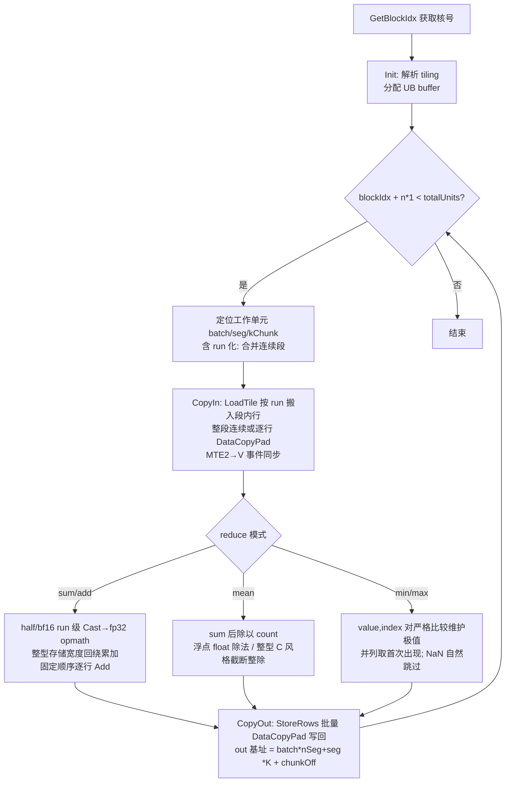

# CANN训练营北京邮电大学-segment_csr算子开发(950)即8月社区任务 - segment_csr 算子设计文档


## 一、需求背景

### 1.1 需求来源

通过 8 月昇腾社区任务完成开源仓算子贡献的需求：参考 PyTorch Geometric 的
`torch_scatter.segment_csr`（版本 ≥ 2.1.0，验收以 torch_scatter 2.1.2 CPU 版为标杆）
及其子算子 `segment_sum_csr` / `segment_add_csr` / `segment_mean_csr` /
`segment_min_csr` / `segment_max_csr`，在昇腾 NPU 上基于 Ascend C（Kernel）+
Python（PyTorch 适配层）实现功能与接口完全对齐的 Segment CSR 系列算子，
验收通过后提交至昇腾算子开源仓 ops-gnn。

### 1.2 背景介绍

Segment CSR 是一种基于 CSR 压缩行指针（indptr）的分组归约操作：第 i 段对应
`src[indptr[i] : indptr[i+1])` 的元素，归约结果写入 `out[i]`。它是 GNN
CSR 邻接聚合、推荐系统稀疏特征池化等场景的性能关键路径。与 segment_coo /
scatter 相比，CSR 指针保证段连续、结果完全确定、无 dim_size 参数，
torch_scatter 官方实现中其性能最优。

当前 torch_scatter 的 NPU 适配缺失，GNN 模型在昇腾上运行时该算子回退到
低效的通用路径，本任务以 Ascend C 原生 Kernel 实现高性能、确定性的归约。

算子功能矩阵（与 torch_scatter 逐字对齐，不支持 mul、无 dim_size）：

| 子算子 / reduce | 语义 | 输出 |
| --- | --- | --- |
| `segment_sum_csr` / `sum`、`segment_add_csr` / `add` | 段内求和 | out |
| `segment_mean_csr` / `mean` | 段内均值 | out |
| `segment_min_csr` / `min`、`segment_max_csr` / `max` | 段内极值 | out + arg_out（INT64 索引） |

#### 1.2.1 segment_csr 算子实现优化

**标杆算子源码获取路径**（torch_scatter 2.1.2，含文件名）：

| 文件 | 作用 |
| --- | --- |
| `torch_scatter/segment_csr.py` | Python 接口层：`segment_csr` 通用入口与参数校验 |
| `torch_scatter/composite/segment_sum_csr.py` / `segment_add_csr.py` / `segment_mean_csr.py` / `segment_min_csr.py` / `segment_max_csr.py` | 子算子包装层：调用通用入口并封装返回值（min/max 返回 (out, arg_out) 元组） |
| `csrc/cpu/segment_csr_cpu.cpp` | CPU 内核（本任务精度与性能标杆计时所用实现） |
| `csrc/cuda/segment_csr_cuda.cu` | CUDA 参考实现（仅作设计参考，性能不对标 GPU） |

**算子信息库路径**：标杆为第三方 PyTorch 扩展算子（非昇腾 TBE 算子），CANN
算子信息库中无对应条目；参考算子的判定依据为任务书接口定义与
torch_scatter 2.1.2 官方文档（https://pytorch-scatter.readthedocs.io/en/latest/functions/segment_csr.html），
二者逐字一致，结合 PyTorch 层接口签名可确认参考对象正确。

#### 1.2.2 segment_csr 算子现状分析

##### 1.2.2.1 标杆算子支持的数据类型和数据格式

标杆 CPU 内核经 PyTorch AT_DISPATCH 分发支持常见整型/浮点数据类型；任务书
验收矩阵限定以下类型与格式（数据格式均为 ND，indptr 固定 INT64）：

| 级别 | src/out dtype | 累加/比较域 | 验收范围 |
| --- | --- | --- | --- |
| L1 NPU 原生（必选） | FLOAT16、FLOAT32 | float32（opmath） | 功能 + 性能 |
| L2 NPU 整数（必选） | INT32、INT64 | int32 / int64（存储宽度回绕） | 功能 + 性能 |
| L2 NPU 功能（必选） | BFLOAT16、INT8、UINT8 | float32 / int32 提升 | 仅功能 |

min/max 的 arg_out 固定 INT64。8 位 dtype 经 int32 提升内核处理
（dav-3510 的 1↔4 字节 Cast 存在死写缺陷，见 3.2.2.1）。

##### 1.2.2.2 标杆算子实现描述

torch_scatter 2.1.2 的 `segment_csr` 实现逻辑（与 `csrc/cpu/segment_csr_cpu.cpp`
源码一致）：

1. Python 层（`torch_scatter/segment_csr.py`）做 reduce 字符串合法性校验
   （sum/add/mean/min/max，非法值抛 `ValueError`）、形状关系断言后，调用
   C++ 扩展 `torch.ops.torch_scatter.segment_csr(src, indptr, out, reduce)`；
   子算子层（`composite/segment_*_csr.py`）对 min/max 附加 arg_out 计算并
   返回 `(out, arg_out)` 元组，其余返回 `out`；
2. CPU 内核以段为粒度处理：第 i 段对 `src[indptr[i] : indptr[i+1])` 顺序
   遍历归约——sum/add 累加、mean 累加后除以段长、min/max 以 `(value, index)`
   对维护极值并记录首个极值的全局行号（严格比较，并列取首次出现）；
3. 空段（段长 0）输出写 0；arg_out 累加器零初始化，空段保持哨兵值
   `src.size(dim)`；
4. 段间可并行（CPU parallel_for）、段内严格顺序归约，同一输出的归约顺序
   固定，结果确定（bit 级可复现）；
5. 未提供 out 时按 `out.size(dim) = indptr.size(dim) - 1` 推断输出形状；
   无 dim_size 参数。

##### 1.2.2.3 标杆算子实现流程图

```mermaid
flowchart TD
    A[输入 src / indptr / out / reduce] --> B{reduce 合法?<br/>非法抛 ValueError}
    B -->|是| C[输出形状推断<br/>out.size dim = indptr.size dim - 1]
    C --> D[按 indptr 划分段 i: src[indptr i : indptr i+1]]
    D --> E{段长是否为 0?}
    E -->|是| F[out i = 0<br/>arg_out i = 哨兵 src.size dim]
    E -->|否| G[段内顺序遍历归约]
    G --> G1[sum/add: 顺序累加]
    G --> G2[mean: 顺序累加后除以段长]
    G --> G3[min/max: value/index 对严格比较<br/>并列取首次出现, 记录全局行号]
    G1 & G2 & G3 --> H[写回 out i / arg_out i]
    F --> H
    H --> I{还有未处理段?}
    I -->|是| D
    I -->|否| J[返回 out<br/>min/max 另返回 arg_out]
```

## 二、需求分析

### 2.1 外部部件依赖

根据实际开发任务选择已适配的外部依赖：

| 外部依赖 | 版本 | 用途 | 适配状态 |
| --- | --- | --- | --- |
| CANN | 9.1.0 及以上 | Ascend C Kernel 编译与运行 | 已适配（实测 9.1.0） |
| PyTorch | 2.7+ | Python 适配层宿主框架 | 已适配（实测 2.12.0） |
| torch_npu | 与 PyTorch/CANN 配套 | NPU 设备管理、stream | 已适配（实测 2.12.0） |
| torch_scatter | 2.1.2 | 精度/性能标杆（仅测试比对用，运行时不依赖） | 已适配（测试依赖） |
| Python | ≥ 3.7 | 适配层语言 | 已适配 |

### 2.2 内部适配模块

根据 ops-gnn 开源仓工程选择已适配的内部模块：

| 内部模块 | 路径 | 适配状态 |
| --- | --- | --- |
| Kernel 源码构建体系（csrc glob 递归收录 arch35 目录） | `csrc/npu/segment_csr/op_host/`、`csrc/npu/segment_csr/op_kernel/arch35/` | 已适配 |
| Python 包与 pybind 绑定 | `python/ops_gnn/segment_csr.py`、`csrc/pybind.cpp` | 已适配 |
| 设计文档目录 | `docs/experiment/design/segment_csr/` | 已适配 |
| 测试目录（golden / 功能用例 / 性能基准） | `test/segment_csr/` | 已适配 |

### 2.3 需求模块设计

#### 2.3.1 Ascend C 算子原型

除《算子任务书》中不要求适配的部分（mul 归约、dim_size 参数）外，其余与
标杆算子完全对齐：

| 参数名 | 输入/输出 | 描述 | 数据类型 | 数据格式 | 非连续 |
| --- | --- | --- | --- | --- | --- |
| src | 输入 | 源张量 | FLOAT16、FLOAT32、BFLOAT16、INT8、INT32、INT64、UINT8 | ND | 支持 |
| indptr | 输入 | CSR 行指针，长度 = 段数+1 | INT64 | ND | 支持 |
| out | 输入/输出 | 输出；`out.size(dim) = indptr.size(dim) - 1` | 同 src | ND | 支持 |
| reduce | 属性 | sum/add/mean/min/max | STRING | - | - |
| arg_out | 输出 | min/max 索引 | INT64 | ND | 支持 |

归约维 `dim = indptr.dim() - 1`；indptr 前 `indptr.dim()-1` 维可广播至
src；indptr 沿最后一维非降序、取值 `[0, src.size(dim)]`。

#### 2.3.2 Ascend C 算子相关约束

与标杆算子相比缺失的功能：**无**。任务书要求的 5 种归约
（sum/add/mean/min/max）全部实现；`mul` 不属于标杆 segment_csr 的功能范围
（torch_scatter 中仅 scatter 提供 mul），故不涉及。补充说明：

1. BFLOAT16 / INT8 / UINT8 按任务书仅做功能验收（标杆为性能验收范围外）；
2. 标杆自身存在缺陷：torch_scatter 2.1.2 CPU 内核在 uint8 大规模 2D
   min/max 的 arg_out 上返回错误索引（值输出与 int8/int32 路径正常），
   自测时该单项 arg 按纯 PyTorch 语义参考对照（详见 5.2）。

## 三、需求详细设计

### 3.1 调用方式

根据实际开发任务，本算子适配 **PyTorch 框架**调用方式（任务书验收口径：
PyTorch 层接口的功能、精度、性能为唯一验收基准）：

- 6 个公开接口与 torch_scatter 逐字对齐：`segment_sum_csr` /
  `segment_add_csr` / `segment_mean_csr` / `segment_min_csr` /
  `segment_max_csr` / `segment_csr`，位于 `python/ops_gnn/segment_csr.py`；
- 后端分发阶梯：torch.ops（已注册自定义算子时优先）→ `_pybind` 扩展
  → 纯 PyTorch fallback（仅功能调试，非性能验收路径）；
- aclnn / Kernel 直调为可选交付项，本任务未交付（不作为验收必要条件）。

### 3.2 需求总体设计

#### 3.2.1 host 侧设计

##### 3.2.1.1 分核策略

以"一个输出段 × 一个特征块"为独立工作单元 `unit = (batch, seg, kChunk)`，
tiling 数据结构见 `op_kernel/arch35/segment_csr_tiling.h`：

- 特征维 K 按 `coreChunk`（上限 2048，32B 对齐）切块，
  `kChunks = ceil(K / coreChunk)`；
- `totalUnits = E_1 × nSegments × kChunks`（E_1 为归约维之前各维乘积），
  以 `GetBlockIdx()` 步进 `aivNum` 轮转分配到各 AIV 向量核，
  `aivNum = min(平台 AIV 核数, totalUnits)`；
- 每个输出元素只由一个工作单元写一次，无跨核写竞争、无全局原子。

##### 3.2.1.2 数据分块和内存优化策略

**特征维切块：** `kChunks = ceil(K / coreChunk)`，`coreChunk = 2048`
（32B 对齐）。UB 内行宽按对齐布局 `alignedChunk = align32(coreChunk × esize) / esize`。

**UB 行分批（rowTile）推导公式：**

```
rowTile = min( CAP_64,
               floor( (UB_SIZE - margin16KB - Σ chunk级缓冲) / bytesPerRow ) )
bytesPerRow = alignedChunk × (esize_src + esize_acc) + esize_cast镜像 + arg列开销
```

其中 chunk 级缓冲含 cnt / wrap / rowIdx / mask / bounds；`UB_SIZE` 来自运行时
`ACL_PLATFORM_AICORE_UB_SIZE` 查询（首次查询后静态缓存）。上限
`CAP_64 = 64`（实测 128 会使 run-wide Cast 触发 V 管停顿回归 0.104→0.131ms，
64 为中性值）。短段/尾块/未对齐 GM 地址用 `DataCopyPad`。

**run 化多段合并：** 连续多段合并为 run，一次 load/store 覆盖 run 内全部段，
run 级单次 Duplicate 初始化累加器、run 级 widening/narrowing Cast，摊薄逐段
屏障对与标量 indptr 读开销；indptr 边界采用软件流水线标量预取（nextEnd
提前读取，与当前 run 打包工作重叠）。

**tiling 缓存：** 以 (src/indptr 形状 + esize + reduceMode + hasArg) 为键的
thread_local tiling 形状缓存，消除重复 host 计算（950 实测小形状收益显著）。

##### 3.2.1.3 tilingKey 规划策略

归约模式（sum/mean/min/max）与 dtype 通过 Kernel 模板实例化区分（7 dtype ×
4 模式在 `segment_csr_kernel.cpp` 显式实例化），host 侧按 `src.scalar_type()`
直接分发到对应 launch，无需运行时 tilingKey 分支。

##### 3.2.1.4 输入校验

进入 Kernel 前在 host 侧全部完成，无效输入直接报错：

1. indptr dtype 为 INT64，与 src 同设备；
2. `1 ≤ indptr.dim() ≤ src.dim()`，最后一维长度 ≥ 1；
3. 前导维可广播到 src（逐维为 1 或相等；host 支持逐 batch 行与单行广播
   两种物理布局，其余广播在 Python 适配层展开后下发）；
4. 指针值位于 `[0, src.size(dim)]` 且沿最后一维非降序（设备侧仅做形状
   校验以避免强制同步，CPU 侧做完整值校验）；
5. out（若提供）dtype/device 与 src 一致、归约维替换为 nSegments。

##### 3.2.1.5 stream 管理

Kernel 在调用方当前 NPU stream（`c10_npu::getCurrentNPUStream`）上 launch，
继承上游 H2D 拷贝与前序算子的依赖，避免私有 stream 读到未初始化数据；
launch 后不做逐调用 `aclrtSynchronizeStream`（stream 序已保证结果可见性）。

#### 3.2.2 kernel 侧设计

##### 3.2.2.1 kernel 侧实现描述

Init 阶段完成 tiling 解析与 UB buffer 分配（srcBuf / accBuf / castBuf /
valBuf / idxValBuf / cntBuf / wrapBuf / boundsBuf 等，大小由 rowTile 与
alignedChunk 决定）；Process 阶段每个工作单元执行 CopyIn → Compute →
CopyOut：

1. **CopyIn**：`LoadTile` 按 run 批量 DataCopy/DataCopyPad 搬入段内行；
   kChunks==1 且 K 32B 对齐时整段连续 GM 一次 DataCopy，否则逐行
   DataCopyPad；MTE2→V、MTE3→V 事件配对同步。
2. **Compute**：
   - sum/add：half/bf16 先 run 级 Cast 宽化到 float32（opmath 对齐），
     float32 原类型，整型以存储宽度回绕累加（int8/uint8/int32 用 int32
     承载，模 2^N 下截断回写与标杆位级等价）；固定顺序逐行 Add；
   - mean：sum 后除以段长 count；浮点 float 除法（count 取 max(count,1)，
     单行段跳过除法）；整型 C 风格截断整除（Div 指令），8 位路径先经
     CAST_TRUNC 低 8 位截断复现存储回绕再除；
   - min/max：以 `(value, index)` 对同步维护，严格 `<`/`>` 比较保证并列
     取首次出现；float32 初值 ±FLT_MAX（对齐标杆 numeric_limits::max()，
     ±inf 因此永不被选中），half/bf16 初值 ±inf（float32 初值回写溢出即
     ±inf）；NaN 经严格比较自然跳过，全 NaN 段输出 dtype 上限、arg=0；
   - dav-3510 规避：1↔4 字节 Cast 死写缺陷 → 8 位路径走
     int8→int16→int32 梯度 Cast；多行 Cast 在该芯片仅处理首行 → 8 位
     逐行 Cast 后立即累加。
3. **CopyOut**：`StoreRows` 将 run 结果（及 min/max 的 arg 列）批量
   DataCopyPad 写回 GM；out 基址按 `(batch * nSegments + seg) * K +
   chunkOff` 定位；空段累加器保持 0、arg 保持哨兵随写回自然落盘。

**确定性保证：**

- 输出与工作单元一一对应，输入遍历顺序由 tiling 完全固定，同输入同配置
  下归约顺序一致，浮点结果位级可复现；
- 无 atomic add/min/max 汇聚，无跨核数据竞争；
- arg_out 初值 0（对齐标杆零初始化 args 累加器），空段回填
  `src.size(dim)` 哨兵。

##### 3.2.2.2 Ascend C 实现流程图



##### 3.2.2.3 Ascend C 实现流程图与标杆算子流程图存在的差异点和原因

| 差异点 | 标杆（torch_scatter CPU） | 本实现（Ascend C） | 原因 |
| --- | --- | --- | --- |
| 并行结构 | 段间 CPU parallel_for、段内串行 | (输出段 × 特征块) 二维工作单元跨 AIV 并行，段内亦分批向量化 | NPU 向量核架构要求充分分核；每输出元素单核独写保确定性 |
| 段处理粒度 | 逐段独立处理 | 连续段合并为 run 批处理 | 摊薄逐段屏障与标量 indptr 读开销，小段场景显著提速 |
| 半精度累加域 | half 按半精度路径 | half/bf16 以 float32 opmath 累加后回写 | 硬件向量指令按 fp32 累计精度更优，实测误差在容差内 |
| 8 位 dtype | 直接按字节类型累加 | int32 提升路径 + CAST_TRUNC 截断 | dav-3510 的 1↔4 字节 Cast 死写缺陷，需 int8→int16→int32 梯度规避 |
| min/max 初值 | numeric_limits::max() | fp32 用 ±FLT_MAX 对齐标杆；half/bf16 用 ±inf | fp32 初值回写 half/bf16 溢出即 ±inf，语义与标杆一致（±inf 永不被选中） |
| indptr 校验 | 假定输入合法 | host 侧前置完整校验（dtype/形状/广播/范围） | 设备侧容错成本高，提前拦截无效输入 |
| arg_out 并列/空段语义 | 零初始化 + 空段哨兵 | 对齐：arg 初值 0、空段回填 src.size(dim) 哨兵 | 与标杆实测行为逐字对齐 |

### 3.3 支持硬件

| 支持的芯片版本 | 涉及勾选 |
| --- | --- |
| Ascend 950PR（dav-3510，arch35） | √ |

与《算子任务书》要求（适配硬件：Ascend 950 系列）保持一致。

软件环境：CANN 9.1.0、PyTorch 2.12.0、torch_npu 2.12.0（实测环境）；
任务要求 PyTorch 2.7+ 与配套 torch_npu。

### 3.4 算子约束限制

1. 不支持 `mul` 归约；接口无 `dim_size` 参数，不增删任何参数；
2. indptr 必须 INT64、非降序、取值 `[0, src.size(dim)]`；
3. 归约必须完全确定，Kernel 不引入任何非确定原子争用；
4. min/max 经通用 `segment_csr(..., reduce="min"/"max")` 调用仅返回 out，
   专用 `segment_min_csr`/`segment_max_csr` 返回 `(out, arg_out)`；
5. 8 位 dtype（int8/uint8）经 int32 提升路径实现，仅功能验收。

## 四、特性交叉分析

本算子为新增独立算子，特性交叉情况如下：

1. **算子命名交叉**：ops-gnn 仓内既有实验性 `segment_max_csr.py` 模块
   （int32 indptr、返回单 Tensor）。本算子按任务书要求以 torch_scatter
   语义（int64 indptr、返回 (out, arg_out) 元组）为准在包 `__init__.py`
   导出，旧模块文件保留但不再导出，避免符号冲突；
2. **构建体系交叉**：Kernel 源码位于 `csrc/npu/segment_csr/op_kernel/arch35/`
   新增目录，仓构建 glob 递归收录，不影响其他算子的编译产物；
3. **依赖交叉**：运行时仅依赖 PyTorch / torch_npu / CANN，不引入新第三方
   运行时依赖；torch_scatter 仅测试阶段作为标杆使用；
4. **特性开关**：无编译宏、无特性开关交叉。

## 五、可维可测分析

### 5.1 精度标准/性能标准

根据任务书要求填写：

| 验收标准 | 描述 | 标准来源 |
| --- | --- | --- |
| 精度标准 | fp16/fp32 与标杆逐元素比对（rtol/atol：fp32 1e-5、fp16 1e-2、bf16 5e-2，NaN 按 equal_nan）；int32/int64 与标杆 bit-wise 一致（含溢出回绕、mean 截断除法）；min/max 的 out+arg_out 与标杆一致（NaN 跳过、全 NaN 段 dtype 上限、arg=0、空段哨兵）；同输入重复调用位级一致 | 生态算子开源精度标准（单标杆，torch_scatter 2.1.2 CPU） |
| 性能标准 | 全部用例实测耗时 ≤ 标杆耗时 / 0.45（即 ≥ 0.45 倍标杆性能） | 任务书性能要求与标杆耗时表（4 reduce × 29 形状 × 4 dtype） |

测试资产：`test/segment_csr/test_segment_csr.py`（159 用例，覆盖 TC-01~
TC-17 及 NaN/并列/溢出/确定性/非连续/广播/原地）、`bringup_check.py`
（9 项硬件 bring-up 探针）、`benchmark_segment_csr.py`（任务书 shape 矩阵）、
`selftest_report.py`（精度+性能自测报告一键生成）、`gen_all_screenshots.py`
（精度/性能截图一键生成）。

### 5.2 兼容性分析

新增算子，不涉及存量算子兼容性：

1. 包级 `segment_max_csr` 命名与 ops-gnn 仓内既有实验性同名模块冲突：
   既有模块为 int32 indptr、返回单 Tensor 的实验实现，本算子按任务书要求
   以 torch_scatter 语义（int64 indptr、返回 (out, arg_out) 元组）为准在
   包 `__init__.py` 导出，旧模块文件保留但不再导出；
2. 标杆侧已知缺陷：torch_scatter 2.1.2 CPU 内核在 uint8 大规模 2D min/max
   的 arg_out 上返回错误索引（值输出与 int8/int32 路径正常），自测时该
   单项 arg 按纯 PyTorch 语义参考对照并在自测报告中注明；
3. 接口与 torch_scatter 2.1.2 逐字对齐，存量用户代码可直接替换 import
   来源，无破坏性变更。

### 5.3 950 实测核验结果

在 Ascend 950PR（CANN 9.1.0 / torch 2.12.0 / torch_npu 2.12.0）实测：

1. **指令可用性**：int64 向量 Add/Div/Compare、整型 Div（int32/int64 mean
   截断整除）均可用，截断语义与 CPU golden 一致（探针 B1/B2）；
2. **CAST_TRUNC 与 NaN**：int32→int8 CAST_TRUNC 低 8 位回绕与 golden 位级
   一致；硬件 Compare 的 NaN 跳过语义与标杆一致（探针 B3~B6）；
   dav-3510 的 1↔4 字节 Cast 死写缺陷已由 int8→int16→int32 梯度规避；
3. **tiling 实测调优**：coreChunk=2048；rowTile 运行时 UB 查询推导 +
   cap=64；tiling 形状缓存与 UB 单次查询降低 host 固定开销；
4. **端到端结果**：功能 159 用例全过、bring-up 9/9 探针通过、精度 36 项
   全部通过、性能 4 reduce × 29 形状 × 4 dtype 共 464 项全部 ≥ 0.45x
   标杆（最薄项 2.02x ≤ 2.22x 预算）、重复调用位级确定
   （详见 `test/segment_csr/selftest_report.md`）。

### 5.4 验收交付件

| 序号 | 交付件 | 路径 |
| --- | --- | --- |
| 1 | 算子设计文档 | `docs/experiment/design/segment_csr/`（本文档） |
| 2 | 自测用例及测试代码 | `test/segment_csr/`（含 README：用例清单 + 复现步骤） |
| 3 | 自测报告 | `test/segment_csr/selftest_report.md` + `test/segment_csr/pics/` |
| 4 | 待验收代码地址 | 个人仓 + 分支 + 算子目录 `csrc/npu/segment_csr/` |
