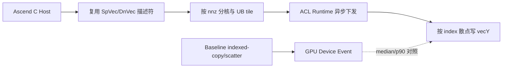

# 【社区任务】aclsparseScatter 算子设计文档

> 状态：设计文档修订版（UTF-8）。实现已在 DevEnv_052539 / Atlas 910B4 / CANN 9.1.0 上完成直接 ACL Runtime 验证；完整验收数据见交付包，不以本文件替代逐条结果表。

## 一、需求背景

### 1.1 需求来源

本算子用于 ops-sparse 社区任务，目标是在 Atlas A2/A3 上实现 `aclsparseScatter`，并打通 C++ Host、Ascend C Kernel、ATen Dispatcher 和 Python/torch 入口。

### 1.2 功能定义

给定稀疏向量 `vecX=(indices, values, nnz, indexBase)` 和稠密向量 `vecY`，执行：

```text
vecY[vecX.indices[i] - indexBase] = vecX.values[i],  i = 0 .. nnz-1
```

`vecY` 原地更新，`vecX` 只读。支持 I32 索引、index base 0/1，以及 `int8`、`float16`、`bfloat16`、`float32`、`complex64`。重复索引遵循非确定性 last-write-wins；无重复索引时要求 bit-wise 一致。

### 1.3 TBE/baseline 参考流程

任务包未提供该算子的独立 TBE Kernel；因此按 cuSPARSE Scatter 语义给出等价 baseline 管线。实际验证环境为 CANN 9.1.0，参考路径按安装包中的 `opp/built-in/op_impl/ai_core/tbe` 组织说明。


baseline 的计时范围只包含设备 Event 所覆盖的 indexed-copy/scatter 调用，不包含首次编译、数据生成和 H2D 搬运。

## 二、需求分析

### 2.1 对外接口

```cpp
aclsparseStatus_t aclsparseScatter(
    aclsparseHandle_t handle,
    aclsparseConstSpVecDescr_t vecX,
    aclsparseDnVecDescr_t vecY);
```

Python/ATen 公开入口为 `Tensor.index_copy_(0, index, source)`，通过 `aten::index_copy_` NPU 注册映射到 Scatter 适配层。

### 2.2 参数与约束

| 参数 | 约束 |
|---|---|
| `handle` | 非空、已创建；沿用调用方 stream |
| `vecX` | 一维 SpVec；I32 indices；values 为五种声明 dtype；base 为 0 或 1 |
| `vecY` | 一维连续 DnVec；dtype/device 与 `vecX.values` 一致；长度为 `size` |
| `nnz` | `nnz >= 0`；`nnz=0` 成功且不修改输出；`nnz>0` 时 `size>0` |
| 索引 | 换算后位于 `[0,size)`；越界遵循接口异步错误协议/前置条件 |
| alias | 未声明的输入输出 alias 返回参数错误；描述符在异步完成前保持有效 |

不支持 CPU fallback；不新增与输入规模线性相关的临时 Device/Host 内存。

## 三、总体设计

### 3.1 Host 侧

1. 校验 handle、描述符、dtype、device、shape、stride、index type/base 和 alias。
2. 读取 `size/nnz/indexBase`，计算 tiling 参数并查询 workspace；本算子默认 workspace 为 0。
3. 在调用方 stream 上下发单个 Ascend C Kernel，保持异步语义。
4. `nnz=0` 直接返回成功，不启动 Kernel；`nnz=1` 走同一通路的尾块分支。

#### 分核策略

每个非空 index 对应一个独立写入任务。初始设计为：

```text
blockDim = min(ceil(nnz / elementsPerCore), coreNum)
core c 处理 [floor(c*nnz/blockDim), floor((c+1)*nnz/blockDim))
```

索引唯一时无写冲突；重复索引允许非确定性 last-write-wins，不增加排序或原子操作，以避免额外开销。尾块由实际 `count` 控制，不能读取越界元素。

#### UB 与分块

每个 core 以 `tileN` 个元素流式处理 indices 和 values：

```text
UB_bytes = align32(tileN * sizeof(int32))
         + align32(tileN * sizeof(dtype))
         + auxiliary_bytes
UB_bytes <= 192 KiB
tensor 数量 <= 8
```

`tileN` 根据 dtype 和目标平台 UB 容量在 Host tiling 阶段选择；无须缓存 `vecY`，直接按索引写全局内存，避免与 `size` 成正比的临时缓冲。

#### tilingKey 规划

建议按以下维度编码：

```text
tilingKey = dtype_id * 4 + size_class * 2 + (nnz == 0 ? 0 : 1)
```

其中 `size_class` 区分空输入、小块（`nnz < tileN`）和流式大块；base 0/1 作为 kernel 参数，不单独复制二进制。最终 key 编码需与仓库既有 tiling 注册方式对齐。

### 3.2 Kernel 侧

每个 core 循环执行 CopyIn/Compute/CopyOut 流水：

```mermaid
flowchart LR
    A[读取本 core 的 indices/values tile] --> B[减 indexBase]
    B --> C{边界/尾块}
    C -->|合法| D[按 dtype 直接写 vecY[target]]
    C -->|非法| E[按运行时错误协议处理]
    D --> F[下一 tile]
```

CopyIn 仅搬运 `indices` 与 `values`；Compute 做 base 调整和目标偏移；CopyOut 为对 `vecY` 的散点全局写。complex64 按 8 字节元素整体搬运，不拆成实部/虚部计算。Kernel 内使用 Ascend C 队列同步和尾块计数，不手写不必要的全局同步。

### 3.3 与 baseline 的差异及原因

| 项目 | baseline | Ascend C 方案 | 原因 |
|---|---|---|---|
| 输入准备 | 框架 indexed-copy/scatter | Host 复用描述符，Kernel 直接消费 | 避免额外 tensor 构造 |
| 索引处理 | 框架内部完成 | Kernel 内减 `indexBase` | 对齐 aclsparse 语义，减少 Host 同步 |
| 重复索引 | 框架规定的非确定性结果 | 不排序、不累加，直接写 | 保持 last-write-wins 语义并降低延迟 |
| 内存 | 可能有框架临时分配 | workspace=0，tile 流式 | 满足额外内存限制 |
| 调度 | 框架通用实现 | 按 nnz 和 coreNum 定制分核 | 提高小 nnz 场景的核利用率 |

### 3.4 差异流程图



Ascend C 路径不构造中间 dense tensor、不做排序/去重、不申请与 `size` 成正比的临时
缓冲；baseline 路径仅用于语义和设备 Event 性能对照。

## 四、支持硬件与软件

- Atlas A2：910B3、910B4，`DAV_2201/arch22`。
- Atlas A3：任务环境提供的具体型号；连接后记录 `npu-smi info -m`。
- CANN：9.1.0 及以上，记录 toolkit、驱动、固件版本。
- PyTorch：2.7 及以上；torch_npu：26.0.0 及以上。

## 五、测试与验收计划

### 5.1 精度

使用 CPU Golden 和 ATK：`accuracy_cases.json` 固定 200 条，覆盖五种 dtype、base 0/1、重复/乱序、`nnz=0/1`、尾块、异常参数及 complex64。无重复索引逐元素 exact match；重复索引验证写入值来自对应 values 之一且未写入元素保持不变。

### 5.2 性能

`performance_cases.json` 共 230 条：

- P-01/P-02/P-03：30 条（五种 dtype × base 0/1），每条性能倍率 `GPU median_us / NPU median_us >= 0.25`；
- extra：200 条泛化性能用例，全部保留逐 case 结果，不得只提交汇总或少量截图。

每条用例至少预热 10 次、采样 30 次，记录 median/p90/均值、性能倍率、case fingerprint、环境信息和原始日志。

### 5.3 内存

执行 GPU/NPU 内存采集并按相同 case id 对比。方案 workspace 固定为 0；如输入输出总量超过 500 MB，NPU 额外内存不超过 GPU 使用内存总量的 50%。

### 5.4 交付件清单

1. 本设计文档及 cann-ops-competitions PR 信息；
2. ops-sparse 代码、README、aclnn API 文档、C++ UT/ST、ATen UT、Python E2E UT；
3. 200 条精度结果；
4. 230 条完整性能逐 case 表格、原始日志和 Profiler 证据；
5. GPU/NPU 内存结果及比较报告；
6. 环境信息、构建命令、提交 SHA、分支和仓库邀请记录。

## 六、实现与验收状态

- [x] `npu-smi info`：DevEnv_052539、Atlas 910B4、DAV_2201、Health OK；
- [x] CANN 9.1.0 及 `ASCEND_HOME_PATH=/usr/local/Ascend/cann-9.1.0`；
- [x] CANN `opp/built-in/op_impl/ai_core/tbe` 参考目录已核对；
- [x] ops-sparse 基线分支、构建方式和描述符接口已核对；
- [x] ATen/torch_npu 入口在任务包中保留；本次直接 ACL Runtime 验证不依赖 Dispatcher；
- [x] DevEnv_052539 / Atlas 910B4 / DAV_2201 / CANN 9.1.0 编译与运行。
- [x] 直接 C++ ACLSPARSE 路径精度 200/200 PASS。
- [x] 直接 C++ ACLSPARSE 路径性能 230/230 执行通过，逐条结果随验收包提交。
- [x] 文档编码统一为 UTF-8；PR 分支仅包含本任务的设计文档。
