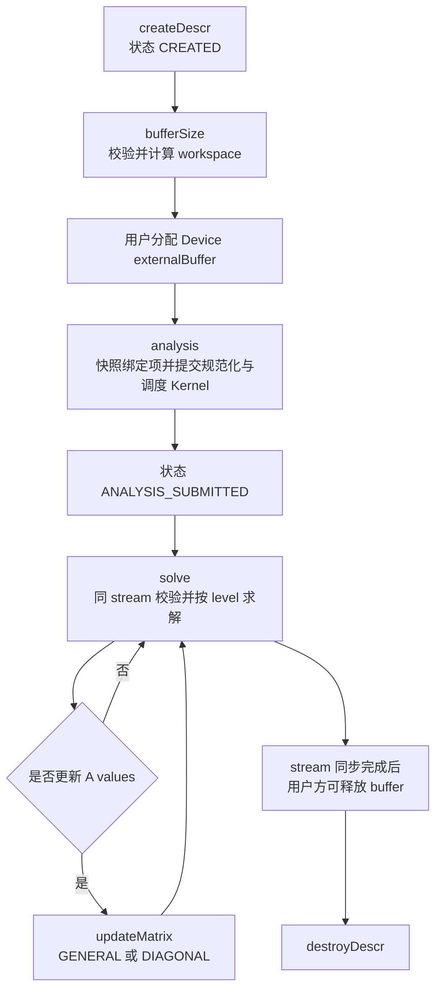
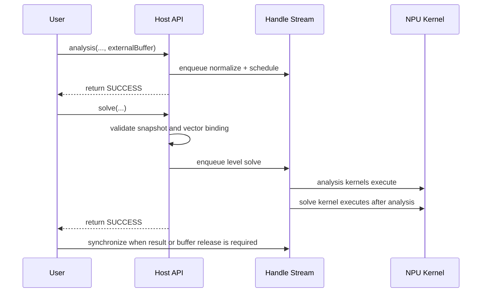

# aclsparseSpSV（Ascend 950）算子设计

# 需求背景（required）

## 需求来源

本设计对应“9 月社区任务-aclsparseSpSV 算子开发（950）”。任务要求在 `ops-sparse` 现有 arch35 实现基础上完善稀疏三角向量求解能力，公开接口保持不变，所有核心计算沿 handle stream 在 NPU 上异步执行。

本设计仅描述实现方案，不包含实测结论。实现和验收阶段使用任务包给出的精度、性能、内存及生命周期用例进行验证。

## 背景介绍

### aclsparseSpSV 算子功能

SpSV（Sparse Triangular Solve - Vector）求解稀疏三角线性方程：

$$
\operatorname{op}(A)Y=\alpha X
$$

其中，$A\in\mathbb{F}^{m\times m}$ 为稀疏三角方阵，$X,Y\in\mathbb{F}^{m}$，$\mathbb{F}$ 为 FP32 或 complex64。`op(A)` 支持原矩阵、转置和共轭转置；矩阵属性支持上三角/下三角、单位对角/非单位对角。

接口采用 `createDescr → bufferSize → analysis → solve → updateMatrix → destroyDescr` 生命周期。`analysis` 构建与稀疏结构有关的规范化矩阵和依赖调度，后续一次或多次 `solve` 复用该状态；`updateMatrix` 只更新数值，不改变稀疏结构。

### 当前实现与待完善能力

`ops-sparse` 当前已具备 arch35 Host/Kernel、四种稀疏格式、Level Scheduling、Host/Device pointer mode、原地求解和矩阵数值更新的基础路径。任务范围内仍需完成以下设计闭环：

| 项目 | 当前基础 | 本任务设计目标 |
| --- | --- | --- |
| 数值类型 | FP32 主路径 | FP32 与 complex64 全生命周期一致支持 |
| `H` 语义 | FP32 下等价于转置 | complex64 执行转置并共轭 |
| 非规则输入 | 支持多格式转换和未排序访问 | 统一为确定性、可更新的规范 CSR |
| 生命周期 | 已缓存部分矩阵属性和 workspace | 完整绑定 handle/stream、描述符、参数、pointer mode、dtype 和 buffer |
| Kernel 切分 | SIMT Level Scheduling | 固定编译期线程规模，宽 level 多核、长行线程组协作 |
| 确定性 | 同一调度路径固定 | 规范化顺序、重复坐标处理和归约顺序均固定 |
| 验证 | 已有 FP32 C++ 测试基础 | 增补 complex64、四格式、生命周期、更新、异常、性能及内存覆盖 |

# 需求分析（required）

## 需求描述

在 Ascend 950 的 arch35 路径中实现完整的 `aclsparseSpSV_*` 接口语义，支持：

1. `ACL_FLOAT`、`ACL_COMPLEX64`，Device 索引为 I32，索引基址为 0 或 1。
2. CSR、CSC、COO、SLICED_ELL 四种稀疏格式。
3. LOWER/UPPER、UNIT/NON_UNIT、N/T/H、`ACL_SPARSE_SPSV_ALG_DEFAULT`。
4. Host/Device pointer mode、X/Y 原地、动态 `m/nnz`、未排序和重复坐标。
5. `BufferSize`、`Analysis`、`Solve`、`UpdateMatrix`、`Destroy` 的状态和异步资源生命周期。
6. `GENERAL` 全量更新和 `DIAGONAL` 对角更新后复用分析结果。
7. NPU Kernel 主计算，不以 CPU 求解、排序或格式转换替代 NPU 实现。

## 需求拆解

| 编号 | 子需求 | 设计承接 |
| --- | --- | --- |
| R1 | 公开 ABI 不变 | 沿用五个公开函数原型，只扩展内部描述符和 Kernel 模板 |
| R2 | FP32/complex64 | `ValueT` 模板化，complex64 使用双 FP32 存储和稳定复数除法 |
| R3 | 四格式与 N/T/H | Analysis 统一生成 `op(A)` 的规范 CSR；H 路径生成共轭值 |
| R4 | 未排序与确定性 | 以 `(row, col, sourcePosition)` 为固定键排序，重复项按源位置顺序聚合 |
| R5 | 生命周期一致性 | Analysis 快照所有绑定项，Solve/Update 逐项核验 |
| R6 | 异步与原地 | 所有 Device 工作进入 handle stream；依靠同 stream 顺序保持阶段可见性 |
| R7 | 更新复用 | 保存 source mapping 和 diag position，不重建结构与 level schedule |
| R8 | 性能与内存 | level 并行、长行线程组归约、格式转换前移、scratch 分时复用 |
| R9 | 可验证性 | 给出精度、性能、内存、异常和生命周期测试矩阵 |

# 详细设计（required）

## 算子分析

### 数学公式

记 $B=\operatorname{op}(A)$、$r_i=\alpha x_i$。对有效下三角系统按行号递增求解：

$$
y_i=\begin{cases}
r_i-\sum_{j<i}b_{ij}y_j, & \text{UNIT}\\
\dfrac{r_i-\sum_{j<i}b_{ij}y_j}{b_{ii}}, & \text{NON\_UNIT}
\end{cases}
$$

上三角系统按行号递减求解，求和范围改为 $j>i$。填充模式以外的元素不参与计算。`UNIT` 路径将逻辑对角视为 1，不读取存储的对角值；`NON_UNIT` 缺失或零对角通过 IEEE-754 运算传播 INF/NAN。

操作语义如下：

| `opA` | $B$ | 有效 fill mode |
| --- | --- | --- |
| `NON_TRANSPOSE` | $A$ | 与 A 相同 |
| `TRANSPOSE` | $A^T$ | LOWER/UPPER 翻转 |
| `CONJUGATE_TRANSPOSE` | $A^H=\overline{A^T}$ | LOWER/UPPER 翻转 |

complex64 使用两个 FP32 分量。乘法按固定次序计算实部和虚部；除法采用按分母实部/虚部绝对值选择比例的稳定算法，避免直接计算 $c^2+d^2$ 带来的不必要溢出。H 路径只对数值取共轭，索引转置与 T 路径相同。

### 公开接口原型

公开原型逐字保持如下，不新增带后缀接口：

```c
aclsparseStatus_t aclsparseSpSV_createDescr(aclsparseSpSVDescr_t *spsvDescr);
aclsparseStatus_t aclsparseSpSV_destroyDescr(aclsparseSpSVDescr_t spsvDescr);
aclsparseStatus_t aclsparseSpSV_bufferSize(aclsparseHandle_t handle, aclsparseOperation_t opA, const void *alpha, aclsparseConstSpMatDescr_t matA, aclsparseConstDnVecDescr_t vecX, aclsparseDnVecDescr_t vecY, aclDataType computeType, aclsparseSpSVAlg_t alg, aclsparseSpSVDescr_t spsvDescr, size_t *bufferSize);
aclsparseStatus_t aclsparseSpSV_analysis(aclsparseHandle_t handle, aclsparseOperation_t opA, const void *alpha, aclsparseConstSpMatDescr_t matA, aclsparseConstDnVecDescr_t vecX, aclsparseDnVecDescr_t vecY, aclDataType computeType, aclsparseSpSVAlg_t alg, aclsparseSpSVDescr_t spsvDescr, void *externalBuffer);
aclsparseStatus_t aclsparseSpSV_solve(aclsparseHandle_t handle, aclsparseOperation_t opA, const void *alpha, aclsparseConstSpMatDescr_t matA, aclsparseConstDnVecDescr_t vecX, aclsparseDnVecDescr_t vecY, aclDataType computeType, aclsparseSpSVAlg_t alg, aclsparseSpSVDescr_t spsvDescr);
aclsparseStatus_t aclsparseSpSV_updateMatrix(aclsparseHandle_t handle, aclsparseSpSVDescr_t spsvDescr, void *newValues, aclsparseSpSVUpdate_t updatePart);
```

### 参数与属性

| 参数 | 方向 | 设计约束 |
| --- | --- | --- |
| `handle` | 输入 | 有效 aclsparse handle；Analysis、Solve、Update 使用同一 handle 和 stream |
| `opA` | 属性 | N/T/H；Analysis 后不可直接变更 |
| `alpha` | 输入 | 类型与 `computeType` 一致；位置由 pointer mode 决定；Device 指针需在异步 Solve 完成前有效 |
| `matA` | 输入 | `m×m` 稀疏三角矩阵；values 为 Device 指针；格式、shape、索引、属性与 Analysis 快照一致 |
| `vecX` | 输入 | 长度 `m`，连续 Device values；BufferSize/Analysis 可为 NULL，Solve 必须有效 |
| `vecY` | 输出 | 长度 `m`，连续 Device values；允许与 X 完全同址，拒绝非完全重叠 |
| `computeType` | 属性 | `ACL_FLOAT` 或 `ACL_COMPLEX64`，与 A/X/Y/alpha 一致 |
| `alg` | 属性 | 仅 `ACL_SPARSE_SPSV_ALG_DEFAULT` |
| `spsvDescr` | 输入输出 | 保存状态、快照、workspace 布局和更新映射 |
| `bufferSize` | 输出 | Host `size_t`；所有加法、乘法和对齐计算检查溢出 |
| `externalBuffer` | workspace | Device 内存；大小不少于查询值，并保持到最后一个异步 Solve/Update 完成 |
| `newValues` | 输入 | Device 连续内存；GENERAL 为原格式 `nnz` 个值，DIAGONAL 为按逻辑行号排列的 `m` 个值 |
| `updatePart` | 属性 | `GENERAL` 或 `DIAGONAL` |

### 支持数据类型与形状

| A values | X/Y | `computeType` | Device index | 支持 |
| --- | --- | --- | --- | --- |
| `ACL_FLOAT` | `ACL_FLOAT` | `ACL_FLOAT` | I32 | 是 |
| `ACL_COMPLEX64` | `ACL_COMPLEX64` | `ACL_COMPLEX64` | I32 | 是 |
| 其他组合 | 任意 | 任意 | 任意 | 返回不支持或参数错误 |

- `A.shape=[m,m]`，`X.shape=Y.shape=[m]`，`m` 和 `nnz` 动态。
- `m=0` 时 BufferSize 返回 0，Analysis/Solve 不启动常规 Kernel 并成功返回。
- `nnz=0` 且 UNIT 时执行 `Y=alpha·X`；NON_UNIT 时按缺失对角语义传播 INF/NAN。
- base 1 在规范化时统一减 1；越界索引、负索引、非法 SLICED_ELL 元数据返回明确错误码。
- 重复坐标在规范化后按 `sourcePosition` 递增顺序聚合；该顺序同时作为 CPU Golden 的唯一重复项语义。

## 算子实现

### 总体方案

公开接口由 Host 层负责参数校验、状态机、workspace 规划和异步 Kernel 提交。Analysis 在 NPU 上把所有输入格式转换为 `op(A)` 的规范 CSR，并建立 level schedule；Solve 只读取规范 CSR 和 schedule；Update 通过 Analysis 保存的映射更新规范 values。



计划修改位置如下，设计文档不引入新的顶层算子目录：

| 层次 | 路径 | 设计职责 |
| --- | --- | --- |
| 公开接口 | `include/cann_ops_sparse.h` | 保持原型和枚举 ABI，补充 complex64/生命周期说明 |
| 公共状态 | `sparse/common/aclsparse_spsv_descr.h` | 扩展快照、dtype、workspace 和规范化映射状态 |
| Host | `sparse/spsv/arch35/spsv_host.cpp` | 校验、BufferSize、状态机、Kernel 提交和更新路由 |
| Kernel 参数 | `sparse/spsv/arch35/spsv_tiling_data.h` | 数值类型、固定模板路由和 workspace 偏移 |
| Kernel | `sparse/spsv/arch35/spsv_kernel.cpp` | 规范化、调度、FP32/complex64 Solve 和 Update |
| C++ 验证 | `test/spsv/arch35/` | UT/ST、异常、生命周期和原地覆盖 |
| 专项验证 | `test_cases/aclsparseSpSV_testCase/` | CPU Golden、精度、性能、内存和 Profiler 入口 |

### Host 侧设计

#### 描述符状态与快照

内部描述符增加以下信息：

| 类别 | 保存内容 |
| --- | --- |
| 阶段状态 | `CREATED`、`ANALYSIS_SUBMITTED`、`DESTROYED`；`ANALYSIS_SUBMITTED` 已允许同 stream 的 Solve/Update，不代表设备已同步完成 |
| 执行绑定 | handle 标识、stream、pointer mode；alpha 不是结构状态，不缓存其数值或地址 |
| 矩阵绑定 | matA 描述符地址、rows/cols/nnz、format、base、fill、diag、索引类型、value dtype、结构指针和 values 指针 |
| 向量绑定 | vecX/vecY 描述符地址、size、dtype、values 指针；Analysis 为 NULL 时记录“延迟绑定” |
| 算法参数 | `opA`、`computeType`、`alg` |
| workspace | externalBuffer 地址、查询大小、每个子区偏移和对齐 |
| 规范化状态 | `canonicalNnz`、source mapping、duplicate segment、diag position、level 数和调度偏移 |

BufferSize 与 Analysis 允许 vecX/vecY 描述符为 NULL。若 Analysis 收到非 NULL 描述符，则 Solve 必须传入同一描述符且其 size、dtype、values 不变；若为 NULL，则在第一次 Solve 完成延迟绑定，后续 Solve 继续要求一致。X/Y values 完全相等是合法原地路径，其他区间重叠返回参数错误。

Analysis 到 Solve 之间逐项核验 matA 描述符及其结构指针、format、base、fill、diag、shape、dtype、`opA`、`computeType`、`alg`、pointer mode、handle/stream 和 externalBuffer 绑定。矩阵 values 只能通过 `updateMatrix` 合法替换。alpha 在 Analysis 只校验非空及 pointer mode，不参与结构分析；Solve 可使用新的同类型标量地址和值。

#### BufferSize 与 workspace

设 `n=nnz`，`v=4`（FP32）或 `8`（complex64），`A(x)` 表示按内部 64 字节边界向上对齐，externalBuffer 首地址满足接口对齐要求。workspace 由以下逻辑区域组成：

| 区域 | 上界 | 生命周期 | 说明 |
| --- | --- | --- | --- |
| Device header | `A(sizeof(DevicePlan))` | Analysis 至最后一次 Solve | level 数、canonicalNnz 和错误标志 |
| CSR row offsets | `A(4·(m+1))` | 持久 | I32、base 0 |
| CSR columns | `A(4·n)` | 持久 | 规范顺序，实际只使用 canonicalNnz |
| CSR values | `A(v·n)` | 持久 | H 路径保存共轭后的值 |
| source mapping | `A(4·n)` | 持久 | 规范位置到原始 values 位置 |
| duplicate segments | `A(4·(n+1))` | 持久 | GENERAL 更新时按固定顺序重新聚合 |
| diag position | `A(4·m)` | 持久 | 缺失为 -1 |
| row level / levelPtr / levelRow | `A(4·m)+A(4·(m+1))+A(4·m)` | 持久 | Level Scheduling |
| normalization scratch | 与格式和 n 有关 | 仅 Analysis | 计数、游标、稳定排序临时区 |
| update scratch | 不超过 `A(v·n)` | 仅 Update | 与 normalization scratch 分时复用 |

设 radix 为 8 bit、桶数 `R=256`、参与规范化的 block 数为 `B`。双缓冲 64 bit key、双缓冲 sourcePosition 和 block histogram/prefix 的保守上界为：

$$
W_{norm}=2A(8n)+2A(4n)+2A(4BR)
$$

持久区大小记为 `Wpersist`，更新临时区记为 `Wupdate≤A(v·n)`，则总大小为：

$$
W_{total}=W_{persist}+\max(W_{norm},W_{update})
$$

所有中间量使用无符号宽类型做溢出检查。规范 CSR 直接表示 `op(A)`，不同时保留 A 和转置 A 两套副本；Analysis 结束后临时区与 Update scratch 复用，以控制 workspace 峰值。实现阶段从目标平台信息读取 L2 容量，验收要求计算出的 workspace 不超过目标硬件 L2 Cache；文档不硬编码未经平台核验的 L2 数值。

#### Analysis 提交流程

```mermaid
flowchart LR
    A[CSR / CSC / COO / SLICED_ELL] --> B[格式解析<br/>base 统一为 0]
    B --> C[生成 effectiveRow, effectiveCol,<br/>sourcePosition]
    C --> D[按 row, col, sourcePosition<br/>稳定规范化]
    D --> E[重复坐标按 sourcePosition<br/>固定顺序聚合]
    E --> F[构建 opA 对应的规范 CSR<br/>H 同时共轭 values]
    F --> G[定位对角并过滤非目标三角项]
    G --> H[计算 row level]
    H --> I[构建 levelPtr 与 levelRow]
    I --> J[写 DevicePlan<br/>可供 Solve/Update 复用]
```



1. Host 完成句柄、枚举、shape、dtype、索引类型、buffer 地址和可静态检查的元数据校验。
2. NPU Kernel 将四种格式映射为有效坐标。CSR/CSC 的行列由 offsets 隐式展开；COO 读取显式坐标；SLICED_ELL 跳过 padding。
3. N/T/H 在规范化阶段直接映射到 effective row/column。H 对 values 取共轭，后续 Solve 无需再分支。
4. FormatDecode 按原始 values 下标生成 sourcePosition。StableNormalize 采用稳定 LSD radix：先对 I32 column 做固定宽度 radix pass，再对 I32 row 做固定宽度 radix pass；每个 pass 使用按 block 编号排列的 histogram、全局前缀和 block 内局部前缀确定唯一写入位置，不以原子到达顺序决定位置。初始 sourcePosition 次序因此在相同 row/column 内保持不变。
5. 重复坐标由单一 segment owner 按 sourcePosition 递增累加，避免跨线程 atomic add。source mapping 保存该 segment 的原始位置区间，供 GENERAL Update 重放相同顺序。
6. 下三角使用 `level[i]=0`（无依赖）或 `1+max(level[j]), j<i`；上三角按行号逆序处理 `j>i`。依赖递推由单个执行块按固定行方向推进，长行的 `max` 使用固定线程组归约；对角定位、histogram 和 levelRow scatter 再并行执行。level 内按行号递增保存，使不同运行次数得到相同 schedule。
7. 所有 Kernel 提交到 handle stream。Analysis 返回后用户可立即提交 Solve；同 stream 顺序保证 Solve 看到完整 DevicePlan，不引入 Host D2H 同步。

#### Solve 提交流程

Host 首先完成快照一致性检查，再校验 vecX/vecY 的长度、dtype 和 Device values。Host pointer mode 将 alpha 的两个分量复制进 Kernel 参数；Device pointer mode 将 alpha 的 Device 地址传入 Kernel，由每个执行块在计算前读取一次。



#### UpdateMatrix 提交流程

- `GENERAL`：`newValues` 按原始格式的 values 顺序包含 `nnz` 个元素。Kernel 通过 source mapping 生成规范 values；重复坐标仍按保存的 sourcePosition 顺序聚合；H 路径在写入规范 values 时共轭。
- `DIAGONAL`：`newValues[i]` 表示逻辑矩阵 A 的第 i 个对角值。Kernel 通过 diag position 更新已存在的对角；缺失对角不改变 sparsity pattern。H 路径写入共轭值，UNIT 路径仍不读取对角。
- 两种更新均不重建 row offsets、columns 或 level schedule。更新与后续 Solve 进入同一 stream，依靠 stream 顺序保证可见性。
- `updatePart` 非法、未 Analysis、handle/stream 不一致、newValues 为空或 Device 地址非法时返回明确错误码。

### Kernel 侧设计

#### Kernel 划分

| Kernel | 主要工作 | 并行单位 | 线程规模 |
| --- | --- | --- | --- |
| FormatDecode | 四格式展开、base 转换、N/T/H 坐标映射 | 原始非零元 | 编译期固定 2048 |
| StableNormalize | 稳定分桶/排序、重复段标记 | key 或分段 | 编译期固定 1024 |
| BuildCanonicalCsr | 写 row offsets、columns、values、source mapping | 规范非零元 | 编译期固定 2048 |
| BuildLevels | 对角定位、依赖 level、level histogram | row/依赖边 | 编译期固定 1024 |
| SpSVSolve | 按 level 前代或回代 | level 内的 row | 编译期固定 1024 |
| UpdateGeneral | 根据 source mapping 重建 values | 规范非零元 | 编译期固定 2048 |
| UpdateDiagonal | 根据 diag position 更新 | row | 编译期固定 1024 |
| ScaleCopy/Exceptional | `nnz=0`、UNIT 和异常对角辅助路径 | vector element | 编译期固定 2048 |

SIMT VF 的 launch bound 与调用维度使用同一编译期常量，不从 tiling 参数动态改变线程数。小规模问题通过减少 block 数处理，避免以运行时线程数制造新的 Kernel 组合。

#### 求解并行策略

1. level 之间存在依赖，严格串行推进；同一 level 的行彼此独立，可并行求解。
2. 短行采用“一线程一行”。线程按 `globalTid + k·globalStride` 遍历 levelRow，减少调度开销。
3. 长行采用固定 32 线程组。一组线程以固定步长读取该行，组内按固定二叉树顺序归约部分和；complex64 的实部和虚部使用相同树形顺序。
4. 每个 level 完成后执行 arch35 已有跨核同步原语，确保前一 level 的 Y 对下一 level 可见。block 数由平台可用 Vector Core 数和工作量共同决定，不写死具体核数。
5. 对每一行先把 `alpha·X[i]` 读入寄存器，再写 `Y[i]`。因此 X/Y 完全同址时不会读取被其他行覆盖的右端项，原地求解与非原地求解使用同一路径。
6. NON_UNIT 的最终除法在该行归约完成后由组内固定线程执行；UNIT 路径跳过对角读取和除法。

#### complex64 实现

内部使用布局与 `ACL_COMPLEX64` 一致的两个 FP32 分量，不改变公开 ABI：

- N/T 路径直接读取规范 values；H 路径在 Analysis/Update 时写入 `(real, -imag)`。
- 复乘的四个乘法和两个加减按固定表达式执行，禁止不同线程路径使用不同结合顺序。
- 长行实部、虚部各自执行固定树形归约，保证重复运行 bitwise deterministic。
- 复除使用比例缩放算法；分母为零或包含 INF/NAN 时保留 IEEE-754 传播，不在 Host 侧替换结果。

#### 本地内存预算

本算子为 SIMT 直接访存路径，矩阵、向量和调度信息均位于 GM；本地内存仅用于长行线程组的归约 scratch。按 1024 个计算线程、complex64 每线程一个 8 字节部分和估算：

| 项目 | 预算 |
| --- | ---: |
| 芯片本地内存基数 | 256 KB |
| 平台保留 | 8 KB |
| DCache 最低预留 | 32 KB |
| 可用于 TBuf/scratch 的上限 | 216 KB |
| complex64 归约 scratch 上界 | `1024×8 = 8192 B` |
| 预算余量 | 208 KB |

scratch 不保存跨 level 状态，不启用面向 SIMD 流水的输入/输出双缓冲。主要优化目标是 DCache 命中、GM 合并访问和 level 并行度，而不是占满 UB。

### Tiling 与分核策略

Host 根据 `m`、`nnz`、格式、dtype 和平台 Vector Core 数生成 launch 配置：

1. FormatDecode/Update 的工作量按非零元切分，`blockNum=min(availableVectorCores, ceil(workItems/minItemsPerCore))`，每核最小工作量按 1024 元素并向 32 对齐。
2. BuildLevels 的对角定位和依赖计数按行切分；严格前后序的 level 递推由单个执行块按固定方向完成，level histogram 和 row scatter 再按行并行执行。
3. Solve 的 block 数按 `m` 与 `nnz` 的上界估计；同一 level 宽度小于总线程数时多余线程退出，不改变计算次序。
4. 行长小于 32 走短行路径，行长达到阈值走线程组路径；阈值写入 DevicePlan，由 Analysis 依据规范 CSR 统计，不改变线程块大小。
5. dtype、diag 和是否长行由模板或编译期分支承接；format、base、N/T/H 已在 Analysis 消解，Solve 不再为四格式重复分支。

### 确定性设计

确定性由以下约束共同保证：

- 稳定 key 为 `(effectiveRow, effectiveCol, sourcePosition)`。
- 重复坐标只按 sourcePosition 递增聚合。
- level 内 row 顺序固定为行号递增。
- 单行累加使用固定遍历或固定 32 线程树形归约，不使用非确定原子加。
- Update 后沿用相同 mapping 和聚合顺序。
- 相同输入、相同 dtype、相同算子属性和相同平台配置下，重复 Solve 输出逐比特一致。

### 异常处理

| 场景 | 行为 |
| --- | --- |
| 空 handle | 返回 handle 空错误 |
| 空 matA/spsvDescr/alpha | 返回参数错误 |
| BufferSize/Analysis 的 vecX/vecY 为空 | 允许 |
| Solve 的 vecX/vecY 或 values 为空 | 返回参数错误 |
| 非方阵、向量长度不等于 m | 返回参数错误 |
| dtype、index、format、alg 不支持 | 返回不支持 |
| 索引越界、offset 非单调、SELL 元数据非法 | Device error flag 记录并终止后续计算，由 stream 同步点报告异步执行错误 |
| Solve 早于 Analysis | 返回阶段错误 |
| Analysis 后绑定项变化 | 返回参数错误，要求重新 Analysis |
| externalBuffer 为空或未对齐 | 返回参数错误；公开签名不含容量参数，实际分配容量由调用方保证不少于 BufferSize 返回值 |
| workspace 计算溢出 | 返回参数错误或分配失败 |
| NON_UNIT 缺失/零对角 | 按 IEEE-754 传播 INF/NAN |

Device 输入内容校验不能通过异步接口立即同步回 Host。实现采用 DevicePlan error flag 阻止无效索引参与越界访问，并把数据错误转换为 stream 异步执行错误；测试在同步点核验该错误。Host 可判断的元数据错误始终在提交 Kernel 前返回，不为获得 Device 内容校验结果插入 D2H 同步。

### 支持硬件

| 支持的芯片版本 | 设计结论 |
| --- | --- |
| Ascend 950（arch35 / DAV_3510） | 支持，使用 AIV SIMT 路径 |
| Atlas A2/A3 | 本任务不新增 SpSV 能力；共享 Host/公共头文件必须回归 |

软件环境为任务书指定的 CANN 9.1.0 及后续配套版本，实际编译、驱动和 SOC 信息在自测报告中记录。

### 算子约束限制

- A 必须是二维方阵；只计算 fill mode 指定的三角部分。
- A/X/Y/alpha/computeType 的数值类型必须一致。
- 本任务 Device 索引组合为 I32/I32，base 支持 0/1。
- `alg` 仅支持 `ACL_SPARSE_SPSV_ALG_DEFAULT`。
- Analysis 后不得直接变更矩阵结构、描述符属性、handle stream 或 workspace；结构变化必须重新 Analysis。
- GENERAL/DIAGONAL 只更新 values，不改变 row/column pattern。
- X/Y 仅支持完全不重叠或完全同址，部分重叠不支持。
- externalBuffer 必须保持有效且内容不被外部修改，直至最后一个异步 Solve/Update 在 stream 上完成。

# 可维可测分析

## 精度标准/性能标准

| 验收标准 | 设计目标 | 标准来源 |
| --- | --- | --- |
| FP32 精度 | CPU float64 Golden；`rtol=2^-10`、`atol=2^-16`，匹配率不低于 0.99，单元素绝对误差不超过 `max(1e-2, 32×ULP(golden))` | 任务书 |
| complex64 精度 | CPU complex128 Golden；实部、虚部分别应用 FP32 全部规则 | 任务书 |
| 确定性 | 相同输入重复执行，输出 bitwise deterministic | 任务书 |
| 性能 | 所有声明 dtype 达到 GPU 标杆的 0.3 倍以上 | 任务书 |
| 内存 | 依任务书 500 MB 分界规则验收；本方案 workspace 同时接受不超过目标 L2 Cache 的约束 | 任务书 |

性能场景和 GPU Event 基线沿用任务包，不在设计阶段填入任何 NPU 实测值：

| 场景 | `m / nnz` | dtype | GPU median 基线（μs） | NPU 目标 |
| --- | ---: | --- | ---: | --- |
| P-01 | 65,536 / 524,288 | FP32、complex64 | 40,413.695–40,458.531 | 性能倍率不低于 0.3 |
| P-02 | 131,072 / 1,572,864 | FP32、complex64 | 93,850.750–94,739.203 | 性能倍率不低于 0.3 |
| P-03 | 262,144 / 3,932,160 | FP32、complex64 | 220,676.516–222,887.562 | 性能倍率不低于 0.3 |

### 测试设计

本阶段不执行实验，后续实现按下表形成 C++ UT/ST、CPU Golden 和 Profiler 证据：

| 类别 | 覆盖项 | 关键判定 |
| --- | --- | --- |
| 基本功能 | 四格式、两 dtype、LOWER/UPPER、UNIT/NON_UNIT、N/T/H、base 0/1 | 与 CPU Golden 比较 |
| Pointer mode | Host alpha、Device alpha | 结果一致，Device alpha 生命周期正确 |
| 生命周期 | NULL vec 的 BufferSize/Analysis、重复 Solve、Destroy、过早释放、跨 stream/handle | 返回码和异步顺序符合设计 |
| 更新 | GENERAL、DIAGONAL；四格式与 N/T/H | 更新后无需重做 Analysis，结果正确 |
| 原地 | `X.values==Y.values`；非原地；部分重叠 | 前两者正确，部分重叠拒绝 |
| 非规则结构 | 空行、长尾、单长行、未排序、重复坐标、三角外元素 | 规范化结果确定，重复运行逐比特一致 |
| 边界 | m/nnz 为 0/1、缺失/零对角、INF/NAN、最大任务规模 | 无越界，特殊值按规则传播 |
| 参数异常 | 空指针、非法枚举、dtype/shape/index 不匹配、buffer 为空/未对齐、buffer 过早释放 | Host 错误立即返回，Device 内容错误在同步点报告 |
| 性能 | P-01、P-02、P-03；预热 10 次、采样 30 次 | 报告 median、P90、Analysis、Solve、workspace |
| 内存 | 与性能 case 相同 | 报告 input、peak、extra peak 和 workspace |

性能测试只统计与标杆相同的调用范围；Update 不混入 Solve Event 区间。Profiler 应能看到 format/analysis/solve/update 对应 NPU Kernel，且主求解不存在 CPU fallback。

### 性能优化方案

1. **一次分析，多次求解**：格式转换、转置、共轭、排序和 schedule 全部前移到 Analysis。
2. **统一规范 CSR**：Solve 不再按四格式分支，减少 Kernel 分支和随机元数据访问。
3. **level 内多核**：宽 level 按全局线程号均分；窄 level 多余线程快速退出。
4. **长行线程组**：固定 32 线程协作隐藏离散访存延迟，同时保持固定归约顺序。
5. **数值模板化**：FP32/complex64 共享索引与调度逻辑，避免重复 schedule。
6. **更新复用**：source mapping 和 diag position 使 Update 只搬运/聚合 values。
7. **内存复用**：Analysis scratch 与 Update scratch 分时复用，不保留 A 与 op(A) 双份 CSR。
8. **Profiler 驱动调整**：实现后根据 level 宽度、长行比例、DCache 命中和 barrier 时间调整每核最小工作量，不改变数学次序。

## 兼容性分析

- 公开函数名、参数顺序、枚举和 ABI 保持不变。
- FP32 现有合法调用继续沿用相同生命周期；新增校验只拒绝原本未定义或与 Analysis 快照不一致的调用。
- 新增 complex64 不改变 FP32 数据布局和数值路径。
- 四格式统一到内部规范 CSR，不改变用户描述符和输入存储。
- Host 共享代码和公共头文件修改需执行 A2/A3 及其他稀疏算子联合回归；本任务不声明 A2/A3 新增 SpSV 支持。

## 风险与对策

| 风险 | 影响 | 对策 |
| --- | --- | --- |
| 深依赖矩阵 level 很窄 | 多核利用率低 | 保留单块路径，减少空转；Profiler 区分 barrier 与计算耗时 |
| 单行 nnz 很大 | 一线程一行成为瓶颈 | 32 线程组固定树形归约 |
| complex64 寄存器压力上升 | 占用率下降 | 分离短行/长行模板，避免持有多份复数临时量 |
| 未排序和重复项增加 Analysis 成本 | 首次调用变慢 | 稳定规范化只执行一次，后续 Solve/Update 复用 |
| workspace 接近 L2 上限 | 内存验收失败 | 直接构建 op(A)、复用 scratch、按平台 L2 容量设置验收门禁 |
| 异步错误上报困难 | 数据非法时错误码延迟 | Device error flag 阻止越界，测试在同步点核验状态 |
| 描述符延迟绑定理解不一致 | 生命周期误用 | 明确 NULL Analysis 的首次 Solve 绑定规则，并提供专项 UT |
