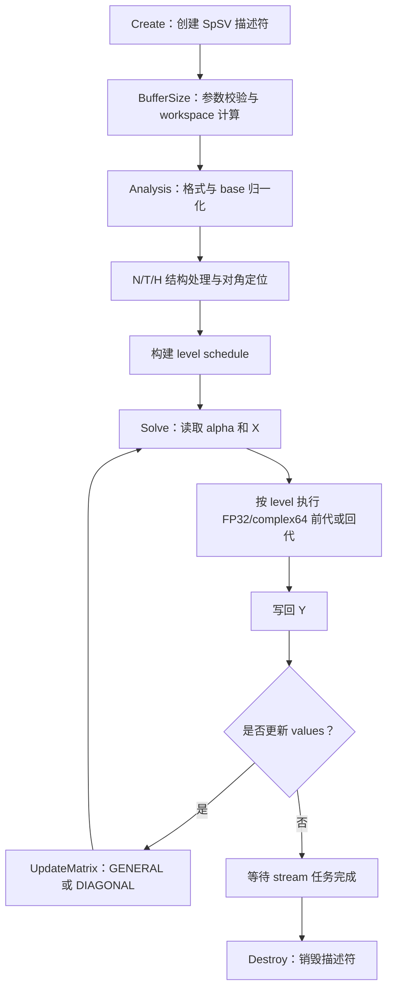

# aclsparseSpSV 算子设计文档（Ascend 950）

| 项目 | 内容 |
| --- | --- |
| 任务名称 | 9月社区任务-aclsparseSpSV算子开发(950) |
| 目标硬件 | Ascend 950（A5，DAV-3510，`arch35`） |
| 软件版本 | CANN 9.1.0 及后续配套版本 |
| 实现仓库 | `ops-sparse` |
| 参与者 | `mengyijia_2026` |

# 需求背景（required）

## 需求来源

本设计对应《9月社区任务-aclsparseSpSV算子开发(950)》。任务要求在
`ops-sparse` 现有 SpSV 实现上补齐 Ascend 950 能力，重点支持 complex64、
完善多阶段调用生命周期，并满足精度、确定性、性能和内存验收要求。

主要参考代码位于：

| 内容 | 路径 |
| --- | --- |
| 公开接口 | `include/cann_ops_sparse.h` |
| Host 实现 | `sparse/spsv/arch35/spsv_host.cpp` |
| Kernel 实现 | `sparse/spsv/arch35/spsv_kernel.cpp` |
| Tiling 数据 | `sparse/spsv/arch35/spsv_tiling_data.h` |
| 测试 | `test/spsv/` |

## 背景介绍

### 算子功能

SpSV（Sparse Triangular Solve - Vector）用于求解稀疏三角线性方程：

$$
op(A)Y=\alpha X,
$$

其中 $A$ 是上三角或下三角稀疏方阵，$X$ 和 $Y$ 是长度为 $m$ 的向量。
`op(A)` 支持原矩阵 N、转置 T 和共轭转置 H。`diagType=UNIT` 时对角元按 1
处理，`NON_UNIT` 时使用矩阵中的显式对角值。

接口按以下阶段使用：

```text
createDescr -> bufferSize -> analysis -> solve（可重复）
                                      -> updateMatrix -> solve
                                      -> destroyDescr
```

`bufferSize` 查询 workspace，`analysis` 分析行依赖，`solve` 完成求解，
`updateMatrix` 在稀疏结构不变时更新数值。

### 现有实现与本次增量

| 能力 | 现有实现 | 本次设计 |
| --- | --- | --- |
| 值类型 | FP32 | 新增 complex64 |
| 格式 | CSR、CSC、COO、SLICED_ELL | 保持四格式并支持复数 |
| 操作 | N/T/H，FP32 下 H 等价于 T | complex64 H 执行真实共轭 |
| 索引 | 已有 I32/I64 路径 | 本任务新增与验收范围为 I32 |
| 求解 | Level Scheduling | 复用并补齐确定性和原地求解 |
| 更新 | GENERAL/DIAGONAL FP32 | 增加 complex64 更新路径 |

# 需求分析（required）

## 需求描述

在 Ascend 950 上使用 Legacy API 和 Ascend C Kernel 实现 SpSV。支持 FP32、
complex64、I32 索引、base 0/1、四种稀疏格式、LOWER/UPPER、UNIT/NON_UNIT
以及 N/T/H。主求解和格式处理必须在 NPU 上执行，不使用 CPU fallback。

`bufferSize` 和 `analysis` 允许 X/Y 描述符为 NULL；`solve` 时 X/Y 必须有效。
所有 Device 任务沿 handle stream 异步提交，且支持 X/Y 指向同一块 Device
values 的原地求解。

## 需求拆解

| 编号 | 子项 | 要求 |
| --- | --- | --- |
| R1 | 公开接口 | 保持 create/bufferSize/analysis/solve/update/destroy 接口不变 |
| R2 | dtype | FP32、complex64，A/X/Y/alpha/computeType 一致 |
| R3 | 格式与属性 | CSR/CSC/COO/SLICED_ELL，base 0/1，N/T/H，LOWER/UPPER，UNIT/NON_UNIT |
| R4 | 生命周期 | Analysis 绑定结构、属性和 workspace，Solve/Update 不得越过 Analysis |
| R5 | 数值更新 | GENERAL 更新全部 values，DIAGONAL 更新逻辑对角 |
| R6 | 运行语义 | Host/Device alpha、异步 stream、X/Y 原地 |
| R7 | 确定性 | 未排序和重复坐标采用固定的规范化与累加顺序 |
| R8 | 验收 | 完成 C++ UT/ST、CPU Golden、Profiler、性能和内存验证 |

## 输入输出规格

| 对象 | 位置 | 类型/规格 | 说明 |
| --- | --- | --- | --- |
| A | Device | FP32/complex64，`[m,m]` | 四种稀疏格式，I32 索引 |
| X | Device | FP32/complex64，`[m]` | 只读，Solve 时必须有效 |
| Y | Device | FP32/complex64，`[m]` | 输出，允许与 X.values 完全相同 |
| alpha | Host/Device | 1 个 FP32/complex64 标量 | 位置由 pointer mode 决定 |
| externalBuffer | Device | 至少 `bufferSize` 字节 | Analysis 到异步任务完成前保持有效 |
| newValues | Device | GENERAL 为 `nnz` 个，DIAGONAL 为 `m` 个 | 类型与 A.values 一致 |

# 详细设计（required）

## 算子分析

### 数学公式

令 $B=op(A)$。对下三角矩阵，第 $i$ 行前代计算为：

$$
y_i=\frac{\alpha x_i-\sum_{j<i}b_{ij}y_j}{d_i},
\qquad
d_i=\begin{cases}1,&\text{UNIT}\\b_{ii},&\text{NON\_UNIT}\end{cases}.
$$

上三角回代时将求和范围改为 $j>i$，并按行号逆序处理。complex64
在 H 路径中使用 $A^H=\overline{A}^{T}$；T 只转置不共轭。NON_UNIT 缺失或零
对角时按 IEEE-754 传播 INF/NAN。

### 依赖分层

每一行依赖前面已求解的三角项。Analysis 为每行计算 level：

$$
level(i)=\begin{cases}
0,&deps(i)=\varnothing,\\
1+\max_{j\in deps(i)}level(j),&\text{otherwise}.
\end{cases}
$$

同一 level 的行之间没有依赖，可以并行；level 之间顺序执行。该方案复用
现有 Level Scheduling 实现，适合稀疏三角求解的不规则依赖。

### 支持范围

| 项目 | 支持范围 |
| --- | --- |
| dtype | FP32、complex64 |
| 索引 | I32，base 0/1 |
| 格式 | CSR、CSC、COO、SLICED_ELL |
| 属性 | LOWER/UPPER，UNIT/NON_UNIT，N/T/H |
| 算法 | `ACL_SPARSE_SPSV_ALG_DEFAULT` |
| shape | A 为 `[m,m]`，X/Y 为 `[m]`，`m`/`nnz` 动态 |

## 算子实现

### 总体方案



### Host 侧设计

Host 侧负责参数校验、状态管理、workspace 计算和 Kernel 分派。

1. 校验 handle、描述符、shape、dtype、format、base、op、fill、diag 和 alg。
2. `bufferSize`/`analysis` 对 NULL X/Y 放行，`solve` 要求 X/Y 及 values 有效。
3. Analysis 保存 A 的结构/属性、dtype、pointer mode、stream、externalBuffer 和非空 X/Y 的
   描述符信息。X/Y 为 NULL 时延迟到首次 Solve 绑定；绑定后发现指针或结构性参数
   变化，或 Solve 时 pointer mode 不一致，则要求重新 Analysis。alpha 的值不影响
   分析，可在每次 Solve 时指定。
4. Host pointer mode 将 alpha 值写入启动参数；Device pointer mode 将 alpha 地址传入 Kernel。
5. 根据 dtype 选择 FP32 或 complex64 Kernel，根据 `m/nnz` 估算的层宽选择单核或多核路径。

### Workspace 与 Tiling

Workspace 复用现有布局，只为归一化和转置视图分配必要空间：

```text
header
| normalized CSR + perm（可选）
| diagPtr + diagonal override（按需）
| levelPtr + levelRow + validCount
| transposed CSR + transPerm（可选）
```

- 首地址按 512 B 对齐，子区域按 64 B 对齐。
- values 区域按 `sizeof(ValueT)` 计算，complex64 占 8 B。
- `bufferSize` 与 `analysis` 共用同一个布局计算函数，避免大小与偏移不一致。
- Tiling 保存规模、数值类型、前代/回代、是否共轭、workspace 偏移和并行参数。

### Kernel 侧设计

1. **格式归一化**：CSR 直接处理；CSC 按等价 CSR 视图解释；COO 和
   SLICED_ELL 在 workspace 中转为 CSR；base 1 统一转为 base 0。T/H 构建转置
   结构，H 在读值时额外共轭。
2. **依赖分析**：生成 `diagPtr`、`levelPtr`、`levelRow` 和 `validCount`。小规模
   使用单核，大规模将可并行部分分核处理。Kernel 同时检查 Device 索引，
   发现非法结构时写入 workspace 状态，后续 Kernel 读取状态并提前退出，避免
   非法地址访问。Host 主路径不为读取 Device 状态引入隐式同步。
3. **求解**：数值运算模板化为 FP32/complex64。同一 level 的行并行，level
   之间同步。原地求解先读取本行 X，再写入本行 Y，不申请整向量副本。
4. **数值更新**：GENERAL 在直读路径切换 `currentValues` 引用，有格式映射时按
   `perm` 刷新全部值；DIAGONAL 按 `diagPtr` 更新已存在的对角值。直接 CSR
   路径在 workspace 中保存对角覆盖值，不改写用户 A。
5. **边界处理**：`m=0` 直接成功；`nnz=0,m>0` 时，UNIT 计算 `Y=alpha*X`，
   NON_UNIT 按缺失对角语义传播 INF/NAN。

### 确定性设计

COO 和未排序坐标按“逻辑行、逻辑列、原始位置”建立稳定顺序，不让原子
scatter 的到达次序决定行内次序。重复非对角项按固定顺序逐项累加，重复对角项
使用稳定顺序中的第一项。这样同一输入重复执行时，浮点累加顺序不随线程调度
变化，保证 bit-wise deterministic。

## 支持硬件

| 支持的芯片版本 | 实现目录 | 涉及勾选 |
| --- | --- | --- |
| Ascend 950（A5 / DAV-3510） | `sparse/spsv/arch35/` | √ |

## 算子约束限制

- A 必须是二维三角方阵；fillMode 之外的元素按三角语义忽略。
- A/X/Y/alpha/computeType 必须同型，仅支持 FP32 和 complex64。
- 本任务的新增与验收路径使用 I32 索引，算法仅支持 DEFAULT。
- externalBuffer 由调用方按 `bufferSize` 分配，异步任务完成前不得释放或修改。
- UpdateMatrix 只修改 values；pattern、shape、format 或三角属性变化后必须重新 Analysis。
- A 和 X 保持只读；Y 可以与 X 完全原地，不支持部分重叠。
- 所有核心处理在 NPU 完成，不允许 CPU fallback。

# 可维可测分析

## 精度标准/性能标准

| 验收项 | 标准 |
| --- | --- |
| FP32 精度 | CPU Golden 使用 float64；逐点满足 `abs(actual-golden) <= atol + rtol*abs(golden)`，`rtol=2^-10`、`atol=2^-16`、`A=1e-2`；匹配率≥0.99，单点误差≤`max(A,32*ULP)` |
| complex64 精度 | CPU Golden 使用 complex128，实部和虚部分别应用 FP32 标准 |
| 确定性 | 同一输入和状态重复执行，输出 bit-wise 一致 |
| 性能 | `GPU Device Event 耗时 / NPU 同范围 Kernel 总耗时 >= 0.3` |
| 采样 | 预热 10 次，正式采样 30 次，报告 median、P90、Analysis、Update 和 Solve |
| 内存 | 输入输出超过 500 MB 时 NPU 额外内存不超过 GPU 总内存的 50%，或 workspace 不超过 A5 L2 Cache |

性能验收场景：

| 场景 | `m / nnz` | dtype | 目标 |
| --- | --- | --- | --- |
| P-01 | 65,536 / 524,288 | FP32、complex64 | ≥0.3 倍 GPU 标杆 |
| P-02 | 131,072 / 1,572,864 | FP32、complex64 | ≥0.3 倍 GPU 标杆 |
| P-03 | 262,144 / 3,932,160 | FP32、complex64 | ≥0.3 倍 GPU 标杆 |

## 测试设计

| 类别 | 覆盖内容 |
| --- | --- |
| 功能 | 四格式、base 0/1、LOWER/UPPER、UNIT/NON_UNIT、N/T/H |
| dtype | FP32、complex64，H 用例包含非零虚部 |
| 边界 | `m/nnz=0/1`、空行、未排序、重复项、缺失/零对角、非法索引 |
| 生命周期 | NULL X/Y 的 BufferSize/Analysis、多次 Solve、GENERAL/DIAGONAL Update、错序调用 |
| 运行语义 | Host/Device alpha、默认/非默认 stream、X/Y 真实同地址原地求解 |
| 异常 | NULL、dtype/shape/device/alg 不匹配、workspace 错误、描述符变更 |
| 性能/内存 | P-01/P-02/P-03，记录 Profiler 和 workspace 数据 |
| 回归 | arch35 现有 FP32/I64 用例以及 A2/A3 原有构建和用例 |

## 兼容性分析

- 不修改 `include/cann_ops_sparse.h` 中六个 SpSV 接口的名称、参数顺序和枚举。
- complex64 通过现有 `aclDataType` 分派，不增加新接口。
- 新增代码收敛在 `arch35` 路径，不覆盖 A2/A3 架构实现。
- 现有 FP32 及 I64 路径不删除，需纳入回归测试。
- 描述符新增的状态为库内部实现，不改变公开 ABI。

## 参考资料

1. `9月社区任务-aclsparseSpSV算子开发(950)/aclsparseSpSV_A5_task_doc.md`
2. `ops-sparse/include/cann_ops_sparse.h`
3. `ops-sparse/sparse/spsv/arch35/`
4. `ops-sparse/sparse/spsv/README.md`
