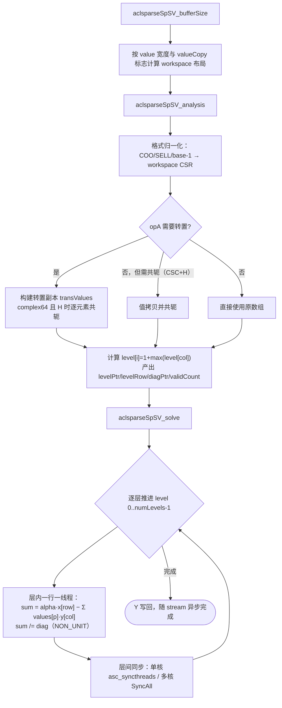

# aclsparseSpSV 算子设计文档

## 一、需求背景

### 1.1 需求来源

社区任务《9月社区任务-aclsparseSpSV算子开发（950）》要求在昇腾 NPU（Ascend 950PR，CANN 9.1.0）上，参考 `ops-sparse` 仓 arch35/DAV_3510 的既有 SpSV 实现，**补齐单精度复数（complex64）类型、测试、性能与文档能力**，完成设计、开发、测试全流程，验收通过后合入昇腾算子开源仓 [ops-sparse](https://gitcode.com/cann/ops-sparse)（算子目录 `sparse/spsv/arch35/`，测试目录 `test/spsv/arch35/`）。

### 1.2 背景介绍

#### 1.2.1 算子目标

`aclsparseSpSV` 与 cuSPARSE `cusparseSpSV` 的阶段划分、参数语义逐项对齐，求解稀疏三角线性方程组：

```
op(A) · Y = alpha · X
```

其中 `A` 为 `[m, m]` 稀疏三角方阵，`X`/`Y` 为稠密向量，`alpha` 为标量，且：

```
op(A) = A        （opA == ACL_SPARSE_OP_NON_TRANSPOSE）
op(A) = Aᵀ       （opA == ACL_SPARSE_OP_TRANSPOSE）
op(A) = Aᴴ       （opA == ACL_SPARSE_OP_CONJUGATE_TRANSPOSE）
```

**complex64 路径下 `CONJUGATE_TRANSPOSE` 为共轭转置（`Aᴴ = conj(Aᵀ)`），与 `TRANSPOSE` 语义不同，两条分支均须实现**；FP32 下 H 与 T 数值等价。算子按 cuSPARSE 约定拆为 `createDescr → bufferSize → analysis → solve → updateMatrix → destroyDescr` 六个阶段，跨阶段状态保存在不透明描述符中。

本次设计目标：

1. 在既有 FP32 实现之上补齐 `ACL_COMPLEX64`，保持五个公开接口签名、Host 生命周期与四种稀疏格式（CSR/CSC/COO/SLICED_ELL）不变。
2. 实现 complex64 的 `Aᴴ` 共轭转置，含 **CSC + H 这一"只共轭不转置"** 的特殊组合。
3. 精度满足生态算子开源精度标准（complex64 实部/虚部分别按 FLOAT32 判定：`rtol=2⁻¹⁰`、`atol=2⁻¹⁶`、`matched_ratio ≥ 0.99`、`max_abs_error ≤ max(1e-2, 32·ULP)`），golden 为 CPU float64 / complex128。
4. 性能倍率（标杆 GPU Event 耗时 ÷ NPU 同范围耗时）≥ 0.3，即 NPU 耗时不超过标杆的 3.333 倍。
5. workspace 峰值不超过目标硬件 L2 Cache 容量（Ascend950PR：134,217,728 B）。

#### 1.2.2 基线来源说明

本设计以 ops-sparse 仓已有实现为工程基线，不引入新的外部依赖：

| 基线层次 | 直接路径 | 作用 |
| --- | --- | --- |
| arch35 SpSV 骨架 | `sparse/spsv/arch35/spsv_{host,kernel}.cpp`、`spsv_tiling_data.h`、`spsv.h` | 复用分层调度（level scheduling）分析/求解框架、四格式归一化、I32/I64 索引、Host/Device pointer mode |
| 跨阶段状态 | `sparse/common/aclsparse_spsv_descr.h` | 复用 Analysis→Solve 的描述符状态（格式/op/fill/diag/base/索引宽度/workspace 偏移） |
| SIMT 编程接口 | `simt_api/asc_simt.h`、`simt_api/device_types.h` | `__simt_vf__`/`__simt_callee__`/`asc_vf_call`/`asc_syncthreads`/`SyncAll`；`__SIMT_DEVICE_FUNCTIONS_DECL__` 为设备辅助函数的规范限定符 |
| 复数语义参考 | cuSPARSE SpSV 官方文档、`torch.linalg.solve_triangular`（complex128） | 核对 N/T/H 与 INF/NAN 传播语义 |
| 测试框架 | `test/frame/*`、`test/spsv/arch35/spsv_test.{cpp,csv}` | CSV 驱动 GTest、Eigen float64 golden、CSV 参数解析与 device 搬运包装 |
| 交付测试包 | `test_cases/`（组织方下发） | ATK 精度 200 例、性能 206 例、内存对比脚本、H100 cuSPARSE 标杆 |

#### 1.2.3 现状分析

`upstream/master`（`9a51447`）逐文件审计结论：

**已具备**：五个公开接口签名与任务书 §2.3 逐字一致（`include/cann_ops_sparse.h:1716-1759`）；CSR/CSC/COO/SLICED_ELL 四格式；base 0/1；I32 与 I64 索引（超出任务书 I32 要求，允许 (I32,I32)/(I64,I32)/(I64,I64)）；N/T/H 三枚举均被接受；Host/Device pointer mode；BufferSize/Analysis 允许 vecX/vecY 描述符为 NULL；Host TU 内无任何 `aclrtMemcpy`/`aclrtSynchronize`/`malloc`，全部为 stream 上的 kernel 下发（满足任务书"禁止 CPU fallback"）。

**核心缺口**（本次工作主体）：

| 缺口 | 现状证据 |
| --- | --- |
| complex64 完全缺失 | `spsv_host.cpp` 对 `computeType != ACL_FLOAT` 与 `mat->valueType != ACL_FLOAT` 直接拒绝；`grep -riE 'complex\|float2'` 在 `sparse/spsv/`、`test/spsv/` **零命中** |
| H 未做共轭 | `NeedsTranspose` 把 H 等同于 T；转置构建 `transValues[pos]=values[p]` 未共轭 |
| alpha 为单 float | `SpsvTilingData::alpha` 为单个 `float`，device 模式只读 1 个 float |
| workspace 按 4 字节定尺 | `ComputeWorkspaceOffsets` 中 `csrValues`/`transValues` 段硬编码 `sizeof(float)` |
| 描述符未缓存 dtype | 缓存了 14 个属性，唯独没有 value type，Analysis→Solve 无法绑定精度 |
| C++ UT 无 dtype 维度 | `spsv_test.csv` 25 列无 dtype 列，145 条用例全为 FP32，H 仅 1 条且为 FP32（H≡T） |
| 交付测试包无法执行 | 全仓 `grep -rl ops_sparse_test` = **0 个文件**，三个 NPU hook 未注册，精度/性能/内存三项同时阻塞 |

执行模型上，SpSV 为**纯 SIMT** 实现（`KERNEL_TYPE_AIV_ONLY`），全实现不含任何 AscendC 向量路径——无 TPipe/TQue/LocalTensor/DataCopy，每次取值都是标量 `__gm__` 访存。**这一点决定了复数化的技术路线**：不存在 UB 切分与向量位宽假设需要迁移，复数化可以收敛为"把标量类型参数化 + 处理复数算术"，而不必重写 tiling 策略。

## 二、需求分析

### 2.1 外部组件依赖

不引入新的第三方组件。复用 ops-sparse 已有的：handle 机制（`aclsparse_descr_internal.h`，handle 携带 stream 与 pointer mode）、描述符层（`sparse/common/`）、SIMT 常量（`spsv_tiling_data.h`：`kSimtMaxThreads = 2048`）、测试公共件（`test/frame`，golden 依赖 Eigen）。

测试侧新增两项**环境**依赖（非代码依赖）：`eigen3-devel`（`spsv_golden.h` 无条件 include Eigen，而 CMake 仅在 `Eigen3_FOUND` 时链接）、与构建编译器 ABI 一致的 googletest。

### 2.2 内部适配模块

| 模块 | 计划文件 | 设计职责 |
| --- | --- | --- |
| 复数标量层 | `sparse/spsv/arch35/spsv_complex.h`（新增） | `SpsvComplex64` POD 与内联算术、SIMT 限定符封装、跨地址空间取值/存值、opA 位域解码 |
| Tiling 结构 | `sparse/spsv/arch35/spsv_tiling_data.h` | 增加 `alphaImag`、`valueType`；`opA` 扩展为位域（bit0 转置、bit1 共轭） |
| Host 实现 | `sparse/spsv/arch35/spsv_host.cpp` | dtype 校验与一致性、按 value 宽度定尺 workspace、复数 alpha 双分量、共轭/值拷贝标志计算 |
| Kernel 实现 | `sparse/spsv/arch35/spsv_kernel.cpp` | 求解链/分析链/辅助核按 `ValueT` 模板化；转置期施加共轭；入口按 `valueType` 二分派 |
| 跨阶段状态 | `sparse/common/aclsparse_spsv_descr.h` | 增加 `cachedValueType`/`cachedValueSize`，使 dtype 与既有 format/op/fill/diag 同级绑定 |
| 复数 golden | `test/spsv/spsv_complex_golden.h`（新增） | complex64 CSR/CSC 生成、complex128 稠密回代 golden、逐分量混合容差判定 |
| 功能测试 | `test/spsv/arch35/spsv_test.cpp` | 追加 complex64 参数化用例（格式 × fill × diag × N/T/H × m） |
| 构建接入 | `test/spsv/CMakeLists.txt` | 对 `spsv_test` 声明 `cxx_std_17`（`test/frame/fill.h` 用 `std::clamp`、`spsv_golden.h` 用 `if constexpr`，系统默认编译器仍为 gnu++14） |
| NPU hook | `test_cases/aclsparseSpSV_testCase/spsv_npu_registration.py`（新增） | 注册交付测试包所需的三个 `torch.ops.ops_sparse_test.*` 算子，打通精度/性能/内存链路 |
| 用例再生成 | `test_cases/extra_{performance,accuracy}_cases.py`（新增，补齐缺失件） | 交付包 `generate_cases.py` 依赖但未随包下发，缺失导致复现首步即 `ModuleNotFoundError` |

`sparse/CMakeLists.txt` 按 `SOC_ARCH_DIRS` 自动收集 `sparse/*/arch35/*.cpp`，算子源码无需改构建脚本。

### 2.3 接口原型

与 ops-sparse 仓 `include/cann_ops_sparse.h` 已有声明**逐字一致**，本次不修改公开头文件：

```cpp
aclsparseStatus_t aclsparseSpSV_createDescr(aclsparseSpSVDescr_t *spsvDescr);
aclsparseStatus_t aclsparseSpSV_destroyDescr(aclsparseSpSVDescr_t spsvDescr);
aclsparseStatus_t aclsparseSpSV_bufferSize(aclsparseHandle_t handle, aclsparseOperation_t opA,
    const void *alpha, aclsparseConstSpMatDescr_t matA, aclsparseConstDnVecDescr_t vecX,
    aclsparseDnVecDescr_t vecY, aclDataType computeType, aclsparseSpSVAlg_t alg,
    aclsparseSpSVDescr_t spsvDescr, size_t *bufferSize);
aclsparseStatus_t aclsparseSpSV_analysis(/* 同上 */, void *externalBuffer);
aclsparseStatus_t aclsparseSpSV_solve(/* 同上，无 externalBuffer */);
aclsparseStatus_t aclsparseSpSV_updateMatrix(aclsparseHandle_t handle,
    aclsparseSpSVDescr_t spsvDescr, void *newValues, aclsparseSpSVUpdate_t updatePart);
```

#### 2.3.1 参数说明

| 参数名 | 输入/输出 | 描述 | dtype | 维度/值域 | 异常行为 |
| --- | --- | --- | --- | --- | --- |
| handle | 输入 | 上下文句柄，携带 stream 与 pointer mode，Host 内存 | - | 已创建的有效句柄 | nullptr → `HANDLE_IS_NULLPTR` |
| opA | 属性 | 三角矩阵运算方式，Host | 枚举 | {NON_TRANSPOSE, TRANSPOSE, CONJUGATE_TRANSPOSE} | 非法枚举 → `INVALID_VALUE` |
| alpha | 输入 | 右端缩放标量；Host 模式为 Host 内存、Device 模式为 Device 内存 | FP32 / COMPLEX64，与 computeType 一致 | 对应 dtype 全集 | nullptr → `INVALID_VALUE` |
| matA | 输入 | 稀疏三角方阵描述符 | values FP32/COMPLEX64；索引 I32（另兼容 I64） | CSR/CSC/COO/SLICED_ELL，base 0/1，`[m,m]` | 非方阵/非法索引组合 → `INVALID_VALUE` / `NOT_SUPPORTED` |
| vecX | 输入 | 稠密右端向量，Device 内存，只读 | 与 matA/computeType 一致 | `[m]` 连续 | **BufferSize/Analysis 允许 NULL 描述符**；Solve 为 NULL 或 values 为空 → `INVALID_VALUE` |
| vecY | 输出 | 稠密解向量，Device 内存，可与 vecX 共用同一 values 指针（原地） | 与 matA/computeType 一致 | `[m]` 连续 | 同 vecX |
| computeType | 属性 | 计算精度，Host | 枚举 | {`ACL_FLOAT`, `ACL_COMPLEX64`} | 不支持或与 matA 不一致 → `NOT_SUPPORTED` / `INVALID_VALUE` |
| alg | 属性 | 算法枚举，Host | 枚举 | `ACL_SPARSE_SPSV_ALG_DEFAULT` | 其它值 → `NOT_SUPPORTED` |
| spsvDescr | 输入/输出 | 保存 Analysis→Solve 跨阶段状态 | 不透明描述符 | create 后至 destroy 前有效 | nullptr / 未 analysis → `INVALID_VALUE` |
| bufferSize | 输出 | workspace 字节数，Host | `size_t` | 非负 | nullptr → `INVALID_VALUE` |
| externalBuffer | 输入 | Analysis 使用的 Device workspace | 字节缓冲 | ≥ bufferSize，**512 字节对齐** | nullptr → `INVALID_VALUE` |
| newValues | 输入 | UpdateMatrix 替换的 values，Device 内存 | 与原 A 一致 | GENERAL：`nnz` 个元素；DIAGONAL：`m` 个对角元素 | nullptr → `INVALID_VALUE` |
| updatePart | 属性 | 更新范围，Host | 枚举 | {GENERAL, DIAGONAL} | 非法枚举 → `INVALID_VALUE` |

**返回值**：`aclsparseStatus_t`，状态码语义与 `cann_ops_sparse.h` 一致。

#### 2.3.2 退化与特殊值语义

| 场景 | 行为 |
| --- | --- |
| `nnz == 0`、diag = UNIT | `Y = alpha·X`（`spsv_scale_copy` 核） |
| `nnz == 0`、diag = NON_UNIT | 奇异矩阵，`Y = (alpha·X)·Inf`，按 IEEE-754 传播（`spsv_scale_inf` 核） |
| NON_UNIT 且某行缺失/零对角 | 该行除以零：**FP32 得 `±Inf`**（`x/0`）；**complex64 得 `NaN`**（分母为 0 使两个分子项同时为 0，`0/0`）。两者均满足任务书"传播 INF/NAN"，且各自与对应 golden（float64 / complex128）一致 |
| fill mode 之外的非目标三角项 | 按三角语义忽略，不参与计算 |
| 未排序坐标 | 四格式均接受，进入确定性规范化路径（COO/SELL 计数排序建 workspace CSR；CSR 由 `validCount` + 清理循环覆盖） |

#### 2.3.3 设计范围与约束

| 类别 | 约束项 | 约束内容 |
| --- | --- | --- |
| 参数合法性 | 校验序 | handle → opA 枚举 → matA/spsvDescr 非空 → computeType/alg → matA valueType 与 computeType 一致 → 方阵/索引组合 → 阶段相关指针 |
| 类型一致性 | A/X/Y/alpha/computeType | 五者必须同为 FP32 或同为 COMPLEX64，不一致返回 `INVALID_VALUE` |
| 共轭转置 | H | complex64 必须对 A 取共轭；**不得退化为普通转置** |
| 跨阶段绑定 | Analysis→Solve | 格式、fill、diag、op、**dtype**、base、索引宽度、workspace 均以 Analysis 时快照为准 |
| workspace | 生命周期 | Analysis 绑定至异步 Solve 完成前不得释放；内容不得被外部修改 |
| 原地 | Y 与 X | 允许共用同一 Device values 指针 |
| 确定性 | 重复执行 | 同一输入重复求解结果 bitwise 一致（分层调度层内并行、层间同步，累加序固定） |
| 异步执行 | handle stream | kernel 异步下发；读回 Device 结果前须同步 stream |

## 三、需求详细设计

### 3.1 使能方式

用户创建 handle 并 `aclsparseSetStream` 绑定 stream 后，按 `createDescr → bufferSize → 分配 workspace → analysis → solve`（可选 `updateMatrix` 后再 solve）调用。Host 侧完成校验与 tiling 后经 `spsv_*_kernel_do` 直接下发 SIMT kernel；tiling 按值传递，无 device 侧 tiling 内存。构建由 `sparse/CMakeLists.txt` 按 `SOC_ARCH_DIRS` 自动收集，`--soc=ascend950` 时生效。

### 3.2 需求总体设计

#### 3.2.1 数据表示与总体结构

complex64 在 GM 中为实部/虚部交织存储（`SpsvComplex64{float re; float im;}`，与 `ACL_COMPLEX64`、cuComplex、`torch.complex64` 布局一致），因此 device values 缓冲区可直接按 `SpsvComplex64[]` 重解释，**无需重排**。kernel 侧复数下标 `k` 的实部在 `2k`、虚部在 `2k+1`。

求解算法沿用既有**两阶段分层调度**：



复数化的关键在于：**共轭统一发生在 Analysis 期的值搬运**（转置拷贝或值拷贝），Solve 热路径因此完全不感知共轭——既不必为 `CONJ` 增加模板实例，也不会在最内层循环引入分支。

#### 3.2.2 复数标量层设计（`spsv_complex.h`）

```cpp
struct SpsvComplex64 { float re; float im; };
```

平凡可复制 POD，仅带内联算术。三条设计约束**均由实机编译器诊断确认，非推测**：

1. **除法采用教科书公式而非 Smith 缩放算法。** 本算子精度预算为 `rtol = 2⁻¹⁰`，远宽于两者差异；且教科书形式能精确复现 CPU golden（complex128）的 IEEE 特殊值行为——NON_UNIT 缺失或零对角时分母为 0，两个分子项同时为 0，商为 `NaN`，正是 §2.3.2 所要求的传播行为。

2. **设备辅助函数必须携带 SIMT 限定符。** 编译器强制「`simt_callee` 只能调用 `simt_callee`」，因此被求解体调用的算子重载与 `SpsvLoad/Store/Zero/Conj/Inf` 一律标注 SDK 宏 `__SIMT_DEVICE_FUNCTIONS_DECL__`（本文件内别名 `SPSV_SIMT_FN`），它在 pure-SIMT 构建下退化为 `__aicore__`，是可移植写法。仅在 `__aicore__` kernel 入口使用的 `SpsvMakeAlpha` 保持 `__aicore__`，并直接逐字段构造、不调用 SIMT 函数。

3. **必须显式跨地址空间取值。** 对 `__gm__` 指针取下标得到的是带地址空间限定的左值（`const __gm__ SpsvComplex64`），无法绑定到隐式拷贝构造的 `const T&`，**结构体不能直接从 GM 拷出**，故提供逐字段的 `SpsvLoad`/`SpsvStore` 重载。

`opA` 在 tiling 中编码为位域（bit0 = 转置，bit1 = 共轭），由 `SpsvOpNeedsTrans`/`SpsvOpConjugate` 解码。这样 Host 与 Kernel 从同一组输入推导 workspace 布局，结构上不可能不一致；同时 SIMT 分析入口的参数个数保持不变（该入口已有 25 个形参）。

#### 3.2.3 Host 侧设计

**类型校验**：`ValidateSpSVCommonParams` 由「只接受 `ACL_FLOAT`」改为接受 `{ACL_FLOAT, ACL_COMPLEX64}`，并新增 `mat->valueType == computeType` 一致性校验。

**workspace 定尺**：`ComputeWorkspaceOffsets` / `ComputeWorkspaceSize` 增加 `valueSize` 与 `valueCopy` 形参，`csrValues`/`transValues` 两段由 `sizeof(float)` 改为 `valueSize`（FP32 = 4，complex64 = 8）。**bufferSize 与 BuildTilingData 共用同一函数**，保证两阶段定尺逐字节一致。

**描述符缓存 dtype**：新增 `cachedValueType`/`cachedValueSize`，由 `CacheMatrixAttributes` 在 Analysis 时写入；Solve 与 UpdateMatrix 一律读缓存值（cuSPARSE 约定）。`InitUpdateTilingData` 亦须写入 `valueType`，否则 UpdateMatrix 将以 FP32 宽度写入 complex64 数组。

**alpha**：`SpsvTilingData` 增加 `alphaImag`；Host 模式按 dtype 读 1 或 2 个 float；Device 模式下 `alphaDevicePtr` 指向 1 个（FP32）或 2 个连续（complex64）float，**对齐契约相应由 4 B 提升为 8 B**。

**共轭与值拷贝标志**：

```
conjugate = (valueType == COMPLEX64) && (cachedOpA == CONJUGATE_TRANSPOSE)
valueCopy = (format ∈ {COO, SLICED_ELL}) || (idxBase == 1) || (conjugate && !needsTrans)
tiling.opA = (needsTrans ? 1 : 0) | (conjugate ? 2 : 0)
```

#### 3.2.4 CSC + H 的特殊处理

这是复数化中唯一**在原设计里无处安放**的组合。CSC 存储按 CSR 解读即为 `Aᵀ`，故 Host 对 CSC 做零拷贝重映射并翻转 fill/op：

| 输入 | 重映射后 | 是否转置 | 是否共轭 |
| --- | --- | --- | --- |
| CSC + N | op = T | 是 | 否 |
| CSC + T | op = N | 否 | 否 |
| **CSC + H** | **op = N** | **否** | **是** |

`Aᴴ = conj(Aᵀ)`，而 CSC-as-CSR 已经是 `Aᵀ`，因此只需共轭、不需转置——但不转置就没有 `transValues` 那份拷贝可供落地共轭结果。处理方式：把 `conjugate && !needsTrans` 并入 `valueCopy`，强制材料化一份 workspace CSR values 拷贝并在拷贝时施加共轭。相应地，Solve 侧决定"是否读 workspace CSR"的 `SpsvResolveEffectivePtrs` 必须使用**同一个** `valueCopy` 判据，否则会读到未共轭的原数组。

#### 3.2.5 Kernel 侧设计

对取值路径引入 `ValueT` 模板参数（`float` 或 `SpsvComplex64`），覆盖：四个参数表宏（COO/SELL/转置/workspace-CSR）与 `SPSV_WORKSPACE_CSR_SETUP`；格式转换与转置构建；分析链（`SPSV_ANALYSIS_PARAMS`、`SpsvAnalysisCommon`、`SimtCompute`、`SerialPhase`）；求解链（`SpsvSolveRow`、`SimtCompute`、`LevelSimtCompute`、`SingleCore`/`MultiCore`）；辅助核（Update/FillZero/ScaleCopy/ScaleInf/CopyValues）。

`extern "C"` 入口按 `tiling.valueType` 二分派。为避免把既有的 6 路 `(indexType, colIndType, permType)` 分支复制两份，新增 `SPSV_DISPATCH_ANALYSIS_INDEX` 宏与 `SpsvSolveDispatchIndex<ValueT>` 模板，dtype 分支只出现一次。

求解体核心（FP32 与复数共用同一份代码）：

```cpp
ValueT sum = alpha * SpsvLoad(&vecX[row]);
    sum -= SpsvLoad(&values[p]) * SpsvLoad(&vecY[col]);
ValueT diag = (diagPtr[row] >= 0) ? SpsvLoad(&values[diagPtr[row]]) : SpsvZero<ValueT>();
sum /= diag;
SpsvStore(&vecY[row], sum);
```

**转置期值搬运的特殊约束（实测结论）**：分析期转置将值写入 workspace 时，**不得通过 `__gm__` 聚合指针整体存储结构体**——即使 workspace 尺寸与对齐均正确（实测 m=16、nnz=104 时 workspace = 2688 B，values 段恰为 104×8 B 且位于 8 字节对齐偏移），该写法仍触发 `ACL_ERROR_RT_VECTOR_CORE_EXCEPTION`（507035）。改为按 float 分量寻址后消除。定位方法：在 analysis 后插入同步把故障归因到分析阶段，再二分屏蔽存储语句。

该改写的**作用域必须严格限定在转置的两处存储**。同样的改写施加到 `SPSV_CONVERT_FORMAT_TO_CSR_*` 宏内的值拷贝时，虽然编译通过且 complex64 全部正确，却会使 SLICED_ELL + I64 的 FP32 用例（`L1_slicedell_i64_lower`、`I64_FUNC_sell_64_sw2`）报同一 vector core 异常——**而这些用例并不执行被改动的代码**。对照实验（把辅助函数只定义、不调用）证明触发条件是调用点改写而非代码存在：`SPSV_CONVERT_FORMAT_TO_CSR_*` 与 SLICED_ELL 转换位于同一函数体内，改写该宏会扰动 SELL 实际执行的那段代码。因此 CSC+H 的共轭值拷贝沿用原有写法（实测正确）。

#### 3.2.6 性能设计

标杆场景为强串行依赖问题（三角回代），并行度受层结构限制而非带宽。设计以"保持既有分层调度骨架、复数化不引入额外访存"为主线：

1. **共轭前置到 Analysis**：Solve 内层循环与 FP32 完全同构，无分支、无额外加载。
2. **复数按交织布局原地解读**：values/X/Y 均无需重排，复数化后访存量为 FP32 的 2 倍（元素宽度），访存模式不变。
3. **dtype 分支只在入口出现一次**：通过 `SpsvSolveDispatchIndex<ValueT>` 与 `SPSV_DISPATCH_ANALYSIS_INDEX` 收敛，避免 6 路索引分支 × 2 dtype 的代码膨胀。
4. **实例化规模需要控制**：本编译单元对代码量敏感（见 §3.2.5），新增实例化时须回归 SLICED_ELL/I64 路径。

性能目标（标杆取任务书 §3.3 表，与 `baseline_results/gpu_full_results.tsv` 逐位一致；门限取同场景 base0/base1 中较严者）：

| 场景 | dtype / op | m / nnz | 标杆 median_us | NPU 门限（÷0.3） |
| --- | --- | --- | --- | --- |
| P-01 | float32, N, lower, nonunit | 65,536 / 524,288 | 40458.531 / 40413.695 | **≤ 134,712 μs** |
| P-02 | complex64, T, upper, unit | 131,072 / 1,572,864 | 93850.750 / 94739.203 | **≤ 312,836 μs** |
| P-03 | complex64, H, lower, nonunit | 262,144 / 3,932,160 | 222887.562 / 220676.516 | **≤ 735,588 μs** |

计时口径已从代码确认：`benchmark_runner.py` 的 Event 窗口只括住 `invoke()`（即 solve），`reset()`（含 update）在窗口之外，analysis 在 `prepare_case` 中只做一次。故 `median_us` 是 **Solve 阶段**数值。Analysis 不计入倍率但为必报指标，且量级很大（P-01 标杆侧为 268,038 μs，约为受评 median 的 6.6 倍）。

#### 3.2.7 特殊情况与边界处理

| 特殊情况 | 处理方式 |
| --- | --- |
| m = 0 / nnz = 0 | Analysis 直接置 `analysisLaunched`，Solve 走 `scale_copy`（UNIT）或 `scale_inf`（NON_UNIT） |
| NON_UNIT 缺失/零对角 | 除以零，FP32 得 Inf、complex64 得 NaN（§2.3.2） |
| base = 1 | Analysis 期归一化为 0-based workspace CSR |
| CSC + H + complex64 | 强制值拷贝并共轭（§3.2.4） |
| 未排序坐标 | CSR 由 `validCount` + 清理循环；COO/SELL 由计数排序建 CSR |
| 重复坐标 | 不合并，取首个匹配（需在文档与测试报告中固化该策略） |
| I32/I64 混合索引 | 允许 (I32,I32)/(I64,I32)/(I64,I64)；(I32,I64) 拒绝 |
| X/Y 原地 | vecY 可绑定 vecX 的同一 values 指针 |
| workspace 未对齐 | 契约要求 512 字节对齐（`spsv.h: kAlign`）；调用方使用缓存分配器时须自行对齐 |

### 3.3 支持硬件

| 支持的芯片版本 | 涉及勾选 |
| --- | --- |
| Ascend 950PR（arch35 / DAV_3510） | √ |

本次交付仅覆盖 Ascend 950PR。SpSV 为 arch35-only 算子；A2/A3 的回归面是 SpSV 触及的 `sparse/common/` 共享 Host 层，需以 `--soc=ascend910b*` 重建并回归 `test/{scatter,spmm,spmv,spvv}/arch22`，`test/spsv` 在该 SOC 下按构建系统约定报 SKIP。

### 3.4 算子约束限制

1. A 为二维三角方阵；A/X/Y/alpha/computeType 类型必须一致，否则返回 `INVALID_VALUE`。
2. Device 索引为 I32（实现另兼容 I64）；`(I32 ptr, I64 idx)` 组合被拒绝。
3. `externalBuffer` 须 ≥ bufferSize 且 **512 字节对齐**，Analysis 至异步 Solve 完成期间有效且内容不被外部修改。
4. 异步语义：依赖 handle 绑定的 stream，读回 Device 结果前须同步。
5. 四格式均接受未排序坐标；重复坐标不合并。

## 四、特性交叉分析

| 交叉维度 | 设计关注点 | 应对策略 |
| --- | --- | --- |
| dtype × op | complex64 的 H 需共轭，FP32 的 H 等价于 T | 共轭标志由 `(valueType, opA)` 共同决定；FP32 恒为 false，H 路径与 T 共用代码 |
| dtype × 格式 | CSC 的零拷贝重映射与共轭需求冲突（§3.2.4） | `conjugate && !needsTrans` 并入 `valueCopy`，强制材料化并共轭；Solve 侧读取判据与之一致 |
| dtype × workspace | 值段宽度随 dtype 变化，两阶段必须一致 | bufferSize 与 BuildTilingData 共用同一定尺函数；dtype 缓存进描述符 |
| dtype × updateMatrix | 更新核以 tiling 分派，而 tiling 在 update 路径为新建结构 | `InitUpdateTilingData` 必须显式写入 `valueType`，否则以 FP32 宽度写 complex64 数组 |
| dtype × pointer mode | Device alpha 由 1 个 float 变为 2 个连续 float | `alphaDevicePtr` 对齐契约提升至 8 B；kernel 按 `valueType` 决定读 1 还是 2 个分量 |
| 格式 × 索引宽度 | SLICED_ELL + I64 是最大的 SIMT 实例化体 | 新增实例化或改写共享函数体时必须回归该组合（§3.2.5 实测教训） |
| op × fill mode | 转置翻转有效 fill，决定前向/后向回代 | `SpsvResolveEffectivePtrs` 统一从 `opA` 位域解出转置位后再翻转 |
| 生命周期 × dtype | Analysis→Solve 须绑定 dtype | dtype 与 format/op/fill/diag/base 同级缓存，Solve 一律读缓存 |
| 异步 × 测试读回 | stream 未同步读回脏数据 | 测试 wrapper 读回前同步；NPU hook 在 Analysis 后同步以保证分析结果对 Solve 可见 |
| 交付测试包 × torch_npu | 包内适配层对 complex64 使用了 NPU 不支持的算子 | hook 侧以 CPU 等价实现替换掩码写入；不修改交付文件本体 |

## 五、可维可测分析

### 5.1 验收标准与验证方式

| 验收项 | 标准 | 说明 |
| --- | --- | --- |
| 功能标准 | 与 cuSPARSE SpSV 阶段语义一致 | 四格式 × fill/diag × N/T/H × FP32/complex64、生命周期、边界、运行语义全覆盖 |
| 精度标准 | 生态算子开源精度标准 | FP32 用 float64 golden、complex64 用 complex128 golden；`rtol=2⁻¹⁰`、`atol=2⁻¹⁶`、`A=1e-2`、匹配率 ≥ 0.99、硬上界 `max(A, 32·ULP)`；complex64 实部/虚部分别适用全部规则。判定器为 ATK 内置 `MixedToleranceBenchmarkAccuracyCompare` |
| 性能标准 | 性能倍率 ≥ 0.3 | 门限见 §3.2.6；预热 10 次、正式 30 次，报告 median、P90、Analysis、Solve、workspace 与 profiler 证据 |
| 内存标准 | workspace ≤ L2 | Ascend950PR L2 = 134,217,728 B（来源 `Ascend950PR_9579.ini: l2_size`）。**注意：交付脚本的 >500 MB 百分比分支对本算子恒不可达**——206 条用例最大 `input_output_bytes` 仅 52,428,812 B，故唯一可达判据是 `workspace ≤ L2` |
| 可复现 | 自测报告 + 测试 README | 用例参数、精度结果、性能数据、峰值内存、截图、Profiler 证据、失败项说明 |

### 5.2 验证矩阵

测试分两条链路：仓内 C++ GTest（CSV 驱动）与交付包 ATK/benchmark（Python hook 驱动）。

| 验证项 | 典型场景 | 载体 |
| --- | --- | --- |
| 基础功能 | 四格式 × fill/diag × N/T/H × FP32 | `spsv_test.csv`（L0/L1） |
| complex64 功能 | 格式 × fill × diag × N/T/H × m∈{16,129}，含 CSR 的 H（转置后共轭）与 CSC 的 H（只共轭不转置） | `spsv_test.cpp` 参数化 `c64_*` 用例 |
| 生命周期 | Create、NULL vecX/vecY 的 BufferSize/Analysis、Solve、GENERAL/DIAGONAL UpdateMatrix、Destroy、描述符/参数/buffer 一致性 | GTest `SpSVExceptionTest` + CSV `update_mode` 列 |
| 边界 | m/nnz = 0/1、空行、未排序、缺失/零对角的 INF/NAN、非法索引、workspace 越界与未对齐 | CSV + 异常用例 |
| 运行语义 | Host/Device pointer mode、X/Y 原地别名、stream 异步、重复执行确定性、过早释放 buffer | GTest 专项用例 |
| 精度（200 例） | 交付包 `accuracy_cases.json`，dtype × base × op × fill × diag × pointer × update × 8 种行分布 | ATK + `function_sparse_ops.py` + NPU hook |
| 性能（206 例） | 交付包 `performance_cases.json`，含 P-01/P-02/P-03 各 base 0/1 | `benchmark_sparse_ops_npu.py` + NPU hook |
| 内存 | 同一 case 文件，`workspace_bytes` 与 L2 对比 | `collect_sparse_ops_npu_memory.py` + `compare_sparse_ops_memory.py` |

比对方式：C++ 侧对 complex64 走逐分量混合容差判定（`spsv_complex_golden.h`）；ATK 侧由 `MixedToleranceBenchmarkAccuracyCompare` 对 complex64 分量分派。

### 5.3 兼容性分析

公开接口签名、枚举与生命周期语义均不变，仅放宽 `computeType` 取值域。既有 FP32 调用方为**纯二进制兼容**：`SpsvTilingData` 新增字段位于结构体内部且由 Host 统一填充，`valueType` 缺省为 0（FP32），行为与改动前一致。

本设计新增 `sparse/spsv/arch35/spsv_complex.h` 与 `test/spsv/spsv_complex_golden.h`，修改 `spsv_{host,kernel}.cpp`、`spsv_tiling_data.h`、`aclsparse_spsv_descr.h`、`test/spsv/{CMakeLists.txt, arch35/spsv_test.cpp}`；不修改 `include/cann_ops_sparse.h`（声明已存在），不修改其它算子。`aclsparse_spsv_descr.h` 位于 `sparse/common/` 但为 SpSV 专属结构，改动不影响其它算子。

### 5.4 待评审通过后进入开发/验收的交付件

1. **算子实现**：`sparse/spsv/arch35/{spsv_complex.h, spsv_host.cpp, spsv_kernel.cpp, spsv_tiling_data.h}`、`sparse/common/aclsparse_spsv_descr.h`，提交 ops-sparse 个人 fork（邀请 `Ascend-CANN` 为开发者）。
2. **测试工程**：`test/spsv/{CMakeLists.txt, spsv_complex_golden.h, arch35/spsv_test.cpp}` 与 `test/spsv/README.md`（环境、编译、测试步骤、用例表、复现方式）。
3. **NPU hook 与测试包补齐件**：`test_cases/aclsparseSpSV_testCase/spsv_npu_registration.py`、`test_cases/extra_{performance,accuracy}_cases.py`。
4. **自测报告**：按模板输出用例参数、精度结果（实部/虚部分别）、性能数据、峰值内存、Profiler 证据、失败项说明。
5. **README 更新**：`sparse/spsv/README.md` 支持类型与性能章节。

## 六、逐项验收矩阵

本节状态只表示开发者侧证据，不替代社区专家结论。本文档整体状态为
**待专家验收**。

| 任务书条款 | 设计章节 | 验证证据 | 状态 |
| --- | --- | --- | --- |
| 公共 create/destroy/bufferSize/analysis/solve/updateMatrix 接口 | §2.3、§3.2.3 | `bash build.sh --ops=spsv --soc=ascend950 --run`，216/216 | 已验证 |
| FP32、complex64 与 A/X/Y/alpha/computeType 一致性 | §2.3.1、§3.2.2 | C++ 参数化测试；200 条 NPU 精度用例 | 已验证 |
| CSR/CSC/COO/SLICED_ELL，base 0/1 | §2.3.3、§3.2.4/5 | C++ CSV/complex64 参数化测试；accuracy manifest | 已验证 |
| LOWER/UPPER、UNIT/NON_UNIT、DEFAULT、N/T/H | §2.3.2、§3.2.4/7 | 216 条 C++ 测试与 200 条精度用例 | 已验证 |
| complex64 H 共轭语义 | §3.2.2、§3.2.4 | CSR/CSC H、base1、GENERAL/DIAGONAL 专项测试 | 已验证 |
| Host/Device alpha，X/Y Device values 与原地别名 | §2.3.1、§3.4 | CSV in-place、complex64 device-alpha 与 P 用例 | 已验证 |
| NULL vec 的 BufferSize/Analysis 与非 NULL Solve | §2.3.1、§3.2.7 | `L1_*_nullvec`、`WB_null_vec{X,Y}_solve` | 已验证 |
| Analysis 状态与 externalBuffer 生命周期绑定 | §2.3.3、§3.4 | solve-before-analysis、NULL/misaligned workspace、同步后释放测试 | 已验证 |
| GENERAL/DIAGONAL UpdateMatrix 与确定性 | §3.2.3/5、§4 | CSR/CSC/COO/SELL 更新专项；重复 solve 检查 | 已验证 |
| 未排序、空行、m/nnz=0/1、缺失/零对角、非法索引 | §2.3.2、§3.2.7 | CSV WB/L1 与异常 GTest；Inf/NaN 传播 | 已验证 |
| 核心求解和格式转换均在 NPU stream 执行，无 CPU fallback | §3.2.3/5 | 公共 C API hook + profiler 的 `spsv_*_kernel` 任务 | 已验证 |
| 精度：float64/complex128 金标及任务书混合容差 | §5.1/2 | `results_accuracy_npu_conditioned_final/summary.json`，200/200 | 已验证 |
| 大规模性能输入数值有效性 | §3.2.6、§5.1 | O(nnz) CPU 金标，P-01/02/03 base0/1 共 6/6 | 已验证 |
| 性能：warmup 10、samples 30、GPU/NPU ≥ 0.3 | §3.2.6 | 六场景倍率 0.4099–0.8733；206/206 无跳过 | 已验证 |
| 内存：workspace 不超过 950PR L2 134,217,728 B | §5.1/2 | 最大分配 132,121,792 B（P-03 base1） | 已验证 |
| 重复稳定性与独立样本泛化 | §4、§5.1/2 | 3×216 C++、3×200 固定精度、3×128 独立种子/边界尺寸均通过；P 用例跨轮 median CV 最大 1.6623% | 已验证 |
| NPU profiler | §3.2.6、§5.1 | P-03 base0：solve 551,129.304 us；导出 op/task CSV | 已验证 |
| ATK 官方 CLI 执行 | §5.2 | manifest 预检通过 200 条；机器无 `atk` 命令 | 环境阻塞 |
| A2/A3 联合设备回归 | §3.3、§5.3 | 当前授权设备仅 Ascend 950；arch22 构建可配置但无 A2/A3 设备 | 环境阻塞 |
| 设计文档社区专家评审 | 本文全部章节 | 固定路径交付；专家结论尚未产生 | 待专家验收 |

最终复核使用 CANN 9.1.0、Ascend 950PR 物理 3 号卡（映射为进程内
device 0）。物理 0/1 号卡检查时为 Critical/占用状态，未抢占；3 号卡
执行前健康状态 OK、无进程、利用率 0%。
