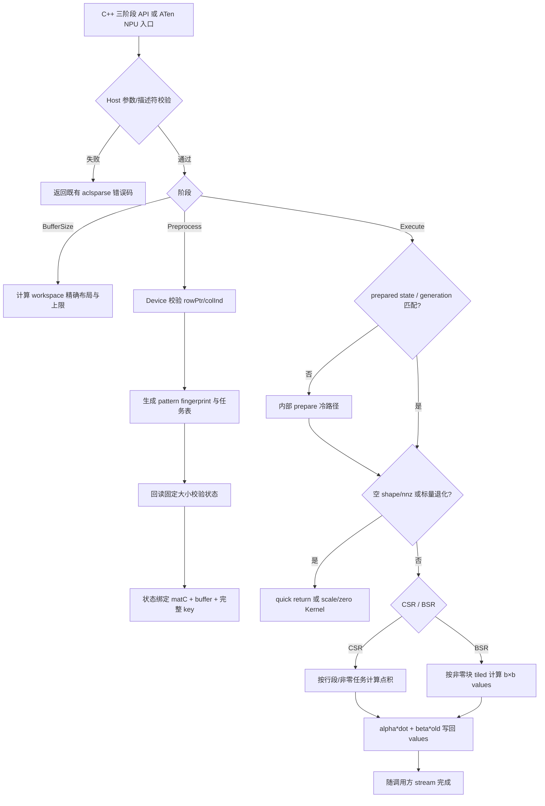
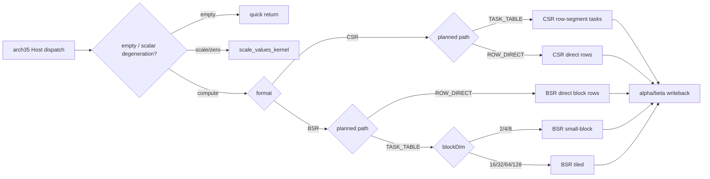

# aclsparseSDDMM 算子开发（Ascend 950PR）设计文档

> 设计基线：任务书、专项测试包，以及 `ops-sparse` 官方 `master`/用户 fork 共同提交 `e0015bb76090487165f43dbaf2aae37648887a4b`。新增公共 ABI 和三阶段状态机按 Ops-linear-algebra SIG 流程评审后固化。

## 一、需求背景

### 1.1 需求来源

社区任务《9月社区任务-aclsparseSDDMM算子开发（950）》要求在 Ascend 950PR（DAV_3510，`arch35`，A5）上完善 `aclsparseSDDMM`。算子采用 aclsparse C++ 三阶段接口，计算稠密矩阵乘积在给定稀疏 pattern 上的采样值，支持 CSR、方块 BSR、混合精度、strided batch，并补齐 `torch.sparse.sampled_addmm` / `aten::sparse_sampled_addmm` 的 NPU 适配。

算子代码最终合入 [ops-sparse](https://gitcode.com/cann/ops-sparse) 的 `master` 分支：A5 实现放入 `sparse/sddmm/arch35/`，当前 GTest 变体测试放入 `test/sddmm/sddmm/arch35/`，公共声明更新 `include/cann_ops_sparse.h`；设计文档提交至 cann-ops-competitions 对应社区任务目录。开发以用户 fork `HedgehogLX/ops-sparse` 为 `origin`、官方仓为 `upstream`，两者在本次设计审阅时均指向上述基线提交。

目标软件环境为 CANN 9.1.0 及后续配套版本、PyTorch 2.7 及以上、torch_npu 26.0.0 及之后版本。核心计算必须在 Ascend 950PR NPU 完成，不允许以 CPU fallback 代替。

### 1.2 背景介绍

#### 1.2.1 算子目标

`aclsparseSDDMM`（Sampled Dense-Dense Matrix Multiplication）计算：

```text
C = (alpha * op(X) * op(Y) + beta * C) ∘ spy(C)
```

其中 `spy(C)` 只保留 `C` 已有稀疏结构位置。执行前后 `C` 的 row offsets、column indices、index base、format 和 block layout 不变，只原地更新 values。

令：

```text
op(X) ∈ F^(M×K)
op(Y) ∈ F^(K×N)
C     ∈ F^(M×N)
```

对 CSR 的第 `p` 个存储元素，若其逻辑坐标为 `(i,j)`：

```text
C.values[p] = alpha * Σ(k=0..K-1) op(X)[i,k] * op(Y)[k,j]
              + beta * C.values[p]
```

对 BSR 的第 `q` 个非零块，块坐标为 `(br,bc)`、块大小为 `b×b`，则块内每个 `(r,c)` 独立计算逻辑坐标 `(br*b+r, bc*b+c)` 的同一公式。BSR pattern 以块为单位，块内 `b²` 个 values 全部更新。

`opX`、`opY` 仅支持 `NON_TRANSPOSE` 和 `TRANSPOSE`。complex64 的 `TRANSPOSE` 是普通转置，不做共轭；本任务不声明 `CONJUGATE_TRANSPOSE`。

支持组合以任务书的精确支持矩阵为准：

| 稀疏格式 | X/Y dtype | C values dtype | computeType | 累加类型 |
| --- | --- | --- | --- | --- |
| CSR / BSR | FP32 | FP32 | FP32 | FP32 |
| CSR / BSR | complex64 | complex64 | complex64 | complex FP32 |
| CSR / BSR | FP16 | FP32 | FP32 | FP32 |
| CSR / BSR | FP16 | FP16 | FP32 | FP32，写回转 FP16 |
| BSR | BF16 | FP32 | FP32 | FP32 |
| BSR | BF16 | BF16 | FP32 | FP32，写回转 BF16 |

因此 BF16 只属于 BSR 路径，CSR BF16 不在本次声明范围。

本次设计目标：

1. 复用 ops-sparse 既有 Handle、DnMat、SpMat 描述符与三阶段 ABI，不新增 A5 私有平行接口。
2. 补齐 CSR complex64、CSR base 1、BSR mutable/const 描述符、BSR base 0/1、块内 ROW/COL、全部声明 dtype 组合与 strided batch。
3. 将 Preprocess 状态绑定到 `matC` 生命周期和完整 pattern，移除以 buffer 地址和不完整 shape 为 key 的进程全局非线程安全缓存。
4. 使用调用方 stream 下发 Host/Ascend C 流程；Host 元数据错误同步返回，Preprocess 通过固定大小状态字报告 Device pattern 错误，execute 热路径不引入 Host 同步。
5. Python/ATen CSR 路径从 `torch.sparse.sampled_addmm` 命中 NPU Dispatcher 和 aclsparse Kernel，不发生 CPU fallback，也不修改函数式输入 Tensor。
6. 精度满足任务书的混合容差与硬上限；性能在三个固定模型维度上对所有声明组合达到 `GPU Event median / NPU Kernel median >= 0.3`。
7. 不生成完整 `M×N` 稠密乘积，workspace 上限不超过 Ascend 950PR 的验收 L2 容量。

#### 1.2.2 基线来源说明

| 基线层次 | 直接路径或来源 | 作用 |
| --- | --- | --- |
| 任务需求 | `aclsparseSDDMM_A5_task_doc.md` | API、支持矩阵、平台、精度/性能/内存和交付边界 |
| arch35 既有能力 | `sparse/sddmm/arch35/{sddmm.h,sddmm_host.cpp,sddmm_kernel.cpp,sddmm_kernel.h}` | 现有 CSR SIMD Host/Kernel 工程基线；增量补齐格式、类型、batch、状态与性能 |
| 公共 API | `include/cann_ops_sparse.h`、`sparse/common/aclsparse_descr_internal.h`、`sparse/common/aclsparse_descr.cpp` | 复用并扩展 Handle、DnMat、SpMat、状态码、pointer mode、stream 和资源生命周期 |
| 专项功能测试 | `test_cases/aclsparseSDDMM_testCase/accuracy_cases.json`、`operator_adapter.py` | CSR/BSR、base、block、ROW/COL、batch 和当前 tensor reference 语义 |
| 专项性能/内存测试 | `test_cases/aclsparseSDDMM_testCase/performance_cases.json`、`test_cases/baseline_results/gpu_full_results.tsv`、`test_cases/baseline_results/manifest.json` | 固定性能输入、当前有效 GPU 标杆、采样口径和内存采集口径 |
| Python 语义 | [PyTorch 2.7 schema](https://github.com/pytorch/pytorch/blob/v2.7.0/aten/src/ATen/native/native_functions.yaml#L7003-L7013) 及 [SparseBlas 校验/输出逻辑](https://github.com/pytorch/pytorch/blob/v2.7.0/aten/src/ATen/native/sparse/SparseBlas.cpp#L99-L242) | NPU Dispatcher、输出构造、alias、异常与 batch 语义的对齐目标 |
| C++ 参考语义 | [cuSPARSE SDDMM 6.6.13](https://docs.nvidia.com/cuda/cusparse/index.html#cusparse-generic-function-sddmm) | 三阶段参数、active buffer、Preprocess 状态和并发语义的参考 |

性能证据以 `test_cases/baseline_results/gpu_full_results.tsv` 与 `test_cases/baseline_results/manifest.json` 为准：manifest 的 source 文件名标记为 H100，记录 native 130 条、PyTorch 112 条，共 242 条且无 skip。`test_cases/aclsparseSDDMM_testCase/gpu_performance_result_benchmark.md` 是 2026-08-27 的旧快照，仍记录大量 BSR skip 和不同耗时，不能作为当前准入基线；任务书性能表采用的是新 TSV 数值，但“明细”链接仍指向旧 Markdown，后续需修正文档链接。

#### 1.2.3 现状分析

当前 `arch35/sddmm_host.cpp` 仅接受 CSR、I32、base 0，以及 FP32→FP32/compute FP32 和 FP16→FP16/compute FP16 两种同型组合；后者也不符合本任务要求的 FP32 computeType。现有 SIMD Kernel 通过 workspace 中的 tiling、行重排表与分箱边界计算，Preprocess 会同步 D2H row offsets、在 Host 做贪心分箱、再同步 H2D 写回；execute 遇到非 active buffer 会隐式重建。其 pattern cache 以 buffer 为 key、signature 仅包含 rows/nnz/k，且是无锁进程全局状态。该状态既不能区分完整 rowPtr/colInd 内容，也无法保证不同 `matC`、workspace 或线程并发安全，必须替换。

公共描述符当前也没有 BSR Create/ConstCreate、DnMat strided-batch 或 BSR strided-batch 字段/API；这些是本任务新增公共 ABI，不是对已有声明的简单实现。`ops-sparse` 当前没有 Python、ATen 或 Dispatcher 构建基础设施，本任务按任务书要求在同一仓新增可选 `torch_adapter/` 模块、构建入口和测试目录，与 aclsparse ABI 在同一开发分支联调和交付。

新增能力的主要复杂度不在单个点积，而在以下交叉项：

1. CSR 与 BSR 的任务粒度、访存复用和负载均衡不同。
2. X/Y 的 transpose、ROW/COL、leading dimension 与 batch stride 共同决定地址计算。
3. FP16/BF16 输入、FP16/BF16/FP32 输出和 FP32 computeType 形成混合精度路径；complex64 需复数标量及复数点积。
4. Preprocess 必须逐项校验 Device 上的完整 pattern；setter 可观测的指针或元数据变化将状态置为 DIRTY，由下一次显式 Preprocess 或 execute 冷路径重建；同一 Device 地址上的内容原地修改必须由调用方显式重新 Preprocess。
5. Python API 是函数式输出，而底层 aclsparse 接口原地更新 `matC.values`，适配层必须隔离输入 values。
6. 大模型锚点 K 固定为 128、CSR 每行 64 个标量非零；BSR block 为 16/32/64，适合分别做行复用和块级矩阵乘优化。

现有专项测试不能替代仓内完整 UT：测试 hook 不含 opX/opY、computeType、alg、descriptor、workspace 或 Preprocess；现有 case 固定 alpha=1、beta=0，性能 case 全部 batch=1，且没有“FP16/BF16 X/Y + FP32 C”混合输出。设计和验收必须另补这些能力，不能因 JSON case 数量较多而判定已覆盖。

本仓公开状态码集合已核实为 `SUCCESS`、`NOT_INITIALIZED`、`ALLOC_FAILED`、`INVALID_VALUE`、`ARCH_MISMATCH`、`EXECUTION_FAILED`、`INTERNAL_ERROR`、`MATRIX_TYPE_NOT_SUPPORTED`、`NOT_SUPPORTED`、`INSUFFICIENT_RESOURCES` 和 `HANDLE_IS_NULLPTR`；不存在 `INVALID_ENUM` 或 `INVALID_POINTER`。本文后续只使用这些实际符号。

## 二、需求分析

### 2.1 外部组件依赖

运行时不引入新的第三方依赖，复用：

- ops-sparse 的 Handle、stream、pointer mode、DnMat/SpMat 描述符、Host 校验和构建框架；
- ACL Runtime 与 Ascend C arch35 Kernel 编程能力；
- torch_npu 的 NPU Dispatcher、stream 桥接、Tensor/稀疏 Tensor 构造及测试框架；
- 测试阶段的 CPU 高精度 Golden 与任务包已有 GPU/cuSPARSE 标杆脚本。

GPU/cuSPARSE 和 CPU Golden 仅用于测试，不进入 NPU 运行时依赖。Python/ATen 适配中允许 NPU 上的 layout 整理或 values 拷贝，但禁止把数据搬到 CPU 完成核心计算。

### 2.2 内部适配模块

| 模块 | 计划落点 | 设计职责 |
| --- | --- | --- |
| 公共声明 | `include/cann_ops_sparse.h` | 三阶段 SDDMM、BSR Create/Const Create、DnMat/BSR strided-batch 接口声明 |
| 描述符能力 | `sparse/common/aclsparse_descr_internal.h`、`sparse/common/aclsparse_descr.cpp` | 新增 BSR 元数据、batch 字段、pattern generation、SDDMM Preprocess state 与销毁/失效逻辑 |
| A5 Host/Tiling | `sparse/sddmm/arch35/sddmm_host.cpp`、`sddmm.h`（后续按仓模板拆为 `sddmm_tiling_data.h`） | 参数、shape/dtype/layout/batch/溢出校验，BufferSize、Preprocess、状态校验、Kernel 选择与 stream 下发 |
| A5 Kernel | `sparse/sddmm/arch35/sddmm_kernel.cpp`、`sddmm_kernel.h` | pattern 校验/任务构建、CSR 点积、BSR 块计算、scale/zero、base/layout/transpose/batch 专门化 |
| Python/ATen | `torch_adapter/sampled_addmm/`（新增可选模块） | `aten::sparse_sampled_addmm` PrivateUse1/NPU 注册、输入校验、输出 CSR 构造、描述符 RAII、无 CPU fallback |
| 公共描述符 UT | `test/frame/descriptor_manager.h` 与公共 descriptor 测试 | BSR create/destroy、const、DnMat/BSR batch Get/Set、默认值、失效和生命周期 |
| SDDMM C++ UT | `test/sddmm/sddmm/arch35/`，公共参数/Golden 位于 `test/sddmm/sddmm/` | 三阶段状态、Kernel、错误码、并发、输入只读性、workspace 与 arch22 回归 |
| Python/E2E UT | `test/torch_adapter/sampled_addmm/`（新增） | sampled_addmm 功能、dtype/stride/device/alias/out、Dispatcher/Profiler 证据 |
| 专项测试 | `test_cases/aclsparseSDDMM_testCase/`、`test_cases/common/` | 任务包 200 条精度 case、242 条性能/泛化 case 及基线复现 |
| 文档 | `sparse/sddmm/README.md`、`docs/zh/api_list.md`、新增 `test/sddmm/README.md` 与 cann-ops-competitions 设计文档 | 能力表、限制、编译/运行步骤和设计评审记录 |

### 2.3 接口原型

三阶段接口：

```c
aclsparseStatus_t aclsparseSDDMMBufferSize(
    aclsparseHandle_t handle, aclsparseOperation_t opX, aclsparseOperation_t opY,
    const void *alpha, aclsparseConstDnMatDescr_t matX,
    aclsparseConstDnMatDescr_t matY, const void *beta,
    aclsparseSpMatDescr_t matC, aclDataType computeType,
    aclsparseSDDMMAlg_t alg, size_t *size);

aclsparseStatus_t aclsparseSDDMMPreprocess(
    aclsparseHandle_t handle, aclsparseOperation_t opX, aclsparseOperation_t opY,
    const void *alpha, aclsparseConstDnMatDescr_t matX,
    aclsparseConstDnMatDescr_t matY, const void *beta,
    aclsparseSpMatDescr_t matC, aclDataType computeType,
    aclsparseSDDMMAlg_t alg, void *buffer);

aclsparseStatus_t aclsparseSDDMM(
    aclsparseHandle_t handle, aclsparseOperation_t opX, aclsparseOperation_t opY,
    const void *alpha, aclsparseConstDnMatDescr_t matX,
    aclsparseConstDnMatDescr_t matY, const void *beta,
    aclsparseSpMatDescr_t matC, aclDataType computeType,
    aclsparseSDDMMAlg_t alg, void *buffer);
```

本任务新增或补齐的描述符接口：

```c
aclsparseStatus_t aclsparseCreateBsr(
    aclsparseSpMatDescr_t *spMatDescr, int64_t blockRows,
    int64_t blockCols, int64_t blockNnz, int64_t rowBlockSize,
    int64_t colBlockSize, void *bsrRowOffsets, void *bsrColInd,
    void *bsrValues, aclsparseIndexType_t bsrRowOffsetsType,
    aclsparseIndexType_t bsrColIndType, aclsparseIndexBase_t idxBase,
    aclDataType valueType, aclsparseOrder_t order);

aclsparseStatus_t aclsparseCreateConstBsr(
    aclsparseConstSpMatDescr_t *spMatDescr, int64_t blockRows,
    int64_t blockCols, int64_t blockNnz, int64_t rowBlockSize,
    int64_t colBlockSize, const void *bsrRowOffsets,
    const void *bsrColInd, const void *bsrValues,
    aclsparseIndexType_t bsrRowOffsetsType,
    aclsparseIndexType_t bsrColIndType, aclsparseIndexBase_t idxBase,
    aclDataType valueType, aclsparseOrder_t order);

aclsparseStatus_t aclsparseDnMatGetStridedBatch(
    aclsparseConstDnMatDescr_t dnMatDescr, int *batchCount,
    int64_t *batchStride);

aclsparseStatus_t aclsparseDnMatSetStridedBatch(
    aclsparseDnMatDescr_t dnMatDescr, int batchCount,
    int64_t batchStride);

aclsparseStatus_t aclsparseBsrSetStridedBatch(
    aclsparseSpMatDescr_t spMatDescr, int batchCount,
    int64_t offsetsBatchStride, int64_t columnsBatchStride,
    int64_t valuesBatchStride);
```

#### 2.3.1 参数说明

下表合并展示三类接口的参数：`handle` 至 `alg` 属于 SDDMM 三阶段公共参数，`size` 仅属于 BufferSize，`buffer` 属于 Preprocess/execute；`blockRows` 至 `order` 属于 BSR Create；`batchCount` 与各 stride 属于 batch Get/Set。实现时每个入口只校验自己所属参数，不得把阶段特有条件混入其他 API。

| 参数名 | 输入/输出 | 描述 | dtype / 内存域 | 维度或值域 | 异常行为 |
| --- | --- | --- | --- | --- | --- |
| `handle` | 输入 | aclsparse 上下文，携带 stream 与 pointer mode | Handle / Host | 已创建且有效 | nullptr：`ACL_SPARSE_STATUS_HANDLE_IS_NULLPTR` |
| `opX`、`opY` | 属性 | 稠密矩阵操作 | enum / Host | NON_TRANSPOSE、TRANSPOSE | 非法值或 CONJUGATE_TRANSPOSE：`ACL_SPARSE_STATUS_NOT_SUPPORTED`，与当前 SDDMM 一致 |
| `alpha`、`beta` | 输入 | 缩放标量，类型等于 computeType | FP32 或 complex64；内存域由 pointer mode 决定 | 单个标量 | nullptr：`ACL_SPARSE_STATUS_INVALID_VALUE`；DEVICE mode 不得在 Host 解引用 |
| `matX`、`matY` | 输入 | 稠密输入描述符 | FP16/BF16/FP32/complex64；values 在 Device | 二维 ROW/COL，可带 strided batch | 空/失效或 shape/ld/layout 非法：`INVALID_VALUE`；不支持的 dtype 组合：`NOT_SUPPORTED` |
| `matC` | 输入输出 | 固定 pattern、原地更新 values 的稀疏描述符 | CSR/BSR；结构和 values 在 Device | 逻辑 shape [M,N] | 空/失效或 shape/value 非法：`INVALID_VALUE`；format/index/dtype 分别按下文分类 |
| `computeType` | 属性 | 标量、乘法与累加类型 | FP32 或 complex64 | 必须命中支持矩阵 | 未支持组合：NOT_SUPPORTED |
| `alg` | 属性 | SDDMM 算法 | enum / Host | `ACL_SPARSE_SDDMM_ALG_DEFAULT` | 其他值：`ACL_SPARSE_STATUS_NOT_SUPPORTED` |
| `size` | 输出 | BufferSize 返回的精确字节数 | size_t* / Host | 0..SIZE_MAX | 空指针或 size_t 计算溢出：`INVALID_VALUE` |
| `buffer` | 输入 | Preprocess 与 execute 复用的 Device workspace | byte buffer / Device | 至少 BufferSize 返回值；各 region 按现有 `SDDMM_WS_ALIGN=64` 对齐 | size>0 且为空：Preprocess 返回 `INSUFFICIENT_RESOURCES`，execute 沿用现状返回 `INVALID_VALUE`；未对齐返回 `INVALID_VALUE`；ABI 不承诺检测欠配 |
| `blockRows`、`blockCols` | 属性 | BSR 逻辑块行/列数 | int64 / Host | >=0 | 负数或派生 shape 算术溢出：`INVALID_VALUE`；超过第一版 I32 shape 上限：`NOT_SUPPORTED` |
| `blockNnz` | 属性 | 非零块数量 | int64 / Host | 0..INT32_MAX-base | 负数或长度算术溢出：`INVALID_VALUE`；超过 I32 endpoint 上限：`NOT_SUPPORTED` |
| `rowBlockSize`、`colBlockSize` | 属性 | BSR 块高/宽 | int64 / Host | 两者相等，且为 2/4/8/16/32/64/128 | 非正数或不相等：`INVALID_VALUE`；相等但不在支持集合：`NOT_SUPPORTED` |
| `bsrRowOffsets` | 输入 | BSR 块行偏移 | I32 / Device | blockRows+1 | 空指针或 Preprocess 检出端点/单调性非法：`INVALID_VALUE` |
| `bsrColInd` | 输入 | BSR 块列索引 | I32 / Device | blockNnz | 非零长度为空、越界或 base 不一致：`INVALID_VALUE` |
| `bsrValues` | 输入输出或 const 输入 | BSR blocks values | 声明的 value dtype / Device | blockNnz*b*b | blockNnz>0 时为空或地址计算溢出：`INVALID_VALUE`；SDDMM 仅接受 mutable descriptor 类型 |
| `bsrRowOffsetsType`、`bsrColIndType` | 属性 | BSR 索引类型 | enum / Host | ACL_SPARSE_INDEX_32I | 其他类型：NOT_SUPPORTED |
| `idxBase` | 属性 | row offsets 与 columns 的共同基准 | enum / Host | base 0 或 1 | 其他值：`INVALID_VALUE` |
| `valueType` | 属性 | BSR values 类型 | enum / Host | FP16/BF16/FP32/complex64 | 其他值：`NOT_SUPPORTED` |
| `order` | 属性 | BSR 块内物理布局 | enum / Host | ROW 或 COL | 其他值：`INVALID_VALUE` |
| `batchCount` | 输入/输出 | DnMat/BSR batch 数 | int / Host | 1..65535 | 空输出指针或越界：`INVALID_VALUE` |
| `batchStride` | 输入/输出 | DnMat 相邻 batch 的元素跨度 | int64 / Host | batchCount=1 时可为 0；batchCount>1 时覆盖单矩阵存储 | 负数、过小或溢出：`INVALID_VALUE` |
| `offsetsBatchStride`、`columnsBatchStride` | 属性 | 相邻 BSR batch 的结构数组元素跨度 | int64 / Host | 0 表示共享该结构数组；非零时覆盖对应单 batch 存储 | 负数、非零但过小或溢出：`INVALID_VALUE` |
| `valuesBatchStride` | 属性 | 相邻 BSR batch 的 values 元素跨度 | int64 / Host | batchCount=1 时可为 0；batchCount>1 时至少为 blockNnz*b*b | 负数、过小、写重叠或溢出：`INVALID_VALUE` |

其余错误按仓内既有分类处理：handle 之外的空指针、非法 shape/stride/base/order 和算术溢出使用 `ACL_SPARSE_STATUS_INVALID_VALUE`；不在支持集合的 dtype/index/op/algorithm 使用 `ACL_SPARSE_STATUS_NOT_SUPPORTED`；非 CSR/BSR format 使用 `ACL_SPARSE_STATUS_MATRIX_TYPE_NOT_SUPPORTED`；ACL 拷贝或 Kernel 下发失败使用 `ACL_SPARSE_STATUS_EXECUTION_FAILED`。`ALLOC_FAILED` 只用于内部 Host 对象分配失败，`INSUFFICIENT_RESOURCES` 用于 Preprocess workspace 缺失或硬件资源不足。每个负向 UT 只接受表中唯一状态。

三阶段状态机采用与现有 execute 自动建表行为及 cuSPARSE optional Preprocess 兼容的设计：

| 调用 | 允许的前置状态 | 成功后状态 | 完整合同 |
| --- | --- | --- | --- |
| BufferSize | 任意有效 descriptor 状态 | 不改变 matC 状态 | 只读 Host descriptor 元数据，返回所选路径的确定性安全上界 |
| Preprocess | UNPREPARED / ACTIVE / DIRTY | ACTIVE | 入口先使旧状态失效；校验完整 pattern 并重建 workspace；重复调用后只保留最后一个 SDDMM workspace 为 prepared |
| execute（prepared 快路径） | ACTIVE，且 prepared workspace、算法、结构 key 与 generation 匹配 | ACTIVE | 只刷新动态标量/values 地址并异步下发；不做 O(nnz) 扫描或 Host 同步 |
| execute（未 prepared/inactive/Host 可观测失效） | UNPREPARED / DIRTY，或 buffer/key 不匹配 | ACTIVE | 冷路径内部调用与显式 Preprocess 相同的 prepare helper，成功后再执行；其成本计入该次 execute，不进入复用后的正式性能采样 |
| 结构 setter | 任意 | DIRTY | 更新 pattern 指针、shape/base/block/order 或 sparse batch 结构 stride 时递增 generation；下一次显式 Preprocess 或 execute 冷路径必须重建 |
| values-only setter | ACTIVE | ACTIVE | 只更换 C values 指针且 dtype/stride 不变时不影响 pattern 状态 |

显式 Preprocess 因而是推荐性能路径，但不是功能正确性的强制前置步骤。Host 可观测的结构变化通过 generation 自动失效；调用方绕过 setter、在同一 Device 地址原地修改 row offsets/columns 时，必须在下一次 execute 前显式调用 Preprocess。该合同既不复用旧任务表，也不要求每次热 execute 扫描全部 pattern。仓内 README 当前同时存在“Preprocess 可选”和“执行前须调用”的矛盾描述，实现时统一为本节语义并补状态机 UT；若 SIG 要求强制 Preprocess，只需把冷路径改为 `INVALID_VALUE`，prepared 快路径的数据结构不变。

#### 2.3.2 shape、布局、batch 与退化语义

原始 DnMat shape 由操作类型决定：

| 描述符 | NON_TRANSPOSE 原始 shape | TRANSPOSE 原始 shape | op 后 shape |
| --- | --- | --- | --- |
| matX | [M,K] | [K,M] | [M,K] |
| matY | [K,N] | [N,K] | [K,N] |

DnMat 地址函数以描述符原始坐标 `(r,c)` 计算：

```text
ROW: offset(r,c) = r*ld + c
COL: offset(r,c) = r + c*ld
```

`TRANSPOSE` 只交换逻辑坐标，不改变底层 layout。Host 校验 ROW 时 `ld >= cols`、COL 时 `ld >= rows`，再用 checked arithmetic 验证最后一个 batch 的最大元素偏移。

batch 规则：

1. C++ BSR 的有效 batch 数 `B=matC.batchCount`，范围 1..65535；两个 DnMat 的 batchCount 必须分别为 1 或 `B`。batchCount=1 表示只读广播，从而覆盖 `A×B`、`A_i×B`、`A×B_i`、`A_i×B_i` 四类组合。
2. 所有 stride 的公开单位均为对应数组的元素数，不是字节数。DnMat 在 batchCount=1 时允许 stride=0；batchCount>1 时 `batchStride` 必须不小于由 rows、cols、ld 和 order 决定的单矩阵物理存储跨度。
3. BSR 的 offsets/columns stride=0 分别表示该结构数组在 batch 间广播；非零 stride 必须覆盖 `blockRows+1` 或 `blockNnz` 个元素。batchCount>1 时 values 不允许广播，`valuesBatchStride` 必须覆盖 `blockNnz*b*b` 个元素且批间不发生写重叠。该合同与专项 GPU 基准的共享 pattern 调用一致。
4. 任务接口没有 CSR batch setter，因此 aclsparse C++ CSR 路径的 `matC.batchCount` 固定为 1。Python/ATen 的 batched CSR 适配按输出 batch 逐个创建 CSR 描述符并调用底层接口，2-D `self` 可在适配层广播 pattern，但各输出 batch 使用独立 values。
5. checked arithmetic 同时验证最后一个 batch 的最大元素偏移和换算后的字节地址；任何负 stride、过小 stride 或溢出均返回 `ACL_SPARSE_STATUS_INVALID_VALUE`。

no-op / 退化语义：

| 场景 | 行为 |
| --- | --- |
| M=0 或 N=0 | BufferSize 可返回 0；Preprocess/execute 成功，不读 X/Y/C、不下发计算 Kernel |
| nnz=0 / blockNnz=0 | 成功，保持空 values；row offsets 仍描述合法空结构 |
| K=0 | 点积为 0，退化为 `C.values=beta*C.values` |
| alpha=0 且 beta=1 | values 不变且不读 X/Y；Host mode 可直接返回，Device mode 在 Kernel 内判定 |
| alpha=0 且 beta!=1 | 只执行 scale/zero 路径，不读 X/Y |
| beta=0 | C++ 与 Python 均不读取旧 values，旧值中的 NaN/Inf 不传播 |
| alpha=0 且 beta=0 | 不读 X/Y/old，把全部存储 values 写为对应 computeType 的零 |
| Host pointer mode | Host 可识别标量特殊值并 quick return/选核 |
| Device pointer mode | Host 不解引用标量；Kernel 加载标量并选择 scale/compute，语义相同 |

零长度指针合同为：row offsets 的逻辑长度始终为 rows+1，因此 SDDMM 阶段必须非空；`nnz=0` 或 `blockNnz=0` 时 colInd 和 values 允许为空；DnMat values 仅在物理存储元素数大于 0 且对应路径会读取时要求非空；BufferSize 返回 0 时 buffer 允许为空。描述符 Create 仍可沿用延迟绑定，实际 SDDMM 阶段按本段检查。

#### 2.3.3 设计范围与约束

| 类别 | 约束项 | 约束内容 |
| --- | --- | --- |
| format | CSR/BSR | 只支持 CSR 和完整方块 BSR；`M=blockRows*b`、`N=blockCols*b`，不支持越过逻辑边界的裁剪块 |
| index | I32/base | row offsets、columns 均为 I32，base 0/1；Kernel 入口统一减 base |
| shape 上限 | 第一版边界 | M/N/K <= INT32_MAX，nnz/blockNnz <= INT32_MAX-base；超过实现上限返回 `NOT_SUPPORTED`，负数或派生 int64/size_t 算术溢出返回 `INVALID_VALUE` |
| 稀疏结构 | 合法性 | row offsets 单调、首尾匹配 base/nnz，columns 在范围内，支持空行、无序 columns 和重复坐标；每个物理 slot 独立更新，不合并重复项 |
| BSR | block | b∈{2,4,8,16,32,64,128}，values 数为 blockNnz*b*b，块内 ROW/COL |
| dtype | 精确矩阵 | 仅 `1.2.1` 表内组合；CSR BF16 不支持 |
| transpose | N/T | complex64 的 T 不共轭；C/H 操作不支持 |
| batch | strided | batchCount 1..65535；DnMat 以 batchCount=1 广播，BSR offsets/columns 以 stride=0 广播，C values 不可发生批间写重叠 |
| workspace | caller-owned | BufferSize 返回所选算法的确定性安全字节数；热路径不 malloc；沿用 arch35 现有 `SDDMM_WS_ALIGN=64`；欠配因 ABI 无 size 入参不承诺检测 |
| preprocess | 状态绑定 | 状态属于 matC，不属于全局表；同一 matC 的 Preprocess/execute 由调用方串行 |
| stream | 异步 | 使用 handle 当前 stream；execute 不做 Host 同步；Preprocess 仅为准确报告非法 Device pattern 回读固定大小状态字 |
| 输入只读 | X/Y/结构 | X、Y、row offsets、columns 只读；只更新 C values |
| dense temp | 禁止 | 不创建 M×N 稠密中间结果 |
| Python 范围 | CSR | 交付 sampled_addmm CSR；不新增 Python BSR 入口，C++ BSR 为必选范围 |

## 三、需求详细设计

### 3.1 使能方式

C++ 调用顺序：

1. 创建 handle 并绑定调用方 stream。
2. 创建 matX/matY DnMat 和 mutable matC CSR/BSR 描述符，按需设置 strided batch。
3. 调用 `aclsparseSDDMMBufferSize` 获取所选算法路径的确定性安全 workspace 字节数。
4. 当 size>0 时由调用方分配 Device buffer；workspace 各 region 按现有 `SDDMM_WS_ALIGN=64` 对齐。
5. 推荐调用 `aclsparseSDDMMPreprocess` 校验完整 pattern、生成摘要和任务元数据，并把状态绑定到 matC；若省略，首次 execute 走同一 prepare 冷路径。
6. 可复用描述符、buffer 和预处理状态多次调用 `aclsparseSDDMM`；通过 setter 改变 pattern 指针或影响调度的元数据后，execute 冷路径可自动重建；在同一 Device 地址原地修改结构内容后必须显式 Preprocess。正式性能采样必须复用已 prepared 状态。
7. execute 随 handle stream 异步完成；销毁或复用资源前由调用方保证 stream 依赖。

Python/ATen 路径：

```text
torch.sparse.sampled_addmm
  -> aten::sparse_sampled_addmm NPU Dispatcher
  -> 校验并构造函数式输出 CSR
  -> DnMat/CSR descriptor + BufferSize + Preprocess + SDDMM
  -> 返回 NPU sparse CSR Tensor
```

Python 函数式路径不得直接把输入 sparse Tensor 的 values 交给原地更新 API。它为 crow/col/values 创建独立输出 storage；`beta!=0` 时在 NPU 上复制 input 结构和 values，`beta=0` 时复制结构但 values 可不初始化，随后由 Kernel 全量写入。`out=` 路径的 alias 合同见 `3.2.4`。

总体流程：



#### 3.1.1 构建与 SOC 使能

仓内构建规则已经核实：根 `CMakeLists.txt` 将 `ascend950*` 映射为 DAV_3510/`arch35`，`sparse/CMakeLists.txt` 按 `OP_LIST` 和 SOC 自动收集匹配目录中的 `.cpp`，新增同目录源文件通常无需单独修改算子 CMake。具体约束如下：

1. 公共声明、描述符字段和实现分别修改 `include/cann_ops_sparse.h`、`sparse/common/aclsparse_descr_internal.h`、`sparse/common/aclsparse_descr.cpp`。
2. A5 Host、tiling 与 Ascend C 文件放入 `sparse/sddmm/arch35/`；tiling POD 从当前 `sddmm.h` 收敛到仓模板约定的 `sddmm_tiling_data.h`，Host 以 const reference 传入 launch，Kernel 参数按值复制，不再把动态 tiling 写入 workspace。
3. SDDMM GTest 继续使用 `test/sddmm/CMakeLists.txt` 的 `VARIANT sddmm` 注册，A5 文件保持在 `test/sddmm/sddmm/arch35/`，现有 arch22/arch35 目录结构不变。
4. A5 构建与测试命令为 `bash build.sh --ops=sddmm --soc=ascend950` 和 `bash build.sh --ops=sddmm --soc=ascend950 --run`。公共描述符修改后，再以 `--soc=ascend910b` 完成 arch22 编译与回归。
5. Kernel launch 必须异步使用 handle 当前 stream；workspace 只保存 Preprocess 生成的校验/任务元数据，不保存每次 execute 都变化的 tiling 或标量。
6. 在本仓新增可选 `torch_adapter/sampled_addmm/` 及对应测试入口；核心 `libops_sparse.so` 不强制依赖 PyTorch，启用 adapter 构建时才查找 PyTorch/torch_npu，并与 C++/Kernel 在同一分支交付。

### 3.2 需求总体设计

#### 3.2.1 数据表示与总体结构

CSR：

```text
rowOffsets: I32[M+1]
colInd:     I32[nnz]
values:     T_C[nnz]

begin = rowOffsets[i]   - base
end   = rowOffsets[i+1] - base
j     = colInd[p]       - base, p in [begin,end)
```

BSR：

```text
bsrRowOffsets: I32[blockRows+1]
bsrColInd:     I32[blockNnz]
bsrValues:     T_C[blockNnz*b*b]
M = blockRows*b
N = blockCols*b
```

第 `q` 个块的块内 value offset：

```text
ROW order: q*b*b + r*b + c
COL order: q*b*b + c*b + r
```

所有 strided-batch stride 均以对应数组元素为单位进入描述符，Kernel 按各数组 dtype 换算为字节地址。DnMat 的 stride 以 valueType 元素计，BSR 的 offsets、columns、values stride 分别以各自索引或 valueType 元素计，接口文档和 UT 不得混用元素与字节单位。

复数以目标仓 `aclDataType=complex64` 的既有 ABI 表示，逻辑上为一对 FP32。普通复数乘法：

```text
(xR + i*xI) * (yR + i*yI)
real = xR*yR - xI*yI
imag = xR*yI + xI*yR
```

`TRANSPOSE` 只交换 X/Y 下标，不改变实虚部符号。

Host 按值传给 Kernel 的 tiling，以及 workspace 中任务表所用的元数据，均采用无指针 POD：

```cpp
struct SddmmTilingData {
    uint64_t m;
    uint64_t n;
    uint64_t k;
    uint64_t rowsX;
    uint64_t colsX;
    uint64_t rowsY;
    uint64_t colsY;
    uint64_t ldX;
    uint64_t ldY;
    uint64_t nnzUnits;       // CSR: nnz；BSR: blockNnz
    uint64_t batchCount;
    uint64_t batchCountX;
    uint64_t batchCountY;
    uint64_t batchCountC;
    uint64_t xBatchStride;
    uint64_t yBatchStride;
    uint64_t rowOffsetsBatchStride;
    uint64_t colIndBatchStride;
    uint64_t cValuesStride;
    uint64_t taskCapacity;
    uint64_t taskCount;      // Preprocess 后的实际有效任务数
    uint32_t format;         // CSR / BSR
    uint32_t indexBase;      // 0 / 1
    uint32_t blockDim;       // CSR 为 1
    uint32_t blockOrder;     // ROW / COL
    uint32_t opX;
    uint32_t opY;
    uint32_t layoutX;
    uint32_t layoutY;
    uint32_t valueTypeX;
    uint32_t valueTypeC;
    uint32_t computeType;
    uint32_t algorithm;
    uint32_t path;           // TASK_TABLE / ROW_DIRECT / SCALE / ZERO
    uint32_t flags;          // pointerMode、betaZero 等
};

struct SddmmTask {
    uint32_t batch;
    uint32_t rowOrBlockRow;
    uint32_t begin;
    uint32_t end;
};
```

所有全局地址和元素数在 Host 使用 64 位 checked arithmetic；Kernel 只有在 Host 已证明值落入范围后，才把 row/column/value 局部索引收窄为 32 位。

#### 3.2.2 Host 侧设计（校验、workspace、Preprocess 与下发）

**参数校验顺序**

1. 校验 handle、当前 stream、阶段特有输出指针（`size`）和描述符非空/有效。
2. 校验 `opX/opY`、`alg`、pointer mode、format、index base/type、layout/order 枚举。
3. 校验 DnMat/SpMat 维度非负，按 op 推导 M/N/K 并验证矩阵乘 shape 与 C shape 一致。
4. 校验 dtype/valueType/computeType 命中 `1.2.1` 支持矩阵；`matC` 使用公开原型要求的 mutable descriptor 类型。
5. 校验 ld、batchCount、各 batch stride、最大 batch 地址和批间 C values 不重叠。
6. 校验 BSR 为完整方块、block size 受支持，并检查 `blockRows*b`、`blockNnz*b*b` 等乘法。
7. 校验 I32 endpoint：`nnz+base<=INT32_MAX`；所有长度、workspace、地址偏移不超过 int64/size_t。
8. 按逻辑长度校验 alpha/beta、X/Y、row offsets、columns、values 和 buffer 指针；零长度采用 `2.3.2` 规则。
9. Preprocess 阶段在 Device 校验 row offsets 单调/端点和 columns 范围；execute 校验 prepared key、buffer 地址、pattern generation 与 stream 依赖。

Host 仅能同步检查 Host 元数据；Device pattern 内容由 Preprocess Kernel 检查，避免逐项 D2H 拷贝。

**BufferSize 与 workspace 布局**

workspace 起始地址和各 region 沿用 arch35 当前 `SDDMM_WS_ALIGN=64` 布局。动态 tiling 和 alpha/beta 不写入 workspace，Host 在每次 launch 前按值传给 Kernel：

```text
[validation status / fingerprint]
[per-row / per-core task counts]
[scan scratch]
[SddmmTask taskCapacity]
[optional algorithm scratch]
```

对一个 sparse batch，BufferSize 直接取以下确定性安全容量：

```text
CSR: taskCapacity = min(nnz, M + ceil(nnz / CSR_NZ_PER_TASK))
BSR: taskCapacity = min(blockNnz,
                         blockRows + ceil(blockNnz / BSR_BLOCKS_PER_TASK))
```

BSR 容量再乘 `matC.batchCount`，CSR C++ 路径 batchCount 固定为 1。`CSR_NZ_PER_TASK`、`BSR_BLOCKS_PER_TASK` 是按 dtype、K、blockDim 选择的编译期候选。BufferSize 返回由 descriptor 元数据唯一决定、可复现的安全上界字节数；实际 `taskCount<=taskCapacity`，其精确值由 Preprocess 读取 Device row distribution 后得到。

```text
workspaceBytes =
    Align64(statusBytes)
  + Align64(countScratchBytes)
  + Align64(scanScratchBytes)
  + Align64(taskCapacity * sizeof(SddmmTask))
  + Align64(optionalScratchBytes)
```

若 prepared 快路径的 workspace 超过 `ARCH35_SDDMM_WORKSPACE_CAP`，BufferSize 选择 direct path，只保留 status/fingerprint 所需的小 workspace。`ARCH35_SDDMM_WORKSPACE_CAP` 在适配环境中绑定到经权威来源确认的 Ascend 950PR L2 容量，并以静态/运行时断言保证 `workspaceBytes<=cap`；具体数值按 `5.5` 的 I03 闭合。

BufferSize 对相同 descriptor 元数据、op、dtype、alg 返回稳定结果。执行 ABI 没有 size 参数，Host 只能验证 buffer 非空、对齐以及与已记录 Preprocess buffer 相同，不能可靠识别调用方欠配。

**Preprocess 状态**

状态直接存放在 `matC` 的算子专属扩展字段，不使用进程全局注册表，也不把现有供多个稀疏算子共用的 `activeBuffer` 当作 SDDMM 准备状态：

```cpp
struct SddmmPreparedState {
    SddmmPreparedKey key;               // 下文列出的完整字段快照
    uint64_t patternGenerationSnapshot;
    uint64_t preprocessEpoch;
    uint64_t keyHashLo;                 // 仅作快速预筛
    uint64_t keyHashHi;
    uint64_t patternFingerprintLo;   // 诊断/复现，不作为唯一正确性凭据
    uint64_t patternFingerprintHi;
    uint64_t taskCount;
    void* workspace;
    size_t workspaceBytes;
    uint32_t path;
    bool prepared;
};
```

prepared key 至少覆盖：

- 当前 patternGeneration；
- CSR/BSR format、M/N/K、nnz/blockNnz、base、index type；
- rowOffsets/colInd 指针，BSR blockDim/order；C values 指针不属于 pattern key；
- X/Y shape、dtype、layout、ld、op、batchCount/stride；
- C value dtype、batchCount 和全部 sparse batch strides；
- computeType、algorithm；
- workspace 地址与查询字节数。

alpha/beta 的数值与 pointer mode、X/Y values 指针和 C values 指针不影响 pattern 调度，不进入 key；对应 descriptor 的 shape/dtype/layout/ld/batch 仍须匹配，computeType 仍进入 key。该划分允许 Preprocess 后更新标量或 values 地址而不重建结构任务表。

Preprocess 执行：

1. 使旧 `prepared=false`；读取由结构 setter 维护的 `patternGeneration`，Preprocess 自身不修改该 generation。
2. 在调用方 stream 发射 Device 校验/计数 Kernel，检查完整 rowOffsets 和 colInd，并生成每行或块行的任务数；stride=0 的共享结构只校验一次，非零 stride 的每份结构分别校验。Kernel 只按描述符声明长度读取，不使用未经验证的 offset 做间接访问。
3. 对 rowOffsets 与 colInd 全量计算双 64 位 fingerprint，供日志、输入 fingerprint 和调试复核；它是概率性摘要，不作为跨 pattern 复用状态的唯一依据。
4. 对任务数做有界 scan/finalize，将合法性、fingerprint 和 `taskCount` 写入固定大小状态字；长行按阈值拆分，空行的任务数为 0。
5. 异步回读状态字并等待对应 event；该次局部等待用于让 Preprocess 准确返回非法 Device pattern，并取得 launch 所需的 taskCount；不使用 device-wide synchronize，也不进入重复 execute 热路径。
6. 校验成功且选择 TASK_TABLE 时，依据 scan 结果异步填充任务表；direct path 不生成任务表。
7. 递增 `preprocessEpoch`，保存 patternGeneration snapshot、fingerprint、taskCount、path、workspace 与完整 key；失败时保持未 prepared。

结构 setter 修改 rowOffsets/colInd 指针、shape/base/block/order 或 sparse batch 结构 stride 时，先递增 `patternGeneration` 并把 `prepared=false`，因此 execute 可在 Host 立即拒绝旧状态。只更换 values 指针且 dtype/stride 不变时不递增该 generation。状态比较采用保存字段的精确比较；host key hash 只用于快速预筛，hash 相同后仍比较全部字段。

**pattern 内容修改合同**

成功 Preprocess 后，rowOffsets/colInd 在最后一次依赖该状态的 execute 完成前必须保持只读。调用方若原地修改 Device 内容，即使指针和 shape 不变，也必须在下一次 execute 前显式调用 Preprocess；Preprocess 会无条件废弃旧任务表、重新逐项校验并重建，不依据 fingerprint 判断“是否可复用”。

生产 execute 不全量重算 rowOffsets/colInd fingerprint，也不在内容变化后自动 direct fallback，原因是：

1. Device 原地写入不通过 descriptor API，Host 无法在不做 O(nnz) 扫描和同步的情况下立即观察；
2. 未经 Preprocess 的新内容尚未证明 row offsets/columns 合法，直接读取可能越界；
3. 每次 execute 扫描全 pattern 会进入“全部 NPU Kernel”性能口径，并破坏 Preprocess 复用目的。

因此，“内容变化后重新 Preprocess”是 public 调用合同，而非概率性 hash cache。调试构建可选做 fingerprint guard 并报告违约，但不能改变 release 语义或被排除在正式性能计时之外。

**并发与生命周期**

- 不同 matC 各自持有状态，配合独立 workspace 可在不同线程/stream 安全并发。
- 同一 matC 的 setter、Preprocess、execute、destroy 由调用方串行；实现不为同一描述符的并发写提供保证。
- 同一 pattern 指针可被多个 matC 只读引用，但各描述符分别 Preprocess，不能共享可写 header。
- prepared state 不绑定 stream。若 Preprocess 与 execute 位于同一 stream，队列顺序保证任务表可见；跨 stream 使用时由调用方插入 event 依赖，不能仅因 stream 改变而错误重建或拒绝状态。
- destroy matC 只清理 Host 内部状态，不释放 caller-owned Device arrays/workspace。
- Host launch 在 API 返回前已把 tiling POD 和 Device 原始指针复制到 Kernel 参数，Kernel 不解引用 Host descriptor；因此 Python 内部 descriptor 可在 execute 成功下发后析构。Tensor storage、Device workspace 和 alpha/beta Device storage 必须通过 stream-aware allocator/record-stream 保持到 Kernel 完成。C++ 调用方也必须保留这些 Device 内存，但不必为已下发 Kernel 保留 Host descriptor 对象。

#### 3.2.3 Kernel 侧设计（CSR、BSR 与混合精度）

**统一点积与写回**

对一个输出存储位置：

```text
acc = Σ(k=0..K-1) LoadX(i,k) * LoadY(k,j)
out = alpha * acc + beta * old
```

FP16/BF16 输入在加载后提升到 FP32，acc 与 alpha/beta 运算为 FP32。complex64 使用实部/虚部双 FP32 累加器。`beta=0` 分支不加载 old，`alpha=0` 分支不加载 X/Y；输出为 FP16/BF16 时只在最终写回做一次 round-to-nearest-even 转换，并保留 IEEE Inf/NaN，不做有限值钳位，FP32/complex64 直接写回。

公开算法仅有 `ACL_SPARSE_SDDMM_ALG_DEFAULT`。每个输出 value 只由一个固定 worker group 负责，组内使用固定 k 分片和固定树归约，不对同一输出做跨 block 原子加；因此相同硬件、构建、输入和算法重复执行满足 bit-wise deterministic 验收。

**CSR 路径**

CSR prepared task 为同一行的一段 `[begin,end)`：

1. worker block 读取行号和本段 columns。
2. 按 K tile 把 `op(X)[row,:]` 搬入 UB 或寄存器可复用区域。
3. 多个 worker group 分别处理一个或一小组 column；按 Y layout/op 选择连续、跨步或 gather 读取。
4. group 内沿 K 归约并写回对应 `values[p]`。
5. 对超长行，Preprocess 拆成多个互不重叠的 p 段；对大量短行，persistent task counter 让各核持续取任务，减小长尾。

`ROW_DIRECT` 是 BufferSize 因 workspace cap 主动选择、并经过本次 prepare 完整结构校验的正式算法路径：persistent block 按 row id 取 rowOffsets，再遍历该行全部 p。它不绕过失效状态；setter 可观测变化由 execute 冷路径重新 prepare，同地址内容原地变化仍要求显式 Preprocess。

**BSR 路径**

BSR 以非零块为主任务，计算 `b×b` 个点积：

1. 根据 block row 和 block column 得到 X 的 b 行、Y 的 b 列。
2. 沿 K 分 tile，把 X 子块和 Y 子块搬入 UB，执行小型 GEMM 式复用。
3. b=2/4/8 时一个 task 可合并多个非零块，降低调度开销。
4. b=16/32/64 使用 `BM×BN×BK` tile；这是三个性能锚点的主路径。
5. b=128 将一个稀疏块拆成多个互不重叠的输出 tile，避免单 block 占用过大。
6. 写回根据 BSR ROW/COL order 只改变 value offset，不改变数学坐标。

BSR 任务按物理 block slot 划分，不写同一 values 区；重复 block column 的各物理 slot 独立更新，不做合并。

当 BSR task table 超 workspace cap 时，`ROW_DIRECT` 由 persistent block 按 block-row 读取当前 bsrRowOffsets 并遍历该块行的 block indices；它与 CSR direct 一样只在成功 Preprocess 后可执行。

**布局与 transpose 专门化**

Host 根据 `opX/opY × layoutX/layoutY × dtype × format` 选择模板实例，把地址分支移出内层 k 循环。逻辑坐标到原始坐标的映射：

| 操作数 | NON_TRANSPOSE | TRANSPOSE |
| --- | --- | --- |
| X 读取 op(X)[i,k] | X[i,k] | X[k,i] |
| Y 读取 op(Y)[k,j] | Y[k,j] | Y[j,k] |

再用 ROW/COL 地址函数计算 offset。常见 K=128 连续维路径使用向量化加载；跨步路径采用分组 gather，并保留通用标量尾部处理，不要求 K 或 ld 对齐。

**Kernel 入口与分派**

| Kernel 入口（建议名） | 路径 | 职责 |
| --- | --- | --- |
| `sddmm_pattern_validate_kernel` | Preprocess | 校验 endpoints/单调性/columns 范围，生成每核摘要 |
| `sddmm_pattern_finalize_kernel` | Preprocess | 合并校验状态与 fingerprint，写固定大小状态字 |
| `sddmm_build_tasks_kernel` | Preprocess | 构建 CSR 行段或 BSR 块段任务表 |
| `sddmm_scale_values_kernel<T>` | K=0 或 alpha=0 | scale/zero values，不读 X/Y；beta=0 时也不读 old |
| `sddmm_csr_kernel<TX,TC,OP,LAYOUT>` | CSR | TASK_TABLE 或经 Preprocess 校验的 ROW_DIRECT |
| `sddmm_bsr_small_kernel<...>` | BSR b=2/4/8 | 多块合并、降低小块开销 |
| `sddmm_bsr_tiled_kernel<...>` | BSR b=16/32/64/128 | 块级 tiled 计算与 ROW/COL 写回 |



#### 3.2.4 Python/ATen 适配设计

PyTorch 2.7 在 `native_functions.yaml` 中同时声明函数式与 `out=` 变体：

```text
sparse_sampled_addmm(self, mat1, mat2, *, beta=1, alpha=1) -> Tensor
sparse_sampled_addmm.out(self, mat1, mat2, *, beta=1, alpha=1, out) -> out
```

本节的固定合同来自 [PyTorch 2.7 schema](https://github.com/pytorch/pytorch/blob/v2.7.0/aten/src/ATen/native/native_functions.yaml#L7003-L7013)、[通用输入校验](https://github.com/pytorch/pytorch/blob/v2.7.0/aten/src/ATen/native/sparse/SparseBlas.cpp#L99-L242) 和 [CUDA 输出/alias 参考实现](https://github.com/pytorch/pytorch/blob/v2.7.0/aten/src/ATen/native/sparse/cuda/SparseBlas.cpp#L26-L69)：

| 维度 | NPU 合同 |
| --- | --- |
| layout | `input` 和 `out` 为 non-hybrid sparse CSR；`mat1/mat2` 为 strided dense Tensor |
| dtype | `input/mat1/mat2/out` dtype 必须完全相同；本任务 NPU CSR 接受 FP16、FP32、complex64，拒绝 BF16 及其他类型。C++ 的 `FP16 X/Y + FP32 C` 混合精度不暴露为该 Python 入口的隐式类型提升 |
| device | 四个 Tensor 在同一 NPU device；不接受 CPU/CUDA/NPU 混用 |
| dim/shape | `mat1/mat2/out` 至少 2 维；末两维为 `[M,K]@[K,N]`，input 末两维为 `[M,N]` |
| batch | `mat1` 与 `mat2` 的 batch prefix 完全相同；input 可为 2-D pattern 广播到该 prefix，或具有相同 prefix；输出 shape 为 `batch_prefix+[M,N]` |
| 函数式 alias | 返回新 CSR Tensor，crow/col/values storage 均不与 input 共享；input 所有 storage bitwise 不变 |
| `out=` | 独立 out 先 resize 为目标 CSR shape 并复制 input pattern/values，再计算；`out is input` 时允许原地更新 values，但 pattern 不变。没有额外的 `sampled_addmm_` 公开变体 |
| 空输入 | `mat1.numel()==0` 或 `mat2.numel()==0` 时返回 `beta*input`；`beta=0` 时旧 values 被忽略，NaN/Inf 不传播 |

NPU 实现流程：

1. Dispatcher 注册到 NPU key，复用上表顺序做 TORCH_CHECK，不调用 CPU native 实现。
2. dense stride 可由 ROW/COL+ld 表达时直接创建 DnMat；否则在 NPU 上创建 contiguous 临时 Tensor，不发生 CPU fallback。
3. 函数式入口分配独立 CSR storage；独立 `out=` 按 resize/copy 合同准备；`out is input` 时直接用其 mutable values 创建 matC。
4. 用 RAII 创建/销毁 Handle、DnMat、CSR descriptor，绑定当前 NPU stream，顺序调用 BufferSize、Preprocess、execute。Host descriptor 可在 launch 后销毁，Tensor 和 workspace 则用 stream-aware allocator 保持到 Kernel 完成。
5. UT 逐项对比 CPU/CUDA 2.7 的异常类型、输出 shape、四类 storage alias 与 batch 广播；Profiler 中必须看到 NPU SDDMM Kernel，且不得出现 CPU/reference fallback。

Python/ATen 的公开验收入口是 CSR `sampled_addmm`，本次不新增私有 Python BSR API；BSR 能力通过 aclsparse C++ 全链路交付，专项 `ops_sparse_test` hook 不作为正式 API。

#### 3.2.5 性能设计

性能倍率为：

```text
ratio = matched GPU Event median_us / NPU same-scope all-kernel median_us
target: ratio >= 0.3
```

当前 `test_cases/baseline_results/gpu_full_results.tsv` 的选择规则是：BSR 与 CSR FP16 使用 native cuSPARSE 行，CSR FP32/complex64 使用 PyTorch CUDA 行。同一 NPU case 先按唯一 `id` 关联 TSV，再核对 source、dtype、format、base、M/N/K、nnz、blockDim、direction、batch、pattern、seed、alpha/beta，不能只按 shape 模糊匹配。当前 P-01/P-02/P-03 的 native median 范围分别为 20.768–40.000、14.272–24.256、19.776–34.944 μs，PyTorch CUDA 范围分别为 217.584–286.944、176.592–235.808、214.304–282.768 μs。

现有 JSON 只有单个 dtype 字段，并用它同时创建 X、Y 和 C，因此“FP16/BF16 X/Y + FP32 C”混合组合没有 matched GPU 行。任务的 0.3 倍目标不因基线缺失而取消；正式验收前必须补采同输入、同调用范围的 GPU 基线，或取得评审确认的替代口径。

稀疏库三阶段与 PyTorch 端到端是两套不同计时范围：两者分别报告且不横向混算；每个官方 ratio 仍严格使用上一段按 case id 确定的 source，而不是笼统地拿任意 C++ 耗时对 native、任意 Python 耗时对 PyTorch。

三个固定主锚点：

| case | M×N×K | CSR nnz | BSR block | BSR blockNnz | 主优化点 |
| --- | --- | --- | --- | --- | --- |
| P-01 | 8192×28672×128 | 524288（64/row） | 16 | 2048 | CSR X 行复用；BSR 16×16 tile |
| P-02 | 4096×1536×128 | 262144（64/row） | 32 | 256 | BSR 32×32 复用，较少块的并行展开 |
| P-03 | 7168×2048×128 | 458752（64/row） | 64 | 112 | 大块多输出 tile 并行 |

`test_cases/aclsparseSDDMM_testCase/performance_cases.json` 中 BSR 的 `nnz` 表示标量 value 数，故 `blockNnz=nnz/(b*b)`。

正式采样协议为：

1. 两侧在采样前完成输入生成/H2D、首次编译、descriptor 创建、BufferSize、workspace 分配和 Preprocess，这些不计入性能时间。
2. 每个 case 预热不少于 10 次，正式采样不少于 30 次；每轮用设备 Event 围住匹配调用范围，轮末完成设备同步后读取耗时。
3. NPU 主指标是与 GPU 匹配范围内所有 Kernel 的每轮总耗时；C++ 完整三阶段与 Python E2E 耗时作为补充列，不混入 ratio。
4. 报告每行至少保存 case id/fingerprint、seed、shape、K、nnz/blockNnz 与索引分布、dtype/format/base/block/order/batch/op/layout、alpha/beta、algorithm、输出规模、workspace peak、GPU/NPU median/P90 和 ratio。

性能策略：

1. **只计算存储位置**：复杂度约为 CSR `O(batch*nnz*K)`、BSR `O(batch*blockNnz*b²*K)`，不物化 M×N。
2. **CSR 行级复用**：同一行段复用 X[row,:]，K=128 使用专门 tile；persistent 调度缓解空行、长尾和 power-law pattern。
3. **BSR 块级复用**：把一个非零块转化为小型 tiled GEMM，X/Y 的 K tile 被 b² 个输出复用；按 b 分小块与大块 Kernel。
4. **编译期布局专门化**：op/layout/dtype 分支不进入内层 k 循环；base 在读取索引时一次归一化。
5. **混合精度向量化**：FP16/BF16 批量加载后 FP32 累加；complex64 使用成对向量和双累加器。
6. **Preprocess 复用**：正式采样前完成 pattern 校验和任务构建；描述符、workspace、状态在至少 30 次采样中复用。
7. **workspace 有界**：prepared 元数据超 L2 cap 时切 direct，不申请完整 dense 输出或 O(MN) 缓冲。
8. **退化选核**：K=0 不进入 dot Kernel；alpha=0 不读 X/Y，beta=0 不读 old。

以上为设计预期，不写成实测结论。CSR/BSR、各 dtype、base 0/1 的 median/P90、所有 Kernel 总耗时和 ratio 均须在 950PR 上回填自测报告后才可判定达标。

#### 3.2.6 内存设计与验收口径

运行时不保存 `M×N` 稠密中间结果。除输出 values 外，方案固有 Device 内存只包含 BufferSize 返回的 workspace、Python 路径必要的 CSR copy 和无法用 ROW/COL+ld 表达时的 dense contiguous 临时量。正式判定树为：

```text
logical input+output storage > 500,000,000 bytes
and 存在同 Torch API、同 alias/输出范围的 GPU case:

    extra_ratio = max(0, NPU_peak_allocated - GPU_peak_allocated)
                  / GPU_peak_allocated
    pass iff extra_ratio <= 0.50

其他 case:

    pass iff NPU aclsparseSDDMMBufferSize bytes
             <= 经验收环境确认的 Ascend 950PR L2 bytes
```

两个分支的 case 并集必须覆盖全部待验收清单。采集原始记录保留 `input_storage_bytes`、`output_storage_bytes`、`input_output_storage_bytes`、`input_baseline_{allocated,reserved}_bytes`、`peak_{allocated,reserved}_bytes`、`extra_peak_{allocated,reserved}_bytes`、`workspace_query_bytes` 与 `workspace_allocation_bytes`；GPU/NPU 必须使用同一 runner、warmup 时点、case-file SHA 和 case fingerprint。框架 allocator peak 不一定包含 ACL 原生分配，因此还需单独记录 BufferSize 和必要的 profiler/runtime 内存证据。

当前任务包的内存脚本不可直接作为准入结论：

- `test_cases/common/compare_memory.py` 的 docstring、判定值和输出 path 误写为 5%（`.05`），而任务书为 50%（`.50`）。
- 现有 242 条 case 的去重 storage 口径最大约 131.4 MB，有等价 PyTorch GPU 调用的 112 条最大约 48.3 MB，无一条触发 `>500 MB` 分支；如需实测 50% 规则，必须新增等价的大 IO case。
- GPU collector 只产生 112 条等价 CSR FP32/complex64 结果，NPU 默认是 242 条，但 comparer 要求 ID 集完全相同；比较器应按能力分流并对非等价 case 单独做 workspace/L2 判定。
- 当前 NPU adapter 没有产出可审计的 BufferSize workspace 结果；需增加直接调用 public BufferSize 的采集路径，并校验 backend、case SHA/fingerprint、ID 完整性与 L2 数值来源。

上述脚本须在验收前修正；修正前，TSV 仅是性能历史基线，不是内存比较输入。

#### 3.2.7 特殊情况与边界处理

| 特殊情况 | 处理方式 |
| --- | --- |
| M=0/N=0 | success quick return，不访问任何 Device 数据 |
| nnz=0/blockNnz=0 | success；不生成 task、不访问 col/value；合法 rowOffsets 表示空结构 |
| K=0 | 走 beta scale/zero |
| 空行/空块行 | Preprocess 不生成任务；其他行正常执行 |
| 一条超长行 | 拆成多个互不重叠 p 段，由 persistent scheduler 分发 |
| 无序/重复 columns | 支持；每个合法物理 slot 独立计算并写回，不排序、不去重、不合并 |
| base=1 | rowOffsets/colInd 读取时减 1；校验首尾为 1/nnz+1 |
| BSR COL order | 数学坐标不变，只按 `q*b*b+c*b+r` 写物理 values |
| b=128 | 输出块拆成多个 BM×BN tile，保证每个 value 单写 |
| alpha=0,beta=1 | Host pointer mode quick return；Device pointer mode 在 Kernel 内 no-op，均不读 X/Y |
| beta=0，old 为 NaN/Inf | C++ 与 Python 均不读 old，旧值中的 NaN/Inf 不传播 |
| FP16/BF16 混合输出 | FP32 累加，最后转换到 C value dtype |
| complex64 transpose | 普通转置，不共轭 |
| 任意 K/ld 非对齐 | 主循环处理整 tile，尾循环覆盖剩余元素 |
| pattern 指针或结构元数据变化 | setter 递增 generation；下一次 execute 拒绝旧 prepared state，并在冷路径自动重新 prepare |
| pattern 内容原地变化 | 调用方必须在下一次 execute 前显式重新 Preprocess；不得用 ROW_DIRECT 绕过失效状态 |
| buffer size=0 | buffer 允许为空；size>0 时必须非空且满足 `SDDMM_WS_ALIGN=64` |
| 欠配 buffer | ABI 不含实际 size，文档明确由调用方负责，UT 不要求可靠检测 |
| 乘法/地址溢出 | 负数或派生 int64/size_t 算术溢出返回 INVALID_VALUE；超出第一版 I32 实现上限返回 NOT_SUPPORTED；均不下发 Kernel |
| Inf/NaN | 按 computeType 的 IEEE 行为传播；Golden 按任务精度标准判定 |

#### 3.2.8 关键架构决策与备选方案

本节记录本任务的实现决策。`ops-sparse` 当前没有独立 ADR 目录，本设计作为对应决策的审阅入口；若 SIG 调整公共 ABI，以评审结论更新本节后再进入实现。

| 决策 | 选择 | 未选择方案及原因 | 主要后果 |
| --- | --- | --- | --- |
| Preprocess 状态归属 | 存入 matC 内部状态，并绑定完整 key/workspace | 进程全局 buffer-key registry：任务书已指出不完整、非线程安全，且生命周期与 matC 脱节 | 不同 matC 天然隔离；需扩展不透明 descriptor 内部结构 |
| pattern 内容变化 | Preprocess 全量校验并重建；成功后结构只读，修改后必须显式再 Preprocess | 每次 execute 扫描/同步：进入热路径且破坏复用；自动 direct：新结构未校验，可能越界 | 合同清晰且热路径无 O(nnz) guard；调用方负责原地内容修改后的失效处理 |
| 计算范围 | 直接按 CSR value/BSR block 计算采样位置 | 先算完整 M×N 再 mask：时间/空间为 O(MN)，违反内存要求 | 复杂度与存储 values 数成正比；需处理 gather 和负载不均 |
| workspace 策略 | L2 cap 内 prepared task，超 cap 切小 workspace direct | 无上限 O(nnz) 元数据：大 shape 可能超过 L2；热路径临时 malloc：不利复用和计时 | 同时保留优化/通用两条语义等价路径 |
| CSR 调度 | 行段拆分 + persistent task | 一行一 block：one-long-row/空行分布下失衡；每 nnz 一 block：无法复用 X row | Preprocess 稍复杂，但主锚点每行 64 nnz 可复用 X |
| BSR 调度 | 按 blockDim 分 small/tiled Kernel | 把 BSR 展开成 CSR：丢失块复用并增加索引/元数据 | 多个 Kernel 实例换取 b² 输出对 X/Y tile 的复用 |
| Python 函数式语义 | 单独分配输出 values，再调用 mutable matC | 直接原地更新 input values：违反 sampled_addmm 函数式/alias 预期 | beta!=0 增加一次 Device copy；输入语义清晰 |
| 设备内容失效策略 | setter 通过 generation 自动失效；原地 Device 修改由调用方显式 Preprocess | 概率 hash 作为唯一凭据：有碰撞且无法证明新结构合法 | 不跨 pattern 复用任务表；需把调用方责任写入 public 文档 |

### 3.3 支持硬件

| 支持的芯片版本 | 涉及勾选 |
| --- | --- |
| Ascend 950PR（DAV_3510，arch35，A5） | √ |

本次新增实现只覆盖 Ascend 950PR。A2/A3 沿用各自架构目录；公共 API/描述符字段需保持 ABI 兼容，SOC 构建只收集对应实现。

### 3.4 算子约束限制

1. 仅支持 `1.2.1` 的 dtype/format/computeType 组合；CSR BF16 不支持。
2. opX/opY 仅为 NON_TRANSPOSE/TRANSPOSE；complex64 TRANSPOSE 不共轭。
3. CSR/BSR 索引仅 I32，base 0/1；BSR 块大小为 2/4/8/16/32/64/128，只支持完整方块，不支持边缘裁剪。
4. M/N/K 第一版不超过 INT32_MAX，nnz/blockNnz 不超过 INT32_MAX-base，所有派生地址与字节数还需通过 int64/size_t 检查。
5. X/Y 和 C pattern 在一次准备/执行依赖期间只读，C values 原地更新；同一 matC 的修改、Preprocess、execute、destroy 由调用方串行。
6. BufferSize/Preprocess/execute 使用匹配的描述符、算法和 workspace；setter 可观测变化由下一次 execute 冷重建，同地址 Device pattern 内容变化由调用方显式重新 Preprocess。
7. workspace 由调用方管理，各 region 按 `SDDMM_WS_ALIGN=64` 对齐，不超过确认后的 A5 L2 cap；不保存完整稠密乘积。
8. Kernel 随 handle stream 异步执行；调用方负责对象生命周期与跨 stream 依赖。
9. Python/ATen 必选范围为 CSR sampled_addmm；C++ 必选范围同时包含 CSR 和 BSR。

## 四、特性交叉分析

| 交叉维度 | 设计关注点 | 应对策略 |
| --- | --- | --- |
| format × block size | CSR 单 value 与 BSR b² values 的复用/并行度差异 | CSR 行段 Kernel；BSR b=2/4/8 合并小块，b=16/32/64/128 tiled |
| pattern × 负载均衡 | 空行、长尾、one-long-row、power-law 导致核间不均 | Preprocess 行段拆分 + persistent task counter；workspace cap 超限时使用经本次 Preprocess 校验的 direct 路径 |
| op × layout × ld | 连续维随 transpose/layout 变化 | Host 模板分派；ROW/COL 地址函数和尾部路径统一验证 |
| dtype × C value dtype | FP16/BF16 输入可写 FP16/BF16 或 FP32 | 输入提升、FP32 累加、单次写回转换；类型矩阵 Host 固化 |
| complex × transpose | T 不得误作共轭转置 | 坐标交换与复数乘法解耦，专项纯虚输入用例 |
| base × pattern | row offsets 和 columns 必须同步编码 | Preprocess 同时校验 endpoints/columns；Kernel 入口统一减 base |
| BSR order × values | COL order 只改变物理块内布局 | 统一逻辑 r/c，写回时选择 ROW/COL offset |
| batch × broadcast | X/Y 与 BSR pattern 可只读广播，C values 不可写重叠 | DnMat batchCount 为 1 或 B；BSR offsets/columns stride=0 表示共享；每 batch 独立 values |
| alpha/beta × 指针读取 | Host 可读取标量，Device 标量只能在 Kernel 中判定 | 两种 pointer mode 采用相同退化合同；alpha=0 不读 X/Y，beta=0 不读 old，UT 用 NaN/Inf 锁定 |
| Preprocess × pattern mutation | 指针/内容变化不能复用旧任务表 | setter 递增 pattern generation；原地内容修改后显式 Preprocess，全量校验并无条件重建 |
| workspace × 大 shape | O(task) 元数据可能超过 L2 | cap 前使用 prepared；超过 cap 选小 workspace direct |
| stream × 生命周期 | 异步下发后提前释放 Device storage/buffer | launch 复制 Host POD；Tensor/workspace 用 record-stream 保活，Host descriptor 可在 API 返回后销毁 |
| Python 函数式 × C++ 原地 | sampled_addmm 不能修改 input values | 输出 values 独立分配，beta!=0 Device copy 后交给 mutable matC |
| A2/A3 × A5 | 公共 Host/描述符改动可能影响旧架构 | 公共校验与 SOC dispatch 解耦，新增字段给安全默认值，做跨架构回归 |

## 五、可维可测分析

### 5.1 验收标准与验证方式

| 验收项 | 标准 | 验证方式 |
| --- | --- | --- |
| 功能 | C++ 三阶段、CSR/BSR、全部支持矩阵、base/layout/op/batch 正确 | C++ UT + CPU Golden + 完整调用流程 |
| Python/ATen | sampled_addmm CSR 语义、异常、输出/alias、无 CPU fallback | ATen UT、Python E2E、NPU Dispatch 与 Profiler |
| FP16 | rtol=atol=2^-9，matched ratio>=0.99，max abs<=max(1e-1,32ULP) | FP32 CPU 计算 Golden |
| BF16 | rtol=atol=2^-6，matched ratio>=0.99，max abs<=max(1e0,32ULP) | FP32 CPU 计算 Golden，仅 BSR |
| FP32 | rtol=2^-10、atol=2^-16，matched ratio>=0.99，max abs<=max(1e-2,32ULP) | FP64 CPU 计算 Golden |
| complex64 | 实/虚部分别按 FP32 门限且均达标 | complex128 CPU Golden，分量比对 |
| 性能 | 所有声明 dtype/format/base 的 ratio>=0.3 | 每轮设备 Event+同步；预热>=10、采样>=30，报告 matched median/P90 与全部 NPU Kernel 总耗时；不含 JIT/数据/H2D/无关初始化；混合组合须先补齐 matched GPU 基线 |
| 内存 | 等价 API 且 logical IO>500,000,000 B 时 extra ratio<=0.50；其他 case 的 NPU BufferSize<=A5 L2 | 修正任务包内存脚本后重采 GPU/NPU JSON，记录 allocator peak、BufferSize 和 L2 来源 |
| 状态/并发 | 不同 matC+独立 workspace 安全并发；无全局非线程安全 cache | 多线程/多 stream C++ UT、TSAN 可行时补充 |
| 输入只读 | X/Y/rowOffsets/colInd bitwise 不变，只更新目标 values | 前后 checksum 与 guard 区检查 |
| 可复现 | 环境、版本、提交、种子、case 摘要与命令完整 | 自测 README/报告 |

混合路径 `FP16/BF16 input + FP32 C` 按最终输出 dtype 采用 FP32 门限，CPU Golden 从已量化的输入值按任务书精度生成；报告同时列出输入 dtype，避免与同型低精度输出混淆。

### 5.2 验证矩阵

| 验证项 | 典型场景 | 断言 |
| --- | --- | --- |
| 三阶段主路径 | BufferSize→allocate→Preprocess→多次 execute | size 稳定、复用正确、返回码和结果正确 |
| CSR dtype | FP16→FP16/FP32、FP32、complex64 | 命中支持矩阵；CSR BF16 返回 NOT_SUPPORTED |
| BSR dtype | FP16/BF16→同型或FP32、FP32、complex64 | 所有 block values 与 Golden 一致 |
| base | CSR/BSR base 0/1 | 结构不变，values 结果一致 |
| block | b=2/4/8/16/32/64/128 × ROW/COL | 块内布局可观察且逻辑值一致 |
| shape/op/layout | 方/长/宽、N/T、ROW/COL、padding ld、非连续可表达 stride | 地址、尾部和 shape 校验正确 |
| batch | 1/2/上限附近，X/Y 四类广播组合 | 每 batch 结果正确、C 无写重叠 |
| pattern | uniform、skewed、diagonal、banded、random、block_like、power_law、空行、one-long-row | 无漏算/越界，负载路径均命中 |
| 边界 | M/N/K=0、nnz=0/1、最小 block、最大合法 endpoint | quick/scale/溢出行为正确 |
| 标量 | alpha/beta=0/1/-1/一般值/复数，old 含 NaN/Inf | alpha=0 不读 X/Y，beta=0 不读 old；Host/Device pointer mode 结果一致 |
| pattern 状态 | 相同 shape 不同 columns、指针替换、内容原地变更后显式 Preprocess、重复 Preprocess | 不复用旧任务表，patternGeneration/preprocessEpoch 生效 |
| workspace | size=0 空 buffer、size>0 空/未对齐、query 后复用、direct cap fallback | 返回码与路径符合设计；不测不可检测欠配 |
| 异常 | 空 handle/descriptor、非法 enum/dtype/shape/index/order/stride/alg | 精确匹配本仓公开状态码 |
| 并发/生命周期 | 不同 matC 并发、连续 create/execute/destroy、Host descriptor launch 后销毁、Device storage 提前释放负向 | 无泄漏、竞态和非法同步；Device 资源生命周期错误可被 sanitizer/guard 观测 |
| Python/ATen | 参数/shape/dtype/layout/stride/device/out/alias | input 不变、输出 CSR 正确、无 CPU fallback |
| 性能 | P-01/P-02/P-03 全部声明组合 | matched GPU/NPU median、P90、ratio>=0.3 |
| 内存 | `test_cases/aclsparseSDDMM_testCase/performance_cases.json` + 修正后 GPU/NPU 采集脚本 | 分支覆盖完整，50% 公式或 workspace/L2 门限正确 |

专项任务包当前包含 200 条 `accuracy_cases.json` case 与 242 条 `performance_cases.json` case；其中性能主锚点 42 条，其他 case 扫描密度、pattern、shape、K、block 与 BSR layout；性能零 nnz 只出现在 CSR，BSR 性能最小标量 nnz 为 8。现有覆盖边界如下：

- 精度集：CSR 88 条、BSR 112 条，base 0/1 各 100 条，含 27 条 nnz=0、13 条 nnz=1；CSR 无 BF16，符合任务矩阵。
- BSR 精度只覆盖 block 2/128，性能只覆盖 2/4/8/16/32/64；因此 4..64 缺 correctness Golden，128 缺性能扫描。
- 现有 Golden 固定 NON_TRANSPOSE、alpha=1、beta=0；complex64 没有复数 alpha/beta。
- direction=row 与 batch=1、direction=col 与 batch=2 绑定，未正交覆盖；X/Y 总使用相同 batch 数，C 仅一份 values，不代表任务书四类独立 strided-batch。
- 测试 hook `torch.ops.ops_sparse_test.sddmm_npu` 只是专项 ABI，不是三阶段 public API，也不是正式 Python 交付接口。

仓内 C++/ATen UT 必须补齐上述缺口，并直接覆盖 public API 和 Dispatcher。

任务书要求 CPU Golden：FP16/BF16 用 FP32、FP32 用 FP64、complex64 用 complex128。当前 `operator_adapter.py` 实际对全部实数使用 FP64 后再 cast，且 custom comparator 的具体混合阈值来自未随包提供的外部 ATK；因此需修改 Golden/比较器，不能把当前通过结果直接作为任务精度结论。

输入应按任务书详细规则生成：70% `[-1,1]` 均匀、20% 标准正态、10% 零/边界/允许特殊值，固定 seed 并保存输入摘要。当前 Python adapter 只使用 `torch.randn`；native cuSPARSE benchmark 又固定填充 X=0.125、Y=0.25、C=0，两者及未来 NPU 输入 values 并不一致，尚不满足任务书“两侧相同 values/标量”的要求。正式验收前须统一生成器、保存 fingerprint 并重采 GPU 基线，同时补齐 Inf/NaN/离群值精度输入。NPU 只与 CPU Golden 比较，GPU 只承担性能标杆，不作为第二精度标杆。

### 5.3 兼容性分析

1. 公共 API 沿用 `aclsparseSDDMM*` 名称，不新增同功能 A5 API。
2. BSR 与 batch 字段扩展到既有描述符时提供向后兼容默认值：format 保持原值，batchCount=1，stride 为单矩阵默认跨度，prepared=false。
3. public descriptor 保持不透明指针 ABI；Preprocess 状态只扩展 `aclsparseSpMatDescr` 内部结构，不改变公开类型布局合同。
4. arch35 代码仅在 Ascend 950 构建收集；A2/A3 的 Kernel 和已有行为不被替换。
5. 公共 Host 只负责架构无关校验与 dispatch，A5 workspace/tiling/pattern 校验留在 arch35，避免 A2/A3 依赖 A5 策略。
6. Python/ATen 注册使用正式 NPU Dispatcher；任务包的 `torch.ops.ops_sparse_test.sddmm_npu` 只作为专项测试 hook，不作为交付 API。
7. 不引入进程全局 mutable cache，不增加跨算子锁；不同描述符的现有并发能力不退化。

### 5.4 计划交付件

1. 公共接口与描述符：`include/cann_ops_sparse.h`、BSR create/const create、DnMat/BSR strided-batch、matC prepared state。
2. A5 实现：`sparse/sddmm/arch35/` 下 Host、tiling、Preprocess 校验/任务构建、CSR/BSR Ascend C Kernel。
3. Python/ATen：在 `torch_adapter/sampled_addmm/` 交付 NPU Dispatcher、输出构造、stream/allocator 适配及无 fallback 证据。
4. 测试：`test/sddmm/sddmm/arch35/` C++ UT、ATen UT、Python E2E，以及任务包专项精度/性能/内存脚本。
5. 自测报告：硬件/软件/提交版本、所有声明组合精度、P-01/02/03 median/P90/ratio、峰值内存、Profiler/Dispatch 截图与失败项说明。
6. README/能力表：接口流程、支持矩阵、限制、编译测试步骤，以及 setter 变化冷重建/同地址内容变化显式 Preprocess 的合同。
7. 社区交付：设计文档提交至 `04_tasks/01_community-task-2026/tasklist/09-11-aclsparseSDDMM-950/HedgehogLX/docs/design.md`；验收时提供 ops-sparse 个人仓链接、分支和代码目录，并邀请 `Ascend-CANN` 为开发者。

### 5.5 开发联调前确认项

下列事项需要仓库维护者或实机证据确认；其余接口、边界和计算语义均按正文实施并由 UT 固化。

| ID | 确认项 | 当前设计 | 关闭条件 |
| --- | --- | --- | --- |
| I01 | Preprocess 可选性及 Device pattern 错误上报 | 显式 Preprocess 为推荐路径；未准备的 execute 走同一 prepare 冷路径；Preprocess 为准确报错回读固定状态字 | SIG 确认 README 冲突的统一口径；若改为强制 Preprocess，仅调整冷路径错误行为并补 UT |
| I02 | Python/ATen 构建接入 | 按任务书在 `ops-sparse` 同一分支新增可选 `torch_adapter/`；核心库默认构建不依赖 PyTorch | 维护者确认可选 CMake 开关、依赖发现方式和 CI 镜像，adapter 与核心接口测试在同一提交链通过 |
| I03 | Ascend 950PR L2 容量 | 64 B 对齐已由 arch35 源码确认；workspace cap 的具体字节数不在任务书中臆测 | 从设备/运行时权威信息取得 L2 数值，写入常量、报告来源并覆盖 cap 分支 UT |
| I04 | 专项测试依赖与基线修正 | 当前环境缺少 ATK；GPU/NPU values 生成器不一致，内存 comparer 把 50% 写成 5%，混合 dtype 缺 matched GPU 行 | 获得 ATK 或仓内等价 comparator，统一输入 fingerprint，修正脚本并重采可审计基线 |

这些确认项不改变“状态归属 matC、不物化稠密乘积、CSR/BSR 分路径、全链路 NPU”的总体架构。
