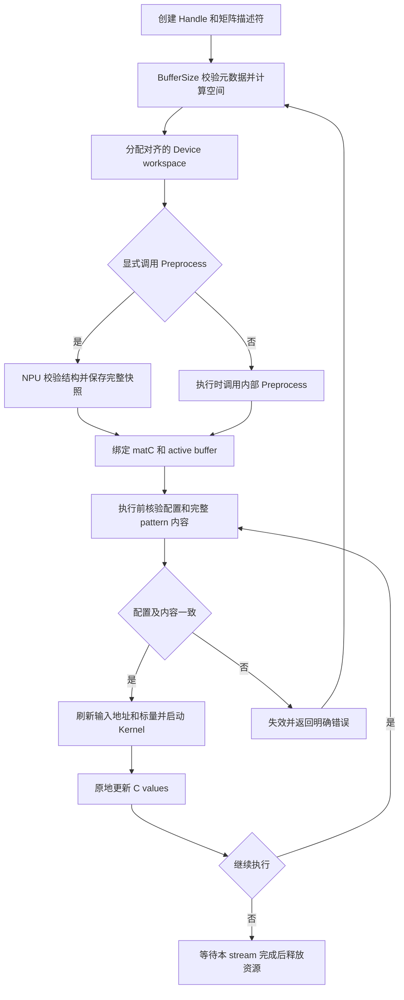
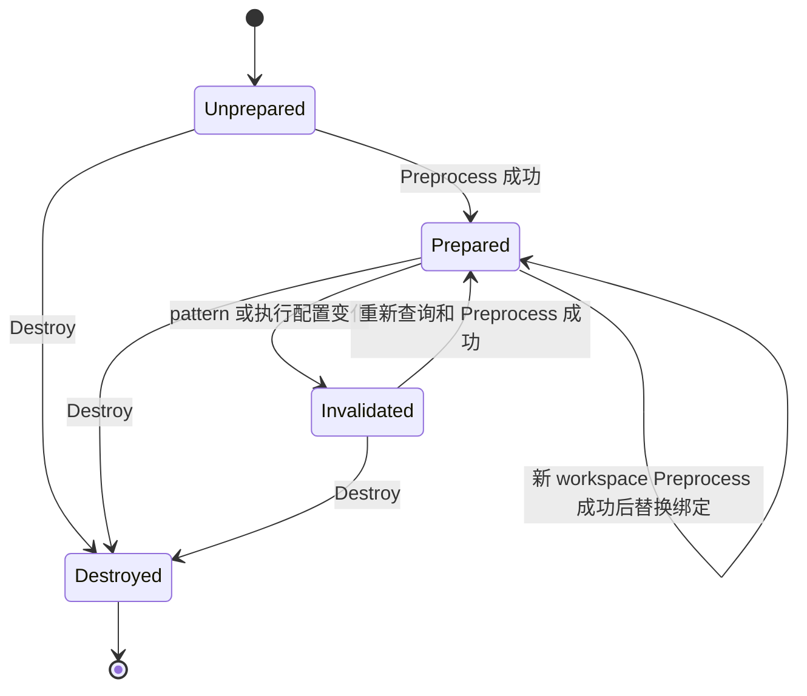
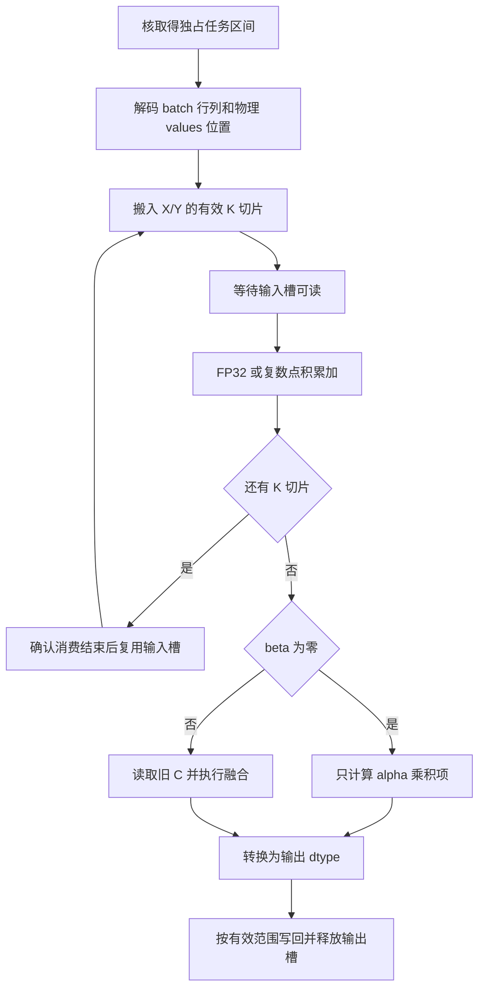
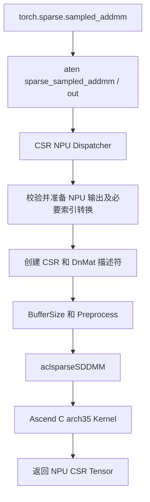

# aclsparseSDDMM 算子设计文档（Ascend 950）

# 需求背景

## 需求来源

本设计对应 9 月社区任务《aclsparseSDDMM 算子开发任务书（A5）》，目标为 Ascend 950PR（DAV_3510，`arch35`）。设计文档提交到 `cann-ops-competitions` 本任务目录，后续公开接口、Host、Ascend C Kernel、Python/ATen 适配及测试统一交付到 `ops-sparse` 的 `master` 分支。

本次交付仅包含设计文档。下文中的功能、精度、性能、内存和兼容性验证均为实现后的验收计划，未进行算子实验，不声明已达到验收目标。文档结构参考社区设计模板，接口和必选能力以任务书为准。

## 背景介绍

### 算子功能和应用

SDDMM（Sampled Dense-Dense Matrix Multiplication）根据稀疏矩阵的结构采样稠密矩阵乘积。它用于稀疏注意力、图边特征计算等场景，避免生成完整的 `M×N` 稠密结果。

```text
C_out = (alpha * op(X) * op(Y) + beta * C_in) ∘ spy(C)
op(X): [M,K]    op(Y): [K,N]    C: [M,N]
```

`spy(C)` 表示存储结构，不能通过 `C.values != 0` 推断。已存储且数值为零的 CSR 元素仍须计算；BSR 已存储块中的所有元素均须计算。C++ 执行接口原地更新 `C.values`，不改变 offsets、indices、索引基准、布局或描述符 shape。

### 现有实现分析

核验 `ops-sparse` 的 `include/cann_ops_sparse.h`、`sparse/common/aclsparse_descr_internal.h` 和 `sparse/sddmm/arch35/` 后，可复用 Handle/stream、DnMat/SpMat、不透明描述符、三阶段接口、向量归约和 workspace 布局框架。现有能力与目标的差距如下。

| 项目 | 当前基线 | 本任务设计 |
| --- | --- | --- |
| 稀疏格式 | CSR | CSR、方块 BSR |
| dtype | CSR FP16/FP32 路径 | 补齐声明的混合精度、complex64、BSR BF16 |
| 索引 | I32、base 0 | I32、base 0/1 |
| 稠密输入 | N/T、ROW/COL 框架 | 覆盖全部声明组合及合法 ld |
| 描述符 | 无本任务的 BSR 创建和 batch 字段 | BSR mutable/const 创建、DnMat/BSR strided batch |
| 算法 | `ACL_SPARSE_SDDMM_ALG_DEFAULT` | 保留该公开枚举，内部选取实现路径 |
| 预处理 | Host 回读 row offsets 后进行行分箱 | NPU 校验与任务规划，状态独立绑定 matC |
| 缓存 | 全局 map，以 buffer 为 key，仅记录 rows/nnz/k | 描述符私有状态、完整 pattern 快照和内容比较 |
| 框架入口 | 缺少任务要求的全链路适配 | CSR `sampled_addmm` NPU 注册及输出构造 |

保留 `sparse/sddmm/arch22/` 的硬件分支。公共校验和描述符扩展放到共享层，A5 的资源规划和 Kernel 放到 `arch35`，不重复新增同名或同功能接口。

# 需求分析

## 需求描述

在 NPU 上完成固定稀疏结构的采样矩阵乘法及 values 更新。公开三阶段接口与任务书参数序列一致；支持动态尺寸、空行、长尾分布、零 nnz、BSR 块内布局、batch 广播、复数标量及调用方 stream。核心计算和索引处理不采用 CPU fallback。

Python 入口为 `torch.sparse.sampled_addmm`，映射到 `aten::sparse_sampled_addmm`，适配 functional 和 `.out` 两个 schema。BSR 由任务规定的 aclsparse C++ 描述符接口表达，不把 BSR 宣称为该 PyTorch CSR 接口原生接受的格式。

## 需求拆解

| 子需求 | 设计落点 |
| --- | --- |
| 三阶段 ABI | 共享参数校验、精确 BufferSize、显式/内部 Preprocess、执行调度 |
| 格式和索引 | CSR/BSR 逻辑坐标映射，I32，base 0/1，支持未排序列索引 |
| 数值能力 | FP32、complex64、FP16 混合精度、BSR BF16 混合精度 |
| 布局和转置 | 统一稠密地址函数，ROW/COL 与 N/T 分别解析 |
| 描述符扩展 | BSR 大小和 order，batch 数量及各数组元素跨度 |
| 缓存和并发 | matC 私有 prepared state，设备完整快照，不依赖全局 map |
| 框架适配 | NPU Dispatcher、索引适配、标量转换、输出/alias 校验、stream 生命周期 |
| 资源控制 | 不物化稠密乘积，checked arithmetic，workspace 上限和唯一 writer |
| 后续验收 | C++/ATen/Python UT、单标杆精度、性能/内存及 Dispatch/Profiler 证据 |

# 详细设计

## 算子分析

### 数学公式

对 CSR 存储位置 `p`，令 `i` 为所属逻辑行，`j = colInd[p] - base`：

```text
s(i,j) = sum(Xop[i,k] * Yop[k,j], k=0..K-1)
C_out.values[p] = alpha * s(i,j) + beta * C_in.values[p]
```

同一行的列索引可以未排序。若出现重复存储位置，各 values 按其原始存储位置独立计算和更新，不合并、不重排用户数组；框架入口仍遵守目标 PyTorch 的稀疏 Tensor 合法性规则。

对 BSR 非零块 `p`，设所属块行为 `br`，`bc = blockColInd[p] - base`，块大小为 `b`：

```text
i = br*b + ri     j = bc*b + cj     0 <= ri,cj < b
ROW: valuesOffset = p*b*b + ri*b + cj
COL: valuesOffset = p*b*b + cj*b + ri
```

每个已存储块的 `b²` 个元素均按 CSR 中的点积公式计算。BSR 逻辑矩阵大小为 `M=blockRows*b`、`N=blockCols*b`，不引入部分边缘块的额外语义。

`K=0` 时点积为零。`beta=0` 时不读取旧 C values，直接计算乘积项，避免未初始化值或 NaN 经 `0*C` 污染输出。`alpha=0` 时仅执行合法稀疏位置的缩放；`alpha=beta=0` 时写零。标量短路仍执行必要的元数据和结构校验。

### 支持数据类型

| 格式 | X/Y dtype | C values dtype | computeType / alpha、beta 类型 | 累加 |
| --- | --- | --- | --- | --- |
| CSR/BSR | FP32 | FP32 | FP32 | FP32 |
| CSR/BSR | complex64 | complex64 | complex64 | 实/虚部 FP32 |
| CSR/BSR | FP16 | FP32 | FP32 | FP32 |
| CSR/BSR | FP16 | FP16 | FP32 | FP32，写回时一次舍入 |
| BSR | BF16 | FP32 | FP32 | FP32 |
| BSR | BF16 | BF16 | FP32 | FP32，写回时一次舍入 |

X/Y 类型相同。CSR BF16、FP64、complex128、混用 X/Y dtype 及表外 computeType 返回 `ACL_SPARSE_STATUS_NOT_SUPPORTED`。complex64 采用交错实虚部存储，按 ACL 对应复数表示解析，不把复数指针当作实数标量读取。

### 支持形状、布局和批处理

`M/N/K/nnz` 为动态参数，不固定在性能锚点规模。CSR 的 offsets 长度为 `M+1`，columns/values 长度为 `nnz`；BSR offsets 长度为 `blockRows+1`，columns 长度为 `blockNnz`，values 长度为 `blockNnz*b²`。

| 属性 | 支持范围 |
| --- | --- |
| opX/opY | NON_TRANSPOSE、TRANSPOSE，共四种组合 |
| DnMat order | X/Y 各自 ROW 或 COL，共四种组合 |
| 稀疏索引 | offsets 和 columns 均 I32；base 0/1 |
| BSR 方块 | b = 2、4、8、16、32、64、128 |
| BSR order | 块内 ROW/COL，独立于 X/Y 的 order |
| batch | BSR 及 DnMat strided batch；数量 1..65535 |

物理矩阵 `(rows,cols,ld)` 的地址函数为：

```text
ROW: addr(r,c) = r*ld + c,  ld >= max(1,cols)
COL: addr(r,c) = c*ld + r,  ld >= max(1,rows)
Xop(i,k): N -> addrX(i,k), T -> addrX(k,i)
Yop(k,j): N -> addrY(k,j), T -> addrY(j,k)
```

非空矩阵的实际存储 span 为 ROW 的 `(rows-1)*ld+cols` 或 COL 的 `(cols-1)*ld+rows`，零元素矩阵 span 为零。所有乘加先用 checked arithmetic 校验。TRANSPOSE 只交换坐标，不对复数共轭；CONJUGATE_TRANSPOSE 返回 NOT_SUPPORTED。

BSR 的输出 batch 数为 `B`，X/Y batch 数分别只能是 `1` 或 `B`。输入数量为 1 时复用该输入；否则第 `t` 个 batch 使用 `t*batchStride`。由此覆盖 `(X,Y,C_t)`、`(X_t,Y,C_t)`、`(X,Y_t,C_t)` 和 `(X_t,Y_t,C_t)` 四类组合。

跨度单位均为元素，非字节。数量为 1 时允许 stride 为零。BSR 多 batch 的 offsets/columns/values 跨度须分别覆盖其完整数组，不允许输出 values batch 重叠。不同 batch 可以有不同合法 pattern；各 batch 的 nnz/blockNnz 由描述符统一规定。CSR C++ 本任务采用单矩阵语义，不额外新增任务未规定的 CSR batch setter；Python 对合法 batched CSR 逐 batch 提交 NPU 调用，复用数量为 1 的稠密输入。

## 算子实现

### 公开接口原型

以下原型沿用任务书与已有公开命名，不以 ACLNN Tensor 接口替代 aclsparse 描述符接口。

```c
aclsparseStatus_t aclsparseSDDMMBufferSize(
    aclsparseHandle_t handle, aclsparseOperation_t opX, aclsparseOperation_t opY,
    const void *alpha, aclsparseConstDnMatDescr_t matX,
    aclsparseConstDnMatDescr_t matY, const void *beta,
    aclsparseSpMatDescr_t matC, aclDataType computeType,
    aclsparseSDDMMAlg_t alg, size_t *size);

aclsparseStatus_t aclsparseSDDMMPreprocess(
    aclsparseHandle_t handle, aclsparseOperation_t opX, aclsparseOperation_t opY,
    const void *alpha, aclsparseConstDnMatDescr_t matX,
    aclsparseConstDnMatDescr_t matY, const void *beta,
    aclsparseSpMatDescr_t matC, aclDataType computeType,
    aclsparseSDDMMAlg_t alg, void *buffer);

aclsparseStatus_t aclsparseSDDMM(
    aclsparseHandle_t handle, aclsparseOperation_t opX, aclsparseOperation_t opY,
    const void *alpha, aclsparseConstDnMatDescr_t matX,
    aclsparseConstDnMatDescr_t matY, const void *beta,
    aclsparseSpMatDescr_t matC, aclDataType computeType,
    aclsparseSDDMMAlg_t alg, void *buffer);

aclsparseStatus_t aclsparseCreateBsr(
    aclsparseSpMatDescr_t *spMatDescr, int64_t blockRows,
    int64_t blockCols, int64_t blockNnz, int64_t rowBlockSize,
    int64_t colBlockSize, void *bsrRowOffsets, void *bsrColInd,
    void *bsrValues, aclsparseIndexType_t bsrRowOffsetsType,
    aclsparseIndexType_t bsrColIndType, aclsparseIndexBase_t idxBase,
    aclDataType valueType, aclsparseOrder_t order);

aclsparseStatus_t aclsparseCreateConstBsr(
    aclsparseConstSpMatDescr_t *spMatDescr, int64_t blockRows,
    int64_t blockCols, int64_t blockNnz, int64_t rowBlockSize,
    int64_t colBlockSize, const void *bsrRowOffsets,
    const void *bsrColInd, const void *bsrValues,
    aclsparseIndexType_t bsrRowOffsetsType,
    aclsparseIndexType_t bsrColIndType, aclsparseIndexBase_t idxBase,
    aclDataType valueType, aclsparseOrder_t order);

aclsparseStatus_t aclsparseDnMatGetStridedBatch(
    aclsparseConstDnMatDescr_t dnMatDescr, int *batchCount,
    int64_t *batchStride);

aclsparseStatus_t aclsparseDnMatSetStridedBatch(
    aclsparseDnMatDescr_t dnMatDescr, int batchCount,
    int64_t batchStride);

aclsparseStatus_t aclsparseBsrSetStridedBatch(
    aclsparseSpMatDescr_t spMatDescr, int batchCount,
    int64_t offsetsBatchStride, int64_t columnsBatchStride,
    int64_t valuesBatchStride);
```

| 参数组 | 方向、位置和约束 |
| --- | --- |
| handle | Host 输入，提供有效上下文、pointer mode 和调用方 stream |
| opX/opY、computeType、alg | Host 属性，按支持矩阵校验；公开算法仅 DEFAULT |
| alpha/beta | computeType 标量；位置由 Handle 的 HOST/DEVICE pointer mode 决定 |
| matX/matY | Host 只读描述符，引用 Device 只读稠密数组，op 后形状须匹配 |
| matC | Host 输入输出描述符，Device offsets/columns 只读，values 原地更新 |
| size | Host 输出指针；查询成功返回本次所有阶段足量的 workspace 字节数 |
| buffer | 调用方 Device workspace，连续、64 B 对齐，容量至少为查询值 |
| spMatDescr | 创建输出指针；失败时不留下部分初始化对象 |
| blockRows/blockCols/blockNnz | 非负 int64；逻辑尺寸和数组字节数不得溢出 |
| rowBlockSize/colBlockSize | 相等且属于声明的方块大小集合 |
| bsrRowOffsets/bsrColInd | Device 数组、I32；长度和范围按 BSR 结构规定 |
| bsrValues、valueType、order | Device values 及 Host 属性；const 创建不允许作为可写 matC 使用 |
| bsrRowOffsetsType/bsrColIndType、idxBase | I32/I32；base 0/1 同步编码 |
| dnMatDescr、batchCount、batchStride | 有效描述符；Get 的两个输出指针非空；Set 按 span 校验 |
| offsets/columns/valuesBatchStride | 非负元素跨度，多 batch 时分别覆盖完整数组 |

描述符不能可靠检查调用方裸指针对应分配的真实数组长度，标量指针也不携带 dtype 标签；接口校验声明的元数据和结构内容，实际容量与标量编码由调用方保证，框架入口通过 Tensor 元数据补充验证。

### 总体调用流程



BufferSize 为纯 Host 元数据查询，不回读 Device offsets，也不读取 Device 标量。显式 Preprocess 为推荐路径；未预处理或传入非 active workspace 的执行走同一内部 Preprocess 冷路径，保证不读取未知 workspace 内容。非 active workspace 不覆盖原 active 绑定，可在本次调用建立临时计划后执行。

### Host 侧设计

#### 参数校验与错误码

共享校验层检查 Handle、描述符类别、空指针、format、dtype、op、order、shape、ld、batch 数、stride、算法、字节跨度、workspace 对齐和资源上限。校验失败不得修改 values，也不得覆盖已有有效 prepared state。

NPU 结构校验检查每个 batch 的 offsets 单调性、首尾端点和所有 columns 范围。base 0 的首尾为 `0/nnz` 或 `0/blockNnz`，base 1 为 `1/nnz+1` 或 `1/blockNnz+1`。比较、归一化和范围运算先提升为足量整数宽度，再参与地址计算。

| 情况 | 返回值 |
| --- | --- |
| 成功或合法零工作量 | SUCCESS |
| 空 Handle | HANDLE_IS_NULLPTR |
| 非法 shape/ld/stride、必要空指针、错类别、未对齐 workspace、pattern 非法或已失效 | INVALID_VALUE |
| 不支持的 format | MATRIX_TYPE_NOT_SUPPORTED |
| 表外 dtype/index/op/algorithm | NOT_SUPPORTED |
| 非目标硬件调度 | ARCH_MISMATCH |
| 无法容纳片上资源或 workspace 超过设计上限 | INSUFFICIENT_RESOURCES |
| 描述符/内部 Host 小对象申请失败 | ALLOC_FAILED |
| 搬运、事件或 Kernel launch 失败 | EXECUTION_FAILED |
| 库内部不变量破坏 | INTERNAL_ERROR |

枚举名称均带已有 `ACL_SPARSE_STATUS_` 前缀，不创造额外公开错误码。对结构错误给出首个错误 batch/索引位置日志，不打印输入 Tensor 全量内容。BufferSize 的 `size` 非空时先置零，失败不输出部分计算值。

#### 描述符和缓存生命周期

在 `aclsparseSpMatDescr` 内新增 SDDMM 私有状态，独立于其他算子的 `activeBuffer` 使用。该状态记录设备/上下文、format、shape、nnz、base、index/value dtype、BSR 块大小/order、batch 信息、op/computeType/alg、稠密输入的 shape/layout/ld/stride、pattern 指针、workspace 地址/字节布局和准备完成事件。

Device workspace 保存每个 C batch 的 offsets、columns 完整快照，以及分核边界。快照不保存 C values。每次复用前，NPU 逐元素比较全部索引与快照，不仅比较哈希或指针，从而识别尺寸相同、指针相同但内容不同的 pattern；不同 batch 不能共用未验证的快照。

| 变化 | 处理 |
| --- | --- |
| alpha/beta、X/Y values 地址或数据、C values 地址或数据变化 | 保持计划；刷新本次输入和标量 |
| 稀疏索引指针、内容、shape、base、块信息或 batch 配置变化 | 清除该 matC 的 prepared state，重新查询并 Preprocess |
| X/Y 的 shape/layout/ld/stride、op、computeType 或算法变化 | 原计划失效，重新查询和 Preprocess |
| Preprocess 指定新 workspace | 成功后原 workspace 变 inactive，新 workspace 成 active |
| Descriptor setter 改变结构相关字段 | 立即失效；随后不能复用旧计划 |
| Destroy matC | 释放内部 Host 状态/事件，不释放调用方数组或 workspace |



不同 matC 和独立 workspace 无共享 mutable cache，可安全并发。相同 matC 的 Preprocess、执行、setter 和销毁由调用方串行；输入结构只读期间允许共享，输出 values 重叠的不同描述符仍必须串行。跨 stream 复用时由准备事件建立依赖；调用方外部写入索引须先完成同 stream 排序或建立事件依赖，禁止与计算竞态。

#### 同步合同

结构数组位于 Device，执行 ABI 却要求同步返回明确的结构错误码，且调用方可以原地址改写裸索引。因此，完全识别内容变化、准确同步报错和完全无 Host 等待不能同时靠指针缓存获得。

本设计选择准确错误码：Preprocess 完成结构校验后，将固定大小状态字异步回读至可异步搬运的 Host 内存，并只等待该调用 stream 的校验完成事件；执行复用时同样在完整内容比较之后回读状态。发现变化返回 INVALID_VALUE，清除计划，不启动计算；由调用方重新 Preprocess。该必要校验等待不等于等待计算完成，计算 Kernel 提交后仍异步返回。

禁止全设备同步、每轮回读全部索引、为了读 Device alpha/beta 而同步，以及等待计算输出。完整比较 Kernel、状态搬运和必要等待必须保留在性能采集的对应调用范围内，不以“缓存检查”名义剔除。这一严格合同存在小规模延迟风险，后续需以实测判断性能目标；不能通过漏检同地址修改来换取性能。

#### workspace 精确规划

采用 64 B 对齐的共享布局函数，BufferSize、Preprocess 和执行均使用该函数。令 `A(x)=ceil(x/64)*64`；`R=M,Q=nnz` 表示 CSR，`R=blockRows,Q=blockNnz` 表示 BSR；B 为 C 的 batch 数。

```text
W = A(H) + A(T) + B * (A(4*(R+1)) + A(4*Q))
    + A(8*(P+1)) + A(S) + Wcube
Wcube = 0                         # 向量路径
Wcube = A(4*Pcube*b*b)             # BSR Cube 分块结果槽
```

`H` 为包含资源/状态信息的内部 POD header 字节数，`T` 为当前路径 TilingData 字节数，`S` 为每个校验核固定大小状态槽总字节数，P 为计算核数。H/T/S 使用共享结构的 `sizeof` 与实际核数求值，偏移和 padding 均计入查询值。查询不依赖 alpha/beta 数值，以支持后续标量改变而无须增加空间。

| 区域 | 内容和使用方式 |
| --- | --- |
| header / tiling | 当前调用参数、尺寸、地址、片上切分和校验状态 |
| pattern snapshots | 每 batch 的完整 I32 offsets/columns；只在成功 Preprocess 后有效 |
| core boundaries | P+1 个 64 位逻辑工作边界，按存储工作量切分 |
| validation slots | 各校验核独立写状态，随后按固定顺序归并 |
| Cube slots | 每 AIC 独占一个 FP32 b×b 结果槽；处理当前块后复用 |

核心库不另行申请隐藏的大块 Device 内存；prepared state 持有调用方 workspace 的非 owning 引用。workspace 最大允许量为目标设备权威平台信息提供的 L2 容量，不硬编码子型号容量。超过上限返回 INSUFFICIENT_RESOURCES；无法取得权威容量时，不声称通过该内存验收分支。

合法零 nnz 仍保留最小 header、校验区和 offsets 快照，BufferSize 返回非零；buffer 必须非空。columns/values 长度为零时允许空指针，offsets 数组仍须有效并按 base 编码。空 X/Y 只在其逻辑 span 为零时允许空数据指针。

执行 ABI 无实际 buffer size 参数，不能可靠检查欠配。只校验必要空指针、对齐和状态归属；调用方按精确查询值分配。不得读取查询边界外的字节来猜测容量。workspace、C values、X/Y 和结构数组不得出现不允许的重叠。

#### 分核及 TilingData

从平台接口取得实际 AIV/AIC 核数及 UB/L1/L0 容量，不能使用固定核数回退伪装为目标硬件适配。零工作量不启动计算；其他场景核数取可用核数与有效任务数的较小值。

CSR 按存储位置 p 切分，而不是将一整行固定交给一个核。每核处理连续 p 区间，可拆分超长行；根据 offsets 查找起始所属行并顺序推进，跳过空行。相同 K/dtype 的每个存储位置工作量近似相同，避免长尾行导致负载失衡。设备校验核按数组区间分割全部索引。

BSR 向量路径按物理 values 区间切分，解码为块 p 及 ri/cj；Cube 路径以整块为任务，每 AIC 循环取得其固定分配的块编号。b=128 的块在单核内进一步划为合法矩阵子 tile，不把整个 K 或多个大块塞入片上缓冲。

TilingData 记录：路径、dtype、M/N/K、nnz/blockNnz、base、b/order、batchCount/strides、X/Y 的 ld/op/order、元素字节数、P、核心边界、kTile/valueTile、workspace 各偏移、输入/输出地址和 scalar mode。计数、工作编号和 GM 地址跨度用 64 位表示，局部长度只在范围检查后转换为 API 所需类型。

### Kernel 侧设计

#### 路径选择

| 场景 | 核心执行方案 |
| --- | --- |
| CSR，所有声明 dtype | AIV 向量分块点积，复用同一行 X tile，FP32 归约 |
| BSR，FP32 / complex64 | AIV 块内点积，不将 FP32 静默降为 FP16/TF32 |
| BSR，FP16/BF16，b=2/4/8 | AIV，避免小块 Cube padding 和启动开销 |
| BSR，FP16/BF16，b>=16 | A5 tensor_api Cube 分块乘法，FP32 块结果及向量 epilogue |
| alpha=0、K=0 等 | 同 stream 的缩放/清零分支，保持结构与异常校验 |

向量实现完整覆盖必选功能。Cube 路径是 BSR 低精度大块的性能实现，必须在相同支持矩阵上完成精度/布局/尾块验证；不能把未验证路径列为已可用能力。内部路径由元数据决定，公开 alg 仍为 DEFAULT，不增加无依据的算法枚举。

#### CSR 和 BSR 向量计算

每次载入若干存储位置，获得其逻辑坐标，通过统一地址函数读取 X/Y 的 K 切片。归约维连续时采用有效长度搬运；有 stride 时用分段搬运及局部 gather，不能通过读取越过矩阵尾部的整个对齐块实现 gather。

FP16/BF16 输入先转 FP32，点积和 alpha/beta 融合在 FP32 完成；FP32 输入保持 FP32。K 沿递增方向分 chunk，chunk 内固定归约树，chunk 间按固定顺序累加。单个输出的归约由一个核持有，不采用全局 AtomicAdd，不拆 K 到多个无序写者。

complex64 用实数向量展开：

```text
dotReal = sum(xReal*yReal - xImag*yImag)
dotImag = sum(xReal*yImag + xImag*yReal)
outReal = alphaReal*dotReal - alphaImag*dotImag
          + betaReal*cReal - betaImag*cImag
outImag = alphaReal*dotImag + alphaImag*dotReal
          + betaReal*cImag + betaImag*cReal
```

普通 TRANSPOSE 不取共轭。复数 alpha/beta 的短路由两个分量共同判断；`beta=0` 时两个旧值分量均不读取。实虚部拆分、乘积、归约和复数写回都在 NPU 完成。

#### 片上缓冲规划

设 q 为本次输出元素数、kc 为 K 切片有效长度、d 为输入元素字节数。以下按 q 个不同坐标分别持有 X/Y 切片计算保守预算，每个子 buffer 还须按实际 API 对齐；临时区大小按当前 SDK 提供的归约/gather 需求计算，不写成零。

```text
Ureal = 4*q*kc*d + 2*q*kc*4 + q*kc*4 + q*8 + Utmp
Ucplx = 4*q*kc*8 + 4*q*kc*4 + 2*q*kc*4 + q*16 + Utmp
```

第一项为 X/Y 输入双缓冲，随后为 FP32 转换/实虚拆分、乘积归约及旧值/输出。`Utmp` 包含 indices、gather offsets、归约 scratch、对齐 padding 和控制需要的空间。连续位置确实属于同一行时，可将 q 份 X 切片合并为一份并扩大 q；跨行位置不能沿用这一较小预算。

Host 从候选 kc/q 中选取总申请量不超过实际 UB 的最大合法组合；K 较小时完整载入，K 较大时流式切片。输入消费完成后才可复用槽；乘积临时区在归约后可复用为类型转换/写回区。只有实际生命周期不重叠时才复用缓冲，不以减少申请数为由制造覆盖。

#### BSR Cube 与 epilogue

每个非零块只计算 `X[br*b:(br+1)*b,:] × Y[:,bc*b:(bc+1)*b]`。使用 A5 tensor_api 的矩阵乘基础设施处理块内乘法、输入转置和合法片上 tile；不套用 A2/A3 的 MatmulImpl/MatmulApiTiling。

核验的 Blaze 基础矩阵乘 Block 为 AIC 计算并输出 GM，不能假设它自带 SDDMM 的 beta*C 或 L0C→UB epilogue。因此采用明确的有界桥接：每 AIC 写独占的 FP32 b×b workspace 槽，将完整当前块结果发布给对应 AIV epilogue；AIV 读取旧 values、计算 alpha/beta、按 BSR ROW/COL 写回后释放槽，AIC 收到释放后处理下一块。只驻留当前块，不缓存全部非零块结果。

L1 预算按双缓冲 `2*(mt*kt+nt*kt)*d` 加实际 packing/scratch 计算，L0A/L0B/L0C 分别按当前硬件 base tile 与累加类型预算。硬件 base tile 满足所选基础指令约束，逻辑 tail 单独传入，不能直接用小 tail 替换非法 base。K tail 只在片上填零，不能从 GM 读取无效 K 元素。

自定义 BSR 块调度和 CV 发布/释放属于新增集成，不宣称 Blaze 的稠密调度器原生理解 BSR。实现前须从目标 SDK 和源码确认 task ratio、block/subblock 映射、信号初始化与退出 drain；两端按逻辑块编号建立唯一 owner，不按物理核编号猜测对应关系。该集成失败时仍有向量正确性路径，但大块性能验收必须继续完成，不能据此省略性能目标。

#### 并行写回与同步

各输出存储位置只有一个 writer。分核边界按输出 dtype 对应的 64 B 元素粒度安排，相邻不满对齐块不分给不同核；BSR 小块按若干完整物理块分组。最后不足 64 B 的尾段使用有效长度/掩码写回，不通过越界读改写邻接输出实现对齐。



搬运生产者完成后消费者才读；计算消费结束后才覆盖 ping/pong 槽；写回完成后才复用输出槽，退出时 drain 最后一轮。单独 Kernel 之间依赖 stream 顺序；Cube/AIV 的块结果用目标 A5 支持的发布/等待/释放协议，避免混用不同架构的信号假设。

HOST pointer mode 把标量值复制到本次调用的参数存储，再按 stream 顺序传输，返回后不依赖调用方 Host 标量继续存活。DEVICE mode 由 Kernel 读取标量，buffer query/preprocess 不解引用该地址；调用方保证 Device 标量在完成前有效。

### Python/ATen 适配

通过目标 torch_npu 提供的稀疏 CSR NPU Dispatcher 机制注册 `sparse_sampled_addmm` 和 `sparse_sampled_addmm.out`，以目标 ATen schema 和实际 dispatch key 为准，不将整个 PrivateUse1 后端替换为通用 fallback。

1. 校验 self 为 CSR、mat1/mat2 为 strided 稠密 Tensor，所有 Tensor 位于同一 NPU，shape、dtype、stride、alpha/beta、out 属性满足目标框架语义。transpose view 能直接表达为 order/op/ld 时零拷贝；其他合法非连续视图在 NPU 上物化，计入端到端成本。
2. 对 I32 CSR 直接创建描述符。框架允许的 I64 索引先在 NPU 校验能否表示为 I32，再在 NPU 转换；拒绝溢出，不直接截断或将索引搬到 CPU。输出索引 dtype 按框架接口保持。
3. functional 返回独立 values 的新 CSR Tensor，复制输入结构并保持输入 values 不变。内部 C++ 原地更新的是新输出 values；`beta=0` 无须复制旧 values。
4. `.out` 校验合法输出类型、device、shape 和存储重叠；合法别名按目标框架规则处理，必要时创建 NPU 临时 values 后回写。不能仅凭 C++ in-place ABI 自动声明 ATen 可任意别名。
5. 合法 batched CSR 将各 batch 映射为单 CSR 描述符调用；不默许未被目标 PyTorch 接受的额外广播规则。BSR 的四类广播由 C++ BSR 描述符链路单独测试。
6. 用框架当前 NPU stream 构造 Handle。workspace、NPU 索引转换和临时 values 的 allocator 生命周期覆盖异步 Kernel，通过框架 stream 记录或事件延期回收，不能在 Host launch 返回时立即释放。
7. status 映射为可读框架异常；设备运行错误在框架 stream 完成时正常传播。注册失败或缺少能力必须明确报错，不调用 `.cpu()`、NumPy 或 CPU 算子代替计算。



框架适配的可选构建目标与核心库解耦，核心 aclsparse 默认构建不引入 PyTorch 依赖。采用仓库既有 CMake/test 接入方式；UT 实际目录沿用 `test/sddmm/sddmm/arch35/`，不因任务书简写而重复建立另一套同名测试。

## 支持硬件

| 硬件 | 架构目录 | 本任务 |
| --- | --- | --- |
| Ascend 950PR | DAV_3510 / arch35 | 支持并作为后续验收平台 |
| A2/A3 | arch22 | 保留既有分支，公共变化须交叉回归 |

## 算子约束限制

- `M/N/K` 的逻辑范围为非负且不超过 INT32_MAX；CSR 的 `nnz+base <= INT32_MAX`，并要求 `nnz>0` 时 M/N 均非零。BSR 的 blockRows/blockCols/blockNnz 及编码索引满足 I32 可表示范围，同时逻辑 M/N 满足上述范围。
- `blockNnz*b²` 可以超过 I32 元素数，使用 64 位工作编号；所有数组 span、batch 最后一项、乘法/加法及 64 B 向上对齐须同时在 INT64_MAX 和 SIZE_MAX 内可表示，超界返回 INVALID_VALUE。
- 总 workspace 还受实际 L2 容量与可分配 Device 内存约束；边界尺寸不表示一定可实际分配。BufferSize/Preprocess 使用同一资源判定，不能查询成功后才发现布局公式不同。
- 索引数组长度、数据指针容量、workspace 实际容量及生命周期由调用方保证；API 不承诺探测悬空指针、任意坏地址或 workspace 欠配。
- X/Y、C offsets/columns 只读；输出 values、workspace 与输入只读数组不得不合法重叠。相同输出内存不得被并发更新。
- pattern 变化须重新 Preprocess；检测到同地址内容变化也必须失效。workspace 内容在预处理后不得被调用方改写。
- 不支持表外 dtype/index、非方块 BSR、部分边缘块、共轭转置或未公开算法。无 CPU fallback；不生成完整稠密结果。
- DEFAULT 的每个输出采用固定归约顺序和唯一 writer，目标为相同设备/程序/配置下 bit-wise 重复。重复试验须恢复相同输入 C values，不能把连续 in-place 更新产生的变化误判为不确定性。

# 可维可测分析

## 精度标准 / 性能标准

以下条目为后续计划，不属于本次已执行结果。

| 验收项 | 标准 | 来源 |
| --- | --- | --- |
| CPU Golden | FP16/BF16 输入 FP32 计算；FP32 输入 FP64；complex64 输入 complex128；从实际编码输入计算，最后按输出 dtype 验收 | 任务书 3.2 |
| 混合容差 | 每元素 `abs(actual-golden) <= atol+rtol*abs(golden)`，匹配率 >=0.99，并逐元素满足 `max(A,32*ULP(golden))` 硬上限 | 任务书及生态精度标准 |
| FP16 | rtol=atol=2^-9，A=1e-1 | 任务书 3.2 |
| BF16 | rtol=atol=2^-6，A=1 | 任务书 3.2 |
| FP32 / complex64 | rtol=2^-10，atol=2^-16，A=1e-2；复数实虚部分别通过 | 任务书 3.2 |
| 性能 | 所有声明 dtype 的 GPU 对应调用耗时 / NPU 同范围总耗时 >=0.3 | 任务书 3.3 |
| 内存 | 按任务书等价调用的额外内存规则，或固有 workspace 不超过目标 L2 | 任务书 3.4 |
| 执行设备 | 提供 NPU Dispatch/Profiler 证据，核心计算无 CPU fallback | 任务书 3.5 |

混合精度 case 的误差参数按 C values 输出类型选取，Golden 累加精度按输入类型选取。INF/NAN 的匹配按生态标准对应规则处理，复数分别检查实虚部；不能把非有限值一律忽略。alpha/beta、beta=0 不读旧 C、K=0 及舍入顺序须在 Golden 中与接口合同一致。

### 功能、异常及生命周期用例计划

| 类别 | 必测内容 |
| --- | --- |
| 形状和 pattern | 方/长/宽、空行、长尾、未排序列、零 nnz、nnz=1、同 shape 不同 pattern |
| 格式/dtype | 支持矩阵全部组合，CSR/BSR、base 0/1、BSR b=2..128 和 ROW/COL |
| 稠密属性 | X/Y ROW/COL、N/T、padding ld、有效非连续视图、K 尾段、跨 tile |
| batch | 四类 BSR 广播、不同 batch pattern、数量/跨度边界、广播输入只读 |
| 数值和标量 | 普通/小/零/正负/离群值、允许的 INF/NAN；复数 alpha/beta；HOST/DEVICE mode |
| 三阶段 | 精确大小、推荐路径、可选预处理冷路径、active/inactive buffer、数值刷新、新 buffer 替换 |
| 缓存失效 | 同地址改 offsets/columns、不同指针相同内容、相同 rows/nnz/k 不同 pattern、setter 变化和失败后状态 |
| 边界和错误 | 非法 dtype/op/order/index/alg、负/溢出 shape、坏端点、越界列、空/未对齐 buffer、非方块 BSR |
| 内存安全 | 只读输入快照、values/workspace 前后 canary、尾段写界、多 batch 间界、分配/释放循环 |
| 并发 | 独立 matC/workspace 多 stream；共享只读索引；同 matC 串行；跨 stream 事件依赖 |
| 框架 | functional/.out、input 不变、输出 dtype/device/结构、合法 alias、非法 overlap、NPU I64 索引转换 |
| 确定性 | 恢复同一 C_in 重复执行，向量/Cube 各路径 bit-wise 比较 |

C++ UT 覆盖公开 ABI、状态/返回码与 Kernel；ATen UT 和 Python 端到端 UT 覆盖 Dispatcher、输出构造及异常。用 NPU profiler 区分框架复制/转换、校验/预处理与核心计算，证明没有 CPU 计算回退。结构非法时断言 C values 不变。

任务包的 `test_cases/aclsparseSDDMM_testCase/` 为专项用例入口，共享生成/计时/比对放在 `test_cases/common/`，标杆数据位于 `test_cases/baseline_results/`。沿用固定随机种子和原始 case 参数：values 70% 均匀分布、20% 正态、10% 零/边界/允许特殊值，pattern 覆盖均匀、长尾和空块行。测试输入摘要包含 shape、dtype、全部索引、values、标量及属性；不将生成器不一致的两份输入混算。

### 性能与内存验证计划

| 锚点 | M×N | K | CSR pattern | BSR b |
| --- | --- | --- | --- | --- |
| P-01 | 8192×28672 | 128 | 每行 64 个存储位置 | 16 |
| P-02 | 4096×1536 | 128 | 每行 64 个存储位置 | 32 |
| P-03 | 7168×2048 | 128 | 每行 64 个存储位置 | 64 |

BSR 的块数量和分布使用任务包生成器的既定规则，不能直接把 CSR nnz 误当作 blockNnz。三类锚点不替换为更有利规模。每 case 预热至少 10 次、采样至少 30 次，报告 median/P90；正式采样复用描述符/workspace/预处理结果，排除首次编译、数据生成和无关初始化。

分别对齐稀疏库调用范围和 PyTorch GPU 调用范围，不将两套标杆的耗时横向混算。NPU 的对应阶段总耗时包括内容核验、状态搬运、所有计算和布局/epilogue Kernel；C++ 调用延迟和 Python/ATen 端到端延迟单独报告。按任务要求在每轮测试边界同步，库内部仍只进行正文规定的必要校验等待，不增加计时外的隐含工作。

内存采集包含索引快照、Cube 槽、输出构造、NPU I64→I32 转换和非连续 Tensor 临时区；核心 workspace 与框架额外内存分别记录。输入输出总量超过 500 MB 的等价 Torch 调用按任务规定的 50% 额外内存条件比对；不具备等价 GPU 调用范围的 case 使用固有 workspace/L2 条件，明确容量来源。

风险主要为随机 Y 读取、完整 pattern 校验等待、大块 BSR FP32/complex64 归约，以及 CV 集成开销。优化依次针对连续 K 访问、同一行/块输入复用、输出粒度均衡和块内 Cube 计算；不能以输入降精度、漏检 pattern、缩小 dtype 范围或排除额外 Kernel 计时规避验收。

## 兼容性分析

| 兼容范围 | 处理 |
| --- | --- |
| 已有三阶段 ABI | 保留原型、参数顺序及公开 DEFAULT；BSR/batch 使用任务规定扩展 |
| 描述符内部布局 | 不透明类型内部增加字段，默认初始化；Create/Destroy/Get/Set 同步覆盖 |
| 其他稀疏算子 | SDDMM 私有状态不挤占 SpMV/SpMM 状态，setter 的失效逻辑按所属算子处理 |
| A2/A3 与 A5 | 共享校验无 A5 Kernel 依赖；保留 arch22 路径；后合入分支处理公共冲突并交叉回归 |
| PyTorch / torch_npu | 按目标 framework schema、稀疏 dispatch key 和 stream/allocator 机制适配；不注册未经验证的通用 fallback |

实现阶段需闭合三项集成事实：A5 Cube/CV 的实际任务映射和信号协议、框架稀疏 NPU 注册/构建入口、目标设备 L2 容量来源。它们属于后续源码/平台集成与验证工作，不能由设计文档代替设备测试结论。

## 参考资料

- 本任务书：`aclsparseSDDMM_A5_task_doc.md`，以及随附的 `test_cases/`。
- [社区任务设计模板](https://gitcode.com/cann/cann-ops-competitions/blob/master/04_tasks/01_community-task-2026/resources/design_template.md) 与 [目录及提交流程](https://gitcode.com/cann/cann-ops-competitions/blob/master/04_tasks/01_community-task-2026/README.md)。
- [社区任务流程及注意事项](https://gitcode.com/org/cann/discussions/39)：设计文档先以 PR 评审，后续再开发及提交测试验收。
- [ops-sparse](https://gitcode.com/cann/ops-sparse)：公开头文件、描述符实现、`sparse/sddmm/arch35/` 与现有测试结构。
- [cuSPARSE SDDMM](https://docs.nvidia.com/cuda/cusparse/index.html#cusparsesddmm)：三阶段接口及 active buffer 语义；具体必选能力以任务书为准。
- [PyTorch ATen schema](https://github.com/pytorch/pytorch/blob/main/aten/src/ATen/native/native_functions.yaml) 与 [sampled_addmm 文档](https://pytorch.org/docs/stable/generated/torch.sparse.sampled_addmm.html)。
- [生态算子开源精度标准](https://gitcode.com/cann/opbase/blob/master/docs/zh/ops_precision_standard/experimental_standard.md)。
- [ops-tensor](https://gitcode.com/cann/ops-tensor)：`include/blaze/gemm/block/block_mmad_matmul_basic.h`，作为 A5 基础矩阵乘接口及限制的源码依据。
- [cannbot-skills](https://gitcode.com/cann/cannbot-skills)：`ascendc-tiling-design`、`npu-arch` 的分核、片上资源和平台路由检查方法。
