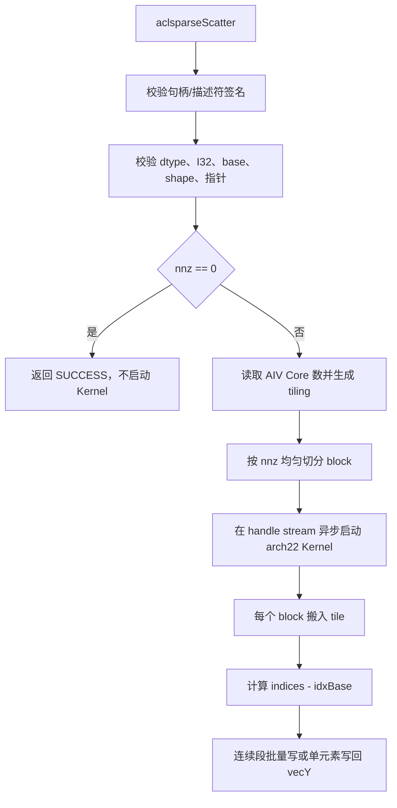

# aclsparseScatter 算子设计方案

## 需求背景（required）

### 需求来源

2026 年 9 月社区任务要求在 ops-sparse 中补齐面向 Atlas A2/A3（DAV-2201）的
`aclsparseScatter` 算子，并完成 C++ Host、Ascend C Kernel、公开接口、ATen/NPU
适配和自验用例。接口语义参考 cuSPARSE `cusparseScatter`：将稀疏向量的 values
按 indices 原地写入稠密向量。

### 背景介绍

给定稀疏向量 `vecX=(indices, values, size, nnz)` 和稠密向量 `vecY`，计算为：

```text
vecY[vecX.indices[i] - idxBase] = vecX.values[i],  i = 0 .. nnz - 1
```

算子是纯数据搬运，不进行加法、转换或归约。没有重复索引时每个输出地址只被写
一次，结果必须与 CPU Golden 逐位一致；有重复索引时多个设备线程竞争同一地址，
最终值来自某一次完成的写入，顺序不确定，遵循 cuSPARSE 的 last-write-wins 语义。

## 需求分析（required）

### 需求描述

1. 公开 C 接口保持 `aclsparseScatter(handle, vecX, vecY)`，不增加 workspace、
   preprocess 或 Host 同步。
2. DAV-2201 A2/A3 路径支持 `int8`、`float16`、`bfloat16`、`float32`、
   `complex64` 五种 value dtype，`vecX` 和 `vecY` dtype 必须一致。
3. indices 使用 I32，支持 index base 0 和 1；索引可以乱序和重复。
4. `nnz=0` 是成功的 no-op，不读取数据指针，不启动 Kernel。
5. `vecX.values`、`vecX.indices` 和 `vecY.values` 保持在 Device，调用方 stream
   上异步执行；算子不允许 CPU fallback。
6. 对无效 descriptor、shape、dtype、stream、alias 和不支持的 I64 组合返回明确的
   `aclsparseStatus_t`。

### 算子原型

```cpp
aclsparseStatus_t aclsparseScatter(
    aclsparseHandle_t handle,
    aclsparseConstSpVecDescr_t vecX,
    aclsparseDnVecDescr_t vecY);
```

| 参数     | 方向      | 约束                                                         |
| -------- | --------- | ------------------------------------------------------------ |
| `handle` | 输入      | 已创建并绑定有效 `aclrtStream` 的句柄                        |
| `vecX`   | 输入      | I32 indices；base 0/1；`size >= nnz >= 0`；value 为五种支持 dtype 之一 |
| `vecY`   | 输入/输出 | `nums == vecX.size`；dtype 与 `vecX` 一致；Device values 原地更新 |

尺寸和地址约束：`size`、`nums` 不超过 `INT32_MAX`，`nnz` 不超过 `UINT32_MAX`；
`nnz>0` 时三个数据指针都必须非空。Host 不读取 Device indices，因此越界值由调用方
保证为 `indices[i]-idxBase ∈ [0, vecY.nums)`；越界行为与 cuSPARSE 一致。

### 验收目标

- 精度：无重复索引时所有声明 dtype 逐位一致；重复索引时输出必须是该位置输入
  values 中的一个。
- 性能：P-01/P-02/P-03 词表规模用例达到 GPU 标杆的 0.25 倍以上；Kernel 不
  分配与输入规模线性相关的临时 Device 内存。
- 资源：异步 stream 语义保持不变，描述符连续创建/执行/销毁无泄漏。

## 详细设计（required）

### 算子分析

#### 数据类型处理

Scatter 不需要数值计算，因此 Kernel 使用与 ACL dtype 存储宽度相同的无符号原始
存储类型：

| ACL dtype       | Kernel storage | 字节数 | 说明                             |
| --------------- | -------------- | -----: | -------------------------------- |
| `ACL_INT8`      | `uint8_t`      |      1 | 保留 int8 的原始 bit pattern     |
| `ACL_FLOAT16`   | `uint16_t`     |      2 | 不转为 FP32                      |
| `ACL_BF16`      | `uint16_t`     |      2 | 不转为 FP32                      |
| `ACL_FLOAT`     | `uint32_t`     |      4 | 保留 NaN、Inf、±0                |
| `ACL_COMPLEX64` | `uint64_t`     |      8 | 保留两个 FP32 的全部 bit pattern |

按原始存储类型处理可以共用搬运代码，避免 BF16/Complex 在 Host 编译器上的类型
可见性问题，也不会引入任何精度变化。

#### 索引和重复索引

Host 将 `idxBase` 编码为 0/1 放入 TilingData。Kernel 每次写入前计算
`target = indices[i] - idxBase`。不同 block 处理不相交的 `nnz` 输入区间，因此
无重复索引时不存在写冲突；重复索引不加锁、不排序、不去重，保留并发 last-write-wins。

#### 总体流程



图 1 Host 到 Kernel 的执行流程。

### 算子实现

#### Host 侧

实现文件：`sparse/scatter/arch22/scatter_host.cpp`。

1. 先检查 `handle`、`vecX`、`vecY` 及 descriptor signature，再检查 stream。
2. 支持列表为 `ACL_INT8`、`ACL_FLOAT16`、`ACL_BF16`、`ACL_FLOAT`、
   `ACL_COMPLEX64`；不支持 dtype 返回 `NOT_SUPPORTED`。
3. 仅接受 `ACL_SPARSE_INDEX_32I`，I64 显式返回 `NOT_SUPPORTED`；base 必须为
   ZERO/ONE。
4. 校验 `nnz <= size`、`vecY.nums == vecX.size`、I32 地址范围、`nnz <= UINT32_MAX`、
   非空指针和三组数据指针的精确 alias。
5. 通过 `GetAivCoreCount()` 获得可用 AIV 数，按 `nnz` 粒度选择实际 block 数。每个
   block 获得一段连续的 `nnz` 区间，`tileNn` 取不超过 4096 的二次幂。
6. 根据 value 字节宽度将 tile 向上对齐到 32 字节，并生成 `ScatterTilingData`。
   Tiling 随 Kernel 参数传递，不申请额外 workspace。

Tiling 结构包含 `nnz`、`blockNum`、`perCoreNnz`、`remainder`、`tileNn`、
`tileNnAligned`、`elementBytes`、`idxBase`、`valueType` 和 `yLen`。Kernel 根据
`blockIdx`、`perCoreNnz` 和 `remainder` 计算本 block 的 offset/count，不在 tiling
中保存按核展开的数组。

#### A2/A3 Kernel 侧

实现文件：`sparse/scatter/arch22/scatter_kernel.cpp`。

`KernelScatter<ValueT>` 使用两个输入 Queue，并直接从输入 UB 分片向 GM 发起写回，
形成 MTE2/MTE3 流水。每次 tile 的流程如下：

1. `DataCopyPad` 将 indices 和 values 搬到 UB，尾 tile 自动补齐但只写回有效字节。
2. 扫描 tile 中的 indices。每个连续递增区间从输入 UB 分片直接发起一次 GM
   `DataCopyPad`；乱序、间隔或重复项自然退化为单元素写入。
3. 输出地址统一减 `idxBase`，写回长度为 `runLen * sizeof(ValueT)`，因此不改变
   value 的原始表示。
4. `scatter_kernel_do` 根据 runtime `valueType` 启动五个编译期实例：
   `uint8_t`、`uint16_t`、`uint32_t`、`uint64_t`。

连续段优化只是搬运优化，不是输入前置条件；任意乱序索引都能走逐项路径。Kernel
不进行 index 值校验，避免不可异步化的 Host/Device 同步。

#### ATen / torch_npu 适配

文件：`sparse/scatter/torch_scatter_adapter.cpp` 和 `sparse/scatter/torch_scatter.py`。

适配层注册 `aten::index_copy_`，并提供任务包使用的
`ops_sparse_test::scatter_npu` 工厂入口，均只注册 PrivateUse1/NPU 实现：

1. 校验 `dim == 0`、NPU device、self/index/source 的 shape、dtype 和 alias。
2. index 必须为一维 I32；source 必须与 self 在 dim 0 外的逻辑 shape 一致。
   非连续 index/source 先在 NPU 上调用 `.contiguous()`，不发生 CPU 回退。
3. 一维 vector 场景将 self/source/index 指针包装为 SpVec/DnVec descriptor，
   绑定 torch_npu 当前 stream 后调用 `aclsparseScatter`。
4. self 非连续时创建 NPU contiguous 工作副本，scatter 完成后通过 NPU `copy_`
   写回原 view；dtype、stride 或 rank 不满足适配范围时抛出显式错误。
5. 适配层不调用 `.cpu()`、`.numpy()` 或同步等待；descriptor 只保存元数据，
   Kernel 入队后即可销毁，Tensor 本身由调用方保持生命周期。
6. 由于核心库的 handle 销毁接口会同步 stream，适配层按调用线程复用 handle，
   在线程退出时再释放，避免每次 `index_copy_` 调用引入隐式同步。

重复 index 的结果遵循底层 scatter 的非确定 last-write-wins；无重复 index 与
`Tensor.index_copy_` 逐位一致。

### 支持硬件和软件

| 项目      | 支持范围                                     |
| --------- | -------------------------------------------- |
| 硬件      | Atlas A2 训练系列、Atlas A3 系列（DAV-2201） |
| CANN      | 9.1.0 及任务环境配套版本                     |
| PyTorch   | 2.7 及以上                                   |
| torch_npu | 26.0.0 及以上                                |

### 算子限制

- `vecX`/`vecY` 描述符必须有效，value dtype 必须一致，且 `vecY.nums == vecX.size`。
- A2/A3 只支持 I32 indices；I64 组合显式报错。
- `nnz=0` 允许数据指针为空并保持 Y 不变；`nnz>0` 时所有数据指针非空。
- `vecX.indices`、`vecX.values`、`vecY.values` 的 Device 字节范围不能重叠；Host 会按已知
  长度拒绝重叠输入输出，避免部分偏移 alias。
- 索引越界不在 Host 侧检查，调用方必须满足索引值域契约。
- 重复索引不提供确定顺序保证；性能用例使用无重复索引。
- 算子无 workspace、无随机数、无原子累加，无 CPU fallback。

## 可维可测分析

### 精度标准

CPU Golden 按原始字节执行同一条赋值规则。INT8、FP16、BF16、FP32、Complex64
均比较 raw bytes；特殊值覆盖 ±0、Inf、NaN 和离群值。无重复索引要求 bit-wise
exact；重复索引逐位置检查结果是否来自候选 values。

### 测试覆盖

1. dtype：五种 value dtype；I32；base 0/1。
2. shape：size/nnz 为 0、1、尾块、满密度和词表规模；`nnz <= size == nums`。
3. index：升序、逆序、乱序、间隔、重复、连续段和非连续段。
4. 接口异常：空 handle/descriptor、未绑定 stream、dtype 不一致、I64、非法
   base、shape 超限、空指针和 alias。
5. ATen：`index_copy_(0, index, source)` 的 NPU 注册、非连续 source/index、
   原地输出、重复索引、device/dtype/rank 错误和无 CPU fallback。
6. 性能/内存：任务书 P-01/P-02/P-03，预热 10 次、采样 30 次，报告 median/p90
   以及 NPU/GPU 额外内存。

### 兼容性分析

公开 `aclsparseScatter` 函数签名未改变，现有 descriptor 和 handle 生命周期保持
兼容。A2/A3 仅扩大 value dtype 和 base 能力，并将旧的有序 FP32 隐含约束移除；
arch35 目录保持独立实现和既有行为。其它算子、其它架构和已有 ABI 不受影响。