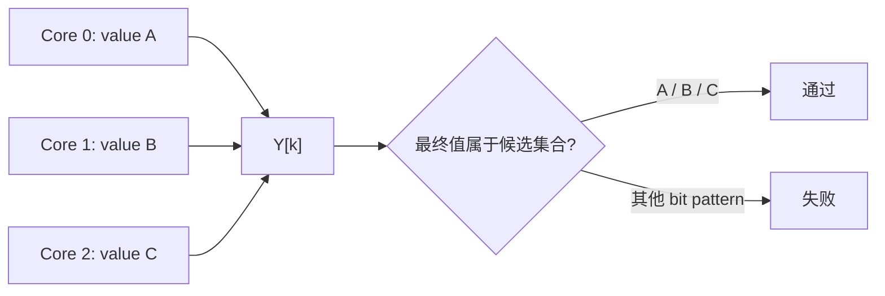
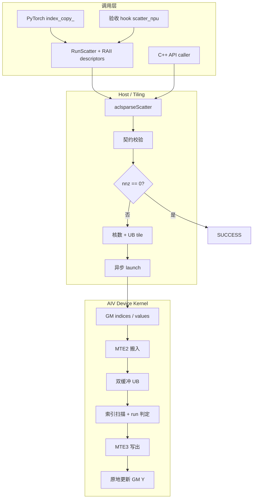
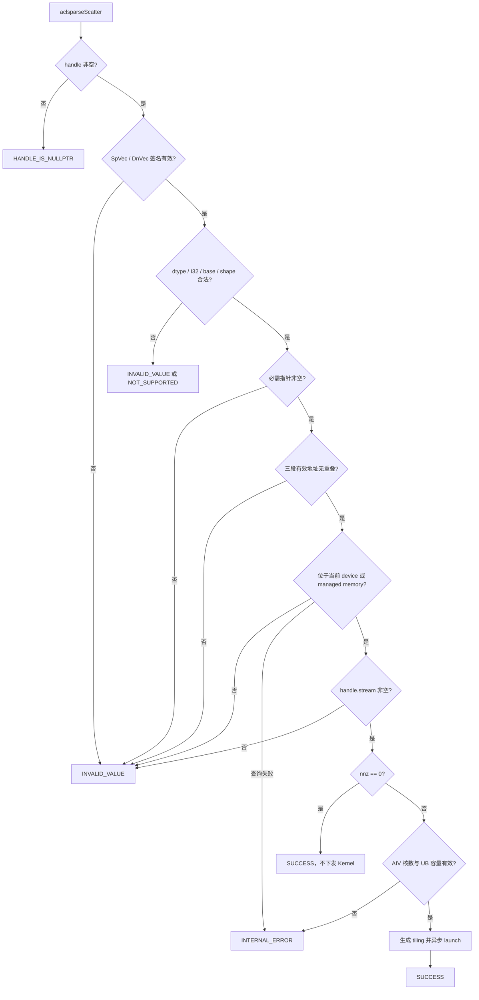
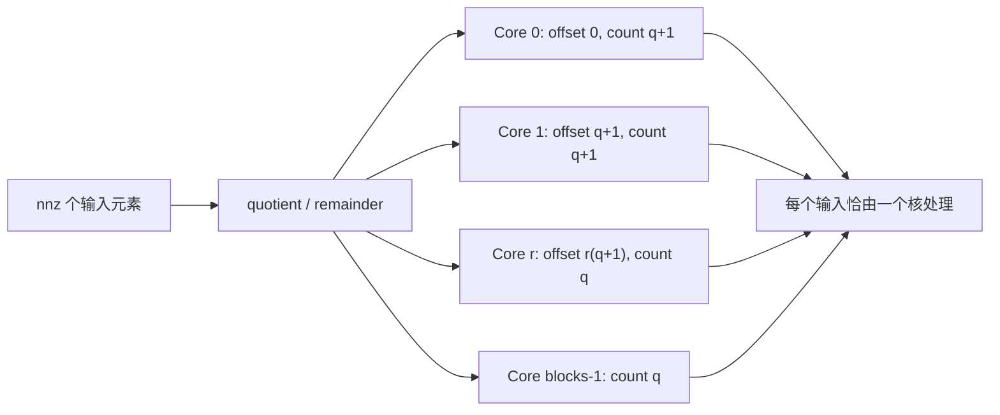
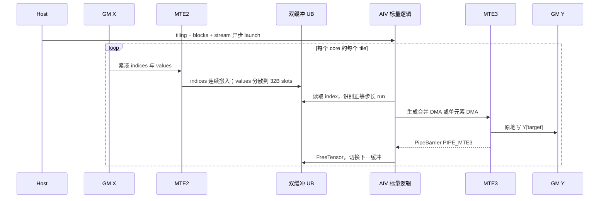
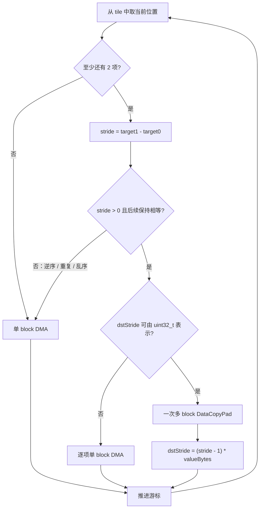
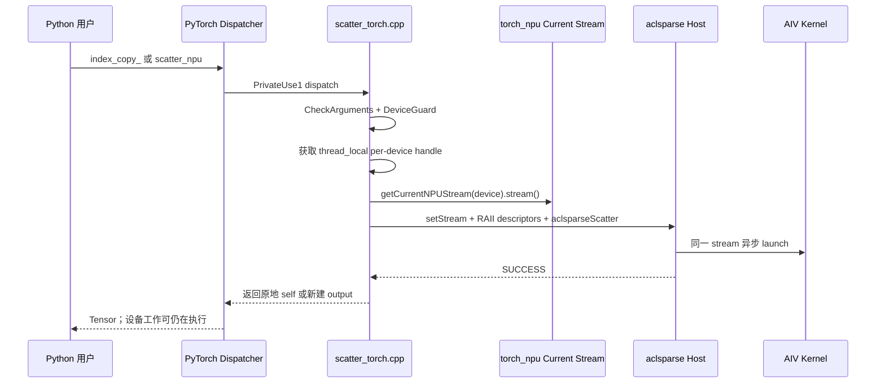
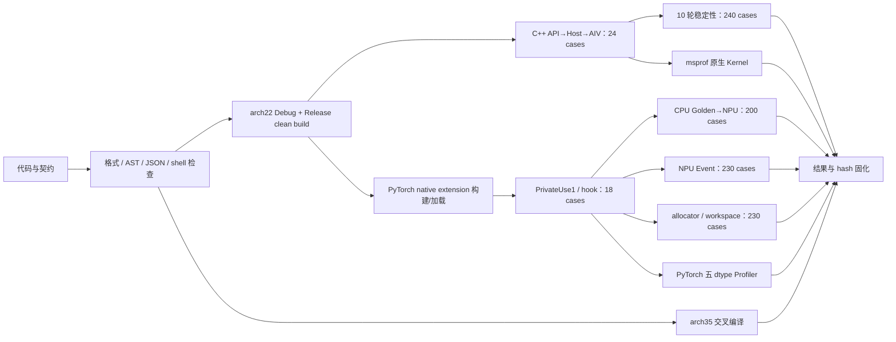

# aclsparseScatter 算子设计文档（Atlas A2/A3）

> 任务：9 月社区任务——aclsparseScatter 算子开发（A2/A3）
>
> 提交者（GitCode）：`Y673789476`
>
> 提交路径：`04_tasks/01_community-task-2026/tasklist/09-12-aclsparseScatter-A2A3/Y673789476/docs/design.md`
>
> 代码分支：[`Y673789476/aclsparseScatter:feat/aclsparse-scatter-a2a3`](https://gitcode.com/Y673789476/aclsparseScatter/tree/feat/aclsparse-scatter-a2a3)
>
> 代码版本：`7f2724f7f8f2559a151bb257892872c6dddee54c`
>
> 文档版本：V1.0，2026-09-03

本文按社区算子设计模板组织，以已验证的 `ops-sparse/arch22` 实现为真值，说明接口契约、Host/Tiling、Ascend C Kernel、PyTorch/ATen 适配以及可复现验收闭环。

# 需求背景（required）

## 需求来源

社区任务要求参考 cuSPARSE `cusparseScatter`，在 Atlas A2/A3（DAV_2201）完善 `aclsparseScatter`，交付 C++ Host、Ascend C Kernel、C++ UT/ST、Python/ATen NPU 注册、端到端测试、性能/内存采集代码和文档。目标软件环境为 CANN 9.1.0+、PyTorch 2.7+ 和 torch_npu 26.0.0+。

## 背景介绍

Scatter 把只读 SpVec 的 values 写入 DnVec 的索引位置，常用于稀疏特征回填、图数据处理、词表索引更新和稀疏格式转换。它没有浮点计算，但随机写、重复目标、1/2/4/8B 小元素写和异步 stream 顺序会直接影响正确性。

### 现状与差距

| 层次 | 任务前状态 | 本方案补齐内容 |
| --- | --- | --- |
| Public API | 已有接口声明，能力说明不完整 | 明确 A2/A3 与 950 的 dtype/index/base 差异和错误契约 |
| A2/A3 Host | 主要覆盖 FP32/base0 | 五 dtype、base0/1、shape/device/alias/stream 校验和动态 tiling |
| A2/A3 Kernel | 对数据宽度、尾块和 DMA 步进存在隐含假设 | AIV-only 原始 bit 搬移、32B value slot、等步长 run 合并和离散回退 |
| C++ 测试 | 缺少完整 dtype/base/异常矩阵 | 20 个 CSV 精度 case + 4 个 API/异常测试，整段 byte exact |
| PyTorch | 无本算子 PrivateUse1 适配 | `aten::index_copy_` 与验收 hook 共享原生路径 |
| 验收证据 | 缺少统一性能、内存和 Profiler 闭环 | Device Event、allocator、Profiler、稳定性和跨架构编译证据 |

# 需求分析（required）

## 需求描述

核心语义为：

```text
Y[X.indices[i] - idxBase] = X.values[i], i ∈ [0, nnz)
```

`vecX` 只读，`vecY` 原地更新；未命中位置保持原值。无重复索引时结果必须 bit-wise exact；重复索引是非确定性 last-write-wins，只承诺结果来自写入该位置的某个 value。实现不得排序、累加、CPU fallback 或隐式 Host 同步。

### 重复索引语义

多核并发时，同一目标位置可能被不同核写入；设备不保证这些写操作的完成先后次序。因此验收条件是最终 bit pattern 属于该位置所有候选 value 的集合，而不是固定为输入序列中最后一个 value。



### 接口边界

- C++ 公共入口保持 `aclsparseScatter(aclsparseHandle_t, aclsparseConstSpVecDescr_t, aclsparseDnVecDescr_t)` ABI，不增加 workspace 参数；
- SpVec 和 DnVec 的 dtype 必须一致，SpVec index 只支持 I32，index base 只支持 ZERO/ONE；
- 算子只做原始 bit 搬移，不排序、不归约、不修改 SpVec，也不初始化未命中的 Y；
- Host 不扫描 Device index 内容，合法索引是调用方前置条件；
- launch 相对 handle stream 异步，调用方负责数据和描述符生命周期。

## 需求拆解

| 层次 | 交付要求 |
| --- | --- |
| Public API | 保持 `aclsparseScatter(handle, vecX, vecY)` ABI，补齐注释和错误契约 |
| Host | 五 dtype、I32、base 0/1、shape/pointer/device/alias/stream 校验，动态 tiling，异步 launch |
| Kernel | AIV 多核，动态 UB，连续/等步长 run 合并，乱序/逆序 fallback，所有 dtype 原始 bit 搬移 |
| PyTorch | `aten::index_copy_` PrivateUse1 注册与 `ops_sparse_test.scatter_npu` 验收 hook |
| 测试 | C++ bit-exact、重复语义、异常、输入只读；Python 入口/Dispatcher/原地/stream；Event 性能和内存 |

## 需求追踪矩阵

| ID | 验收需求 | 设计落点 | 验证方式 |
| --- | --- | --- | --- |
| REQ-01 | 五种 value dtype | 原始存储映射，不参与数值运算 | 20 个 CSV case 覆盖五 dtype |
| REQ-02 | I32、base0/base1 | Host 类型/base 校验，Kernel 统一减 `idxBase` | C++ 与 Python 双 base case |
| REQ-03 | 任意合法一维 shape | 动态核数、quotient/remainder 切分、动态 UB tile | `nnz=0/1`、尾块、大 shape |
| REQ-04 | bit-wise exact | 32B value slot + 原始 bit DMA | 全 Y byte exact、特殊 bit pattern |
| REQ-05 | 重复索引 | 不序列化跨核写，按候选集合验收 | 跨核 duplicate membership case |
| REQ-06 | 输入只读与无 alias | Host 三段范围校验，Kernel 只读 X | 输入前后 hash/byte 对比及异常用例 |
| REQ-07 | 异步 stream | 直接向 handle/current NPU stream 下发 | C++ stream 与 PyTorch current-stream E2E |
| REQ-08 | 无额外 workspace | 无 preprocess/allocator，tiling 为定长标量 | 230 case workspace 与 allocator 采集 |
| REQ-09 | PyTorch 接入 | PrivateUse1 `index_copy_` 与测试 hook 共用 `RunScatter` | 18 个 PyTorch E2E case |
| REQ-10 | 跨架构不回退 | `arch22` 独立实现，保留 `arch35` 构建 | A2/A3 实机 + Ascend 950 交叉编译 |

# 详细设计（required）

## 总体架构

方案分为调用适配、Host/Tiling 和 AIV Device Kernel 三层。C++ 与 PyTorch 最终汇入同一个公共 API；Host 只做常量时间的元数据校验和 tiling；Device 侧以 MTE2/AIV/MTE3 流水完成搬入、索引分析和原地写出。



分层边界保证 Python 不复制实现，Host 不读取 Device index，Kernel 不依赖固定型号的核数或 UB 容量；错误均在 launch 前返回，成功路径不引入 Host 完成同步。

## 算子分析

### 数学公式

对 `i=0..nnz-1` 计算 `target=indices[i]-idxBase`，将一个完整 value 写到 `Y[target]`。不同 target 之间无依赖；相同 target 存在允许的数据竞争。因此不能把重复项改成 reduce，也不能在测试中固定最后一个源元素。

### 支持数据类型

| 数据 | A2/A3 支持范围 | Kernel 存储视图 |
| --- | --- | --- |
| indices | I32 | `int32_t` |
| INT8 | 1B | `uint8_t × 1` |
| FP16/BF16 | 2B | `uint16_t × 1` |
| FP32 | 4B | `uint32_t × 1` |
| COMPLEX64 | 8B | `uint32_t × 2` |

值类型只作为原始存储搬移，不进行 cast 或算术，因而保留正负零、INF、NAN payload 和复数两个分量。

### 支持形状

- SpVec logical `size` 与 DnVec `nums` 相等，均不超过 `INT32_MAX`；
- `0 <= nnz <= size`；indices/values 逻辑 shape 为 `[nnz]`，Y 为 `[size]`；
- base 只能是 ZERO 或 ONE；换算后的索引由调用方保证位于 `[0,size)`；
- C++ data pointers 必须在当前 NPU device/managed memory，且三段有效地址范围互不重叠。

## Host 设计

### 校验与返回路径

校验次序刻意放在资源查询和 Kernel launch 之前，使非法输入没有设备侧副作用。`nnz=0` 时仍验证 Y 指针、当前 device 和 stream，但 X 的 indices/values 可以为空。



| 校验项 | 判定 | 返回值 |
| --- | --- | --- |
| handle | `nullptr` | `ACL_SPARSE_STATUS_HANDLE_IS_NULLPTR` |
| 描述符、base、shape、dtype 一致性、必需指针、alias、stream | 契约不满足 | `ACL_SPARSE_STATUS_INVALID_VALUE` |
| value dtype、index dtype、I32 表达范围 | 能力集外 | `ACL_SPARSE_STATUS_NOT_SUPPORTED` |
| 当前 device 或平台资源查询 | 运行时查询失败或资源为 0 | `ACL_SPARSE_STATUS_INTERNAL_ERROR` |
| 合法输入 | launch 成功；`nnz=0` 不 launch | `ACL_SPARSE_STATUS_SUCCESS` |

Host 不回读 Device indices，因此不增加 D2H 或 `stream synchronize`；换算后索引越界按公开前置条件处理。算子没有 workspace、preprocess 或与输入规模线性相关的 Host/Device 申请。

### 多核切分

令 `C` 为运行时 AIV 核数、`n=nnz`，每核最少目标工作量为 128 个元素：

```text
blocks = min(C, ceil(n / 128))
q      = floor(n / blocks)
r      = n mod blocks
count(b)  = q + (b < r ? 1 : 0)
offset(b) = b * q + min(b, r)
```



该切分无需 Host 侧按核数组，前 `r` 个核各多处理一个元素；最后一个核的结束位置严格等于 `nnz`。

### UB 容量与 Tiling

双缓冲同时容纳紧凑的 I32 indices 和每项 32B 的 value slot，预留 32B 后计算：

```text
bytesPerElement = 2 * (sizeof(int32_t) + 32) = 72
tileNnz = min(floor((ubSize - 32) / 72), 4095)
```

| `ScatterTilingData` 字段 | 类型 | 含义 |
| --- | --- | --- |
| `nnz` | `uint32_t` | 输入非零元素数 |
| `ySize` | `uint32_t` | 输出逻辑长度，保留用于契约与调试 |
| `nnzPerCore` | `uint32_t` | 商 `q` |
| `remainder` | `uint32_t` | 余数 `r` |
| `tileNnz` | `uint32_t` | 单 tile 最大元素数 |
| `idxBase` | `uint32_t` | ZERO→0，ONE→1 |
| `valueEncoding` | `uint32_t` | 1/2/4/8B 对应的 Kernel 存储编码 |

`4095` 来自 `DataCopyPad.blockCount` 上限。Tiling 只保存上述七个标量，以值传入 Kernel；核数和 UB 容量均由运行时查询，不绑定具体板卡配置。

## Kernel 设计

Kernel 通过 `KERNEL_TASK_TYPE_DEFAULT(KERNEL_TYPE_AIV_ONLY)` 声明为 AIV-only。每个 AIV 只处理 Host 分配给它的连续输入片段，并在片段内部按 `tileNnz` 循环。

### Tile 流水



搬入参数为 `blockCount=count`、`blockLen=valueBytes`。indices 在 UB 中紧凑存放，而每个逻辑 value 独占一个 32B data block：

```text
index UB: [i0][i1][i2][i3]...
value UB: [v0 + pad to 32B][v1 + pad to 32B][v2 + pad to 32B]...
           ^ slot 0          ^ slot 1          ^ slot 2
```

这是 DAV_2201 小元素正确性的关键。多 block UB→GM DMA 的下一源块按 32B 步进，不能把紧凑的 1/2/4/8B value 当作多 block 源；独立 slot 也避免复用单一 scratch 时尚未完成的 MTE3 被后续迭代覆盖。

### 写出合并策略



正等步长 run 使用 `blockCount=runLength`、`blockLen=valueBytes` 和 `dstStride=(stride-1)*valueBytes` 合并写出。负步长、重复索引、乱序、单元素以及 `dstStride > UINT32_MAX` 均回退为逐项单 block DMA，保证优化不改变语义。

`PipeBarrier<PIPE_MTE3>` 位于 `FreeTensor` 前，保证输出 DMA 已消费 UB；`TPipe` 在全局 Kernel 入口创建后传给算子对象。所有 value 按 `uint8_t×1`、`uint16_t×1`、`uint32_t×1` 或 `uint32_t×2` 原始存储搬移，Kernel 不执行浮点计算、cast 或同步原语。

## Python / ATen 设计

`python/csrc/scatter_torch.cpp` 注册：

| 入口 | Dispatch | 行为 |
| --- | --- | --- |
| `Tensor.index_copy_(0,index,source)` | `aten::index_copy_ / PrivateUse1` | 原地调用 `aclsparseScatter` 并返回 self |
| `torch.ops.ops_sparse_test.scatter_npu` | `ops_sparse_test / PrivateUse1` | 在 NPU 创建零 Y，按 base 0/1 调用同一内部路径 |

两个入口都执行 `CheckArguments` 并汇入 `RunScatter`。适配层要求三个 tensor 位于同一 NPU device，均为一维、strided、contiguous 且互不 alias；index 为 int32，source 长度等于 index 长度，value dtype 属五种能力集。



| 对象 | 生命周期与分配策略 |
| --- | --- |
| handle | `thread_local`、按 device 缓存，避免每次创建；线程退出时销毁 |
| SpVec/DnVec descriptor | 每次调用创建，RAII 在 Host 调用返回后销毁 |
| Tensor storage | 直接传 `data_ptr`，公开入口对 self 原地写，不做 `.cpu()`、D2H 或临时拷贝 |
| hook output | 用 `at::zeros` 在同一 NPU device 创建，是 hook 语义所需的唯一输出分配 |
| workspace | C++/PyTorch 两条路径均为 0 |

Python loader 先导入 torch_npu，再加载本扩展，使任务专用 `aten::index_copy_` PrivateUse1 注册位于既有通用实现之后；任务支持集以外的组合明确报错，不转回旧实现或 CPU。当前 stream 只建立执行顺序，不执行完成同步。

## 支持硬件

| 产品 | 架构 | 状态 |
| --- | --- | --- |
| Atlas A2 训练系列 910B3 | DAV_2201 / `arch22` | 已完成完整链路实测 |
| Atlas A2 训练系列 910B4 | DAV_2201 / `arch22` | 同一实现，待对应硬件复验 |
| Atlas A3 任务环境型号 | DAV_2201 / `arch22` | 同一实现，待对应硬件复验 |
| Ascend 950 | DAV_3510 / `arch35` | 仓库既有独立实现；已交叉编译，未做板卡实测 |

## 算子约束限制

1. A2/A3 仅支持 I32 index 和一维连续向量；
2. Device index 内容不在 Host 常规路径扫描，调用方必须保证边界合法；
3. 重复索引不承诺确定写入顺序；
4. C++ 入口要求 handle 已绑定非空 stream；数据和描述符生命周期覆盖 stream 完成时刻；
5. Python 入口不接受 CPU、跨 device、非连续、I64 index 或任意输入 alias；
6. `size/nnz` 超出 I32 表达范围返回 `NOT_SUPPORTED`；
7. 无 workspace、无 preprocess、无 CPU fallback。

# 可维可测分析

## 精度标准/性能标准

| 项目 | 口径 |
| --- | --- |
| 确定性精度 | 无重复索引时整段 Y 逐字节 exact；额外回读确认 indices/values 未改变 |
| 重复索引 | 目标结果逐字节属于对应 source values 集合；非目标位置仍 exact |
| 特殊值 | 原始 bit 覆盖正负零、INF、NAN payload、subnormal 和 complex64 双分量 |
| 性能 | P-01/P-02/P-03 × 五 dtype × base0/1；10 warmup、30 samples、Device Event、median/p90 |
| 正式倍率 | 仅允许 PyTorch GPU Event 与 PyTorch NPU hook 同调用范围比较；C++ NPU Kernel Event 单独报告 |
| 内存 | 无固有 workspace；任务包相同 case/hash 对比，IO>500MB 时额外峰值不超过 GPU 总量 50% |

## 测试方案

测试采用“源码静态检查→干净构建→原生 Device→PyTorch Dispatcher→任务 manifest→性能/内存→Profiler→证据固化”的完整链路。每一层失败都会阻止其后结论进入验收表。



### 用例覆盖

| 层级 | 用例与断言 |
| --- | --- |
| C++ API/异常 | 空 handle/descriptor、非法签名、I64、FP64、dtype/shape 不一致、空 stream、Host pointer、有效范围 alias |
| C++ 精度 | 五 dtype、base0/1、`nnz=0/1`、257/4097/8193 尾块、连续/正步长/逆序/乱序、P-01/P-02/P-03 |
| 原始 bit | 整段 Y byte exact；正负零、INF、NAN payload、subnormal、complex64 双分量；X values/indices 前后不变 |
| 重复索引 | 相同 target 跨 core partition，最终 raw bytes 只做候选集合 membership 判断 |
| PyTorch | public `index_copy_`、hook、五 dtype、base、原地 data pointer、current stream、显式错误 |
| 性能 | 10 warmup + 30 NPU Event samples，报告 median/p90；数据准备、H2D/D2H 与同步不进入 C++ Kernel 区间 |
| 内存 | 任务 case/hash/fingerprint 对齐；workspace query/allocation 与 allocator peak 分开记录 |
| Profiler | 必须出现 `scatter_kernel` / `AI_VECTOR_CORE`，排除 AICPU、CPU fallback、D2H index scan 和调用期 Device allocation |

### 已完成实测

以下结果来自 Atlas 910B3 + CANN 9.1.0；PyTorch 链路使用 PyTorch 2.7.1 + torch_npu 2.7.1.post10，仅作为兼容性实测，不冒充任务指定的 torch_npu 26.0.0+ 正式结果。

| 检查项 | 结果 |
| --- | --- |
| Debug clean build + C++ Device | PASS，24/24（4 API/异常 + 20 CSV） |
| Release clean build + C++ Device | PASS，24/24 |
| Release 生命周期稳定性 | PASS，24 case × 10 轮 = 240/240 |
| PyTorch native extension 构建/加载 | PASS |
| PyTorch E2E | PASS，18/18 |
| accuracy manifest 等价直测 | PASS，200/200 |
| Ascend 950 `arch35` 交叉编译 | PASS，library 与既有测试均链接成功 |
| 语法与数据完整性 | PASS，Python AST、JSON、shell；case SHA256/fingerprint 校验 |

原生 C++ Device Event（单位 μs）：

| 场景 | size / nnz | 有效 case | median 范围 | p90 范围 |
| --- | --- | ---: | ---: | ---: |
| P-01 | 128256 / 8192 | 10 | 23.520–29.620 | 25.360–31.940 |
| P-02 | 151936 / 4096 | 10 | 21.640–24.640 | 23.320–26.500 |
| P-03 | 129280 / 7168 | 10 | 22.160–27.960 | 23.540–28.460 |

PyTorch hook 端到端 NPU Event（兼容环境，单位 μs）：

| 场景 | 有效 case | NPU median 范围 | NPU p90 范围 | GPU median / NPU median | 达到 0.25 |
| --- | ---: | ---: | ---: | ---: | ---: |
| P-01 | 10 | 150.870–290.340 | 158.060–299.420 | 0.291206–0.614781 | 10/10 |
| P-02 | 10 | 170.790–255.730 | 174.960–260.640 | 0.328579–0.503074 | 10/10 |
| P-03 | 10 | 157.690–287.370 | 162.880–292.040 | 0.294867–0.543547 | 10/10 |

allocator harness 的 230/230 case 均记录 `workspace_query_bytes=0`、`workspace_allocation_bytes=0`，官方比较器的 `workspace_l2` 路径 230/230 通过。原生 Profiler 中仅有一个 `scatter_kernel`、类型为 `AI_VECTOR_CORE`；public `index_copy_` 五 dtype 的框架 Profiler 同样只有 `scatter_kernel`，count=5、device op ratio=100%。

完整命令、环境、case hash、逐 case 数据和 Profiler 摘要见[自测报告](https://gitcode.com/Y673789476/aclsparseScatter/blob/main/docs/scatter_self_test_report.md)、[原生性能数据](https://gitcode.com/Y673789476/aclsparseScatter/blob/main/benchmarks/scatter/results/910b3_cann9.1.0.tsv)、[框架性能数据](https://gitcode.com/Y673789476/aclsparseScatter/blob/main/benchmarks/scatter/results/910b3_torch2.7.1_torchnpu2.7.1post10.tsv)、[内存数据](https://gitcode.com/Y673789476/aclsparseScatter/blob/main/benchmarks/scatter/results/910b3_torch2.7.1_torchnpu2.7.1post10_memory.tsv)和[框架 Profiler 摘要](https://gitcode.com/Y673789476/aclsparseScatter/blob/main/benchmarks/scatter/results/910b3_torch2.7.1_torchnpu2.7.1post10_profiler.tsv)。

### 正式环境待验收项

| 项目 | 当前状态 | 官方环境动作 |
| --- | --- | --- |
| torch_npu 26.0.0+ | 待复验 | 重跑 18 pytest、200 accuracy、230 performance/memory |
| ATK 原生命令 | 当前环境无 `atk` | 执行 `test_cases/run_accuracy_atk.sh`，确认 200 case |
| 910B4 / Atlas A3 | 当前仅有 910B3 | 在对应硬件复跑同一完整链路 |
| Profiler GUI 截图 | 已保存 CLI/TSV 摘要 | 导入原始 msprof DB，补交界面截图 |

## 兼容性分析

公共函数签名和 ABI 不变；既有 FP32/base0 是新实现子集。`arch22` 和 `arch35` 继续由 SOC 分目录构建。共享 `ScatterParam` 保留 arch35 旧 CSV 字段，避免 A2/A3 测试迁移破坏 950 编译。PyTorch 扩展为可选构建，不向无 torch 环境的核心库引入依赖。

## 风险与规避

| 风险/常见错误 | 后果 | 本方案规避 |
| --- | --- | --- |
| 把小 value 紧凑 UB 当作多 block DMA 源 | 1/2/4/8B 元素错位 | 每个 value 独占 32B slot，并用专项尾块/特殊 bit 测试 |
| 把重复索引期望固定为输入最后一项 | 多核时产生伪失败或错误串行化 | 规范为非确定性 last-write-wins，测试 candidate membership |
| 为检查 index 越界而 D2H 扫描 | 隐式同步、性能下降 | 保留调用方前置条件，Host 仅校验元数据与指针属性 |
| 固定核数、UB 或平均块长 | 换型号后越界、遗漏 remainder | 运行时查询资源，quotient/remainder 覆盖全部输入 |
| 在 MTE3 完成前复用 UB | 输出被后续 tile 覆盖 | `PipeBarrier<PIPE_MTE3>` 后再 `FreeTensor` |
| PyTorch 使用默认 stream 或 CPU fallback | 破坏算子顺序或掩盖未支持输入 | `DeviceGuard` + current NPU stream；能力集外显式报错 |
| 只比较命中位置或浮点容差 | 漏检 Y 非目标破坏、NAN payload 改写 | 整段 byte exact，并单独验证 X 只读 |
| 混用 C++ Kernel Event 与框架 GPU Event | 性能倍率失真 | 原生性能单独报告；正式倍率只比较同层 PyTorch Event |
| 把兼容版本结果当指定版本验收 | 结论不可复核 | 明确标注 torch_npu 版本，并保留 26.0.0+ 待验收项 |

# 交付文件

| 交付件 | 位置 |
| --- | --- |
| 本设计文档 | `09-12-aclsparseScatter-A2A3/Y673789476/docs/design.md` |
| 官方代码 PR 分支 | [`feat/aclsparse-scatter-a2a3`](https://gitcode.com/Y673789476/aclsparseScatter/tree/feat/aclsparse-scatter-a2a3) |
| A2/A3 Host/Tiling | [`scatter_host.cpp`](https://gitcode.com/Y673789476/aclsparseScatter/blob/feat/aclsparse-scatter-a2a3/sparse/scatter/arch22/scatter_host.cpp)、[`scatter_tiling_data.h`](https://gitcode.com/Y673789476/aclsparseScatter/blob/feat/aclsparse-scatter-a2a3/sparse/scatter/arch22/scatter_tiling_data.h) |
| Ascend C Kernel | [`scatter_kernel.h`](https://gitcode.com/Y673789476/aclsparseScatter/blob/feat/aclsparse-scatter-a2a3/sparse/scatter/arch22/scatter_kernel.h)、[`scatter_kernel.cpp`](https://gitcode.com/Y673789476/aclsparseScatter/blob/feat/aclsparse-scatter-a2a3/sparse/scatter/arch22/scatter_kernel.cpp) |
| PyTorch/ATen 适配 | [`python/csrc/scatter_torch.cpp`](https://gitcode.com/Y673789476/aclsparseScatter/blob/feat/aclsparse-scatter-a2a3/python/csrc/scatter_torch.cpp) |
| C++ 与 Python E2E | [`scatter_test.cpp`](https://gitcode.com/Y673789476/aclsparseScatter/blob/feat/aclsparse-scatter-a2a3/test/scatter/arch22/scatter_test.cpp)、[`test_scatter.py`](https://gitcode.com/Y673789476/aclsparseScatter/blob/feat/aclsparse-scatter-a2a3/python/tests/test_scatter.py) |
| 性能与内存 harness | [`benchmarks/scatter`](https://gitcode.com/Y673789476/aclsparseScatter/tree/main/benchmarks/scatter)、[`test_cases/aclsparseScatter_testCase`](https://gitcode.com/Y673789476/aclsparseScatter/tree/main/test_cases/aclsparseScatter_testCase) |
| 完整自测报告 | [`docs/scatter_self_test_report.md`](https://gitcode.com/Y673789476/aclsparseScatter/blob/main/docs/scatter_self_test_report.md) |
| 通用算子开发与避错指南 | [`docs/operator_development_playbook.md`](https://gitcode.com/Y673789476/aclsparseScatter/blob/main/docs/operator_development_playbook.md) |

# 参考资料

- [CANN 社区算子任务仓库](https://gitcode.com/cann/cann-ops-competitions)
- [社区算子设计模板](https://gitcode.com/cann/cann-ops-competitions/blob/master/04_tasks/01_community-task-2026/resources/design_template.md)
- [CANN ops-sparse 官方仓库](https://gitcode.com/cann/ops-sparse)
- [本任务说明原文镜像](https://gitcode.com/Y673789476/aclsparseScatter/blob/main/aclsparseScatter_A2A3_task_doc.md)
