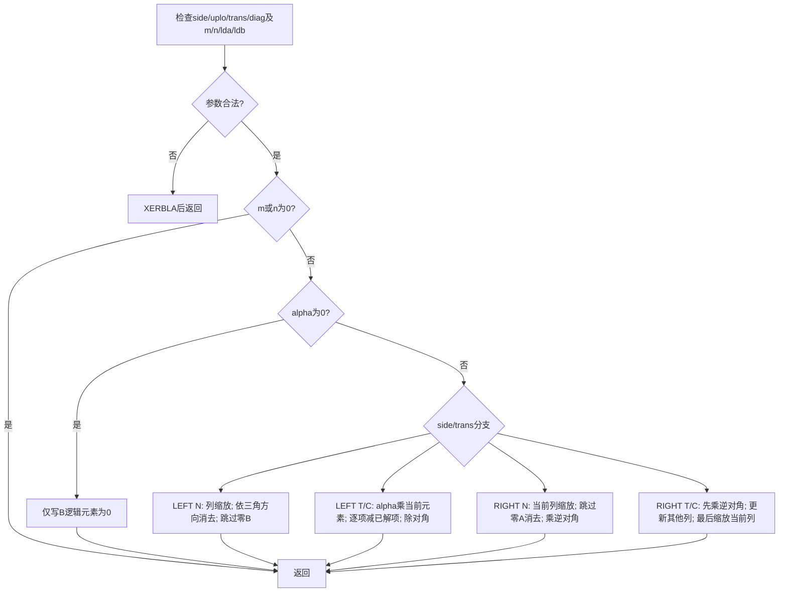
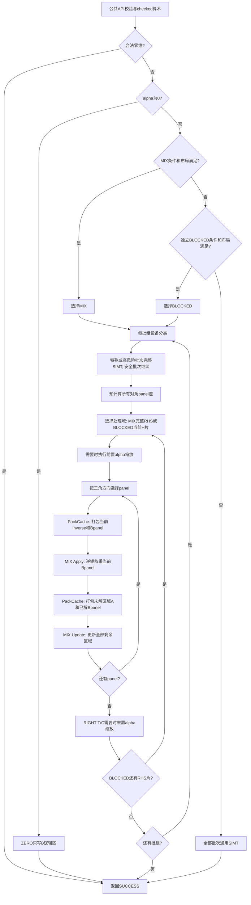

# 一、需求背景

## 1.1 需求来源

通过CANN社区任务补齐ops-blas在950PR上的单精度复数批量三角方程求解能力，提供共享的句柄式BLAS接口。以《aclblasCtrsmBatched_Atlas950PR_task_doc.md》的功能、精度、性能及交付要求验收。

## 1.2 背景介绍

### 1.2.1 aclblasCtrsmBatched算子实现优化

使用Ascend C开发complex64批量三角求解接口，集成至ops-blas的`blas/trsmbatched/arch35/`。

TBE源码、算子信息库及ACLNN接口：不适用，本算子采用BLAS Kernel直调接口。标杆与工程参考如下：

| 用途 | 文件或接口 |
|---|---|
| 批量接口语义 | [cuBLAS cublasCtrsmBatched](https://docs.nvidia.com/cuda/cublas/index.html#cublas-t-trsmbatched) |
| 单批标杆实现 | [Netlib ctrsm.f](https://www.netlib.org/blas/ctrsm.f)，本地`references/ctrsm.f` |
| 公共接口与类型 | `ops-blas/include/cann_ops_blas.h`、`ops-blas/include/cann_ops_blas_common.h` |
| 同族Host参考 | `ops-blas/blas/trsmbatched/arch35/strsmbatched_host.cpp` |
| 同族Kernel参考 | `ops-blas/blas/trsmbatched/arch35/strsmbatched_kernel.cpp` |
| 同族Tiling参考 | `ops-blas/blas/trsmbatched/arch35/strsmbatched_tiling_data.h` |

### 1.2.2 aclblasCtrsmBatched算子现状分析

#### 1.2.2.1 标杆算子支持的数据类型和数据格式

本任务对齐cuBLAS CtrsmBatched的complex64分支：列主序、uniform batch，A/B为设备侧指针数组，B原地覆写。支持LEFT/RIGHT、UPPER/LOWER、N/T/C、NON_UNIT/UNIT，共24组合。A阶数为LEFT时m、RIGHT时n，B为m×n，支持lda/ldb padding。

#### 1.2.2.2 标杆算子实现描述

Netlib先检查枚举、维度、前导维；再处理零维返回和alpha=0逐元素置零。主计算有四类，以下索引描述与`references/ctrsm.f`对应：

| 分支 | 处理顺序 | 对角与更新、alpha位置 |
|---|---|---|
| LEFT N | 每个B列独立；A上三角时k递减，下三角时递增 | 先对该列乘alpha；B[k,j]非零时才做非单位对角除法与剩余行更新 |
| LEFT T/C | 每个B列独立；原A上三角时i递增，下三角时递减 | temp=alpha·B[i,j]，按已求解项逐项相减，再除op(A)对角；C对系数和对角取共轭 |
| RIGHT N | A上三角时B列j递增，下三角时递减 | 当前列先乘alpha；仅非零A[k,j]参与对已完成列的消去；非单位对角以逆对角乘整列 |
| RIGHT T/C | 原A上三角时k递减，下三角时递增 | 当前列先做非单位对角逆乘，随后用它更新未完成列；只在更新结束后对已完成列乘alpha；C取共轭 |

#### 1.2.2.3 标杆实现流程图

Netlib单批流程如下，批量golden逐批调用。



# 二、需求分析

## 2.1 外部组件依赖

| 组件 | 版本 | 用途 |
|---|---|---|
| CANN / asc-devkit | 9.1.0 / 9.1 | Ascend C SIMT、ACL runtime |
| ops-tensor | c1326e7a7fb30536dc3517ac40e06935aba5e88d | Cube配套构建依赖 |
| tensor_api | ad3d3bf04dddfb94370c534c39bdd305d8e38d88 | Copy/Mmad接口 |
| Netlib BLAS / LAPACK | 3.10.0 | cblas_ctrsm golden及数值诊断 |
| GTest / CMake / C++ | 1.11.0 / 3.22.1 / C++17 | 测试与构建 |
| Python | 3.11 | 用例与验收脚本 |

## 2.2 内部适配模块

新增共享声明、`blas/trsmbatched/arch35/ctrsmbatched_*`实现与版本门禁；测试放Jobbook明确的`test/trsmbatched/ctrsm_batched/arch35/`。测试目标为`ctrsmbatched_test`，在`test/CMakeLists.txt`做显式目录映射，使`--ops=ctrsmbatched`与`--ops=trsmbatched`均可发现。

`blas/CMakeLists.txt`自动发现实现，无需增加家族CMake；`cmake/asc_devkit_version.cmake`新增复数条目，不改变实数版本门禁。当前公共复数定义如下：

```cpp
typedef struct aclblasComplex {
    float real;
    float imag;
} aclblasComplex;
```

## 2.3 需求模块设计

### 2.3.1 Ascend C算子原型与相关约束

声明只加入`include/cann_ops_blas.h`，与任务书逐参数一致：

```cpp
aclblasStatus_t aclblasCtrsmBatched(
    aclblasHandle_t handle,
    aclblasSideMode_t side, aclblasFillMode_t uplo,
    aclblasOperation_t trans, aclblasDiagType_t diag,
    int m, int n, const aclblasComplex* alpha,
    const aclblasComplex* const A[], int lda,
    aclblasComplex* const B[], int ldb, int batchCount);
```

| 参数 | 语义与合法域 | 异常处理 |
|---|---|---|
| handle | 已创建句柄，绑定stream | nullptr→HANDLE_IS_NULLPTR |
| side/uplo/trans/diag | 141/142；121/122；111/112/113；131/132，对应公开枚举 | 非法→INVALID_VALUE |
| m/n | >=0，B的行/列数 | 负数→INVALID_VALUE |
| alpha | Host complex64标量，实虚均0时置零路径 | nullptr→INVALID_VALUE |
| A | Device指针数组，只读；每项指向lda×k存储 | 非零alpha且非空计算时nullptr→INVALID_VALUE |
| B | Device指针数组，每项指向ldb×n存储，写回逻辑m×n | nullptr→INVALID_VALUE |
| lda/ldb | lda>=max(1,k)，ldb>=max(1,m) | 不满足→INVALID_VALUE |
| batchCount | >=1，各批标志和维度统一 | <1→INVALID_VALUE |

设计固定校验顺序：handle → 枚举/负维度/batch → alpha/B → leading dimensions与字节算术 → 合法零维返回 → 读取Host alpha → alpha非零时检查A → 选择路径。零维无需A也不读取alpha值，但alpha指针和B数组指针仍须非空。非法lda/ldb返回INVALID_VALUE。

检查数组长度、矩阵最大逻辑偏移及字节乘法使用checked uint64_t/size_t。设备数组内单个指针必须有效、自然对齐且容量足够，由调用者保证；本接口不以Host读回数组来同步校验每个地址。错误设备地址可在stream同步点由运行时报告。

不读取A的非引用三角；UNIT不读取对角；alpha0不读取A指针数组、A矩阵或B原值；不改写B padding。各B不得重叠，不支持A/B相互别名。单handle并发多stream/多线程的工作区复用需遵守仓库生命周期约定。

# 三、需求详细设计

## 3.1 调用方式

调用方创建handle、用`aclblasSetStream`绑定stream，在设备分配A/B各矩阵和指针数组，准备Host alpha，调用公共API。Host只做参数与Tiling计算、下发Kernel；Kernel从设备数组读取地址。返回成功表示已下发，调用方读回前同步stream。

跨阶段依赖由同一stream中的Kernel完成顺序保证，不在公开API内加`aclrtSynchronizeStream`、同步D2H或临时分配后同步释放。复用handle有效workspace；MIX布局不足时尝试独立Kernel分块路径，再不足则以通用SIMT正确执行，不调用会同步增长的`EnsureDefaultWorkspace`。

## 3.2 需求总体设计

### 3.2.1 Host侧设计

#### 3.2.1.1 分核策略

定义k为三角阶数、q为独立右端数：LEFT `(k,q)=(m,n)`；RIGHT `(k,q)=(n,m)`。通用路径每个线程负责一个完整RHS；扁平任务`task=b*q+r`，线程按grid-stride处理，初始64线程。核数`min(AIV核数, ceil(batch*q/64))`，没有任务时不launch。

LEFT固定B列，RIGHT固定B行；同一RHS求解顺序串行，不同RHS和批次独立，避免不同核对同一依赖链读写。RIGHT行并行时相邻线程访问列主序连续行；LEFT通用线程各自按Netlib次序读取所需A元素。

零路径以`batch*m*n`逻辑元素平铺，多核/128线程grid-stride；第b批索引`j*ldb+i`。元素数及指针偏移均64位，跳过padding。

分块路径统一为`T·Y=alpha·C`，逻辑映射如下（i为三角方向索引，r为RHS）：

| side/trans | T(i,j) | C(i,r)/Y(i,r)对应B地址 | T上/下三角 |
|---|---|---|---|
| LEFT N | A(i,j) | B(i,r): i+r·ldb | 保持uplo |
| LEFT T | A(j,i) | B(i,r) | 翻转uplo |
| LEFT C | conj(A(j,i)) | B(i,r) | 翻转uplo |
| RIGHT N | A(j,i) | B(r,i): r+i·ldb | 翻转uplo |
| RIGHT T | A(i,j) | B(r,i) | 保持uplo |
| RIGHT C | conj(A(i,j)) | B(r,i) | 保持uplo |

每行再乘UPPER/LOWER与UNIT/NON_UNIT的4组合即24组合。T下三角时panel从前到后，上三角时从后到前。

#### 3.2.1.2 数据分块和内存优化策略

主加速路径采用独立的PackCache Kernel和`KERNEL_TYPE_MIX_AIC_1_2`计算Kernel。P=64；LEFT使用M256/N128，RIGHT使用M128/N256。一个逻辑核心组包含一个AIC和两个AIV，`coreGroups=min(AIC核数,AIV核数/2)`；双方组号为`GetBlockIdx()/GetTaskRation()`，组数为`GetBlockNum()`。AIC的ratio为1、AIV为2，不能再次把AIV组数除以2。

安全批次预计算全部P64对角逆`Invp=Tpp^-1`。每个panel按求解方向执行Apply `Yp=Invp·Cp`，再执行覆盖全部未解行和完整RHS的Update `Cu←Cu−Tup·Yp`；每个Apply/Update各包含一次PackCache和一次MIX调用。k2048时为32个Apply、31个Update，即63次PackCache和63次MIX；分类、fallback、inverse及必要Scale另计入公开API耗时。

PackCache的任务为每批所有A行块与所有X右端块，数量`G*(rowTiles+rhsTiles)`，按AIV grid-stride分配；每个A块或X块仅打包一次。MIX数量为`totalWork=G*rowTiles*rhsTiles`，启动`groups=min(coreGroups,totalWork)`个组。按job优先的连续区间均衡分核：

```text
rowTiles=ceil(rowSize/M), rhsTiles=ceil(rhsSize/N)
chunk=ceil(totalWork/groups)
core g: work∈[g*chunk,min((g+1)*chunk,totalWork))
job=work/rowTiles
batchInGroup=job/rhsTiles, rhsTile=job%rhsTiles, rowTile=work%rowTiles
```

区间完整覆盖且不重复；三参与者同序跳过已回退批次，只有实际执行的tile增加issued。每核最多处理chunk个tile，最后若干核可能为空。同一job内连续处理多个A行块并复用同一X块；核从job中途起步时也先加载X，换job重新加载，跨Kernel不保留缓存状态。`residentXJob`初值为UINT64_MAX；L1中X基址固定为`9*t.aPlaneBytes`，不随实际A尾块变短而移动。

对每个实际有限FP32分量x执行三段BF16 RNE分解，减法在FP32中进行：

```text
r0=x
b0=BF16_RNE(r0), r1=FP32(r0-FP32(b0))
b1=BF16_RNE(r1), r2=FP32(r1-FP32(b1))
b2=BF16_RNE(r2)
```

A保存`Ar[0..2]、Ai[0..2]、(-Ai)[0..2]`共9平面，X保存`Xr[0..2]、Xi[0..2]`共6平面；Apply的A来自FP32逆矩阵，Update的A来自实际引用三角。共轭先在FP32虚部取反。实乘近似采用六组degree配对`(0,0),(0,1),(1,0),(0,2),(1,1),(2,0)`。每对依次累计两个有符号实乘：`Cr+=Ar[dA]*Xr[dX]+(-Ai)[dA]*Xi[dX]`，`Ci+=Ar[dA]*Xi[dX]+Ai[dA]*Xr[dX]`。每个结果12次BF16输入、FP32累加的K64 MMAD；仅term0初始化L0C，term11标记FINAL并一次Fixpipe写回。三段分解及舍弃高阶交叉项不构成逐位等价保证，仍须满足原始两套精度门限。

Apply覆写B，Update从原B减去Cr/Ci，两个AIV各处理一半RHS。LEFT及RIGHT N在求解前缩放，RIGHT T/C在完整依赖链后缩放；alpha=(1,0)省略，Scale的RHS片宽不超过2048。B始终保持原列主序，不做全矩阵物理置换。

定义`A32(x)=ceil(x/32)*32`为字节对齐，S为NON_UNIT的128B或UNIT的192B分类partial。MIX工作区如下：

```text
Aplane=2*M*P, Xplane=2*P*N, Cplane=4*M*N
Wslot=2*Cplane=262144B                         # 每核心组GM-C单槽
Winverse=ceil(k/P)*P*P*8                       # 每批完整FP32复数对角逆
Acache=ceil(k/M)*9*Aplane
Wcache=Acache+ceil(q/N)*6*Xplane                # 每批A/X缓存
Wprefix=max(coreGroups*Wslot,G*S)
inverseOffset=Wprefix
flagsOffset=inverseOffset+G*Winverse
cache.offset=flagsOffset+A32(4*G)
Wtotal=alignment_slack+cache.offset+G*Wcache
```

分类partial临时占用prefix；分类与归约完成后GM-C复用该前缀，inverse、flags、A/X cache互不重叠。Host先扣除0～31B起点对齐损失，以剩余容量和除法比较检查fits(G)，在`min(batchCount,UINT32_MAX/max(k*2048,256*2048))`内二分选择G。所有选择在launch前完成；不扩容或同步分配workspace。`CtrsmbatchedMixedCacheData`仅有offset、batchBytes、aBatchBytes三个uint64字段，共24B；A/X缓存tile步长分别为9*Aplane、6*Xplane。

28核心组、默认32MiB下，五个性能形状的完整G分别为32/16/8/4/4；prefix均7MiB、完整inverse均4MiB、A/X cache均15MiB，共26MiB，再加flags的128/64/32/32/32B及起点余量。此为可审计分配预算，实际内存测量另外验收。

MIX条件或布局不满足时，尝试独立FP32 Pack/Cube/Update分块路径：P64、R256，H从128按容量倍增至不超过2048，每批独立槽为：

```text
WslotBlocked=3*A32(4*256*64)+2*A32(4*64*H)+2*A32(4*256*H)
WtotalBlocked=alignment_slack+G*(WslotBlocked+Winverse)+A32(4*G)
```

H128时槽为512KiB，H2048/G4时槽加inverse约24.75MiB。该路径用四实FP32乘积形成Cr/Ci，不能与主MIX的BF16六pair混写。最小布局仍放不下时使用完整通用SIMT。

| 存储 | 主MIX配置与预算 |
|---|---|
| L1 | 全9A/6X resident；LEFT最大`9*(2*256*64)+6*(2*64*128)=384KiB`，RIGHT最大336KiB；X固定在完整9A预留之后 |
| L0A/L0B | BF16 C0=16、每次K64；各两份起点0/32KiB，每份不超过32KiB，总地址末端不超过64KiB |
| L0C | `4*M*N=128KiB`，实/虚结果顺序复用 |
| PackCache静态UB | input 32KiB、real/imag各16KiB、9个4096元素BF16平面72KiB，共136KiB |
| MIX AIV静态UB | 两完整C半平面各64KiB、oldReal/oldImag各16KiB、complex 32KiB，共192KiB |
| Classify静态UB | 64KiB搬运片加NON_UNIT 4KiB或UNIT 6KiB统计，共68/70KiB |
| Panel逆矩阵静态UB | `16*64*64+8*64=66048B`，约64.5KiB |
| 通用SIMT | 无随k增长的大块显式UB；编译器寄存器/栈占用另核查 |

目标设备UB容量248KiB、L1为512KiB、L0A/B各64KiB、L0C为256KiB。各Kernel预算独立，不能把PackCache与MIX相加；静态数组使编译器登记UB占用，LocalTensor只包装已预留地址，不能仅创建动态TPipe地址。ELF的不同节VMA不是硬件UB地址；编译核查以每Kernel静态段、节内buffer偏移和访问末端为准。

约束来源：[RegBase-native]上述DAV_3510片上容量以CANN 9.1.0的`data/platform_config/Ascend950PR_9579.ini`及对应RegBase API为准；[general]各tile预算按元素数×类型字节数、平面数及同时存活的buffer数量计算。

PackCache直接DMA仅用于完整P64且相应行/RHS维满足16对齐的矩形，其他情况用SIMT合法读并补零；UNIT对角在inverse装载阶段合成1。A/X缓存用原物理主序的ND/DN视图，MIX用CopyGM2L1转NZ/ZN。Update先将该AIV完整Cr/Ci半片读入私有UB，再逐strip读取原B、解交织、相减和交织写回，避免重复读取GM-C。

尾块Update以float定义有效长度L与UB pitch Padded，`Rounded=align8(L)`。DataCopyPad单侧仅补`Rounded−L`个float；其余gap用`dstStride=(Padded−Rounded)/8`个32B块表示。gap存在时先Duplicate清零，再以V→MTE2事件保护搬入；写回srcStride相同，GM stride用字节、blockLen只包含逻辑数据，保持B padding不变。

#### 3.2.1.3 tilingKey规划策略

本算子采用Kernel直调，不注册ACLNN tilingKey。`CtrsmbatchedTilingData::pathId`仅有ZERO=0、SIMT=1；MIX和BLOCKED由Host选择不同入口，不能虚构BLOCKED=2等字段值。

| 路径 | 条件 | 行为 |
|---|---|---|
| EMPTY | 合法m=0或n=0 | Host返回SUCCESS，不launch |
| ZERO | alpha实虚均0 | 只写B逻辑元素为零，不读A或原B |
| MIX | 128≤k≤65535、q≥64、m*n≤UINT32_MAX、核数和布局满足、alpha有限非零；UNIT要求alpha=(1,0) | 设备分类、逆矩阵预计算、每panel Apply及全剩余Update融合 |
| BLOCKED | MIX不能启用，独立分块的形状/核数/工作区条件满足 | R256、H≤2048的两平面独立Kernel链 |
| SIMT | 两种加速路径均不可用，或设备判定该批高风险 | 保留Netlib四分支的完整语义 |

两种加速路径对原trans=N均要求`lda/ldb/k`为8的倍数；P64使该条件同时保证最后panel宽为8的倍数。T/C按实际逻辑尾块处理。这些条件只决定加速路径，不限制公共接口支持的24组合和合法padding。

基础Tiling保存m/n/k/rhs/lda/ldb/batchCount、alpha实虚及right/upper/transpose/conjugate/unit/pathId。`CtrsmbatchedBlockedTilingData`嵌入基础Tiling，另含batchBase/groupSize、rhsBase/rhsSize、panelStart/panelSize、rowStart/rowSize、panelStride/rhsStride/rowStride、slotBytes、aPlaneBytes/xPlaneBytes/cPlaneBytes、flagsOffset/inverseOffset/inverseBatchBytes及panelApply。维度、地址和工作区偏移字段为uint64_t，panelApply为uint32_t；MIX另传24B的CtrsmbatchedMixedCacheData，实际核数由launch参数传递。

分类和特殊批次完整SIMT均在每个批组内执行一次，并在任何缩放/分块改写B前完成。不能对已更新B重新分类，也不能从中间结果再次执行通用求解。

### 3.2.2 Kernel侧设计

#### 3.2.2.1 Kernel侧实现描述

**通用SIMT。** Kernel读取`A[b]`、`B[b]`。每个RHS采用1.2.2.2对应Netlib分支的前/回代、零值跳过和alpha位置。纯C++复数实虚算术用显式float；复数乘法保留四次独立FP32乘积舍入，并补齐双NaN时的Inf恢复。有限复数除法采用两个uint32字段表示53-bit规格化有效数与指数，重现所用Netlib/libgcc的binary64中间运算和最终FP32舍入；保留子正规数、Inf/NaN及零分母语义。

**设备分类。** 在任何B改写前扫描实际引用的A、逻辑B及alpha。严格三角大矩形使用MTE2+SIMD，NON_UNIT的32列、UNIT的64列对角邻域使用带合法读谓词的SIMT；不读取忽略三角或UNIT对角。八个列分片分别写partial，后续归约Kernel写每批标志；无Host读回、无浮点atomic。NON_UNIT保留bad/maxOff/minDiag/maxB四项；UNIT额外统计严格三角的signed sumReal/sumImag，两项独立归约，scratch与小槽分派条件同步使用192B。

保留输入非有限检查和NumericalRisk：按k、maxOff、minDiag、alpha/B幅度约束逆矩阵、未缩放中间解及最终结果的增长，逆矩阵范围检查在B全零早返回之前执行。RIGHT T/C以`max(1,alphaMax)`覆盖末缩放前的中间值。UNIT的alpha不为(1,0)由Host直接走通用路径；其余UNIT再检查`max(abs(sumReal),abs(sumImag))/(maxOff*k*(k−1)/2)>1/16`，命中或统计非有限则设备回退，maxOff=0时不因coherence回退。该规则只依赖输入数值，不使用caseID或分布标签，也不放宽验收精度。低coherence不是精度保证，仍须执行完整测试。

**加速计算。** 安全批次先以SIMT合法装载、RegBase向量求逆和MTE3写回生成所有P64对角逆。每次Apply/Update由独立PackCache先生成9A/6X BF16平面，再由MIX执行六pair补偿、FP32累加与B写回。PackCache中同一strip所有degree完成后一次V→MTE3交接，并在复用buffer前排空搬出。MIX中各degree的A平面每tile重载；X六平面仅在本核首次处理job或job变化时重载。L1保留固定X基址，A尾块变短不覆盖X。旧BLOCKED继续使用FP32四实乘的独立Pack/Cube/Update链。所有加速Kernel跳过已执行完整通用求解的批次。

**同步。** PackCache与MIX通过同stream Kernel完成边界建立依赖，不使用MIX组内flag传递PackCache完成。MIX只使用两个mode2跨核通道：AIC在两次结果Fixpipe完成后发PIPE_FIX flag0；两AIV等flag0，各自将完整Cr/Ci半片从GM搬到UB，以MTE2→V事件确认搬入完成后发PIPE_MTE2 flag1，再继续更新B。AIC计算下一tile时可先加载L1并MMAD，仅在第一次Fixpipe覆盖GM-C前等待上轮两AIV的flag1；最后一个tile也排空flag1。早done只表示旧GM-C已全部读走，不表示B已写完。完整panel依赖仍由同stream Kernel结束保证。空RHS分片也应答flag1，三参与者按相同顺序跳过异常batch。

Cube用MTE2→MTE1 degree事件0/1/2分阶段开放BF16平面，实部term0/2/6分别消费对应事件，虚部复用已有L1数据；即使本tile复用X，每degree仍先搬A再发事件。全部L1消费发出后，以MTE1→MTE2归还复用token。L0A/B的M→MTE1和MTE1→M事件0/1交替，M→FIX与FIX→M保护实/虚L0C复用；入口预置、出口回收token。AIV的SIMT线程共同到达barrier；Vector、MTE2、MTE3之间按生产与消费建立事件，每strip搬出完成后才覆盖其源buffer。

#### 3.2.2.2 Ascend C实现流程图



图中PackCache/MIX为主加速路径，每个Update覆盖全部剩余行和RHS；选择BLOCKED时对应阶段替换为该RHS片内的独立Pack/Cube/Update及R256行片。空Update连同其Pack直接略过。API返回只表示下发成功，不等待设备完成。

#### 3.2.2.3 Ascend C与标杆流程的差异及原因

| 差异 | 原因 |
|---|---|
| Netlib外层串行逐批；NPU跨批/RHS/tile并行 | 独立解不互相依赖，增加并行度 |
| Netlib标量消去；安全批次用P64逆、BF16六pair补偿及FP32累加 | 利用Cube吞吐，完整精度仍按原Netlib两套标准检查 |
| interleaved复数拆成9A/6X BF16平面 | 三段RNE残差保留更多有效信息，六pair形成复数实/虚结果 |
| job优先连续分核、独立PackCache与L1 X复用 | 同一RHS块的多个A行块共享X，避免逐tile重复打包和搬入 |
| RIGHT无需物理转置完整A/B | 使用逻辑地址映射与局部pack，减少工作区及搬运 |
| 通用分支保留特殊值控制流，加速路径仅处理设备分类的安全批次 | 分块重排对特殊值和病态系统不必然等价；特殊值与病态诊断单独验收 |
| Host不复制Device指针数组 | 保留异步性和stream内数组生产依赖 |

## 3.3 支持硬件

| 产品 | 架构 | CANN版本 |
|---|---|---|
| Ascend 950PR | arch35 / DAV_3510 | 9.1.0 |

## 3.4 算子约束限制

complex64、列主序、uniform batch、Host alpha；不支持超出lda/ldb的任意stride，不检测奇异/近奇异，不要求确定性。NON_UNIT非零对角由调用方保证。B各批不得重叠，输入输出及workspace应保持至stream完成；不能在异步工作未结束时覆盖指针数组或释放矩阵。

Blocked对齐与workspace仅决定性能路径，不缩小公共功能域。合法尺寸超出固定tile范围时采用分片或SIMT。

# 四、特性交叉分析

| 交叉项 | 设计处理 | 必测点 |
|---|---|---|
| side×trans×uplo×diag | 六种逻辑映射×四种三角/对角属性 | 24组合、小shape手算、非方阵 |
| alpha0×NaN/Inf×nullA | 零路径不读A或原B | 输出正零、padding原样 |
| UNIT×NaN对角 | 直接合成单位值，不从GM读取 | 任意对角毒化不影响结果 |
| 转置/共轭×padding | 以原lda寻址、仅虚部取反，原ldb写回 | 独立实虚输入、前导维+4/+8/+16 |
| 工作区×异步 | 容量驱动分组，同stream复用，无内部同步增长 | 小/零外部workspace、连续两次调用 |
| 原地×性能重复采样 | 每次恢复原B在计时外 | 不能反复求解前次输出 |
| 构建×版本×同族 | 新增复数门禁和目标映射 | 950构建、低版本跳过、实数回归 |
| 特殊值×分块重排 | 设备分类、参考顺序回退 | 两路互斥、B未经预改写 |
| UNIT×数值偏置 | 非1alpha直接通用；严格三角coherence设备回退 | 两个signed sum、1/16边界、无分布标签分派 |
| MIX×尾块×同步 | 自然32B padding、UB stride、GM-C早done/晚wait | 奇数RHS、空lane、同核槽复用、B写回完成边界 |
| job切分×X复用 | 核内job首次加载、换job重载、X固定L1基址 | 中途起步、A尾块、flag跳过、跨batch和RHS块 |
| BF16分段×数值范围 | 三段RNE、FP32残差和累加，原门限不变 | 极值、小量叠加、相消、carrier回归 |

# 五、可维可测分析

## 5.1 精度标准/性能标准

### 5.1.1 输入与golden

CBLAS `cblas_ctrsm`对每个批次执行，使用与设备相同的输入。原附件uniform输入单列保留，不冒称mixed；补充mixed随机集合采用均匀[-5,5]与正态（μ∈[-5,5]、σ∈[0.1,2]）各50%，实虚独立。alpha另覆盖随机分布与特殊值；普通NON_UNIT随机组对角保符号加max(5,k)，确定性边界组使用各自明确的填充策略。

覆盖24种标志组合、尺寸边界、batch扫描、padding、零维、空指针、非法参数、alpha=0及Inf/NaN；检查A不变、B padding不变、非引用三角和UNIT对角不参与求解。

UNIT保留原始输入、参数和CPU Netlib异常证据；仅195个已有审计支持的无意义原输入采用stable_unit条件化，保持单位对角语义。原始异常结果与修正后的全矩阵验收分开，子集CPU有限值诊断不能替代全batch NPU精度。

冻结验收CSV为`test/trsmbatched/ctrsm_batched/arch35/ctrsmbatched_acceptance.csv`，共2268个唯一ID：原1200、补充1030、MIX新增36、确定性carrier回归2。MIX smoke44中的8个复用ID与原字段一致，不能重复累计。原始1200及历史2230集合、195项policy修正审计和生成器hash链保留。MIXED_NONFINITE按batch%3分别生成有限/Inf/NaN B，逐批全矩阵比较；覆盖尾块、独立乱序Device指针、核心组/RHS复用和32B workspace回退。

### 5.1.2 两套精度判定

每batch、每实/虚分量独立检查全部m×n逻辑元素。有限值按Jobbook：

`abs_error <= 2^-16 + 2^-10*abs(golden)`，matched_ratio>=0.99；采用固定绝对误差分支`max_abs_error<=1e-2`。报告实部、虚部的matched_ratio、max_abs_error、最差坐标及batch。

同时执行仓内MERE/MARE：跳过exact、双NaN、同号Inf；其他非有限不匹配为失败；跳过`|golden|<2^-13`，其余`e=|actual−golden|/(|golden|+2^-14)`，有效项均值MERE<2^-13且最大MARE<10·2^-13。两套结论同时报告。

NaN/Inf单独比较分类及Inf符号；无有效有限值的结果单独记录。

### 5.1.3 性能门限

| case | m/n/batch | side/uplo/trans/diag | 平均耗时上限（us） | 已实测均值（us） |
|---|---|---|---|---|
| TC_PF_1001 | 256/256/32 | LEFT/UPPER/N/NON_UNIT | 540.09 | 399.346 |
| TC_PF_1002 | 512/512/16 | LEFT/LOWER/N/NON_UNIT | 1529.57 | 1253.739 |
| TC_PF_1003 | 1024/1024/8 | RIGHT/UPPER/T/NON_UNIT | 3752.8 | 2978.867 |
| TC_PF_1004 | 2048/2048/4 | LEFT/LOWER/C/NON_UNIT | 11062.15 | 10762.710 |
| TC_PF_1005 | 2048/2048/4 | RIGHT/LOWER/N/UNIT | 10754.1 | 9833.143 |

五例alpha均为(1,0)，lda/ldb为对应逻辑阶数/m；TC_PF_1005使用有审计记录的stable_unit输入。上表为Ascend 950PR/CANN 9.1.0上的`pf5_bf16_gm_balanced_x_reuse`运行，五项原门限均已通过。最终冻结二进制的2268项完整精度、200项性能采集、内存测量和16项Profiler采集尚未完成，不能据五例结果宣称全部验收完成。

每例预热至少10次，随后采集60个有效单次样本，取算术平均。设备Event在同stream包围一次公开API，包含全部辅助Kernel；输入恢复、golden及打印在计时外。每次采样前恢复原B，正式计时关闭Profiler。

收集器按selected CSV核对每条结构化记录的完整参数、状态、每batch实虚计数和精度门限；零例、漏例、SKIP、重复、超时或进程非零均失败。计时后再次比较全部batch结果，记录实际加载库/Netlib、源代码、CSV及二进制SHA256。其余195项PF无参考门限时仅记NO_REF，不称200项性能全部达标。内存区分A/B及指针数组、handle原有32MiB workspace、算子新增分配和Host RSS；Profiler保留原始产物，以实际kernel/stream证明分支覆盖，采集耗时不当作Event指标。

## 5.2 兼容性分析

共享公共ABI仅增加新函数，不修改现有实数签名、handle结构或已有测试口径；实现局限arch35，版本门禁>=9.1。测试目录通过显式映射接入构建目标，执行公共接口、链接与同族算子回归。
