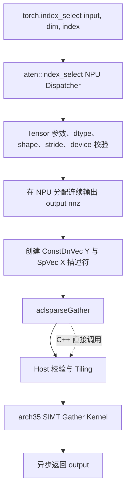
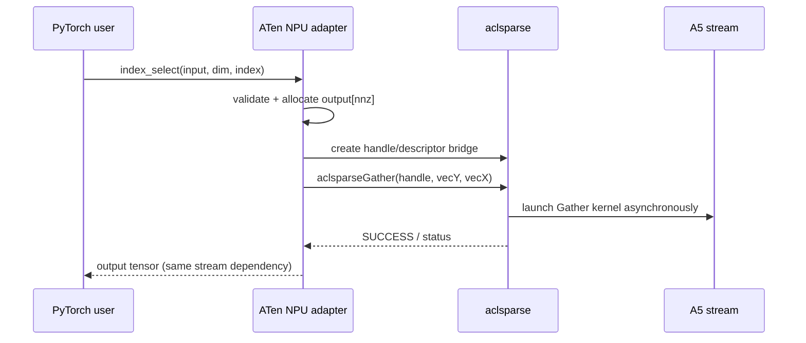
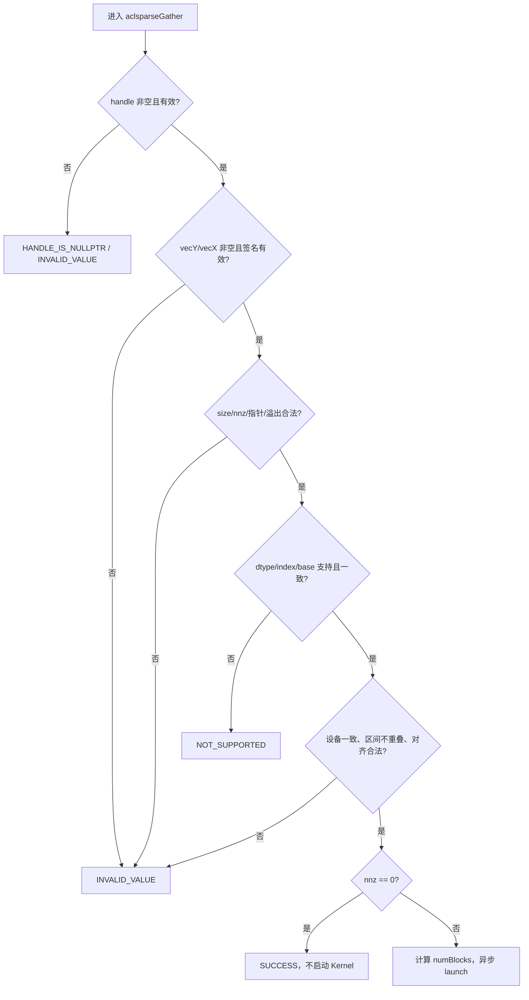
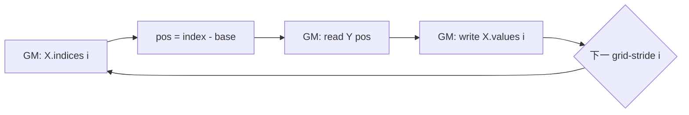

# aclsparseGather 算子设计文档（Ascend 950 / A5）

> 本文档描述实现前的技术设计，不包含实验结果。性能、精度和内存章节给出验收目标、采集口径与测试方案，不预填 NPU 实测数据。

# 需求背景

## 需求来源

- 社区任务：`9月社区任务-aclsparseGather算子开发(950)`。
- 目标硬件：Ascend 950（DAV_3510，`arch35`，下文简称 A5）。
- 代码交付仓库：[`cann/ops-sparse`](https://gitcode.com/cann/ops-sparse) `master` 分支。
- 设计文档仓库：[`cann/cann-ops-competitions`](https://gitcode.com/cann/cann-ops-competitions)。
- C++ 语义参考：cuSPARSE 13.3 Update 1 `cusparseGather`。
- Python/ATen 语义参考：PyTorch 2.7 及以上版本的 `torch.index_select` / `aten::index_select`。

设计以 2026-09-02 拉取的 `ops-sparse` `master`（`e0015bb`）为代码基线。该基线已存在 `sparse/gather/arch35/`，因此采用“复用并补齐”的增量方案，不重复新建同名接口或另一套 Kernel。

## 背景介绍

### Gather 功能

`aclsparseGather` 按稀疏向量的索引，从稠密向量 `Y` 读取元素并原地写入稀疏向量 `X` 的 `values`：

$$
X.values[i] = Y[X.indices[i]-idxBase],\quad i\in[0,nnz)
$$

`X.indices` 可以乱序、重复；重复索引只表示多个输出位置读取同一个 `Y` 元素，不产生写冲突。接口只修改 `X.values`，不修改 `Y` 或 `X.indices`。

Python 公开入口为：

```python
torch.index_select(input, 0, index)
```

本任务只覆盖一维稠密输入、规范化后 `dim=0`、一维 I32 索引的子集。PyTorch 路径固定使用 0-based 索引；C++ Generic API 额外支持 `idxBase=0/1`。

### 现有实现分析

| 模块 | 基线现状 | 本任务差距 |
| --- | --- | --- |
| 公开接口 | `include/cann_ops_sparse.h` 已声明 `aclsparseGather` | 补充任务规格、边界、别名、最大规模和错误行为说明 |
| Host | `gather_host.cpp` 已实现基础校验、`nnz=0` 快速返回、AIV 核数与 block 数计算 | 补 descriptor 签名、指针、I32/base、设备一致性、重叠、规模与溢出校验 |
| Kernel | arch35 SIMT VF，一线程一个输出，grid-stride loop | 新增 `complex64` 8 字节位拷贝实例；保持无数值运算 |
| dtype | FP16/BF16/FP32/FP64 | 新增任务必选 `complex64`；既有 FP64 能力不回退 |
| index | I32/I64、base 0/1 | 任务验收矩阵为 I32、base 0/1；既有 I64 能力保留但不纳入本任务验收声明 |
| Python/ATen | 仓内尚无 Gather 的 `aten::index_select` NPU 适配 | 新增 NPU Dispatcher 注册、Tensor 校验、描述符桥接、输出构造与端到端 UT |
| 测试 | C++ CSV 用例以 FP16/FP32/FP64 为主 | 补 BF16/complex64、异常、别名、空输入、确定性、Python/ATen 和无 CPU fallback 证据 |

# 需求分析

## 需求描述

在 A5 上完善 `aclsparseGather`，并为 PyTorch 2.7+ / torch_npu 26.0.0+ 注册 `aten::index_select` 的 NPU 实现。支持 `float16`、`bfloat16`、`float32`、`complex64`，I32 索引和 index base 0/1；核心路径必须在 NPU 执行，不允许 CPU fallback。

## 需求拆解

### 功能需求

1. `aclsparseGather` 保持既有函数原型和源代码兼容。
2. 精确实现 `X.values[i] = Y[X.indices[i]-idxBase]`，允许乱序和重复索引。
3. 任务验收覆盖 FP16、BF16、FP32、complex64 × I32 × base 0/1。
4. `Y` 与 `X.indices` 只读，只原地更新 `X.values`。
5. 覆盖动态 `size`/`nnz`、尾块、`nnz=0/1`、首尾索引、重复/乱序索引。
6. 同一输入重复执行结果 bit-wise 一致；complex64 的实部、虚部和特殊值位模式均保持。
7. Python 公开路径 `torch.index_select(input, 0, index)` 命中 NPU Dispatcher，并构造不与输入共享 storage 的新输出。

### 接口与资源需求

1. 使用调用方 `handle->stream` 异步下发，不插入无必要 Host 同步。
2. 不申请 workspace，不执行 preprocess，不分配与输入规模线性相关的临时 Host/Device 内存。
3. Host 侧完成可判定的参数检查；Device 索引值域按异步错误协议或调用方前置条件处理，不为逐索引检查增加 D2H 或同步。
4. 描述符和数据指针在 stream 完成前保持有效；Host 描述符由适配层以 RAII 管理。
5. 对空 handle/描述符、失效签名、空数据指针、dtype/index/base 不支持、设备不一致、指针区间重叠、规模溢出返回明确状态。

### 验收需求

1. CPU Golden 高精度生成，四种 dtype 均要求输出 bit-wise exact match。
2. 通过 NPU Dispatch 日志与 Profiler 证明无 CPU fallback。
3. 性能倍率按任务书口径计算，P-01/P-02/P-03 的每个声明 dtype 与 base 组合均达到 0.3 倍 GPU 标杆以上。
4. 无额外 workspace；输出原地复用 `X.values`，内存测试记录 `input_baseline_*_bytes`、`peak_*_bytes`、`extra_peak_*_bytes`。

## 范围与非目标

| 项目 | 本任务范围 | 非目标/处理方式 |
| --- | --- | --- |
| C++ Generic API | `aclsparseGather(handle, vecY, vecX)` | 不新增同功能接口 |
| Python/ATen | 一维 dense `input`，规范化后 `dim=0`，一维 I32 `index` | 多维输入、其他 dim、I64 index 返回明确不支持 |
| PyTorch overload | functional `aten::index_select` | `index_select.out`、Dimname overload 不在本任务范围 |
| index base | PyTorch 路径固定 base 0；C++ 路径 base 0/1 | Python 公开 API 不扩展非标准 `base` 参数 |
| dtype | FP16/BF16/FP32/complex64 | 不做类型提升或混合 dtype；既有 FP64 C++ 能力保持兼容但不作为本任务交付声明 |
| Autograd | 前向算子由 Dispatcher 注册；沿用 PyTorch `index_select_backward` 公式 | 不新增独立 Gather backward Kernel |

## 运行环境基线

| 项目 | 设计基线 |
| --- | --- |
| 硬件 | Ascend 950（A5 / DAV_3510 / `arch35`） |
| CANN | 9.1.0 及后续配套版本；自测报告记录实际版本、驱动和固件 |
| PyTorch | 2.7 及以上 |
| torch_npu | 26.0.0 及之后版本 |
| 代码基线 | `ops-sparse` `master`；实现/验收时记录实际 commit SHA |

# 详细设计

## 算子分析

### 数学公式与不变量

令 `Y` 的逻辑长度为 `sizeY`，`X` 的非零元素数为 `nnz`，`b=idxBase∈{0,1}`：

$$
\forall i\in[0,nnz):\quad p_i=X.indices[i]-b,\quad 0\le p_i<sizeY
$$

$$
X.values[i]\leftarrow Y[p_i]
$$

不变量：

- `Y`、`X.indices` 在调用前后逐字节不变；
- 输出长度始终为 `nnz`，第 `i` 个输出只由第 `i` 个 index 决定；
- 不进行浮点计算、舍入、类型转换或归约；
- 乱序不改变语义，重复 index 不产生输出写冲突；
- `nnz=0` 返回成功且不启动 Kernel。

### 接口原型

#### Python / ATen

```python
torch.index_select(input, dim, index, *, out=None) -> Tensor
```

本任务注册的 ATen functional schema：

```text
aten::index_select(Tensor self, int dim, Tensor index) -> Tensor
```

`out` 参数会路由到 `aten::index_select.out`，不属于本次注册范围。

#### aclsparse C++

```c
aclsparseStatus_t aclsparseGather(
    aclsparseHandle_t handle,
    aclsparseConstDnVecDescr_t vecY,
    aclsparseSpVecDescr_t vecX);
```

接口原型以 `include/cann_ops_sparse.h` 为准，不改变参数顺序、类型或符号名。

### C++ 参数规格

| 参数 | I/O | 规格 | 校验与错误行为 |
| --- | --- | --- | --- |
| `handle` | 输入 | 已创建并绑定调用方 stream 的 aclsparse handle | `nullptr` 返回 `ACL_SPARSE_STATUS_HANDLE_IS_NULLPTR`；设备上下文不一致返回参数错误 |
| `vecY` | 输入 | 连续一维 DnVec；任务 dtype 为 FP16/BF16/FP32/complex64 | 空描述符、失效签名、`size>0` 且 values 为空、dtype 不支持返回错误 |
| `vecX` | 输入输出 | SpVec；indices/values 长度为 `nnz`；任务 index 为 I32；base 0/1；values dtype 与 `vecY` 一致 | 空描述符、失效签名、非法 index/base、dtype 不一致、`nnz>0` 且指针为空返回错误 |

`vecY.values` 和 `vecX.indices` 为只读 Device 数据；`vecX.values` 为唯一写目标。`vecY.values` 与 `vecX.values` 的字节区间不得重叠，`vecX.indices` 与 `vecX.values` 也不得重叠。区间计算使用 checked multiplication/addition，避免 Host 侧整数回绕。

### 支持矩阵

| 层 | values dtype | index dtype | base | 说明 |
| --- | --- | --- | --- | --- |
| 任务 C++ 验收 | FP16/BF16/FP32/complex64 | I32 | 0/1 | 必选矩阵，共 8 个组合 |
| PyTorch/ATen | `torch.float16`/`bfloat16`/`float32`/`complex64` | `torch.int32` | 0 | 公开入口无 base 参数 |
| 既有 C++ 兼容 | FP64、I64 及其既有组合 | 保持基线行为 | 0/1 | 不删除、不降级，但不纳入本任务目标 |

complex64 只做 8 字节位拷贝：Kernel 使用 `uint64_t` 作为 payload，不解释或计算实部/虚部。因此普通值、正负零、INF、NAN 及 NAN payload 都不会因算术操作发生变化。

### 形状与规模边界

| 项目 | 设计限制 |
| --- | --- |
| `sizeY` | `>=0`；`nnz>0` 时必须 `>0` |
| `vecX.size` | `0 <= vecX.size <= sizeY`，保持现有 Generic API 兼容语义 |
| I32/base 0 最大可索引长度 | `sizeY <= 2^31`，最大合法 encoded index 为 `2^31-1` |
| I32/base 1 最大可索引长度 | `sizeY <= 2^31-1`，最大合法 encoded index 为 `2^31-1` |
| `nnz` | `0 <= nnz <= INT64_MAX`，并满足 indices/values 字节数可由 `size_t` 表示 |
| 合法 index | base 0 为 `[0,sizeY)`；base 1 为 `[1,sizeY]` |

Host 无法在保持全异步、零 workspace 的同时逐个读取 Device indices。故 C++ Generic API 将合法 index 作为调用方前置条件，并在接口文档中明确；ATen 层复用 torch_npu 的异步索引错误上报机制，不通过 CPU 读取索引。

## 算子实现

### 总体架构



分层职责：

| 层 | 职责 |
| --- | --- |
| Python/ATen | 对齐公开 schema；校验 Tensor 元数据；分配输出；绑定当前 NPU stream；错误码转 PyTorch 异常 |
| aclsparse Host | 校验 opaque descriptor 与指针关系；生成小型按值 TilingData；选择模板实例并异步 launch |
| Ascend C Kernel | 按 I32 index 从 GM 随机读 `Y`，向连续 `X.values` 写回；无算术、无归约、无原子操作 |

### Python / ATen 侧设计

#### Dispatcher 与调用时序

新增 Gather NPU adapter，注册 functional `aten::index_select` 对应 NPU dispatch key。注册函数仅处理任务约束内组合；未支持组合返回带参数信息的明确错误，不 redispatch 到 CPU。



#### Tensor 校验

| 项目 | 支持条件 | 不满足时 |
| --- | --- | --- |
| input rank | 一维 | `TORCH_CHECK` 明确提示仅支持 1-D |
| dim | 规范化后为 0；一维输入的 `-1` 规范化为 0 | 其他值返回不支持 |
| index rank | 一维 | 返回参数错误 |
| input dtype | FP16/BF16/FP32/complex64 | 返回不支持，不做隐式 cast |
| index dtype | I32 | I64 等返回不支持，不做 CPU/Device 转换 |
| layout | `torch.strided` | 稀疏、mkldnn 等 layout 返回不支持 |
| stride | input/index 均连续；output 连续 | 非连续输入明确返回不支持，不隐式 materialize |
| device | input/index 都是 NPU 且同 device | CPU、混合设备或不同 NPU 返回错误 |
| empty | index 为空时返回同 dtype/device 的 `[0]` 连续 Tensor | input 为空且 index 非空返回索引错误 |

PyTorch 索引固定为 0-based，所以 adapter 创建 `SpVec` 时使用 `ACL_SPARSE_INDEX_BASE_ZERO`。base 1 只通过 C++ API 和验收测试 hook 覆盖，不改变公开 PyTorch schema。

#### 输出与 alias 语义

- functional `index_select` 新分配 `[index.numel()]` 连续输出，dtype/device 与 input 相同；
- output 不与 input 或 index 共享 storage；
- input 和 index 不原地修改；
- `nnz=0` 仍返回独立的空 Tensor；
- 重复 index 在 output 中保留相同次数和原顺序；
- `index_select.out` 不在本次注册范围，避免把 functional 与 out alias 语义混合。

#### Stream 与生命周期

adapter 在 input 的 device guard 下取得当前 NPU stream，并设置到 aclsparse handle。描述符只持有 Tensor 数据指针的弱引用；Tensor/输出对象由框架保证至少存活到当前 stream 完成。Host 描述符在 launch 返回后可由 RAII 销毁，因为 Kernel 参数已按值封装，Device 数据不随描述符释放。

### Host 侧设计

#### 参数检查顺序



校验细节：

1. 校验 handle、descriptor 指针与 descriptor signature，拒绝已销毁或类型不匹配对象。
2. 校验 `nums/size/nnz` 的逻辑关系、I32 可表示范围和字节数乘法溢出。
3. `nnz>0` 时校验 `vecY.values`、`vecX.indices`、`vecX.values` 非空；`nnz=0` 允许空 indices/values。
4. 校验 `vecX.valueType == vecY.valueType`；任务类型加入 `ACL_COMPLEX64`。
5. 任务路径要求 `ACL_SPARSE_INDEX_32I`、base ZERO/ONE。为兼容已合入代码，I64 既有模板保留；Python adapter 只创建 I32 描述符。
6. 通过 checked address-range 计算拒绝 `Y.values↔X.values`、`X.indices↔X.values` 重叠。
7. 对齐遵循 cuSPARSE Gather 参考约束：`vecX.indices` 与 `vecX.values` 至少 16 字节对齐；框架分配路径天然满足，C++ 非对齐调用返回参数错误。
8. 设备一致性不改变公开 ABI：在内部 handle、DnVec、SpVec 描述符中缓存创建/绑定时的 device id，Gather 比较三者；字段仍处于 opaque 内部结构，不暴露给调用方。

错误码映射：

| 状态 | 场景 |
| --- | --- |
| `ACL_SPARSE_STATUS_SUCCESS` | 参数合法；`nnz=0` 快速返回或 Kernel 成功下发 |
| `ACL_SPARSE_STATUS_HANDLE_IS_NULLPTR` | `handle == nullptr` |
| `ACL_SPARSE_STATUS_INVALID_VALUE` | descriptor/签名/指针/shape/base/设备/对齐/重叠/规模不合法 |
| `ACL_SPARSE_STATUS_NOT_SUPPORTED` | dtype 或 index type 不在保留支持矩阵内 |
| `ACL_SPARSE_STATUS_INTERNAL_ERROR` | AIV 核数查询失败、block 数异常或内部状态错误 |

Kernel 执行期的索引越界或 Device 异常通过调用方 stream 的异步错误协议上报；Host 返回成功仅表示参数检查通过且 launch 已提交，不代表 stream 已完成。

#### Tiling 与分核

沿用现有 `GatherTilingData`：

```cpp
struct GatherTilingData {
    int64_t nnz;
    uint32_t numBlocks;
    aclDataType valType;
    aclsparseIndexType_t idxType;
    aclsparseIndexBase_t idxBase;
};
```

线程数固定为已有的 `kGatherMaxThreadsPerBlock = 256`，block 数动态计算：

$$
numBlocks=\min\left(\left\lceil\frac{nnz}{256}\right\rceil,\ maxAivCoreNum\right)
$$

`maxAivCoreNum` 通过 `PlatformAscendCManager::GetCoreNumAiv()` 获取，不写死芯片核数。`nnz=0` 在计算 block 数前返回；`numBlocks=0` 视为内部错误，不 launch。

### Kernel 侧设计

#### 技术路线

Gather 是随机读、连续写、无算术的 memory-bound 索引算子。稠密 `Y` 的访问位置不可预知，将整个 tile 预搬入 UB 不会提高复用率，反而增加搬运和容量开销。因此复用 arch35 现有 SIMT VF 方案：每个线程处理一个或多个输出位置，直接从 GM 读取并写回 GM。

#### 关键 API 映射与证据

| 设计动作 | API/语言机制 | 基线证据（`ops-sparse@e0015bb`） | 结论 |
| --- | --- | --- | --- |
| 获取 AIV 核数 | `PlatformAscendCManager::GetCoreNumAiv()` | `sparse/common/aclsparse_host_utils.h`、`sparse/gather/arch35/gather_host.cpp` | 目标仓现有 arch35 路径已使用，直接复用 |
| 启动 SIMT VF | `asc_vf_call<...>` | `sparse/gather/arch35/gather_kernel.cpp` | 现有 Gather 主路径，直接复用 |
| GM 随机读/连续写 | `__gm__` 指针标量 load/store | 同文件已覆盖 2/4/8 字节 payload（FP16/FP32/FP64） | complex64 复用 8 字节宽度，以 `uint64_t` 位拷贝 |
| 异步下发 | `<<<numBlocks, nullptr, stream>>>` | `gather_kernel_do` 现有 launch 形式 | 沿用调用方 stream，不引入同步 |
| 获取当前设备 | 仓内 ACL runtime device 查询方式 | `sparse/scatter/arch22/scatter_host.cpp` 已有 device 查询先例 | 仅用于 opaque 元数据一致性，不读取 Device tensor 内容 |

本方案不调用 `DataCopy`、Vector 算术、原子或归约 API，因此不存在 UB 对齐、tmpBuffer、舍入模式或累加顺序相关的 API 约束。新增 `uint64_t` 模板实例须在实现阶段通过 A5 编译门禁；文档不将尚未编译的新增实例描述为实测通过。

#### 模板实例

| 任务 dtype | Kernel payload 类型 | 字节数 | 处理方式 |
| --- | --- | ---: | --- |
| FP16 | `__fp16` | 2 | 位保持标量拷贝 |
| BF16 | `__fp16` payload | 2 | 与基线一致，仅按 2 字节拷贝，不做 FP16 计算 |
| FP32 | `float` | 4 | 位保持标量拷贝 |
| complex64 | `uint64_t` | 8 | 实部+虚部整体位拷贝 |

index 类型为 I32；base 0/1 作为编译期模板参数，消除循环内 base 分支。既有 FP64/I64 模板继续保留以避免回归。

#### 核心伪代码

```cpp
template <typename PayloadT, aclsparseIndexBase_t IndexBase>
__simt_vf__ __aicore__ void GatherSimtCompute(
    __gm__ const int32_t* indices,
    __gm__ const PayloadT* yValues,
    __gm__ PayloadT* xValues,
    int64_t nnz)
{
    int64_t tid = threadIdx.x + blockIdx.x * blockDim.x;
    int64_t stride = blockDim.x * gridDim.x;
    for (int64_t i = tid; i < nnz;) {
        int64_t pos = static_cast<int64_t>(indices[i]) - IndexBase;
        xValues[i] = yValues[pos];
        if (stride >= nnz - i) {
            break;
        }
        i += stride;
    }
}
```

#### 数据流



单元素流量：

| dtype | index 读取 | Y 读取 | X 写回 | 合计 |
| --- | ---: | ---: | ---: | ---: |
| FP16/BF16 | 4 B | 2 B | 2 B | 8 B/element |
| FP32 | 4 B | 4 B | 4 B | 12 B/element |
| complex64 | 4 B | 8 B | 8 B | 20 B/element |

#### 尾块与确定性

- `i < nnz` 是唯一尾块条件，任意 `nnz` 均不越过输出边界；
- 更新 `i` 前用 `stride >= nnz-i` 判断终止，避免接近 `INT64_MAX` 时发生有符号加法回绕；
- 每个 `i` 只由唯一线程写一次，无原子操作、归约或跨核通信；
- 重复 index 仅重复读取 `Y[pos]`，不会写同一输出地址；
- complex64 整体 8 字节复制，不改变实部/虚部位模式；
- 同一输入和相同 Kernel 配置 bit-wise 可复现。

### 内存与 UB 预算

本方案不创建 `TPipe/TQue/LocalTensor`，不使用 UB staging，也不需要 workspace。

| 区域 | 大小 | 生命周期 | 说明 |
| --- | ---: | --- | --- |
| GM `Y.values` | `sizeY*sizeof(dtype)` | 调用方持有 | 只读输入 |
| GM `X.indices` | `nnz*4` | 调用方持有 | I32，只读输入 |
| GM `X.values` | `nnz*sizeof(dtype)` | 调用方持有 | 原地输出 |
| UB | 0 B | 不适用 | SIMT 直接 GM 访问 |
| Workspace | 0 B | 不适用 | 无 preprocess、无临时全局数组 |

UB 验证：`sum(InitBuffer)=0 B <= DAV_3510 可用 UB`，不存在 UB 超限风险。

### 代码落位

| 路径 | 设计变更 |
| --- | --- |
| `include/cann_ops_sparse.h` | 保持原型，完善 dtype/index/base、异步、别名、边界和生命周期注释 |
| `sparse/common/aclsparse_handle_internal.h` | opaque 内部缓存 device id（若公共层尚无等价字段） |
| `sparse/common/aclsparse_descr_internal.h/.cpp` | opaque DnVec/SpVec 缓存 device id 并保持签名校验 |
| `sparse/gather/arch35/gather_host.cpp` | 完整参数、区间、溢出与设备校验；complex64 dispatch |
| `sparse/gather/arch35/gather_kernel.cpp` | 增加 `ACL_COMPLEX64 -> uint64_t`、I32、base 0/1 模板实例 |
| `sparse/gather/README.md` | 同步任务规格、限制和示例 |
| `python/npu_sparse_gather/` | `aten::index_select` NPU 注册、C++ bridge、Python/ATen UT |
| `test/gather/arch35/` | C++ 功能、异常、确定性、complex64、输入只读性与边界用例 |
| `test/gather/self_test/` | 接入任务包精度、性能、内存和 Profiler 口径 |

具体文件名遵循 `ops-sparse` 实现时的 Python adapter 公共目录规范；如仓库已形成统一 torch adapter 框架，仅调整落位，不改变接口和数据流契约。

## 支持硬件

| 支持的芯片版本 | 支持状态 |
| --- | --- |
| Ascend 950（DAV_3510 / `arch35`） | √ |
| A2/A3 等其他架构 | 本任务不新增；由相应架构目录或并行任务覆盖 |

## 算子约束限制

- A5 任务 values dtype：FP16/BF16/FP32/complex64；C++ 既有 FP64 能力保持兼容。
- 任务 index dtype：I32；C++ 既有 I64 能力保持兼容，但 Python adapter 不接受 I64。
- index base：C++ 支持 0/1；PyTorch 固定为 0。
- `Y` 为连续一维向量；`X.indices`/`X.values` 为长度 `nnz` 的连续一维数组。
- index 可以乱序或重复，但每个换算后的值必须位于 `[0,sizeY)`。
- 不支持 `Y.values` 与 `X.values` 重叠，也不支持 indices 与输出 values 重叠。
- 不使用 workspace/preprocess，不做 CPU fallback，不插入 Host 同步。
- functional PyTorch 输出不与 input/index 共享 storage；`index_select.out` 不在本任务范围。

# 可维可测分析

## 测试方案

### 分层测试

| 层 | 测试内容 | 关键证据 |
| --- | --- | --- |
| Python 端到端 | `torch.index_select(input,0,index)` 四 dtype、动态规模、空 index、乱序/重复、异常和 alias | 输出/异常与 CPU 语义对齐；输入未修改 |
| ATen Dispatcher | `aten::index_select` NPU 注册命中、同 device/stride/layout 检查 | Dispatch 日志无 CPU kernel |
| aclsparse C++ | handle/descriptor/pointer/dtype/index/base/size/overlap/alignment/设备校验 | 返回码、输入只读、边界 canary |
| Ascend C Kernel | 四 dtype × base 0/1、`nnz=0/1`、尾块、首尾/重复/乱序索引 | bit-wise exact、重复执行一致 |
| Profiler | P-01/P-02/P-03 及泛化用例 | 仅出现 NPU Gather 路径，无 CPU fallback |
| 资源鲁棒性 | 连续创建、执行、销毁 handle/descriptor | 无泄漏、无非法同步、无额外 workspace |

### 核心场景

| 类别 | 必测场景 |
| --- | --- |
| 基础功能 | 不同 `size`/`nnz`/稀疏度，四 dtype，base 0/1 |
| 索引形态 | 顺序、乱序、重复、首元素、末元素、`nnz=0/1`、非 256 倍数尾块 |
| 数值 | 正负混合、正负零、小值、离群值、INF/NAN；complex64 实/虚部专项 |
| 异常 | 空/失效描述符、空指针、dtype/device 不一致、非法 index type/base、非连续 Tensor、重叠区间、规模溢出 |
| 一致性 | 相同输入多次执行逐字节一致；`Y` 和 indices 调用前后逐字节不变 |
| PyTorch | shape/dtype/device/storage alias、functional overload、无 CPU fallback |

### 用例生成规则

- values 使用固定随机种子：70% 来自 `[-1,1]` 均匀分布，20% 来自 `μ=0, σ=1` 正态分布，10% 覆盖正负零、边界值、离群值以及规格允许的 INF/NAN；
- FP16/BF16 先以 FP32 生成，FP32 以 FP64 生成，complex64 的实部/虚部分别以 FP64 生成后转换为目标 dtype；
- indices 在合法区间均匀生成，并以专项用例固定覆盖顺序、乱序、重复、首尾、base 0/1、`nnz=0/1` 和尾块；
- 非法用例单独构造负 index、上界 index、非法 base/type、空指针、重叠区间和设备不一致，不与合法随机用例混合；
- 复用任务包 `accuracy_cases.json` 的 200 条泛化用例与 `performance_cases.json` 的 P-01/P-02/P-03，保证 case id、seed 和参数可追溯。

## 精度标准

- CPU Golden：FP16/BF16 输入在 FP32 生成，FP32 在 FP64 生成，complex64 在 complex128 生成，再转换为目标 dtype 后按 index 选择；
- 由于 Kernel 只执行位拷贝，四种 dtype 输出均要求 bit-wise exact match，不使用 rtol/atol 放宽；
- complex64 的实部和虚部分别 exact match，同时比较完整 8 字节 payload；
- NAN 按任务精度标准的规则处理，并额外检查位模式未因算术转换改变；
- 校验 `Y`、indices 和输出缓冲 canary，确认非目标数据未修改。

## 性能标准与采集口径

性能倍率：

$$
ratio=\frac{GPU\ device\ Event\ median\ time}{NPU\ 同调用范围全部 Kernel\ median\ time}
$$

- 每 case 预热不少于 10 次，采样 30 次，报告 median 与 p90；
- 不计首次编译、数据生成、Host-to-Device 搬运和无关初始化；
- 固定随机种子，复用 handle/descriptor；
- 同时报告 aclsparse Kernel 与 Python/ATen 端到端耗时；
- 设计阶段不预填 NPU 实测结果。

| 场景 | size | nnz | dtype/base 组合 | GPU median 基线 | NPU 目标 |
| --- | ---: | ---: | --- | --- | --- |
| P-01 Llama 3.1 70B | 128256 | 8192 | 4 dtype × base 0/1 | 任务书记录 27.488–32.736 μs | 每组合 `ratio >= 0.3` |
| P-02 Qwen3-235B-A22B | 151936 | 4096 | 4 dtype × base 0/1 | 任务书记录 31.056–31.264 μs | 每组合 `ratio >= 0.3` |
| P-03 DeepSeek-V3 | 129280 | 7168 | 4 dtype × base 0/1 | 任务书记录 30.832–31.072 μs | 每组合 `ratio >= 0.3` |

预期瓶颈为 Kernel launch 与随机 GM 读延迟。设计中的优化点是：无 UB 中转、无数值转换、base 编译期特化、动态多 AIV block、grid-stride 覆盖大 `nnz`。任何后续优化必须保持每个输出地址单写和 complex64 位保持语义。

## 内存标准

- 输入输出总量：`sizeY*sizeof(dtype) + nnz*4 + nnz*sizeof(dtype)`；
- 输出复用 `X.values`，workspace 固定为 0；
- Python functional 路径只新增语义必需的 output Tensor，不新增第二份线性临时数组；
- 使用任务包的 GPU/NPU 内存采集脚本比较 `input_baseline_*_bytes`、`peak_*_bytes`、`extra_peak_*_bytes`；
- 若输入输出总量超过 500 MB，按任务书验证 NPU 额外内存不超过 GPU 使用内存总量的 50%；否则记录 workspace=0 与实际峰值。

## 可维护性与可观测性

- Host 使用仓内 `OP_LOGE/OP_LOGD`，错误日志包含参数名、实际值和支持范围；
- dtype/base/index 模板映射集中在 `gather_kernel_do`，新增类型不复制主循环；
- `GatherTilingData` 保持 Host/Kernel 单一定义，按值传递，无跨阶段状态；
- README、公开头文件注释、C++ UT、Python UT 与任务自测用例同步更新；
- Profiler 中 Kernel 名称稳定可识别，便于证明 NPU Dispatch。

## 兼容性分析

- 公开 `aclsparseGather` 原型不变，新增 complex64 属能力扩展；
- 保留基线 FP64/I64 模板和行为，避免现有调用方回归；
- opaque descriptor 仅增加内部 device 元数据，不改变公开类型或调用方式；
- arch35 代码继续位于 `sparse/gather/arch35/`，不侵入 A2/A3 Kernel；
- Python 只注册任务约束内的 functional overload，不覆盖 `out`/Dimname overload；
- 若 A2/A3 公共 Host 逻辑已进入主干，实现时复用公共校验并保留各自 arch 目录。

## 风险与应对

| 风险 | 影响 | 应对 |
| --- | --- | --- |
| torch_npu 实际 dispatch key/adapter 框架与设计时仓库目录不同 | 注册未命中 | 实现前读取 torch_npu 26.0.0 实际 backend 配置；以 Dispatch dump/Profiler 为门禁，不以文件名判断成功 |
| complex64 使用语言复数类型触发编译器/ABI 差异 | 位模式或编译失败 | 使用已由基线 8 字节 GM 拷贝路径支撑的 `uint64_t` payload，不做复数算术 |
| Device index 越界无法在 Host 无同步检查 | 非法访问 | C++ 文档明确前置条件；ATen 复用 torch_npu 异步索引错误协议；异常 UT 覆盖 |
| descriptor device 元数据影响公共结构 | 其他算子回归 | 字段保持 opaque、默认初始化；补 descriptor 与既有算子回归 UT；若主干已有等价公共机制则直接复用 |
| 小 `nnz` 启动开销占主导 | 0.3 倍目标风险 | `nnz=0` 不启动；`nnz>0` 单 Kernel 完成，不引入 preprocess/workspace/额外同步 |

## 需求承接矩阵

| 任务要求 | 设计承接位置 |
| --- | --- |
| 四 dtype、I32、base 0/1 | 支持矩阵、Kernel 模板实例 |
| complex64 全链路 | 支持矩阵、Python/ATen、`uint64_t` Kernel payload、测试方案 |
| Python/ATen 必选 | Python/ATen 侧设计、代码落位、分层测试 |
| 无 CPU fallback | 总体架构、Dispatcher、Profiler 测试 |
| 异步、无 workspace/同步 | Host/Kernel、Stream 生命周期、内存与 UB 预算 |
| 动态规模、乱序/重复、尾块、`nnz=0/1` | 形状边界、grid-stride、核心场景 |
| bit-wise 一致 | 数学不变量、complex64 位拷贝、确定性、精度标准 |
| 输入只读与 alias | C++ 参数规格、输出与 alias、C++ 异常测试 |
| 性能 `>=0.3` | 性能标准与 P-01/P-02/P-03 表 |
| A5 / arch35 | 需求来源、支持硬件、代码落位 |
