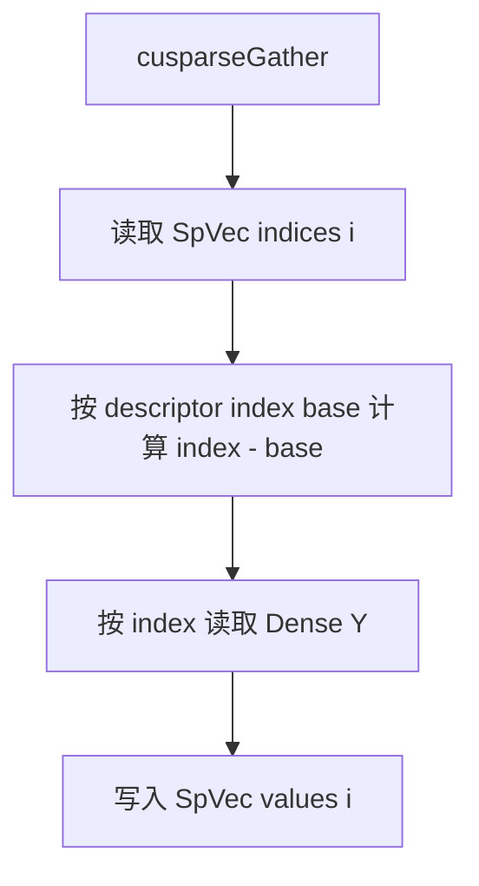
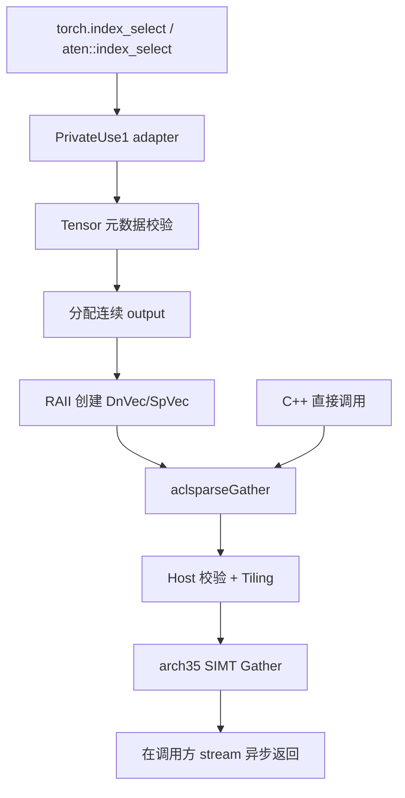
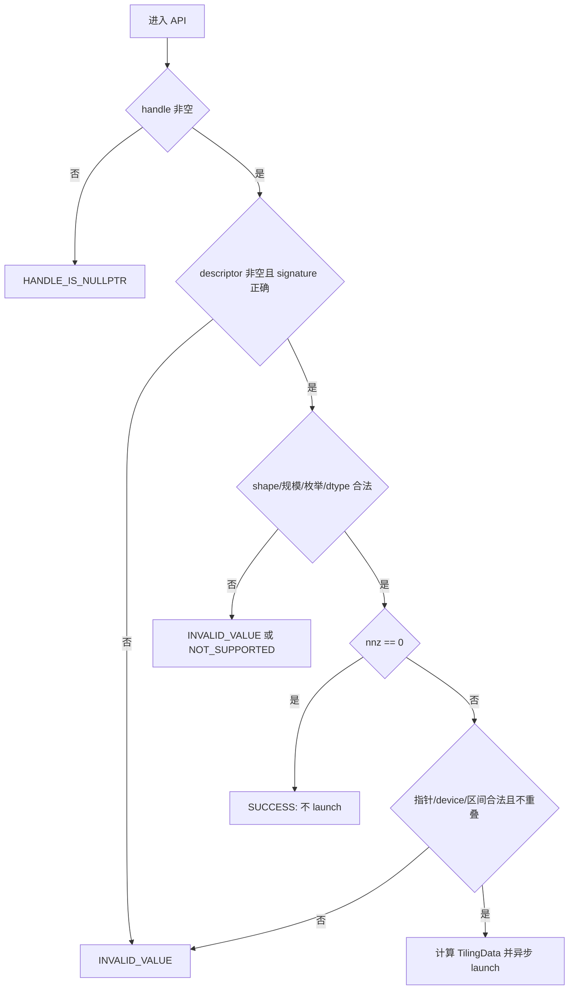
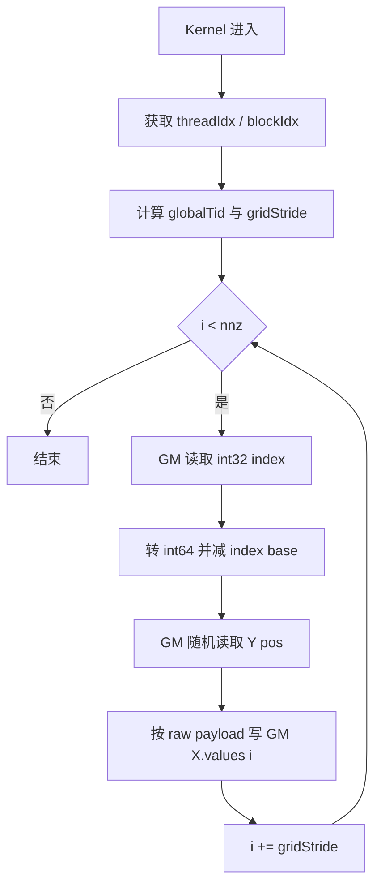

# aclsparseGather 算子设计文档（Ascend 950 / A5）

> 设计日期：2026-09-06。  
> `ops-sparse` 基线：`master@9a514470c2cc99e469c34a615048eb8b30a66694`。  
> 目标环境：Ascend 950（DAV_3510 / `arch35`）、CANN 9.1.0+、PyTorch 2.7+、torch_npu 26.0.0+。
> 文档状态：设计评审稿；尚未在 Ascend 950 实机完成实现、精度与性能验证。

本文事实基于任务书、`aclsparseGather_jobbook/test_cases/`、当前 `ops-sparse` 源码及 `task_outline/task_outline.md`、
`task_outline_00.md`～`task_outline_05.md`。请求中列出的 `task_outline_06.md`、`task_outline_07.md`
在当前工作区不存在，未作为设计依据；相关空缺不以推测补齐。

# 需求背景（required）

## 需求来源

本设计对应 CANN 社区任务 `aclsparseGather`（Ascend 950），任务书参考 cuSPARSE 13.3 Update 1
`cusparseGather` 的 C++ 接口语义，并要求把 C++ Generic API、Ascend C Kernel、C++ 测试及
Python/ATen NPU 适配统一交付至 `cann/ops-sparse` `master`。设计文档提交至
`cann/cann-ops-competitions` 对应任务目录。

最终验收以任务书的功能、逐位精度、性能、内存和交付要求为准。任务书与附件有冲突时，设计采用
更严格门禁，并在测试报告中保留两份来源。

## 背景介绍

### 算子功能

`aclsparseGather` 从稠密向量 `Y` 按稀疏向量 `X` 的索引读取元素，并原地覆盖 `X.values`：

$$
X.values[i] = Y[X.indices[i]-idxBase],\quad i\in[0,nnz)
$$

- `vecY.values` 和 `vecX.indices` 只读，仅 `vecX.values` 是写目标。
- indices 可以乱序和重复；重复只产生多次读取，不产生输出写冲突。
- 计算没有浮点算术、类型转换和归约，适合按原始位宽搬运。
- `nnz=0` 成功返回且不启动 Kernel。
- 接口使用调用方 stream 异步下发，无 preprocess、无算子 workspace。

Python 公开入口为：

```python
torch.index_select(input, 0, index)
```

本任务只覆盖一维、dim 规范化后为 0、I32 index、连续 strided NPU Tensor。PyTorch 路径固定使用
0-based index；C++ Generic API 支持 base 0/1。

### 现有实现分析

| 模块 | 当前基线 | 与任务书的差距 |
| --- | --- | --- |
| 公开 API | `include/cann_ops_sparse.h` 已有正确函数原型 | 注释未完整说明 dtype、规模、alias、异步生命周期与错误边界 |
| Host | 基础空参/dtype/shape 校验、`nnz=0` 快速返回、AIV block 计算 | 未检查 descriptor signature、数据指针、base/index、重叠和溢出；缺 complex64 |
| Kernel | arch35 SIMT VF + grid-stride；FP16/BF16/FP32/FP64、I32/I64、base0/1 | 缺 complex64；Host/测试使用 `__fp16` 存在可移植构建问题；调优参数无本任务 A5 证据 |
| C++ 测试 | CSV 共 97 个 case，主要覆盖 FP16/FP32/FP64 | 缺 BF16/complex64、`nnz=0`、异常、alias、输入只读、逐位特殊值和性能证据 |
| PyTorch/ATen | `ops-sparse` 当前无 Gather adapter | 必须增加 NPU Dispatcher、stream/描述符桥接、输出构造和 ATen/Python UT |
| torch_npu | 2.7.1.post4 已注册 `aten::index_select/PrivateUse1` | 新 adapter 必须受控覆盖并验证最终注册来源，不能假设槽位为空 |

## 标杆算子分析

### 标杆来源与适用依据

任务书指定 NVIDIA cuSPARSE 13.3 Update 1 的 `cusparseGather` 为标杆。本文只使用以下可追溯依据：

1. [cuSPARSE 官方文档](https://docs.nvidia.com/cuda/cusparse/)公开的接口、descriptor、数据类型、
   index base、异步与额外存储语义；
2. Jobbook 给出的任务范围和验收规则；
3. `aclsparseGather_jobbook/test_cases/baseline_results/gpu_full_results.tsv` 中的 GPU Event 基线。

`cusparseGather` 是闭源库，公开资料不提供可供分析的 TBE Python 源码，也不存在本任务可引用的
Ascend 算子信息库条目。因此，Checklist 中“标杆 TBE 源码/算子信息库”的检查项在本任务不适用，
不能据此虚构其线程划分、cache、shared memory、向量化或内部 tiling。

### 官方接口、语义与能力

官方接口为 `cusparseGather(handle, vecY, vecX)`：`vecY` 是只读稠密向量 descriptor，`vecX` 是可写
稀疏向量 descriptor，按 `vecX.indices` 从 `vecY.values` 读取并写入 `vecX.values`。结合 SpVec descriptor
的 index base，统一表达为：

$$
X.values[i]=Y[X.indices[i]-idxBase]
$$

| 项目 | cuSPARSE 公开能力 | 本任务采用范围 |
| --- | --- | --- |
| descriptor | ConstDnVec 输入、SpVec 输入输出 | 保持 aclsparse 对应 Generic API 形态 |
| 输入/输出 | 读取 Dense Y 和 SpVec indices，覆盖写 SpVec values | Y/indices 只读，X.values 为唯一写目标 |
| 数据格式/布局 | 一维 vector descriptor；数组地址遵循官方对齐约束 | 一维连续 GM 数组；PyTorch 限 contiguous strided |
| index | 32-bit、64-bit；base zero/one | I32 × base0/1 为验收范围，保留基线 I64 兼容 |
| value dtype | 公开列出 `CUDA_R_16F/R_16BF/R_32F/R_64F/C_32F/C_64F` 等类型 | FP16、BF16、FP32、complex64 为验收范围 |
| index 顺序 | 无需排序 | 支持乱序、重复索引 |
| extra storage | 无 | Gather workspace 为 0 |
| stream | 异步执行 | 使用 handle 绑定的调用方 stream |
| 对齐 | 官方 Gather 对 descriptor 数组提出 16-byte alignment 约束 | 不直接移植；aclsparse 按真实 ABI/自然对齐校验，额外要求待维护者确认 |
| 确定性 | 官方公开保证在 indices distinct 时 bit-wise deterministic | Jobbook 更严格：任务支持的合法重复索引也必须逐位确定 |

cuSPARSE 内部 Kernel 组织公开资料不可见；GPU baseline 只能证明测试入口的可观察耗时，不能反推其内部算法。
当前任务包没有原生 `cusparseGather` CUDA 源码；manifest 将 GPU TSV 的来源标记为 `pytorch_gpu`。
因此 cuSPARSE 用于功能语义标杆，TSV 用于任务指定的性能门禁，不能把 TSV 反述为 cuSPARSE 内核实测。

### 标杆算子公开语义流程



该图只描述官方接口可以确认的逻辑语义，不代表 cuSPARSE 未公开的线程、缓存或存储实现。

# 需求分析（required）

## 需求描述

在 Ascend 950 上完善 `aclsparseGather`，支持 FP16、BF16、FP32、complex64 × I32 × base0/1，
保持 bit-wise exact、输入只读、无额外 workspace和异步 stream 语义；同时使约束范围内的
`torch.index_select` / `aten::index_select` 命中该 NPU Kernel，禁止 CPU fallback。

## 外部组件依赖

| 组件 | 本任务用途 | 构建关系 |
| --- | --- | --- |
| CANN 9.1.0+ | 提供 Ascend 950 编译、运行与算子库基础环境 | C++/Kernel 必需 |
| ACL Runtime | Device 内存、stream、设备属性、Kernel launch 与错误码 | C++/Kernel 必需 |
| Ascend C / Bisheng | 编译 DAV_3510 `__aicore__` SIMT Kernel | Kernel 必需 |
| PyTorch 2.7+ | `aten::index_select` schema、Tensor 与测试入口 | 仅 adapter 可选构建 |
| torch_npu 26.0.0+ | PrivateUse1 后端、当前 NPU stream 与设备 guard | 仅 adapter 可选构建 |
| ATen Dispatcher | 注册并核验 `aten::index_select/PrivateUse1` 的实际实现 | 仅 adapter 可选构建 |
| ATK | 生成并执行 1000 条泛化精度用例 | 测试依赖，不进入运行库 |
| msprof | 证明 Kernel 路径、统计全部 Kernel 时间、排查同步/回填 | 验收工具，不进入运行库 |

版本组合、include/API 名称和 ABI 必须在正式镜像中确认；文档中的最低版本来自任务要求，不表示当前本地
CPU 容器已经具备完整 Ascend 950 工具链。

## 内部适配模块

| 模块 | 当前真实路径 | 状态/职责 |
| --- | --- | --- |
| public aclsparse API | `ops-sparse/include/cann_ops_sparse.h` | 已存在；保持原型和 ABI |
| DnVec/SpVec descriptor | `ops-sparse/sparse/common/aclsparse_descr_internal.h`、`aclsparse_descr.cpp` | 已存在；保存 size/nnz/data/type/base/signature |
| handle/stream | `ops-sparse/sparse/common/aclsparse_handle_internal.h`、`aclsparse_auxiliary.cpp` | 已存在；提供 stream 与固定默认 workspace |
| Gather Host | `ops-sparse/sparse/gather/arch35/gather_host.cpp` | 已存在；校验、分核、分派和 launch |
| arch35 Kernel/Tiling | `ops-sparse/sparse/gather/arch35/gather_kernel.cpp`、`gather_kernel.h`、`gather_tiling_data.h` | 已存在；SIMT grid-stride Gather |
| C++ 测试框架 | `ops-sparse/test/frame/`、`ops-sparse/test/gather/` | 已存在；CSV 参数、wrapper、golden、GTest |
| PyTorch adapter | 待实现阶段在 `ops-sparse` 内确定最终路径 | 当前不存在；ATen 到 aclsparse bridge，不写成既有模块 |
| task test hook | 待实现阶段在测试扩展中确定最终路径 | 当前不存在；提供 `ops_sparse_test.gather_npu` |
| build/CMake | `ops-sparse/CMakeLists.txt`、`sparse/CMakeLists.txt`、`cmake/test.cmake`、`test/gather/CMakeLists.txt` | 已存在；默认构建和测试接入，adapter 必须保持可选 |

## Ascend C 算子原型

```c
aclsparseStatus_t aclsparseGather(
    aclsparseHandle_t handle,
    aclsparseConstDnVecDescr_t vecY,
    aclsparseSpVecDescr_t vecX);
```

原型以 `ops-sparse/include/cann_ops_sparse.h` 为唯一准绳，不增加 workspace query/preprocess API，
不改变参数顺序、类型、符号可见性或 descriptor ABI。

## Ascend C 算子相关约束

- Jobbook 验收范围：Ascend 950、FP16/BF16/FP32/complex64、I32、base0/1。
- `Y`、indices、output 为连续一维 Device 存储；indices 减 base 后须落在 `[0,Y.size)`。
- indices 可乱序、重复；`Y` 与 indices 只读，`X.values` 连续写且不得与输入区间重叠。
- `nnz=0` 成功返回且不启动 Kernel；非空调用保持异步，不做 D2H index 扫描。
- Gather 自身 workspace 为 0；不得引入与输入规模线性相关的临时 Device/Host buffer。
- 当前源码额外支持 FP64/I64，作为兼容路径保留回归，但不扩大本任务承诺。

## 需求拆解

### 功能与接口

1. 保持 `aclsparseGather(handle, vecY, vecX)` 的符号、参数顺序和类型不变。
2. 补齐 complex64 及四种 dtype 的位拷贝路径，覆盖 I32/base0/1。
3. 补全 Host 可判定的 descriptor、shape、dtype、index/base、指针、device、重叠和溢出校验。
4. `nnz=0` 不启动 Kernel；零长度 Y 仅允许该情况。
5. 合法索引、尾块、乱序/重复索引和动态规模均正确；Y/indices 不被修改。

### Python/ATen

1. 覆盖 functional `aten::index_select(Tensor self, int dim, Tensor index) -> Tensor` 的约束路径。
2. 检查 rank、dim、layout、stride、dtype、index dtype 和 device；不支持组合明确报错。
3. functional 输出使用新 storage，shape 为 `[index.numel()]`，dtype/device 与 input 相同。
4. 取得 torch_npu 当前原生 stream，调用 aclsparse，不在热路径同步或回落 CPU。
5. 通过 dispatch table 与 Profiler 同时证明最终路径。

### 验收

1. 四种 dtype 均逐元素 bit-wise exact，包含 complex 实/虚部、正负零、INF/NAN 及重复执行。
2. P-01/P-02/P-03 共 24 个 dtype/base 组合全部达到性能倍率 `>=0.3`。
3. 至少 10 次预热、30 次采样，分别报告 aclsparse Kernel 与 Python/ATen E2E 的 median/p90。
4. Gather 固有 workspace 为 0；无与输入规模线性相关的额外 Host/Device 内存。
5. C++ UT/ST、ATen UT、Python E2E、内存脚本和 NPU Profiler 证据齐全。

## 范围与非目标

| 项目 | 本任务范围 | 非目标/处理 |
| --- | --- | --- |
| C++ | 一维 DnVec → SpVec values Gather | 不新增另一套同义 API |
| dtype | FP16/BF16/FP32/complex64 | 基线已有 FP64 作为兼容能力，不纳入任务承诺 |
| index | 任务验收 I32，base0/1 | 基线已有 I64 先保留回归，不纳入任务承诺 |
| PyTorch | functional、一维、dim0/-1 等价、I32、连续 NPU Tensor | out/Dimname overload、多维/其他 dim、I64、非连续组合明确不支持 |
| Autograd | 仅保证 functional 前向注册不破坏 Dispatcher 基本行为 | Jobbook 未要求 backward；不新增 Gather backward Kernel |
| 越界 | C++ 按调用方前置条件或异步错误协议 | 禁止为逐索引检查引入 D2H/Host 同步 |

# 需求详细设计（required）

## 调用方式

### 数学公式与不变量

令 `n=Y.size`、`m=X.nnz`、`b=idxBase∈{0,1}`。合法调用满足：

$$
0\le i<m,\quad p_i=X.indices[i]-b,\quad 0\le p_i<n
$$

输出为：

$$
X.values[i]\leftarrow Y[p_i]
$$

不变量：

- 输出长度为 `m`，第 `i` 项只依赖第 `i` 个 index；
- Y、indices 调用前后逐字节不变；
- 每个输出地址只写一次，无原子、归约或跨核通信；
- 不执行浮点计算，因此不产生舍入误差或改变 NAN payload；
- 同一输入重复执行结果逐位一致。

### C++ 调用方式

```c
aclsparseStatus_t aclsparseGather(
    aclsparseHandle_t handle,
    aclsparseConstDnVecDescr_t vecY,
    aclsparseSpVecDescr_t vecX);
```

调用方创建并设置 handle stream，创建 ConstDnVec/SpVec descriptor，调用 `aclsparseGather`，在关联
stream 完成后再销毁数据 storage。descriptor 是 Host 侧元数据对象，不拥有 Tensor/Device storage。
接口原型以 `include/cann_ops_sparse.h` 为准，不修改 ABI。

### 参数规格

| 参数 | I/O | 规格 | 错误行为 |
| --- | --- | --- | --- |
| handle | 输入 | 已创建，stream 与调用设备匹配 | 空指针返回 `HANDLE_IS_NULLPTR` |
| vecY | 输入 | 连续一维 DnVec；任务 dtype 为四种必选类型 | 空/失效描述符、非法 shape/指针/device 返回 `INVALID_VALUE`；不支持 dtype 返回 `NOT_SUPPORTED` |
| vecX | 输入输出 | SpVec，indices/values 长度 `nnz`；I32；base0/1 | 空/失效描述符、非法 shape/指针/base/device/重叠返回 `INVALID_VALUE` |

描述符和数据 storage 在关联 stream 完成前由调用方保持有效。

### 支持矩阵与 payload

| acl dtype | payload 类型 | 字节数 | 任务 C++ | PyTorch |
| --- | --- | ---: | --- | --- |
| `ACL_FLOAT16` | `uint16_t` | 2 | I32/base0/1 | `torch.float16`/base0 |
| `ACL_BF16` | `uint16_t` | 2 | I32/base0/1 | `torch.bfloat16`/base0 |
| `ACL_FLOAT` | `uint32_t` | 4 | I32/base0/1 | `torch.float32`/base0 |
| `ACL_COMPLEX64` | `uint64_t` | 8 | I32/base0/1 | `torch.complex64`/base0 |

使用无符号等宽 payload 只表达“搬多少位”，避免 Kernel 或 Host 构造 FP16/BF16/complex 数值。

### 规模边界

| 项目 | 限制 |
| --- | --- |
| Y size | `>=0`；`nnz>0` 时 `>0`；不小于 SpVec logical size |
| nnz | `0<=nnz<=SpVec.size`，且字节数/地址范围计算不溢出 |
| I32/base0 | Y size 最大 `INT32_MAX+1`，encoded index 为 `[0, INT32_MAX]` |
| I32/base1 | Y size 最大 `INT32_MAX`，encoded index 为 `[1, INT32_MAX]` |
| 合法 index | 减 base 后位于 `[0,Y.size)` |

Host 不读取 Device indices。C++ API 把逐元素合法性定义为调用方前置条件；若 CANN 9.1 提供经验证的
SIMT 异步异常原语，可在不增加同步/workspace 的条件下增加 range guard。Python 公开入口必须在启用覆盖
前完成越界异常闭环，详见“未决实现门禁”。

### PyTorch/ATen 调用方式

公开 schema 以当前 PyTorch 源码为准：

```text
aten::index_select(Tensor self, int dim, Tensor index) -> Tensor
```

受支持调用链为 `torch.index_select` → ATen Dispatcher → 本项目 PrivateUse1 functional overload →
创建 output/descriptor → `aclsparseGather`。任务测试链为
`torch.ops.ops_sparse_test.gather_npu(values, indices, base)` → 同一桥接 → `aclsparseGather`。
两条路径都禁止 CPU fallback。

## 总体架构



## Host 侧设计

### 校验流程



具体顺序如下：

1. 检查 handle、DnVec/SpVec 指针和 `kDnVecSignature`/`kSpVecSignature`。
2. 检查 Y size、SpVec size、nnz 的关系和 I32/base 的可表示上界。
3. 检查 Y/X values dtype 一致、dtype/index/base 位于实际分派矩阵。
4. `nnz=0` 立即 SUCCESS，不查询核数、不调用 `gather_kernel_do`。
5. 非空路径检查 Y values、indices、X values 指针。
6. 按实际 payload/index 的自然对齐检查指针；使用 checked multiplication/addition 计算三个地址区间，
   拒绝 Y/output 与 indices/output 重叠。不凭空增加任务书未要求且未从上游确认的额外对齐限制。
7. 在 CANN 9.1 验证 `aclrtPointerGetAttributes` 后，检查三者均为 Device memory 且 location id 一致；
   若无法把 handle 可靠关联到 device，则 C++ 层明确同 context/device 前置条件，ATen 层严格检查。
8. 查询 AIV core 数、生成小型按值 TilingData并使用 `handle->stream` launch。

不在 API 热路径调用 `aclrtSynchronizeStream`。Kernel launch 后的设备错误由后续同步点按 ACL 异步协议报告。

### 分核、数据分块与 LocalMemory 策略

Gather 的任务域是连续的输出位置 `[0,nnz)`，但源地址由 index 决定，因此不能按输出块推导连续的 Y
输入块。当前 arch35 实现直接从 GM 读取 index 和随机位置 `Y[pos]`，再连续写 GM `X.values[i]`；
不使用 `TPipe`、`TQue`、`LocalTensor`，也不把 Y 整体搬入 UB/LocalMemory。原因是 Y 可远大于 UB，
任意乱序 index 没有可保证的局部复用，预搬会增加流量且无法覆盖全部 source。

当前显式 LocalMemory/UB buffer 占用为 **0 byte**；编译器寄存器资源由编译产物决定，不计作显式
LocalMemory，需在实现阶段结合编译报告确认是否成为 occupancy 限制。

真实基线固定 `threads=256`，分核公式为：

$$
blocks=\min\left(\left\lceil\frac{nnz}{threads}\right\rceil, AIVCoreCount\right)
$$

每个线程处理：

$$
globalTid=blockIdx.x\times blockDim.x+threadIdx.x,\quad
gridStride=gridDim.x\times blockDim.x
$$

$$
i=globalTid,\ globalTid+gridStride,\ldots < nnz
$$

最后一次循环用 `i<nnz` 自然处理 tail，不需要尾块 padding 或额外搬运。`nnz=0` 在 Host 返回，不产生
block 数，也不 launch。

### TilingData 与 TilingKey

当前 `gather_tiling_data.h` 的真实结构为：

```cpp
struct GatherTilingData {
    int64_t nnz;
    uint32_t numBlocks;
    aclDataType valType;
    aclsparseIndexType_t idxType;
    aclsparseIndexBase_t idxBase;
};
```

当前 Gather **没有使用 TilingKey**。该算子无 shape-dependent 算法分支、UB 布局或多阶段流水，仅需一种
grid-stride 模板；Host 的 `gather_kernel_do` 使用 `valType × idxType × idxBase` 运行时匹配，再选择已经
编译的 C++ 模板实例。`TilingData` 按值传递 `nnz`、实际 block 数和三项分派枚举，足以描述 launch。
因此不为每种 dtype/base 再建立复杂 TilingKey。目标 complex64 采用等宽 raw payload 模板实例；是否删减
Kernel 侧未使用的枚举字段属于实现期代码清理，评审前不擅改结构。

性能候选包括 128/256/512 threads、block 数与 thread 数解耦、每线程 2/4 个独立访问的 ILP 展开。
最终值只由本任务 A5 的 24 个 P case 与泛化 case 决定；不得把其他参与者数据写成结论。

## Kernel 侧设计

```cpp
template <typename Payload, aclsparseIndexBase_t Base>
__simt_vf__ __aicore__ void GatherSimt(
    __gm__ const int32_t* indices,
    __gm__ const Payload* y,
    __gm__ Payload* x,
    int64_t nnz)
{
    const int64_t tid = threadIdx.x + blockIdx.x * blockDim.x;
    const int64_t stride = blockDim.x * gridDim.x;
    for (int64_t i = tid; i < nnz; i += stride) {
        const int64_t pos = static_cast<int64_t>(indices[i]) - static_cast<int64_t>(Base);
        x[i] = y[pos];
    }
}
```

设计要点：

- AIV-only SIMT；`asc_vf_call` 启动，线程数与 `__launch_bounds__` 一致。
- payload 宽度和 base 编译期实例化，循环内没有 dtype/base 分支。
- 直接 GM 随机读、连续写。对任意乱序 pattern，预搬整个 Y 到 UB 没有稳定复用收益，且词表远超 UB；
  因此默认路径不使用 TPipe/TQue/LocalTensor。
- 禁止 `GlobalTensor::GetValue/SetValue`；无原子、无 workspace、无 preprocess。
- grid-stride 处理任意 nnz 和尾块；每个输出唯一写者保证确定性。
- complex64 以单个 `uint64_t` 搬运，FP16/BF16 以 `uint16_t` 搬运，保持所有位模式。

### Ascend C Kernel 实现流程



该流程对应任务目标 I32 路径；当前 I64 兼容实例仍按相同循环读取 I64 index。每个 `i` 仅由一个线程
写入，重复 index 只造成相同或不同 output 位置读取同一 Y，不产生写冲突。

## Ascend C 与标杆算子流程差异及原因

| 比较项 | cuSPARSE 公开信息/可观察行为 | 本任务 Ascend C 设计 | 差异原因 |
| --- | --- | --- | --- |
| API/descriptor | cuSPARSE handle + ConstDnVec + SpVec | 保持 aclsparse 同形 Generic API | 兼容 ops-sparse 公共 ABI |
| index base | SpVec descriptor 支持 zero/one | Host 模板分派，Kernel 转 I64 后减 base | 循环内消除动态 base 分支 |
| dtype/complex64 | 公开支持多种实数/复数类型 | 验收四 dtype；complex64 用 `uint64_t` raw payload | Gather 无数值运算，位搬运可保留 payload |
| 数据搬运 | 仅语义可知，内部线程/cache 不公开 | I32 index GM 读、Y 随机 GM 读、output 连续 GM 写 | 符合 arch35 真实 grid-stride 基线和随机访问特征 |
| workspace | 官方说明无额外存储 | Gather workspace 0、显式 LocalMemory 0 | 单遍独立元素映射无需中间结果 |
| Host 校验 | 公开接口列出 descriptor/对齐等约束，内部校验不可见 | 校验可在 Host 元数据判定的参数，不 D2H 扫 index | 保持异步与零 workspace |
| stream | cuSPARSE handle 绑定 CUDA stream，异步 | aclsparse handle 使用 ACL stream，异步 launch | 适配各自运行时 |
| PyTorch/ATen | 非 cuSPARSE API 的组成部分 | 可选 PrivateUse1 functional adapter + 测试 hook | 满足 Jobbook Python 入口且不污染默认 C++ 构建 |

## Python/ATen 侧设计

### 注册与加载

adapter 共享库注册：

```cpp
TORCH_LIBRARY_IMPL(aten, PrivateUse1, m)
{
    m.impl("index_select", TORCH_FN(ops_sparse::pytorch::IndexSelectNpu));
}
```

- 只覆盖 functional overload，不注册 `index_select.out` 和 Dimname overload。
- Python loader 必须先 import torch_npu，再加载 `libops_sparse_torch.so`，使 ops-sparse 注册最后生效。
- 已在 PyTorch 2.7.1/torch_npu 2.7.1.post4 做过进程内覆盖探针，但正式共享库仍需验证。
- 加载后保存 dispatch table，并用 Profiler 中的 `gather_kernel` 证明真实调用；只检查“存在 PrivateUse1”不够。
- 不做 Python monkeypatch，不 redispatch 到旧 NPU/CPU kernel；约束外直接报错。

任务附件的 NPU runner 另要求
`torch.ops.ops_sparse_test.gather_npu(values, indices, base)`。该符号作为**测试专用 hook**注册，允许
base0/1 并复用同一描述符桥接和 Gather Kernel；它不替代公开 `aten::index_select`，也不扩展 Python
公共 API。测试 hook 放在测试扩展或由显式测试构建开关控制，不随默认运行时静默暴露。

### Tensor 校验与输出

| 检查 | 支持 | 不满足时 |
| --- | --- | --- |
| input | 1-D、strided、连续、NPU | 明确 `TORCH_CHECK` |
| dim | 0 或一维等价 -1 | 其他值报错 |
| index | 1-D、连续、NPU、int32 | 不 cast、不 fallback |
| device | input/index 同一 NPU device | 报错 |
| dtype | FP16/BF16/FP32/complex64 | 报错 |
| output | `[index.numel()]`、连续、同 dtype/device、新 storage | functional alias 语义 |

index 为空时返回独立空 Tensor，底层 Gather 不 launch。input 为空且 index 非空按索引错误处理。

### stream 与 RAII

1. `OptionalDeviceGuard` 固定 input device。
2. 通过独立翻译单元调用 `c10_npu::getCurrentNPUStream().stream()`，避免 torch_npu vendored ACL 头与
   CANN 头在同一翻译单元冲突。
3. 每 thread/device 缓存 aclsparse handle，每次调用更新当前 stream。
4. 用 RAII 创建/销毁 ConstDnVec 与 SpVec；描述符仅保存 Tensor data pointer，不拥有 storage。
5. `aclsparseGather` 成功 launch 后立即返回 output，不同步。

当前 `aclsparseCreate` 会分配 4 MiB 默认 Device workspace。Gather 不使用它，但 adapter 必须如实区分：

- Gather 固有 workspace：0；
- 库 handle 固定开销：每 thread/device 4 MiB，warmup 前一次创建并复用；
- handle destroy 含 stream 同步，只允许在 teardown，不进入单次调用或采样区间。

### 构建设计

- 默认 `build.sh --ops=gather --soc=ascend950` 不依赖 PyTorch。
- 显式 `--torch-adapter` 才探测 Python executable、Torch、torch_npu include/lib 和 ABI。
- PyTorch 至少 2.7；torch_npu 至少 26.0.0 发布线且与 Torch 主次版本匹配。
- adapter 链接 Torch、torch_npu、ops_sparse 和 ACL；安装 loader 与 shared library。
- `ldd/readelf` 检查依赖和 RPATH，不写入开发机绝对路径。

## 支持硬件

| 芯片版本 | 本任务 |
| --- | --- |
| Ascend 950 / DAV_3510 / arch35 | √ |
| A2/A3 | 不新增 Kernel；公共接口变动需回归已有路径 |

## 算子约束限制

- C++ 任务承诺 FP16/BF16/FP32/complex64、I32、base0/1；现有额外类型仅作兼容回归。
- PyTorch 仅支持一维连续 strided input/index、规范化 dim0、I32、base0。
- C++ index 减 base 后必须落在 `[0,Y.size)`；Host 不遍历 Device index。
- 不支持 Y values 与 X values、indices 与 X values 的地址区间重叠。
- `nnz=0` 成功且不启动 Kernel；非空时三个 Device data pointer 必须有效并同设备。
- 无 preprocess、无 Gather workspace、无与输入规模线性相关的临时内存、无 CPU fallback或热路径 Host 同步。
- 调用者保持 handle、descriptor 与 data storage 有效，直到关联 stream 完成。

# 特性交叉分析

| 交叉特性 | 影响与风险 | 设计处理/回归门禁 |
| --- | --- | --- |
| 公共 DnVec/SpVec descriptor | 被多个 sparse API 共用，布局或 signature 改动会扩大影响面 | 不修改公开 typedef/ABI；若必须改 opaque 内部结构，回归全部 descriptor 创建/销毁接口 |
| A2/A3 与 arch35 共存 | 当前 Gather 仅有 `arch35`，但公共 header、common descriptor 和构建选择与其他架构共享 | 不声称新增 A2/A3 Gather；公共层改动须确保现有 A2/A3 算子构建/符号不退化 |
| FP64/I64 基线兼容 | 当前 Host/Kernel 已含 FP64、I64、base0/1 模板，虽不属于本任务验收矩阵 | 保留分派并增加回归，不以 complex64 改造删除既有能力 |
| public header/API ABI | 下游依赖函数符号、参数顺序和 descriptor opaque 类型 | `aclsparseGather` 原型不变，不新增同义公开 API |
| torch_npu PrivateUse1 | 正式环境已有 functional `index_select` 注册，本 adapter 是后加载覆盖而非填空 | 固定 import/load 顺序；检查 dispatch table 与 Profiler；重复加载行为待正式共享库验证 |
| overload 共存 | functional、out、Dimname 是不同 overload | 仅注册 functional；不修改 out/Dimname 的 torch_npu 原有行为 |
| current stream / handle cache | 错绑默认 stream 会破坏顺序；逐调用建 handle 会把 4 MiB 分配和同步带入热路径 | 每 thread/device 复用 handle并在调用时绑定 current stream；并发、设备切换和生命周期专项测试 |
| teardown | 当前 `aclsparseDestroy` 会同步 handle stream | 同步只允许在缓存 teardown；进程退出顺序及 runtime 已卸载场景待实现阶段确认 |
| descriptor RAII | descriptor 是 Host 元数据，不拥有 Tensor storage | launch 后可销毁 descriptor；Tensor storage 必须由 stream 语义保持到设备完成 |
| optional PyTorch build | Torch/torch_npu 头和 ABI 不应成为默认 ops-sparse 依赖 | 默认构建完全不探测 PyTorch；显式开关才生成 adapter/test hook |

# 可维可测分析

## 精度标准/性能标准

| 验收标准 | 描述 | 标准来源 |
| --- | --- | --- |
| 精度 | 四种 dtype 输出逐元素 bit-wise exact；complex 实/虚部、NAN payload 保持；输入只读 | Jobbook §3.2 |
| 性能 | `GPU设备Event median / NPU同范围全部Kernel median >=0.3`；P-01~P-03 的 24 组合全部通过 | Jobbook §3.3 |
| 采样 | 预热至少 10 次、采样 30 次，报告 median/p90；排除首次编译、生成、H2D 和无关初始化 | Jobbook §3.3 |
| 内存 | Gather workspace 0；无线性临时内存；按任务脚本记录 baseline/peak/extra peak | Jobbook §3.4 |
| NPU 路径 | dispatch table + Profiler 证明公开入口命中 Gather，无 CPU fallback/回填 | Jobbook §3.5 |

### 精度测试

精度采用两道必须同时通过的门禁：

| 门禁 | 用例数 | 通过要求 |
| --- | ---: | --- |
| 原始 canonical accuracy | 200 | `200/200`，任何失败均不通过 |
| 重新生成的 ATK 泛化 | 1000 | `1000/1000`，保存 seed、生成配置和报告 |

- 四种 dtype × base0/1 全组合；覆盖空/极小、非 256 倍数、P case 和泛化规模。
- 数据分布固定为 70% uniform（700 条）、20% normal（200 条）、10% special（100 条）；special 包含
  零、边界、小值、离群值、INF/NAN、`+0/-0` 及不同 NAN payload，使用可复现 seed。
- indices 覆盖顺序、逆序、均匀随机、重复、全首、全尾和首尾交替。
- Golden 先在 CPU 构造目标 dtype 的原始位模式，再按 index 选择；按等宽整数 view 或原始 byte 比较。
  FP16/BF16/FP32/complex64 均要求 raw-bit exact，complex64 的实部/虚部分别 exact。
- 不能只使用 `allclose`；也不能只使用 `torch.equal` 作为 NAN bitwise 判据，因为后者无法证明 NAN
  payload 和正负零的原始位一致。
- Y、indices、guard region 前后逐字节相同；同一输入至少重复执行两次并逐位一致，验证 read-only 与 determinism。

当前 `accuracy_cases.json` 确有 200 条，但现有 Python generator/runner 主要使用 `randn`，且 custom comparator
使用 `torch.equal`；checked-in `atk_generalization.yaml` 当前仍写 `dtype_numbers: 200`，而
`generate_atk_cases.py` 目标为 1000。实现阶段必须补齐 raw-bit/special 数据判据并重新生成 1000 条，不能把
现有脚本运行成功等同于上述双门禁通过。

### 接口测试

- C++：空 handle/descriptor/data、错误 signature、dtype mismatch、不支持 enum、非法 base、shape/规模上界、
  区间溢出、alias、device mismatch、`nnz=0` 无 launch。
- Python：rank/dim/layout/stride/dtype/index dtype/device、empty、functional alias、requires-grad smoke、
  非默认 stream、重复 import、明确异常信息，以及任务附件所需 `ops_sparse_test.gather_npu` base0/1 hook。
- 越界 index 在明确同步点检查异步错误；不得用 Host 读回 index 实现前置检查。

### 性能测试

| case | size | nnz | 组合数 |
| --- | ---: | ---: | ---: |
| P-01 | 128256 | 8192 | 4 dtype × 2 base |
| P-02 | 151936 | 4096 | 4 dtype × 2 base |
| P-03 | 129280 | 7168 | 4 dtype × 2 base |

另运行 `performance_cases.json` 的 200 个泛化 case。分别采集底层 aclsparse Kernel 和公开 PyTorch E2E。
报告逐 case 原始样本、median、p90、GPU baseline、倍率；24 个 P case 必须逐个 `>=0.3`。

主任务书与 `aclsparseGather_jobbook/test_cases/baseline_results/gpu_full_results.tsv` 的 P case GPU Event median 均约为
27.488～32.736 μs；旧 `gpu_performance_result_benchmark.md` 记录约 60～112 μs。正式验收采用更严格的
GPU TSV 逐 case median，不对两组值取平均，也不使用旧文档放宽阈值。每个 case 必须满足：

$$
\frac{GPU\_TSV\_median}{NPU\_median}\ge 0.3
$$

因此 NPU median 的逐 case 最大允许值如下（单位均为 μs；上限按 `GPU/0.3` 计算）：

| case id | GPU TSV median | NPU median 最大值 |
| --- | ---: | ---: |
| gather-P-01-float16-base0 | 27.48799976 | 91.626666 |
| gather-P-01-float16-base1 | 32.73599967 | 109.119999 |
| gather-P-01-bfloat16-base0 | 32.63999894 | 108.799996 |
| gather-P-01-bfloat16-base1 | 32.68799931 | 108.959998 |
| gather-P-01-float32-base0 | 32.20799938 | 107.359998 |
| gather-P-01-float32-base1 | 32.48000145 | 108.266672 |
| gather-P-01-complex64-base0 | 32.32000023 | 107.733334 |
| gather-P-01-complex64-base1 | 32.12799877 | 107.093329 |
| gather-P-02-float16-base0 | 31.26399964 | 104.213332 |
| gather-P-02-float16-base1 | 31.13600053 | 103.786668 |
| gather-P-02-bfloat16-base0 | 31.23200033 | 104.106668 |
| gather-P-02-bfloat16-base1 | 31.16800077 | 103.893336 |
| gather-P-02-float32-base0 | 31.07200004 | 103.573333 |
| gather-P-02-float32-base1 | 31.08800016 | 103.626667 |
| gather-P-02-complex64-base0 | 31.18399996 | 103.946667 |
| gather-P-02-complex64-base1 | 31.05599992 | 103.520000 |
| gather-P-03-float16-base0 | 30.94400000 | 103.146667 |
| gather-P-03-float16-base1 | 30.84800020 | 102.826667 |
| gather-P-03-bfloat16-base0 | 30.96000012 | 103.200000 |
| gather-P-03-bfloat16-base1 | 30.89600056 | 102.986669 |
| gather-P-03-float32-base0 | 30.91200069 | 103.040002 |
| gather-P-03-float32-base1 | 30.91200069 | 103.040002 |
| gather-P-03-complex64-base0 | 31.07200004 | 103.573333 |
| gather-P-03-complex64-base1 | 30.83200008 | 102.773334 |

表中上限用于设计门禁，不是已测 NPU 成绩。采样至少预热 10 次、测量 30 次，GPU/NPU 均使用设备
Event 覆盖同等范围；同时用 msprof 报告底层 Gather Kernel 与同一调用范围内全部 NPU Kernel 时间。

### 内存与 Profiler

- `performance_cases.json` 共 224 条（24 个 P case + 200 个泛化 case），同时作为 canonical memory case。
  按 `(size+nnz)×dtype_bytes + nnz×4` 计算，最大输入输出存储仅 1,264,640 byte
  （`gather-P-02-complex64-base0`），全部远小于 500 MB。
- 因此未修改的 stock `compare_sparse_ops_memory.py` 对这 224 条实际走 **workspace/L2 分支**，不是
  `extra_peak/input > 500 MB` 比例分支。adapter/collector 必须报告 `workspace_bytes=0` 和一致 fingerprint，
  并传入实机正数 L2 容量，使 stock comparator 直接 `exit 0`。
- Gather 算子 workspace 为 0；handle 当前固定 4 MiB 是缓存化库上下文开销，必须与 Gather 增量分列，
  且在 warmup 前完成创建。
- 若额外增加输入输出超过 500 MB 的 stress case，采用更严格的 extra ratio `<=5%`；任务书的 50%
  只作来源记录，不放宽内部门禁。禁止修改 comparator 阈值、case 分支或基线数据来制造通过。
- 按任务包 GPU/NPU collector 对齐 case id，记录 input baseline、peak、extra peak、workspace 和 L2。
- Profiler 时间线检查 `gather_kernel`、全部 Kernel 时间、无 D2H 回填/CPU index_select/热路径同步。
- `nnz=0` 的时间线不得出现 Gather Kernel。

## 兼容性分析

- 公开 C++ 原型不变；现有 FP64/I64 分派先保留并回归，任务文档不扩大承诺。
- 公共 DnVec/SpVec 结构尽量不改；若为 device id 修改 opaque 内部结构，必须回归所有描述符接口和 A2/A3。
- PyTorch adapter 为显式可选构建，默认 ops-sparse 编译不引入 Torch 依赖。
- `PrivateUse1/index_select` 覆盖会收窄约束外行为，因此 loader 仅在用户显式 import `ops_sparse` 后生效，
  并在 README 明确影响范围。

## 已知材料差异与采用口径

| 差异/缺口 | 已确认事实 | 本设计处理 |
| --- | --- | --- |
| GPU 性能基线 | Jobbook 与 `gpu_full_results.tsv` 的 P case 为约 27～33 μs；旧 benchmark 文档约 60～112 μs | 正式采用 TSV 逐 case 值和 0.3 比率；旧值只保留来源记录 |
| benchmark 与性能源 | cuSPARSE 是 Jobbook 的功能标杆；manifest 将 TSV 来源标为 `pytorch_gpu`，任务包无原生 cuSPARSE CUDA 源码 | 功能分析引用 cuSPARSE 官方语义，性能严格使用任务指定 TSV，不把二者混为同一实现 |
| baseline manifest | `manifest.json` 声明 SHA256 为 `0a272c8f9fc056ee8da754f8fb00f336dda0e6b62a060c80937ca3f08e8a1e56`，当前 TSV 实算为 `50c3c19ef1cabeb52ed20c793d07f4f5a6ce8395268aacdb6c49ed8254f2467f` | 提交前向任务方确认或更新可追溯产物；不自行伪造 hash |
| ATK case 数 | checked-in YAML 为 200，generator 目标写入 1000 | 重新生成并以 1000/1000 为门禁，同时保留原始 canonical 200/200 |
| 精度判据 | 当前 runner 主要用 `randn`，custom exact 使用 `torch.equal` | 实现阶段补 raw-byte、NAN payload、正负零、read-only 和 determinism 检查 |
| case 生成依赖 | `generate_cases.py` 引用当前缺失的 `extra_accuracy_cases.py`、`extra_performance_cases.py` | 待任务方补齐或形成带来源的修复，不跳过用例 |
| 内存阈值 | Jobbook 描述 50%，stock comparator 对 >500 MB 分支用 5%；canonical 224 条均小于 500 MB | canonical 必须通过 workspace/L2 分支；额外大内存 case 用更严格 5%，不改 comparator |
| outline 文件 | 当前仅有 `task_outline_00.md`～`task_outline_05.md`，没有请求中列出的 06/07 | 明确资料缺口，设计事实仅取现存材料与源码 |
| 当前 Gather 能力 | 基线有 FP64/I64，但没有 complex64、PyTorch adapter/test hook | 保留兼容能力；新增项均标记为目标设计，不能描述为已完成 |

## 未决实现门禁

下列事项不影响设计评审，但在进入对应实现前必须用正式环境闭环；未闭环不得宣称交付完成：

1. **Python 越界异常**：确认 CANN 9.1/arch35 可用的设备侧异步报错原语。若不能在单 Kernel、零 workspace、
   无 Host 同步条件下对齐 PyTorch，暂停公开 `aten::index_select` 覆盖并提交维护者评审，不能静默忽略越界。
2. **指针 device 校验**：确认 CANN 9.1 的 `aclrtPointerGetAttributes` ABI、返回内存类型/location id 和非同步性；
   不可用时由 ATen 层严格校验，C++ 层形成明确前置条件。
3. **Dispatcher 覆盖**：在正式 PyTorch/torch_npu shared library 环境验证加载顺序、重复 import、注册来源、
   functional schema、约束外 overload、卸载/退出行为；当前只能确认本地进程级覆盖探针成功。
4. **current stream API**：在目标 torch_npu headers/libraries 中确认
   `c10_npu::getCurrentNPUStream().stream()` 的准确头文件、ABI 与 ACL stream 转换；未验证前不写成已交付事实。
5. **handle cache 生命周期**：验证 thread/device key、设备切换、并发和 runtime 退出顺序，确保 destroy 的同步
   只发生在 teardown，绝不落入热路径。
6. **性能参数**：线程数、block 数、ILP 展开仅在 A5 实测后冻结；设计不预填 NPU 成绩。
7. **任务附件**：`generate_cases.py` 引用缺失的 `extra_accuracy_cases.py`/`extra_performance_cases.py`，且
   `baseline_results/manifest.json` 与实际 TSV 哈希不一致；须向任务方确认或以可追溯方式修复。

## 交付与复现

- 代码、C++/Python 测试与 README：`ops-sparse`。
- 设计文档：用户验收本文件后，同步到
  `04_tasks/01_community-task-2026/tasklist/09-13-aclsparseGather-950/Xztxzt/docs/design.md`。
- 设计文档通过 PR 提交而不是 issue；按最新任务页面使用标题
  `【CANN社区任务】aclsparseGather算子设计文档`，完成 CLA，并在 PR 评论执行 `/compile`。
- 自测报告记录硬件、CANN、驱动、固件、Torch、torch_npu、commit、命令、原始精度/性能/内存/Profiler
  证据和失败项。
- `dev_standard.md`、`debug_log.md`、`handoff.md`、本地容器缓存及大型原始 Profiler 目录不对外提交。

## 设计审核 Checklist 自检

| Checklist 项 | 文档位置 | 自检结果 |
| --- | --- | --- |
| PR 位置、标题、CLA、构建 | “交付与复现” | 已写明目标任务目录、PR 标题、CLA 和 `/compile`；实际 PR 尚未创建 |
| 标杆源码/参考路径说明 | “标杆来源与适用依据” | 已说明 cuSPARSE 闭源、无 TBE/Ascend 信息库，列出官方文档、Jobbook、GPU TSV |
| 标杆 dtype/format/能力 | “官方接口、语义与能力” | 已覆盖 descriptor、dtype、index、base、workspace、stream |
| 标杆实现描述与流程图 | “标杆算子公开语义流程” | 已限于公开语义，未虚构闭源内部实现 |
| 外部依赖 | “外部组件依赖” | 已覆盖 CANN、ACL、Ascend C、PyTorch、torch_npu、ATen、ATK、msprof |
| 内部模块 | “内部适配模块” | 已列真实源码路径，并把未存在 adapter/hook 标为待实现 |
| Ascend C 原型 | “Ascend C 算子原型” | 与公共 header 一致，保持 API/ABI |
| 约束差异 | “Ascend C 算子相关约束”及标杆差异表 | 已覆盖任务范围与基线兼容能力 |
| 调用方式 | “C++ 调用方式”“PyTorch/ATen 调用方式” | 已覆盖两条入口与 task hook |
| 分核策略 | “分核、数据分块与 LocalMemory 策略” | 已给出 blocks/globalTid/gridStride/tail 公式 |
| 数据分块和 LocalMemory | 同上 | 已说明随机 GM 读、连续 GM 写、无 TPipe/TQue/LocalTensor、显式 0 byte |
| TilingKey/TilingData | “TilingData 与 TilingKey” | 已按真实源码列结构和模板分派原因 |
| Kernel 描述与流程图 | “Kernel 侧设计” | 已覆盖 I32→I64/base、raw payload 和循环终止 |
| Ascend C 与标杆差异 | 独立差异表 | 已覆盖 API、base、dtype、搬运、workspace、Host、stream、PyTorch |
| 支持硬件与约束 | 对应独立章节 | 已限定 Ascend 950，并说明 A2/A3 公共层回归边界 |
| 特性交叉分析 | 独立章节 | 已覆盖 descriptor、架构、FP64/I64、ABI、Dispatcher、stream/cache、optional build |
| 精度/性能/内存标准 | “可维可测分析” | 已给出 200+1000 双门禁、24 case 上限、224 case 内存分支 |
| 兼容性分析 | 独立章节 | 已覆盖 C++ ABI、现有分派、默认构建和显式 adapter 加载 |

结论：Checklist 要求的设计项均已覆盖；“未决实现门禁”只表示仍需正式环境或实机证据，不能在实现与
测试报告中以本设计自检替代验收结果。
