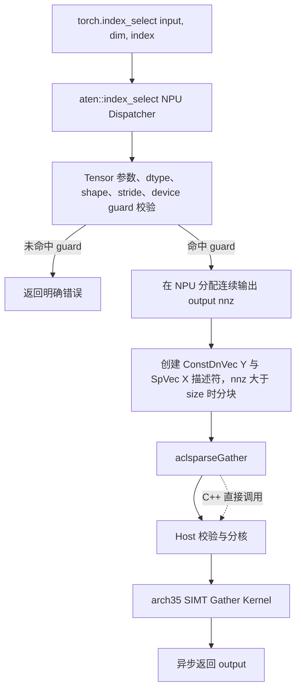
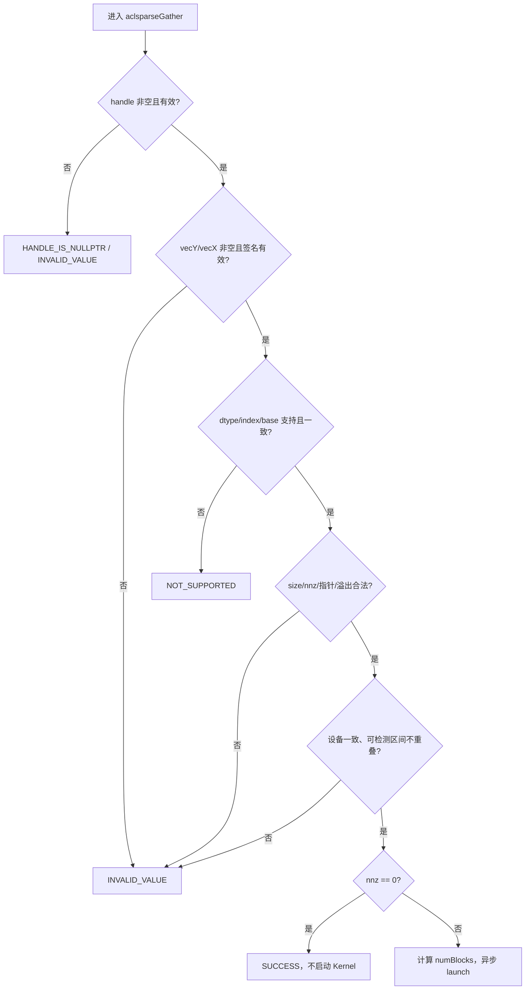

# aclsparseGather 算子设计文档（Ascend 950 / A5）

> 本文档描述实现前的技术设计，不包含实验结果。性能、精度和内存章节给出验收目标、采集口径与测试方案；涉及性能的定量推断均为待验证假设，NPU 实测数据在自测报告中给出。

# 需求背景（required）

## 需求来源

- 社区任务：`9月社区任务-aclsparseGather算子开发(950)`。
- 目标硬件：Ascend 950（DAV_3510，`arch35`，下文简称 A5）。
- 代码交付仓库：[`cann/ops-sparse`](https://gitcode.com/cann/ops-sparse) `master` 分支。
- 设计文档仓库：[`cann/cann-ops-competitions`](https://gitcode.com/cann/cann-ops-competitions)。
- C++ 语义参考：cuSPARSE 13.3 Update 1 `cusparseGather`。
- Python/ATen 语义参考：PyTorch 2.7 及以上版本的 `torch.index_select` / `aten::index_select`。

设计以 2026-09-02 拉取的 `ops-sparse` `master`（`e0015bb`）为代码基线。该基线已存在 `sparse/gather/arch35/`，因此采用"复用并补齐"的增量方案，不重复新建同名接口或另一套 Kernel。

## 背景介绍

`aclsparseGather` 按稀疏向量 `X` 的索引，从稠密向量 `Y` 读取元素并写入 `X.values`：`X.values[i] = Y[X.indices[i]-idxBase]`。`X.indices` 可乱序、重复；接口只修改 `X.values`。典型场景为 LLM 词表索引访问（Llama 3.1 70B、Qwen3-235B-A22B、DeepSeek-V3）：源向量长（12 万~15 万）、索引少（4k~8k）、乱序且允许重复。

Python 公开入口为 `torch.index_select(input, 0, index)`；本任务只覆盖一维稠密输入、规范化后 `dim=0`、一维 I32 索引的子集。PyTorch 路径固定 0-based，C++ Generic API 额外支持 `idxBase=0/1`。

### 现有实现分析

基线代码位于 `sparse/gather/arch35/`，采用 arch35 SIMT Vector Function 编程模型（线程级并行，绕过 UB 直接 GM 访问，grid-stride loop，Host 侧一个除法算出 block 数，无经典 tiling 流程）。基线与本任务差距：

| 模块 | 基线现状 | 本任务差距 |
| --- | --- | --- |
| 公开接口 | `include/cann_ops_sparse.h` 已声明 `aclsparseGather` | 补充任务规格、边界、别名、最大规模和错误行为说明 |
| Host | 基础校验（非空/dtype/size）、`nnz=0` 快速返回、AIV 核数与 block 数计算 | 补 device 一致性、重叠、规模与溢出校验；complex64 dispatch |
| Kernel | arch35 SIMT VF，一线程一个输出，grid-stride | 新增 `complex64` 8 字节位拷贝实例 |
| dtype | FP16/BF16/FP32/FP64 | 新增任务必选 `complex64`；FP64 能力不回退 |
| index | I32/I64、base 0/1 | 任务验收矩阵为 I32、base 0/1；I64 保留但不纳入验收声明 |
| Python/ATen | 仓内无 Gather 的 `aten::index_select` NPU 适配；torch_npu 26.0.0 已注册该 op 走 `aclnnIndexSelect` | 新增适配层：任务范围内走 aclsparseGather，范围外按任务书明确报错（详见 Python/ATen 侧设计） |
| 测试 | C++ CSV 用例以 FP16/FP32/FP64 为主 | 补 BF16/complex64、异常、别名、空输入、确定性、Python/ATen 和无 CPU fallback 证据 |

# 需求分析（required）

## 需求描述

在 A5 上完善 `aclsparseGather`，并为 PyTorch 2.7+ / torch_npu 26.0.0+ 注册 `aten::index_select` 的 NPU 实现。支持 `float16`、`bfloat16`、`float32`、`complex64`，I32 索引和 index base 0/1；核心路径必须在 NPU 执行，对未支持组合返回明确错误，不做 CPU fallback。

### C++ 接口

保持公开接口原型不变：

```cpp
aclsparseStatus_t aclsparseGather(
    aclsparseHandle_t handle,
    aclsparseConstDnVecDescr_t vecY,
    aclsparseSpVecDescr_t vecX);
```

只更新 `vecX.values`，`vecY.values` 和 `vecX.indices` 均为只读。调用沿用 `handle` 中的 stream 异步下发；`nnz=0` 直接成功返回，不启动 Kernel；不申请 workspace，也不执行 Host 同步。

### Python/ATen 接口

```text
torch.index_select(input, 0, index)
        -> aten::index_select
        -> PrivateUse1/NPU implementation
        -> aclsparseGather
        -> Ascend C Kernel
```

本任务只覆盖一维、规范化后 `dim=0`（一维下等价的 `dim=-1` 可接受）、连续 Strided Tensor、I32 index；输入和 index 必须位于同一 NPU Device。范围内调用走 aclsparseGather NPU Kernel；范围外组合（多维、I64 等）按任务书 2.0 **返回明确错误**，不做 CPU fallback。torch_npu 已注册同 op 的实现，重复注册与加载顺序机制需先 PoC 实测，见"Python / ATen 侧设计"。

验收脚本另公开测试钩子：

```text
torch.ops.ops_sparse_test.gather_npu(values, indices, base)
```

该钩子与生产路径复用同一 NPU 实现，用于覆盖 base 0/1；公开 `torch.index_select` 按 PyTorch 语义使用 base 0。

## 需求拆解

### 功能需求

1. `aclsparseGather` 保持既有函数原型和源代码兼容。
2. 精确实现 `X.values[i] = Y[X.indices[i]-idxBase]`，允许乱序和重复索引。
3. 任务验收覆盖 FP16、BF16、FP32、complex64 × I32 × base 0/1。
4. `Y` 与 `X.indices` 只读，只原地更新 `X.values`。
5. 覆盖动态 `size`/`nnz`、尾块、`nnz=0/1`、首尾索引、重复/乱序索引。
6. 同一输入重复执行结果 bit-wise 一致；complex64 的实部、虚部和特殊值位模式均保持。
7. Python 公开路径命中 NPU Dispatcher，并构造不与输入共享 storage 的新输出。

### 接口与资源需求

1. 使用调用方 `handle->stream` 异步下发，不插入无必要 Host 同步。
2. 不申请 workspace，不执行 preprocess，不分配与输入规模线性相关的临时 Host/Device 内存。
3. Host 侧完成可判定的参数检查；Device 索引值域按异步错误协议或调用方前置条件处理，不为逐索引检查增加 D2H 或同步。
4. 描述符和数据指针在 stream 完成前保持有效；Host 描述符由适配层以 RAII 管理。
5. 对空 handle/描述符、失效签名、空数据指针、dtype/index/base 不支持、设备不一致、可检测的指针区间重叠、规模溢出返回明确状态。

### 验收需求

1. CPU Golden 高精度生成，四种 dtype 均要求输出 bit-wise exact match。
2. 通过 NPU Dispatch 日志与 Profiler 证明无 CPU fallback。
3. 性能倍率按任务书 3.3 正文数值口径计算（见"性能基线与验收口径"），P-01/P-02/P-03 每个声明 dtype 与 base 组合均达 0.3 倍 GPU 标杆以上。
4. 无额外 workspace；输出原地复用 `X.values`，内存测试记录 `input_baseline_*_bytes`、`peak_*_bytes`、`extra_peak_*_bytes`。

## 范围与非目标

| 项目 | 本任务范围 | 非目标/处理方式 |
| --- | --- | --- |
| C++ Generic API | `aclsparseGather(handle, vecY, vecX)` | 不新增同功能接口 |
| Python/ATen | 一维 dense `input`，规范化后 `dim=0`，一维 I32 `index` | 多维输入、其他 dim、I64 index **返回明确错误**（任务书 2.0）。是否改为 fallthrough 保留 torch_npu 既有能力属公开行为变更，须任务方书面裁定后方可调整 |
| PyTorch overload | functional `aten::index_select` | `index_select.out`、Dimname overload 不在本任务范围 |
| index base | PyTorch 路径固定 base 0；C++ 路径 base 0/1 | Python 公开 API 不扩展非标准 `base` 参数 |
| dtype | FP16/BF16/FP32/complex64 | 不做类型提升或混合 dtype；FP64 C++ 能力保持兼容但不作为本任务交付声明 |
| Autograd | 前向算子由 Dispatcher 注册；沿用 PyTorch `index_select_backward` 公式 | 不新增独立 Gather backward Kernel |

## 运行环境基线

| 项目 | 设计基线 |
| --- | --- |
| 硬件 | Ascend 950（A5 / DAV_3510 / `arch35`） |
| CANN | 9.1.0 及后续配套版本；自测报告记录实际版本、驱动和固件 |
| PyTorch | 2.7 及以上 |
| torch_npu | 26.0.0 及之后版本 |
| 代码基线 | `ops-sparse` `master`；实现/验收时记录实际 commit SHA |

# 详细设计（required）

## 算子分析

### 数学公式与不变量

令 `Y` 的逻辑长度为 `sizeY`，`X` 的非零元素数为 `nnz`，`b=idxBase∈{0,1}`：

$$
\forall i\in[0,nnz):\quad p_i=X.indices[i]-b,\quad 0\le p_i<sizeY;\quad X.values[i]\leftarrow Y[p_i]
$$

不变量：

- `Y`、`X.indices` 在调用前后逐字节不变；
- 输出长度始终为 `nnz`，第 `i` 个输出只由第 `i` 个 index 决定；
- 不进行浮点计算、舍入、类型转换或归约；
- 乱序不改变语义，重复 index 不产生输出写冲突；
- `nnz=0` 返回成功且不启动 Kernel。

### 支持数据类型

| 层级 | values dtype | index dtype | index base |
| --- | --- | --- | --- |
| 任务必选 C++ 能力 | FP16、BF16、FP32、COMPLEX64 | I32 | 0、1 |
| PyTorch/ATen 能力 | Half、BFloat16、Float、ComplexFloat | Int | 0（公开入口） |
| 验收测试钩子 | Half、BFloat16、Float、ComplexFloat | Int | 0、1 |
| 既有 C++ 兼容 | FP64、I64 及其既有组合 | 保持基线行为 | 0/1 |

Gather 仅复制 bit payload。Kernel 以 `uint16_t`/`uint32_t`/`uint64_t` 承载 2/4/8 字节元素，避免 BF16 或 complex64 的隐式转换，并原样保留 NaN payload、INF、次正规数和正负零。

### 支持形状

| 项目 | 设计限制 |
| --- | --- |
| `vecY` | 连续一维 `[size]`；`size >= 0`；`nnz>0` 时 `size>0`（Host 可判定，直接报错） |
| `vecX.indices`、`vecX.values` | 连续一维 `[nnz]`；`nnz >= 0` |
| `vecX.size` | `0 <= vecX.size <= sizeY`，保持现有 Generic API 兼容语义 |
| `nnz` 上限 | `nnz <= INT64_MAX`；且 `nnz * sizeof(dtype)` 和 `nnz * sizeof(int32_t)` 须可由 `size_t` 表示（Host 侧 checked 乘法） |
| I32/base 0 最大可索引长度 | `sizeY <= 2^31` |
| I32/base 1 最大可索引长度 | `sizeY <= 2^31-1` |
| 合法 index | base 0 为 `[0,sizeY)`；base 1 为 `[1,sizeY]` |

**`nnz > size` 的处理**：PyTorch 允许重复索引使 `index.numel() > input.numel()`，但基线 `aclsparseCreateSpVec` 拒绝 `nnz > size`（`sparse/common/aclsparse_descr.cpp`）。本设计**不放宽公共描述符约束**（修改 common 语义需 Scatter 等 SpVec 依赖算子全量回归，收益仅是省去极少数场景的循环），由 ATen 适配层分块下发解决，见"Python / ATen 侧设计"。C++ Generic API 保持 `nnz <= size` 语义不变。

## 算子实现

### 总体架构



分层职责：

| 层 | 职责 |
| --- | --- |
| Python/ATen | 对齐公开 schema；guard 校验 Tensor 元数据；分配输出；`nnz>size` 分块；绑定当前 NPU stream；错误码转 PyTorch 异常 |
| aclsparse Host | 校验 opaque descriptor 与指针关系；生成小型按值 TilingData；选择模板实例并异步 launch |
| Ascend C Kernel | 按 I32 index 从 GM 随机读 `Y`，向连续 `X.values` 写回；无算术、无归约、无原子操作 |

### Host 侧设计

#### 参数校验

Host 按以下顺序做同步、常数复杂度校验：



校验细节：

1. 校验 `handle`、`vecY`、`vecX` 非空及描述符签名。
2. 校验 `vecX.valueType == vecY.valueType` 且属于声明集合。`ACL_COMPLEX64` 枚举已存在于 `aclDataType`，此处是**扩展支持矩阵**至该类型，不是新增枚举。
3. 校验 `vecY.size >= vecX.size` 及零长度语义（`size=0` 仅允许 `nnz=0`）。**不校验 `nnz <= vecX.size`**：Gather 语义下 `nnz` 是索引数量，重复索引可使 `nnz > size`；但 SpVec 描述符创建接口保留 `nnz <= size` 公共约束（见"支持形状"），因此 `nnz > size` 仅由 ATen 适配层分块路径覆盖。
4. `nnz>0` 时校验 `vecY.values`、`vecX.indices`、`vecX.values` 非空。
5. 校验 I32/base 的最大寻址范围及字节数乘法溢出。
6. **别名（overlap）契约（统一口径）**：基于描述符中缓存的 Device 指针做字节区间比较，检测到 `Y.values↔X.values` 或 `X.indices↔X.values` 重叠即返回 `INVALID_VALUE`。该检查不读取 Device 内容、不引入同步，但属于 **best-effort**：无法识别不同虚拟地址映射同一物理内存的情况。因此契约统一表述为：*可检测的指针区间重叠 → 接口报错；未检出的别名 → 调用方前置条件，接口不对其行为作保证*。PyTorch 路径下 output 由 `at::empty` 新分配，天然不与 input/index 重叠。
7. 校验三个有效数据区位于当前 NPU Device。

索引内容位于 Device，接口保持异步，因此逐元素越界检查作为调用方前置条件；非法索引由异步错误协议报告，不为检查索引新增 D2H、同步或检查 Kernel。

错误码映射：

| 状态 | 场景 |
| --- | --- |
| `ACL_SPARSE_STATUS_SUCCESS` | 参数合法；`nnz=0` 快速返回或 Kernel 成功下发 |
| `ACL_SPARSE_STATUS_HANDLE_IS_NULLPTR` | `handle == nullptr` |
| `ACL_SPARSE_STATUS_INVALID_VALUE` | descriptor/签名/指针/shape/base/设备/对齐/可检测重叠/规模不合法 |
| `ACL_SPARSE_STATUS_NOT_SUPPORTED` | dtype 或 index type 不在保留支持矩阵内 |
| `ACL_SPARSE_STATUS_INTERNAL_ERROR` | AIV 核数查询失败、block 数异常或内部状态错误 |

#### Tiling 与分核

沿用现有 `GatherTilingData`（`nnz`、`numBlocks`、`valType`、`idxType`、`idxBase`，按值塞进 kernel 参数）。线程数固定为已有的 `kGatherMaxThreadsPerBlock = 256`，block 数动态计算：

$$
numBlocks=\min\left(\left\lceil\frac{nnz}{256}\right\rceil,\ maxAivCoreNum\right)
$$

`maxAivCoreNum` 通过 `GetAivCoreCount()` 获取，不写死芯片核数。`nnz=0` 在计算 block 数前返回；`numBlocks=0` 视为内部错误，不 launch。不使用默认 workspace，不做 stream synchronize。SIMT grid-stride 模式下唯一的"tiling 决策"就是开多少个 block，无需经典 tiling key/bin/`SetTilingData` 流程。

### Kernel 侧设计

#### 技术路线

Gather 是随机读、连续写、无算术的 memory-bound 索引算子。稠密 `Y` 的访问位置不可预知，将整个 tile 预搬入 UB 不会提高复用率，反而增加搬运和容量开销。因此复用 arch35 现有 SIMT VF 方案：每个线程处理一个或多个输出位置，直接从 GM 读取并写回 GM。

#### 模板实例

| 任务 dtype | Kernel payload 类型 | 字节数 | 处理方式 |
| --- | --- | ---: | --- |
| FP16 | `__fp16` | 2 | 位保持标量拷贝 |
| BF16 | `__fp16` payload | 2 | 与基线一致，仅按 2 字节拷贝，不做 FP16 计算 |
| FP32 | `float` | 4 | 位保持标量拷贝 |
| complex64 | `uint64_t` | 8 | 实部+虚部整体位拷贝 |

> BF16 的坑：arm/x86 Host 编译器不认 `__bf16` 类型（即使不实例化也会编不过），而 Gather 只做拷贝、不做浮点运算，所以基线用 `type_identity<__fp16>` 冒充 BF16 传模板——2 字节宽度一致，拷贝语义等价。complex64 同理使用 `uint64_t` 做 8 字节位拷贝。改动此 workaround 前须先在 A5 环境验证。

index 类型为 I32；base 0/1 作为编译期模板参数，消除循环内 base 分支。既有 FP64/I64 模板继续保留以避免回归。

#### 核心逻辑

```cpp
template <typename ValT, typename IdxT, aclsparseIndexBase_t idxBase>
__simt_vf__ __aicore__ __launch_bounds__(kGatherMaxThreadsPerBlock) inline void GatherSimtCompute(
    __gm__ const IdxT* indices, __gm__ const ValT* yValues, __gm__ ValT* xValues, int64_t nnz)
{
    int64_t globalTid = threadIdx.x + blockIdx.x * blockDim.x;
    int64_t gridStride = blockDim.x * gridDim.x;

    for (int64_t i = globalTid; i < nnz; i += gridStride) {
        int64_t pos = static_cast<int64_t>(indices[i]) - idxBase;
        xValues[i] = yValues[pos];
    }
}
```

- `__simt_vf__`：SIMT 设备端函数（相当于 CUDA `__device__`），由大量线程并发执行；`__aicore__` 标记跑在 AI Core 上；`__launch_bounds__(256)` 用于寄存器分配；`__gm__` 表示指针直接指向设备全局内存（SIMT 可绕过 UB）。
- **grid-stride loop**：线程总数固定（`numBlocks × 256`），每个线程用 `i += gridStride` 跨步循环吃掉全部 `nnz`，任意 nnz 均可处理，无需精确切分。
- `idxBase` 是模板参数（0 或 1），编译期定死，运行时零开销。
- 确定性：每个 `i` 只由唯一线程写一次，无原子/归约/跨核通信；重复 index 仅重复读取 `Y[pos]`，不会写同一输出地址；`pos` 提升到 `int64_t` 后减 base，结果范围 `[0, 2^31)` 不可能溢出；`i < nnz` 是唯一尾块条件；complex64 整体 8 字节复制不改位模式；同一输入和相同 Kernel 配置 bit-wise 可复现。

单元素 GM 流量：

| dtype | index 读取 | Y 读取 | X 写回 | 合计 |
| --- | ---: | ---: | ---: | ---: |
| FP16/BF16 | 4 B | 2 B | 2 B | 8 B |
| FP32 | 4 B | 4 B | 4 B | 12 B |
| complex64 | 4 B | 8 B | 8 B | 20 B |

### Python / ATen 侧设计

#### 注册策略与范围外行为

torch_npu 26.0.0（op-plugin 26.0.0 分支）**已注册** `aten::index_select` 的 `PrivateUse1` 实现（底层 CANN `aclnnIndexSelect`），支持多维、非连续、I64 index、complex64 等，覆盖面远超本任务范围。本适配层必须注册同 op/key 才能让范围内调用命中 aclsparseGather，由此引入重复注册与行为变更问题，处理原则如下：

1. **范围内调用**（一维、dim=0、连续 Strided、I32、四种 dtype、同 Device）：guard 命中，走 aclsparseGather。
2. **范围外调用的默认行为按任务书 2.0 定稿：返回明确错误**（`TORCH_CHECK(false, ...)` 形式的清晰错误信息），不隐式转 CPU、不以 CPU 结果回填。
3. **已知代价（须在 PR 评审明示）**：若本适配层注册生效，torch_npu 既有用户的多维/I64 `index_select` 将从"走 aclnnIndexSelect"变为"收到明确错误"，属公开行为变更。是否改用"fallthrough 保留 torch_npu 既有能力"须由任务方书面裁定；裁定前实现按任务书口径（明确报错）。
4. **注册机制 PoC（实现前置条件，未通过前不得编码）**：在 A5 环境（PyTorch 2.7 + torch_npu 26.0.0）实测：
   - 对同一 `(aten::index_select, PrivateUse1)` 重复注册是告警覆盖还是抛异常；
   - 本库与 torch_npu 的加载顺序对命中路径的影响——若 torch_npu 后加载并覆盖本适配层，范围内调用将命中不到 aclsparseGather，任务不达标；
   - 注册后范围内调用必然命中 aclsparseGather，以 Profiler/Dispatch 日志证明不经过 CPU。
5. 不使用 `m.fallback()` 全局覆盖，避免影响其他 op。

若任务方书面确认保留范围外调用的既有能力，则改为 guard + fallthrough：guard 未命中时转发回 torch_npu 实现——方案 A（注册前保存原 `c10::KernelFunction` 直接调用）或方案 B（适配层直调 `aclnnIndexSelect`，需复制输出 shape 推导）。该路径仅在**书面确认 + 上述 PoC 通过**后启用，当前设计按任务书口径定稿。

#### `nnz > size` 的分块下发（定稿方案）

`aclsparseCreateSpVec` 公共约束 `nnz <= size` 保持不变（不修改 common descriptor 语义，避免影响 Scatter 等 SpVec 依赖算子）。ATen 适配层处理如下：

- `index.numel() <= input.numel()`（含全部 P-01/P-02/P-03 性能场景）：单次调用，无分块；
- `index.numel() > input.numel()`（重复索引场景）：以块长 `L = max(1, input.numel())` 将 index 切分为 `ceil(nnz/L)` 块，每块 `nnz_k <= size` 满足公共约束；各块以偏移后的 indices 指针与输出指针在**同一 stream 上顺序下发**独立调用 `aclsparseGather`；块间无同步（输出区间互不重叠，无写冲突）；
- 输出仍为单次分配的 `[index.numel()]` 连续 Tensor；分块不额外申请 Device 内存，仅增加 Kernel launch 次数，且只发生在非常规重复索引场景；
- `input.numel() == 0` 且 `index.numel() > 0`：任何索引必然越界，Host 侧直接返回明确错误，不创建描述符；
- C++ UT 补充分块路径与单次调用的结果等价性用例。

#### Tensor guard 校验

| 项目 | 命中条件（走 aclsparseGather） | 未命中时 |
| --- | --- | --- |
| input rank | 一维 | 明确报错 |
| dim | 规范化后为 0（一维下 `-1` 规范化为 0） | 明确报错 |
| index rank | 一维 | 明确报错 |
| input dtype | FP16/BF16/FP32/complex64 | 明确报错 |
| index dtype | I32 | 明确报错 |
| layout/stride | `torch.strided` 且 input/index 连续 | 明确报错 |
| device | input/index 均为 NPU 且同 device | 明确报错 |
| empty | index 为空 → 返回同 dtype/device 的 `[0]` 连续 Tensor | input 为空且 index 非空 → 明确报错（size=0 时任何索引越界） |

PyTorch 索引固定 0-based，adapter 创建 `SpVec` 时使用 `ACL_SPARSE_INDEX_BASE_ZERO`。base 1 只通过 C++ API 和验收测试 hook 覆盖，不改变公开 PyTorch schema。

#### 输出与 alias 语义

- functional `index_select` 新分配 `[index.numel()]` 连续输出，dtype/device 与 input 相同；output 不与 input 或 index 共享 storage；input 和 index 不原地修改；
- `nnz=0` 仍返回独立的空 Tensor；重复 index 在 output 中保留相同次数和原顺序；
- `index_select.out` 不在本次注册范围，避免把 functional 与 out alias 语义混合。

#### Stream 与生命周期

adapter 在 input 的 device guard 下取得当前 NPU stream，并设置到 aclsparse handle。描述符只持有 Tensor 数据指针的弱引用；Tensor/输出对象由框架保证至少存活到当前 stream 完成。Host 描述符在 launch 返回后由 RAII 销毁（Kernel 参数已按值封装，Device 数据不随描述符释放）。每个 Device 缓存一个 aclsparse handle，避免每次公开调用重复创建；handle 以 mutex 保护跨线程设置当前 stream 和下发。

### 构建与加载

Python/ATen 适配为**必选交付，默认参与构建**：

- CMake 选项 `BUILD_TORCH_ADAPTER` **默认 `ON`**；仅当配置环境未检出 PyTorch/torch_npu（如纯 C++ CI）时跳过并打印显式告警，不允许静默缺失；
- 构建目标：`libops_sparse_torch.so`，链接 `ops_sparse`、`ascendcl`、PyTorch 与 torch_npu；
- 加载方式：`torch.ops.load_library("<prefix>/libops_sparse_torch.so")`；
- 目录：`python/npu_sparse_gather/`（仓内首个 Python 适配目录；命名与 CMake 集成采用此默认方案，PR 评审时与 maintainer 确认，如有调整同步更新本节）；
- 端到端测试命令：`python -m pytest python/npu_sparse_gather/test_index_select_npu.py -v`（用例覆盖四 dtype、动态规模、空 index、`nnz>size` 分块、异常路由与无 CPU fallback 断言）。

### 内存与 UB 预算

本方案不创建 `TPipe/TQue/LocalTensor`，不使用 UB staging，也不需要 workspace。

| 区域 | 大小 | 生命周期 | 说明 |
| --- | ---: | --- | --- |
| GM `Y.values` | `sizeY*sizeof(dtype)` | 调用方持有 | 只读输入 |
| GM `X.indices` | `nnz*4` | 调用方持有 | I32，只读输入 |
| GM `X.values` | `nnz*sizeof(dtype)` | 调用方持有 | 原地输出 |
| UB | 0 B | 不适用 | SIMT 直接 GM 访问 |
| Workspace | 0 B | 不适用 | 无 preprocess、无临时全局数组；`nnz>size` 分块路径亦不额外申请 Device 内存 |

### 代码落位

| 路径 | 设计变更 |
| --- | --- |
| `include/cann_ops_sparse.h` | 保持原型，完善 dtype/index/base、异步、别名、边界和生命周期注释 |
| `sparse/common/aclsparse_handle_internal.h` | opaque 内部缓存 device id（若公共层尚无等价字段） |
| `sparse/common/aclsparse_descr_internal.h/.cpp` | opaque DnVec/SpVec 缓存 device id 并保持签名校验；**不改 `nnz <= size` 公共约束** |
| `sparse/gather/arch35/gather_host.cpp` | 完整参数、区间、溢出与设备校验；complex64 dispatch |
| `sparse/gather/arch35/gather_kernel.cpp` | 增加 `ACL_COMPLEX64 -> uint64_t`、I32、base 0/1 模板实例 |
| `sparse/gather/README.md` | 同步任务规格、限制和示例 |
| `python/npu_sparse_gather/` | `aten::index_select` NPU 注册、guard 校验、`nnz>size` 分块、C++ bridge、Python/ATen UT |
| `test/gather/arch35/` | C++ 功能、异常、确定性、complex64、输入只读性与边界用例 |
| `test/gather/self_test/` | 接入任务包精度、性能、内存和 Profiler 口径 |

## 支持硬件

| 支持的芯片版本 | 支持状态 |
| --- | --- |
| Ascend 950（DAV_3510 / `arch35`） | √ |
| A2/A3 等其他架构 | 本任务不新增；由相应架构目录或并行任务覆盖 |

现有 A2/A3 公共描述符和其他架构实现保持共存。A5 Kernel 与 Torch 适配只在对应构建选项和目标 SoC 下启用。

## 算子约束限制

- values dtype：FP16/BF16/FP32/complex64（C++ 既有 FP64 保持兼容）；index dtype：I32（C++ 既有 I64 保持兼容，Python adapter 不接受）；base：C++ 支持 0/1，PyTorch 固定 0。
- `Y` 为连续一维向量；`X.indices`/`X.values` 为长度 `nnz` 的连续一维数组；index 可乱序或重复，换算后必须位于 `[0,sizeY)`。
- 可检测的指针区间重叠返回错误（见 Host 侧别名契约）；未检出的别名是调用方前置条件。
- 不使用 workspace/preprocess，不做 CPU fallback，不插入 Host 同步。
- functional PyTorch 输出不与 input/index 共享 storage；范围外组合返回明确错误。

# 可维可测分析

## 测试设计

### 分层测试

| 层 | 测试内容 | 关键证据 |
| --- | --- | --- |
| Python 端到端 | `torch.index_select(input,0,index)` 四 dtype、动态规模、空 index、乱序/重复、`nnz>size` 分块、异常和 alias | 输出/异常与 CPU 语义对齐；输入未修改 |
| ATen Dispatcher | 注册命中、guard 未命中报错、device/stride/layout 校验 | Dispatch 日志无 CPU kernel |
| aclsparse C++ | handle/descriptor/pointer/dtype/index/base/size/overlap/alignment/设备校验 | 返回码、输入只读、边界 canary |
| Ascend C Kernel | 四 dtype × base 0/1、`nnz=0/1`、尾块、首尾/重复/乱序索引 | bit-wise exact、重复执行一致 |
| Profiler | P-01/P-02/P-03 及泛化用例 | 仅出现 NPU Gather 路径，无 CPU fallback |
| 资源鲁棒性 | 连续创建、执行、销毁 handle/descriptor | 无泄漏、无非法同步、无额外 workspace |

### 核心场景

| 类别 | 必测场景 |
| --- | --- |
| 基础功能 | 不同 `size`/`nnz`/稀疏度，四 dtype，base 0/1 |
| 索引形态 | 顺序、乱序、重复、首元素、末元素、`nnz=0/1`、非 256 倍数尾块、`index.numel() > input.numel()` 分块下发（含分块与单次调用等价性） |
| 数值 | 正负混合、正负零、小值、离群值、INF/NAN；complex64 实/虚部专项 |
| 异常 | 空/失效描述符、空指针、dtype/device 不一致（C++ 层）、非法 index type/base、可检测重叠区间、规模溢出、guard 未命中明确报错 |
| 一致性 | 相同输入多次执行逐字节一致；`Y` 和 indices 调用前后逐字节不变 |
| PyTorch | shape/dtype/device/storage alias、functional overload、无 CPU fallback |

### 用例生成规则

- values 使用固定随机种子：70% 来自 `[-1,1]` 均匀分布，20% 来自 `μ=0,σ=1` 正态分布，10% 覆盖正负零、边界值、离群值以及规格允许的 INF/NAN；
- FP16/BF16 先以 FP32 生成，FP32 以 FP64 生成，complex64 的实部/虚部分别以 FP64 生成后转换为目标 dtype；
- indices 在合法区间均匀生成，并以专项用例固定覆盖顺序、乱序、重复、首尾、base 0/1、`nnz=0/1`、尾块和 `nnz>size` 分块；
- 非法用例单独构造负 index、上界 index、非法 base/type、空指针、重叠区间和设备不一致，不与合法随机用例混合；
- 复用任务包 `accuracy_cases.json` 的 200 条泛化用例与 `performance_cases.json` 的 P-01/P-02/P-03，保证 case id、seed 和参数可追溯。

## 精度标准/性能标准

| 验收标准 | 具体指标 | 标准来源 |
| --- | --- | --- |
| 精度 | 四种 dtype（FP16/BF16/FP32/complex64）逐元素 bit-wise exact match（FP16/BF16 用 float32 Golden，FP32 用 float64 Golden，complex64 用 complex128 Golden）；输入 Y、indices 和非目标数据不变 | 社区任务书 3.2 |
| 性能 | 24 个场景（P-01/P-02/P-03 × 4 dtype × base 0/1），`ratio = GPU 设备 Event median / NPU 同范围 Kernel median >= 0.3`；GPU 基线以任务书 3.3 正文数值为准（见下表） | 社区任务书 3.3 |
| 内存 | 满足以下条件之一：(1) 输入输出总量 > 500 MB 时，NPU 额外内存 ≤ GPU 使用内存总量的 50%；(2) 方案固有 workspace 绝对值 ≤ Ascend 950 L2 Cache 容量。Gather workspace = 0，天然满足条件 (2) | 社区任务书 3.4 |
| 执行位置 | NPU Dispatch/Profiler 中无 CPU fallback；核心计算在 NPU 完成 | 社区任务书 3.5 |

### 精度细节

- 由于 Kernel 只执行位拷贝，四种 dtype 输出均要求 bit-wise exact match，不使用 rtol/atol 放宽；
- complex64 的实部和虚部分别 exact match，同时比较完整 8 字节 payload；NAN 按任务精度标准处理，并额外检查位模式未因算术转换改变；
- 校验 `Y`、indices 和输出缓冲 canary，确认非目标数据未修改。

### 性能基线与验收口径

验收判定以**任务书 3.3 正文**的 GPU `median_us` 为唯一基准：

| 场景 | size | nnz | GPU median 范围 (μs)（任务书 3.3） | NPU 允许上限 (μs)（= GPU/0.3） |
| --- | ---: | ---: | --- | --- |
| P-01 Llama 3.1 70B | 128256 | 8192 | 27.488–32.736 | 91.6–109.1 |
| P-02 Qwen3-235B-A22B | 151936 | 4096 | 31.056–31.264 | 103.5–104.2 |
| P-03 DeepSeek-V3 | 129280 | 7168 | 30.832–31.072 | 102.8–103.6 |

> **基线口径差异（待任务方书面裁定）**：任务书链接的明细文件 `test_cases/aclsparseGather_testCase/gpu_performance_result_benchmark.md` 记录的 PyTorch GPU median 为 P-01 60.128–112.064 μs、P-02 69.552–81.888 μs、P-03 67.776–76.032 μs，与任务书正文存在约 2 倍差异；明细文件自身声明"不同来源的 API 与被计时工作可能不同，结果仅在同一来源内比较"，两套数据不可跨来源混用。本设计**不以上述明细数据替换任务书验收基准**（若误用将把 NPU 上限放宽约 2.19 倍）；差异已登记为待任务方裁定项。自测报告可并列给出两套基准下的 ratio 作参考，验收判定以任务书正文为准。该基准选择对验收**单向安全**：满足任务书正文口径必然满足明细口径；即使任务方对该差异不作答复，也不产生方向性验收风险，仅自测门槛更严格。

性能倍率定义：

$$
ratio=\frac{GPU\ device\ Event\ median\ time}{NPU\ 同调用范围全部 Kernel\ median\ time}\ge 0.3
$$

### 性能假设（待 Profiler 实测验证，不作为达标结论）

以下为设计阶段的定性/半定量假设，均需以 A5 Profiler 实测数据验证或修正：

- P 系列场景 Y 向量为 0.25–1.2 MB，若大部分随机读命中 L2，则时延由 L2 命中延迟主导；实际命中率取决于 A5 L2 容量与替换策略，未经实测确认；
- 单 Kernel、无 preprocess、无 workspace 路径的 launch 开销占比未知，小 `nnz` 场景可能由 launch 主导；
- 综上，NPU 端到端时延与 `ratio >= 0.3` 达标性**以自测报告实测为准**，本设计不作预估结论。

采集口径：
- 每 case 预热不少于 10 次，采样 30 次，报告 median 与 p90；
- 不计首次编译、数据生成、Host-to-Device 搬运和无关初始化；
- 固定随机种子，复用 handle/descriptor；
- 同时报告 aclsparse Kernel 与 Python/ATen 端到端耗时。

预期瓶颈为 Kernel launch 与随机 GM 读延迟。设计内优化点：无 UB 中转、无数值转换、base 编译期特化、动态多 AIV block、grid-stride 覆盖大 `nnz`。任何后续优化必须保持每个输出地址单写和 complex64 位保持语义。

## 兼容性分析

- 公开 `aclsparseGather` 原型不变，扩展支持矩阵至 `ACL_COMPLEX64`（枚举已存在），属能力扩展；
- 保留基线 FP64/I64 模板和行为，避免现有调用方回归；opaque descriptor 仅增加内部 device 元数据，不改变公开类型或调用方式；
- `aclsparseCreateSpVec` 的 `nnz <= size` 公共约束不变，`nnz > size` 由 ATen 适配层分块覆盖；
- arch35 代码继续位于 `sparse/gather/arch35/`，不侵入 A2/A3 Kernel；若 A2/A3 公共 Host 逻辑已进入主干，实现时复用公共校验并保留各自 arch 目录；
- Python 适配层注册 `aten::index_select` 后，torch_npu 既有多维/I64 调用行为将变更为明确报错（除非任务方书面确认 fallthrough 方案），该公开行为变更在 PR 评审中明示。

## 风险与应对

| 风险 | 影响 | 应对 |
| --- | --- | --- |
| 性能基线口径差异：任务书 3.3 正文（约 27–33 μs）与明细文件（约 60–112 μs）相差约 2 倍 | 验收基准不确定；若误用明细口径将放宽 NPU 上限约 2.19 倍 | 设计与验收一律以任务书正文数值为准；差异登记为待任务方书面裁定项；自测报告并列两套 ratio 供参考 |
| torch_npu 已注册 `aten::index_select`（PrivateUse1），重复注册行为未知（告警覆盖/抛异常），加载顺序影响命中路径 | 范围内调用命中不到 aclsparseGather，或适配层加载失败 | 注册机制 PoC 作为实现前置条件（见 Python/ATen 侧设计）；PoC 通过前不编码；备选注册机制已在设计中列出 |
| 范围外组合从"torch_npu 可用"变为"明确报错"，属公开行为变更 | torch_npu 既有用户回归 | 按任务书 2.0 定稿为明确报错；同时向任务方/maintainer 提请裁定是否改用 fallthrough 保留既有能力；变更在 PR 评审明示 |
| `nnz > size` 分块下发引入多次 launch | 分块场景时延增加；块间顺序依赖 | 分块仅发生在 `index.numel() > input.numel()` 的非常规场景（性能场景不触发）；同 stream 顺序下发、输出区间互不重叠；UT 覆盖分块与单次调用等价性 |
| complex64 使用语言复数类型触发编译器/ABI 差异 | 位模式或编译失败 | 使用 `uint64_t` payload，不做复数算术 |
| Device index 越界无法在 Host 无同步检查 | 非法访问 | C++ 文档明确前置条件；ATen 复用 torch_npu 异步索引错误协议 |
| descriptor device 元数据影响公共结构 | 其他算子回归 | 字段保持 opaque、默认初始化；补 descriptor 与既有算子回归 UT |
| 小 `nnz` 场景 launch 开销占主导 | 0.3 倍目标风险 | `nnz=0` 不启动；`nnz>0` 单 Kernel 完成；无 preprocess/workspace；实测后针对性优化 |

## 需求承接矩阵

| 任务要求 | 设计承接位置 |
| --- | --- |
| 四 dtype、I32、base 0/1 | 支持数据类型、Kernel 模板实例 |
| complex64 全链路 | 支持数据类型、Python/ATen、`uint64_t` payload、测试方案 |
| Python/ATen 必选（默认构建） | 构建与加载、Python/ATen 侧设计、分层测试 |
| 范围外明确错误、无 CPU fallback | 范围与非目标、注册策略与范围外行为、Profiler 测试 |
| 异步、无 workspace/同步 | Host/Kernel、Stream 生命周期、内存与 UB 预算 |
| 动态规模、乱序/重复、尾块、`nnz=0/1`、`nnz>size` | 支持形状、分块下发、核心场景 |
| bit-wise 一致 | 数学不变量、complex64 位拷贝、确定性、精度标准 |
| 输入只读与 alias | Host 侧别名契约、输出与 alias、C++ 异常测试 |
| 性能 `>=0.3`（任务书 3.3 正文基准） | 性能基线与验收口径 |
| A5 / arch35 | 需求来源、支持硬件、代码落位 |
