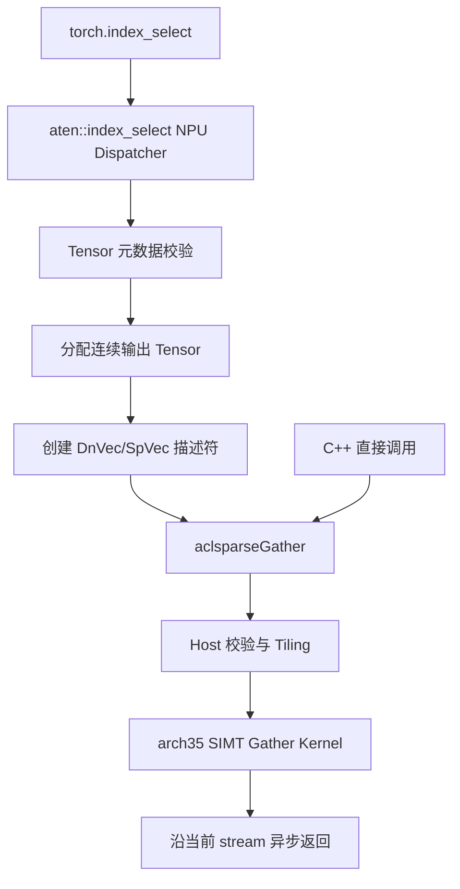
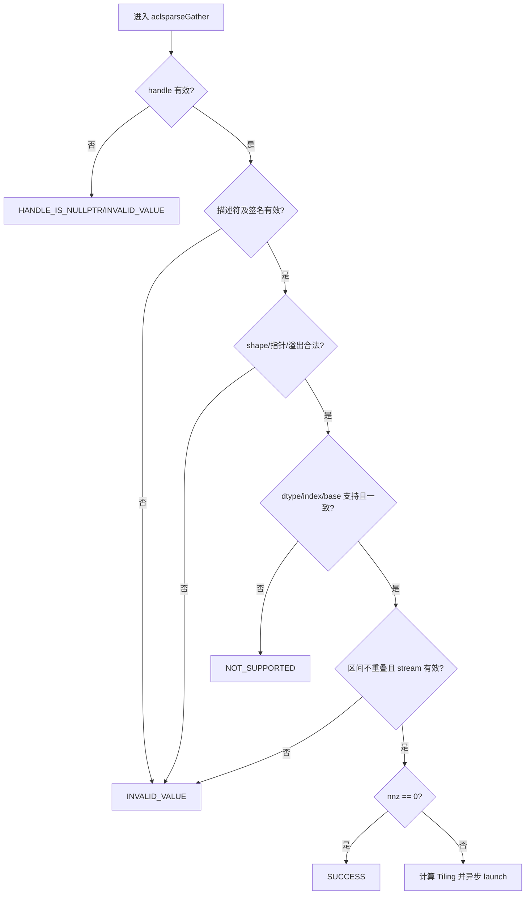

# aclsparseGather 算子设计文档（Ascend 950 / A5）

> 本文档描述编码前的技术方案。精度、性能和内存章节定义验收目标与采集口径，
> 不预填未经 Ascend 950 环境验证的结果。

# 需求背景（required）

## 需求来源

- 社区任务：9 月社区任务 `aclsparseGather` 算子开发（950）。
- 任务编号：9 月第 13 项。
- 目标硬件：Ascend 950（DAV_3510，`arch35`，下文简称 A5）。
- 代码交付仓库：[`cann/ops-sparse`](https://gitcode.com/cann/ops-sparse)。
- 设计文档仓库：[`cann/cann-ops-competitions`](https://gitcode.com/cann/cann-ops-competitions)。
- C++ 语义参考：cuSPARSE Generic API `cusparseGather`。
- Python/ATen 语义参考：PyTorch 2.7+ `torch.index_select` / `aten::index_select`。

任务目标是在 A5 上完善 `aclsparseGather`，支持任务规定的多类型稀疏向量
索引读取，并补齐 Python/ATen NPU 适配、测试和验收材料。设计基于
`ops-sparse` `master` 当前已有的 `sparse/gather/arch35/` 实现，采用增量
补齐方案，不重复创建同名接口。

## 背景介绍

`aclsparseGather` 从稠密向量 `Y` 中按照稀疏向量 `X.indices` 读取元素，
原地写入 `X.values`：

$$
X.values[i] = Y[X.indices[i] - idxBase],\quad i\in[0, nnz)
$$

该操作用于词表查找、Embedding 和稀疏索引读取。任务给出的 P-01、P-02、
P-03 场景分别对应 Llama 3.1 70B、Qwen3-235B-A22B 和 DeepSeek-V3
词表规模，特点是源向量较长、索引数量较小、读取位置不规则。

关键语义：

- `Y` 和 `X.indices` 只读，仅更新 `X.values`；
- 索引允许乱序和重复，输出顺序与 `indices` 顺序一致；
- 重复索引仅导致重复读取，不产生输出写冲突；
- 无 workspace、无 preprocess，沿调用方 stream 异步执行；
- Gather 仅复制位模式，不进行浮点计算、舍入或类型转换。

### 现有实现分析

| 模块 | 当前基线能力 | 本任务需补齐 |
| --- | --- | --- |
| 公开接口 | 已声明 `aclsparseGather(handle, vecY, vecX)` | 保持 ABI，补充任务规格、边界和生命周期说明 |
| Host | 基础空指针、dtype、shape 校验及异步 launch | 补签名、数据指针、index/base、重叠、规模和 stream 校验 |
| Kernel | arch35 SIMT grid-stride loop | 新增 Complex64 8 字节位拷贝实例 |
| dtype | FP16、BF16、FP32、FP64 | 新增任务必选 Complex64；既有 FP64 能力不回退 |
| index | I32/I64，base 0/1 | 任务验收矩阵固定 I32，base 0/1 |
| Python/ATen | 无 Gather 的 `aten::index_select` NPU bridge | 新增 Dispatcher 注册、Tensor 校验和端到端测试 |
| 测试 | C++ CSV 用例以 FP16/FP32/FP64 为主 | 补 BF16/Complex64、异常、Python、性能和 Profiler 证据 |

# 需求分析（required）

## 需求描述

### C++ Generic API

公开接口保持不变：

```cpp
aclsparseStatus_t aclsparseGather(
    aclsparseHandle_t handle,
    aclsparseConstDnVecDescr_t vecY,
    aclsparseSpVecDescr_t vecX);
```

任务验收范围：

| 维度 | 支持范围 |
| --- | --- |
| values dtype | FP16、BF16、FP32、Complex64 |
| index dtype | I32 |
| index base | ZERO、ONE |
| index 顺序 | 有序、乱序均支持 |
| 重复 index | 支持 |
| 执行方式 | 单阶段异步执行 |
| workspace | 0 |

### Python/ATen API

公开入口：

```python
torch.index_select(input, 0, index)
```

调用链：

```text
torch.index_select
  -> aten::index_select
  -> NPU / PrivateUse1 Dispatcher
  -> aclsparseGather
  -> Ascend C arch35 Kernel
```

本任务覆盖一维连续稠密 `input`、一维连续 I32 `index`、规范化后
`dim=0` 的 functional overload。PyTorch 路径使用 0-based 索引；C++
接口额外覆盖 base 1。未支持组合必须明确报错，不允许 CPU fallback。

为覆盖 C++ base 0/1 验收矩阵，提供仅用于测试的 NPU hook：

```text
torch.ops.ops_sparse_test.gather_npu(values, indices, base)
```

## 需求拆解

1. 支持 FP16、BF16、FP32、Complex64，输出逐 bit 一致。
2. 任务索引类型为 I32，支持 base 0 和 1。
3. 支持动态 `size/nnz`、乱序、重复、首尾索引、尾块及 `nnz=0/1`。
4. Host 校验 handle、描述符、签名、指针、dtype、index/base、长度、stream、
   地址区间重叠和整数溢出。
5. Kernel 在 A5 Vector Core 完成全部读取和写回，不进行类型转换。
6. Python/ATen 校验 Tensor 元数据、构造独立输出并沿当前 NPU stream 异步执行。
7. 通过 Dispatch 日志与 Profiler 证明无 CPU fallback。
8. P-01/P-02/P-03 的 24 个 dtype/base 组合均达到 GPU 标杆的 0.3 倍以上。
9. Gather 本身 workspace 为 0，不新增与输入规模线性相关的临时缓冲。

## 范围与非目标

| 项目 | 本任务范围 | 非目标或处理方式 |
| --- | --- | --- |
| C++ API | `aclsparseGather` | 不新增同功能接口 |
| Python | 一维 `torch.index_select(input, 0, index)` | 多维、其他 dim 明确报错 |
| ATen overload | functional `aten::index_select` | `index_select.out`、Dimname 不在范围 |
| dtype | FP16/BF16/FP32/Complex64 | 不做混合 dtype 或隐式 cast |
| index | I32 | Python 不接受 I64；C++ 既有 I64 能力保留兼容 |
| base | C++ 0/1；Python 0 | Python 不增加非标准 base 参数 |
| Autograd | 复用框架既有 backward 语义 | 不新增 Gather backward Kernel |

# 详细设计（required）

## 算子分析

### 数学定义与不变量

设 `Y` 长度为 `sizeY`，`X` 非零元素数为 `nnz`，`b=idxBase`：

$$
\forall i\in[0,nnz):\quad p_i=X.indices[i]-b,\quad 0\le p_i<sizeY
$$

$$
X.values[i]\leftarrow Y[p_i]
$$

不变量：

- `Y` 和 `X.indices` 在调用前后逐字节不变；
- 输出长度为 `nnz`，第 `i` 个输出只由第 `i` 个 index 决定；
- 不执行算术、归约、原子操作或类型转换；
- `nnz=0` 返回成功且不启动 Kernel；
- 合法输入重复执行结果 bit-wise 一致。

### 参数规格

| 参数 | I/O | 规格 | 校验 |
| --- | --- | --- | --- |
| `handle` | 输入 | 已创建并绑定 stream | 空 handle 返回 `HANDLE_IS_NULLPTR` |
| `vecY` | 输入 | 连续一维 DnVec，任务 dtype 为四种 | 描述符、签名、指针、dtype、长度合法 |
| `vecX` | 输入输出 | SpVec，I32，base 0/1 | 描述符、签名、indices/values、shape 合法 |

`vecY.values`、`vecX.indices` 位于 Device 且只读，`vecX.values` 为唯一写目标。
`vecX.values` 不得与另外两个有效区间重叠。描述符和数据指针生命周期必须
覆盖 stream 上的异步执行。

### 类型与位模式

| 任务 dtype | Kernel payload | 字节数 | 行为 |
| --- | --- | ---: | --- |
| FP16 | `uint16_t` / 等宽载体 | 2 | 原始位复制 |
| BF16 | `uint16_t` / 等宽载体 | 2 | 原始位复制，不解释为 FP16 |
| FP32 | `uint32_t` / 等宽载体 | 4 | 原始位复制 |
| Complex64 | `uint64_t` | 8 | 实部和虚部整体位复制 |

使用等宽无符号 payload 可避免 BF16 和 Complex64 的隐式转换，保持正负零、
INF、NAN 及 NAN payload。

### 形状与规模

- `vecY` shape 为 `[sizeY]`；
- `vecX.indices`、`vecX.values` shape 为 `[nnz]`；
- `0 <= nnz <= vecX.size <= sizeY`；
- I32/base 0 时 `sizeY <= 2^31`；
- I32/base 1 时 `sizeY <= 2^31-1`；
- base 0 合法 encoded index 为 `[0,sizeY)`；
- base 1 合法 encoded index 为 `[1,sizeY]`；
- indices/values 字节数和地址末端必须可由 `size_t/uintptr_t` 安全表示。

Host 不读取 Device indices，因此不为逐元素值域检查增加 D2H 或同步。
C++ API 将合法 index 作为调用方前置条件；ATen 路径沿用 torch_npu
异步索引错误上报机制。

## 算子实现

### 总体架构



### Python/ATen 侧设计

#### Dispatcher 与 Tensor 校验

注册 functional `aten::index_select` 的 NPU 实现，仅处理任务范围内组合：

| 项目 | 支持条件 | 不满足时 |
| --- | --- | --- |
| input rank | 一维 | 明确提示仅支持 1-D |
| dim | 规范化后为 0；一维 `-1` 可规范化为 0 | 返回不支持 |
| index rank/dtype | 一维 I32 | 返回不支持，不隐式转换 |
| input dtype | FP16/BF16/FP32/Complex64 | 返回不支持，不隐式 cast |
| layout/stride | Strided 且 input/index 连续 | 返回不支持，不隐式 materialize |
| device | input/index 同一 NPU | CPU、跨 Device 返回错误 |

#### 输出、stream 与生命周期

1. 使用 `at::empty` 创建 `[index.numel()]` 的连续输出，dtype/device 与 input 相同。
2. 输出不与 input 或 index 共享 storage；input/index 不被修改。
3. 在 input Device Guard 下获取当前 NPU stream，并设置到 aclsparse handle。
4. 使用 RAII 创建和销毁 DnVec/SpVec Host 描述符。
5. 调用 `aclsparseGather` 后不显式同步，直接返回输出 Tensor。
6. `nnz=0` 返回独立空 Tensor，不启动 Gather Kernel。
7. 不支持组合直接报错，不 redispatch 到 CPU。

### Host 侧设计

#### 参数校验顺序



校验项：

1. handle、vecY、vecX 非空，内部 signature 有效；
2. handle 已绑定有效 stream；
3. `vecX.valueType == vecY.valueType`，dtype、idxType、idxBase 受支持；
4. `nnz/sizeY/vecX.size` 关系和 I32 可寻址范围合法；
5. `nnz>0` 时三个 Device 数据指针非空；
6. 字节数乘法、地址末端计算不溢出；
7. `Y.values` 与 `X.values`、`X.indices` 与 `X.values` 不重叠；
8. `nnz=0` 在核数查询和 launch 前快速返回。

错误码：

| 状态 | 场景 |
| --- | --- |
| `ACL_SPARSE_STATUS_SUCCESS` | 参数合法；空输入或 Kernel 已成功下发 |
| `ACL_SPARSE_STATUS_HANDLE_IS_NULLPTR` | `handle == nullptr` |
| `ACL_SPARSE_STATUS_INVALID_VALUE` | 描述符、签名、指针、shape、base、stream、重叠或规模非法 |
| `ACL_SPARSE_STATUS_NOT_SUPPORTED` | dtype/index type 不受支持 |
| `ACL_SPARSE_STATUS_INTERNAL_ERROR` | AIV 核数或内部状态异常 |

#### Tiling 与多核切分

```cpp
constexpr uint32_t kGatherMaxThreadsPerBlock = 256;

struct GatherTilingData {
    int64_t nnz;
    uint32_t numBlocks;
    aclDataType valType;
    aclsparseIndexType_t idxType;
    aclsparseIndexBase_t idxBase;
};
```

```text
threadsPerBlock = 256
requiredBlocks = ceil(nnz / threadsPerBlock)
numBlocks = min(requiredBlocks, GetAivCoreCount())
```

按 `nnz` 切分，每个线程通过 grid-stride loop 处理一个或多个输出。
各线程写入不同的 `X.values[i]`，无需原子、同步或 workspace。AIV 核数
动态获取，不写死芯片核数。

### Kernel 侧设计

Gather 是随机读、连续写、无算术的 memory-bound 操作。预搬运整个 `Y`
到 UB 无法覆盖不规则索引，反而增加流量和容量压力，因此复用现有
arch35 SIMT VF 直接访问 GM：

```cpp
template <typename PayloadT, aclsparseIndexBase_t Base>
__simt_vf__ __aicore__
__launch_bounds__(kGatherMaxThreadsPerBlock)
inline void GatherSimtCompute(
    __gm__ const int32_t *indices,
    __gm__ const PayloadT *yValues,
    __gm__ PayloadT *xValues,
    int64_t nnz)
{
    int64_t i = threadIdx.x + blockIdx.x * blockDim.x;
    const int64_t stride = blockDim.x * gridDim.x;
    while (i < nnz) {
        const int64_t pos = static_cast<int64_t>(indices[i]) - Base;
        xValues[i] = yValues[pos];
        if (stride >= nnz - i) {
            break;
        }
        i += stride;
    }
}
```

设计要点：

- 使用 `KERNEL_TASK_TYPE_DEFAULT(KERNEL_TYPE_AIV_ONLY)` 和 `asc_vf_call`；
- index 固定为 I32，先提升到 I64 再减 base；
- base 0/1 和 payload 类型为编译期模板参数；
- Complex64 使用 `uint64_t` 整体复制，不进行复数运算；
- 循环更新前判断剩余范围，避免极大 `nnz` 下有符号加法回绕；
- 每个输出地址单写，无原子、归约和跨核通信；
- Kernel 沿调用方 stream 异步 launch。

### Buffer 与 UB 预算

| Buffer | 大小 | 位置 | 生命周期 |
| --- | ---: | --- | --- |
| `Y.values` | `sizeY*sizeof(dtype)` | GM | 调用方持有，只读 |
| `X.indices` | `nnz*4` | GM | 调用方持有，只读 |
| `X.values` | `nnz*sizeof(dtype)` | GM | 调用方持有，输出 |
| 显式 UB Buffer | 0 | UB | 不使用 |
| Workspace | 0 | GM | 不使用 |

时间复杂度为 `O(nnz)`，额外空间复杂度为 `O(1)`。每个元素最低 GM 流量：

```text
sizeof(int32_t) + 2 * sizeof(PayloadT)
```

### 代码落位

| 路径 | 设计变更 |
| --- | --- |
| `include/cann_ops_sparse.h` | 保持接口原型，完善 dtype/index/base、异步和生命周期注释 |
| `sparse/gather/arch35/gather_host.cpp` | 完整校验、Complex64 dispatch、Tiling 和 launch |
| `sparse/gather/arch35/gather_kernel.cpp` | 新增 Complex64/I32/base 0/1 模板实例 |
| `sparse/gather/README.md` | 同步任务规格、约束和调用示例 |
| Python/ATen adapter 目录 | 注册 `aten::index_select`、Tensor bridge 和测试 hook |
| `test/gather/` | 四 dtype、异常、确定性、输入只读和边界测试 |

Python adapter 的具体目录遵循实现时 `ops-sparse` 主干已有框架；目录调整
不改变本设计的接口和数据流契约。

## 支持硬件

| 支持芯片 | 状态 |
| --- | --- |
| Ascend 950（DAV_3510 / `arch35`） | 支持 |
| A2/A3 及其他架构 | 本任务不新增，由对应架构任务覆盖 |

## 算子约束限制

- 任务 values dtype 为 FP16/BF16/FP32/Complex64。
- 任务 index dtype 为 I32；C++ 既有 I64 能力保留但不纳入本任务验收。
- C++ index base 支持 0/1；PyTorch 固定为 0。
- Python/ATen 仅支持一维连续 Strided Tensor 和 `dim=0/-1`。
- 换算后的 index 必须位于 `[0,sizeY)`。
- 不支持输入与输出、indices 与输出的内存区间重叠。
- 不使用 workspace/preprocess，不做 CPU fallback，不插入 Host 同步。

# 可维可测分析

## 测试方案

### 分层测试

| 层级 | 测试内容 | 验收证据 |
| --- | --- | --- |
| Python 端到端 | 四 dtype、动态规模、空 index、乱序/重复、异常 | 输出与 CPU 语义一致，输入只读 |
| ATen Dispatcher | NPU 注册、device/stride/layout 检查 | Dispatch 日志无 CPU Kernel |
| C++ Host | handle/descriptor/pointer/dtype/index/base/shape/alias | 返回码和边界 canary |
| Ascend C Kernel | 四 dtype × base 0/1、尾块、`nnz=0/1` | bit-wise exact |
| Profiler | P-01/P-02/P-03 | 仅出现 NPU Gather 路径 |
| 资源 | 重复创建、执行、销毁 | 无泄漏、无同步、workspace=0 |

### 用例生成规则

- values：70% `[-1,1]` 均匀分布，20% `N(0,1)`，10% 为零值、边界值、
  离群值、INF/NAN；
- FP16/BF16 由 FP32 生成，FP32 由 FP64 生成，Complex64 实部和虚部由
  FP64 生成后转换；
- indices 使用固定 seed，在合法区间生成，并覆盖顺序、逆序、乱序、
  重复、首尾、base 0/1、空索引和尾块；
- 异常用例独立覆盖非法 descriptor、dtype、index/base、空指针、重叠和溢出；
- 复用任务包 `accuracy_cases.json` 的 200 条泛化用例和
  `performance_cases.json` 的 P-01/P-02/P-03。

## 精度标准

- CPU Golden 按索引定义生成；
- 四种 dtype 均要求 bit-wise exact，不使用 rtol/atol 放宽；
- Complex64 同时比较实部、虚部及完整 8 字节 payload；
- 校验 `Y`、indices 和输出边界 canary，确认非目标数据未修改；
- 相同输入重复执行结果逐字节一致。

## 性能标准

性能倍率：

$$
ratio=\frac{GPU\ Device\ Event\ median}{NPU\ 同调用范围全部\ Kernel\ median}
$$

- 每个 case 预热不少于 10 次，采样 30 次，报告 median 和 p90；
- 不计首次编译、数据生成、H2D 和无关初始化；
- 固定 seed，复用 handle/descriptor；
- 同时记录 C++ Kernel 与 Python/ATen 端到端耗时；
- 设计阶段不填写 NPU 实测结果。

| 场景 | size | nnz | 组合数 | GPU median 基线 | NPU 目标 |
| --- | ---: | ---: | ---: | --- | --- |
| P-01 Llama 3.1 70B | 128256 | 8192 | 4 dtype × 2 base | 27.488–32.736 μs | 每组合 `ratio >= 0.3` |
| P-02 Qwen3-235B-A22B | 151936 | 4096 | 4 dtype × 2 base | 31.056–31.264 μs | 每组合 `ratio >= 0.3` |
| P-03 DeepSeek-V3 | 129280 | 7168 | 4 dtype × 2 base | 30.832–31.072 μs | 每组合 `ratio >= 0.3` |

共 24 个必测性能组合。

## 内存标准

- Gather workspace 固定为 0；
- Python functional 路径只分配语义必需的输出 Tensor；
- 不申请第二份与输入规模线性相关的 Host/Device 临时数组；
- 使用任务包脚本对比 GPU/NPU 的 input baseline、peak 和 extra peak；
- 输入输出超过 500 MB 时，按任务书验证 NPU 额外内存不超过 GPU
  使用内存总量的 50%。

## 兼容性分析

- `aclsparseGather` 公共函数原型保持不变；
- 新增 Complex64 为能力扩展；
- 保留基线 FP64/I64 模板和既有行为，避免旧调用方回归；
- arch35 实现继续位于 `sparse/gather/arch35/`，不侵入 A2/A3 Kernel；
- Python 只注册 functional overload，不覆盖 out/Dimname overload；
- README、公开头文件、C++ 测试和 Python 测试同步更新。

## 风险与应对

| 风险 | 影响 | 应对 |
| --- | --- | --- |
| torch_npu Dispatcher 框架与设计目录不同 | 注册不命中 | 编码前按 26.0.0 主干确认；以 Dispatch dump/Profiler 为门禁 |
| Complex64 使用复数语言类型产生 ABI 差异 | 位模式变化或编译失败 | 使用 `uint64_t` payload，不做复数算术 |
| Device index 无法由 Host 异步逐项检查 | 越界访问 | C++ 明确前置条件；ATen 使用异步错误协议 |
| 小 `nnz` 启动开销占主导 | 性能倍率风险 | `nnz=0` 快速返回；其余保持单 Kernel |
| 公共描述符校验改动影响其他算子 | 回归风险 | 复用现有 signature 机制并补公共回归测试 |

## 需求承接矩阵

| 任务要求 | 设计承接 |
| --- | --- |
| FP16/BF16/FP32/Complex64 | 类型与位模式、Kernel payload、精度测试 |
| I32、base 0/1 | 参数规格、Tiling、Kernel 模板 |
| Python/ATen 必选 | Dispatcher、Tensor bridge、端到端测试 |
| 无 CPU fallback | 适配约束、Dispatch 日志、Profiler |
| 异步且无 workspace | Host/Kernel、Buffer 预算、内存标准 |
| 动态规模、乱序/重复、尾块 | grid-stride、用例生成规则 |
| bit-wise exact | 不变量、payload 搬运、精度标准 |
| 性能不低于 0.3 倍 | 24 个性能组合及采集口径 |
| A5 / arch35 | 支持硬件、代码落位 |

# 参考资料

| 资料 | 链接/路径 |
| --- | --- |
| PyTorch `torch.index_select` | <https://docs.pytorch.org/docs/stable/generated/torch.index_select.html> |
| cuSPARSE `cusparseGather` | <https://docs.nvidia.com/cuda/cusparse/generic-api/generic-api-functions.html#cusparsegather> |
| 社区任务讨论 | <https://gitcode.com/cann/ops-sparse/discussions/3> |
| 官方设计模板 | `04_tasks/01_community-task-2026/resources/design_template.md` |
| ops-sparse Gather 基线 | `sparse/gather/arch35/`，历史 PR #85 |
