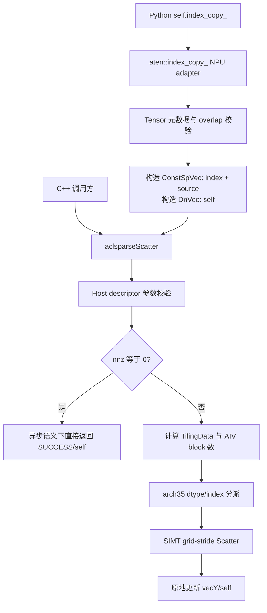
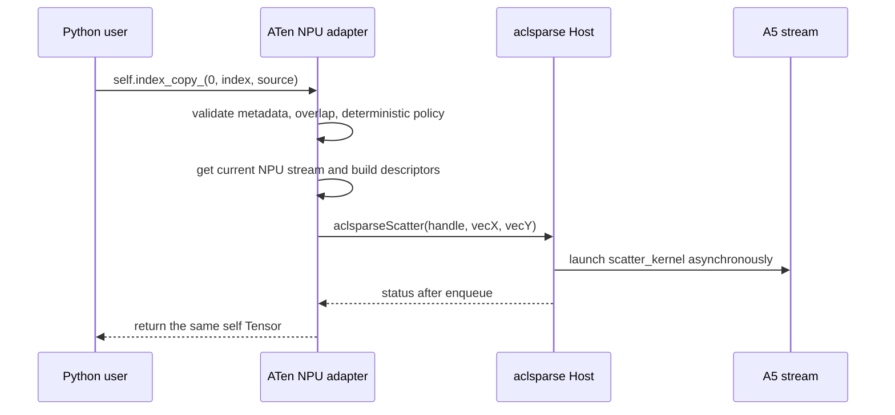
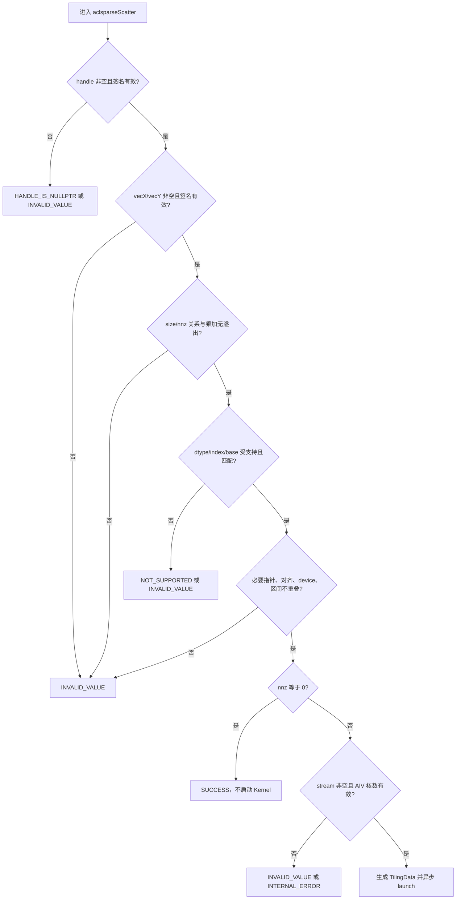
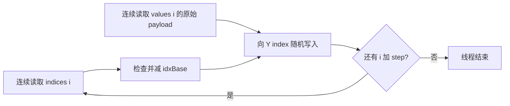

# aclsparseScatter 算子设计文档（Ascend 950 / A5）

# 需求背景（required）

## 需求来源

依据《aclsparseScatter 算子开发任务书（A5）》，参考 cuSPARSE `cusparseScatter` 的 Generic API 语义，面向 Ascend 950（DAV_3510，`arch35`，下文简称 A5）完善 `aclsparseScatter`，并为 PyTorch 一维原位入口 `Tensor.index_copy_(0, index, source)` / `aten::index_copy_` 提供 NPU 适配。核心路径必须在 NPU 执行，不允许 CPU fallback。

任务要求覆盖乱序索引以及重复索引的非确定性 last-write-wins，因此索引有序或唯一不作为接口前置条件。

## 背景介绍

### 算子功能

`aclsparseScatter` 将稀疏向量 `X` 的 values 按 indices 原地写入稠密向量 `Y`：

$$
Y[X.indices[i]-idxBase] \leftarrow X.values[i],\quad i\in[0,nnz)
$$

其中：

- `vecX.indices` 和 `vecX.values` 是只读 Device 数据；
- `vecY.values` 是唯一写目标，调用后仍由原描述符持有；
- `idxBase` 为 0 或 1；
- 未被任何 index 命中的 `Y` 元素保持调用前的位模式；
- `nnz=0` 时成功返回，不启动 Kernel，不修改 `Y`；
- 无重复 index 时每个目标地址只写一次，结果必须 bit-wise exact；
- 有重复 index 时多个线程可能竞争同一地址，最终值必须来自该地址对应的某个 `X.values[i]`，但不承诺由哪一个线程最后完成写入。

### Python / ATen 映射

Python 公开入口是原位操作：

```python
self.index_copy_(dim, index, source) -> Tensor
```

本任务覆盖一维连续向量，`dim` 规范化后必须为 0。此时 `source[i]` 正好对应稀疏向量的第 `i` 个 value，`index[i]` 对应稀疏 index，`self` 对应稠密向量 `Y`。

PyTorch 2.7 的 `index_copy_` 要求 `index` 为 LongTensor，即 `int64`。任务要求的 aclsparse 验收主矩阵是 I32 × base 0/1，但当前 `ops-sparse` A5 Scatter 已保留 I64 描述符与 Kernel 路径。因此 Python/ATen 适配直接使用 I64、base 0，不做 I64→I32 降采样，也不申请索引转换临时内存；C++ Generic API 的必测矩阵仍按任务书使用 I32、base 0/1。

### 当前代码基线与差距

当前 `ops-sparse` A5 Scatter 已有 Host、SIMT Kernel、TilingData、README 和 C++ 测试。方案复用现有实现并补齐任务能力，不新建第二套同名接口或重复 Kernel。

| 模块 | 基线现状 | 本任务设计增量 |
| --- | --- | --- |
| 公开接口 | `include/cann_ops_sparse.h` 已声明 `aclsparseScatter(handle, vecX, vecY)` | 原型不变；补齐五种 dtype、边界、异步、alias、生命周期和错误语义说明 |
| 公共描述符 | `aclsparseCreate{Const}SpVec` / `aclsparseCreateDnVec` 已接受 `ACL_INT8` 和 `ACL_COMPLEX64` | 复用现有能力；补 descriptor signature、device 和区间校验所需公共机制时保持 opaque ABI |
| A5 Host | 已校验部分 shape、指针、dtype、I32/I64、base 0/1，并按 AIV 核数启动 | 新增 int8/complex64 dispatch、完整签名/溢出/重叠/device 校验；消除不必要的 `UINT32_MAX` nnz 限制 |
| A5 Kernel | SIMT grid-stride；FP16/BF16/FP32；I32/I64；base 0/1 | 增加 1 字节与 8 字节 payload；按位搬运五种任务 dtype；保留 I64 兼容路径 |
| 测试 | 已有 FP16/BF16/FP32 的 C++ CSV/GTest | 补 int8、complex64、I32/base 0/1 任务矩阵、输入只读、alias、异常、重复索引 oracle 和 Python/ATen UT |
| Python/ATen | 当前基线未提供 `aten::index_copy_` NPU adapter | 新增 PrivateUse1/NPU 后端注册、元数据校验、描述符桥接、stream/lifetime 管理与无 fallback 证据 |

# 需求分析（required）

## 需求描述

在 A5 上完善 `aclsparseScatter`，支持 `int8`、`float16`、`bfloat16`、`float32`、`complex64`，支持 I32 index 和 base 0/1，允许乱序 index。重复 index 按非确定性 last-write-wins 处理。提供 PyTorch 2.7+ / torch_npu 26.0.0+ 的一维 `aten::index_copy_` NPU 适配，保持原位、alias、异常、异步和无 CPU fallback 语义。

## 需求拆解

### 功能需求

1. 保持 `aclsparseScatter` 公开 C++ 原型不变，保持源代码兼容。
2. A5 必须覆盖五种 values dtype × I32 × base 0/1，共 10 个 Generic API 组合。
3. 乱序 index 与顺序 index 语义一致，不要求排序或预处理。
4. distinct indices 时输出 bit-wise exact；重复 indices 时只验证最终值属于对应候选 values，不宣称确定顺序。
5. `vecX` 全部数据只读，`vecY` 只修改被 index 命中的元素。
6. 覆盖动态 `size`/`nnz`、`nnz=0/1`、首尾 index、非整线程块尾部和规模上界。
7. Python 路径命中 `aten::index_copy_` NPU backend，原地修改并返回同一个 `self` Tensor。

### 工程与资源需求

1. Host 使用调用方 handle 上绑定的 stream 异步下发，不插入 Host 同步。
2. Kernel 单次完成 scatter；不新增 preprocess 或 workspace。
3. 不分配随 `size` 或 `nnz` 线性增长的临时 Host/Device 缓冲区。
4. A5 实现位于 `sparse/scatter/arch35/`，不破坏 A2/A3 路径。
5. C++ UT/ST、Python/ATen UT、公开头文件注释和 README 与实现同步。

### 验收需求

1. distinct indices：五种 dtype 均做逐字节比较，`atol=0`、`rtol=0`。
2. duplicate indices：目标元素属于同 index 的输入候选集合；其他元素和全部输入不变。
3. 通过 NPU Dispatch 日志和 Profiler 证明 `index_copy_` 核心路径无 CPU fallback。
4. P-01/P-02/P-03 每个声明 dtype/base 组合的性能倍率均不低于 0.3。
5. 验收报告记录实际硬件、CANN、驱动、固件、torch/torch_npu 和代码 commit，以及对应实测数据。

## 范围与非目标

| 项目 | 本任务范围 | 非目标/处理方式 |
| --- | --- | --- |
| aclsparse C++ | 一维 SpVec→DnVec 原位 scatter | 不新增同功能 API，不改变函数参数顺序 |
| C++ values dtype | int8/FP16/BF16/FP32/complex64 | 公共描述符支持的其他 dtype 不因此自动成为 Scatter 支持能力 |
| C++ index | I32、base 0/1 为验收主矩阵 | 现有 I64 能力保留，供 PyTorch Long index 和兼容调用使用 |
| Python/ATen | 一维连续 `self/index/source`，`dim` 规范化后为 0，Long index | 多维 slice copy、非连续 stride、out-of-place `index_copy` 不在本任务范围；返回明确不支持错误 |
| 重复 index | 非确定性 last-write-wins | 不排序、不去重、不做原子累加，也不提供确定性模式 |
| Autograd | 复用 PyTorch 对原位算子的既有 Autograd/版本计数规则 | 不新增独立 backward Kernel |

## 算子原型

### Python 公开入口

```python
Tensor.index_copy_(dim: int, index: Tensor, source: Tensor) -> Tensor
```

### ATen schema

```text
aten::index_copy_(Tensor(a!) self, int dim, Tensor index, Tensor source) -> Tensor(a!)
```

### aclsparse C++ Generic API

```c
aclsparseStatus_t aclsparseScatter(
    aclsparseHandle_t handle,
    aclsparseConstSpVecDescr_t vecX,
    aclsparseDnVecDescr_t vecY);
```

公开原型以 `include/cann_ops_sparse.h` 为准。本设计不增加参数；A5 专用的 `nnz`、`sizeY`、dtype、index type 和 base 通过 opaque descriptor 提取后按值写入内部 TilingData。

## C++ 参数规格

| 参数 | I/O | 规格 | 校验与错误行为 |
| --- | --- | --- | --- |
| `handle` | 输入 | 已创建、有效并绑定非空 stream | 空 handle 返回 `ACL_SPARSE_STATUS_HANDLE_IS_NULLPTR`；签名/stream/device 状态非法返回参数错误 |
| `vecX` | 输入 | SpVec；`indices[nnz]`、`values[nnz]`；任务主矩阵为 I32、base 0/1、五种 dtype | 空或失效描述符、负数构造、非法 index/base/dtype、`nnz>size`、非空规模下空指针返回错误 |
| `vecY` | 输入输出 | 连续一维 DnVec `[sizeY]`；dtype 与 `vecX.values` 相同 | 空或失效描述符、dtype/device 不一致、非空规模下空指针、与只读输入区间重叠返回错误 |

描述符与 Device 数据指针由调用方保持有效，直到关联 stream 上的 Scatter 执行完成。Host 返回成功表示校验通过且 Kernel 已入队，不表示 Device 执行已经结束。

## Python/ATen 支持条件

| 项目 | 支持条件 | 不满足时 |
| --- | --- | --- |
| `self` | NPU、一维、连续、strided layout、五种任务 dtype | 明确报错，不 materialize 隐式副本，不 fallback |
| `source` | 与 `self` 同 device/dtype/layout；一维连续；`source.numel()==index.numel()` | 对齐 PyTorch shape/dtype/device 错误 |
| `index` | NPU、Long (`int64`)、一维且连续 | 非 Long、非一维或非连续返回明确错误 |
| `dim` | 一维 Tensor 上规范化后为 0，即接受 `0` 与 `-1` | 其他值按 PyTorch wrap-dim 规则报越界 |
| alias | `self` 无 internal overlap，且不与 `index`/`source` storage 重叠 | 使用 PyTorch overlap 检查返回错误 |
| index 值域 | 每项位于 `[0,self.size(0))`；负 index 不接受 | 通过 NPU/torch_npu 既有 Device 异步索引错误机制上报，不 D2H |
| empty | `index/source` 同为空时不启动 Kernel | 原样返回 `self`，storage 不变 |

PyTorch 文档明确指出重复 index 的结果非确定；适配层应像 PyTorch 现有后端一样，在进入执行路径时把整个操作登记为 nondeterministic。由于不能在不扫描 Device index 的前提下预知是否重复，`torch.use_deterministic_algorithms(True)` 开启时应按框架策略拒绝该操作，而不是隐式 D2H、增加去重 Kernel，或只凭元数据猜测可以放行。

## 形状与规模边界

| 项目 | 设计限制 |
| --- | --- |
| `sizeY` | `>=0`；`nnz>0` 时必须 `>0` |
| `vecX.size` | `0 <= vecX.size <= sizeY` |
| `nnz` | `0 <= nnz <= vecX.size`；同时满足各字节数与地址区间可由 `size_t`/`uintptr_t` 安全表示 |
| I32/base 0 | `sizeY <= 2^31`，最大合法 encoded index 为 `INT32_MAX` |
| I32/base 1 | `sizeY <= INT32_MAX`，合法 encoded index 为 `[1,sizeY]` |
| I64/base 0 | `sizeY <= INT64_MAX`，合法 index 为 `[0,sizeY)` |
| I64/base 1 | `sizeY < INT64_MAX`，合法 encoded index 为 `[1,sizeY]` |

Host 对 `nnz*indexBytes`、`nnz*valueBytes`、`sizeY*valueBytes` 及地址末端计算使用 checked arithmetic，拒绝整数回绕。`numBlocks` 最终受实际 AIV 核数约束，因此不需要把 `nnz` 人为截断为 `UINT32_MAX`；Kernel 的循环上界和步进统一使用 `uint64_t`。

# 详细设计（required）

## 算子分析

### 数学不变量

令 `b=idxBase∈{0,1}`，对任意合法输入：

$$
p_i=X.indices[i]-b,\quad 0\le p_i<sizeY
$$

若某个位置 `j` 没有对应 index，则：

$$
Y_{after}[j]=Y_{before}[j]
$$

若位置 `j` 只被一个 `i` 命中，则：

$$
Y_{after}[j]\equiv_{bits}X.values[i]
$$

若位置 `j` 被集合 $S_j=\{i\mid p_i=j\}$ 中多个元素命中，则：

$$
Y_{after}[j]\in_{bits}\{X.values[i]\mid i\in S_j\}
$$

最后一式是验收 oracle，不规定 $S_j$ 中的顺序。实现不得把重复 index 解释为求和、最大值或固定的序列最后值。

### 架构选型

| 候选 | 适用性 | 结论 |
| --- | --- | --- |
| A5 SIMT | 每个 `i` 独立；一次连续 index/value 读与一次不规则 GM 写；标量地址计算；几乎无算术 | 采用。线程级随机访存与现有 arch35 基线路径匹配 |
| A5 SIMD-RegBase | 适合规则连续向量块和向量 API；Scatter 的输出地址由 index 决定，UB 搬入后仍需不规则写回 | 不作为主路径；会引入无必要 UB/搬运和复杂尾块 |
| Cube | 面向矩阵乘加 | 不适用 |

选择 SIMT 的依据是计算范式和访存特征，同时也与现有 `sparse/scatter/arch35/` 实现一致。Kernel 不使用 Cube、原子加法、排序或归约。

## 总体架构



分层职责如下：

| 层 | 职责 |
| --- | --- |
| Python/ATen | 对齐 schema、shape/dtype/device/layout/stride/alias 与原位返回语义；绑定当前 NPU stream；状态码转 PyTorch 异常 |
| aclsparse Host | 校验 handle/descriptor/指针/规模/类型/base/device/重叠；`nnz=0` 快返；按值生成 TilingData 并 launch |
| A5 Kernel | 一线程处理一个或多个 `i`；读取 index 和原始 payload；Device 值域错误按异步协议上报；向 `Y` 随机写入 |

## Python / ATen 侧设计

### 调用时序



### Dispatcher 与原位语义

1. 在仓库约定的 torch adapter 目录注册 `aten::index_copy_` 的 NPU/PrivateUse1 实现；实际 dispatch key、代码生成入口和注册宏以 torch_npu 26.0.0 的现有 backend 配置为准。
2. 不注册本任务范围外的 out-of-place `aten::index_copy`，避免把原位和 functional 语义混为一谈。
3. adapter 不分配输出，`vecY.values` 直接指向 `self.data_ptr()`；返回 `self` 的同一 Tensor 对象。
4. `source` 和 `index` 通过 const SpVec 描述符传入，接口完成前由 Tensor 对象和当前 stream 的生命周期机制保持 Device storage 有效。
5. PyTorch Autograd 对原位修改的叶子检查、版本计数和 view 约束由框架入口继续负责；backend 不绕开这些检查。
6. 不支持组合必须在 NPU backend 内抛出带参数信息的错误，禁止 redispatch 到 CPU。

### Long index 与描述符映射

| PyTorch 对象 | aclsparse 对象 | 关键字段 |
| --- | --- | --- |
| `index` | `vecX.indices` | I64，base 0，长度 `nnz` |
| `source` | `vecX.values` | values dtype，长度 `nnz`，只读 |
| `self` | `vecY.values` | values dtype，长度 `sizeY`，原位写目标 |

该映射复用基线已有 I64 Kernel，不做 index cast。Generic C++ 的 I32/base 0/1 测试与 Python 的 I64/base 0 分开验收，避免用 Python 非标准 int32 index 冒充 PyTorch 兼容。

### Device index 异常

Host 不能读取 Device index，禁止为了逐元素检查加入 D2H 或 stream 同步。TilingData 下发 `sizeY`，SIMT 线程在写前检查 encoded index。非法 index 通过目标 CANN/torch_npu 已有的生产级 Device 异步错误上报设施报告，并跳过非法写入；确切设施和调用形式必须在实现阶段从 CANN 9.1 与 torch_npu 26.0.0 的现有索引算子中核验后使用。

若目标版本没有可复用的生产级异步索引错误机制，则不得用调试 `assert/printf` 或 CPU 检查替代；该条件下 Python 越界异常语义不满足交付要求。合法性能用例不触发此分支。

## Host 侧设计

### 校验顺序



### 校验细节

1. 检查 handle 和 descriptor 的 opaque signature，拒绝已销毁或类型混用对象。
2. 检查 `nnz<=vecX.size<=vecY.nums`，并按 index base 检查可表示的最大 `sizeY`。
3. `nnz>0` 时 `indices`、`X.values`、`Y.values` 均不得为空；`nnz=0` 时不解引用三者并直接成功返回。
4. Scatter A5 任务 dtype 只接受 `ACL_INT8`、`ACL_FLOAT16`、`ACL_BF16`、`ACL_FLOAT`、`ACL_COMPLEX64`，并要求 X/Y dtype 相同。
5. 任务 index 接受 I32；为 Python 和兼容性保留现有 I64；base 只接受 ZERO/ONE。
6. `vecX.indices` 与 `vecX.values` 遵循 16 字节稀疏数组对齐约束；`vecY.values` 至少满足其 payload 的自然对齐。若公共 descriptor 层已有更严格且兼容的对齐契约则复用，不在 Scatter 内降低。
7. 使用 checked byte range 拒绝 `Y.values↔X.values`、`Y.values↔X.indices` 以及 `X.values↔X.indices` 的任何重叠；与 PyTorch overlap 规则一致。
8. Tensor 入口先做同 device 检查；Generic API 复用仓内公共 device 归属校验。若公共 descriptor 暂无 device 元数据，在 opaque 内部创建时缓存 device id，并与 handle/stream device 比较，不改变公开结构声明。
9. 合法参数通过后，Host 只计算标量 TilingData，不读取 Device 内容，不同步 stream。

### 状态码设计

| 状态 | 场景 |
| --- | --- |
| `ACL_SPARSE_STATUS_SUCCESS` | 参数合法；`nnz=0` 快返或 Kernel 成功入队 |
| `ACL_SPARSE_STATUS_HANDLE_IS_NULLPTR` | `handle==nullptr` |
| `ACL_SPARSE_STATUS_INVALID_VALUE` | descriptor/签名/shape/base/指针/对齐/device/overlap/溢出或 stream 非法 |
| `ACL_SPARSE_STATUS_NOT_SUPPORTED` | Scatter 不支持的 value/index type 组合 |
| `ACL_SPARSE_STATUS_INTERNAL_ERROR` | AIV 核数查询或内部调度状态异常 |

Device index 越界在 stream 执行阶段异步上报；Host 同步返回值只反映入队前可判定的错误。

## Tiling 与多核切分

### TilingData

```cpp
struct ScatterTilingData {
    uint64_t nnz;
    uint64_t sizeY;
    int32_t idxBase;
    int32_t idxType;
    int32_t payloadKind;
};
```

`payloadKind` 只用于映射元素字节宽度，不触发数值运算。Host/Kernel 共享唯一结构定义并按值传递，不使用独立 workspace。

### 分核公式

设 `T=256` 为每个 VF block 的线程数，`C=GetAivCoreCount()` 为运行时 AIV 核数：

$$
B=\min\left(C,\left\lceil\frac{nnz}{T}\right\rceil\right),\quad nnz>0
$$

Host 使用 `uint64_t` 计算上式，先与 `C` 取最小值，再安全转换为 Kernel launch 所需的 block 数类型。`nnz>0` 时保证 `B>=1`。

每个线程的全局逻辑下标和步进为：

$$
i_0=blockIdx\times T+threadIdx,\quad step=B\times T
$$

线程执行 `for (i=i0; i<nnz; i+=step)`，所以任意 `nnz`、包括非 256 倍数尾块，都恰好覆盖一次逻辑输入。多核间无需同步。

### Kernel 数据流



### dtype 分派与位保持

| 任务 dtype | aclDataType | payload 类型 | 单元素字节数 | 语义 |
| --- | --- | --- | ---: | --- |
| int8 | `ACL_INT8` | `uint8_t` | 1 | 原始 8 bit 拷贝 |
| float16 | `ACL_FLOAT16` | `uint16_t` | 2 | 原始 16 bit 拷贝，不做 FP 运算 |
| bfloat16 | `ACL_BF16` | `uint16_t` | 2 | 原始 16 bit 拷贝，不做 FP 运算 |
| float32 | `ACL_FLOAT` | `uint32_t` | 4 | 原始 32 bit 拷贝，不做 FP 运算 |
| complex64 | `ACL_COMPLEX64` | `uint64_t` | 8 | 实部+虚部整体 64 bit 拷贝 |

以无符号整数作为 opaque payload 可保证 `-0`、INF、NAN payload、subnormal 以及 complex64 实虚部位模式不经过算术或类型转换。`uint64_t`、`uint32_t`、`uint16_t`、`uint8_t` 均属于 A5 SIMT VF 支持的标量类型。

Kernel 分派维度是 `(payloadKind, idxType)`；base 通过标量减法处理，0-based 时减 0，不引入数据相关分支。仅在 Profiler 证明 base 运算或分派构成显著瓶颈时评估 base 编译期特化。

### Buffer 与 UB 规划

| Buffer | 位置 | 大小 | 说明 |
| --- | --- | ---: | --- |
| indices | GM 输入 | `nnz*indexBytes` | 调用方持有，连续读 |
| values | GM 输入 | `nnz*valueBytes` | 调用方持有，连续读 |
| Y | GM 输入输出 | `sizeY*valueBytes` | 调用方持有，随机原位写 |
| UB/L1 临时 Buffer | 无 | 0 B | 单次使用数据且输出地址不规则，UB 中转无复用收益 |
| workspace | 无 | 0 B | 无 preprocess、排序、去重或归约 |

本算子不适用“用满 UB”的常规块处理原则：分配 UB 只会增加一次 GM↔UB 搬运，仍无法将随机目标地址转换为连续 CopyOut。显式规划 0 B UB 是该 SIMT 访存模式下的设计选择。

## 重复 index 与并发语义

distinct indices 时，每个目标地址只有一个 writer，不需要原子操作，结果确定且逐位一致。duplicate indices 时，多个线程对同一、自然对齐的 payload 地址执行同宽度写入；最终值取决于调度完成顺序。实现不使用 atomic add、不对 values 合并、不排序 index，因此保持任务要求的非确定性 last-write-wins。

int8/FP16/BF16/FP32/complex64 的写入必须使用对应自然宽度，避免把 complex64 拆成两个独立 32 bit 写导致实部/虚部来自不同 source。若目标编译器不能保证 8 字节单次 payload 写入，则 complex64 不满足交付要求，不能用两次 FP32 写替代。

## 接口与能力约束

| 能力项 | 设计依赖 | 核验来源 | 方案状态 |
| --- | --- | --- | --- |
| `__simt_vf__` + VF call | A5 SIMT 主循环 | 基线 `scatter_kernel.cpp` 与 A5 SIMT 编程模型 | 已有基线路径 |
| grid-stride 64 位计数 | 大 `nnz` 覆盖 | 基线实现与 SIMT thread-stride 规范 | 已有基线路径，Host 需移除 U32 截断 |
| 1/2/4/8 字节 GM payload | 五种 dtype 位拷贝 | A5 SIMT 标量类型表与目标工具链编译验证 | 1/2/4 已有同类路径；8 字节写入必须验证 |
| Device index 异步错误 | PyTorch 越界语义 | CANN 9.1 / torch_npu 26.0 现有索引算子 | 必须复用生产级机制 |
| descriptor/device 校验 | Generic API 错误语义 | `ops-sparse` 公共 descriptor/handle | 已有 signature，device 元数据视主干公共机制补齐 |

所有新增 CANN 接口调用均以目标版本头文件定义为准，并核验函数签名、类型和产品支持范围。

## 代码落位

| 路径 | 设计变更 |
| --- | --- |
| `include/cann_ops_sparse.h` | 保持原型；更新五 dtype、I32/base、异步、边界、alias 与生命周期说明 |
| `sparse/common/aclsparse_*_internal.*` | 仅在公共机制缺失时补 signature/device 元数据；保持 opaque ABI 与其他算子兼容 |
| `sparse/scatter/arch35/scatter_host.cpp` | 完整校验；int8/complex64 映射；64 位 block 公式；生成含 `sizeY` 的 TilingData |
| `sparse/scatter/arch35/scatter_kernel.cpp` | opaque payload 分派；I32/I64 + base 0/1；Device 值域检查；单 Kernel grid-stride scatter |
| `sparse/scatter/arch35/scatter_tiling_data.h` | 扩展 `sizeY` 与 payload kind，Host/Kernel 单一定义 |
| `sparse/scatter/README.md` | 同步接口、能力、限制、错误和示例 |
| `test/scatter/arch35/` | C++ 功能/异常/边界/重复/五 dtype/输入只读与 alias 测试 |
| torch_npu 对应算子适配目录 | 新增 `aten::index_copy_` NPU adapter 与构建接入 |
| `test/scatter/python/` | Python 端到端、Dispatcher、in-place、异常和无 fallback UT |

Python adapter 接入 torch_npu 26.0.0+ 的统一后端注册与构建框架，不重复搭建 dispatcher 基础设施。具体目录遵循代码合入时的主干结构，不改变 schema、数据流和验收要求。

## 支持硬件

| 支持的芯片版本 | 本任务状态 |
| --- | --- |
| Ascend 950PR / Ascend 950DT（DAV_3510 / `arch35`） | 支持并验收 |
| A2/A3 及其他架构 | 本任务不新增；保留既有 arch22/公共逻辑，不做能力回退 |

## 算子约束限制

- A5 任务 values dtype 为 int8/FP16/BF16/FP32/complex64；X/Y dtype 必须一致。
- Generic API 任务主矩阵为 I32、base 0/1；现有 I64 路径保留，PyTorch Long index 使用 I64/base 0。
- `vecX.indices[i]-idxBase` 必须位于 `[0,sizeY)`；非法值按 Device 异步错误协议处理。
- 输入可乱序、可重复；重复时不保证确定的 writer 顺序。
- 不允许输出 Y 与 indices/values 重叠；Python `self` 也不得与 `source/index` 重叠。
- 不使用 workspace、preprocess、Host 同步或 CPU fallback。
- Python 适配仅覆盖一维连续 `index_copy_` 子集；不支持项返回明确错误。

# 可维可测分析

## 精度标准

Scatter 不进行浮点计算，五种 dtype 的合法 distinct-index 用例都采用逐字节比较：

- int8 按原始 8 bit 模式比较；
- FP16/BF16 的数据按任务规则由 FP32 Golden 数据生成，再比较最终 16 bit payload；
- FP32 由 FP64 Golden 数据生成，再比较最终 32 bit payload；
- complex64 由 complex128 Golden 数据生成并转换为 complex64，再比较完整 8 字节 payload；
- `+0/-0`、INF、NAN、subnormal、边界值和离群值不经数值转换；NAN 按任务精度标准判断，并额外检查 payload 未被 Kernel 改写；
- 调用前后逐字节比较 `X.indices`、`X.values` 和 Y 的未命中位置。

duplicate-index 用例不得使用 CPU 顺序循环的“固定最后一个值”作为唯一答案。正确 oracle 是：每个重复目标的最终 payload 属于所有命中该目标的 source payload 集合，且不出现集合外位模式。

## 测试方案

### 分层验证

| 层 | 验证内容 | 关键证据 |
| --- | --- | --- |
| Python 端到端 | `self.index_copy_(0,index,source)` 五 dtype、Long index、动态规模、空输入、重复/乱序、异常与 alias | 返回对象/storage 与 `self` 相同；输出语义正确；输入只读 |
| ATen Dispatcher | `aten::index_copy_` NPU 注册命中；deterministic policy；device/layout/stride 检查 | Dispatch dump 无 CPU Kernel，错误信息可定位 |
| aclsparse C++ | 五 dtype × I32 × base 0/1；handle/descriptor/pointer/size/type/base/device/overlap | 返回码、canary、输入只读、边界覆盖 |
| Ascend C Kernel | `nnz=0/1`、255/256/257、尾块、大 `nnz`、首尾/重复/乱序 index | distinct bit-wise exact；duplicate membership oracle |
| Profiler | P-01/P-02/P-03 及泛化性能用例 | 仅出现 NPU Scatter 路径，无 preprocess/workspace/CPU fallback |
| 资源鲁棒性 | 重复创建/执行/销毁 handle 和描述符，多 stream | 无泄漏、无非法同步、生命周期正确 |

### 用例覆盖矩阵

| 类别 | 必测场景 |
| --- | --- |
| dtype/base | 五 dtype × I32 × base 0/1 全组合；Python 五 dtype × Long/base 0 |
| shape | `size/nnz` 动态组合；`0/0`、`size>0,nnz=0`、`nnz=1`、`nnz=size`、非 256 倍数 |
| index 形态 | 顺序、逆序、随机乱序、重复、首元素、末元素、集中热点与均匀分布 |
| 数值 | 普通值、正负混合、零、小值、边界、离群、允许的 INF/NAN、complex64 实/虚部专项 |
| 异常 | 空/失效 handle/descriptor、空指针、非法 dtype/index/base、shape 关系、溢出、非连续 Tensor、device 不一致、storage overlap、越界 index |
| 语义 | X/indices 只读，Y 非命中区不变，Python 返回同一 self，duplicate 非确定，deterministic mode 行为 |

### 数据生成规则

- 固定随机种子；values 中 70% 使用 `[-1,1]` 均匀分布，20% 使用 `μ=0,σ=1` 正态分布，10% 使用零/边界/特殊值；
- int8 覆盖 `INT8_MIN`、`-1`、`0`、`1`、`INT8_MAX` 与随机位模式；
- complex64 的实部和虚部分别生成，专项组合 `±0`、INF、NAN 和不同 payload；
- 合法 indices 在对应 base 的合法闭区间生成；分别构造 unique 与 duplicate 集合；性能用例只使用 unique indices；
- 非法用例独立构造负 index、上界 index、base 编码错误、空指针、区间重叠和设备不一致，避免污染合法随机用例。

## 性能标准与分析

性能倍率定义为：

$$
ratio=\frac{GPU\ Device\ Event\ median\ time}{NPU\ 同调用范围全部\ Kernel\ median\ time}
$$

每个 case 预热至少 10 次、采样 30 次，记录 median 和 p90；排除首次编译、数据生成、H2D 和无关初始化；复用 handle/descriptor，固定 seed。报告应同时给出 aclsparse Kernel 与 Python/ATen 端到端耗时。

| 场景 | size | nnz | 组合 | 任务书 GPU median | 对应 NPU 合格边界 |
| --- | ---: | ---: | --- | --- | --- |
| P-01 Llama 3.1 70B | 128256 | 8192 | 五 dtype × base 0/1 | 28.272–29.456 μs | 每组合 `NPU median <= 对应 GPU median / 0.3`，约 94.240–98.187 μs |
| P-02 Qwen3-235B-A22B | 151936 | 4096 | 五 dtype × base 0/1 | 28.208–28.768 μs | 约 94.027–95.893 μs |
| P-03 DeepSeek-V3 | 129280 | 7168 | 五 dtype × base 0/1 | 28.080–29.344 μs | 约 93.600–97.813 μs |

上述范围只用于解释 0.3 倍门槛，最终必须按同一 dtype/base 的对应 GPU baseline 逐项计算，不能用区间上界替代逐项验收。

### 瓶颈分析

对于 I32，单个非零元素的有用 GM 流量约为：

$$
4\ bytes\ (index)+s\ bytes\ (value\ read)+s\ bytes\ (Y\ write)=4+2s\ bytes
$$

其中 `s∈{1,2,4,8}`。每个元素只有一次 base 减法、范围比较和地址计算，算术强度极低；Y 写地址随 index 分布变化。P-01/P-02/P-03 的 `nnz` 为 4096–8192，主要性能影响因素是 Kernel launch 开销和不规则 GM 写延迟。使用 Profiler 的 Kernel duration、GM 带宽/延迟相关指标和流水单元占比验证；若分派或范围检查占主导，再调整优化优先级。

### 性能优化项

| 编号 | 优化项 | 面向瓶颈 | 要求 | 是否改变数值路径 |
| --- | --- | --- | --- | --- |
| O1 | 单 Kernel、无 preprocess/workspace/Host sync | launch 开销 | 必落地 | 否 |
| O2 | SIMT grid-stride，多 AIV 动态分核 | 并行度与 GM latency hiding | 必落地 | 否 |
| O3 | indices/values 连续读，Y 直接 GM 写，无 UB 中转 | 搬运开销 | 必落地 | 否 |
| O4 | dtype 统一映射为 1/2/4/8 字节 opaque payload | dispatch 与位保持 | 必落地 | 否 |
| O5 | base 编译期特化或适度循环展开 | 标量/指令开销 | 可选，必须由 Profiler 证明收益 | 否 |

不得为了性能对 indices 排序、去重或在 Host 预读，因为这会改变 duplicate 语义、引入线性内存或同步。

## 内存标准

对任务主矩阵 I32，调用方已有输入输出总量为：

$$
M_{cpp}=nnz\times4+nnz\times s+sizeY\times s
$$

Python Long index 路径为：

$$
M_{python}=nnz\times8+nnz\times s+sizeY\times s
$$

`self/vecY` 原位复用，workspace 为 0，不增加第二份 Y、排序表或 index 转换数组。若输入输出总量超过 500 MB，使用任务包 GPU/NPU 内存采集脚本比较 `input_baseline_*_bytes`、`peak_*_bytes`、`extra_peak_*_bytes`，验证 NPU 额外内存不超过 GPU 使用内存总量的 50%；若未超过 500 MB，则记录实际峰值并证明固有 workspace 为 0。

## 可维护性与可观测性

- Host 使用仓内统一日志宏，错误日志包含参数名、实际值与支持范围，不打印 Device 数据。
- value dtype→payload kind、index type 和 base 的映射集中管理，不复制五套主循环。
- TilingData 在 Host/Kernel 只有一个定义，按值传递，不依赖隐藏全局状态。
- Kernel 名称保持稳定，便于 Profiler 证明 NPU Dispatch 和统计调用范围。
- README、公开头文件、C++ 测试和 Python 测试必须在实现 PR 中同步更新。
- A2/A3 与 A5 的公共 Host 冲突按“后合入者基于最新 master 解决并交叉回归”处理。

## 兼容性分析

- `aclsparseScatter` 原型不变；int8/complex64 是能力扩展。
- 现有 FP16/BF16/FP32、I32/I64、base 0/1 行为不得回退。
- common descriptor 已接受 int8/complex64；本任务只扩大 Scatter 自身 dispatch，不改变其他算子的支持声明。
- opaque descriptor 增补内部字段不暴露布局给调用方；公共变更必须跑相关 descriptor/算子回归。
- arch35 Kernel 与 arch22 Kernel 分目录；A5 代码不使用 A2/A3 专有实现。
- Python 只覆盖任务声明的一维 in-place overload；不抢占其他 overload 或用 catch-all fallback。

## 风险与对策

| 风险 | 影响 | 对策 |
| --- | --- | --- |
| 8 字节 GM 写不能保证单 payload 完成 | duplicate complex64 可能出现实虚部撕裂 | 使用 A5 目标工具链验证；只接受单次 8 字节 payload 写入，否则 complex64 不满足交付要求 |
| PyTorch Long index 与任务 I32 被混为一谈 | Python 语义不兼容或产生临时转换 | Python 复用现有 I64/base 0；C++ 单独验收 I32/base 0/1 |
| Device 越界错误机制不明确 | 无法对齐 PyTorch 异常 | 从 torch_npu 26.0 既有索引算子复用生产级异步设施；不使用 CPU 检查或调试 assert 代替 |
| duplicate index 被顺序 Golden 误判 | 正确的非确定结果被判失败 | 使用候选 payload 集合 oracle；性能 case 禁用重复 |
| descriptor 增补 device 元数据影响公共 ABI | 其他算子回归 | 只修改 opaque 内部结构并默认初始化；优先复用主干公共机制；增加公共回归 |
| 小 nnz 由 launch 开销主导 | 0.3 倍门槛风险 | `nnz=0` 快返；`nnz>0` 单 Kernel；线程数/展开只按实测调整 |
| Python adapter 所在仓库目录发生调整 | 构建接入返工 | 按最新 master 与 torch_npu 26.0 的统一框架接入；保持 schema 和数据流不变 |

## 需求承接矩阵

| 任务要求 | 设计承接位置 |
| --- | --- |
| 五种 dtype、I32、base 0/1 | 支持矩阵、payload 分派、C++ 用例矩阵 |
| complex64 全链路 | 8 字节 payload、接口能力约束、专项测试与风险对策 |
| Python/ATen 必选 | 原型、Tensor 校验、Long→I64 描述符映射、Dispatcher 测试 |
| in-place/alias/异常 | Python 支持条件、Host 校验、Device 越界机制、异常用例 |
| 乱序/重复 last-write-wins | 数学 oracle、并发语义、duplicate 用例 |
| `nnz=0/1`、动态规模、尾块 | Host 快返、64 位 Tiling、grid-stride、shape 用例 |
| 无 CPU fallback | 总体架构、adapter 规则、Dispatch/Profiler 证据 |
| 无 workspace/Host 同步 | Buffer 规划、O1/O3、内存标准 |
| 性能倍率不低于 0.3 | P-01/P-02/P-03 表、采集口径、瓶颈分析 |
| 输入只读和未命中 Y 不变 | 数学不变量、精度标准、canary/只读测试 |
| A5 / arch35 与 A2/A3 共存 | 架构选型、代码落位、兼容性分析 |
