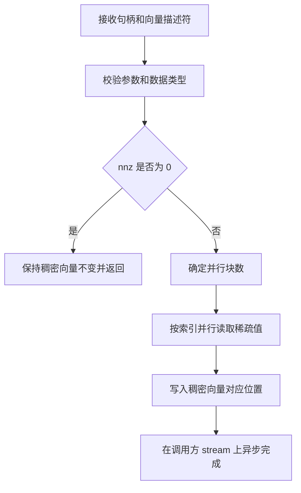
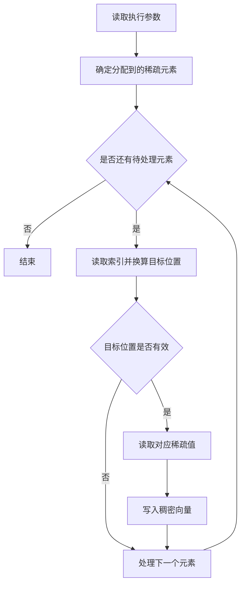

# aclsparseScatter 算子设计文档

## 一、需求背景

### 1.1 需求来源

面向 Ascend 950PR 完善 `aclsparseScatter`，将稀疏向量中的有效值按索引写入稠密向量，并提供 C++ 描述符接口和 PyTorch NPU 适配能力。

### 1.2 背景介绍

#### 1.2.1 aclsparseScatter 算子实现

稀疏向量由逻辑长度、非零元素数量、索引数组和值数组组成。算子读取每个稀疏元素的索引，将对应值写入稠密向量；没有被索引命中的位置保持原值。

设稀疏向量为 `X`，稠密向量为 `Y`，索引基址为 `base`，则计算关系为：

$$
Y[X.indices[i]-base]=X.values[i],\quad 0\le i<X.nnz
$$

该操作只搬运数据，不进行数值运算。写入值保持原始位模式，适用于整数、浮点和复数数据。

#### 1.2.2 接口能力分析

##### 1.2.2.1 支持的数据类型和数据格式

| 对象 | 数据类型 | 数据排布 | 逻辑形状 |
| --- | --- | --- | --- |
| `X.indices` | INT32；兼容 INT64 | 连续一维数组 | `[nnz]` |
| `X.values` | INT8、FLOAT16、BFLOAT16、FLOAT32、COMPLEX64 | 连续一维数组 | `[nnz]` |
| `Y.values` | 与 `X.values` 相同 | 连续一维数组 | `[size]` |

索引基址支持 0 和 1。索引可以有序或无序。多个索引指向同一位置时会发生并行写入，最终值由实际完成顺序决定。

##### 1.2.2.2 接口处理流程

调用方创建稀疏向量和稠密向量描述符，并将它们与句柄传入接口。Host 侧校验描述符、数据类型、尺寸和 stream，随后根据非零元素数量确定并行规模。Kernel 按索引读取值并直接写入稠密向量，不申请工作空间。

##### 1.2.2.3 接口处理流程图

## 二、需求分析

### 2.1 外部组件依赖

| 组件 | 用途 |
| --- | --- |
| CANN ACL Runtime | 管理设备、stream 和 Kernel 异步下发 |
| Ascend C SIMT API | 提供线程级并行执行能力 |
| ops-sparse 基础组件 | 提供句柄、稀疏向量描述符和稠密向量描述符 |
| PyTorch 与 torch_npu | 提供 Tensor 校验、NPU Dispatcher 和当前 stream |

### 2.2 内部适配模块

| 模块 | 职责 |
| --- | --- |
| 公共接口 | 提供 `aclsparseScatter` 调用入口 |
| Host | 完成参数校验、类型映射、分核和 Kernel 下发 |
| TilingData | 传递非零元素数量、索引基址、索引类型和值类型 |
| Kernel | 完成索引换算和稀疏值写入 |
| PyTorch 适配 | 构造输出或执行原位更新，并复用当前 NPU stream |
| 测试 | 验证接口语义、异常处理、精度、性能和内存占用 |

### 2.3 需求模块设计

#### 2.3.1 Ascend C 算子原型

对外接口为 `aclsparseScatter(handle, vecX, vecY)`，返回 `aclsparseStatus_t` 状态码。

| 参数 | 方向 | 含义 |
| --- | --- | --- |
| `handle` | 输入 | ops-sparse 句柄，保存调用方 stream |
| `vecX` | 输入 | 只读稀疏向量描述符，包含长度、非零元素、索引、值、类型和索引基址 |
| `vecY` | 输入输出 | 稠密向量描述符，原地接收散布结果 |

接口将 Kernel 异步加入 `handle` 关联的 stream。调用方在读取结果前负责完成相应的 stream 同步。

PyTorch 适配支持两种使用方式：一种创建零初始化的一维稠密输出，另一种通过公开 `Tensor.index_copy_` 入口和 `aten::index_copy_` NPU Dispatcher 原地更新已有输出。两种方式均在 NPU 上完成数据写入，不使用 CPU 计算路径。

#### 2.3.2 Ascend C 算子相关约束

- `X.values` 与 `Y.values` 的数据类型必须一致。
- `X.indices`、`X.values` 和 `Y.values` 使用同一 NPU 上互不重叠的设备内存。
- `nnz` 不大于稀疏向量逻辑长度，稀疏向量逻辑长度不大于稠密向量长度。
- `nnz` 为 0 时不读取数据指针，也不改变 `Y`。
- 索引换算后必须位于稀疏向量逻辑长度范围内。Kernel 在写入前进行边界保护，无效索引不产生内存写入。
- 重复索引允许执行，但并行写入的完成顺序不固定；需要确定结果时应使用互异索引。
- PyTorch 适配仅处理位于同一 NPU、连续存储的一维 Tensor，原位入口支持维度 0 或等价的 -1。

## 三、需求详细设计

### 3.1 调用方式

C++ 调用方创建 handle 和向量描述符，将 stream 绑定到 handle 后调用 `aclsparseScatter`。接口完成 Host 校验并异步下发 Kernel，稠密向量在原地址更新。

PyTorch 适配先校验 Tensor 的设备、维度、连续性、数据类型和别名关系，再把 Tensor 数据地址封装为 ops-sparse 描述符。计算复用 torch_npu 当前 stream，保持前后算子的执行顺序。

### 3.2 需求总体设计

Host 根据非零元素数量和设备资源分配并行工作，Kernel 按索引将稀疏值写入稠密向量。写入过程保持数据内容，不引入数值转换；未命中的位置保持原值。

#### 3.2.1 Host 侧设计

##### 3.2.1.1 分核策略

并行规模受非零元素数量和设备可用计算核数共同约束。稀疏元素分配到各执行线程，确保全部有效元素和不足一组的尾部元素均被处理。非零元素数量为 0 时直接返回。

##### 3.2.1.2 数据分块和内存策略

Kernel 直接读写输入输出，不设置数据分块缓冲，也不申请额外 workspace。各稀疏元素独立处理，无需保存跨核中间结果。

新建 PyTorch 输出时，先在 NPU 上完成零初始化，再在同一 stream 中执行散布；原位更新直接使用已有输出。

##### 3.2.1.3 tilingKey 规划策略

算子不设置 tilingKey。Host 通过 TilingData 传递处理规模、索引范围、索引基址和数据类型，Kernel 据此执行相应的数据访问。

#### 3.2.2 Kernel 侧设计

##### 3.2.2.1 Kernel 侧实现描述

Kernel 并行处理分配到的稀疏元素，读取索引并换算目标位置。目标位置有效时，将对应值复制到稠密向量；无效索引跳过写入。各支持类型遵循相同的散布语义，写入过程保持输入值的存储内容。

##### 3.2.2.2 Ascend C 实现流程图

##### 3.2.2.3 与标杆接口流程的差异

| 项目 | Ascend C 实现 | 设计原因 |
| --- | --- | --- |
| 并行模型 | 使用 DAV_3510 SIMT Vector Function | 适配 Ascend 950PR 的线程级离散写入 |
| 类型处理 | 保持输入值的存储内容 | 满足各支持类型的数据复制语义 |
| 内存管理 | 直接访问输入输出，不申请 workspace | 单个元素的读写状态较小，无需中间结果 |
| 支持值类型 | INT8、FLOAT16、BFLOAT16、FLOAT32、COMPLEX64 | 与公开接口声明的能力范围一致 |

### 3.3 支持硬件

| 项目 | 说明 |
| --- | --- |
| 支持产品 | Ascend 950PR |
| 目标架构 | arch35 / DAV_3510 |
| 配套软件 | CANN 9.1.0 及其后续配套版本 |

### 3.4 算子约束限制

- 仅支持一维稀疏向量到一维稠密向量的原地散布。
- 值类型支持 INT8、FLOAT16、BFLOAT16、FLOAT32 和 COMPLEX64，不支持 FLOAT64 和 COMPLEX128。
- 索引基准能力为 INT32，兼容 INT64；索引基址支持 0 和 1。
- `nnz` 最大为 `UINT32_MAX`；INT32 索引下向量长度不超过 `INT32_MAX`。
- 接口不修改稀疏输入；未被索引命中的稠密元素保持原值。
- 索引越界属于无效输入；防御性边界检查会阻止越界写入。
- Kernel 异步执行，数据和描述符在 stream 完成前保持有效。

## 四、特性交叉分析

- 无序索引不会改变每个索引和值之间的对应关系。各线程独立读取一个索引和值，因此不需要预排序。
- 重复索引会使多个线程写入同一地址，最终保留哪个输入值取决于线程实际完成顺序。精度验证只确认结果来自该位置对应的输入值集合，不承诺固定的输入次序。
- 0 基索引直接作为稠密向量偏移；1 基索引统一减 1。该处理同时适用于 32 位和 64 位索引。
- 各支持类型遵循相同的散布语义，浮点特殊值和复数内容在写入前后保持一致。
- `nnz=0` 时 Host 直接返回，不启动空工作量 Kernel，也不要求输入数据指针有效。
- PyTorch 新建输出与 Scatter 使用同一 NPU stream，清零完成后才执行离散写入；原位入口保留未命中位置的原值。

## 五、可维可测分析

### 5.1 精度标准/性能标准

无重复索引时，输出写入位置与输入值逐位一致，未写入位置与原始稠密向量逐位一致。INT8 按原始整数位模式比较；FLOAT16、BFLOAT16、FLOAT32 和 COMPLEX64 同样按原始存储内容比较，包括正负零、允许的 NaN、Inf 和复数实虚部。重复索引只验证最终值属于该目标位置对应的输入值。

性能采用 GPU 与 NPU 的设备 Event 计时。每个用例预热 10 次、采样 30 次，以中位数计算 `GPU median_us / NPU median_us`，性能倍率应不低于 0.3，并记录 P90。性能验证覆盖不同输入规模、支持的数据类型及两种索引基址。

内存验证统计输入输出占用及执行期间的额外峰值内存。

msprof 用于确认执行任务位于 AI Vector Core、Scatter 核心路径不发生 CPU fallback，并记录 Kernel、流水和缓存指标。Profiler 插桩后的 Host 时间和任务间等待不作为性能倍率数据。

### 5.2 兼容性分析

- 公共 `aclsparseScatter` 函数签名、描述符使用方式和异步 stream 语义保持一致。
- arch35 实现独立编译，不改变其他硬件架构已有的 Scatter 路径。
- INT32 基准索引、INT64 兼容索引、0/1 基址、有序/无序索引和五种值类型共用一致的输出语义。
- PyTorch 适配保持原位输出的对象身份和未命中位置内容，拒绝跨设备、非连续、维度不匹配和不支持的数据类型组合。
- C++ 接口、PyTorch 入口、精度用例、性能用例和内存用例分别覆盖正常、边界及异常场景。
