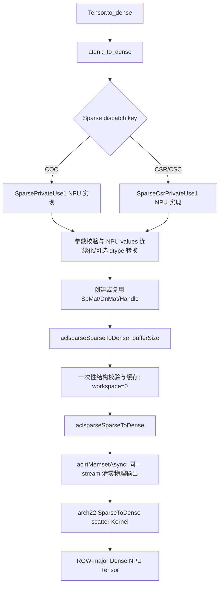
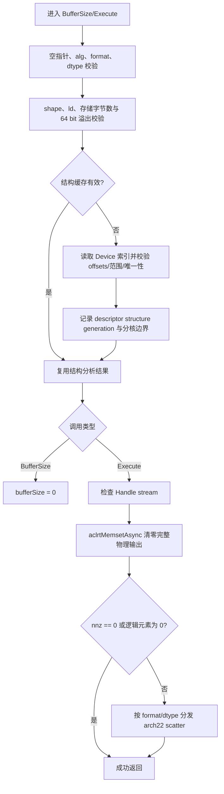
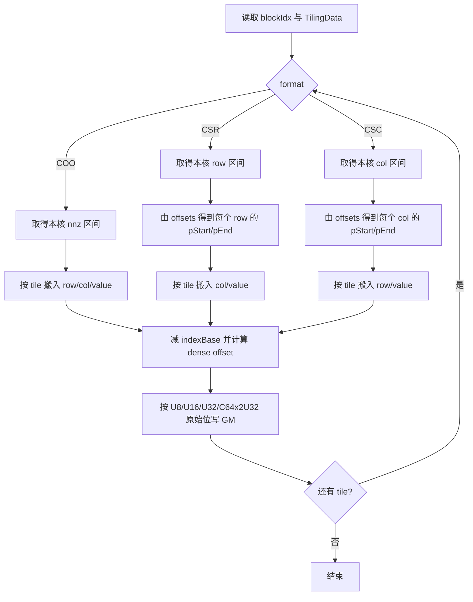

# 需求背景（required）

## 需求来源

本设计对应 2026 年 9 月社区任务《aclsparseSparseToDense 算子开发任务书
（A2/A3）》。任务要求参考 cuSPARSE SparseToDense 接口语义，在 Atlas A2/A3
（DAV_2201，`arch22`）上将 CSR、CSC 或 COO 稀疏矩阵转换为 ROW/COL 布局稠密
矩阵，并打通 PyTorch `Tensor.to_dense`、ATen Dispatcher、aclsparse Host 与 Ascend C
Kernel 的完整 NPU 调用链。

本设计的依据及优先级如下：

1. 本任务任务书规定的 A2/A3 能力、数据类型、测试与性能目标；
2. `ops-sparse/master` 的公开头文件 `include/cann_ops_sparse.h`；
3. `ops-sparse` 已有 `sparse/sparse2dense/arch35/` 实现和公共描述符语义；
4. PyTorch 2.7 `native_functions.yaml` 中 `to_dense` / `_to_dense` schema；
5. cuSPARSE 13.3 Update 1 的 `cusparseSparseToDense_bufferSize` 和
   `cusparseSparseToDense` 行为。

当任务书示例与公开头文件命名不一致时，以任务书明确指定的公开头文件为准。本设计
因此沿用已公开的 `aclsparseSparseToDense_bufferSize`，不重复新增
`aclsparseSparseToDenseGetBufferSize` 同功能接口。

## 背景介绍

### aclsparseSparseToDense 算子功能

SparseToDense 将稀疏矩阵的每个唯一坐标写入稠密矩阵对应逻辑位置，并将未覆盖位置
写为对应 dtype 的正零：

$$
B_{r,c}=\begin{cases}
A.values[p], & (r,c)=coordinate(p),\\
+0, & (r,c)\notin coordinates(A).
\end{cases}
$$

该算子不执行数值计算或类型转换。本任务支持 INT8、FP16、BF16、FP32、complex64，
最稳妥的实现是按原始位宽搬运：INT8 按 8 bit，FP16/BF16 按 16 bit，FP32 按
32 bit，complex64 按两个 32 bit lane 搬运。这样可以保留 NaN payload、正负零、INF
以及 complex64 实部/虚部的原始比特。

### 现有实现现状分析

`ops-sparse/master` 已有 arch35/DAV_3510 SparseToDense，但没有 arch22 实现，也没有
本任务要求的 Python/ATen 适配。现状与本任务差异如下。

| 层次 | 现有能力 | 本任务补齐内容 |
| --- | --- | --- |
| 公开接口 | 已有 `aclsparseSparseToDense_bufferSize`、`aclsparseSparseToDense` 和 DEFAULT 枚举 | 沿用公开签名，不新增重复接口 |
| 公共描述符 | 已有 Handle、CSR/CSC/COO、DnMat、ROW/COL、ld、base 0/1 | 复用并补齐本任务的严格校验与 complex64 能力 |
| arch35 Host/Kernel | DAV_3510 SIMT；FP32/FP16/BF16/INT32/INT8 | 保持 A5 行为，不把 arch35 SIMT 代码直接编译到 A2/A3 |
| arch22 Host/Kernel | 尚无 SparseToDense | 新增 DAV_2201 MemBase/SIMD scatter 路径 |
| Python/ATen | 仓内尚无 `_to_dense` NPU 注册 | 新增 `SparsePrivateUse1`、`SparseCsrPrivateUse1` 注册和描述符桥接 |
| 结构合法性 | 现有实现主要校验 Host 元数据 | 补齐 offsets、坐标范围、唯一性和乱序唯一坐标支持 |
| stream | 现有 arch35 清零使用同步形式的 memset | arch22 使用绑定 stream 的异步清零并顺序发射 scatter |

DAV_2201 不具备 DAV_3510 的 SIMT 编程模型，不能直接复用 arch35 的
`asc_vf_call` 路径。本任务采用 DAV_2201 可用的 AIV MemBase/SIMD 编程模型，利用
MTE2 将连续的索引和值分块搬入 UB，再由标量地址计算完成稀疏写回。

### 算子能力分析

| 能力维度 | 支持范围 |
| --- | --- |
| 稀疏格式 | CSR、CSC、COO |
| value dtype | INT8、FP16、BF16、FP32、complex64 |
| Device 索引 | I32；CSR/CSC offsets 和 indices 类型一致；COO row/col 均为 I32 |
| index base | 0、1 |
| 稠密布局 | ROW、COL |
| leading dimension | ROW: `ld >= cols`；COL: `ld >= rows` |
| 坐标顺序 | 允许乱序 |
| 重复坐标 | 不允许；结构校验返回参数错误 |
| 确定性 | 唯一坐标下每次结果 bit-wise 一致 |
| workspace | DEFAULT 算法无 Device workspace，查询值为 0 |
| stream | 清零与 scatter 均按 Handle 绑定 stream 排队，热路径异步返回 |

# 需求分析（required）

## 需求描述

在 `ops-sparse` 现有公开 API 与 arch35 能力基础上，增加 Atlas A2/A3 的 arch22
SparseToDense 实现。C++ 路径支持 CSR/CSC/COO、ROW/COL、base 0/1、I32 索引和
五种任务 dtype；Python 路径支持 `Tensor.to_dense` 到 `aten::_to_dense` 的 NPU
Dispatcher 注册与执行，不允许 CPU fallback。输入稀疏结构和值只读，输出与输入
独立，所有稠密逻辑元素均被定义。

## 需求拆解

1. **公开 API 闭环**：沿用公开头文件中的 BufferSize/Execute 两阶段接口和 DEFAULT
   算法枚举，保持 ABI 和调用顺序不变。
2. **格式闭环**：CSR、CSC、COO 分别解释 offsets/indices，允许坐标乱序，支持 base
   0/1，拒绝非法结构和重复坐标。
3. **dtype 闭环**：A2/A3 支持 INT8、FP16、BF16、FP32、complex64；输入输出 dtype
   相同，Kernel 不做浮点运算或中间转换。
4. **布局闭环**：C++ 支持 ROW/COL 和合法 ld；Python 输出构造为连续 ROW-major
   Dense Tensor。
5. **架构闭环**：公共描述符/校验与架构分发解耦；A2/A3 使用 arch22 MemBase/SIMD，
   A5 继续使用 arch35 SIMT。
6. **stream 闭环**：在 Handle stream 上依次排入异步清零和 scatter，不在执行热路径
   隐式同步。
7. **Python/ATen 闭环**：注册 COO 和 compressed sparse 两类 PrivateUse1 dispatch
   key，处理 dtype、layout、shape、stride、device、输出、异常和生命周期。
8. **确定性闭环**：唯一坐标下每个输出元素至多由一个 scatter 写者负责；不使用
   原子累加或不确定归约。
9. **边界闭环**：覆盖 nnz=0、零维、空行/列、极稀疏/高密度、长尾、padding、溢出
   和空指针。
10. **验证闭环**：设计 C++ UT、ATen UT、Python 端到端、CPU Golden、guard 区、
    Profiler 和性能/内存采集方案；本设计阶段不填写未实测结论。

# 详细设计（required）

## 算子分析

### 数学公式与格式映射

设稀疏矩阵 $A\in\mathbb{T}^{M\times N}$，$p\in[0,nnz)$，`base` 为 0 或 1。

| 格式 | 坐标恢复 |
| --- | --- |
| CSR | 对每行 `r`，`p in [rowOffsets[r]-base, rowOffsets[r+1]-base)`，`c=colInd[p]-base` |
| CSC | 对每列 `c`，`p in [colOffsets[c]-base, colOffsets[c+1]-base)`，`r=rowInd[p]-base` |
| COO | `r=cooRowInd[p]-base`，`c=cooColInd[p]-base` |

Dense 逻辑坐标到物理元素偏移的映射为：

$$
offset(r,c)=\begin{cases}
r\cdot ld+c, & order=ROW,\\
c\cdot ld+r, & order=COL.
\end{cases}
$$

所有乘加和偏移计算均先使用 64 bit Host/Kernel 中间值检查溢出，再转换为 Device
地址。输出物理存储元素数为 ROW 下 `M*ld`、COL 下 `N*ld`。

### 公开 C++ 算子原型

以当前 `include/cann_ops_sparse.h` 为准：

```cpp
typedef enum aclsparseSparseToDenseAlg_t {
    ACL_SPARSE_SPARSETODENSE_ALG_DEFAULT = 0,
} aclsparseSparseToDenseAlg_t;

aclsparseStatus_t aclsparseSparseToDense_bufferSize(
    aclsparseHandle_t handle,
    aclsparseConstSpMatDescr_t matA,
    aclsparseDnMatDescr_t matB,
    aclsparseSparseToDenseAlg_t alg,
    size_t *bufferSize);

aclsparseStatus_t aclsparseSparseToDense(
    aclsparseHandle_t handle,
    aclsparseConstSpMatDescr_t matA,
    aclsparseDnMatDescr_t matB,
    aclsparseSparseToDenseAlg_t alg,
    void *buffer);
```

任务书中的 `aclsparseSparseToDenseGetBufferSize` 仅作为需求描述中的名称，不新增为
第二套公开符号，避免 API 重复和 ABI 分裂。

### Python/ATen 原型

PyTorch 2.7 的 schema 为：

```text
to_dense(Tensor self, ScalarType? dtype=None, *, bool? masked_grad=None) -> Tensor
_to_dense(Tensor self, ScalarType? dtype=None, bool? masked_grad=None) -> Tensor
```

公开入口 `Tensor.to_dense(dtype=None, masked_grad=None)` 进入 `aten::_to_dense`。本任务
实现 forward NPU backend；`masked_grad` 不改变 forward 数值，由 PyTorch 的
`to_dense_backward`/Autograd 语义消费。输出为新建 Dense Tensor，不与输入 values 或
indices alias，不提供 in-place/out 变体。

### 参数与错误行为

| 参数/对象 | 校验与语义 | 失败状态/异常 |
| --- | --- | --- |
| `handle` | 非空，Execute 时必须绑定有效 stream | `HANDLE_IS_NULLPTR` / `INVALID_VALUE` |
| `matA` | 非空；CSR/CSC/COO；M/N/nnz 非负且在支持范围 | `INVALID_VALUE` 或 `NOT_SUPPORTED` |
| 索引 | I32、base 0/1、offsets 单调且端点正确、坐标范围合法、坐标唯一 | `INVALID_VALUE` |
| `matB` | 与 A shape/dtype 一致；ROW/COL；ld 合法；非零存储时 values 非空 | `INVALID_VALUE` 或 `NOT_SUPPORTED` |
| `alg` | 仅 DEFAULT | `NOT_SUPPORTED` |
| `bufferSize` | 非空；成功写 0 | `INVALID_VALUE` |
| `buffer` | 查询值为 0，可为空；非空值不解引用 | 无额外限制 |
| Python `self` | NPU、二维、COO/CSR/CSC、支持 dtype；进入 aclsparse 前索引统一为 I32 | `TORCH_CHECK` 明确报错 |
| Python `dtype` | 为空时保持 dtype；非空时仅允许任务支持类型，并在 NPU 上转换 values | `TORCH_CHECK` 明确报错 |

Host 元数据错误在发射 Device 任务前返回。Device 索引内容的合法性需要读取实际数组，
其一次性验证与缓存方案见下文“结构校验”。

## 算子实现

### 总体架构



代码分层建议如下：

```text
include/cann_ops_sparse.h                         # 复用公开原型；补充准确能力说明
sparse/sparse2dense/common/                       # 公共校验、结构分析、架构分发
sparse/sparse2dense/arch22/                       # DAV_2201 Host glue、tiling、Kernel
sparse/sparse2dense/arch35/                       # 现有 DAV_3510 实现，保持独立
csrc/torch/sparse_to_dense/                       # ATen Dispatcher 与描述符桥接
python/aclsparse_npu/                             # Python 包装/加载入口
test/sparse2dense/arch22/                         # C++ UT
test/python/sparse_to_dense/                      # ATen/Python 端到端 UT
```

最终目录名服从 `ops-sparse` 合入时的仓库规范；分层原则不变：公开接口唯一、公共校验
唯一、架构 Kernel 分开。

### Python/ATen 适配设计

Dispatcher 同时注册以下 backend：

```cpp
TORCH_LIBRARY_IMPL(aten, SparsePrivateUse1, m) {
    m.impl("_to_dense", sparse_to_dense_npu);
}

TORCH_LIBRARY_IMPL(aten, SparseCsrPrivateUse1, m) {
    m.impl("_to_dense", sparse_compressed_to_dense_npu);
}
```

适配层按以下顺序处理：

1. 校验 `self.device` 为 NPU、维度为 2、`dense_dim=0`，layout 为 sparse
   COO/CSR/CSC；拒绝带 batch/dense value 维、BSR/BSC、Dense 和其他未声明 layout。
2. 校验 values dtype 在 INT8/FP16/BF16/FP32/complex64 中。`dtype=None` 时保持；
   指定不同且受支持的 dtype 时只对 nnz values 执行 NPU dtype cast，不物化稠密临时
   Tensor，也不经 CPU。
3. PyTorch 常规 sparse Tensor 的 indices 可能为 I32 或 I64。I32 直接复用；I64 先在
   一次性结构校验中确认 offsets、坐标和 nnz 均可由 I32 表示，再在 NPU 上显式转换为
   连续 I32 临时 Tensor。超出 I32 范围时明确报错，不做截断；aclsparse 描述符看到的
   Device 索引始终为 I32。
4. 对非连续 values/indices 创建连续 NPU Tensor；所有参与异步执行的临时 Tensor 由
   执行计划持有至 stream 完成。
5. 创建 shape 相同、目标 dtype 相同的连续 ROW-major Dense 输出；`ld=cols`。C++ API
   的 COL/ld padding 能力不通过 Python 入口暴露。
6. 从 torch_npu 获取当前 NPU stream，设置到 aclsparse Handle；构造只读 SpMat 和可写
   DnMat 描述符，查询 bufferSize，然后执行转换。
7. 状态码统一映射为带参数上下文的 `TORCH_CHECK`；任何不支持组合直接报错，不调用
   CPU/CUDA/Composite fallback。

计划缓存 key 至少包含 device、layout、shape、nnz、index/value 数据指针、dtype、
index base 和 stream/device 上下文。Python sparse Tensor 固定创建 base 0 描述符；
指针、shape 或结构 generation 变化时重新校验并重建描述符。输出、输入、连续化临时
Tensor、I64→I32 索引和 dtype 转换结果均由 C++ RAII 对象管理。

`masked_grad` 的 forward 结果与取值无关，适配层保留 schema 参数并交由 Autograd
包装层处理；设计验证中增加 `None/True/False` 三种调用，确认 forward 路径均命中 NPU
实现。若目标 torch_npu 版本没有可用的 NPU `to_dense_backward`，应明确报出 backward
能力缺口，不允许转到 CPU；该缺口不通过伪造 forward 结果掩盖。

### Host 侧设计

Host 流程如下：



#### 公共元数据校验

BufferSize 与 Execute 复用同一校验函数，检查：

- Handle、描述符、输出指针和 algorithm；
- format、index type、index base 和 value dtype；
- A/B shape、dtype、order、ld；
- M、N、nnz、`major+1`、`M*ld`/`N*ld` 和字节数乘法溢出；
- `nnz>0` 时 offsets/indices/values 非空；物理输出字节数大于 0 时 B.values 非空；
- 当前构建目标为 DAV_2201 时只分发 arch22，DAV_3510 时只分发 arch35。

公共层不使用 case id、固定 shape 或数据值决定合法性。

#### Device 结构校验与缓存

任务书要求乱序唯一坐标合法、重复坐标返回参数错误。仅校验 Host 描述符无法满足该
要求；在异步 scatter 后再发现重复也无法把错误同步返回给当前 API。为同时满足错误
语义和热路径异步性，采用“一次性准备校验 + generation 缓存”：

1. 推荐调用流程中的 `aclsparseSparseToDense_bufferSize` 首次读取 Device offsets/
   indices 到受控 Host 临时区，并在 Handle stream 上完成必要同步；这里只分析索引，
   不参与结果计算，也不复制任何稠密输入/输出。
2. CSR/CSC 校验首 offset=`base`、末 offset=`base+nnz`、单调性、每个 minor index
   范围以及同一 major 内无重复；COO 校验 row/col 范围及 `(row,col)` 全局唯一。
   使用集合只影响一次性准备阶段，允许索引乱序。
3. 成功结果与 SpMat 描述符的 structure generation、指针、shape、format、base、nnz
   绑定；同时生成 CSR/CSC 的负载均衡 major 边界。更新索引指针时递增 generation 并
   使缓存失效。
4. 调用方若原地修改索引内容，必须重新调用 BufferSize 使结构重新验证。values 可在
   保持 dtype/nnz 不变时更新，不使结构缓存失效。
5. 为兼容未先调用 BufferSize 的旧调用方，Execute 在缓存缺失时执行同一校验；该首次
   调用可能同步。缓存有效的正式执行热路径只排入 memset/scatter，保持异步。

这种设计把不可避免的内容校验成本放在可复用准备阶段，性能采样复用描述符与校验
结果；不会创建与完整稠密输出成比例的 Host 或 Device 临时副本。

#### workspace 与清零

DEFAULT 算法无需外部 Device workspace，`bufferSize=0`，`buffer` 可以为 `nullptr`。
索引验证使用一次性 Host 临时区，不计入 Device workspace，也不跨调用持有索引副本。

Execute 使用：

```cpp
aclrtMemsetAsync(matB.values, denseStorageBytes, 0, denseStorageBytes, stream);
```

在 Handle stream 上清零 ROW 下 `M*ld` 或 COL 下 `N*ld` 的完整物理存储，包括 padding。
按字节填 0 对五种 dtype 均得到正零位模式。随后在同一 stream 发射 scatter，stream
顺序保证所有 scatter 写入发生在清零之后，不需要核间同步。若 `nnz=0`，只保留清零；
若物理字节数为 0，则两个 Device 操作都跳过。

### Tiling 与多核切分

#### TilingData

| 字段 | 类型 | 含义 |
| --- | --- | --- |
| `rows, cols, nnz, ld` | `uint64_t` | shape、非零数和 leading dimension |
| `format, order, indexBase` | `uint32_t` | CSR/CSC/COO、ROW/COL、base 0/1 |
| `storageClass` | `uint32_t` | U8/U16/U32/C64x2U32 |
| `blockDim` | `uint32_t` | 实际 AIV 核数 |
| `tileNnz` | `uint32_t` | 每次搬入 UB 的非零元数量 |
| `majorBegin/end[]` | `uint32_t[]` | CSR/CSC 每核负责的连续 major 区间 |
| `nnzPerCore, remainderNnz` | `uint64_t` | COO 的 q/r 切分参数 |

CSR/CSC 结构准备阶段已经获得每个 major 的 nnz。Host 按累计 nnz 目标切出连续 major
区间，使每核负载接近 `ceil(nnz/blockDim)`，同时保证每个 major 只属于一个核。若
`nnz=0` 或 major 维度很小，则缩减 blockDim。COO 直接按 nnz q/r 切分：

```text
q = nnz / blockDim
r = nnz % blockDim
coreLen(i)   = q + (i < r ? 1 : 0)
coreStart(i) = i*q + min(i, r)
```

当无法获得数据依赖边界时，CSR 按 rows、CSC 按 cols 做同样 q/r 切分作为安全回退。
该回退只影响负载均衡，不改变数值结果。

#### Kernel 模板和分支

Host 以 `format × storageClass` 分发 12 个编译期模板组合：

| storageClass | 对应 dtype | Device 搬运表示 |
| --- | --- | --- |
| U8 | INT8 | `uint8_t` |
| U16 | FP16、BF16 | `uint16_t` |
| U32 | FP32 | `uint32_t` |
| C64x2U32 | complex64 | 连续两个 `uint32_t` lane |

FP16/BF16 共用 U16 位搬运但保留 Host dtype 校验；complex64 不依赖 DAV_2201 的 64 bit
向量算术或复数指令。layout 与 base 是运行时地址参数，不引入额外数值分支。

#### UB Buffer 规划

DAV_2201 UB 为 192 KiB。每核预留 8 KiB 给 TPipe/对齐和控制数据，其余用于双缓冲
索引和值。CSR/CSC 需要一个 index 流，COO 需要 row/col 两个 index 流：

| Buffer | CSR/CSC | COO | Buffer 数 | 用途 |
| --- | --- | --- | --- | --- |
| index/row queue | `tileNnz*4` | `tileNnz*4` | 2 | I32 minor 或 row |
| col queue | 无 | `tileNnz*4` | 2 | COO col |
| value queue | `tileNnz*valueBytes` | 同左 | 2 | 原始位宽 values |
| output queue | 无 | 无 | - | scatter 直接写 GM，避免稠密 UB 临时块 |

令 `U=192*1024`、`R=8*1024`、`k=1`（CSR/CSC）或 2（COO），则：

$$
tileNnz=alignDown_{32}\left(\min\left(
\left\lfloor\frac{U-R}{2(4k+valueBytes)}\right\rfloor,
\left\lfloor\frac{65535}{\max(4,valueBytes)}\right\rfloor
\right)\right).
$$

第二项保证单次 DataCopyPad 的任一连续字节段不超过接口字段范围。按该公式得到的
预算如下（未计 8 KiB 预留）：

| 格式 | valueBytes | tileNnz | 双缓冲占用 | UB 总占用（含预留） |
| --- | ---: | ---: | ---: | ---: |
| CSR/CSC | 1 | 16,352 | 163,520 B | 171,712 B |
| CSR/CSC | 2 | 15,680 | 188,160 B | 196,352 B |
| CSR/CSC | 4 | 11,776 | 188,416 B | 196,608 B |
| CSR/CSC | 8 | 7,840 | 188,160 B | 196,352 B |
| COO | 1 | 10,464 | 188,352 B | 196,544 B |
| COO | 2 | 9,408 | 188,160 B | 196,352 B |
| COO | 4 | 7,840 | 188,160 B | 196,352 B |
| COO | 8 | 5,888 | 188,416 B | 196,608 B |

Host 通过平台接口获取实际 UB 和 AIV 核数，并用同一公式重新计算；表格用于 DAV_2201
设计核算，不在代码中硬编码 192 KiB。若运行时可用 UB 小于预期，tileNnz 自动缩小；
若公式结果为 0，Host 返回资源不足，不发射 Kernel。

### Kernel 侧设计

Kernel 每个 tile 执行 CopyIn/Scatter，两套输入队列交替，实现 MTE2 与标量地址计算的
流水重叠。整体流程如下：



CSR/CSC offsets 以 I32 Device 数据读取，先扩展为 64 bit 再减 base；结构准备已保证范围
合法。indices 与 values 是连续数组，使用 `DataCopyPad` 处理非 32 字节对齐尾块。UB
中的 index 使用 `LocalTensor<int32_t>::GetValue`，输出使用对应
`GlobalTensor<StorageT>::SetValue`。complex64 对每个 p 连续执行两个 U32 lane 的读写。

ROW/CSR 和 COL/CSC 中，若当前 tile 出现连续 minor index run，则可选把 run 合并为
一次 UB→GM 连续搬出；乱序或不连续时回退逐项 scatter。该优化不排序输入、不改变写入
顺序或位模式。相反布局和 COO 使用通用 scatter。

唯一坐标约束保证不同核不会写同一逻辑元素；无需原子操作。每个输出元素先由 memset
得到正零，最多再被一个非零项按位覆盖，因此跨核调度顺序不影响结果。padding 也由
memset 清零，Kernel 只写合法逻辑坐标，guard 区不访问。

### Ascend C/Runtime 接口可行性

| 接口/能力 | 用途 | DAV_2201 核对结论 |
| --- | --- | --- |
| `aclrtMemsetAsync(ptr,maxCount,0,count,stream)` | 同 stream 清零输出 | CANN 9.1 Runtime 头文件有公开声明；仓内 arch22 SpVV 已使用 |
| `GetAivCoreCount` / 平台 UB 查询 | Host 分核和 tile 计算 | `ops-sparse` arch22 既有模式可复用 |
| `DataCopyPad(LocalTensor, GlobalTensor, ...)` | 非对齐 index/value GM→UB | CANN 9.1 basic API 对 DAV_2201 提供实现 |
| `LocalTensor::GetValue` | UB 标量读取索引和值 lane | basic API 可用 |
| `GlobalTensor::SetValue` | 稀疏地址 GM 写回 | basic API 可用；逐元素 scatter 路径 |
| 64 bit 地址中间计算 | `row*ld+col` 防溢出 | 仅用于标量地址计算，不依赖 64 bit 向量算术 |
| SIMT / `asc_vf_call` | arch35 线程级 scatter | DAV_2201 不使用，采用 MemBase/SIMD 绕行 |
| complex64 算术 | 不需要 | 用两次 U32 原始位搬运绕行 |

开发期仍需以目标 CANN 配套头文件做最小编译穿刺；本设计不把未编译验证写成实测通过。

### 性能设计与可证伪预判

SparseToDense 没有算术，最低流量近似为：

$$
Bytes \approx DenseStorageBytes + nnz\cdot(4+2\cdot valueBytes)+OffsetsBytes.
$$

任务性能场景每行 64 个非零，最小 ld 下的量级为：

| 场景 | 逻辑元素数 | nnz | 输出清零流量（INT8→complex64） | scatter 主流量（INT8→complex64） |
| --- | ---: | ---: | ---: | ---: |
| P-01 8192×28672 | 234,881,024 | 524,288 | 224 MiB → 1,792 MiB | 3 MiB → 10 MiB |
| P-02 4096×1536 | 6,291,456 | 262,144 | 6 MiB → 48 MiB | 1.5 MiB → 5 MiB |
| P-03 7168×2048 | 14,680,064 | 458,752 | 14 MiB → 112 MiB | 2.625 MiB → 8.75 MiB |

因此方案期预判主瓶颈是输出清零的 GM 写带宽，scatter 的随机写和标量发射是第二瓶颈；
P-02 的低位宽场景中 scatter 占比相对更高。预判下界为
`Tclear >= DenseStorageBytes / effectiveWriteBandwidth`，不把峰值带宽当作实测结论。

性能优化项如下：

| 编号 | 优化项 | 面向瓶颈 | 落地要求 | 改变数值路径 |
| --- | --- | --- | --- | --- |
| O1 | 使用 Runtime 异步 memset 清零完整物理输出 | 清零带宽/Kernel 开销 | 必落地 | 否 |
| O2 | values 按原始位宽搬运，不做 dtype 转换 | scatter 指令与精度 | 必落地 | 否 |
| O3 | 累计 nnz 负载均衡、多核 q/r 切分 | 长尾与并行度 | 必落地 | 否 |
| O4 | index/value 双缓冲并尽量使用 UB | 搬入等待 | 必落地 | 否 |
| O5 | CSR-ROW/CSC-COL 连续 minor run 合并搬出 | 随机写发射 | 可选 | 否 |
| O6 | 小 nnz/小 major 缩减 blockDim | 启动和空核开销 | 可选 | 否 |

首轮 Profiler 若显示 scatter Kernel 耗时高于清零，或 MTE2/标量流水占比与上述判断冲突，
即证伪“清零主导”；届时提升 O5 优先级并重新评估 tile 和分核。若有效写带宽远低于平台
可达到的同类 memset 带宽，则先检查物理字节数、stream 顺序和 Runtime memset 选型。

## 支持硬件

| 支持的芯片版本 | 涉及勾选 |
| --- | --- |
| Atlas A2 训练系列（910B3、910B4） | √ |
| Atlas A3 训练系列（任务环境具体型号） | √ |

A2/A3 均使用 DAV_2201/arch22 构建路径。A5/arch35 继续使用独立 SIMT Kernel；公共代码
修改必须完成双架构构建回归，不能以 arch22 限制覆盖 arch35 已有 INT32 等能力。

## 算子约束限制

1. C++ 仅支持 CSR/CSC/COO，Python 仅支持二维 sparse COO/CSR/CSC。
2. C++ API 的 A2/A3 Device 索引仅 I32，支持 base 0/1；Python I64 索引仅在完成范围
   校验后显式生成 NPU I32 临时 Tensor，不截断。
3. A2/A3 values 仅 INT8、FP16、BF16、FP32、complex64，A/B dtype 必须一致。
4. 坐标可以乱序但必须唯一；重复坐标返回参数错误，不定义 last-write-wins 或累加语义。
5. ROW 要求 `ld>=cols`，COL 要求 `ld>=rows`；地址和物理字节数必须通过溢出检查。
6. `bufferSize=0`，`buffer` 可空；算子不申请与完整稠密输出成比例的额外副本。
7. 结构缓存有效期间不得原地修改 offsets/indices；修改后必须重新查询 BufferSize。
8. Execute 热路径异步；调用方在读取输出、释放输入/输出/描述符/Handle 前同步 stream。
9. 输出与输入不 alias，不提供 in-place 语义；核心路径不允许 CPU fallback。
10. Python 可选 dtype 转换只在 NPU 对 sparse values 执行，目标 dtype 也必须在支持列表。

# 可维可测分析

## 精度标准/性能标准

| 验收标准 | 设计承接 | 标准来源 |
| --- | --- | --- |
| 精度 | 五种 dtype 逐元素 exact match；NaN payload、正负零、INF、complex64 实虚部按位一致 | 任务书、生态算子精度标准 |
| 确定性 | 同一合法输入重复执行 bit-wise 一致 | 任务书、cuSPARSE 参考语义 |
| 性能 | P-01/P-02/P-03 每个有效 case 达到 0.25 倍标杆以上；报告 median/p90、清零/scatter | 任务书 |
| 内存 | 不创建完整稠密 Host/Device 临时副本；Device workspace 为 0 | 任务书 |
| Dispatch | Profiler 证明 `_to_dense` 核心路径命中 NPU，无 CPU fallback | 任务书 |

本设计不填写 NPU 实测耗时、倍率或通过率。实现后按任务书在 910B3、910B4 和 A3
环境分别记录 CANN、驱动、固件、SoC、PyTorch、torch_npu 和 ops-sparse commit。

## 可测试性设计

### C++ UT

- 格式：CSR/CSC/COO；base 0/1；ROW/COL；最小 ld 和 padding ld；
- dtype：INT8/FP16/BF16/FP32/complex64；
- shape：0×N、M×0、1×1、nnz=0/1、空行/列、极稀疏、每行 64、高密度、长尾；
- 数值：普通值、边界值、+0/-0、+INF/-INF、不同 NaN payload、complex64 实虚部组合；
- 结构：乱序唯一坐标成功，非法 offsets、越界坐标、重复坐标失败；
- 接口：空 Handle/描述符/指针、非法 dtype/format/index/base/order/ld/alg、shape 不匹配、
  溢出、stream 未设置；
- 资源：输入只读、guard 区不变、bufferSize=0、重复执行确定性、异步生命周期。

CPU Golden 以原始字节复制构造结果，不通过 float 中间值生成，避免 NaN payload 和
signed zero 在 Golden 端被改变。

### ATen/Python UT

- `Tensor.to_dense` 和 `torch.ops.aten._to_dense` 均命中 NPU 注册；
- COO/CSR/CSC、五 dtype、`dtype=None/同 dtype/合法不同 dtype`；
- I32 索引直接成功，范围内 I64 经 NPU 转 I32 后成功，I64 溢出及非法
  layout/device/dim/dtype 明确报错；
- 非连续 values/indices 的 NPU 连续化，输出 shape/dtype/device/stride 正确；
- `masked_grad=None/True/False` forward 一致，输出无 alias/in-place；
- Profiler/Dispatcher 日志中无 CPU fallback 或 D2H 稠密结果计算。

### 性能与内存验证

按任务书每 case 预热至少 10 次、采样至少 30 次，复用描述符、结构校验结果和 stream；
查询/首次结构验证、首次编译和数据生成不计入重复执行 Kernel 指标。分别记录异步 memset
和 scatter Kernel 耗时、总 NPU Kernel 时间、Python/ATen 端到端时间、median、p90、
有效写带宽和输出字节数。内存报告应证明 Device workspace 为 0，额外内存仅为框架
必要的 sparse values 连续化/可选 dtype cast，不含完整 Dense 副本。

## 可维护性分析

- 公共参数校验和结构 generation 只实现一次，arch22/arch35 共享元数据规则；
- Kernel 以 format/storageClass 模板组合组织，FP16/BF16 复用位搬运模板，complex64
  复用 U32 lane，避免五套重复算法；
- Host 平台查询决定核数/UB，不硬编码具体 910B3/910B4 核数；
- 测试数据与任务包 case id 解耦，Kernel 不包含 shape 白名单；
- 接口、Python schema、tiling 字段和错误状态在 README/UT 中保持一一映射。

## 兼容性分析

本设计不修改两个公开函数的名称、参数顺序、枚举值或调用顺序。新增 arch22 分发和
Python NPU 注册不会改变 CPU/CUDA Dispatcher。公共 dtype 能力按架构选择：arch22
放行任务要求的 complex64，arch35 原有 INT32/INT8 等合法调用继续保持，不因 A2/A3
任务收窄。现有 arch35 的清零、Host 和 Kernel 若需共享重构，必须先以现有测试锁定
行为，再做机械迁移，不能把 arch22 的 MemBase 实现替换为全架构唯一实现。

主要风险与对策如下：

| 风险 | 影响 | 对策 |
| --- | --- | --- |
| 重复坐标校验与异步语义冲突 | 执行阶段同步或错误无法即时返回 | 在 BufferSize/首次准备阶段验证并缓存，热路径异步 |
| CSR/CSC 长尾 | 按行/列均分负载不均 | 利用一次性 offsets 分析按累计 nnz 切 major 边界 |
| complex64 Device 类型能力差异 | 直接 complex/uint64 搬运编译风险 | 固定拆成两个 U32 lane，不做复数算术 |
| 随机 scatter 发射开销 | 小输出/低位宽场景性能下降 | 双缓冲、负载均衡、连续 run 可选合并、Profiler 校准 |
| 公共 Host 重构影响 A5 | arch35 回归 | 架构 dispatch 隔离，保留 arch35 UT 和双架构构建门禁 |
| Python sparse schema/dispatch 版本差异 | PyTorch 2.7+ 注册失败 | 以目标版本 native schema 生成签名，CI 覆盖最低/后续支持版本 |
