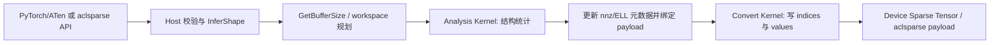

# aclsparseDenseToSparse 算子设计文档（Atlas 950 A5）

- **任务名称**：9月社区任务-aclsparseDenseToSparse 算子开发（950）
- **任务编号**：以社区任务清单最终编号为准
- **提交账号/团队目录**：待提交人填写（ops-sparse 个人 fork / 分支）
- **目标仓库**：`https://gitcode.com/cann/ops-sparse`
- **目标代码目录**：`sparse/densetosparse/arch35/`，公共声明位于 `include/cann_ops_sparse.h`
- **设计文档提交仓库**：`https://gitcode.com/cann/cann-ops-competitions`
- **目标硬件**：Atlas 950PR（A5，`DAV_3510`，`arch35`）
- **软件基线**：CANN 9.1.0 及以上配套版本；PyTorch 2.7+；torch_npu 26.0.0+
- **参考实现**：cuSPARSE 13.3 Update 1 DenseToSparse 三阶段接口
- **文档版本**：v0.2

> 本文档是 A5 的开发设计基线。提交前必须将“提交账号/团队目录”、实际 fork、分支、
> ops-sparse commit、CANN/驱动/固件/编译器版本替换为真实值，并按社区模板路径提交 PR。

## 1. 背景与目标

本算子将 Device 上的稠密二维矩阵转换为稀疏矩阵，功能语义对齐 cuSPARSE 的
`cusparseDenseToSparse_bufferSize`、`cusparseDenseToSparse_analysis` 和
`cusparseDenseToSparse_convert` 三阶段接口。交付范围包括 aclsparse C++ API、Ascend C
Host/Kernel、Python/ATen NPU Dispatcher 适配、C++ UT、端到端 UT、性能及内存测试。

支持：

- CSR、CSC、COO、Blocked-ELL；
- Dense ROW/COL 主序；
- values 类型 INT8、FP16、BF16、FP32、complex64；
- Device 索引 I32，index base 0/1；
- 空矩阵、全零、全非零、极端稀疏度、尾块、INF/NAN；
- Analysis 后动态确定 nnz，并允许重新绑定输出 payload。

不支持 CPU fallback；输入 Dense 与 Blocked-ELL pattern 均保持只读。该算子只负责结构发现和
payload 搬运，不执行数值近似计算，因此结构、索引和值均要求与 CPU Golden exact match。

### 1.1 现有能力与 A5 增量

| 能力 | 复用/现状 | A5 工作 |
| --- | --- | --- |
| INT8/FP16/BF16/FP32 | 复用现有 arch35 路径 | 完成功能、边界和性能回归 |
| CSR/CSC/COO/Blocked-ELL | 复用现有四格式框架 | 补齐 ROW/COL、base、尾块和确定性校验 |
| complex64 | 现有能力需补齐 | 新增 dtype 描述符、Analysis 判定、Convert bit-wise 搬运和 UT |
| aclsparse 三阶段 API | 公共接口框架 | 接入 A5 Host、Tiling 和 arch35 Kernel |
| Python/ATen | 必选新增交付 | 完成 NPU Dispatcher、Sparse Tensor 构造和无回退证明 |
| 公共 Host | 复用 A2/A3 公共校验、状态和构建组件 | 处理冲突并完成交叉回归 |

## 2. 接口与语义

### 2.1 aclsparse 三阶段接口

```cpp
aclsparseStatus_t aclsparseDenseToSparseGetBufferSize(
    aclsparseHandle_t handle,
    aclsparseConstDnMatDescr_t matA,
    aclsparseSpMatDescr_t matB,
    aclsparseDenseToSparseAlg_t alg,
    size_t *bufferSize);

aclsparseStatus_t aclsparseDenseToSparseAnalysis(
    aclsparseHandle_t handle,
    aclsparseConstDnMatDescr_t matA,
    aclsparseSpMatDescr_t matB,
    aclsparseDenseToSparseAlg_t alg,
    void *buffer);

aclsparseStatus_t aclsparseDenseToSparseConvert(
    aclsparseHandle_t handle,
    aclsparseConstDnMatDescr_t matA,
    aclsparseSpMatDescr_t matB,
    aclsparseDenseToSparseAlg_t alg,
    void *buffer);
```

三阶段必须使用同一 handle、stream 和兼容 workspace。GetBufferSize 只在 Host 计算空间规划，
Analysis 在 Device 统计结构并更新目标描述符的 nnz/ell 元数据，调用方随后依据实际 nnz 分配
indices 与 values，并通过 `aclsparseCsrSetPointers`、`aclsparseCscSetPointers` 或
`aclsparseCooSetPointers` 绑定 payload；Convert 最后写入结果。

`handle == nullptr`、描述符为空、非法 alg 或输出指针不满足阶段要求时返回参数错误。bufferSize
为 0 时允许 buffer 为空；空间需求非零时必须提供有效 Device 地址。所有异步操作在关联 stream
上排队，描述符、workspace 和 Device payload 必须保持有效直到 stream 完成。

### 2.2 描述符约束

| 对象 | 约束 |
| --- | --- |
| Dense A | 二维；ROW 时 `ld >= cols`，COL 时 `ld >= rows`；末端存储可含 padding |
| Sparse B | shape 与 A 一致；values dtype 与 A 一致；index dtype 固定 I32 |
| CSR/CSC | offsets 长度分别为 rows+1/cols+1；indices/values 长度为 nnz |
| COO | row/column/value 长度均为 nnz |
| Blocked-ELL | blockSize 与 ellCols 由描述符/调用方预置；pattern 只读；尾块允许越界填充 |
| base | 仅 0 或 1 |
| alg | 仅 `ACL_SPARSE_DENSETOSPARSE_ALG_DEFAULT` |

CSR/CSC base 0 的 offsets 首尾为 `0` 和 `nnz`，base 1 为 `1` 和 `nnz+1`。COO 坐标按
base 进行偏移。Blocked-ELL 不通过非零发现改变调用方提供的 block-column pattern，按 pattern
提取固定块；越过逻辑矩阵边界的元素写正零。

### 2.3 Python/ATen 适配

在 NPU Dispatcher 注册以下 ATen 映射：

- `Tensor.to_sparse()` → `aten::_to_sparse`；
- `Tensor.to_sparse_csr()` → `aten::_to_sparse_csr`；
- `Tensor.to_sparse_csc()` → `aten::_to_sparse_csc`；
- `Tensor.to_sparse_bsr()` → `aten::_to_sparse_bsr`。

适配层完成参数、dtype、shape、layout、stride、device 和 block 参数检查，创建 aclsparse
描述符，执行三阶段流程，最后构造 PyTorch Sparse Tensor。索引统一转换为 int32；values、索引
和 size 均在 NPU 上生成。设备不匹配、非支持 dtype、非法 sparse layout、无效 blockSize 或
不支持的参数组合必须抛出明确异常；禁止通过 `.cpu()`、CPU ATen kernel 或隐式搬运降级。

对于公开 PyTorch 接口无法表达的 ROW/COL、base 和 Blocked-ELL pattern 参数，提供
`torch.ops.ops_sparse_test.dense_to_sparse_npu(format, dense, base, layout, block_size)` 测试/适配
入口，并与公开 ATen 路径共享 Host 校验和底层实现。

公开接口与扩展接口的能力边界如下：

| 入口 | 输出格式 | base/ROW-COL | Blocked-ELL |
| --- | --- | --- | --- |
| `to_sparse()` | COO | 使用 PyTorch 默认语义，不暴露本任务的 base/layout 属性 | 不支持 |
| `to_sparse_csr()` | CSR | 使用 PyTorch 默认语义，不暴露本任务的 base/layout 属性 | 不支持 |
| `to_sparse_csc()` | CSC | 使用 PyTorch 默认语义，不暴露本任务的 base/layout 属性 | 不支持 |
| `to_sparse_bsr()` | BSR | 使用 PyTorch 默认语义；BSR 不等同于 Blocked-ELL | 不直接支持 |
| aclsparse 三阶段 API | CSR/CSC/COO/Blocked-ELL | 完整支持 | 完整支持 |
| `dense_to_sparse_npu` 测试入口 | CSR/CSC/COO/Blocked-ELL | 完整支持 | 完整支持 |

ATen 公开路径只负责 PyTorch 能表达的格式和属性；任务书要求的 base、ROW/COL 及
Blocked-ELL 由 aclsparse API 或 NPU 扩展入口验证。BSR 与 Blocked-ELL 不做静默互转，
二者的描述符、pattern 和 payload 布局分别校验。

### 2.4 阶段状态机与错误行为

```text
DescriptorCreated
    -> BufferSizeQueried
    -> AnalysisSubmitted/Completed
    -> nnzQueried
    -> PayloadBound
    -> ConvertSubmitted/Completed
```

Convert 必须建立在成功 Analysis 和已绑定兼容 payload 之上；Analysis 失败、nnz 未查询、
指针未绑定、payload 容量不足或 descriptor 属性被非法修改时返回状态错误。成功 Analysis
后允许重新绑定同尺寸 payload 再执行 Convert，但不能修改 shape、dtype、format、base、
layout 或 Blocked-ELL pattern。GetBufferSize、Analysis 和 Convert 只接受
`ACL_SPARSE_DENSETOSPARSE_ALG_DEFAULT`。

## 3. 总体架构



Host 不读取 Dense 数据、不生成与输入规模成比例的 Host 临时数组。核心路径由两个 Ascend C
Kernel 组成：Analysis 负责计数和前缀和，Convert 负责按确定性顺序写结果。必要的 row counts、
column counts、nnz 和扫描临时区全部放在 Device workspace 中。

建议目录结构：

```text
sparse/densetosparse/arch35/
├── CMakeLists.txt
├── op_host/
│   ├── dense_to_sparse_tiling.cpp
│   └── dense_to_sparse_host.cpp
├── op_kernel/
│   ├── analysis_kernel.cpp
│   ├── convert_kernel.cpp
│   └── kernels/arch35/
├── op_api/
│   └── dense_to_sparse_api.cpp
└── tiling/
    └── dense_to_sparse_tiling_data.h

test/densetosparse/
├── arch35/
├── python/
└── golden/
```

公开声明统一放入 `include/cann_ops_sparse.h`，构建配置接入仓库现有 arch35 CMake。公共
Host 逻辑与 A2/A3 交叉回归时保留 ABI 兼容，不复制公共实现。

Python/ATen 注册和 Sparse Tensor 输出构造放入 ops-sparse 现有 Python/torch 适配目录，
具体目录以目标仓库 master 的 Dispatcher/CMake 规范为准；上述目录是逻辑分层，不要求复制
公共 Host。不得在 `sparse/densetosparse/arch35/` 外重复实现 A2/A3 已有的公共校验、状态码
和构建组件。

## 4. Host 设计

### 4.1 校验和形状推导

Host 按如下顺序处理请求：

1. 检查 handle、描述符、alg 和指针；
2. 读取 rows、cols、ld、layout、dtype、format、base、index type；
3. 校验二维 shape、`ld`、溢出风险和同 shape/dtype；
4. 根据 format 推导输出索引长度及 workspace；
5. 对 CSR/CSC/COO 把 nnz 标记为 Analysis 结果；对 Blocked-ELL 校验 pattern 和容量；
6. 生成 TilingData，选择 arch35 Kernel 实例并返回 workspace 大小。

尺寸计算使用 `int64_t`，乘加前进行溢出检查；Kernel 内使用 64 位地址偏移。任何非法状态
在 Kernel 启动前返回错误，不静默修正输入。

### 4.2 TilingData

```cpp
struct DenseToSparseTilingData {
    int64_t rows;
    int64_t cols;
    int64_t leadingDim;
    int64_t nnz;
    int32_t format;       // CSR/CSC/COO/Blocked-ELL
    int32_t denseLayout;  // ROW/COL
    int32_t valueType;
    int32_t indexBase;
    int32_t blockSize;
    int32_t ellCols;
    uint64_t countOffset;
    uint64_t scanOffset;
    uint64_t statusOffset;
};
```

实际字段以仓库公共 tiling 规范为准。默认采用二维 tile，优先让连续方向合并访问；rows 或
cols 较小时降低 tile 高度，长矩阵时按 tile 行/列均分到多核。所有 workspace 区域按 512B
对齐，Analysis 与 Convert 复用同一 workspace，Convert 前保留 Analysis 产生的 metadata。

## 5. Kernel 设计

### 5.1 Analysis

Analysis 对 CSR 逐行、对 CSC 逐列执行非零判定，对 COO 执行二维确定性扫描并生成坐标计数。
ROW/COL 仅改变地址计算，不改变逻辑坐标顺序。采用两步流程：

1. 每个核对 tile 统计 count，并将 count 写入 Device workspace；
2. 对 count 做 Device prefix-sum，得到 CSR/CSC offsets 或 COO 的全局写入区间，并更新 nnz。

非零判定规则为：实数 `x != 0`；正零和负零均不形成结构；INF/NAN 均保留。complex64
只要实部或虚部非零，或任一分量为 NAN，即形成结构。判定使用位级/数值兼容逻辑，避免把
NaN 当作零。

本算子定义 COO 的 canonical 输出顺序为逻辑 row-major（Dense ROW 与 COL 均按逻辑坐标），
即 row 升序、column 升序；CPU Golden、NPU Kernel 和端到端测试统一使用该约定。CSR 的
indices 在每行内升序，CSC 的 indices 在每列内升序。若外部 cuSPARSE 版本不保证 COO 顺序，
对比时先按本算子 canonical 规则规范化坐标；若任务书或最终公开 API 明确规定其他顺序，
以任务书和最终 API 评审结论为准。重复运行必须得到相同 nnz、坐标和写入次序。

### 5.2 Convert

Convert 复用 Analysis 的 offsets/counts。每个输出分段由唯一 tile 或核负责写入，避免原子写
引入非确定性：

- CSR：按 row 写 `column index + value`；
- CSC：按 column 写 `row index + value`；
- COO：按 canonical 顺序写 row、column、value；
- Blocked-ELL：遍历预置 block-column pattern，按 block 内 row-major 写值和 block index，
  越界位置写正零。

#### 5.2.1 Blocked-ELL 专项语义

Blocked-ELL 将矩阵按 `blockSize × blockSize` 划分。`ellCols` 表示每个 block-row 可容纳的
block-column slot 数；`blockColumns[blockRow, slot]` 保存预置的逻辑 block-column 编号，
其 index base 与描述符一致，空 slot 使用 `-1`（该哨兵不再叠加 base）。values 按
`[blockRow, slot, intraRow, intraCol]` 的 block-row-major 顺序存储，payload 总元素数为
`ceil(rows/blockSize) * ellCols * blockSize * blockSize`。

Analysis 对 Blocked-ELL 只校验 pattern、shape、ellCols、blockSize、base 和 payload 容量，
不按 Dense 非零数修改 pattern；Convert 按 pattern 直接抽取对应块。越界的逻辑 row/column
写正零，输入矩阵中实际为零的块也保留其 pattern slot。pattern 越界、重复 slot、负数
（除 `-1` 空 slot）或 blockSize/ellCols 非法时返回参数错误。P-01/P-02/P-03 的固定每行
64 非零数据先生成与 blockSize 对齐的 block-column pattern，再按上述固定容量输出。

index 写入统一为 I32，并应用 base 偏移。values 采用设备端原始 dtype 搬运/转换，不能使用
会改变 NaN payload 或正负零符号的 Host 中间表示。输出 guard 区由测试验证不被写越界。

对于 INT8、FP16、BF16、FP32，Convert 使用与元素宽度一致的 Device 搬运；complex64 按
连续的实部/虚部两个 FP32 分量整体搬运，禁止经过 Host scalar 或会重新编码 NaN 的转换路径。
因此非零 values 的 bit pattern 必须保持一致。正零和负零只在结构发现阶段均判定为零；
Blocked-ELL 越界 padding 无论输入内容如何都显式写入正零。

### 5.3 访存与并发

ROW 输入按连续列方向合并访问，COL 输入按连续行方向合并访问；尾 tile 使用有效元素掩码。
Analysis 和 Convert 通过同一 stream 保证阶段顺序。多核只写互不重叠的 count、offset 或
payload 区域；workspace/status 中保存错误码，Host 在同步点统一转换为 aclsparse status。

## 6. 正确性与边界语义

- Dense 输入与 Blocked-ELL pattern 全流程只读；
- 空 rows/cols、全零矩阵返回合法空结构；
- `nnz=0` 时 CSR/CSC offsets 全为 base，COO payload 长度为 0；
- Blocked-ELL 的 padding 是正零，不参与 pattern 的结构判定；
- values bit-wise 保持：INT8、FP16、BF16、FP32、complex64 均覆盖；
- 任何不支持的 dtype、format、index type、base、alg、ld 或非法尺寸返回参数错误；
- Analysis 未成功或 payload 未绑定时 Convert 不执行并返回状态错误；
- pointer rebinding 只影响随后 Convert 使用的输出地址，不改变 Analysis 结果。

## 7. 测试设计

测试包位于 `test_cases/`，公共入口和结果字段以 `test_cases/README.md` 为准。CPU Golden
按上述 canonical 顺序生成，并用 `torch.equal` 检查结构、索引、values 和 padding exact match。

### 7.1 功能矩阵

| 类别 | 用例覆盖 |
| --- | --- |
| 格式 | CSR/CSC/COO/Blocked-ELL，含 blockSize 16/32/64 与非整除尾块 |
| 布局 | ROW/COL，含 `ld > logical width` |
| dtype | INT8/FP16/BF16/FP32/complex64 |
| base | 0/1；offset 首尾与 COO 坐标检查 |
| 数据 | 0%、极稀疏、每行64非零、100%、重复值、INF/NAN、正负零 |
| 状态 | BufferSize→Analysis→SetPointers→Convert、workspace 复用、pointer rebinding |
| Python | 四个公开 sparse API、NPU dispatch、输出 size/layout/dtype、无 CPU fallback |
| 异常 | 空描述符/指针、非法 shape/dtype/format/index/base/ld/alg、溢出 |

固定 seed 使用 `0、1、7、42`；普通数据按 70% 均匀分布、20% 正态分布、10% 特殊值生成，
complex64 的实部和虚部分别生成。C++ UT 验证 Kernel 中间计数、offset、写入边界；ATen UT
验证 dispatcher、异常、alias/in-place（适用时）和端到端输出。

### 7.2 精度与无回退证明

精度采用 CPU Golden exact match，不使用相对误差替代结构比较。使用 NPU Dispatch 日志、
Profiler 和 Kernel 名称确认 Analysis/Convert 在 NPU 执行；测试中禁止 `.cpu()` 和 CPU
参考实现参与被测路径。失败用例记录 case id、输入属性、nnz、首个差异坐标及 bit pattern。

### 7.3 测试资产与复现入口

任务包中的 200 条精度用例、ATK 节点和适配器作为验收输入，不另行替换：

```text
test_cases/aclsparseDenseToSparse_testCase/accuracy_cases.json
test_cases/aclsparseDenseToSparse_testCase/function_sparse_ops.py
test_cases/aclsparseDenseToSparse_testCase/operator_adapter.py
test_cases/aclsparseDenseToSparse_testCase/nodes_accuracy.yaml
test_cases/run_accuracy_atk.sh
```

`dense_to_sparse_exact` 对 CSR/CSC/COO/Blocked-ELL 的 canonical tuple 做 exact match；负向
用例必须调用真实 NPU API，而不是仅由测试脚本预先拦截。建议从 `test_cases/` 目录执行
`bash run_accuracy_atk.sh`，并按 `test_cases/README.md` 准备 ATK、PyTorch 和 torch_npu 环境。
性能、内存和 cuSPARSE 构建命令同样以该 README 及专项 README 为准，测试报告记录完整环境
版本和结果目录。

## 8. 性能与内存方案

性能覆盖任务书 P-01～P-03：Llama `8192×28672`、Qwen `4096×1536`、DeepSeek
`7168×2048`，每行 64 非零，五种 dtype、四种格式、ROW/COL 及 base 0/1。每 case 预热
至少 10 次、正式采样至少 30 次，复用 descriptor/workspace/output，排除首次编译和搬运。
报告 median、P90、Analysis、Convert、完整三阶段、端到端、实际 nnz、稀疏度、workspace
峰值和各 Kernel 耗时。

GPU 标杆原始结果固定来自 `test_cases/aclsparseDenseToSparse_testCase/
gpu_performance_result_benchmark.md`：P-01 C++ median 为 16.576–18.880 μs，P-02 为
13.632–18.208 μs，P-03 为 14.272–19.008 μs；PyTorch 标杆分别按任务书给出的独立区间
记录。C++ 标杆与 PyTorch 标杆 API 和计时范围不同，不能横向混算。

性能倍率定义为同一调用范围下标杆设备 Event 时间除以 NPU 总时间。目标为全部声明 dtype
达到标杆 0.3 倍以上；不得以只计 Convert 或排除 Analysis/搬运的口径替代端到端数据。

workspace 仅按 GetBufferSize 分配，Analysis/Convert 共用；不申请与 Dense 或 sparse payload
成比例的额外 Host 缓冲。CSR/CSC/COO 使用 `collect_sparse_ops_gpu_memory.py`、
`collect_sparse_ops_npu_memory.py` 和 `compare_sparse_ops_memory.py` 对比基线、峰值及额外
峰值。Blocked-ELL 以查询值和 NPU Profiler 记录验证 workspace 不超过 A5 L2 Cache，另行报告
输出 payload 大小。

当输入输出总量超过 500 MB 时，CSR/CSC/COO 的额外内存验收条件为：

$$
\mathrm{extra\_peak\_npu\_bytes}
\le 0.5\times\mathrm{peak\_gpu\_bytes}.
$$

Blocked-ELL 没有等价的公开 Torch API，只检查 `GetBufferSize` 对应的固有 workspace 不超过
A5 L2 Cache，并单独报告 output payload。结果至少包含
`input_baseline_*_bytes`、`peak_*_bytes` 和 `extra_peak_*_bytes`，按相同 case id 对齐。

## 9. 开发与验收计划

环境复现时必须记录 Atlas 950PR 型号、驱动、固件、CANN toolkit、编译器、ops-sparse
commit、PyTorch 和 torch_npu 版本。算力环境按任务书提供的 hidevlab 入口申请；构建、C++
UT、Python/ATen UT、ATK、性能、内存和 Profiler 命令分别以 `test_cases/README.md`、
`test_cases/aclsparseDenseToSparse_testCase/README.md` 和最终自测报告为准。

| 阶段 | 交付内容 |
| --- | --- |
| P0 | 设计评审、接口和描述符语义确认 |
| P1 | arch35 Host、Tiling、Analysis/Convert 工程骨架 |
| P2 | CSR/CSC/COO 基础路径与 INT8/FP16/FP32 |
| P3 | BF16、complex64、Blocked-ELL、ROW/COL、base、尾块 |
| P4 | Python/ATen 注册、端到端 UT、Profiler 无回退证据 |
| P5 | 全精度/边界回归、P-01～P-03 性能及内存报告 |
| P6 | 与 A2/A3 公共 Host 交叉回归，提交 ops-sparse PR |

最终提交包括 `include/cann_ops_sparse.h` 更新、`sparse/densetosparse/arch35/` 实现、
`test/densetosparse/` 测试与 Golden、Python/ATen 适配、README、接口说明、自测报告和
Profiler/性能/内存证据。

## 10. 风险与处理

1. **complex64 bit pattern**：避免经过 Host 标量转换，使用 Device 原始搬运并增加 NaN/负零 UT。
2. **大矩阵索引溢出**：Host 使用 int64 检查所有乘积，超过 I32 可表达范围时提前报错。
3. **Blocked-ELL 语义差异**：pattern 由调用方预置且只读，单独建立 descriptor/Kernel UT，
   不用 CSR 非零发现替代。
4. **COL 布局访存效率**：为连续方向提供独立 tiling 分支，尾块统一用 mask，性能报告分开记录。
5. **公共 Host 冲突**：优先复用 ops-sparse 公共校验、状态和 CMake 组件，提交前完成 A2/A3 交叉回归。

## 修订记录

| 版本 | 日期 | 说明 |
| --- | --- | --- |
| v0.1 | 2026-09-02 | 基于 A5 任务书完成初版接口、架构、Kernel、ATen、测试、性能和验收设计 |
| v0.2 | 2026-09-02 | 补齐社区交付元数据、能力增量、接口边界、阶段状态、Blocked-ELL、bit-wise、测试资产、性能基线、内存公式和复现要求 |
