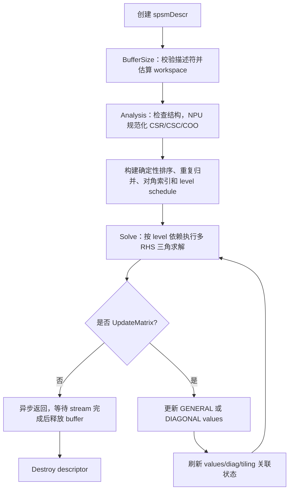
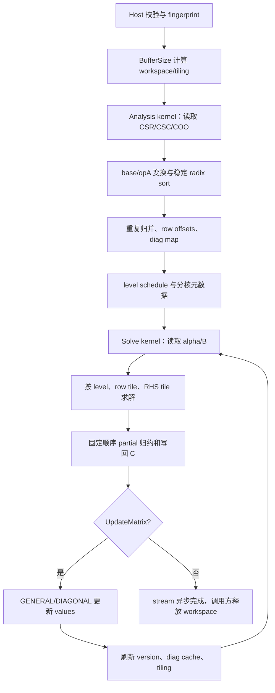

# 【社区任务】aclsparseSpSM 算子设计文档

> 对应任务书：`9月社区任务-aclsparseSpSM算子开发(950)/aclsparseSpSM_A5_task_doc.md`。本文是面向 Ascend 950（A5）的开发方案，代码、测试和自测报告以任务书为最终验收依据。

## 文档适用范围与依据

本方案覆盖 `aclsparseSpSMCreateDescr`、`aclsparseSpSMDestroyDescr`、
`aclsparseSpSMBufferSize`、`aclsparseSpSMAnalysis`、`aclsparseSpSM` 和
`aclsparseSpSMUpdateMatrix` 六个公开接口，覆盖 CSR/CSC/COO、FP32/complex64、
多 RHS、ROW/COL、N/T/H、Host/Device pointer mode 以及异步 stream 语义。

方案依据如下：

1. 任务书中给出的 `op(A)C=alpha*op(B)` 语义、参数矩阵、验收阈值和目录约定。
2. `ops-sparse` master 的 arch35/DAV_3510 `aclsparseSpSM` FP32 CSR 路径及其公共 Legacy API 风格。
3. cuSPARSE SpSM 的 create、bufferSize、analysis、solve、updateMatrix 生命周期和三角求解语义。
4. `asctool/docs/official/设计文档CheckList.md` 的设计文档审核项。
5. 任务包中的 `test_cases/aclsparseSpSM_testCase/`、`test_cases/common/` 和已采集 GPU 基线。

## 一、需求背景

### 1.1 需求来源

本需求来源于 2026 年 9 月 CANN 社区任务，目标是在 Ascend 950 上补齐开源
`ops-sparse` 的稀疏三角多右端求解能力，并向社区提交可复现的代码、测试和文档。
目标源码目录为 `sparse/spsm/arch35/`，专项 C++ UT/ST 位于
`test/spsm/arch35/`，公共接口位于 `include/cann_ops_sparse.h`。

### 1.2 背景介绍

#### 1.2.1 aclsparseSpSM 实现优化

SpSM 求解下列方程：

```text
op(A) * C = alpha * op(B)
```

其中 `A` 是三角稀疏方阵，`B` 是包含多个 RHS 的稠密矩阵，`C` 是解矩阵。现有
arch35/DAV_3510 路径可以作为 Host API、状态管理和 FP32 CSR 的实现基线，但需要
补齐格式、复数、转置、指针模式、更新接口和确定性规范化能力。

##### TBE 源码与算子信息库核查结论

本任务是 `ops-sparse` 的 `aclsparse` Legacy API 适配，并非已确认的 aclnn/TBE算子迁移。当前工作区没有 CANN OPP 安装目录，也没有同名 `spsm.py` 或 ops-info文件。

正确参考对象是 `ops-sparse` master 的 arch35/DAV_3510 实现、cuSPARSE SpSM 文档和任务包的测试脚本。

#### 1.2.2 aclsparseSpSM 现状分析

##### 1.2.2.1 当前支持的数据类型和数据格式

现有基线以 FP32 CSR 路径为主。本任务目标能力如下，`I32` 是 Device 端统一索引类型：

| 能力 | 当前 arch35 基线 | 本任务目标 |
| --- | --- | --- |
| A 格式 | CSR | CSR、CSC、COO |
| A dtype | FP32 | FP32、complex64 |
| 索引 dtype/base | 需沿用现有路径 | I32，base 0/1 |
| B/C 布局 | 以现有 dense 路径为准 | ROW、COL，动态 leading dimension |
| `opA` | 部分路径 | N、T；complex64 增加 H |
| `opB` | 部分路径 | N、T；complex64 增加 H |
| 三角属性 | LOWER/UPPER、UNIT/NON_UNIT | 全组合 |
| RHS | 单/有限场景 | 动态多 RHS，含 RHS=1 |
| pointer mode | Host 为主 | Host、Device alpha |
| 更新 | 未补齐 | GENERAL、DIAGONAL `UpdateMatrix` |
| 异步与确定性 | 路径相关 | handle stream 异步，固定规范化顺序 bitwise deterministic |

若未明确列出的 dtype、索引或格式，不得通过隐式转换宣称支持。

##### 1.2.2.2 参考实现与问题分析

三角求解按依赖层级处理。对规范化后的 CSR-like 结构，每个输出行 `i` 的计算为：

```text
rhs_i = alpha * op(B)[i, :]
sum_i = rhs_i - Σ A[i, j] * C[j, :], j 为已求解依赖
C[i, :] = sum_i / diag(A[i, i])       (NON_UNIT)
C[i, :] = sum_i                       (UNIT)
```

LOWER 从小行号到大行号处理，UPPER 反向处理；`opA=T/H` 时依赖方向、行列坐标和
complex64 的共轭语义一并变换。多 RHS 以向量 FMA 方式计算。CSR/CSC/COO 先转换为
统一的 row segment 表示；重复坐标按固定输入顺序求和，未排序坐标按
`(row, col, original_position)` 稳定排序，保证重复执行结果 bitwise deterministic。

当前实现需要解决的主要问题：

1. CSC/COO 不能直接套用 CSR row-offset 访问，必须在 NPU 上完成格式转换和索引规范化。
2. Analysis 阶段 values 可以为空，但 Solve 阶段必须使用有效 Device values，状态不能
   错绑指针或复用过期元数据。
3. 稀疏依赖导致普通均匀分核负载不平衡，需要 level scheduling 和长行拆分策略。
4. complex64 的 H 是共轭转置，不能仅交换索引而遗漏值的虚部取反。
5. UpdateMatrix 只更新 values，不改变 pattern；GENERAL/DIAGONAL 更新后应刷新对角和
   依赖相关 tiling 状态，同时保留可复用的结构元数据。

##### 1.2.2.3 参考实现流程图

当前可确认的流程是 `ops-sparse` Host 分阶段 API + NPU 异步执行；不存在可引用的同名
TBE compute 图，下面的图描述可执行的参考语义而非虚构的 TBE 源码。



## 二、需求分析

### 2.1 外部组件依赖

运行时不新增第三方依赖，依赖 CANN Runtime、Ascend C 编译链和 `ops-sparse` 已有公共
组件。测试和报告依赖仅用于离线验证：

| 组件 | 用途 | 运行时依赖 |
| --- | --- | :---: |
| CANN 9.1.0+、Ascend 950 驱动 | 编译、Device、stream、Profiler | 是 |
| `acl/acl.h`、Ascend C headers | Legacy API、Kernel launch 和同步 | 是 |
| cuSPARSE | GPU 对照、性能基线和生命周期语义参考 | 否 |
| PyTorch/torch_npu | 测试驱动、CPU Golden 和 NPU hook | 测试 |
| ATK/测试公共组件 | 泛化精度执行 | 测试 |
| CANN Profiler/msprof | Kernel、stream、workspace 证据 | 测试 |

### 2.2 内部适配模块

| 模块 | 适配内容 |
| --- | --- |
| `include/cann_ops_sparse.h` | 新增 `aclsparseSpSMUpdate_t` 和 `aclsparseSpSMUpdateMatrix` 声明 |
| 公共 sparse Host | descriptor 校验、pointer mode、状态机、错误码、stream 获取 |
| `sparse/spsm/arch35/host` | BufferSize、Analysis、tiling、workspace 和 kernel 下发 |
| `sparse/spsm/arch35/kernel` | 格式规范化、level schedule、FP32/complex64 求解和写回 |
| 公共格式工具 | CSR/CSC/COO 描述符读取、base 转换、稳定排序键和重复归并 |
| `test/spsm/arch35` | C++ UT、端到端 ST、alias、生命周期和异常验证 |
| `test_cases/common` | 用例生成、benchmark、内存比较和结果归档 |

### 2.3 需求模块设计

#### 2.3.1 Ascend C/Legacy API 原型

公开接口严格采用任务书基线：

```cpp
aclsparseStatus_t aclsparseSpSMCreateDescr(aclsparseSpSMDescr_t *spsmDescr);
aclsparseStatus_t aclsparseSpSMDestroyDescr(aclsparseSpSMDescr_t spsmDescr);
aclsparseStatus_t aclsparseSpSMBufferSize(
    aclsparseHandle_t handle, aclsparseOperation_t opA, aclsparseOperation_t opB,
    const void *alpha, aclsparseConstSpMatDescr_t matA,
    aclsparseConstDnMatDescr_t matB, aclsparseDnMatDescr_t matC,
    aclDataType computeType, aclsparseSpSMAlg_t alg,
    aclsparseSpSMDescr_t spsmDescr, size_t *bufferSize);
aclsparseStatus_t aclsparseSpSMAnalysis(
    aclsparseHandle_t handle, aclsparseOperation_t opA, aclsparseOperation_t opB,
    const void *alpha, aclsparseConstSpMatDescr_t matA,
    aclsparseConstDnMatDescr_t matB, aclsparseDnMatDescr_t matC,
    aclDataType computeType, aclsparseSpSMAlg_t alg,
    aclsparseSpSMDescr_t spsmDescr, void *buffer);
aclsparseStatus_t aclsparseSpSM(
    aclsparseHandle_t handle, aclsparseOperation_t opA, aclsparseOperation_t opB,
    const void *alpha, aclsparseConstSpMatDescr_t matA,
    aclsparseConstDnMatDescr_t matB, aclsparseDnMatDescr_t matC,
    aclDataType computeType, aclsparseSpSMAlg_t alg,
    aclsparseSpSMDescr_t spsmDescr);
typedef enum aclsparseSpSMUpdate_t {
    ACL_SPARSE_SPSM_UPDATE_GENERAL = 0,
    ACL_SPARSE_SPSM_UPDATE_DIAGONAL
} aclsparseSpSMUpdate_t;
aclsparseStatus_t aclsparseSpSMUpdateMatrix(
    aclsparseHandle_t handle, aclsparseSpSMDescr_t spsmDescr,
    void *newValues, aclsparseSpSMUpdate_t updatePart);
```

完整参数约定如下；BufferSize、Analysis、SpSM 三阶段对同一组属性执行一致性校验。

| 参数 | I/O/属性 | 数据类型 | 布局/shape | 合法值域 | 异常行为 |
| --- | --- | --- | --- | --- | --- |
| `handle` | 输入 | Handle | 标量句柄 | 已创建且未销毁 | 空句柄返回明确错误码 |
| `opA` | 属性 | enum | 单值 | N/T/H | 非法枚举返回错误 |
| `opB` | 属性 | enum | 单值 | N/T/H | 非法枚举返回错误 |
| `alpha` | 输入 | FP32/complex64 pointer | Host 或 Device，1 个标量 | 与 `computeType` 一致 | 空指针、位置或 dtype 不匹配返回错误 |
| `matA` | 输入 | sparse descriptor | CSR/CSC/COO，`[m,m]`，I32 index | base 0/1；合法 fill/diag；FP32/complex64 | 描述符、索引、shape 或属性非法返回错误 |
| `matB` | 输入 | dense descriptor | ROW/COL，多 RHS，leading dimension 合法 | 与 A/computeType 一致；`op(B)` 右维为 m | layout、stride、shape 或 dtype 不匹配返回错误 |
| `matC` | 输出/原地 | dense descriptor | ROW/COL，多 RHS，leading dimension 合法 | `C` 左维为 `op(A)` 左维；可与 B 完全同指针 | 非法 alias、shape、layout 或 dtype 返回错误 |
| `computeType` | 属性 | enum | 单值 | `ACL_FLOAT`、`ACL_COMPLEX64` | 与 A/B/C/alpha 不一致返回错误 |
| `alg` | 属性 | enum | 单值 | `DEFAULT` | 未支持枚举返回不支持错误 |
| `spsmDescr` | 输入/输出 | opaque descriptor | 单个对象 | Create 后至 Destroy 前有效 | 空指针、阶段错误或已销毁返回错误 |
| `bufferSize` | 输出 | `size_t*` | Host 标量 | 非负且无溢出 | 空指针或溢出返回错误 |
| `buffer` | workspace | Device byte buffer | 至少 `bufferSize` 字节，满足对齐 | Analysis 至异步 Solve 完成前有效 | 空、未对齐、过小或过早释放返回错误 |
| `newValues` | 输入 | Device values pointer | 连续 FP32/complex64；GENERAL 为 nnz，DIAGONAL 为对角数 | 与原 A pattern、dtype 一致 | 空指针、位置、长度或 dtype 不匹配返回错误 |
| `updatePart` | 属性 | enum | 单值 | GENERAL、DIAGONAL | 非法枚举返回错误 |

矩阵维度必须满足 `op(A)C=alpha*op(B)`；NON_UNIT 时每一行必须有唯一非零对角项。
`matA` 的 values 在 Analysis 可为空，但描述符中的 nnz、索引类型、shape 和属性必须
有效；SpSM/UpdateMatrix 阶段读取真实 Device values。未排序和重复坐标是合法输入，
由 Analysis 的确定性规范化流程处理。

参数和约束摘要如下：

| 参数 | 约束 |
| --- | --- |
| `handle` | 已创建上下文，所有 kernel 绑定其 stream；空句柄返回明确错误码 |
| `opA/opB` | 支持 N/T；complex64 支持 H，非法枚举报错 |
| `alpha` | FP32 或 complex64；Host/Device pointer mode 与 handle 设置一致 |
| `matA` | 二维三角方阵；CSR/CSC/COO，I32 索引，base 0/1，FP32/complex64 |
| `matB/matC` | ROW/COL，多 RHS，leading dimension 合法；C 可与 B 共用 values |
| `computeType` | `ACL_FLOAT` 或 `ACL_COMPLEX64`，与 A/B/C/alpha 一致 |
| `alg` | 支持 `DEFAULT`；其他未实现枚举返回不支持错误 |
| `bufferSize/buffer` | `size_t` workspace；Analysis 到异步 Solve 完成前有效且不可修改 |
| `newValues` | Device 连续 values；GENERAL 长度为 nnz，DIAGONAL 按对角元素数量 |

#### 2.3.2 Ascend C 相关约束与相对 TBE 的缺失项

由于同名 TBE 未确认，不能声称存在可比的 TBE 能力差异。相对于任务书目标，首版
Ascend C 明确不支持：非 I32 索引、FP16/BF16/FP64/complex128、批量稀疏矩阵、广播、
任意 stride、非 DEFAULT alg，以及 CPU fallback。A/B/C 的合法 alias 只限 B/C values
完全同指针；A 与 B/C 重叠、部分重叠和 host values 均报错。若开发环境发现 TBE，
应将该表改为逐项能力对照，而不是默认继承 TBE 的隐式行为。

## 三、需求详细设计

### 3.1 使能方式

本任务不是 aclnn Tensor API，而是 `ops-sparse` 的 aclsparse Legacy API。调用方通过
handle 绑定 stream，按 cuSPARSE 对齐的五阶段顺序执行：

```text
CreateDescr -> BufferSize -> 申请 Device workspace -> Analysis
            -> SpSM (可重复调用) -> UpdateMatrix (可选) -> SpSM -> DestroyDescr
```

所有阶段只提交异步 NPU kernel，不隐式 synchronize。调用者必须保持 matA/matB/matC
描述符、参数、externalBuffer 和 values 生命周期一致，直到对应 stream 上的 Solve
完成。BufferSize/Analysis 接受 values 为空的有效描述符；Solve 前必须设置有效 Device
values。此处的 Legacy API 调用链对应 CheckList 的“调用框架适配”要求，不能改成只提供
独立 kernel 入口。

### 3.2 需求总体设计

总体采用“公共 Host 状态管理 + NPU 规范化/分析 + level-scheduled NPU solve”的三层
结构。Analysis 产生可复用的 pattern 元数据，Solve 只读取 Device values 和已绑定的
workspace。格式转换和与稀疏结构相关的计算全部由 NPU kernel 完成，Host 仅负责参数检查、
tiling 描述和 kernel 提交，不执行 CPU 求解或 CPU 排序 fallback。

#### 3.2.1 Host 侧设计

Host descriptor 保存以下状态：

```text
CREATED
  -> BUFFER_SIZED (workspace_bytes, shape/dtype/layout fingerprint)
  -> ANALYZING (一次或多次异步 preprocess)
  -> ANALYZED (normalized pattern, levels, diag map, tiling, buffer association)
  -> SOLVING (stream 上的 solve 未完成)
  -> UPDATED (values/version 和 diag/tiling 状态刷新)
  -> DESTROYED
```

每次 BufferSize、Analysis、SpSM、UpdateMatrix 均计算参数 fingerprint，至少包括
`matA/matB/matC` 描述符地址、格式、base、fill/diag、opA/opB、shape、RHS、leading
dimension、dtype、pointer mode、alg 和 workspace 地址/大小。Analysis 后除允许
`UpdateMatrix` 外，fingerprint 改变返回状态错误；Solve 使用的 values 指针必须是
有效 Device 指针，更新 version 后重新绑定 kernel 参数。

Host 参数校验包括空指针、非法枚举、负维/溢出、方阵和 RHS 维度、索引范围、base、
leading dimension、NON_UNIT 对角存在且非零、dtype 一致性、workspace 对齐和状态顺序。
错误必须在提交 kernel 前返回明确 `aclsparseStatus_t`，不通过 kernel 崩溃表达参数错误。

##### 3.2.1.1 分核策略

Analysis 的 NPU preprocess 依次执行：

1. 将 CSR、CSC、COO 映射为逻辑坐标 `(row, col, original_position)`，扣除 base。
2. 对 `opA` 做坐标变换；complex64 的 H 同时对 value 做共轭。
3. 按 `(row, col, original_position)` 进行稳定 radix sort，固定顺序归并重复坐标。
4. 生成 row offsets、diag position、每行依赖数和 level schedule。

对 LOWER，level 为 `1 + max(level[j])`，其中 `j < i` 且 `A[i,j] != 0`；UPPER 使用
`j > i`，并按反向拓扑序编号。无依赖的行属于 level 0。设 level `l` 的行集合为
`R_l`，该 level 的工作量为 `W_l = Σ(nnz_i * rhsTile)`，核心数为 `K`，采用连续
加权分区：

```text
target = ceil(W_l / min(K, |R_l|))
core_q 负责最小的连续行区间，使累计 W 不超过 target（最后一个 core 吸收余数）
```

每个 core 处理一个 level 的行区间；level 之间以硬件 flag 或拆分 kernel launch
同步。对长尾行，先按 RHS tile 切分向量计算；当单行 `nnz_i * rhs` 大于阈值时，
使用 row partial workspace 后固定顺序归约，禁止 atomic 浮点归约。小规模场景采用
`usedCore=min(coreCount, max(1, totalRows))`，避免空核 launch 开销。

##### 3.2.1.2 数据分块和 LocalMemory 优化策略

统一以 RHS 维为向量化方向。设有效 UB 为 `U` 字节、元素字节数为 `e`（FP32 为 4，
complex64 为 8）、double buffer 系数为 `db=2`，每个 RHS tile 为 `r`，每行稀疏项
tile 为 `s`，保留同步和对齐空间 `Rsv`，则可用 tile 约束为：

```text
Bytes(r, s) = db * (r * e                 # rhs/c 输出向量
                  + s * e                 # A values
                  + s * 4                 # I32 col index
                  + 2 * r * e)            # partial/sum 临时向量
                  + AlignBytes(metadata)
Bytes(r, s) + Rsv <= U
r = max(1, min(rhs, floor((U - Rsv) / (db * 4 * e))))
s = max(1, floor((U - Rsv - db * 4 * r * e) / (db * (e + 4))))
```

实际实现从平台信息取得 UB/L2 容量，所有乘法先用 `uint64_t` 检查溢出。CSR row
offset、col index 和 normalized value 不整体复制到 UB；按 row tile 搬入，B/C 按
`layout` 和 leading dimension 计算地址。ROW 布局地址为 `row * ld + rhs`，COL 布局
地址为 `rhs * ld + row`；尾部 tile 用有效元素 mask 写回。complex64 使用实虚交错
存储，复乘采用固定 `a.real*b.real-a.imag*b.imag`、`a.real*b.imag+a.imag*b.real`
顺序，保证确定性。

Analysis workspace 至少包含 normalized row offsets、col indices、values alias 元数据、
diag map、level offsets/rows 和临时 radix sort/归并空间；Solve workspace 还包含长行
partial。估算示例：

```text
pattern = (m + 1) * 4 + nnz * (4 + e)
level   = (m + 1) * 4 + m * 4
partial = long_row_count * rhsTile * e * partial_factor
workspace = Align256(pattern + level + partial + sort_temp + descriptor_temp)
```

Workspace 只由 BufferSize 报告和由调用者提供，Analysis 到异步 Solve 完成前保持有效；
不在 Host 保留与输入同规模的结构副本。

##### 3.2.1.3 tilingKey 规划策略

`tilingKey` 用于选择已验证的 Kernel 专用路径，建议采用位域编码，避免为每种 shape
生成独立 key：

```text
bit 0      dtype       0=FP32, 1=complex64
bit 1..2   format      0=CSR, 1=CSC, 2=COO, 3=normalized
bit 3      opA         0=N, 1=T/H（H 由 dtype/op 标志区分）
bit 4      opB         0=N, 1=T/H
bit 5      layout      0=ROW, 1=COL
bit 6      diag        0=UNIT, 1=NON_UNIT
bit 7      fill        0=LOWER, 1=UPPER
bit 8      rhs path    0=small-rhs vector, 1=multi-rhs tile
bit 9      row path    0=balanced, 1=long-row partial
bit 10     update      0=general/initial, 1=diagonal-only refresh
```

未声明组合不生成 key；Host 在 key 选择前完成能力矩阵检查。`opA=H` 仅在 complex64
下生成，共轭操作进入 Kernel 参数而不是复用 T 路径。shape、m、nnz、RHS、core 数和
tile 大小进入 TilingData，不膨胀 tilingKey 空间。

#### 3.2.2 Kernel 侧设计

##### 3.2.2.1 Kernel 实现描述

Kernel 分为四个可独立观测的阶段：

**阶段 A：格式规范化（Analysis）**

- CSR 读取 row offsets，CSC 将 column segment 转为 row key，COO 直接读取 row/col。
- base 0/1 在读取时统一扣除，检查 `0 <= row,col < m`。
- `opA` 交换坐标；H 对 complex64 value 取共轭。
- 使用稳定 radix sort；相同坐标按 `original_position` 固定归并，不使用未定义顺序的 atomic。
- 输出 normalized CSR-like arrays、diag map、level rows 和 level offsets。

**阶段 B：alpha 和 RHS 准备（Solve）**

- Host pointer mode 的 alpha 由 Host 复制到已对齐 Device scalar；Device mode 直接读取
  Device scalar，二者在 Kernel 中走同一计算路径。
- B/C values 指针可以相同；当 alias 合法时，按求解顺序读取当前 RHS，计算后原位写回。
- `opB` 的 N/T/H 只改变 dense 地址和 complex 共轭，不改变 A 的依赖图。

**阶段 C：level-scheduled triangular solve**

```text
for level in fixed_topological_order:
    parallel for row in assigned_rows(level):
        load alpha * op(B)[row, rhs_tile]
        for p in row_segment(row):
            if p is diagonal: save diag
            else: sum -= value[p] * C[dependency_row, rhs_tile]
        if NON_UNIT: sum /= diag
        store C[row, rhs_tile]
    level_barrier()
```

同一个 level 内没有数据依赖。长行 partial 按固定 p 顺序生成并归约；归约结果不使用
atomic。UNIT 路径不读取 diagonal value，NON_UNIT 对零/缺失对角在 Analysis 返回结构错误。

**阶段 D：UpdateMatrix**

GENERAL 更新只替换 values 并刷新 value version；DIAGONAL 更新通过 diag map 定位对角
元素，更新零检查和 reciprocal cache。pattern、排序、level schedule 不变；若平台
实现需要重新编译 key，仅刷新 tiling data，不重建不变的结构元数据。Update 后的 solve
必须在同一 handle stream 上按顺序提交。

##### 3.2.2.2 Ascend C 实现流程图



##### 3.2.2.3 与 TBE 流程的差异点和原因

没有确认同名 TBE 源码，以下是“典型 TBE 机制”与本 Ascend C 设计的边界说明；找到
真实 TBE 后必须逐源码更新。

| 项目 | 同名 TBE | 本 Ascend C 设计 | 原因 |
| --- | --- | --- | --- |
| 参考对象 | 未确认，N/A | arch35/DAV_3510 + cuSPARSE | Legacy API 补齐任务 |
| 格式处理 | 可能由 DSL/库隐式完成 | NPU 显式规范化 CSR/CSC/COO | 统一依赖图和确定性 |
| 调度 | 未确认 | Host level schedule + Kernel flag | 稀疏依赖需要显式同步 |
| 重复坐标 | 未确认 | 固定 key 稳定排序和归并 | 满足 bitwise deterministic |
| 生命周期 | 未确认 | descriptor fingerprint 和 workspace 状态机 | 对齐 cuSPARSE 阶段语义 |
| 更新 | 未确认 | values-only GENERAL/DIAGONAL | 避免重复分析 pattern |
| CPU fallback | 可能存在 | 明确禁止 | 验收要求主计算由 NPU 完成 |

### 3.3 支持硬件

首版仅支持 Ascend 950（A5），使用 CANN 9.1.0 及后续配套版本。Host 公共逻辑与 arch35
Kernel 差异层分离，所有能力声明和验收结论仅针对 Ascend 950。自测报告必须记录实际
CANN、驱动、SOC、Device 数量、编译器版本和 Profiler 版本。

### 3.4 算子约束限制

| 维度 | 约束 |
| --- | --- |
| A shape | 二维三角方阵 `[m,m]`；m、nnz、RHS 支持动态有效范围，字节计算用 64 位 |
| dtype | FP32、complex64；A/B/C/alpha/computeType 必须一致 |
| index | Device row/column index 只支持 I32，base 只支持 0/1 |
| format | A 支持 CSR/CSC/COO；B/C 只支持 ROW/COL dense |
| op | opA/opB 全部接受 N/T/H；FP32 的 H 按实数语义等同 T，complex64 的 H 执行共轭转置 |
| triangle | LOWER/UPPER；UNIT 不读取对角 value，NON_UNIT 要求对角存在且非零 |
| alg | 只承诺 DEFAULT |
| alias | 仅允许 B/C values 完全同指针；A 与 B/C 或部分重叠拒绝 |
| values | Analysis 可空；Solve/UpdateMatrix 必须是有效 Device values |
| determinism | 未排序、重复坐标经过固定规范化；不允许未定义并行归约顺序 |
| error | 非法 shape、索引、dtype、layout、pointer、workspace、生命周期均返回明确错误 |
| batch/broadcast | 不支持 batch、广播、任意 stride、量化和其他 dtype |

## 四、特性交叉分析

| 特性 | 是否涉及 | 交叉影响与处理 |
| --- | :---: | --- |
| 动态 shape | 是 | BufferSize/Analysis 每次按 m/nnz/RHS/ld 生成 TilingData，所有字节数溢出检查 |
| CSR/CSC/COO | 是 | Analysis 在 NPU 统一成 row segment；原始 format 纳入 fingerprint |
| base 0/1 | 是 | 读取时扣除 base，输出 index 不暴露内部偏移 |
| LOWER/UPPER | 是 | 影响依赖方向、level 顺序和 diagonal 检查 |
| opA N/T/H | 是 | T 交换坐标，H 交换并共轭；complex64 H 不得降级为 T |
| opB N/T/H | 是 | dense 地址和共轭规则独立处理，不改变 A level schedule |
| ROW/COL、leading dimension | 是 | 地址公式纳入 fingerprint，尾块 mask 防止 padding 写坏 |
| 多 RHS | 是 | RHS tile 向量化；RHS=1 选择 small-rhs key |
| pointer mode | 是 | Host alpha 复制到 Device scalar；Device alpha 直接读，二者结果一致 |
| B/C 原地 | 是 | 严格按 level 顺序读写，C values 与 B values 完全相同才允许 |
| UpdateMatrix | 是 | GENERAL 更新 values version；DIAGONAL 使用 diag map；刷新 cache/tiling |
| 异步 stream | 是 | 不隐式同步；workspace、descriptor、values 至异步完成前不得释放/修改 |
| 确定性 | 是 | 稳定 sort、固定重复归并、固定 row/p 顺序、无 atomic 浮点归约 |
| 空/边界 | 是 | m/nnz/RHS 为 0/1、空行、缺失对角、长尾行分别验证并返回规定状态 |
| profiler | 是 | 记录 preprocess、analysis、solve、update kernel 和 stream 依赖证据 |
| 内存 | 是 | workspace query、L2 约束、峰值内存和同 case GPU/NPU 对比 |

安全性要求：task 坐标、row/col、workspace offset 和写回范围都在 Kernel 内做边界保护；
Host 不把未经 64 位检查的值下转为 32 位；不读取三角属性未指定的矩阵半区；不缓存
调用者短生命周期指针。

## 五、可维可测分析

### 5.1 精度标准/性能标准

#### 5.1.1 精度标准

CPU Golden 使用 FP64 生成 FP32 结果，complex64 使用 complex128 中间计算。逐元素判定：

```text
atol = 2^-16
rtol = 2^-10
|actual - golden| <= atol + rtol * |golden|
```

整体匹配率不低于 `0.99`；每元素绝对误差还必须不超过
`max(1e-2, 32 * ULP(golden))`。complex64 实部、虚部分别应用全部规则。覆盖普通值、
抵消、INF/NAN、UNIT、N/T/H、三种 format、未排序/重复坐标、空行、原地求解和
GENERAL/DIAGONAL UpdateMatrix。相同输入、相同 tiling、重复执行的 C 输出必须 bitwise
一致；INF/NAN 用例按测试框架的特殊值规则记录，不将 NaN 直接按普通数比较。

#### 5.1.2 性能标准

性能倍率定义为：

```text
GPU 标杆接口 GPU Event 调用耗时 / NPU 同调用范围总耗时
```

每场景预热 10 次、正式采样 30 次，报告 median、P90、Analysis、Solve、Update、
workspace 和 Profiler 数据。所有声明 dtype 达到 GPU 标杆的 `0.3` 倍以上；任务书
指定 P 场景如下：

| 场景 | m / nnz / RHS | dtype | GPU Event median_us 范围（任务书） | 目标 |
| --- | --- | --- | ---: | --- |
| P-01 | 32768 / 262144 / 16 | FP32、complex64 | 56341.984–57962.883 | NPU >= 0.3x |
| P-02 | 65536 / 786432 / 32 | FP32、complex64 | 152160.188–152243.891 | NPU >= 0.3x |
| P-03 | 131072 / 1966080 / 64 | FP32、complex64 | 304306.812–305923.281 | NPU >= 0.3x |

任务包中的原生 cuSPARSE `benchmark_cusparse_gpu.cu` 还会记录另一计时范围，当前
`gpu_performance_result_benchmark.md` 的 P 场景 median 约为 322955–1887569 us；该
数据仅作为诊断和实现对照，不能替换任务书指定的 GPU Event 标杆。报告必须写明计时
来源和是否包含 reanalysis/update。

#### 5.1.3 内存标准

沿用任务书两条验收路径：输入输出总量超过 500 MB 时，同一 case 的 NPU 额外峰值内存
不超过 GPU 峰值总量的 50%；无等价 GPU 接口时，固有 workspace 不超过目标硬件 L2
Cache。使用 `collect_sparse_ops_gpu_memory.py`、`collect_sparse_ops_npu_memory.py`
和 `compare_sparse_ops_memory.py`，报告 `input_baseline_*_bytes`、`peak_*_bytes`、
`extra_peak_*_bytes`、workspace bytes 及 L2 参数。

### 5.2 兼容性分析

| 维度 | 方案 |
| --- | --- |
| API/ABI | 复用既有 aclsparse 类型和枚举，只新增 UpdateMatrix enum/函数；头文件、导出符号和 C++ UT 同步更新 |
| 源码 | 公共 Host 与 `arch35` Kernel 分层；不修改既有 CSR FP32 行为，并完成 950 回归 |
| CANN | 目标 CANN 9.1.0+；以实际 950 工具链签名为准，不能仅凭文档声明编译通过 |
| 硬件 | 仅声明 Ascend 950（A5）和任务书要求的 CANN 版本 |
| 异步 | handle stream 语义与 cuSPARSE 对齐；返回不代表 Device 完成 |
| workspace | 调用者所有，Solve 完成前有效；算子不释放或缓存外部 workspace |
| 数值 | FP32/complex64 严格路径，不启用未经精度准入的近似模式 |
| 确定性 | 同一输入和 tiling 结果 bitwise deterministic，更新后 version 单调 |
| 回滚 | 新入口和 key 可独立关闭；公共 Host 改动必须通过既有 sparse 回归 |

## 六、测试与自验设计

### 6.1 C++ UT/ST 用例矩阵

| 类别 | 必测场景 |
| --- | --- |
| 功能 | CSR/CSC/COO；LOWER/UPPER；UNIT/NON_UNIT；FP32/complex64；多 RHS |
| 操作布局 | opA/opB N/T/H；B/C ROW/COL；leading dimension；complex H 共轭 |
| 生命周期 | Create、BufferSize、values 为空 Analysis、SpSM、GENERAL/DIAGONAL Update、Destroy |
| 异常边界 | m/nnz/RHS 为 0/1、空行、零/缺失对角、未排序、重复坐标、非法索引/shape/dtype/workspace |
| 指针语义 | Host/Device alpha、B/C 同指针、descriptor 变更、过早释放 buffer、重复确定性 |
| 异步 | 多 stream、同 stream 顺序、Solve 完成前禁止释放和修改资源 |

### 6.2 测试资产与执行命令

任务包测试目录保持不改动并随交付提交：

```text
9月社区任务-aclsparseSpSM算子开发(950)/test_cases/
  common/
  aclsparseSpSM_testCase/accuracy_cases.json
  aclsparseSpSM_testCase/performance_cases.json
  aclsparseSpSM_testCase/accuracy_sparse_ops.py
  aclsparseSpSM_testCase/benchmark_sparse_ops_npu.py
  aclsparseSpSM_testCase/collect_sparse_ops_npu_memory.py
  aclsparseSpSM_testCase/compare_sparse_ops_memory.py
```

执行顺序：

```bash
cd 9月社区任务-aclsparseSpSM算子开发\(950\)/test_cases
bash run_accuracy_atk.sh
(cd aclsparseSpSM_testCase && python3 benchmark_sparse_ops_npu.py \
  --case-file performance_cases.json --device 0 --output results)
(cd aclsparseSpSM_testCase && python3 collect_sparse_ops_npu_memory.py \
  --case-file performance_cases.json --device 0 --output results_memory)
```

NPU benchmark 缺少真实 `spsm_analysis_npu`、`spsm_update_npu`、`spsm_npu` hook 时必须
失败；`--allow-reference-fallback` 仅允许 `m<=4096` 的稠密冒烟，不能作为精度/性能验收。
GPU 侧使用 `run_all_gpu_benchmarks.sh` 和 `run_cusparse_gpu.py`，明确记录
`update_supported`、`reanalyze` 或真实 update 路径。

### 6.3 自测报告内容

报告至少包含：用例 ID 和完整参数、返回码、descriptor 状态转移、workspace 生命周期、
FP32/complex64 精度统计、匹配率和最大误差、bitwise 重复性、Analysis/Solve/Update
耗时、P90、峰值内存、CANN/驱动/SOC、Profiler 截图和失败项说明。README 需给出编译、
注册、运行和结果解释步骤，保证验收人可复现。

## 七、代码落地、里程碑与交付

### 7.1 建议目录

```text
ops-sparse/
  include/cann_ops_sparse.h
  sparse/spsm/arch35/
    host/spsm_host.cpp
    host/spsm_tiling.cpp
    host/spsm_state.hpp
    kernel/spsm_normalize.cpp
    kernel/spsm_solve.cpp
    kernel/spsm_update.cpp
    kernel/spsm_tiling_data.h
  test/spsm/arch35/
    spsm_ut.cpp
    spsm_st.cpp
    CMakeLists.txt
  README.md
```

### 7.2 开发步骤

1. 复核 CANN 950 的 API、TBE 候选文件、ops-info 和现有 arch35 代码，冻结接口和错误码。
2. 接入公开头文件、descriptor 状态机、BufferSize 和严格参数校验。
3. 完成 FP32 CSR 的 NPU normalize、level schedule 和多 RHS solve，先通过小规模 UT。
4. 增加 CSC/COO、base 0/1、未排序/重复坐标和 deterministic 归并。
5. 增加 complex64、opA/opB N/T/H、ROW/COL、Host/Device alpha 和 B/C 原地路径。
6. 增加 GENERAL/DIAGONAL UpdateMatrix，校验更新后的状态刷新和重复 Solve。
7. 针对 P-01/P-02/P-03 调整 tile、long-row partial、double buffer 和 level 分区，采集 Profiler。
8. 执行 C++ UT/ST、ATK 精度、GPU/NPU 性能和内存测试，形成 README 与自测报告。
9. 完成 Ascend 950 回归，提交 `ops-sparse` PR、设计文档 PR 和社区验收材料。

### 7.3 交付件

| 交付件 | 内容 |
| --- | --- |
| 设计文档 | 本文，按模板和 CheckList 提交 `cann-ops-competitions` PR |
| 源码 | `ops-sparse` 公开接口、Host、arch35 Kernel、UpdateMatrix、构建文件 |
| 测试代码 | C++ UT/ST、任务包精度/性能/内存脚本和 README |
| 自测报告 | 参数、输出、精度、性能、内存、截图、Profiler、失败项和环境 |
| 代码地址 | 个人 `ops-sparse` 仓链接、分支、目录和 `Ascend-CANN` 开发者邀请 |
