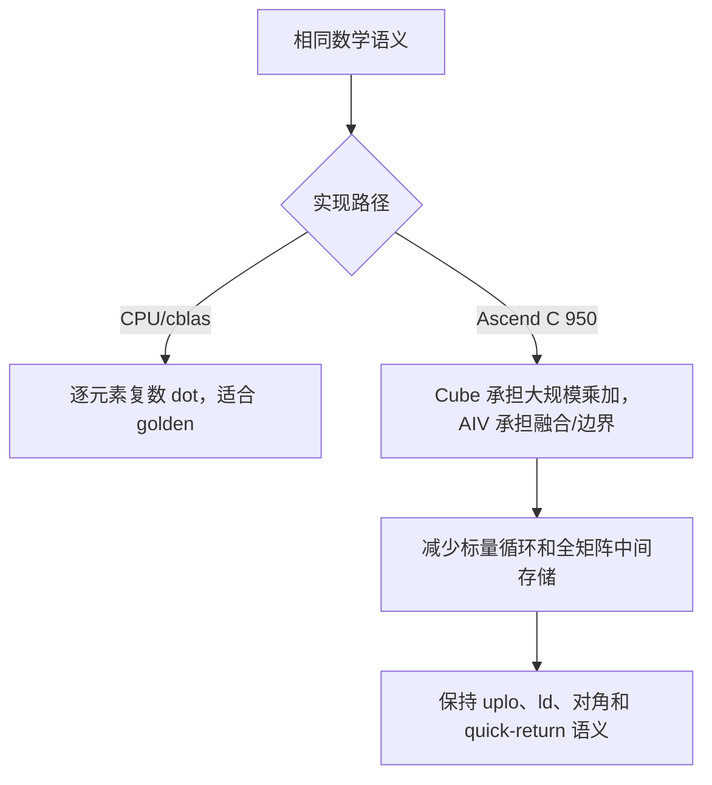

# aclblasCher2k（Ascend 950）算子设计文档

## 1. 需求背景

本任务在 Ascend950PR（DAV_3510）上实现与 cuBLAS `cublasCher2k`/Netlib
`cher2k` 语义一致的单精度复数 Hermitian rank-2k 更新。接口为句柄式
`aclblasCher2k`，矩阵采用 Column-Major，A、B、C 和 alpha 为 COMPLEX64，beta
为 FLOAT32。

`trans=N` 时计算：

`C = alpha*A*B^H + conj(alpha)*B*A^H + beta*C`

`trans=C` 时计算：

`C = alpha*A^H*B + conj(alpha)*B^H*A + beta*C`

仅更新 `uplo` 指定三角；对角元素虚部强制写为 0；另一三角不得被引用或修改。

## 2. 参考实现与工程位置

- cuBLAS：`cublasCher2k` 参数和矩阵语义；
- Netlib BLAS：`cher2k.f` 三角、quick-return 和对角线语义；
- 共享实现：`blas/matmul_series/arch35/`；
- 950 公共入口：`blas/herk/arch35/cher2k_host.cpp`；
- 公共声明：`include/cann_ops_blas.h`；
- 测试：`test/her2k/cher2k/arch35/`。

## 3. 总体设计

```mermaid
flowchart TD
  A[句柄/枚举/维度/ld/指针校验] --> B{quick return}
  B -- 是 --> Z[返回 SUCCESS，不读写 C]
  B -- 否 --> C[读取 Device alpha、beta]
  C --> D{大尺寸且 workspace 可用}
  D -- 是 --> E[arch35 Cube 复数分解路径]
  D -- 否 --> F[Reg-SIMD/scalar 语义回退]
  E --> G[按 uplo 调度三角 tile]
  F --> G
  G --> H[融合 alpha、conj(alpha)、beta]
  H --> I[对角虚部置零]
  I --> J[只写目标三角]
```

### 3.1 Host 侧

`matmul_series_cher2k` 完成参数检查、Device 标量读取、workspace 管理和路径
分发。支持 `uplo=UPPER/LOWER`、`trans=OP_N/OP_C`；`OP_T` 对本接口返回
`ACLBLAS_STATUS_INVALID_VALUE`。`n<0`、`k<0`、非法 leading dimension、必需
指针为空均返回 `ACLBLAS_STATUS_INVALID_VALUE`。`n=0`，或
`(alpha==0 或 k==0) 且 beta==1` 时执行 BLAS quick return。

大尺寸路径使用 950 arch35 Cube/向量流水；小尺寸、非对齐和 workspace 不足时
使用同一 host 入口的 scalar/Reg-SIMD 回退，保证边界语义一致。

### 3.2 Kernel 侧

复数乘法按实部/虚部分解，Cube 完成实数矩阵乘加，AIV 完成复数重建、alpha/beta
融合和 Hermitian 三角写回。每个输出 tile 只由一个调度 block 负责，避免上下三角
重复写入。输入矩阵按 lda/ldb 的 Column-Major 步长读取，C 按 ldc 原地更新。

950 路径使用 128B 对齐、Cube tile 化和 Reg-SIMD 后处理；通过 workspace 中的
中间实/虚平面避免在 UB 中保存完整复数矩阵。UB 中仅保留当前 tile、搬运缓冲和
融合临时量，尾块使用 mask/边界判断。

### 3.3 同步与内存

搬运、计算和写回按 Ascend C 队列依赖组织；跨阶段只在确有数据依赖的位置建立
同步。Cube 乘加完成后，AIV 读取对应中间平面并写回目标三角。未选三角不发起
读写，beta=0 时不依赖旧 C 内容。

## 4. 三张实现流程图

### 4.1 TBE/CPU baseline 语义流程

```mermaid
flowchart LR
  A[读取 A/B/C 与标量] --> B[按 trans 取 A/B 共轭转置]
  B --> C[逐目标元素计算两次复数点积]
  C --> D[alpha/conj(alpha)/beta 融合]
  D --> E[仅写 uplo 三角]
  E --> F[对角虚部设 0]
```

### 4.2 Ascend C 950 流程


### 4.3 差异与原因



差异来自硬件执行单元和内存层次：CPU golden 追求可复现语义，950 实现将规则的
矩阵乘加映射到 Cube，并把三角选择和尾块处理留在 AIV，从而降低访存和 launch
开销；两者的差异只体现在合法浮点舍入顺序，按任务书 FP32 容差判定。

## 5. 精度与性能验收

精度 golden 使用任务书提供的 cblas/Netlib `cblas_cher2k`，实部、虚部分量分别
比较，阈值为 `rtol=2^-10`、`atol=2^-16`、matched ratio≥0.99，且最大绝对误差
不超过 `max(1e-2, 32*ULP)`。验收覆盖任务书 CSV 的全部 1000 个非性能用例，另
检查保护三角、对角虚部和负向返回码。

性能先 warmup，再有效采样超过 50 次取平均。任务书四个基准为：

| uplo/trans | n | k | 门槛（GPU/0.4） |
|---|---:|---:|---:|
| UPPER/N | 1024 | 1024 | 641.435 us |
| UPPER/N | 2048 | 2048 | 4157.9375 us |
| LOWER/C | 1024 | 1024 | 680.470 us |
| LOWER/C | 2048 | 2048 | 4258.125 us |

完整性能 CSV 使用任务书 `gpu_baseline.csv` 按 `GPU/0.4` 逐条判定。

## 6. 950 性能路径补充

对于 `n=k` 且各维度满足 128B 对齐的 CHER2K 大矩阵，950 实现启用
`PIPELINE_IMPL=4` 融合调度：在同一 Cube tile 中计算 `A*B^H` 及其镜像
`B*A^H`，随后由 AIV 完成 alpha/conj(alpha)、beta 融合及三角写回，避免
第二次完整 Cube pass。非对齐、矩形及严格精度场景仍使用双 pass 或标量
回退路径，以保持边界和 FP32 语义。

性能测试由 `aclrtEvent` 记录，先 warmup 5 次，再采样 60 次并输出
`PERF_RESULT ... avg_us=... samples=60`；验收 CSV 以该事件平均值与
`gpu_baseline.csv` 的 `GPU/0.4` 门槛比较，不能使用 GTest 的 host wall time。

## 7. 约束和交付

不支持广播、动态 shape 或超出 BLAS leading-dimension 语义的任意 view；接口声明
放在公共 `include/cann_ops_blas.h`，不定义 950 私有平行接口。代码分支、测试
CSV、日志和结果表随验收包提交；PAT 不进入代码、日志或压缩包。
