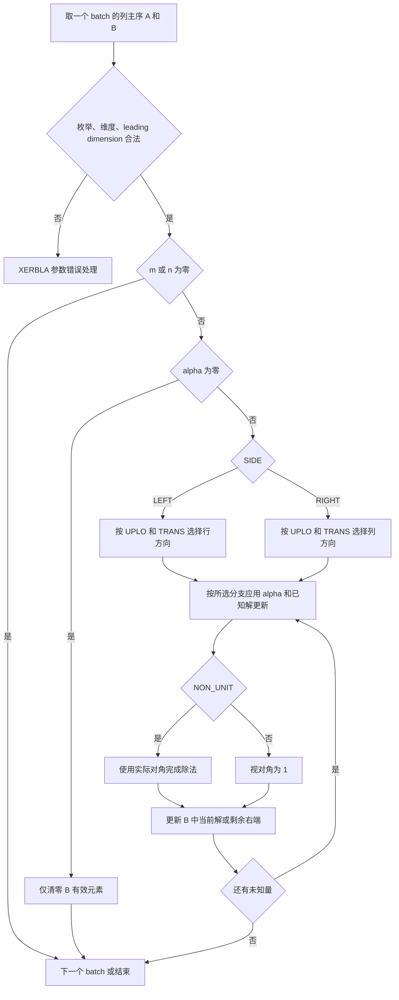
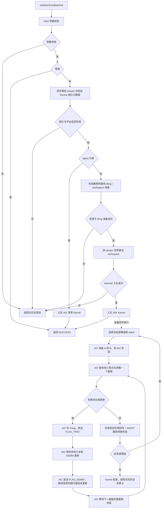

# 一、需求背景

## 1.1 需求来源

本设计对应 CANN 9 月社区任务“aclblasCtrsmBatched 算子开发（A2A3）”（任务编号 09-23），在 `cann/ops-blas` 中提供 Atlas A2/A3 系列产品的单精度复数批量三角求解能力。需求依据为该任务的任务书及配套 `test_cases/` 附件；章节采用社区任务设计文档审核 Checklist。

本版于 2026-09-24 由开发者借助 GPT-6（Codex）补写，描述已完成本地编译的实现。代码基线为 `ops-blas` 的 `fe54d86f00a4d449f55da1e8d144b898953d97c5`，实现版本为本地分支 `feat/ctrsmbatched-a2a3`、提交 `3b982f72666b2947f3e06f54cb22c4f0be64d6dc`。当前已完成 A2/A3 编译，尚未完成 NPU 精度、性能和内存验收；本文中的性能指标为验收目标。

## 1.2 背景介绍

### 1.2.1 aclblasCtrsmBatched算子实现优化

批量三角求解处理多个相互独立的三角线性系统。对每个 batch，令输入右端矩阵为 B₀，输出为 X：

- LEFT：`op(A) X = alpha B₀`，A 的阶数 K=m，独立右端数 R=n。
- RIGHT：`X op(A) = alpha B₀`，A 的阶数 K=n，独立右端数 R=m。
- `op(A)` 分别为 A、Aᵀ、Aᴴ；X 原地写入 B，A 保持只读。

本任务采用句柄式 BLAS API 和 Ascend C Kernel 直调，不经过 ACLNN/TBE 注册框架。因此没有本算子的 TBE Python 源文件、TBE 算子信息库文件或 ACLNN 两阶段接口；Checklist 中对应项不适用。实际核对的源码如下，文件路径均相对本地 `ops-blas/`：

| 用途 | 文件路径 | 使用方式 |
|---|---|---|
| 公共接口、类型和状态码 | `include/cann_ops_blas.h`、`include/cann_ops_blas_common.h` | 标准接口的唯一声明入口 |
| 基线实验 Host | `experimental/aclblasCtrsmBatched2/op_host/ctrsm_batched_host.cpp` | 分析原实验接口及 tiling；不直接沿用其 ABI |
| 基线实验 Kernel | `experimental/aclblasCtrsmBatched2/op_kernel/ctrsm_batched_kernel.cpp`、`ctrsm_batched_kernel_aiv.h`、`ctrsm_batched_kernel_aic.h` | 复用面板求解与 Cube 更新思路 |
| 正式 Host | `blas/trsmbatched/arch22/ctrsmbatched_host.cpp` | 参数校验、布局映射、切分、工作区与直调 |
| 正式 Kernel | `blas/trsmbatched/arch22/ctrsm_batched_kernel.cpp` | MIX/AIV 两类入口与模板分派 |
| 仓内测试参考 | `test/trsmbatched/`、`test/frame/blas_test.h`、`test/frame/csv_loader.h` | 沿用 GTest、CSV 与 BLAS 测试框架 |

原实验代码使用 Host 指针数组、行主序处理及不同的类型/同步约定，不能直接满足任务要求。正式实现适配 Device 指针数组、列主序、`int`/`aclblasComplex` 公共 ABI，并修复三角读取、padding、UB 容量、短尾解交织和分核同步边界。优化方向是用 AIV 求解小对角面板，用 AIC 执行剩余右端更新，利用 batch 和独立右端维度并行；实际收益待目标设备测量。

### 1.2.2 aclblasCtrsmBatched算子现状分析

#### 1.2.2.1 标杆算子支持的数据类型和数据格式

接口标杆为 [cuBLAS cublasCtrsmBatched](https://docs.nvidia.com/cuda/cublas/index.html#cublas-t-trsmbatched)，精度参考为 [Netlib CTRSM](https://www.netlib.org/blas/ctrsm.f) 的逐 batch 调用。cuBLAS 内部实现未公开，不能将 Netlib 算法或本设计的分块方法表述为 cuBLAS 内核实现。

| 项目 | 本任务采用的规格 |
|---|---|
| 元素类型 | COMPLEX64，每元素为两个 FLOAT32，实部在前、虚部在后，共 8 字节 |
| 矩阵格式 | ND、列主序；A 元素地址 `A[i] + row + col*lda`，B 同理使用 ldb |
| 批量组织 | A/B 均为 Device 指针数组，长度 batchCount；各矩阵地址可以不连续 |
| 维度 | uniform batch，共享 m/n/lda/ldb 和枚举参数 |
| 方向与三角 | LEFT/RIGHT、UPPER/LOWER |
| 变换与对角 | N/T/C、NON_UNIT/UNIT，共 24 种组合 |
| 标量位置 | 本任务只支持 Host alpha；cuBLAS 的 Device 标量模式不在适配范围 |
| 输出 | 原地覆写 B；不同 B[i] 不得重叠 |

#### 1.2.2.2 标杆算子实现描述

Netlib `ctrsm.f` 先校验枚举、维度和前导维，非法参数交由 `XERBLA` 处理；零维直接返回；alpha=0 时只将 B 有效元素置零。正常路径按 SIDE/UPLO/TRANSA 分支执行代入或回代，UNIT 分支跳过实际对角值。N 分支使用选定三角，C 分支对读取的系数取共轭；不同分支在相应阶段应用 alpha，不能将源码概括为所有分支都先整体缩放 B。

以有效矩阵 T=`op(A)` 表示，LEFT 解的下三角沿行递增、上三角沿行递减；RIGHT 解的下三角沿列递减、上三角沿列递增。每个未知量由已求出的量更新后，NON_UNIT 除以对应对角元。这里用代入求解描述数学依赖，不显式生成 A 的逆矩阵。Netlib 部分分支对零元素跳过更新；该分支行为也是特殊值对照时需要关注的差异。

精度测试在每个 batch 上调用 `cblas_ctrsm`，其接口封装和错误返回不同于本算子；本算子的状态码、指针数组检查按任务书实现。GPU 性能参考来自任务附件，不是本地对 Netlib 或 cuBLAS 的重新测量。

#### 1.2.2.3 标杆算子实现流程图

下图描述公开的 Netlib CTRSM 及外层 batch 参考循环，不推测 cuBLAS 内部并行策略。



# 二、需求分析

## 2.1 外部组件依赖

| 组件 | 当前使用方式与版本 |
|---|---|
| CANN | 9.1.0，提供 Ascend C 编译器、ACL Runtime、平台能力查询与 Matmul Tiling/API |
| Docker | 本地容器 `ctrsmbatched-reload-cann910-dev`，项目挂载 `/workspace`，仅承担当前开发编译环境 |
| ops-tensor | 仓构建依赖，固定提交 `c1326e7a7fb30536dc3517ac40e06935aba5e88d` |
| tensor_api 子模块 | 固定提交 `ad3d3bf04dddfb94370c534c39bdd305d8e38d88` |
| C++/CMake 与仓构建脚本 | 复用 ops-blas 现有工具链，不新增独立构建系统 |
| GTest、Netlib BLAS/LAPACK | 测试框架和 `cblas_ctrsm` golden；不作为 Device Kernel 运行时依赖 |
| Python 与 msprof | 验收结果审核、基线匹配与目标设备性能采集；msprof 实际 CLI/导出字段需上板确认 |

## 2.2 内部适配模块

以下源码均位于 `ops-blas/`，正式算子目录按任务书第 5 节采用 `blas/trsmbatched/arch22/`，解决第 2 节 `blas/trsm/` 与最终交付目录不一致的问题。

| 模块 | 文件 | 职责 |
|---|---|---|
| API | `include/cann_ops_blas.h` | 导出标准 aclblasCtrsmBatched |
| 句柄及工作区 | `blas/common/helper/aclblas_handle_internal.h`、`host_utils.h` | stream、工作区所有权、平台核数查询 |
| Host 与 TilingData | `blas/trsmbatched/arch22/ctrsmbatched_host.cpp`、`ctrsm_batched_tiling_data.h` | 校验、规范化参数、分核及内存计算 |
| Kernel 启动 | 同目录 `ctrsm_batched_kernel_do.h`、`ctrsm_batched_kernel.cpp` | 直调封装、按值传参、入口分派 |
| AIV 调度与配置 | `ctrsm_batched_kernel_aiv.h`、`ctrsm_batched_kernel_aiv_cfg.h` | batch/split/wave 调度、UB 分配 |
| 数据变换 | `ctrsm_batched_kernel_aiv_convert.h`、`ctrsm_batched_kernel_aiv_canon_a.h`、`ctrsm_batched_kernel_aiv_canon_b.h`、`ctrsm_batched_kernel_aiv_canon_b_deinterleave.h` | 三角裁剪、转置/共轭、padding、AoS/SoA 转换和回写 |
| 求解与矩阵更新 | `ctrsm_batched_kernel_aiv_solver.h`、`ctrsm_batched_kernel_aic.h` | 面板代入及复数 trailing update |
| 公共 Kernel 逻辑 | `ctrsm_batched_kernel_common.h`、`ctrsm_batched_mix_common.h` | 路径判断、同步标记、分组与转置辅助 |
| 测试 | `test/trsmbatched/ctrsmbatched/ctrsmbatched_param.h`、`ctrsmbatched_golden.h`，以及 `arch22/ctrsmbatched_test.cpp`、`ctrsmbatched_npu_wrapper.h`、`ctrsmbatched_test.csv` | 参数解析、输入/golden、设备调用与精度判定 |

## 2.3 需求模块设计

### 2.3.1 Ascend C算子原型

```cpp
aclblasStatus_t aclblasCtrsmBatched(
    aclblasHandle_t handle,
    aclblasSideMode_t side,
    aclblasFillMode_t uplo,
    aclblasOperation_t trans,
    aclblasDiagType_t diag,
    int m, int n,
    const aclblasComplex* alpha,
    const aclblasComplex* const A[], int lda,
    aclblasComplex* const B[], int ldb,
    int batchCount);
```

`aclblasComplex` 使用 `float real` 与 `float imag` 表示复数。无独立输出 C、ldc、广播或任意 tensor stride 参数。

### 2.3.1 Ascend C算子相关约束

`m,n>=0`，`batchCount>=1`，`lda>=max(1,K)`，`ldb>=max(1,m)`；NON_UNIT 对角须非零，本算子不检查奇异性。A 只引用指定三角，UNIT 不读取实际对角。B 的 padding 不属于输出区域，不得修改。

相对 cuBLAS，本任务只提供 COMPLEX64、Host alpha、uniform Device 指针数组入口，不适配 Device alpha、其他精度及 strided-batched 接口。相对实验代码，Host 指针数组和旧类型签名不兼容，调用方必须使用公共头文件声明。

零维在常规 Host 参数校验后返回，不检查数组中的 Device 元素。alpha=0 时 B 指针及参数仍须有效，但 A 可为 null；既不读取 A，也不读取旧 B 矩阵内容。该处理采用 BLAS 的零乘数语义并保留附件 `TC_ED_186`，作为任务书笼统“A 不得为空”条款的明确例外。

# 三、需求详细设计

## 3.1 调用方式

使用 ops-blas 句柄绑定的 stream 进行 Kernel 直调：初始化 ACL/设备，创建句柄并设置 stream；分配各批 A/B 和 Device 指针数组，上传矩阵与地址；传入 Host alpha 调用本接口；消费结果前同步 stream；最后释放设备内存与句柄。

Host 为同步返回数组元素为空的错误，先等待该 stream 的既有任务，再将指针数组元数据拷回 Host 检查。矩阵运算入队后不做最终等待，因此不能宣称此 API 全程无阻塞或已支持图捕获。Device 矩阵、指针数组及有效工作区必须存活到 stream 完成；同一句柄的工作区不能被并发调用无序复用。

库与测试沿用仓库构建目标，例如在配置 CANN 的 `ops-blas/` 目录执行 `bash build.sh --soc=ascend910b3 --ops=ctrsmbatched`。本地封装脚本保存在开发项目中，不作为本文的仓内依赖。API 的 SUCCESS 表示检查和入队路径成功，不表示异步设备计算已经成功结束。

## 3.2 需求总体设计

正常路径分为 Host 参数/指针校验、列主序解释转换、Tiling 和工作区准备、AIV 数据规范化与面板三角求解、AIC 剩余右端更新、B 原地回写。alpha=0 使用独立 AIV 清零路径，零维不启动 Kernel。

### 3.2.1 host侧设计

Host 按以下顺序处理：

1. 检查 handle、枚举、标量、前导维和顶层指针；零维返回。
2. 同步已有 stream 任务，D2H 检查 B 指针元素；alpha 非零时也检查 A 元素。
3. 查询实际 AIV/AIC 核数。alpha=0 启动清零 Kernel，不分配求解工作区。
4. 将列主序矩阵解释为转置后的行主序矩阵：`m'=n,n'=m`，`side'=opposite(side)`，`uplo'=opposite(uplo)`，`trans'=trans,diag'=diag`；lda/ldb 不变。该过程仅变换解释方式，不在 Host 搬动矩阵。
5. 对非零路径检查 `2*lda*K` 和 `2*ldb*n` 不超过 INT32_MAX，随后计算 TilingData、实际 blocks 和工作区字节数。
6. 获取句柄工作区；构造 GM/ND/FLOAT 的 Cube tiling；在 stream 上清零算法工作区，再直调 MIX Kernel。

错误映射：空句柄返回 HANDLE_IS_NULLPTR；非法参数、空指针元素及指针数组拷贝失败返回 INVALID_VALUE；Host 元数据分配、寻址范围或工作区不足返回 ALLOC_FAILED；平台核数/Cube tiling 失败返回 INTERNAL_ERROR；已检查的 stream 同步或异步 memset 失败返回 EXECUTION_FAILED。直调封装无独立 launch 返回值，异步执行错误还须通过后续 Runtime 同步观测。

#### 3.2.1.1 分核策略

为避免原始 LEFT/RIGHT 与内核路径混淆，下文 `right` 专指转换后的 `side'==RIGHT`。定义：

- K：原始 LEFT 时 m、RIGHT 时 n；R：原始 LEFT 时 n、RIGHT 时 m。
- `align8(x)=8*ceil(x/8)`，`K8=align8(K)`、`R8=align8(R)`。
- 对角面板宽 `nb=16`（K≤1024），否则 `nb=32`。
- `needTA=(trans!=N && !right) || (trans==N && right)`；C 额外取共轭。
- `useOrigA=!needTA && K==K8 && R==R8 && trans!=C && lda%4==0`。
- `dual=(K>=128 && R8>=128)`；物理 AIC 数记为 C。

默认 split 数 S=1。仅在 `useOrigA && dual && batchCount<=C/2` 时尝试：

`S=min(floor(C/batchCount), floor(R/max(nb,64)))`，候选值大于 1 才启用。

启用后，前 S−1 份有效宽度 `r0=16*floor(floor(R/S)/16)`，末份 `rlast=R-r0*(S-1)`；各份内部再对齐到 8。跨组只共享只读原始 A，不在多 split 间同时写规范化 A，从而避免缺少跨组屏障时的竞态。

| 路径 | 每个 1 AIC + 2 AIV 逻辑组负责的工作 | 逻辑组数 Q |
|---|---|---|
| S>1 | 一个 batch 的一个 RHS split，两 AIV 再分列 | batchCount*S |
| S=1 且 dual | 一个 batch，两 AIV 分列 | batchCount |
| S=1 且非 dual | 两个 batch，每个 AIV 独立负责一个 | ceil(batchCount/2) |

实际启动 AIC blocks=`min(Q,C)`，对应 MIX AIC:2 AIV。按 `q=blockIdx+j*blocks` 处理后续 wave，AIV 使用物理索引除以 2 映射到同一组。双 AIV 处理本组对齐宽 L 时，以 `h=min(L,align8(L/2))` 分成 `[0,h)` 与 `[h,L)`，输出只写有效列。普通路径的奇数末 batch 由另一 AIV 执行 dummy 同步协议，不能提前退出而使 AIC 等待不到信号。

#### 3.2.1.2 数据分块和内存优化策略

**GM 数据布局与工作区。** 外部复数为 AoS（实虚交错），规范化 A 保持 AoS，B 工作区拆成实部/虚部两个 SoA 平面。`useOrigA` 跳过 A 的整体规范化；面板加载仍遵守三角及 UNIT 读取规则。其他路径只读有效三角，补齐区域的 A 对角置 1、其余置 0，B 补齐区域置 0。

令 W 为工作区 RHS 宽度：无 split 时 W=R8，有 split 时 `W=max(align8(r0),align8(rlast))`。以下 size 以 FLOAT32 元素计，乘 4 后为字节：

```text
aSize         = 2*K8*K8
bSize         = 2*K8*W
xnegSize      = 2*16*2*nb*W*2 = 128*nb*W
rightTempSize = right ? 2*W*K8 : 0
gemmAreaSize  = max(xnegSize, rightTempSize)
splitBGemmSize(bytes) = 4*(bSize + gemmAreaSize)
workspaceOffset(bytes) = 4*aSize + S*splitBGemmSize
```

`xnegSize` 对应两组缓冲、每组最多 16 个面板以及两路复数更新打包数据。现有布局即便走 `useOrigA` 仍预留 aSize；`rightTempSize` 也保留在工作区计算中，不将未实现的空间压缩计入设计收益。

有效 batch 数 E 在 dual 或 split 路径等于 batchCount，普通路径等于 `2*ceil(batchCount/2)`。算法工作区 `gemmBytes=E*workspaceOffset`；总请求为 `gemmBytes+max(GetLibApiWorkSpaceSize(),16 MiB)`，后半段交给 Matmul API。Host 检查总大小溢出，算法区在同一 stream 上 memset 清零，系统区由库使用。

复用现有 `EnsureDefaultWorkspace`：库持有的默认工作区不足时按需扩容，当前上限 2 GiB；用户提供的工作区不足时返回 ALLOC_FAILED，不私自替换。2 GiB 是库自动管理分支的限制，不表述为用户工作区的统一硬上限。内存生命周期依附句柄和 stream。

**AIV UB 容量。** Host 决定 nb、K8、R8，实际列 tile 宽 c 由 Kernel 的 `InitBuffers()` 按显式缓冲区总量选择。该初始化发生在每个 split 调整局部宽度之前，因此以全局 R8 计算容量上界。定义：

```text
H = min(4096, align32(max(K8,R8,8)))
cmax = floor8(floor((49152 - (2*nb*nb+H) - 512)/(6*nb+1)))
c = max(8, min(R8,cmax))
q = nb*c
P = max(4096,2*q)
Z = max(1024,q)
g = min(256,q)
U = 2*nb*nb + H + P + 3*q + Z + c + 2*g
```

其中 floor8 向下对齐至 8，align32 向上对齐至 32。若 U 超过 49152，c 每次减 8 并重新计算，直至满足 `4*U<=196608 bytes`。缓冲区明细如下：

| 缓冲区 | 元素数 | 用途 |
|---|---:|---|
| bufRow | H | 行读取、零填充及分块回写临时空间 |
| bufPanelA_real / imag | 各 nb² | 对角面板实虚分量 |
| bufPanelB_real | P | B 面板交错布局及转置临时区 |
| bufPanelB_imag | q | 面板临时平面 |
| bufRankK | c | 行更新 |
| bufNeg_real / imag | 各 q | Cube 更新输入打包 |
| bufNeg_imag_neg | Z | 负号/转置辅助 |
| bufGatherEven / Odd | 各 g 个 int32 | 精确解交织偏移表 |

float/int32 均占 4 字节，分配量为 32 字节倍数。行处理按不超过 4096 float 分段；AoS 暂存行跨度至少为两倍对齐后的 SoA 跨度，避免短尾实虚部互相覆盖。显式 UB 预算是当前实现的 192 KiB；尚须结合目标工具链确认系统保留和高阶 API 隐式需求，不能仅凭容量公式认定硬件内存验收完成。AIC-only Matmul 的资源与 AIV UB 分属不同核。

alpha=0 Kernel 仅显式分配 32 字节指针暂存和 4096 字节零缓冲，共 4128 字节；每次最多写 512 个复数。AIC 的 L1/L0 分块交由 Matmul tiling/API 管理，当前没有手工固定 L1/L0 缓冲尺寸。

#### 3.2.1.3 tilingKey规划策略

该工程没有注册算子框架的数值 tilingKey。Host 按值传入 `CtrsmBatchedTilingData`，Kernel 根据有效三角方向及 `right` 选择 `CtrsmMixAivImpl<FORWARD,RIGHT>` 的四种实例：LowerLeft、LowerRight、UpperLeft、UpperRight。

| 选择条件 | 实际分派 |
|---|---|
| alpha 实虚均为 0 | `ctrsm_batched_zero_kernel` |
| alpha 非零 | `ctrsm_batched_mix12_kernel` |
| 有效规范化 A 为下三角/上三角 | FORWARD=true/false |
| side' 为 RIGHT/LEFT | RIGHT=true/false |
| useOrigA、dualAivMode、numSplits、nb | TilingData 运行时字段控制搬运、分核及面板大小 |

TilingData 包含 m'/n'、lda/ldb、batchCount、枚举、alpha 实虚部、nb、A 有效步长、工作区偏移及 split 参数。尺寸/策略字段为 int32，工作区偏移为 int64。Cube tiling 通过 `uint32_t words[512]` POD 按值跨 Host/Device 传递，Host 保存 tiling 后，Kernel 检查容量并重建 `TCubeTiling`，不跨 ABI 传递 Host C++ 封装对象。Cube tiling 的初始最大维度为 `max(2*K8,W)`，具体更新时设置实际子块形状。

### 3.2.2 kernel侧设计

#### 3.2.2.1 kernel侧实现描述

**清零路径。** 以 `(batch,column)` 为任务，总数 batchCount*n，按 AIV 核号步进分配。Kernel 从 Device B 数组读取地址，仅清零原始列主序每列前 m 个复数，保留 ldb−m 个 padding；不读取 A 或原 B 数据。

**正常路径的数据准备。** MIX Kernel 使用 `KERNEL_TYPE_MIX_AIC_1_2`。AIV 根据本组 batch/split 取得 Device 地址，裁剪有效三角并按需要转置/共轭；UNIT 对角在 UB 合成 1。`useOrigA` 直接引用原 A，其余路径产生规范化 A。B 转为规范化求解所需的 SoA 工作区并乘 alpha；RIGHT 内核路径还进行与右侧求解对应的转置。精确计数 Gather 处理实虚分离，DataCopyPad 处理非整块尾部，避免读取相邻行作为有效数据。

**面板求解。** 规范化后统一对三角系数执行按面板前代/回代。每个面板最多 nb 行，末面板取实际剩余宽度；面板内由 AIV 按行更新右端、计算对角除法，并写出解和 Cube 更新输入。UNIT 完全跳过对角读取及除法。NON_UNIT 的复数倒数按较大分量构造比例：

```text
若 abs(ar)>=abs(ai)：r=ai/ar，invR=(1/ar)/(1+r*r)，invI=-r*invR
否则：              r=ar/ai，invI=-(1/ai)/(1+r*r)，invR=-r*invI
```

随后将当前复数右端乘以 invR+i·invI。该公式避免直接形成 `ar²+ai²` 的平方溢出，但不保证所有极端值安全；倒数不可表示而最终商可表示、subnormal 及 Inf/NaN 传播仍须实测，不作为已解决的精度问题。

**Cube 剩余右端更新。** 已解面板记为 Xp，对应剩余三角块为 Ap，执行 `Bt←Bt−Ap*Xp`。将复数乘法写成：

```text
Bt.real -= Ap.real*Xp.real - Ap.imag*Xp.imag
Bt.imag -= Ap.real*Xp.imag + Ap.imag*Xp.real
```

A 的实虚列交错，第一路 Xneg 打包为 `(-Xp.real,+Xp.imag)`，第二路打包为 `(-Xp.imag,-Xp.real)`，用两次 FLOAT32 实数 GEMM 分别累加到 B 的实、虚平面，GEMM 的归约长度为两倍面板宽。输入、输出均为 GM/ND/FLOAT，不通过 FP16 转换压缩精度。

面板数不超过 2 时采用 simple 调度；其余以最多 16 个面板为一组。普通双 batch 路径完成组内相关右端更新后通知 AIV；dual 路径优先更新下一面板并通知 AIV，再处理组内其余行。组末以 BigGroupGemm 更新远端剩余区域，Xneg 按组双缓冲，反向求解时按物理面板顺序重排槽位。源码中 `doSplit=false`，当前未启用每两个面板提交一次远端 FarGemm 的实验路径。

**同步与回写。** AIV 在面板数据 MTE3 搬出后发送 FLAG_TRSV；AIC 经 FIX 等待并消费。AIC 在相应 GEMM 完成后发送 FLAG_GEMM；AIV 经 MTE2 等待后读取更新结果。双 AIV 通过 FLAG_DUAL_AIV 约束共享工作区准备，核内使用相应流水事件与 barrier 保证 DMA/向量读写依赖。普通奇数 batch 保留 dummy 信号，分组及 wave 切换须保持双方循环一致。

转换后的 LEFT 路径逐面板回写 B；RIGHT 路径完成求解后转换回目标布局。所有路径只回写有效 m×n 元素，不改 A、B padding 或其他 batch。同步静态审计仍保留 5 项红线、2 项高级别候选，候选涉及 Matmul 与 CrossCore flag 共用、跨迭代 Set/Wait 配对及 UB 数据依赖；已完成源码和 SDK 复核，原始审计记录保存在开发项目中，仍需硬件覆盖后关闭。

#### 3.2.2.2 Ascend C实现流程图



图中的等待节点表示面板数据依赖，组末远端更新、下一面板求解和按面板回写的重叠关系按 3.2.2.1 的调度执行；不表示所有 AIC/AIV 操作完全串行。

#### 3.2.2.3 Ascend C实现流程图与标杆算子流程图存在的差异点和原因

| 差异 | 原因及影响 |
|---|---|
| 标杆逐 batch 的单矩阵 CTRSM；本实现 batch/RHS 分组并行 | batch 和独立右端没有相互数据依赖，可分配多个 MIX 组 |
| 列主序接口转换为行主序解释，再规范化为统一三角求解 | 复用实验混合核结构；side/uplo 互换及 T/C 区分必须同时正确 |
| 标杆标量/向量更新；本实现面板 AIV 求解加 Cube GEMM | 将大部分剩余右端更新转成矩阵乘，减少串行代入的比例 |
| alpha 缩放及浮点累加顺序不同 | 数学等价但不要求逐位一致，按固定混合容差验收 |
| 部分 Netlib 分支跳过零更新；本实现批量矩阵计算 | 极端非有限值可能出现不同传播，必须单独核对，不以常规有限输入通过替代 |
| 本实现显式规范化、padding 和工作区 | 适配 DMA、向量与 Cube 对齐；单位补齐对角避免无效 0/0 污染 |
| Host 检查 Device 指针元素并同步既有 stream | 满足任务书即时错误返回要求，带来额外 Host 延迟和图捕获限制 |
| alpha=0 独立 AIV Kernel | 确保无需读取 A/旧 B，且保留列主序 padding |
| 自定义跨核同步及双缓冲 | 支持 AIC/AIV 协作；相应协议尚需真实设备验证 |

## 3.3 支持硬件

目标为任务书要求的 Atlas A2/A3 系列产品（含 Atlas 800I A2/A3），实现目录为 arch22。性能强制对标设备为 Atlas 800T A2（910B3）。

当前 CANN 9.1.0 下已完成 `ascend910b3`（A2）和 `ascend910_9391`（A3）库及测试程序编译；这是编译支持证据，不是硬件运行通过证明。任务书第 3.1 节与第 7.4 节对验收机型数量表述不一致，最终采用更严格的 A2、A3 均完成硬件自验要求。

## 3.4 算子约束限制

- 仅支持上述 COMPLEX64 和 24 组枚举组合，alpha 为 Host 地址；不提供其他 dtype、广播、行主序公开入口或不同 batch 不同形状。
- A/B 指针数组和矩阵必须是当前设备上的有效存储；Host 可检查空指针和数组复制结果，不能据此证明每个非空地址的分配长度、生命周期及不重叠性。
- 各 B[i] 必须独立，A 与被覆写 B 不能形成未定义别名；输入长度及 lda/ldb 存储由调用方保证。
- 零维仍要求 batchCount、枚举、alpha、顶层指针及 leading dimension 满足校验；此时不检查设备指针元素。batchCount=0 返回 INVALID_VALUE。
- NON_UNIT 不检测奇异性，不对病态系统提供误差保证；NaN/Inf 和极端有限值按精度测试规则验收。
- 正常求解路径的矩阵 FLOAT32 偏移须满足 Host 的 INT32_MAX 检查，并受实际 workspace/设备内存限制；超出实现容量不属于已支持的大尺寸泛化结论。
- 自动管理 workspace 当前最多 2 GiB，申请失败返回状态码；用户 workspace 容量须覆盖当前请求。
- solve 入队后异步执行，但指针元数据检查包含前置同步；不承诺图捕获、并发复用同一句柄或完全异步 Host 返回。
- 目前硬件精度、性能、同步和内存结果均待验证，不能将编译成功表述为任务完整验收。

# 四、特性交叉分析

| 交叉特性 | 设计处理 | 验证重点 |
|---|---|---|
| SIDE × UPLO × N/T/C × DIAG | 先进行列主序映射，再决定规范化三角和求解方向 | 全部 24 组合；复数 C 必须区别于 T |
| UNIT/未引用三角 × 特殊值 | 有效三角裁剪，UNIT 对角合成；不读取被忽略区域 | 对角及另一三角填 NaN/Inf poison 后输出仍正确 |
| alpha=0 × null A/NaN B | 独立清零，仅要求 B 有效 | 有效区全零，padding 和 guard 不变 |
| 非对齐 × 转置 × RIGHT 矩形 | 分块转置、精确 Gather、完整 padded 平面初始化 | 极短尾、R>K/R<K、不同 lda/ldb 与 padding |
| batch × 双 AIV × wave | 相同逻辑组映射，奇数 batch 保留 dummy 协议 | 奇数 batch、batch 超过物理核数、多 wave |
| split × A 规范化 | 仅 useOrigA 开启 split，跨组共享只读 A | split 末段、输出不重叠、各组 flag 配对 |
| 面板分组 × 回代 | 最多 16 面板/组，按物理面板顺序安排 Xneg 双缓冲 | 组边界、最后不满组、反向槽位及远端更新 |
| stream × workspace | 元数据校验前同步，初始化和求解在同 stream，句柄持有内存 | 前序任务、连续调用、工作区扩容/不足及生命周期 |
| 极端值 × 复数倒数/Cube 累加 | 比例倒数、全 FLOAT32 路径、固定精度门限 | 分母极小、倒数溢出、非有限分类与误差 |
| 原地 B × Profiler | 每次真实 API 调用前恢复原始 B | 禁止依赖无法插入恢复步骤的 Kernel 自动 replay |

当前不涉及自动微分、随机算子状态、GE 图融合或 PyTorch 框架适配。不同句柄/stream 的并行能力仍受各自工作区和调用方数据依赖约束。

# 五、可维可测分析

## 5.1 精度标准/性能标准

**精度与输入。** 采用逐 batch、列主序 Netlib `cblas_ctrsm` 作为 golden。固定 `atol=rtol=2^-13`，逐元素条件为 `abs(actual-golden)<=atol+rtol*abs(golden)`，整体同时要求 matched ratio≥0.99、最大绝对误差≤0.01。任务书允许的另一种 ULP 门限未作为失败后的自动放宽选项。

测试同时检查实部、虚部及有限复数模长误差，三种口径均须通过；NaN 对 NaN、Inf 对同符号 Inf，特殊值分类不符直接失败，不占用 1% 的误差余量。UNIT 大随机三角系统可能病态或溢出，保留原输入规则和非有限统计，不通过缩小非对角值规避困难用例。

普通 A/B 输入的每个实虚随机流按 50% U(-5,5)、50% N(0,1) 生成，实虚独立；NON_UNIT 对角实虚部分别增加符号保持的 `max(5,K)` 偏移。CSV alpha 保持原值，另有随机 alpha 的均匀/正态补充覆盖。所有成功非空用例检查 A 全存储未修改、B padding 和尾部 16 个复数哨兵未修改。

原始附件包含 1000 条精度及 200 条性能用例，原文件保持不动。仓内 CSV 保留全部 1200 个 ID，仅修正以下任务冲突，修正记录位于实现仓的 `test/trsmbatched/ctrsmbatched/README.md`：

| ID | 执行口径 |
|---|---|
| TC_ED_180、TC_ED_182 | 零维用例的 lda/ldb 从 0 改为合法最小值 1 |
| TC_ED_184 | batchCount=0 从 SUCCESS 改为 INVALID_VALUE |
| TC_ED_193、TC_ED_194 | 旧 C 数组/元素 null 分别映射到 B 数组/元素 null |
| TC_ED_202 | 旧 invalid_ldc 映射为 invalid_ldb，保留非法前导维覆盖 |

另注册 3 项 NPU 补充测试（24 组合 poison、alpha=0 特殊值/null A、随机 alpha）及 3 项 CPU 测试，合计 1206 项 GTest。注册数量不代表执行通过数量。

**性能。** 目标设备为 Atlas 800T A2（910B3）。任务书已折算的平均单次耗时门限如下，单位均为 μs，不再除以 0.8：

| batchCount | m | n | side | uplo | trans | diag | 门限（μs） |
|---:|---:|---:|---|---|---|---|---:|
| 64 | 256 | 256 | LEFT | LOWER | N | NON_UNIT | 895.1 |
| 128 | 384 | 512 | LEFT | UPPER | C | NON_UNIT | 5551 |
| 32 | 1024 | 1024 | RIGHT | LOWER | T | UNIT | 13884 |
| 8 | 2048 | 2048 | LEFT | UPPER | N | NON_UNIT | 21816 |
| 2 | 4096 | 4096 | RIGHT | UPPER | C | UNIT | 40969 |

附件 `gpu_baseline.csv` 的 200 条 GPU 参考值均有效。其原始单位为 ms，转换门限为 `gpu_ms*1000/0.8` μs；逐 ID 保留重复参数用例，不按 198 个唯一参数组合去重。典型项还须单独检查上表门限，同时存在两类门限时按更严格值判定。GPU 设备、完整输入、alpha/lda/ldb、随机种子和计时环境未完整提供，现有映射依靠双方共有的 7 个参数及来源行序；“200 条匹配”不代表已确认同输入、同计时口径可比，报告必须披露此限制。

每个性能 case 预分配内存，执行 5 次 warmup 和 11 次有效调用，满足任务书更严格的“有效采样 >10 次”。每次调用前恢复原始 B，避免再次求解前一次输出；调用后同步，最终回读并检查精度。使用应用级 msprof 观察 16 次真实调用，逐次关联 Kernel 明细，多 Kernel 按一次 API 调用求和后，对最后 11 次取平均。排除输入恢复拷贝、分配、Host 校验和 golden，不使用 GTest 墙钟时间替代 Kernel 耗时。实际采集命令、字段与 Runtime 初始化/memset 记录的归属须上板核对，不使用缺少 B 恢复步骤的自动 replay。

结果须覆盖全部 200 条，列出实测值、来源基线、门限、耗时比和逐项结论；漏测、重复、失败、匹配错误分别报告，不能标成 NO_REF。检查相近尺寸突变、最慢项、非对齐和回退路径，发现性能短板后定位并重跑受影响范围。操作脚本与测试口径记录保存在开发项目中，最终验收时随逐例结果及原始采集证据一并提供。

**内存与可维护性。** 任务书没有单独的内存门限，但交付需提供内存数据。分别记录测试显式分配、算子 workspace、Runtime/分配器开销及设备峰值，不能将测试分配总字节当作设备峰值；同时检查 padding、guard、越界和释放时机。源码、实际加载共享库、测试程序、原始日志及最终报告须对应同一提交并保留校验值。

当前本地阶段验证记录显示：A2/A3 编译通过，22 项 Host 返回值检查、3 项 CPU golden/比较器检查、18 项工具回归通过。最小设备探测失败于 `aclInit=500000/runtime=107002`，因此尚无 NPU 精度、性能或内存通过结论。后续硬件验收需先覆盖小矩阵 24 组合、poison、尾部、矩形、奇数 batch/split/wave，再完成 1000+3 项精度及 200 项性能，并分别形成 A2/A3 记录；同步审计候选在取得硬件证据前保持未关闭。

## 5.2 兼容性分析

公共接口遵循任务书的 `int`、`aclblasComplex`、Device 指针数组、列主序和 B 原地语义，接入仓库共享库及现有句柄机制。旧实验接口和附件的独立 C 输出调用方式不作为兼容 API；调用方应依据 `include/cann_ops_blas.h` 重新编译。

当前版本与 CANN 9.1.0、arch22 编译链对应。A2/A3 共用源码，平台核数运行时查询，不写死 910B3 核数；不同产品仍须使用正确 SoC 构建并在各自设备验收。Cube tiling 的 POD 容量、Matmul 内部同步、UB 保留及 Runtime 行为可能随工具链改变，升级后必须重新编译并验证相关边界，不能仅凭公共签名相同认定二进制兼容。

不提供 ACLNN、GE 注册或 PyTorch 适配层，不宣称图捕获兼容。文档、测试接口和实现已统一到任务书原地语义；附件修正、Host 同步限制、极端浮点与尚未完成的硬件验证均保留为后续评审和验收依据。
