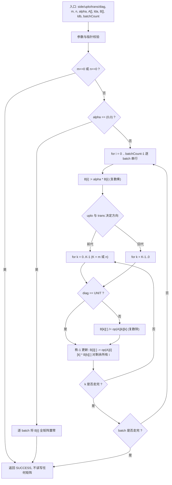
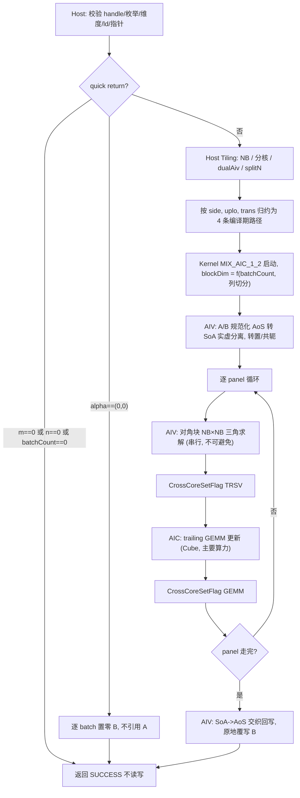
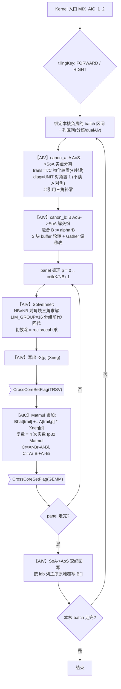
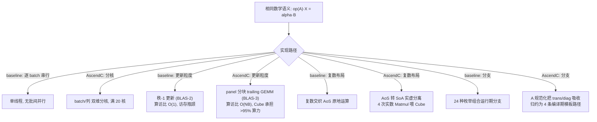

# aclblasCtrsmBatched（Atlas A2/A3）算子设计文档

> 任务：9 月社区任务 `09-23-aclblasCtrsmBatched-A2A3`
> 目标硬件：Atlas A2 训练/推理系列（`ascend910b*`，arch22）、Atlas A3 系列（`ascend910_93`，arch22）
> 目标仓库：`gitcode.com/cann/ops-blas`，实现目录 `blas/trsmbatched/arch22/`，测试目录 `test/trsmbatched/ctrsmbatched/arch22/`

---

## 一、需求背景

### 1.1 需求来源

通过 CANN 社区任务完成开源仓算子贡献：在 ops-blas 开源仓补齐**单精度复数批量三角求解** `aclblasCtrsmBatched`，对齐 cuBLAS `cublasCtrsmBatched` 的接口与语义，覆盖 Atlas A2/A3 系列产品。

当前 ops-blas 仓 `blas/trsmbatched/` 仅有 `arch35`（Ascend 950PR/950DT）上的**实数** `aclblasStrsmBatched`，其 README 明确标注 "Atlas A3 训练/推理系列产品：不支持；Atlas A2 训练/推理系列产品：不支持"。本任务补齐 A2/A3 侧，并把数据类型从 FLOAT32 扩展到 COMPLEX64。

### 1.2 背景介绍

#### 1.2.1 参考实现路径

本算子属于 **BLAS 库类算子（handle 直调）**，在 CANN 的 TBE 算子信息库中不存在对应的 aicore TBE 实现（`/usr/local/Ascend/cann/opp/built-in/op_impl/ai_core/tbe/impl/dynamic/` 下无 trsm/triangular-solve 条目）。按 CheckList「没有 TBE 源码时以 baseline 参考实现代替」的口径，本文 1.2.2.3 的 baseline 流程图取**验收 golden 所用的 Netlib BLAS `ctrsm` 逐 batch 回代管线**。

参考实现清单：

| 类别 | 路径 / 出处 | 用途 |
|---|---|---|
| 语义与参数基线 | cuBLAS `cublasCtrsmBatched` | 接口签名、参数顺序、边界与负向行为对齐 |
| 精度 golden | Netlib BLAS `ctrsm.f`（openblas-devel 提供 `cblas_ctrsm`） | 逐 batch 单标杆比对 |
| 仓内同族实现 | `blas/trsmbatched/arch35/strsmbatched_{host,kernel}.cpp` | 实数批量 trsm 的 host/tiling/kernel 组织方式 |
| 仓内同族实现 | `blas/trsm/arch35/strsm_blocked_kernel.cpp` | 分块（blocked）trsm 的 panel 划分与 GEMM 更新 |
| 仓内 arch22 复数参考 | `blas/hemm/arch22/chemm_{host,kernel}.cpp`、`blas/herk/arch22/cherk_kernel.cpp` | A2 上 COMPLEX64 的实虚分解与 Cube 使用方式 |
| 仓内既有原型 | `experimental/aclblasCtrsmBatched2/`（npu-arch `dav-2201`） | A2 上的 MIX(AIC+AIV) 复数 trsm 原型与其 320 case 性能报告 |
| 公共声明 | `include/cann_ops_blas.h` | `aclblasCtrsmBatched` 接口声明位置 |

#### 1.2.2 现状分析

##### 1.2.2.1 baseline 支持的数据类型和数据格式

| 项 | baseline（Netlib `ctrsm` / cuBLAS `cublasCtrsmBatched`） |
|---|---|
| 数据类型 | COMPLEX64（单精度复数，实虚各 FLOAT32） |
| 数据排布 | Column-Major，A[i] 前导维 lda、B[i] 前导维 ldb |
| 组织方式 | Device 侧指针数组 + batchCount，uniform batch（各 batch 共享 m/n/lda/ldb 与 side/uplo/trans/diag） |
| A[i] 形状 | side=LEFT: m×m；side=RIGHT: n×n；仅 uplo 指定三角被引用 |
| B[i] 形状 | m×n，输入右端项、输出解 X[i]（**原地覆写**） |
| 标量 alpha | COMPLEX64，Host 内存（较 cuBLAS 收紧，不支持 Device 指针） |

##### 1.2.2.2 baseline 实现描述

Netlib `ctrsm` 对每个 batch 独立执行，以 `side=LEFT, uplo=LOWER, trans=N, diag=NON_UNIT` 为例（前代 / forward substitution）：

1. **quick return**：`m==0 || n==0` 直接返回；`alpha==(0,0)` 时不引用 A，将 B 逐元素置零后返回。
2. **缩放**：`B := alpha * B`（复数乘）。
3. **逐列前代**：对 B 的每一列 `j`，按行 `k = 0..m-1` 顺序
   - `diag==NON_UNIT` 时 `B[k][j] /= A[k][k]`（复数除）；`diag==UNIT` 时跳过（对角视为 1，且**不读取** A 的对角位置）；
   - 用已解出的 `B[k][j]` 更新下方所有行：`B[i][j] -= A[i][k] * B[k][j]`，`i = k+1..m-1`。
4. `uplo=UPPER` 时改为从 `k = m-1` 向 0 的**回代**（backward substitution）。
5. `trans=T/C` 时把 `A` 换成 `Aᵀ`/`Aᴴ`，等价于在原存储上按转置（并对 C 取共轭）访问，同时**前代/回代方向翻转**。
6. `side=RIGHT` 时 `X * op(A) = alpha * B`，改为按 B 的**行**方向求解，A 的阶数为 n。

关键点：每一步 `k` 依赖 `k-1` 步的结果 → **沿三角方向存在严格串行依赖**，这是 trsm 与 gemm 的本质差异，也是本算子性能设计的核心矛盾。

##### 1.2.2.3 baseline 实现流程图 ⭐



baseline 的两个性能特征：**(a)** 逐 batch 串行、无批间并行；**(b)** 内层是**秩-1 更新**（BLAS-2 级），访存密集、算访比仅 O(1)。这两点正是 NPU 实现要改写的地方。

---

## 二、需求分析

### 2.1 外部组件依赖

| 依赖 | 版本 / 说明 |
|---|---|
| CANN Toolkit | 9.1.0（编译与运行）；实测开发环境 9.0.0 亦可编译运行，验收环境以 9.1.0 为准 |
| Ascend C / asc-devkit | 随 CANN 提供；本算子不使用 `asc-devkit >= 9.1` 才有的 Tensor API，因此不进入 `TENSOR_API_OPS` 的版本闸门 |
| OpenBLAS / Netlib BLAS | `openblas-devel`、`lapack-devel`，提供 `cblas_ctrsm` 作为精度 golden |
| GTest | 随 ops-blas test 框架（`test/frame`） |

### 2.2 内部适配模块

| 模块 | 说明 |
|---|---|
| `include/cann_ops_blas.h` | 新增 `aclblasCtrsmBatched` 声明，供各产品线共用 |
| `include/cann_ops_blas_common.h` | 复用 `aclblasStatus_t`、`aclblasSideMode_t`、`aclblasFillMode_t`、`aclblasOperation_t`、`aclblasDiagType_t`、`aclblasComplex` |
| `blas/common/` | 复用 handle / stream / workspace 管理 |
| `blas/CMakeLists.txt` | 通过既有的 `SOC_ARCH_DIRS` 机制自动收集 `blas/trsmbatched/arch22/*.cpp`，无需改动构建脚本 |
| `test/frame` | 复用 CSV 驱动的 GTest 用例加载框架 |

### 2.3 需求模块设计

#### 2.3.1 AscendC 算子原型

与任务书 §2.3 完全一致：

```cpp
aclblasStatus_t aclblasCtrsmBatched(
    aclblasHandle_t handle,
    aclblasSideMode_t side,
    aclblasFillMode_t uplo,
    aclblasOperation_t trans,
    aclblasDiagType_t diag,
    int m,
    int n,
    const aclblasComplex* alpha,
    const aclblasComplex* const A[],
    int lda,
    aclblasComplex* const B[],
    int ldb,
    int batchCount);
```

参数语义、值域、异常行为逐项对齐任务书 §2.4（此处不重复表格）。要点：

- `alpha` 为 **Host 指针**（较 cuBLAS 收紧，不支持 Device 指针），为 `nullptr` 返回 `ACLBLAS_STATUS_INVALID_VALUE`；
- `A`、`B` 为 **Device 侧指针数组**，数组本身及其中任一元素为 `nullptr` 返回 `ACLBLAS_STATUS_INVALID_VALUE`；
- `handle` 为 `nullptr` 返回 `ACLBLAS_STATUS_HANDLE_IS_NULLPTR`；
- 解 **原地覆写 B[i]**，不引入独立输出数组。

#### 2.3.2 AscendC 算子相关约束（与 baseline 的差异）

| 项 | cuBLAS / Netlib baseline | 本实现 | 说明 |
|---|---|---|---|
| alpha 内存位置 | Host 或 Device 指针 | **仅 Host** | 任务书 §2.4 明确收紧 |
| 奇异性检测 | 不检测 | 不检测 | 与 baseline 一致；`diag=NON_UNIT` 时由调用方保证对角非零 |
| 确定性计算 | 不保证 | 不保证 | 任务书 §2.5「不要求」；分块+并行会改变浮点累加顺序 |
| 非连续 Tensor | 仅 lda/ldb 语义 | 仅 lda/ldb 语义 | 不支持超出前导维语义的任意 view |
| broadcast | 不涉及 | 不涉及 | 各 batch 独立矩阵 |
| batch 组织 | uniform batch | uniform batch | 各 batch 共享 m/n/lda/ldb 与枚举标志 |

**两处与任务书正文的口径澄清**（已按随任务提供的验收 CSV 为准实现，并在此显式说明）：

1. **`batchCount == 0`**：任务书 §2.4 表格写「batchCount ≥ 1，batchCount < 1 时返回 INVALID_VALUE」，但验收用例 `TC_ED_184 (batch0_noop)` 的 `expect_result` 为 `ACLBLAS_STATUS_SUCCESS`，且 `test_cases/README.md` 明确「batchCount=0 为合法 no-op（返回成功，不执行计算），batchCount < 0 返回 INVALID_VALUE」。本实现按**验收 CSV 口径**：`batchCount == 0` → SUCCESS no-op；`batchCount < 0` → `ACLBLAS_STATUS_INVALID_VALUE`。
2. **`alpha == (0,0)` 时不校验 A**：验收用例 `TC_ED_186 (alpha0_nullA)` 以 `a=NULLPTR` 且 `alpha=(0,0)` 期望 SUCCESS，而 `TC_ED_189 (null_A)` 以 `alpha=(1,0)` 期望 INVALID_VALUE。因此**参数校验顺序**必须是：先判 `alpha` 是否为零，零则跳过 A 指针数组的校验与读取，直接走 B 置零路径。

---

## 三、需求详细设计

### 3.1 使能方式

本算子为 **ops-blas handle 式 BLAS 接口（kernel 直调）**，不走 aclnn 两段式。调用链：

```
用户 -> aclblasCreate(&handle) -> aclblasSetStream(handle, stream)
     -> aclblasCtrsmBatched(handle, side, uplo, trans, diag, m, n, alpha, A, lda, B, ldb, batchCount)
     -> aclrtSynchronizeStream(stream) -> 读回 B（此时已是解 X）
```

Host 侧完成校验与 tiling 后，通过 handle 携带的 stream 直调 NPU kernel；异步语义依赖 `aclblasSetStream`，读回 Device 结果前须同步 stream。

### 3.2 需求总体设计

总体思路：**把 baseline 的 BLAS-2 秩-1 更新改写为 BLAS-3 分块更新**，把绝大部分计算量搬到 Cube 单元上，只把无法避免的串行部分（NB×NB 对角块求解）留在 Vector 单元。



#### 3.2.1 host 侧设计

##### 3.2.1.1 分核策略

A2/A3 单 die 为 **20 个 AI Core（MIX 模式下 1 AIC + 2 AIV 为一组）**。本算子的并行维度有三层，按优先级使用：

1. **batch 维（首选）**：各 batch 完全独立，无任何依赖。`blockDim = min(batchCount, coreNum)`，每核处理 `ceil(batchCount / blockDim)` 个 batch。这是最干净的并行，`batchCount ≥ coreNum` 时直接满核。
2. **列维（batch 不足时）**：当 `batchCount < coreNum / 2` 时，对同一 batch 的 B 矩阵按**列**（side=LEFT）或按**行**（side=RIGHT）切分到多核。三角求解沿 k 方向串行，但不同列之间完全独立，因此列切分不破坏依赖。切分闸门 `minSplitNCols = 64`，避免切得过碎导致每核工作量低于启动开销。
   - 每核列数：`nColsPerCore = ceil(alignUp(n, 8) / nSplit)`，`nSplit = min(coreNum / batchCount, ceil(n / minSplitNCols))`。
3. **双 AIV 分列**：MIX 模式下 1 个 AIC 配 2 个 AIV。若只用 1 个 AIV，另一个空转。当 `K ≥ 128 且 alignUp(n,8) ≥ 128` 时启用 dualAiv，两个 AIV 各负责一半列的 panel 求解与回写，AIC 仍统一做 trailing GEMM。

分核公式汇总（`K` 为三角阶数：LEFT 时 `K=m`，RIGHT 时 `K=n`）：

```
coreNum      = 20                                  // A2/A3 单 die AI Core 数，运行时由 platform info 获取
nSplit       = (batchCount * 2 <= coreNum)
               ? min(coreNum / max(batchCount,1), ceil(nWork / 64)) : 1
blockDim     = min(batchCount * nSplit, coreNum)
dualAivMode  = (K >= 128) && (alignUp(nWork, 8) >= 128)
```

其中 `nWork = n`（LEFT）或 `m`（RIGHT）。

##### 3.2.1.2 数据分块和内存优化策略

**（a）panel 分块 NB 的选择。** 分块 trsm 把 K×K 三角矩阵切成 `⌈K/NB⌉` 个 panel。NB 越大，串行的对角块求解越贵（O(NB²) 每列，且在 Vector 上跑）；NB 越小，panel 数越多，AIC/AIV 同步次数越多。实测取：

```
NB = (K <= 1024) ? 16 : 32
```

**（b）UB 预算（A2 单 AIV UB = 192 KB）。** COMPLEX64 在 UB 中按**实虚分离（SoA）** 存放，便于直接喂给 Cube 做实数矩阵乘。单个 AIV 的 UB 占用：

| buffer | 尺寸（元素） | 字节（fp32） | 说明 |
|---|---|---|---|
| panel A 实部 | `NB * K` | `4·NB·K` | 当前 panel 的 A 列块 |
| panel A 虚部 | `NB * K` | `4·NB·K` | |
| 对角块逆 `Ainv` 实/虚 | `2 * NB * NB` | `8·NB²` | 对角块求解中间量 |
| B tile 实/虚 | `2 * NB * tileCols` | `8·NB·tileCols` | 当前列块 |
| AoS↔SoA 转换 3 块轮转 | `3 * 2 * NB * tileCols` | `24·NB·tileCols` | 解交织流水 |
| Gather 偏移表 | `tileCols` | `4·tileCols` | 非对齐解交织 |

取 `NB=32, K=4096`：`4·32·4096·2 = 1.05 MB` — **超 UB**。因此 panel A 不整列驻留 UB，而是按 `K` 方向再切成 `panelChunk` 分段搬运（每段 `≤ 256` 行），driving 公式：

```
tileCols   = floor((UB_BYTES - FIXED_BYTES) / (32 * NB))      // 32 = 8 个 fp32 平面 * 4B
panelChunk = min(K, floor((UB_BYTES / 4 - 8*NB*tileCols) / (8*NB)))
```

实测大矩阵下 `tileCols` 落在 **240~280 列**，UB 占用 ≈ 180 KB（< 192 KB）。

**（c）AoS ↔ SoA 转换。** Device 上 COMPLEX64 是交织存放的 `(re,im,re,im,...)`（AoS）。Cube 只能做实数矩阵乘，必须拆成独立的实部平面与虚部平面（SoA）。转换用 **3 块 buffer 轮转** 流水（搬入 / 转换 / 搬出重叠），非对齐尺寸用 **Gather 偏移表** 解交织，`padOn=false` 时跳过 Duplicate 预清零以省掉 PipeBarrier。转换代价 O(K·n)，相对计算量 O(K²·n) 可忽略（K ≥ 64 时占比 < 2%）。

**（d）复数矩阵乘的实数化。** `C = A·B`，`A = Ar + i·Ai`，`B = Br + i·Bi`：

```
Cr = Ar·Br - Ai·Bi
Ci = Ar·Bi + Ai·Br
```

即 **4 次实数矩阵乘**。等价地可把它组织成一次 2 倍规模的实数矩阵乘：

```
[Cr]   [ Ar  -Ai ] [Br]
[Ci] = [ Ai   Ar ] [Bi]
```

本设计采用 **4 次独立实数 Matmul + Vector 侧融合**，不采用 3 乘 Karatsuba：Karatsuba 省 25% Cube 时间，但引入额外的 Vector 加减与一次中间量落盘，且 `(Ar+Ai)·(Br+Bi)` 会放大取消误差 —— trsm 沿回代方向本就有误差累积，不值得用精度换这 25%。

##### 3.2.1.3 tilingKey 规划策略

本算子在 **host 侧把 24 种枚举组合归约为 4 条编译期路径**，避免 kernel 内出现运行期分支：

| 归约步骤 | 做法 |
|---|---|
| `trans = T/C` | 在 A 规范化阶段（`canon_a`）显式转置（C 再取共轭），转置后 `uplo` 翻转（Lᵀ 为 U）。归约后 kernel 只见 `trans = N` |
| `diag = UNIT` | 规范化时把对角写成 1（**不读取** A 的对角位置，满足任务书要求）。归约后 kernel 只见 `NON_UNIT` |
| `uplo` | 映射为 `FORWARD`（LOWER，前代）/ `!FORWARD`（UPPER，回代）模板参数 |
| `side` | 映射为 `RIGHT` 模板参数 |

最终 tilingKey 由 `(FORWARD, RIGHT)` 两个 bool 构成 4 个值：

| tilingKey | FORWARD | RIGHT | kernel 模板实例 |
|---|---|---|---|
| 0 | true | false | `CtrsmLowerLeft` |
| 1 | false | false | `CtrsmUpperLeft` |
| 2 | true | true | `CtrsmLowerRight` |
| 3 | false | true | `CtrsmUpperRight` |

`dualAivMode` / `nSplit` 等不进 tilingKey，作为 tiling data 字段在运行期读取（它们只影响循环边界，不影响代码路径）。

TilingData 结构：

```cpp
struct CtrsmBatchedTilingData {
    uint32_t m, n, lda, ldb;        // 原始维度与前导维
    uint32_t batchCount;            // batch 数
    uint32_t kDim;                  // 三角阶数：LEFT->m, RIGHT->n
    uint32_t nWork;                 // 非三角维：LEFT->n, RIGHT->m
    uint32_t nb;                    // panel 分块大小 16/32
    uint32_t tileCols;              // 单次列 tile 宽度
    uint32_t panelChunk;            // panel A 的 K 方向分段
    uint32_t batchPerCore;          // 每核 batch 数
    uint32_t nSplit, nColsPerCore;  // 列切分
    uint32_t dualAivMode;           // 0/1
    float    alphaRe, alphaIm;      // Host 标量，随 tiling 下发
};
```

#### 3.2.2 kernel 侧设计

##### 3.2.2.1 kernel 侧实现描述

kernel 采用 **MIX_AIC_1_2**（1 Cube 核 + 2 Vector 核）架构，与 baseline 的对应关系：

| baseline 步骤（1.2.2.2） | AscendC 实现 | 承载单元 |
|---|---|---|
| 逐 batch 串行 | batch 维分核并行 | 全部 AI Core |
| `B := alpha*B` | 融合进 B 规范化（AoS→SoA）阶段，不单独遍历 | AIV |
| `trans=T/C` 转置访问 | A 规范化时物化转置 + 共轭 | AIV |
| `diag=UNIT` 跳过对角 | 规范化时对角置 1，不读 A 对角 | AIV |
| 逐行 `B[k][j] /= A[k][k]` | NB×NB 对角块三角求解（panel 内串行） | AIV |
| 秩-1 更新 `B -= A[:,k]*B[k,:]` | **panel 间的 trailing GEMM 分块更新** | **AIC (Cube)** |
| 结果写回 | SoA→AoS 交织，原地覆写 B | AIV |

**分块 trsm 主循环**（以 LEFT/LOWER/前代为例，`P = ⌈K/NB⌉` 个 panel）：

```
for p = 0 .. P-1:
    # 1) 对角块求解：解 A[p,p] * X[p] = Bhat[p]    (NB×NB 三角, NB×nWork 右端)
    [AIV] LoadPanelA(p)                 # 载入第 p 个对角块 + 其下方列块
    [AIV] SolveInner(NB, nWork)         # panel 内前代，得到 X[p]
    [AIV] WriteBack Xneg(p)             # 写出 -X[p] 供 GEMM 直接做加法
    [AIV] CrossCoreSetFlag(TRSV)        # 通知 AIC：X[p] 就绪

    # 2) trailing 更新：B[p+1:] -= A[p+1:, p] * X[p]
    [AIC] CrossCoreWaitFlag(TRSV)
    [AIC] Matmul: Bhat[p+1:] += A[p+1:, p] * Xneg[p]   # 复数 -> 4 次实数 Matmul
    [AIC] CrossCoreSetFlag(GEMM)        # 通知 AIV：trailing 已更新

    [AIV] CrossCoreWaitFlag(GEMM)       # 进入下一 panel
```

`Xneg` 技巧：AIV 直接写出 `-X[p]`，使 AIC 的 trailing 更新是一次纯 **累加型 Matmul**（`C += A·B`），省掉一次 Vector 侧的取反/减法 pass。

**对角块求解（SolveInner）** 是唯一无法并行化的部分。NB=16/32 时，它在 AIV 上以 `LIM_GROUP = 16` 的分组做前代：组内用向量指令一次处理 16 个右端列，组间串行。复数除法 `1/(a+bi) = (a-bi)/(a²+b²)` 用 Vector 的 reciprocal + 乘法实现。

**AIC 侧 Matmul 配置**：输入 `float`（实虚分离后的 fp32 平面），`A` 为 `NB` 宽的列块、`B` 为 `NB × nWork`，`C` 累加到 trailing 区。使用 Ascend C 高阶 `Matmul` 模板，`CubeFormat::ND`，`isBias=false`，通过 `SetTensorA/SetTensorB/IterateAll` 驱动。

**同步**：跨核用 `CrossCoreSetFlag/CrossCoreWaitFlag`（AIC↔AIV 各一个 flagId）；核内三段式搬运/计算由 `TQue` 的 `EnQue/DeQue` 自动管理，不手写 `SetFlag/WaitFlag/PipeBarrier`。

##### 3.2.2.2 AscendC 实现流程图 ⭐



##### 3.2.2.3 AscendC 流程图与 baseline 流程图的差异点和原因 ⭐



逐点说明差异与原因：

| # | baseline | AscendC 实现 | 原因 |
|---|---|---|---|
| 1 | 逐 batch 串行 | batch 维分核；batch 不足时再切列 | batch 间零依赖，是最廉价的并行度；`batchCount` 覆盖 1~1024，小 batch 必须靠列切分补满 20 核，否则大量核空转 |
| 2 | 秩-1 更新（BLAS-2） | panel 分块 + trailing GEMM（BLAS-3） | 秩-1 更新算访比 O(1)，在 NPU 上必然卡在带宽；分块后 trailing 更新是标准矩阵乘，算访比升到 O(NB)，可以喂饱 Cube。这是性能的**决定性改写** |
| 3 | 串行链长 = K | 串行链长 = K/NB 个 panel | 三角方向的依赖无法消除，但分块把「逐行串行」变成「逐 panel 串行」，串行步数从 K 降到 K/NB（K=2048、NB=32 时从 2048 步降到 64 步） |
| 4 | 复数交织运算 | 实虚分离 + 4 次实数 Matmul | Cube 只支持实数矩阵乘；SoA 布局还让 Matmul 的搬运保持连续，避免 stride-2 访存 |
| 5 | 对角元逐个复数除 | NB×NB 对角块在 AIV 上向量化求解 | 复数除法是标量运算，放在 Vector 上按 16 列一组向量化；同时让 Cube 在这段时间做上一 panel 的 trailing GEMM，形成 AIC/AIV 流水重叠 |
| 6 | 运行期 24 分支 | 编译期 4 条模板路径 | kernel 内分支会破坏指令流水；把 trans/diag 吸收进 A 规范化（一次 O(K²) 的搬运，相对 O(K²·n) 计算可忽略）换取内层零分支 |
| 7 | 单线程 | 1 AIC + 2 AIV，dualAiv 分列 | MIX 模式下 AIV 是 AIC 的 2 倍数量，只用 1 个会浪费一半 Vector 算力；大矩阵下两个 AIV 各做一半列 |

**代价与权衡**：AoS↔SoA 转换与 A 规范化是 baseline 没有的额外开销（O(K² + K·n)）。小矩阵（K ≤ 64）下它无法被计算量摊薄，是本实现小尺寸性能的主要短板；设计上通过「小尺寸走轻量路径、跳过 Gather 偏移表与预清零」缓解，具体见 3.2.2.4。

##### 3.2.2.4 小尺寸路径优化

任务书性能用例覆盖 `m,n ∈ [16, 4096]`、`batchCount ∈ [1, 1024]`，其中 **小尺寸 × 大 batch**（如 m=n=16, bc=1024）是固定开销占主导的区间。针对性措施：

1. **跳过分块**：`K ≤ NB` 时不做 panel 循环，整个三角块一次在 AIV 上解完，完全不启动 AIC，省掉两次跨核同步；
2. **免 Gather 解交织**：`n` 为 8 的倍数且 `lda/ldb` 紧凑时，AoS→SoA 用固定 stride 的 `DataCopy` 而非 Gather 偏移表；
3. **batch 打包**：`K ≤ 32` 时单核一次处理多个 batch，把 kernel 内的 per-batch 固定开销（buffer 初始化、tiling 读取）摊薄；
4. **`padOn=false`**：无需 padding 时跳过 `Duplicate` 预清零，省掉相应的 `PipeBarrier`。

#### 3.3 支持硬件

| 支持的芯片版本 | 是否支持 |
|---|---|
| Atlas A2 训练系列产品 / Atlas A2 推理系列产品（含 Atlas 800I A2） | √ |
| Atlas A3 训练系列产品 / Atlas A3 推理系列产品（含 Atlas 800I A3） | √ |
| Ascend 950PR / Ascend 950DT | ×（本任务不涉及，arch35 已有实数 `aclblasStrsmBatched`） |
| Atlas 推理系列产品（310P） | × |

实现目录 `blas/trsmbatched/arch22/`，由 `blas/CMakeLists.txt` 既有的 `SOC_ARCH_DIRS` 机制自动收集；`build.sh --soc=ascend910b3`（A2）/ `--soc=ascend910_93`（A3）均映射到 arch22。

#### 3.4 算子约束限制

1. 仅支持 **COMPLEX64**；不支持 COMPLEX128 / FLOAT32 / FLOAT16（实数批量 trsm 由 `aclblasStrsmBatched` 覆盖）。
2. 仅支持 **Column-Major + lda/ldb 前导维**语义；不支持任意非连续 view。
3. `alpha` 仅支持 **Host 指针**。
4. uniform batch：所有 batch 共享 `m/n/lda/ldb` 与 `side/uplo/trans/diag`。
5. 各 `B[i]` 之间**不得重叠**；`B` 原地覆写。
6. `diag = NON_UNIT` 时对角元须非零，**本算子不做奇异性检测**（与 cuBLAS/Netlib 一致）。
7. 不保证浮点累加顺序逐位一致（确定性计算：不要求）。
8. 不支持 dynamic shape 编译期特化，`m/n/batchCount` 为运行时入参，由 host tiling 支持。

---

## 四、特性交叉分析

| 维度 | 取值 | 覆盖方式 |
|---|---|---|
| side × uplo × trans × diag | 2×2×3×2 = **24 组全覆盖** | `TC_L0`（48 条，24 组 × 小尺寸 4/8）+ `TC_CV`（24 条中等尺寸）|
| 尺寸 m, n | 0、1、小质数(3/5/7/65)、2 的幂及 ±1、非对齐(33/127/384)、直至 2048/4096 | `TC_SQ`(23) + `TC_EX`(795) |
| 非方阵 | fat（m≪n，LEFT）/ thin（m≫n，RIGHT） | `TC_WS`(12) + `TC_TH`(12) |
| batchCount | 0、1、2、4 … 1024 扫描，及负值 | `TC_BC`(13) + `TC_ED` |
| lda / ldb | 紧凑（最小约束值）与 +4 padding | `TC_LD`(12) + `TC_EX` 中的 padding 采样 |
| alpha | (1,0)/(0,0)/(-1,0)/一般复数/纯虚/大值 | `TC_AB`(24) |
| 数据填充 | 均匀/交替/极端；B 含 Inf/NaN；UNIT 下 A 全零 | `TC_FL`(11) |
| 边界与负向 | 零维、batch=0 no-op、空指针（数组级与元素级）、非法枚举、非法前导维、负维度 | `TC_ED`(26) |
| 硬件 | A2（910B3/910B4）、A3（910_93） | 同一 arch22 代码路径，两款各跑一遍全量 |

**交叉风险点**（重点测试）：

- `trans=C` × `diag=UNIT`：共轭转置后对角仍须视为 1 且不读取 A 对角 —— 规范化顺序错会读到脏值；
- `side=RIGHT` × `uplo=UPPER` × `trans=C`：方向翻转两次（RIGHT 翻一次、转置翻一次），最容易把前代/回代弄反；
- `lda > m` padding × 非对齐 `m`：AoS→SoA 解交织的 Gather 偏移表必须按 lda 而非 m 计算步长；
- `alpha=(0,0)` × `A=nullptr`：校验顺序必须先判 alpha（见 2.3.2）；
- B 含 `Inf/NaN`：解为非常规值，比对时按任务书 `test_cases/README.md` 的说明处理。

---

## 五、可维可测分析

### 5.1 精度标准 / 性能标准

#### 精度标准

golden 由 **cblas（Netlib BLAS `ctrsm` 逐 batch）** 单标杆生成，对输出矩阵 `B[i]`（原地覆写后的解 `X[i]`）**全矩阵**验证。复数按实部 / 虚部分别按 FLOAT32 档判定：

| 数据类型 | rtol | atol | required_matched_ratio | max_abs_error_limit |
|---|---|---|---|---|
| COMPLEX64 | 2⁻¹³ (1.2207e-4) | 2⁻¹³ (1.2207e-4) | 0.99 | 1e-2 或 32×ULP（含规约，可放宽至 2ULP 口径）|

- 逐元素通过条件：`|actual - golden| ≤ atol + rtol × |golden|`
- 整体通过条件：`matched_ratio ≥ 0.99` **且** `max_abs_error ≤ max_abs_error_limit`
- 覆盖 CSV 中全部 **1000 条非性能用例**（TC_PF 前缀的 200 条为性能用例，精度回归时排除）

**误差来源分析**：trsm 沿回代方向存在误差放大，放大因子约为三角矩阵的条件数。测试工程对 `diag=NON_UNIT` 的被引用对角元加了符号保持的偏移 `boost = max(5, K)`，使矩阵**对角占优**，条件数接近 1，因此 fp32 下累积误差可控。分块实现相对 baseline 改变了累加顺序，但两者都在 fp32 下运算，差异属合法舍入差。

#### 性能标准

判定口径：**NPU 平均单次 kernel 耗时 ≤ gpu_ms / 0.8**（即 GPU/NPU ≥ 0.8），逐条与 `gpu_baseline.csv` 的 `gpu_ms` 列关联比对。任务书 §3.3 的 5 条典型 case：

| case | batchCount | m | n | side | uplo | trans | diag | 达标耗时(us) | 复数实数化后所需算力 |
|---|---|---|---|---|---|---|---|---|---|
| 1 | 64 | 256 | 256 | LEFT | LOWER | N | NON_UNIT | 895.1 | 4.80 TFLOPS |
| 2 | 128 | 384 | 512 | LEFT | UPPER | C | NON_UNIT | 5551 | 6.96 TFLOPS |
| 3 | 32 | 1024 | 1024 | RIGHT | LOWER | T | UNIT | 13884 | 9.90 TFLOPS |
| 4 | 8 | 2048 | 2048 | LEFT | UPPER | N | NON_UNIT | 21816 | 12.60 TFLOPS |
| 5 | 2 | 4096 | 4096 | RIGHT | UPPER | C | UNIT | 40969 | 13.42 TFLOPS |

算力需求按下式推得（`K` 为三角阶数，`W` 为非三角维）：复数 trsm 的实数浮点运算量 `FLOPs = 4 · K² · W · batchCount`（`K²·W/2` 次复数 MAC × 4 次实数 MAC/复数 MAC × 2 flops/MAC）。

该表的意义：**性能门槛随尺寸增大而收紧**（4.8 → 13.4 TFLOPS），因此优化重心是大尺寸下 Cube 的利用率。设计上的应对是 3.2.1.2 的分块策略把 trailing 更新做成大 tile 的 Matmul；实现后将以**屋顶线标定**（实测 fp32 Matmul 峰值 → 计算「% of 峰值」）作为是否已到硬件上限的判据。

性能采集方式（任务书 §3.3 + `test_cases/README.md`）：

```bash
msprof op --application="./build/test/trsmbatched/ctrsmbatched/ctrsmbatched_test --gtest_filter=*TC_PF_xxx*" \
          --output=./prof_ctrsmbatched
# 读 OPPROF_*/OpBasicInfo.csv 的 Task Duration(us)，按 kernel 名统计调用求平均
```

msprof op 自带 5 次 warmup，有效采样 10 次取平均。报告口径：**逐形状比值（gpu_ms/npu_us）的算术平均** + min/median/max + 「≥0.8 的形状数」，并给同一提交连跑 3 次的稳定性数据。

### 5.2 兼容性分析

| 项 | 分析 |
|---|---|
| 新增接口 | `aclblasCtrsmBatched` 为**新增**接口，不修改任何既有接口签名或行为，无向后兼容风险 |
| 头文件 | 声明加入 `include/cann_ops_blas.h`，与既有 `aclblasStrsmBatched` 并列，供各产品线共用 |
| 构建 | 新增目录 `blas/trsmbatched/arch22/` 由既有 CMake glob 自动收集；不使用 `asc-devkit >= 9.1` 的 Tensor API，**不需要**加入 `TENSOR_API_OPS` 版本闸门，低版本 devkit 下不会被跳过 |
| 与 arch35 共存 | `blas/trsmbatched/arch35/` 的实数 `strsmbatched` 不受影响；两者文件名不同（`strsmbatched_*` vs `ctrsmbatched_*`），不触发 CMake 的同名文件排除逻辑 |
| CANN 版本 | 目标 9.1.0；开发环境 9.0.0 实测可编译运行。所用 Ascend C 接口（Matmul 模板、CrossCoreSetFlag/WaitFlag、DataCopyPad、Gather）在 9.0.0 即可用 |
| 硬件 | A2 与 A3 共用 arch22 代码路径，差异仅在 platform info 返回的核数/UB 大小，由 host tiling 运行期读取，无需分支 |

---

## 六、交付件

| 序号 | 交付件 | 位置 |
|---|---|---|
| 1 | 算子设计文档 | 本文（cann-ops-competitions PR） |
| 2 | 算子实现 | `blas/trsmbatched/arch22/ctrsmbatched_{host.cpp,kernel.cpp,kernel.h,tiling_data.h}` |
| 3 | 接口声明 | `include/cann_ops_blas.h` |
| 4 | 算子 README | `blas/trsmbatched/README.md`（补充 `aclblasCtrsmBatched` 小节与产品支持表）|
| 5 | 测试工程 | `test/trsmbatched/ctrsmbatched/{CMakeLists.txt, ctrsmbatched_golden.h, ctrsmbatched_param.h}` + `arch22/{ctrsmbatched_npu_wrapper.h, ctrsmbatched_test.cpp, ctrsmbatched_test.csv}` |
| 6 | 自测报告 | 精度 / 性能 / 内存自验证报告 + 完整日志 + 截图（随验收包提交）|

文件数量与 ops-blas 仓内同族算子（`hemm/arch22` 4 文件、`herk/arch22` 3 文件、`trsmbatched/arch35` 4 文件）保持一致，不引入多余的构建或测试文件。
