# aclblasCrotg 算子设计文档

## 一、需求背景（required）

### 1.1 需求来源

通过社区任务完成昇腾算子开源仓（ops-blas）算子贡献的需求。在昇腾 NPU（Ascend 950PR）上使用 Ascend C 编程语言开发单精度复数（complex64）Givens 旋转参数构造算子 `aclblasCrotg`，完成算子设计、开发、测试全流程工作。验收通过后合入昇腾算子开源仓 ops-blas（https://gitcode.com/cann/ops-blas）。

### 1.2 背景介绍

#### 1.2.1 aclblasCrotg 算子实现优化

基于 cuBLAS `cublasCrotg` 接口语义与 Netlib BLAS `crotg` 参考实现，使用 Ascend C 编程语言在 Ascend 950PR 上实现 `aclblasCrotg` 算子。

**对标基线接口及参考实现路径：**

| 项目 | 路径/链接 |
| --- | --- |
| 对标基线接口 | cuBLAS `cublasCrotg`：https://docs.nvidia.com/cuda/cublas/index.html#cublas-t-rotg |
| 参考实现（golden） | Netlib BLAS `crotg`：https://www.netlib.org/blas/crotg.f |
| 参考实现镜像 | LAPACK crotg.f90：https://github.com/Reference-LAPACK/lapack/blob/master/BLAS/SRC/crotg.f90 |
| 算子实现工程仓 | ops-blas 开源仓：https://gitcode.com/cann/ops-blas |
| 算子实现代码路径 | `blas/rotg/arch35/`（host 侧 `crotg_host.cpp`，kernel 侧 `crotg_kernel.cpp`） |
| 接口声明头文件 | `include/cann_ops_blas.h` |
| 复数类型定义头文件 | `include/cann_ops_blas_common.h`（`aclblasComplex` 类型，实部/虚部各 float32） |
| 同族实数算子参考实现 | `blas/rotg/arch35/srotg_host.cpp`、`blas/rotg/arch35/srotg_kernel.cpp` |
| Ascend C 算子开发文档 | https://www.hiascend.com/document/detail/zh/CANNCommunityEdition/850/opdevg/Ascendcopdevg/atlas_ascendc_map_10_0002.html |
| 算子开发接口文档 | https://www.hiascend.com/document/detail/zh/canncommercial/850/API/ascendcopapi/atlasascendc_api_07_0003.html |
| 生态算子开源精度标准 | https://gitcode.com/cann/opbase/blob/master/docs/zh/ops_precision_standard/experimental_standard.md |

#### 1.2.2 aclblasCrotg 算子现状分析

##### 1.2.2.1 标杆算子支持的数据类型和数据格式

本算子对标 cuBLAS `cublasCrotg`，语义参考 Netlib `crotg` 参考实现。标杆算子支持的数据类型和数据格式如下：

| 参数名 | 输入/输出 | 描述 | 数据类型 | dtype 类型 | 数据排布格式 | 维度(shape) | 值域范围 |
| --- | --- | --- | --- | --- | --- | --- | --- |
| handle | 输入 | ops-blas 库上下文句柄，携带 stream，Host 内存 | scalar | - | - | - | 指向已创建的有效句柄 |
| a | 输入/输出 | 复数标量，输入为 a，运算后原地覆写为 r | scalar | COMPLEX64 | 标量 | [1] | 实部/虚部取值于 FLOAT32 全集 |
| b | 输入 | 复数标量，只读不覆写 | scalar | COMPLEX64 | 标量 | [1] | 实部/虚部取值于 FLOAT32 全集 |
| c | 输出 | Givens 旋转矩阵余弦元素，实数 float | scalar | FLOAT32 | 标量 | [1] | 输出参数，值域自然落于 [0,1] |
| s | 输出 | Givens 旋转矩阵正弦元素，复数 complex64 | scalar | COMPLEX64 | 标量 | [1] | 输出参数，无输入值域约束 |

**接口声明：**

```cpp
aclblasStatus_t aclblasCrotg(
    aclblasHandle_t handle,
    aclblasComplex* a,
    aclblasComplex* b,
    float* c,
    aclblasComplex* s);
```

**返回值：** `aclblasStatus_t`，状态码语义与 ops-blas 仓 `include/cann_ops_blas_common.h` 定义一致（`ACLBLAS_STATUS_SUCCESS` / `ACLBLAS_STATUS_INVALID_VALUE` / `ACLBLAS_STATUS_HANDLE_IS_NULLPTR` 等）。

##### 1.2.2.2 标杆算子实现描述

标杆算子为 Netlib BLAS `crotg` 参考实现（Fortran），其核心功能为由输入复数标量 a、b 构造 Givens 平面旋转，使 2×1 向量 (a, b)ᵀ 旋转后第二个分量消为 0：

```
[  c         s ] [ a ] = [ r ]
[ -conjg(s)  c ] [ b ]   [ 0 ]
```

其中 c 为实数（float），s 为复数（complex64），满足正交归一性 c² + |s|² = 1。

**数学定义：**

```
c = |a| / sqrt(|a|² + |b|²)
s = sgn(a) * conjg(b) / sqrt(|a|² + |b|²)
r = sgn(a) * sqrt(|a|² + |b|²)
sgn(a) = a / |a|（a = 0 时取 1）
```

其中：复数模 |x| = sqrt(Re(x)² + Im(x)²)；共轭 conjg(x) = Re(x) − Im(x)·i。

**输出语义：** a 被覆写为 r；c、s 为纯输出；b 为只读输入，不覆写。

**标杆算子（Netlib crotg）实现逻辑详细描述：**

Netlib crotg 采用安全缩放算法（Algorithm 978，参照 Anderson 的 Givens 旋转数值稳定性研究），通过 safmin/safmax 缩放保证大数量级输入不溢出、小数量级/次正规数输入不下溢。实现步骤如下：

**步骤 1：计算输入模长**
- 计算 anorm = |a| = sqrt(Re(a)² + Im(a)²)
- 计算 bnorm = |b| = sqrt(Re(b)² + Im(b)²)

**步骤 2：特殊分支判别（a = 0 路径）**
- 若 anorm == 0：
  - 若 bnorm == 0（a = b = 0）：c = 1，s = (0, 0)，r = (0, 0)，a 覆写为 0
  - 否则（a = 0 且 b ≠ 0）：c = 0，s = conjg(b) / |b|，r = |b|（实数），a 覆写为 |b|

**步骤 3：一般情况（a ≠ 0）安全缩放计算**
- 计算 scale = anorm + bnorm
- 若 scale < safmin（下溢风险，safmin 为 FLOAT32 最小正常数）：
  - 进行二次缩放：scale = scale / safmin，将 a、b 除以 scale 后再除以 safmin，避免归一化时下溢
  - 计算 aa = a / scale，ab = b / scale
  - 计算 cnorm = |aa|，若 cnorm > safmax 则进一步缩放处理
  - 计算 norm = sqrt(|aa|² + |ab|²)
  - c = |aa| / norm
  - s = (aa / |aa|) * conjg(ab) / norm = sgn(a) * conjg(b) / (scale * norm)
  - r = (aa / |aa|) * scale * norm = sgn(a) * scale * norm，a 覆写为 r
- 否则（正常范围）：
  - 归一化：aa = a / scale，ab = b / scale
  - 计算归一化模长：norm = sqrt(|aa|² + |ab|²)
  - c = |aa| / norm = |a| / (scale * norm)
  - s = (aa / |aa|) * conjg(ab) / norm = sgn(a) * conjg(b) / (scale * norm)
  - r = (aa / |aa|) * scale * norm = sgn(a) * scale * norm，a 覆写为 r

其中 sgn(a) = aa / |aa| = a / |a|，为 a 的符号（相位）。

**关键实现要点：**
1. 禁止直接计算 |a|² + |b|² 而不做缩放，避免大数溢出（如 1e30 量级）和小数下溢（如 1e-38 量级）；
2. 通过 scale = |a| + |b| 归一化后，|aa| ≤ 1 且 |ab| ≤ 1，|aa|² + |ab|² ≤ 2，不会溢出；
3. safmin/safmax 缩放路径处理 scale 本身下溢的极端情况。

##### 1.2.2.3 标杆算子实现流程图

标杆算子（Netlib crotg）实现流程图如下，与 Netlib crotg.f 参考实现逻辑完全一致：

```mermaid
flowchart TD
    Start([开始 crotg]) --> CalcNorm[计算 anorm = abs&#40;a&#41;, bnorm = abs&#40;b&#41;]
    CalcNorm --> CheckA{anorm == 0?}
    
    CheckA -- 是 --> CheckB{bnorm == 0?}
    CheckB -- 是 &#40;a=b=0&#41; --> BranchAllZero[c = 1, s = 0+0i, r = 0+0i]
    CheckB -- 否 &#40;a=0, b≠0&#41; --> BranchAZero[c = 0, s = conjg&#40;b&#41;/bnorm, r = bnorm]
    
    BranchAllZero --> WriteA1[a 覆写为 r]
    BranchAZero --> WriteA2[a 覆写为 r]
    
    CheckA -- 否 &#40;a≠0&#41; --> CalcScale[计算 scale = anorm + bnorm]
    CalcScale --> CheckScale{scale < safmin?}
    
    CheckScale -- 是 &#40;下溢风险&#41; --> ScaleSafe[二次缩放: scale = scale/safmin<br/>aa = a/scale, ab = b/scale<br/>cnorm = abs&#40;aa&#41;]
    ScaleSafe --> CheckCnorm{cnorm > safmax?}
    CheckCnorm -- 是 --> FurtherScale[进一步缩放处理]
    CheckCnorm -- 否 --> CalcNormScaled
    FurtherScale --> CalcNormScaled[norm = sqrt&#40;abs&#40;aa&#41;² + abs&#40;ab&#41;²&#41;]
    
    CheckScale -- 否 &#40;正常范围&#41; --> Normalize[归一化: aa = a/scale, ab = b/scale]
    Normalize --> CalcNormScaled
    
    CalcNormScaled --> CalcCS[c = abs&#40;aa&#41; / norm<br/>sgn = aa / abs&#40;aa&#41;<br/>s = sgn * conjg&#40;ab&#41; / norm<br/>r = sgn * scale * norm]
    CalcCS --> WriteA3[a 覆写为 r]
    
    WriteA1 --> End([结束, 返回 c, s, a=r])
    WriteA2 --> End
    WriteA3 --> End
```



## 二、需求分析（required）

### 2.1 外部组件依赖

本算子为 ops-blas 仓内 BLAS 算子，使用 Ascend C kernel 直调方式开发，外部组件依赖如下：

| 依赖组件 | 说明 |
| --- | --- |
| ops-blas 工程框架 | 算子实现基于 ops-blas 开源仓工程框架，提供 handle 句柄、stream 绑定、Host/Device 双路径判别等基础设施 |
| Ascend C 运行时 | 提供 kernel 直调能力、SIMT 执行环境 |
| CANN 9.1.0 | 适配的 CANN 版本，提供 Ascend C API、编译工具链 |
| Netlib BLAS crotg | 精度比对 golden 参考实现（Fortran 或 C 移植），随测试工程提供 |

### 2.2 内部适配模块

| 内部模块 | 说明 |
| --- | --- |
| `include/cann_ops_blas.h` | 接口声明，新增 `aclblasCrotg` 声明，供各产品线共用 |
| `include/cann_ops_blas_common.h` | 复数类型 `aclblasComplex` 定义（实部/虚部各 float32）、状态码 `aclblasStatus_t` 定义 |
| `blas/rotg/arch35/` | 算子实现目录，存放 `crotg_host.cpp`（Host 侧）和 `crotg_kernel.cpp`（kernel 侧） |
| handle/stream 机制 | 通过 `aclblasHandle_t` 绑定 stream，实现 kernel 直调 |
| 同族实数算子 aclblasSrotg | 参照其 Host 侧参数校验、Host/Device 双路径判别模式（`blas/rotg/arch35/srotg_host.cpp`） |

### 2.3 需求模块设计

#### 2.3.1 Ascend C 算子原型

使用 Ascend C 编程语言实现 `aclblasCrotg` 算子，对齐标杆算子 cuBLAS `cublasCrotg`（语义参考 Netlib `crotg`）。

**算子原型：**

```cpp
aclblasStatus_t aclblasCrotg(
    aclblasHandle_t handle,
    aclblasComplex* a,
    aclblasComplex* b,
    float* c,
    aclblasComplex* s);
```

**参数语义对齐标杆算子：**

| 参数 | 标杆算子 cublasCrotg | Ascend C 实现 | 对齐说明 |
| --- | --- | --- | --- |
| handle | cublasHandle_t | aclblasHandle_t | ops-blas 句柄，携带 stream |
| a | cuComplex*（inout） | aclblasComplex*（inout） | 输入 a，原地覆写为 r |
| b | cuComplex*（in，非 const） | aclblasComplex*（in，非 const） | 只读不覆写，签名保持非 const 以对齐标杆 |
| c | float*（out） | float*（out） | 实数余弦，输出 |
| s | cuComplex*（out） | aclblasComplex*（out） | 复数正弦，输出 |

**数学公式对齐标杆算子：**

```
c = |a| / sqrt(|a|² + |b|²)
s = sgn(a) * conjg(b) / sqrt(|a|² + |b|²)
r = sgn(a) * sqrt(|a|² + |b|²)
sgn(a) = a / |a|（a = 0 时取 1）
```

**特殊分支语义对齐 Netlib crotg：**
- b = 0 时：c = 1，s = (0,0)，r = a
- a = 0 且 b ≠ 0 时：c = 0，s = conjg(b)/|b|，r = |b|（实数结果）
- a = b = 0 时：c = 1，s = (0,0)，r = (0,0)

**数值稳定性对齐标杆算子：** 采用 safmin/safmax 安全缩放算法（Algorithm 978），保证大数量级输入不溢出、小数量级/次正规数输入不下溢。

#### 2.3.2 Ascend C 算子相关约束

与标杆算子 cuBLAS `cublasCrotg` 相比，本 Ascend C 实现的功能完全对齐，无功能缺失。相关约束如下：

| 约束项 | 内容 |
| --- | --- |
| 参数合法性 | a、b、c、s 均不可为 nullptr，否则返回 `ACLBLAS_STATUS_INVALID_VALUE`；handle 为 nullptr 返回 `ACLBLAS_STATUS_HANDLE_IS_NULLPTR` |
| Host/Device 内存一致性 | a、b、c、s 须全部位于 Host 侧或全部位于 Device 侧；混合 Host/Device 指针返回 `ACLBLAS_STATUS_INVALID_VALUE`（对齐仓内同族 aclblasSrotg 既有口径） |
| 数据类型 | a、b、s 为 COMPLEX64（实部/虚部各 float32）；c 为 FLOAT32 |
| 标量约束 | 本算子为纯标量算子（4 个参数均为单元素指针），无向量长度、无步长、无维度轴 |
| 异步执行 | 依赖 `aclblasSetStream` 绑定 stream；读回 Device 结果前须同步 stream |

## 三、需求详细设计（required）

### 3.1 调用方式

本算子使用 **Ascend C kernel 直调方式** 开发。基于 ops-blas 开源仓工程框架，实现 `aclblasCrotg` 句柄式 BLAS 接口，通过 handle 绑定 stream 直调 NPU kernel。

**调用流程：**

1. 用户调用 `aclblasCrotg(handle, a, b, c, s)` 接口；
2. Host 侧（`crotg_host.cpp`）进行参数校验（nullptr 检查、Host/Device 内存一致性判别）；
3. 判别 a、b、c、s 内存位置：
   - 若全部位于 Host 侧：直接在 CPU 上执行 crotg 数学计算，将结果写回 Host 内存；
   - 若全部位于 Device 侧：通过 handle 绑定的 stream，直调 NPU kernel（`crotg_kernel.cpp`）在 Device 上执行计算；
4. 返回 `aclblasStatus_t` 状态码。

**调用方式说明：** 本算子为纯标量算子，不涉及 ACLNN 框架的 tiling/tilingKey 机制，也不涉及 Pytorch 框架适配，采用 ops-blas 仓 BLAS 算子标准的 kernel 直调模式，参照同族实数算子 `aclblasSrotg` 的 Host/Device 双路径判别模式。

### 3.2 需求总体设计

#### 3.2.1 host 侧设计

Host 侧（`crotg_host.cpp`）负责参数校验、Host/Device 路径判别与分发、kernel 直调启动。参照同族实数算子 `aclblasSrotg` 的 `srotg_host.cpp` 实现模式。

##### 3.2.1.1 分核策略

**本算子为纯标量算子，不涉及分核策略。**

本算子 4 个参数（a、b、c、s）均为单元素标量指针，计算量为复数模长、共轭、除法、开方等少量标量运算，数据量极小（输入共 2 个 complex64 = 16 字节，输出共 1 个 float32 + 1 个 complex64 = 12 字节）。单核执行即可完成全部计算，无需多核并行分核。

Device 路径下，kernel 以单核（blockDim = 1）方式启动，在 SIMT 执行环境中由单 thread 执行标量运算。

##### 3.2.1.2 数据分块和内存优化策略

**本算子为纯标量算子，不涉及数据分块和 LocalMemory（UB）切分策略。**

本算子输入输出均为标量，数据量极小：

| 数据 | 类型 | 字节数 |
| --- | --- | --- |
| a（输入/输出） | complex64 | 8 |
| b（输入） | complex64 | 8 |
| c（输出） | float32 | 4 |
| s（输出） | complex64 | 8 |
| 合计 | - | 28 |

Device 路径下，kernel 将 a、b 从 Device GlobalMemory 搬入 LocalMemory（UB）后直接进行标量运算，运算中间变量（anorm、bnorm、scale、aa、ab、norm、sgn 等）均在寄存器/UB 中暂存，无需数据分块、无需 double buffer、无需 tile 切分。计算完成后将 c、s、r（覆写 a）从 UB 搬出至 Device GlobalMemory。

**LocalMemory 使用情况：** 标量数据及中间变量占用 UB 空间不超过 256 字节，远小于 Ascend 950PR 的 UB 容量，无需内存优化。

##### 3.2.1.3 tilingKey 规划策略

**本算子为纯标量算子，不涉及 tilingKey 规划策略。**

本算子无 tiling 参数、无 tilingKey 机制。Host 侧通过参数指针地址判别 Host/Device 内存位置，直接分发至 Host CPU 计算路径或 Device kernel 直调路径，无需通过 tilingKey 感知 host 侧信息对 kernel 侧走不同分支。

Host/Device 路径判别逻辑参照同族实数算子 `aclblasSrotg` 的 `srotg_host.cpp` 既有口径。

#### 3.2.2 kernel 侧设计

##### 3.2.2.1 kernel 侧实现描述

kernel 侧（`crotg_kernel.cpp`）在 Device SIMT 执行环境中执行 Givens 旋转参数构造的标量数学计算，实现逻辑与标杆算子 Netlib `crotg` 参考实现保持一致。

**kernel 执行流程：**

**阶段 1：数据搬入（CopyIn）**
- 从 Device GlobalMemory 将输入标量 a（complex64，8 字节）、b（complex64，8 字节）搬入 LocalMemory（UB）；
- 搬入数据量极小，单次搬运完成。

**阶段 2：计算（Compute）**

按标杆算子 Netlib crotg 的安全缩放算法（Algorithm 978）执行：

1. **计算输入模长：**
   - anorm = sqrt(Re(a)² + Im(a)²)（复数模 |a|）
   - bnorm = sqrt(Re(b)² + Im(b)²)（复数模 |b|）

2. **特殊分支判别（a = 0 路径）：**
   - 若 anorm == 0：
     - 若 bnorm == 0（a = b = 0）：c = 1.0f，s = (0.0f, 0.0f)，r = (0.0f, 0.0f)
     - 否则（a = 0 且 b ≠ 0）：c = 0.0f，s = conjg(b) / bnorm = (Re(b)/bnorm, -Im(b)/bnorm)，r = (bnorm, 0.0f)

3. **一般情况（a ≠ 0）安全缩放计算：**
   - scale = anorm + bnorm
   - 若 scale < safmin（下溢风险）：
     - 二次缩放：scale = scale / safmin，aa = a / scale，ab = b / scale
     - cnorm = |aa|，若 cnorm > safmax 则进一步缩放
     - norm = sqrt(|aa|² + |ab|²)
   - 否则（正常范围）：
     - aa = a / scale，ab = b / scale
     - norm = sqrt(|aa|² + |ab|²)
   - c = |aa| / norm
   - sgn = aa / |aa|（a 的符号/相位，复数）
   - s = sgn * conjg(ab) / norm = sgn(a) * conjg(b) / (scale * norm)
   - r = sgn * scale * norm = sgn(a) * scale * norm

4. **复数运算实现：**
   - 复数模 |x|：sqrt(Re(x)² + Im(x)²)，使用 Ascend C 标量 sqrt 接口
   - 共轭 conjg(x)：(Re(x), -Im(x))
   - 复数除法 x/y：(Re(x)*Re(y) + Im(x)*Im(y)) / |y|², (Im(x)*Re(y) - Re(x)*Im(y)) / |y|²
   - 复数乘法 x*y：(Re(x)*Re(y) - Im(x)*Im(y), Re(x)*Im(y) + Im(x)*Re(y))
   - safmin：FLOAT32 最小正常数（约 1.17549435e-38）
   - safmax：1.0f / safmin

**阶段 3：数据搬出（CopyOut）**
- 将计算结果 c（float32，4 字节）、s（complex64，8 字节）从 UB 搬出至 Device GlobalMemory；
- 将 r（complex64，8 字节）从 UB 搬出至 Device GlobalMemory，覆写 a 的位置；
- b 不覆写。

##### 3.2.2.2 Ascend C 实现流程图

Ascend C 算子 kernel 侧实现流程图如下：

```mermaid
flowchart TD
    Start([kernel 开始]) --> CopyIn[CopyIn: 从 GlobalMemory 搬入 a, b 到 UB]
    CopyIn --> CalcNorm[计算 anorm = abs&#40;a&#41;, bnorm = abs&#40;b&#41;]
    CalcNorm --> CheckA{anorm == 0?}
    
    CheckA -- 是 --> CheckB{bnorm == 0?}
    CheckB -- 是 &#40;a=b=0&#41; --> BranchAllZero[c = 1.0, s = 0+0i, r = 0+0i]
    CheckB -- 否 &#40;a=0, b≠0&#41; --> BranchAZero[c = 0.0, s = conjg&#40;b&#41;/bnorm, r = bnorm+0i]
    
    CheckA -- 否 --> CalcScale[scale = anorm + bnorm]
    CalcScale --> CheckScale{scale < safmin?}
    
    CheckScale -- 是 --> ScaleSafe[二次缩放路径<br/>scale = scale/safmin<br/>aa = a/scale, ab = b/scale<br/>cnorm = abs&#40;aa&#41;]
    ScaleSafe --> CheckCnorm{cnorm > safmax?}
    CheckCnorm -- 是 --> FurtherScale[进一步缩放处理]
    CheckCnorm -- 否 --> CalcNormScaled
    FurtherScale --> CalcNormScaled[norm = sqrt&#40;abs&#40;aa&#41;² + abs&#40;ab&#41;²&#41;]
    
    CheckScale -- 否 --> Normalize[正常路径<br/>aa = a/scale, ab = b/scale]
    Normalize --> CalcNormScaled
    
    CalcNormScaled --> CalcCS[c = abs&#40;aa&#41; / norm<br/>sgn = aa / abs&#40;aa&#41;<br/>s = sgn * conjg&#40;ab&#41; / norm<br/>r = sgn * scale * norm]
    
    BranchAllZero --> CopyOut
    BranchAZero --> CopyOut
    CalcCS --> CopyOut[CopyOut: 搬出 c, s, r&#40;覆写a&#41; 到 GlobalMemory]
    CopyOut --> End([kernel 结束])
```



##### 3.2.2.3 Ascend C 实现流程图与标杆算子流程图存在的差异点和原因

| 差异点 | 标杆算子（Netlib crotg） | Ascend C 实现 | 原因 |
| --- | --- | --- | --- |
| 执行环境 | CPU 上直接执行 Fortran/C 浮点运算 | NPU Device SIMT 环境单 thread 执行，需 CopyIn/CopyOut 数据搬运 | Ascend C kernel 在 NPU 上执行，标量数据需在 GlobalMemory 与 UB 间搬运；标杆算子在 CPU 上直接访问内存，无需搬运阶段 |
| 数据搬运 | 无显式搬运，直接内存读写 | 显式 CopyIn（a、b 搬入 UB）、CopyOut（c、s、r 搬出） | Ascend C 编程模型要求 kernel 中数据需在 UB 中计算，GlobalMemory 与 UB 间通过 DataCopy 接口搬运 |
| 浮点运算接口 | Fortran 内建 abs/sqrt/cmplx 或 C math 库 sqrtf/fabsf | Ascend C 标量运算接口（标量 sqrt、加减乘除） | 编程语言差异，数学语义完全一致 |
| Host/Device 双路径 | 无（cuBLAS 在 GPU 上执行） | Host 侧 CPU 直接计算 + Device 侧 kernel 直调双路径 | ops-blas 仓支持 Host/Device 双路径，参照同族 aclblasSrotg 模式；Host 路径避免 kernel 启动开销 |
| 内存位置判别 | 无 | Host 侧判别 a、b、c、s 是否全部 Host 或全部 Device，混合返回 INVALID_VALUE | ops-blas 仓 BLAS 算子统一口径，对齐同族 aclblasSrotg |
| 计算逻辑 | safmin/safmax 安全缩放（Algorithm 978） | safmin/safmax 安全缩放（Algorithm 978），逻辑完全一致 | 数值稳定性要求对齐标杆，保证大数不溢出、小数不下溢 |

**核心结论：** Ascend C 实现与标杆算子在**计算逻辑（安全缩放算法、特殊分支语义、数学公式）上完全一致**，差异仅源于执行环境（CPU vs NPU）和编程模型（Fortran/C vs Ascend C）的固有不同，体现为数据搬运阶段和浮点运算接口的差异，不影响数学正确性和数值稳定性。

### 3.3 支持硬件

| 支持的芯片版本 | 涉及勾选 |
| --- | --- |
| Atlas 950PR | √ |

与《算子任务书》要求支持的硬件保持一致，本算子适配 Ascend 950PR，CANN 版本 9.1.0。

### 3.4 算子约束限制

| 约束项 | 内容 |
| --- | --- |
| 支持数据类型 | a、b、s 为 COMPLEX64（实部/虚部各 float32）；c 为 FLOAT32；不支持其他数据类型 |
| 标量约束 | 本算子为纯标量算子（4 个参数均为单元素指针），无向量长度、无步长、无维度轴 |
| 参数合法性 | a、b、c、s 均不可为 nullptr，否则返回 `ACLBLAS_STATUS_INVALID_VALUE`；handle 为 nullptr 返回 `ACLBLAS_STATUS_HANDLE_IS_NULLPTR` |
| Host/Device 内存一致性 | a、b、c、s 须全部位于 Host 侧或全部位于 Device 侧；混合 Host/Device 指针返回 `ACLBLAS_STATUS_INVALID_VALUE` |
| 非连续 Tensor 支持 | 不涉及，本算子为纯标量运算 |
| broadcast 规则 | 不涉及 |
| dynamic shape 要求 | 不涉及，无尺寸参数 |
| 原地与视图语义 | a 原地覆写为 r；b 只读不覆写；c、s 为独立输出标量 |
| 空 Tensor 与 0 维处理 | 不涉及（无维度概念；四个标量指针均必须有效） |
| 异步执行 | 依赖 `aclblasSetStream` 绑定 stream；读回 Device 结果前须同步 stream |
| 数值稳定性 | 采用 safmin/safmax 安全缩放算法（Algorithm 978），禁止直接计算 \|a\|² + \|b\|² 而不做缩放 |

## 四、特性交叉分析

本算子为纯标量算子，无数据类型交叉、无 shape 交叉、无 broadcast 交叉、无排布格式交叉，不涉及特性交叉分析。

| 特性维度 | 是否涉及 | 说明 |
| --- | --- | --- |
| 数据类型交叉 | 否 | 仅支持 COMPLEX64（a/b/s）+ FLOAT32（c）固定组合 |
| shape 交叉 | 否 | 纯标量算子，无 shape 概念 |
| broadcast 交叉 | 否 | 不支持广播 |
| 排布格式交叉 | 否 | 标量数据，无排布格式 |
| Host/Device 路径交叉 | 否 | Host/Device 互斥，混合返回错误码 |

## 五、可维可测分析

### 5.1 精度标准/性能标准

#### 精度标准

**精度比对 golden：** 由 Netlib BLAS `crotg` 参考实现单标杆比对生成（标准 CBLAS 接口集不含复数 rotg，仅含 srotg/drotg，故 golden 取 Netlib crotg 而非 cblas）。输出标量 r、c 及 s 的实部/虚部分别比对。

**精度阈值（生态算子开源精度标准，复数实部/虚部与 float 标量均按 FLOAT32 判定）：**

| 数据类型 | rtol | atol | required_matched_ratio | max_abs_error_limit |
| --- | --- | --- | --- | --- |
| COMPLEX64（实部/虚部按 FLOAT32 分量）/ FLOAT32 | 2^-10 (9.77e-4) | 2^-16 (1.53e-5) | 0.99 | 1e-2 或 32 * ULP |

逐元素通过条件：`|actual - golden| ≤ atol + rtol × |golden|`；当用例同时满足 matched_ratio ≥ required_matched_ratio 且 max_abs_error ≤ max_abs_error_limit 时，判定该用例精度通过。

**数学性质验证口径（本算子特有，与逐标量比对并行执行）：**

rotg 的正确性由数学性质定义，每条精度用例须同时验证：
- **正交归一性：** |c² + |s|² − 1| ≤ atol + rtol
- **旋转零化：** 以原始输入回代，|c·a + s·b − r| ≤ atol + rtol·sqrt(|a|²+|b|²)，且 |−conjg(s)·a + c·b| ≤ atol + rtol·sqrt(|a|²+|b|²)
- **模长保持：** ||r| − sqrt(|a|²+|b|²)| ≤ atol + rtol·sqrt(|a|²+|b|²)

**精度标准来源：** 生态算子开源精度标准（https://gitcode.com/cann/opbase/blob/master/docs/zh/ops_precision_standard/experimental_standard.md ），不低于 Netlib crotg 参考实现。

#### 性能标准

**测试设备：** Ascend 950PR。性能数据为 COMPLEX64 输入场景下的平均单次耗时（Avg time，单位 us），须先 warmup 再有效采样 >50 次取平均。

本算子为纯标量算子，无尺寸轴，性能特征由固定调用开销与批量连续调用吞吐刻画。算子在各性能 case 下的平均单次耗时应不高于下表标杆耗时：

| case | 场景 | a | b | 连续调用次数 | 标杆耗时（Avg time，us） |
| --- | --- | --- | --- | --- | --- |
| 1 | 单次调用延迟（一般值） | (3.0, 4.0) | (1.0, 2.0) | 1 | 11.85 |
| 2 | 单次调用延迟（特殊分支 a=0） | (0.0, 0.0) | (1.0, 2.0) | 1 | 9.97 |
| 3 | 单次调用延迟（大数缩放路径） | (1e30, 1e30) | (1e30, -1e30) | 1 | 9.49 |
| 4 | 批量连续调用平均延迟 | (1.5, -2.5) | (0.5, 0.25) | 1000 | 11.84 |
| 5 | 批量连续调用平均延迟 | (1.5, -2.5) | (0.5, 0.25) | 10000 | 11.53 |

**性能标准来源：** 任务书 §3.3 性能要求，不低于标杆耗时。

### 5.2 兼容性分析

本算子为 ops-blas 仓新增算子，接口声明放入 `include/cann_ops_blas.h`，供各产品线共用，禁止定义 950PR 私有平行 API。

| 兼容性维度 | 分析 |
| --- | --- |
| 接口兼容性 | 新增接口，对齐 cuBLAS `cublasCrotg` 参数序列（handle 及参数顺序一一对应），无需额外映射说明 |
| 向后兼容性 | 新算子，不涉及向后兼容 |
| 跨产品线兼容性 | 接口声明放入 `include/cann_ops_blas.h` 供各产品线共用，实现代码放在 `blas/rotg/arch35/`（950PR 专属 arch 目录） |
| 同族算子兼容性 | 参照同族实数算子 `aclblasSrotg` 的 Host/Device 双路径判别模式，保持仓内 BLAS 算子实现风格一致 |
| README 更新 | `blas/rotg/README.md` 产品支持表新增 `aclblasCrotg` 并标注 Ascend 950PR：支持 |
