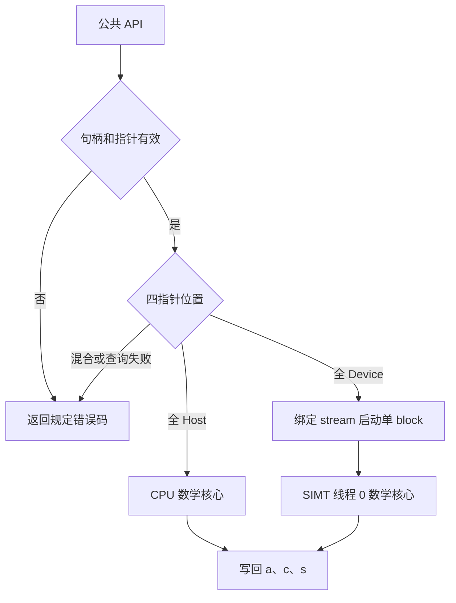

# aclblasCrotg 算子设计文档

| 项目 | 内容 |
| --- | --- |
| 文档版本 | v1.0，设计 PR 提交稿 |
| 修订日期 | 2026-09-09 |
| 目标平台 | Ascend 950PR，CANN 9.1.0 |
| 实现仓库 | `cann/ops-blas` |
| 实现位置 | `blas/rotg/arch35/` |
| 工程模式 | 句柄式公共 BLAS API，Ascend C kernel 直调 |
| 设计依据 | 任务书、`design_template.md`、已提供的 Srotg 三份参考源码、Netlib CROTG |

本文提出待实现的完整设计。性能表中的数值为任务验收上限；不表示已经完成代码开发、目标环境编译或设备实测。算法模型的检查范围见“设计阶段验证”。

# 需求背景（required）

## 需求来源

依据《aclblasCrotg 950 算子开发任务书》，在 Ascend 950PR 上新增单精度复数 Givens 旋转参数构造算子。设计文档提交至 `cann/cann-ops-competitions` 的 `04_tasks/01_community-task-2026/tasklist`；实现及测试按任务要求接入 `cann/ops-blas`。[R1][R2]

需求优先级为：任务书明确规定的接口和行为、任务书指定版本的验收要求、外部参考实现。对于任务书与外部资料存在差异的条目，本文明确采用的设计口径，并在文末集中列出需要评审确认的内容。

## 背景介绍

### aclblasCrotg 算子实现

Givens 旋转通过一个实数余弦系数和一个复数正弦系数消去二元复数向量的第二个分量。本算子生成旋转参数，供后续线性代数计算使用；接口只处理一对复数标量，不执行向量旋转。

`a` 同时承载输入与输出，计算后被覆写为 `r`；`b` 是只读输入；`c` 为实数输出，`s` 为复数输出。复数 Crotg 不生成实数 Srotg 的恢复参数 `z`。

### 同族实现现状分析

以下现状来自已提供的 `srotg_host.cpp`、`srotg_kernel.cpp`、`srotg_kernel.h`，不推断其未提供的上游提交状态。[R3]

| 项目 | Srotg 附件实现 | Crotg 设计 |
| --- | --- | --- |
| 公共入口 | 检查句柄与四个数据指针 | 保留相同检查次序与错误码 |
| 指针位置 | 查询四指针属性，要求同侧 | 全 Host 计算或全 Device 启动，混合位置拒绝 |
| CPU 计算 | 实数 Givens，写 `a/b/c/s` | 复数安全缩放，写 `a/c/s` |
| 设备计算 | AIV-only，单 block，SIMT 线程 0 工作 | 沿用标量执行结构，替换数学核心 |
| 范数算法 | 实数 `hypotf` | 复数安全缩放与独立尺度分支 |
| 启动封装 | `srotg_kernel_do`，使用绑定 stream | 新增独立的 `crotg_kernel_do` |

复用范围是工程模式、校验顺序及启动方式；复数相位、共轭、只读 `b` 和稳定计算单独设计。现有 Srotg 不因本任务改动数学行为。

### 算子功能分析

| 参数 | 数据类型 | 方向 | 元素数 | 行为 |
| --- | --- | --- | --- | --- |
| `a` | COMPLEX64 | 输入/输出 | 1 | 读取原始 `a₀`，写回 `r` |
| `b` | COMPLEX64 | 输入 | 1 | 读取 `b₀`，不写入 |
| `c` | FLOAT32 | 输出 | 1 | 实数余弦，有限正常场景下位于 `[0,1]` |
| `s` | COMPLEX64 | 输出 | 1 | 复数正弦 |

无广播、维度、步长、动态 shape 或用户 workspace 参数。性能测试中的连续调用次数是测试配置，不是算子批量接口。

# 需求分析（required）

## 需求描述

使用 Ascend C 实现 `aclblasCrotg`，复用 ops-blas 公共类型、句柄和 stream 机制；支持全 Host、全 Device 两种参数位置；使用安全缩放避免可避免的中间溢出与下溢；提供基于独立 Netlib 参考实现的精度验证和规定场景的性能测试。

## 需求拆解

| 编号 | 需求 | 本文设计 | 验证出口 |
| --- | --- | --- | --- |
| F01 | 公共接口逐参数对齐任务 | 公共 API 签名与参数表 | 公共头文件编译、动态库链接 |
| F02 | `a=r`、`b` 不变、实数 `c`、复数 `s` | 数学定义及写回次序 | 五分量比较、`b` 位模式检查 |
| F03 | 三类零值输入语义 | `b=0` 优先，再处理 `a=0` | 全零、纯实、纯虚、负零 |
| F04 | 大数、小数、悬殊量级稳定 | 普通分支、公共缩放、独立 `a` 缩放 | 阈值邻域、次正规数、数量级压力 |
| F05 | 全 Host/全 Device 与状态码 | 校验、位置查询及双路径分发 | 两条正向路径、14 种混合位置 |
| F06 | 绑定 stream 异步执行 | 单 block 直调，接口内不强制同步 | 非默认 stream、同步后回读 |
| F07 | 指定精度标准 | 五分量门限与四项数学性质 | 逐 case 结果，不以总通过率替代 |
| F08 | 五类性能指标 | 预热、100 轮有效采样、独立输入槽 | 原始时间记录与均值 |
| F09 | 测试和工程可复现 | CSV/GTest、独立 golden、README | 干净构建及用例清单一致性 |
| F10 | 兼容既有算子 | 新增 Crotg 符号和文件 | Srotg 回归、架构构建检查 |

# 详细设计（required）

## 算子分析

### 数学公式

以下 `a₀`、`b₀` 始终指调用前的输入：

$$
\begin{bmatrix}c&s\\-\overline{s}&c\end{bmatrix}
\begin{bmatrix}a_0\\b_0\end{bmatrix}
=\begin{bmatrix}r\\0\end{bmatrix},\qquad
c\in\mathbb R,\quad c^2+|s|^2=1.
$$

有限、非零输入的数学定义为：

$$
N=\sqrt{|a_0|^2+|b_0|^2},\qquad
\alpha=a_0/|a_0|,\qquad
c=|a_0|/N,\quad s=\alpha\overline{b_0}/N,\quad r=\alpha N.
$$

数学式只定义结果，实现不直接在原始 float32 输入上计算四个分量的平方和。

**零值分支及优先级：**

| 顺序 | 条件 | `c` | `s` | `r` |
| --- | --- | --- | --- | --- |
| 1 | `b₀=0`，包括 `a₀=b₀=0` | 1 | `(0,0)` | 直接保留 `a₀` |
| 2 | `b₀≠0`、`a₀=0` | 0 | `conj(b₀)/abs(b₀)` | `(abs(b₀),0)` |
| 3 | 有限且 `a₀/b₀` 均非零 | 安全缩放计算 | 安全缩放计算 | 安全缩放计算 |

复数判零分别检查两个分量的数值零，接受 `+0/-0`；不得通过平方和是否等于零判定输入是否为零。`b=0` 时直接复制 `a`，保留其零符号和原始位模式。其他运算产生的零符号遵循参考算术，不承诺跨编译器所有零均逐位一致。

`a=0` 时采用任务书的 `r=abs(b)`。例如 `b=(3,4)`，输出为 `r=(5,0)`、`s=(0.6,-0.8)`。不采用外部 cuBLAS 页面该分支的 `r=b` 描述；该差异在 PR 中显式说明。[R1][R4][R5]

### 支持数据类型与接口

在 `include/cann_ops_blas.h` 的现有声明区域新增：

```cpp
aclblasStatus_t aclblasCrotg(
    aclblasHandle_t handle,
    aclblasComplex* a,
    aclblasComplex* b,
    float* c,
    aclblasComplex* s);
```

复用 `include/cann_ops_blas_common.h` 定义的 `aclblasComplex`、状态码及句柄类型。`b` 在公共签名中保持非 const，内部读取接口按只读使用。CPU/kernel 适配层按公共类型的实际成员读取实虚部，数学核心以两个 float 分量表示复数，不使用 `std::complex` 替代公共 ABI。

接入时通过编译期检查确认单精度为 4 字节、公共复数包含任务要求的两个 float 分量；不在未核对公共定义时假定成员名、对齐值或额外填充。GM 访问范围以成员和对象边界为准。

| 条件 | 返回行为 | 输出行为 |
| --- | --- | --- |
| `handle=nullptr` | `ACLBLAS_STATUS_HANDLE_IS_NULLPTR` | 不读取数据指针、不写输出 |
| `a/b/c/s` 任一为空 | `ACLBLAS_STATUS_INVALID_VALUE` | 不写输出 |
| 属性查询失败或混合 Host/Device | `ACLBLAS_STATUS_INVALID_VALUE` | 不计算、不启动 kernel、不写输出 |
| 全 Host，有效参数 | 计算完成后返回 `ACLBLAS_STATUS_SUCCESS` | `a/c/s` 在返回前可读取 |
| 全 Device，有效参数 | 沿用仓内启动及即时错误处理约定 | 对应 stream 完成后可读取结果 |
| 有效输入含 Inf/NaN | 不因数值类别返回参数错误 | 按非有限值兼容策略计算 |

空句柄检查优先于空数据指针。悬挂指针、已销毁句柄、不可写对象及调用期间失效的缓冲区不属于空指针检查能够证明安全的对象。

### 支持形状

四个数据参数均为单元素指针，概念形状 `[1]`；不构造 Tensor 描述符，不涉及广播、stride、axis、尾块和空 Tensor。测试中的 shape 扫描、负维度和非法步长标注为“不适用：接口无对应参数”。

### 数值方案选择

| 方案 | 数值/工程特点 | 决策 |
| --- | --- | --- |
| 原始分量直接平方求和 | `1e30` 平方溢出，`1e-38` 平方下溢 | 不采用 |
| 所有输入统一除以最大幅值 | 可处理同量级极值；悬殊量级时可能把整个 `a` 舍入为零，丢失主相位 | 不作为完整算法 |
| Device 改用 double 直接计算 | 引入目标平台双精度能力和开销依赖，不满足本设计的 float32 路径目标 | 不采用 |
| Netlib 安全缩放及独立 `a` 尺度 | 对应任务指定参考；避免危险平方、比值与相位丢失 | 采用 |

算法采用 Netlib LAPACK 3.12.1 CROTG 安全缩放分支。以下给出本算子的标量化流程及边界，不要求阅读者仅凭“参照 Netlib”补出算法。[R4]

#### 1. 常量与基础操作

| 名称 | float32 值/定义 | 用途 |
| --- | --- | --- |
| `safmin` | `2^-126` | 最小正规数 |
| `safmax` | `2^127` | 参考算法的安全上界，不是 `FLT_MAX` |
| `rtmin` | `2^-63` | 平方安全下界 |
| `rtmax4` | `sqrt(safmax/4)` | 双复数普通分支上界 |
| `rtmax2` | `sqrt(safmax/2)` | `a=0` 的单复数分支上界 |
| `abs1(z)` | `max(abs(Re(z)), abs(Im(z)))` | 按分量检查量级 |
| `sq(z)` | `Re(z)^2+Im(z)^2` | 仅用于已证明范围安全的输入 |

复数除以实数 `q` 分别计算两个分量除法。对于 `t=(tr,ti)`、`g=(gr,gi)`，共轭乘积展开为：

$$
\overline g\,t=(g_r t_r+g_i t_i) + i(g_r t_i-g_i t_r).
$$

不计算一般复数除法，不实现无用途的复数运算库。首次实现固定表达式次序，使用普通精度开方和除法；涉及 FMA 合并的优化另做精度回归。

#### 2. `a=0` 的稳定分支

在已经排除 `b=0` 后，置 `c=0`：

1. `b` 为纯实或纯虚时，模长为非零分量的绝对值，直接得到 `r` 与 `s`。
2. 一般复数令 `g1=abs1(b)`。若 `rtmin<g1<rtmax2`，令 `d=sqrt(sq(b))`，输出 `s=conj(b)/d`、`r=(d,0)`。
3. 其余有限输入令 `u=min(safmax,max(safmin,g1))`、`G=b/u`、`d=sqrt(sq(G))`。先算 `s=conj(G)/d`，再令 `r=(d*u,0)`。

这里先生成 `s` 再恢复 `r`，避免最终模长不可表示时污染仍可表示的旋转参数。

#### 3. 普通/缩放输入准备

对于有限且均非零的 `f=a₀`、`g=b₀`，按下表构造归一化工作量。后续只执行一个公共组合流程。

| 分支 | 条件 | 工作量定义 |
| --- | --- | --- |
| 普通 | `rtmin<abs1(f)<rtmax4` 且 `rtmin<abs1(g)<rtmax4` | `F=f, G=g, u=1, w=1, F2=sq(F), H2=F2+sq(G)` |
| 公共缩放 | 不满足普通范围；且 `abs1(f)/u>=rtmin` | `u=min(safmax,max(safmin,abs1(f),abs1(g)))`；`F=f/u, G=g/u, w=1, F2=sq(F), H2=F2+sq(G)` |
| 独立 `a` 缩放 | 不满足普通范围；且 `abs1(f)/u<rtmin` | 同上取 `u`，另取 `v=min(safmax,max(safmin,abs1(f)))`；`F=f/v, G=g/u, w=v/u, F2=sq(F), H2=F2*w²+sq(G)` |

表中公共缩放分支先计算 `u` 再判断 `abs1(f)/u`。等于阈值时进入缩放流程，避免边界上采用未经保护的平方。

在实数精确运算中，上述构造满足 `f=u*w*F`、`g=u*G`，且 `N=u*sqrt(H2)`。独立缩放只改变 `a` 的工作尺度，没有改变所求旋转；`w` 在最后恢复 `c` 时使用。

#### 4. 公共组合流程与写回

下列伪代码中的复数与实数操作均表示按 float32 顺序求值，`R` 是尚未恢复总尺度的复数结果：

```text
if F2 >= H2 * safmin:
    C = sqrt(F2 / H2)
    R = F / C
    if F2 > rtmin and H2 < 2 * rtmax4:
        T = F / sqrt(F2 * H2)
    else:
        T = R / H2
else:
    D = sqrt(F2 * H2)
    C = F2 / D
    if C >= safmin:
        R = F / C
    else:
        R = F * (H2 / D)
    T = F / D

S = conj(G) * T
c = C * w
r = R * u
s = S
```

普通分支的 `u=w=1`，实现可消除最后的单位乘法。缩放分支必须先完成 `S`，再恢复 `r`。`c` 最终舍入为零时，不以这个零重新计算 `r=a/c`。

分支目的如下：

- 当 `F2/H2` 正规时，可以直接求平方根；只有乘积安全时才计算 `F2*H2`，否则改用 `R/H2`。
- 当该比值可能过小时，先构造安全的 `D`，避免“比值先下溢、再开方”。
- 当 `C` 自身过小时，使用 `F*(H2/D)` 恢复 `R`，避免倒数溢出。
- 独立缩放保证极小 `a` 不会因跟随极大 `b` 的尺度而整体清零，保留决定输出的主相位。

**正确性核对。**若忽略舍入，公共流程中 `C=|F|/sqrt(H2)`、`R=F*sqrt(H2)/|F|`、`S=conj(G)*F/(|F|*sqrt(H2))`。代入 `f=u*w*F`、`g=u*G`，最终得到 `c=|f|/N`、`r=sgn(f)*N`、`s=sgn(f)*conj(g)/N`，与定义一致；`w>0` 不改变相位。

#### 5. 必须保持的数值边界

| 场景 | 设计处理 | 定向验证 |
| --- | --- | --- |
| `a=(1e30,1e30)`、`b=(1e30,-1e30)` | 缩放后平方，最后恢复 `r` | 避免中间 Inf，四项性质通过 |
| 两输入为 `1e-38` 量级 | 以不小于 `safmin` 的尺度放大后计算 | 保留次正规输入，检查输出位模式和 ULP |
| `a=(1e-38,1e-38)`、`b=(1e30,-1e30)` | 对 `a` 独立缩放，允许最终 `c` 正常舍入为零 | `s` 接近 `(0,1)`、`r` 接近 `(1e30,1e30)` |
| 总模长超过 float32 上限，但 `r` 各分量仍可表示 | 在缩放域生成 `c/s/R`，逐分量恢复 `r` | 不先把全局 `N` 存成 float32 |
| `r` 的某一真实分量超出 float32 范围 | 按参考输出分类处理真正的最终溢出 | 不把不可能的有限输出写成精度承诺 |

缩放避免可避免的中间异常；不承诺所有数学非零输出都能由 float32 非零表示，也不承诺各分量与参考逐位一致。对数量级很小的结果，不能仅依赖较大的绝对容差证明没有误清零。

#### 6. 浮点执行模式

CPU 端关闭 fast-math 等会破坏 NaN、Inf、带符号零和渐进下溢语义的选项；核查运行环境未把次正规输入或输出刷新为零。Device 端要求保留次正规数并采用精确除法/平方根。

对支持下列选项的目标工具链，Crotg kernel 编译单元显式设置：

```text
--cce-ftz=false
--cce-prec-div=true
--cce-prec-sqrt=true
--cce-use-fast-math=false
```

这些选项及 950PR 支持情况可在当前 asc-devkit 编译文档中查到；该页面是持续开发版本，不构成本地 CANN 9.1.0 安装包已支持它们的证明。[R6][R7] 工程接入采用编译能力探针和运行探针双重检查：

1. 使用任务指定的 9.1.0 工具链编译上述选项；未知选项或冲突导致构建失败，不静默回退为快速模式。
2. 最小探针覆盖 `tiny/tiny=1`、`sqrt(tiny)>0`、可表示的次正规乘积、带符号零以及 Inf/NaN，其中 `tiny=2^-149`。
3. 保存实际编译命令和探针结果。若该发行构建不具备所需行为，设备数学适配层必须提供等价的渐进下溢支持后才能进入验收；不通过删除测试或改为 CPU 计算绕过设备约束。

这些设置局限于 Crotg 目标，不修改全仓编译策略。SIMD 外层调用 SIMT 的构建方式沿用附件 Srotg，不直接套用最新独立 SIMT 示例的全局构建开关。

#### 7. Inf/NaN 与特殊输出

任务提供的 8 条 Inf/NaN 用例均期望接口返回成功。它们仍然执行状态码、同步、`b` 不变和保护区检查。[R1][R8]

非有限输入进入与固定版本 Netlib 一致的兼容路径，保持 `b=0` 分支优先，复现参考分支的算术及非有限传播；不得统一把所有输出强制设置为 NaN、强制设置成有限旋转或依赖 `NaN <= tolerance` 判定通过。移植中的复数除法、`min/max` 与比较行为必须对照实际参考程序生成的分类表验证，避免宿主语言不同引入差异。

测试为每个分量保存“有限值、正 Inf、负 Inf、NaN”期望。NaN payload 不作为输出精度门限；`b` 因只读仍须逐字节不变。含非有限输入或真正输出溢出的用例，仅对有定义的有限分量和性质执行数值比较，其余项目写明不适用原因。

本设计以 Netlib 3.12.1 为单一数值 golden。任务书同时要求特殊值对齐 cuBLAS，因此另外保存 cuBLAS 特殊值差异记录；若两者存在冲突，先由维护者确认接受的逐用例语义再关闭验收项，不宣称未经测量的“双基线完全一致”。

## 算子实现

### 实现方案



图中的数学核心包括前述零值、普通、安全缩放与非有限兼容分支。Host 写回在 API 返回前完成；Device 写回由 stream 的执行顺序保证，API 不承担隐式等待。

#### 3.2.1 host侧设计：

**参数校验与分发。**

1. 检查句柄，再检查四个数据指针。
2. 调用同族使用的 `aclrtPointerGetAttributes` 依次取得 `a/b/c/s` 属性，返回值必须检查。
3. 仅在四个指针均已成功识别且同侧时继续计算。不得将任意查询失败解释成普通 Host 内存。
4. 全 Host：把 `a₀/b₀` 拷贝到局部标量，调用 CPU 数学核心，再写 `a/c/s`。不申请设备内存、不启动 kernel。
5. 全 Device：传递原 Device 地址和 `handle` 绑定的 stream，调用 `crotg_kernel_do`。不回传输入到 CPU，不在 API 内创建或切换 stream。

位置判别沿用仓内同族约定；设备地址还须处于当前上下文可访问范围。测试分别覆盖 `aclrtMallocHost` 及目标运行时支持的普通 Host 分配方式。不能仅根据旧版接口说明承诺所有 Host 分配形式均可查询；实际支持范围写入 README，并以任务要求核对。

**tiling策略：**固定标量输入，无 shape 推导、广播信息或动态 tiling 数据；数值分支在计算侧判断，不增加 Host 端读回 Device 数据的流程。

##### 1. 分核策略：

设置 `blockDim=1`，外层 kernel 使用附件中的 AIV-only 结构。SIMT 线程组大小引用目标仓的 `SIMT_MIN_THREAD_NUM`；仅 `threadIdx.x==0` 执行标量访问和计算。其余线程立即返回。

单次调用没有可分配到多个核心的独立元素。增加核心、线程间归约或大小核分工会增加调度和同步，不提供有效并行收益。

##### 2. 数据分块和内存优化策略：

不主动申请 UB tile、队列、double buffer 或用户 workspace；数据量固定，局部中间量通过编译器分配。逻辑读取 `a/b` 共 16 字节、写出 `a/c/s` 共 20 字节；四个标量的有效数据负载共 28 字节。实际公共类型布局、分配粒度、缓存事务和编译器栈占用另外记录，不等同于上述有效负载。

API 内不执行 `malloc/free`、`aclrtMalloc/aclrtFree`、事件创建、同步等待或结果打印。错误日志只出现在错误路径；正常路径不逐次输出启动日志。必要参数检查保留，不能以跨调用缓存地址属性且不管理生命周期的方式省略检查。

##### 3. tilingkey规划策略：

单一类型组合、单一标量形状、单一启动方式，不新增动态 tilingkey。普通/缩放/零值判断是数据数值分支，不作为 Host tilingkey。

##### 4. 状态和异步语义：

参数错误在任何输出写入前返回。启动封装采用与现有仓一致的错误上报机制；附件的封装返回 `void`，因此不得将封装返回后得到的 `SUCCESS` 解释为设备工作已经成功完成。

测试分别记录 API 返回值、可即时获取的启动状态和 stream 同步返回值。Device 访问错误可能在同步点暴露；调用方在工作完成前必须维持输入输出对象的有效生命周期，不得同时在另一 stream 上修改同一对象。

#### 3.2.2 kernel侧设计：

**Init/CopyIn。**外层设置 kernel 类型并调用 SIMT VF。线程 0 按公共类型读取两个复数的四个 float 分量，保存原始输入。`c/s` 是纯输出，不读其初值；非工作线程不执行标量访存。

**Compute。**调用数学适配层：分类、按规定次序处理零值、准备普通或缩放工作量、执行公共组合流程。CPU 与 Device 保持同一组数学表达式和分支常量，设备限定符及运行时调用不混入普通 CPU 数学代码。

**CopyOut。**完成全部计算后，只写 `a=r`、`c`、`s`。不向 `b` 存储任何内容，不扩大存储到相邻字节，不使用原子指令或线程间屏障。内部函数使用 Crotg 独立命名，避免与 Srotg 符号冲突。

**访问别名。**本设计要求四个标量是互不重叠的有效对象，`a` 仅与自身输入输出重叠。特别是 `a==b` 无法同时满足“写回 a”和“b 不变”，不作为支持行为；该约束在接口文档显式列出，不能隐含地宣称任意别名安全。

#### 3.2.3 模块与工程接入

下表为拟新增或修改的源码职责，实际构建注册沿用目标分支已有的源码收集、符号导出和架构选择方式。

| 路径/模块 | 改动 | 职责 |
| --- | --- | --- |
| `include/cann_ops_blas.h` | 修改 | 新增公共 `aclblasCrotg` 声明 |
| `include/cann_ops_blas_common.h` | 复用 | 类型、状态码；不另定义平行类型 |
| `blas/rotg/arch35/crotg_host.cpp` | 新增 | 校验、位置判别、CPU 数学适配、Device 分发 |
| `blas/rotg/arch35/crotg_kernel.cpp` | 新增 | SIMT 计算、AIV-only 外层及启动封装 |
| `blas/rotg/arch35/crotg_kernel.h` | 新增 | 内部 `crotg_kernel_do` 声明 |
| `blas/rotg/arch35/crotg_math.h` | 新增 | 本算子内部数学流程、复数分量运算及常量；通过薄适配区分后端 |
| `blas/rotg/README.md` | 修改 | API、零值与只读语义、约束、950PR 支持项 |
| `test/rotg/crotg/arch35/` | 新增 | CSV 读取、C++ GTest、golden、工程用例、测试 README |
| 实际架构构建配置 | 修改或按既有收集规则纳入 | Crotg 对象、公共导出、测试目标及局部浮点选项 |

数学头文件只在算子内部使用，不作为新增公共 API。必要的 Ascend C 限定符由 Device 包装层提供。golden 不包含该数学头文件，不调用 DUT 生成期望值，避免实现与测试共享同一个错误。

## 支持硬件

| 硬件 | CANN | 本任务设计适配 |
| --- | --- | --- |
| Ascend 950PR | 9.1.0 | 是，arch35 |

该表表达设计范围。代码合入时，在完成目标环境验证后更新产品支持表；不由公开接口的通用性推断其他平台已支持。

## 算子约束限制

1. 四指针均指向单个有效且满足类型对齐的标量，位于同一侧；设备内存对执行上下文可访问。
2. 四个对象互不重叠，`a` 支持约定的自身原地覆写；`b` 字节不变，`c/s` 初值无意义。
3. 无广播、动态 shape、步长、尺寸轴和用户 workspace。
4. Device 调用异步，在绑定 stream 同步完成前，不读取、释放或并发修改输出。
5. 不保证 Host/Device 逐位相同，不改变任务给定的精度标准。
6. 次正规数保留是数值实现的必要条件；真实的最终不可表示结果按参考分类处理。

# 可维可测分析

## 精度标准/性能标准

| 标准 | 验证内容 | 来源 |
| --- | --- | --- |
| 接口与行为 | 签名、状态码、写回、零值、双路径、stream | 任务书 §2 |
| 输出精度 | 五个 float32 分量独立比较 | 任务书 §3.2 |
| 数学性质 | 归一性、两个旋转残差、模长保持 | 任务书 §3.2 |
| 性能 | 五类单次平均耗时目标，预热后有效采样 >50 | 任务书 §3.3 |
| 可复现性 | CSV/GTest、固定 Netlib 版本、完整环境与运行记录 | 任务书 §3.5、§4 |
| 内存 | 算子新增 workspace 与实际运行资源分开记录 | 任务书 §3.4、§4 |

### 1. 独立 golden 与精度判定

选择 Netlib LAPACK 3.12.1 `BLAS/SRC/crotg.f90` 或其独立 C 移植作为数值参考，随测试源码提供原始版本、授权信息及摘要。Fortran 版本通过独立 ABI 适配调用；C 移植在移植阶段与原始 Fortran 对照后固定，不从 DUT 拷贝数学实现。

测试依赖仅位于测试工程，不给生产库增加 Netlib、Fortran 或 CBLAS 运行时依赖。采用 Netlib 的理由是任务指定的单一参考，不采用“CBLAS 不存在复数 rotg”这一不准确的泛化表述。

有限输出比较向量为 `q=[Re(r),Im(r),c,Re(s),Im(s)]`。所有输入先舍入到实际 float32，再交给 DUT 与 golden；原始输入单独保存，不能在 `a` 已覆写后生成参考或回代。

| 精度参数 | 数值 |
| --- | --- |
| `rtol` | `2^-10=0.0009765625` |
| `atol` | `2^-16=0.0000152587890625` |
| 匹配比例 | `0.99` |
| 额外误差门限 | `1e-2 或 32 ULP` |

基础分量条件为 `abs(actual-golden)<=atol+rtol*abs(golden)`。每条用例仅五个分量，因此匹配比例至少 0.99 等价于五个分量全部匹配；不得解释为允许 1% 的用例失败。

对额外门限，本设计按任务书“或”的字面含义提议：每条用例同时保存 `abs_gate=(max_abs_error<=1e-2)` 与 `ulp_gate=(max_ulp_distance<=32)`，额外门限为二者逻辑或。这里 ULP 使用有序 float32 编码的距离，`+0/-0` 作为数值相等处理；NaN/Inf 在分类检查中处理。该具体化口径在设计 PR 中请维护者确认，不能删除另一项原始结果或把仅通过较宽门限写成两项均通过。

**四项数学性质**采用 float64 对原始 float32 输入和实际输出计算，使用稳健 `hypot` 构造 `N₀`：

$$
|c^2+|s|^2-1|\le atol+rtol,
$$
$$
|ca_0+sb_0-r|\le atol+rtol N_0,
$$
$$
|-\overline{s}a_0+cb_0|\le atol+rtol N_0,
$$
$$
\bigl||r|-N_0\bigr|\le atol+rtol N_0.
$$

有限且输出可表示的精度 case，必须同时满足五分量基础门限、额外误差门限、四项性质、状态码、同步、`b` 不变及保护区检查。数学性质通过不自动覆盖 golden 失败；记录差异并按已确认口径处理。

次正规结果额外保存 ULP、零/非零分类与位模式，捕捉绝对容差可能掩盖的清零。Inf/NaN 与最终溢出单独出具分类结果和数学性质适用项，不能把 NaN 残差忽略后记整条通过。

### 2. 测试覆盖设计

原始任务 CSV 的 1,200 行完整保留；沿用已补充的 492 行，合计 1,692 行。用例数量表示输入准备状态，不表示运行通过。

| 输入分组 | 数量 | 覆盖目的 |
| --- | --- | --- |
| 原始定向用例 L0/SP/MAG/PH/FL/ED | 75 | 基础、相位、零值、非有限、负向 |
| 原始 EX 均匀分布 | 463 | `[-5,5]` 内分量独立采样 |
| 原始 EX 对数量级 | 462 | 独立保留的幅度压力组 |
| 新增正态分布 | 463 | 与均匀组形成 50%/50%；记录各分量 μ、σ |
| 新增负零/阈值邻域/极端组合 | 29 | 15 个负零组合、6 个阈值邻域、8 个极端组合 |
| 原始性能 PF | 200 | 五条任务门限用例及 195 条扩展场景 |
| 合计 | 1,692 | 精度类 1,492，性能类 200 |

随机生成种子固定为 `20260909`，正态参数满足 `μ∈[-5,5]`、`σ∈[0.1,2]`，四个分量独立采样；正态样本不裁剪成均匀区间。特殊值和压力组不计入均匀/正态各 50% 的比例分母。[R8]

| 测试组 | 正向/负向覆盖 | 检查要求 |
| --- | --- | --- |
| 基础 | 纯实、纯虚、一般复数、异号和相位组合 | r 相位、共轭虚部符号、实数 c |
| 零值 | a 为零、b 为零、全零及 16 种四分量零符号组合 | 分支优先级，直接复制路径的位模式 |
| 缩放 | `rtmin/rtmax4/rtmax2` 两侧，safmin、最小次正规数 | 普通、公共缩放、独立缩放、极小比值分支 |
| 输出范围 | 总模长溢出但分量可表示；分量真实溢出 | 防止提前构造 float32 总范数 |
| 参数 | 空句柄、四种空数据指针及组合优先级 | 状态码、有效输出不被修改 |
| 位置 | 全 Host、全 Device、其余 14 种位置组合 | 选择正确路径，混合输入不启动 |
| 内存 | 合法对齐偏移、前后 guard、输出不同初值 | 不扩大访问，不修改 b，不依赖 c/s 初值 |
| stream | 非默认 stream、前序输入更新、后序消费 | 使用绑定 stream，读回前检查同步 |
| 特殊值 | 8 条任务 Inf/NaN 及各分量补充组合 | 成功返回、golden 分类、payload 保持于 b |
| 兼容性 | 现有 Srotg、公共库构建和符号可见性 | 不改变同族数学与 ABI |

1,492 条精度类 CSV 在 Host/Device 分别执行，预期基础记录数为 2,984；其中参数异常和非有限用例使用各自判据。CSV 未覆盖的空句柄、位置、stream、guard 等由独立 GTest 工程用例补充，不把 CSV 行数当作全部覆盖证明。

CSV 解析器明确接受 NaN、±Inf、十进制次正规数与 `-0.0`。解析失败、重复 ID、未知列值不得自动跳过。原始 MERE/MARE 字段保留用于兼容读取，任务精度采用上述显式比较器。

### 3. GTest 与结果记录

每条数值测试流程为：解析并保存原始位模式 → 建立目标侧标量和 guard → 独立 golden → 调用公共 API → Device 同步 → 回读 → 比较 → 写入结果。负向 case 只检查适用的状态和有效对象，不对无效指针解引用。

结果最少包含：`case_id`、执行路径、输入位模式、DUT/golden 各五分量、每分量误差、两种额外门限、四项残差、状态码、同步结果、b 与 guard 检查、最终判定和失败原因。

运行器核对 CSV 预期 ID 与实际执行 ID 一一对应。非零退出、超时、零用例、重复执行、漏跑、跳过或结果文件不完整均不能记成功。精度结果使用机器可读数据，截图用于对应展示，不代替原始数据。

### 4. 性能设计与测量

本算子计算量和逻辑访存固定，性能主要需要控制位置查询、Host 提交、kernel 启动及完成等待的固定开销。采用单 block、局部标量、接口内无分配/同步/逐次日志的结构；开方与除法保留正确性所需精度。

以下数值直接采用任务书，不执行 `/0.4` 或其他换算：

| case ID | 输入 a₀ | 输入 b₀ | 每轮调用 K | 平均单次上限/μs |
| --- | --- | --- | --- | --- |
| `TC_PF_1001` | `(3,4)` | `(1,2)` | 1 | 11.85 |
| `TC_PF_1002` | `(0,0)` | `(1,2)` | 1 | 9.97 |
| `TC_PF_1003` | `(1e30,1e30)` | `(1e30,-1e30)` | 1 | 9.49 |
| `TC_PF_1004` | `(1.5,-2.5)` | `(0.5,0.25)` | 1,000 | 11.84 |
| `TC_PF_1005` | `(1.5,-2.5)` | `(0.5,0.25)` | 10,000 | 11.53 |

**测量路径。**主报告使用全 Device 路径。Host 路径独立报告，不能以 CPU 计算耗时替代 NPU 验收。设计提议把“从首次 API 调用前到同一 stream 完成 K 次调用后”的端到端完成时间作为主指标；同时采集设备事件或 profiler 数据用于分解。任务书未给出标杆起止点，主指标约定在设计评审中确认后固定。

**输入准备。**每轮使用 K 套预先分配的独立 `a/b/c/s` 标量对象，每套 a/b 初值相同；K 次调用仍是 K 次公共标量 API。因为 `a` 会写回，禁止对同一地址连续迭代后仍称每次输入相同。若另测依赖链，单独标注，不混入表中结果。

**时序。**

1. 建立环境、句柄、stream、缓冲区，完成模块加载和输入准备。
2. 预热 10 轮，每轮开始前恢复输入，完成同步。预热不计均值。
3. 有效采样 100 轮。每轮在计时外恢复输入并等待完成；随后用单调时钟开始计时，按同一 stream 提交 K 次 API，检查返回值，同步并结束计时。
4. 计时区间不含分配、H2D 初始化、golden、比对、截图和打印；不扣除估算的同步或事件成本。
5. 精度采集与设备分解可以分开运行，但采用相同版本和输入策略；保存原始每轮记录。统计均值，附中位数/P95 便于识别抖动，不无说明地剔除慢样本。

$$
\mathrm{AvgUs}=\frac{\sum_{j=1}^{M}T_j(\mu s)}{M K},\qquad M=100>50.
$$

设备事件间隔包含实际设备时间线行为，不自动等价于 CPU 提交耗时或端到端完成时间；GTest 的整数毫秒总耗时不用于算子性能计算。

全部 200 条性能输入均执行和归档。扩展 195 条保留附件基线，但只有在来源、单位和倍率规则明确后判断其验收结论；不从附件脚本的 GPU 数值推导未经确认的 NPU 门限。前五条始终以任务表为准。[R8]

### 5. 内存与可维护性

算子设计无需新增用户 workspace。报告区分有效数据负载、测试缓冲区分配、运行时基础资源、编译器局部栈/寄存器占用和可测峰值；不把“无 workspace”写成“实测内存为零”。连续调用观察预热后资源是否持续增长，相关量的采集方法和归因范围一起记录。

数学流程集中在内部模块，零值、普通、公共缩放、独立缩放及非有限兼容有独立测试标签。调试构建可记录分支覆盖，性能构建去除记录代码。失败信息优先保留输入位模式与参考分量，便于跨 CPU/NPU 复现。

### 6. 设计阶段验证与实施验收门槛

本轮用 binary32 公式模型检查现有 CSV，并用 binary64 回代数学性质：

| 检查项 | 实际记录 |
| --- | --- |
| 有限且期望成功的精度输入 | 1,480 组 |
| 输出可表示且四项性质满足任务阈值 | 1,478 组 |
| 真实 r 分量超出 float32 有限范围 | 2 组，单列输出范围分类 |
| 普通/缩放主分支 | 1,124 / 318 次 |
| 独立 a 缩放/极小比值组合分支 | 100 / 22 次 |
| 零值分支 | a 为零 11 次，b 为零 27 次 |
| 未纳入公式检查 | 200 条性能输入、4 条状态码输入、8 条非有限输入 |

这是设计表达式和有限域性质的核验；没有调用 `aclblasCrotg`，没有链接正式 Netlib golden，也没有证明设备执行、ULP 门限、特殊值分类或性能已经通过。可复现脚本、输入清单摘要与结果在设计 PR 配套核验材料中提供，不作为生产源码加入设计 PR。

实施阶段按如下门槛推进：

| 阶段 | 必须形成的结果 |
| --- | --- |
| 构建接入 | 固定 ops-blas commit，公共类型/导出正确，9.1.0 浮点选项及运行探针通过 |
| Host 正确性 | 独立 Netlib 对比、全部适用数学性质和参数用例通过 |
| Device 正确性 | 同一 CSV、独立 golden、次正规/特殊值/stream/guard 检查通过 |
| 性能与回归 | 指定五条达到已确认口径的上限，其余场景归档，Srotg 回归通过 |
| 代码/任务验收 | 实现 commit、测试源、运行原始数据、截图和报告对应同一版本 |

不把代码阶段的实测数据作为已经存在的设计事实；也不把当前缺少设备运行结果等同于设计文档必须无法评审。

## 兼容性分析

- **API/ABI：**仅新增 `aclblasCrotg`，保持现有类型、句柄布局和接口不变；公共 b 非 const、行为只读。
- **架构：**arch35 源码只纳入支持架构的构建，不把设备专用实现链接到其他产品目标。
- **同族行为：**Srotg 保持 `b=z` 规则，Crotg 保持 b 不变；不为了复用把两者写回流程合并。
- **浮点构建：**精确模式局限于 Crotg，不无意改变其他算子的速度和数值行为。
- **并发：**无可变全局数学状态；不同调用使用独立缓冲区。句柄/stream 并发使用遵循库既有约束，不额外承诺共享句柄并发修改安全。
- **文档：**更新 `blas/rotg/README.md` 中的复数参数、零值、内存、异步及产品支持说明。

## 设计评审口径与交付关联

以下内容随设计 PR 明确呈现，不能用待填数值掩盖规则差异：

| 项目 | 本设计采用的方案 | 评审处理 |
| --- | --- | --- |
| `a=0` 与外部页面差异 | 任务书/Netlib：`r=abs(b)`，b 不变 | 按明确任务条款执行，PR 说明差异 |
| `1e-2 或 32 ULP` | 逐 case 两门限分别记录，逻辑或作为额外门限 | 请维护者确认该具体化口径 |
| 非有限值两参考差异 | Netlib 3.12.1 为数值 golden，保存 cuBLAS 特殊值差异 | 如分类不同，维护者确认后固定预期 |
| 性能计时起止点 | 全 Device 的端到端完成时间为主指标，设备时间另报 | 请维护者确认与标杆可比 |
| CANN 浮点能力 | 明确精确选项和编译/运行探针 | 在实际 9.1.0 构建验证，失败时不能进入验收 |

设计 PR 提交本设计正文；测试代码、代码 PR 和最终自测报告按任务阶段分别提供。实际提交路径使用目标 tasklist 中该任务的既有目录，文件名遵循目录现有规范；文中没有虚构任务子目录、个人仓地址、PR 号或测试结果。

| 交付项 | 对应内容 |
| --- | --- |
| 设计 PR | 本文：接口、数值算法、Host/kernel、验证和兼容设计 |
| 自测代码 | `test/rotg/crotg/arch35/` 的 CSV/GTest/golden/脚本/README |
| 自测报告 | 五分量和性质结果、性能原始数据、截图、资源记录 |
| 待验收代码地址 | 实际个人仓、分支、commit、算子目录及任务要求的访问设置 |
| 实现 PR | `blas/rotg/arch35/`、公共头、README、构建和测试改动 |

## 参考资料

- **[R1] 任务书附件：**`aclblasCrotg_Atlas950PR_task_doc.md`，接口 §2、验收 §3、交付 §4–§5。
- **[R2] 模板附件：**`design_template.md`。按其“需求背景—需求分析—详细设计—可维可测分析”章节组织；[官方模板地址](https://gitcode.com/cann/cann-ops-competitions/blob/master/04_tasks/01_community-task-2026/resources/design_template.md)。正文依据已读取附件，不声称已取得该网页当前版本。
- **[R3] 同族附件：**`srotg_host.cpp`、`srotg_kernel.cpp`、`srotg_kernel.h`；目标工程 [cann/ops-blas](https://gitcode.com/cann/ops-blas)。源码事实仅对应已提供文件。
- **[R4] 算法参考：**[Netlib LAPACK 3.12.1 CROTG 文档和参考实现](https://www.netlib.org/lapack/explore-html/d7/dc5/group__rotg_ga7a6687e52657bef3d876b03391a06d2c.html)，其算法依据为 Anderson, Algorithm 978；[LAPACK 授权](https://www.netlib.org/lapack/LICENSE)。数学式和分支用于数值设计，实际 golden 源码仍需固定摘要与编译条件。
- **[R5] 接口对标：**[NVIDIA cuBLAS rotg](https://docs.nvidia.com/cuda/cublas/index.html#cublas-t-rotg)。引用其接口和复数段，差异不覆盖任务书明确语义。
- **[R6] 浮点编译：**[asc-devkit AI Core 编译基本用法](https://asc.gitcode.com/guide/programming_guide/compilation_and_execution/operator_compilation/ai_core_operator_compilation.html)，含 FTZ、精确除法/平方根和快速数学选项。页面为 master 开发文档，实际能力通过任务指定工具链探针确认。
- **[R7] SIMT 数学：**[sqrtf](https://asc.gitcode.com/api/SIMT-API/math_functions/float_math_functions/sqrtf.html)、[ldexpf](https://asc.gitcode.com/api/SIMT-API/math_functions/float_math_functions/ldexpf.html)。开发文档说明了模式/接口约束；本设计不把搜索摘要中的限制泛化为所有编译模式均不支持次正规数。
- **[R8] 配套输入：**原始 `test_cases.zip` 及已补充的 1,692 条 CSV；原始文件全部保留。配套脚本的整场 GTest 计时和 `/0.4` 规则不覆盖任务表。

外部页面核对日期：2026-09-09。任务与模板以附件为本轮基线；上游构建文件、代码 commit、目标设备运行结果和个人 PR 状态未在本次设计编写中宣称已核验。
