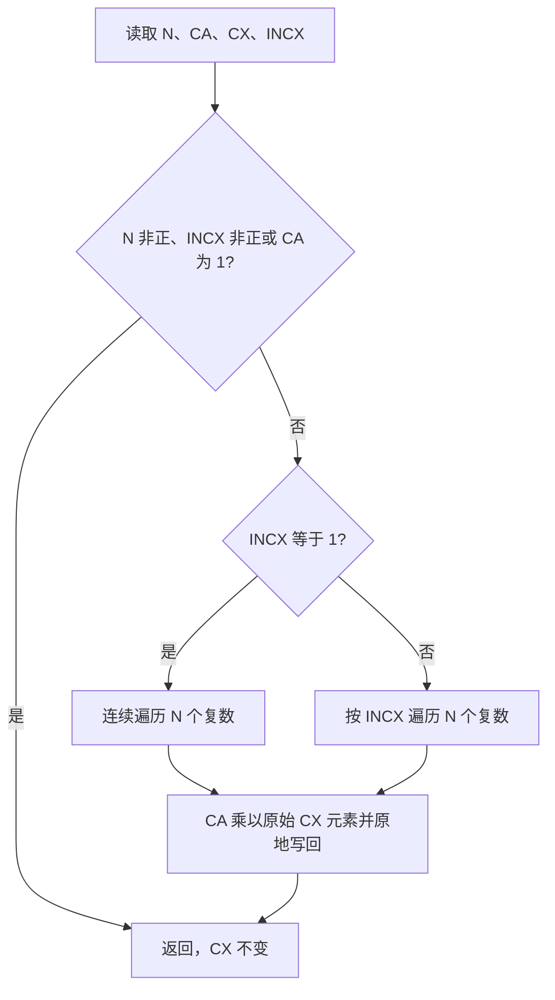
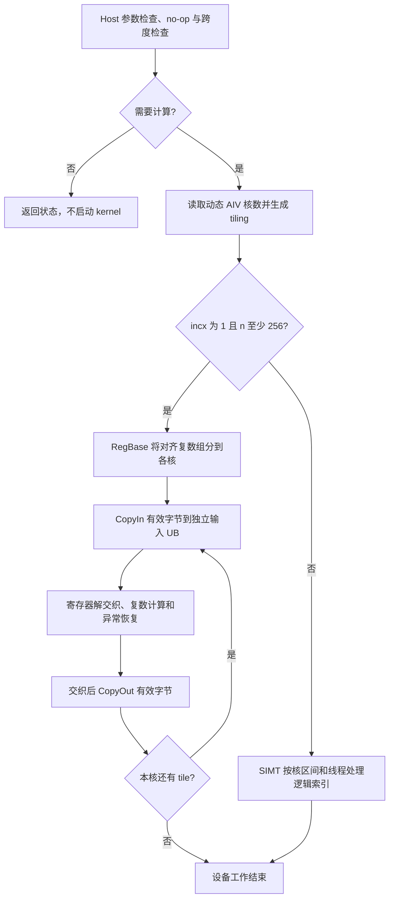

# aclblasCscal（Ascend 950PR）算子设计文档

| 项目 | 内容 |
|---|---|
| 任务 | [CANN训练营东南大学-aclblasCscal算子开发(950)](https://www.hiascend.com/activities/task-center/details/005181d868734baebffacbe679e5a6ba) |
| 任务系统标识 | `005181d868734baebffacbe679e5a6ba`；社区目录编号采用维护者任务索引 PR 中的 `09-25`（该索引 PR 尚未合入） |
| 贡献者／个人提交目录 | `zee_920`；与任务报名绑定的 GitCode 账号一致 |
| 文档版本 | 1.1，2026-09-08 |
| 个人代码仓 | 尚未发布；本 PR 先申请设计评审，代码、完整自测包及复现入口在后续验收阶段交付 |
| 已测实验源码提交（本地记录） | `7d56b8b62b1debb5099fa697bf1b98ec5130328e` |
| 文档状态 | 设计评审申请；已有条件限定的实机自测，尚未通过社区设计评审或官方验收 |

本文件按[社区算子设计模板](https://gitcode.com/cann/cann-ops-competitions/blob/master/04_tasks/01_community-task-2026/resources/design_template.md)的四个一级部分编写。接口和工程模式以上述任务页面提供的《aclblasCscal 950 算子开发任务书》为准；本题是 BLAS 句柄式 kernel 直调，不套用模板示例中的 Addcdiv、aclnn 或图模式注册接口。

# 需求背景（required）

## 需求来源

社区任务要求在 Ascend 950PR、CANN 9.1.0 上实现单精度复数向量缩放 `aclblasCscal`，提交设计、代码、测试及自测报告。目标仓库为 [cann/ops-blas](https://gitcode.com/cann/ops-blas)，实现目录 `blas/scal/arch35/`，测试目录 `test/scal/cscal/arch35/`，声明沿用公共 `include/cann_ops_blas.h`。

## 背景介绍

### aclblasCscal 实现优化

Cscal 将一个 complex64 标量与一维 complex64 向量相乘并原地写回，常用于复数线性代数计算。连续输入需减少搬运与逐元素指令开销；正步长输入则需正确定位物理元素，不能覆盖间隔中的数据。此算子不是实标量乘复数向量的 Csscal，也不能用 `Sscal(2*n, incx)` 替代。

### 950PR 实现现状分析

开发基于上游提交 `2760346765b92e40579d16d8fffdb9f0988c35df`。公共 Cscal 声明已经存在，可参考同族 Sscal 的 arch35 工程集成，但复数运算、交织布局和特殊值恢复需独立实现。现有仓库 README 的 Cscal 原型为旧的 int64／alpha 按值形式，与公共头文件不一致；本次配套 README 修正为公共 ABI，并仅将经验证的 950PR 标为支持。

| 能力 | 本次实现 |
|---|---|
| 数据类型 | complex64：实部、虚部各 float32，AoS 交织布局 |
| 连续输入 | `incx=1`，SIMT／RegBase 自动路由 |
| 非单位正步长 | `incx>1`，SIMT，物理跨度按 64 位计算 |
| 空输入与非正步长 | 合法 no-op，保留全部存储内容 |
| Host 标量／Device 向量 | 沿用公共句柄接口，绑定 stream 异步执行 |
| 特殊值 | 零标量清零、identity、Inf／NaN 恢复和独立分量比较 |

### aclblasCscal 功能分析

对 `i=0,...,n-1` 更新 `x[i*incx]`，其余存储位置不变。实部和虚部必须在写回前均从原始元素读取，避免原地覆盖导致第二个分量错误。正常计算要求保留复数四乘法的舍入与异常值行为；无效参数、no-op 与异步错误分别处理。

### 标杆来源与流程

本题不是 TBE 算子迁移：接口对标 cuBLAS `cublasCscal`，精度 golden 来自 Netlib BLAS，参考源文件为 [Netlib `cscal.f`](https://www.netlib.org/blas/cscal.f)。不把同节中的实标量 `cublasCsscal` 或 TBE Addcdiv 示例作为本题标杆。



与标杆的主要差异：Netlib 在 Host 串行执行，本实现异步启动 NPU 并按核分块；题书要求零标量显式清零，raw Netlib 在非有限输入等情形并不保证得到同样的正零结果，故保留并披露该差异。CPU golden 是精度参考，不拿 CPU 耗时替代题包 GPU 性能基线。

# 需求分析（required）

## 需求描述

1. 与任务书及公共头文件的 ABI 一致，不新增 950PR 私有平行 API。
2. `handle==nullptr` 返回 HANDLE_IS_NULLPTR；有效 handle 下，`n<=0` 或 `incx<=0` 直接成功；随后检查 alpha／x 非空，再处理 identity。
3. 正常输入原地缩放；`alpha=(0,0)` 按任务书将选中元素置为正零，不是 no-op；步长空隙不变。
4. CANN 9.1.0／950PR 上全量精度通过；所有性能 case 预热后采样超过 50 次。三个主点平均耗时不超过 13.73／21.22／43.31 μs，并按原始 GPU CSV 采用更严格的逐例上限。
5. 附可复现命令、全部用例参数、实虚分量结果、截图及内存占用数据；不以 CPU 模型或截图替代原始设备日志。

## 公共接口

```cpp
aclblasStatus_t aclblasCscal(
    aclblasHandle_t handle, int n,
    const aclblasComplex* alpha, aclblasComplex* x, int incx);
```

`alpha` 指向 Host 上的复数标量，`x` 指向 Device 上的原地向量；不需要新增私有接口或外部 workspace。正步长时物理长度至少为 `1+(n-1)*incx` 个复数。函数返回值使用公共 `aclblasStatus_t`，无效 handle、无效指针与合法 no-op 的优先级见下文 Host 设计。

## 需求拆解

运行依赖为 CANN 9.1.0 的 ACL runtime、Ascend C 工具链和 ops-blas 句柄／stream／硬件信息辅助模块。测试额外依赖 GTest 与真实 Netlib BLAS 3.10.0；本机记录为 g++ 11.4.0、CMake 3.22、GTest 1.11。生产 kernel 不调用 CPU BLAS，不依赖 CPU 桩。

| 模块 | 文件／职责 | 验证 |
|---|---|---|
| 公共接口与 Host | `cscal_host.cpp`；检查、alpha 读取、stream 直调 | 状态码／no-op／Host 模型 |
| 规划与容量 | `cscal_plan.h`、`cscal_config.h` | 分核覆盖、64 位跨度、UB 预算 |
| 参数传递 | `cscal_tiling_data.h`；48 字节 POD 按值传参 | 静态布局检查、实际工具链构建 |
| Device | `cscal_kernel.cpp`；SIMT、连续 RegBase、特殊值恢复 | 原题、补充与独立位模式探针 |
| 测试工程 | `test/scal/cscal/arch35/` | GTest＋Netlib CBLAS，固定 CSV |
| 验收工具 | 严格报告校验与事件计时 | 缺项、失败进程、无效耗时不得判 PASS |

# 详细设计（required）

## 算子分析

### 数学公式

令 `alpha=a+bi`，输入元素 `x[j]=c+di`，`j=i*incx`：

```text
p0 = a*c; p1 = b*d; p2 = a*d; p3 = b*c
real = p0 - p1
imag = p2 + p3
```

非有限结果不能只靠普通四乘法覆盖：两个输出同时为 NaN 时，按复数恢复规则处理操作数 Inf／NaN 和中间乘积溢出。`alpha=(0,0)` 的题书清零约定独立于该公式。

### 支持数据类型

`aclblasComplex` 完全复用 `include/cann_ops_blas_common.h` 的定义。Host 静态断言其为 standard-layout、大小 8 字节、real 偏移 0、imag 偏移 4。alpha 是 Host 指针；x 是 Device 指针；不支持 half、complex128 或 Device alpha 指针模式。

### 支持形状

逻辑形状 `[n]`，`n` 和 `incx` 均为公共 ABI 的 `int`。正参数的最小物理长度为 `1+(n-1)*incx` 个复数，调用者应保证这段 Device 地址有效。内部使用 64 位索引；Host 拒绝字节跨度超过 `min(SIZE_MAX,PTRDIFF_MAX)` 或地址加法溢出。该检查不等于查询任意指针的实际分配长度。`n<=0`／`incx<=0` 为合法 no-op；不存在额外 leading dimension、broadcast 或视图输出。

## 算子实现

### 实现方案

#### 3.2.1 host 侧设计

执行顺序为：handle 检查 → 非正 n／incx no-op → alpha／x 空指针检查 → identity no-op → 跨度和地址检查 → 生成 tiling → 在 handle 的 stream 上启动 kernel。Host 在返回前读取 alpha 的两个 float；接口内不分配 GM 工作区、不做 gather、不搬运 x、不同步 stream。

##### 1. 分核策略

默认 `incx==1 && n>=256` 走 RegBase，否则走 SIMT。AIV 核数通过上游 `GetAivCoreCount()` 获取；本机实际 56 核，不硬编码旧平台核数。

SIMT 核数为 `min(AIV,ceil(n/256))`，每 block 128 线程；第 k 核处理 `[floor(n*k/C),floor(n*(k+1)/C))`。

向量核数为 `min(AIV,max(1,floor(n/8)),ceil(n/2048))`。先将 `floor(n/8)` 个 8 复数组用商余数法均分，前若干核心多一个组，最后一核附加 `n%8` 的尾部。核起点对齐 8 个复数，所有有效元素恰好分配一次。

##### 2. 数据分块和内存优化策略

最终选用 tile=4096 个复数、队列深度 D=1。输入／输出各一条 AoS TQue，容量向上取整到 64 个复数。显式 UB 缓冲为：

```text
2 * D * ceil(tile/64) * 64 * 8 = 65536 bytes
含预留 8192 bytes 的编译期预算 = 73728 bytes
本机已查询 UB 容量 = 253952 bytes（248 KiB）
```

实际代码并不在每次调用时动态查询 UB；使用配置预算和编译期断言，并由平台实测容量核对。预算不是编译器寄存器溢出或峰值占用测量。没有五个 SoA 暂存数组、GM 临时数组或用户提供的 workspace 参数。

##### 3. tilingkey 规划策略

本题采用 kernel 直调，未注册图模式 tilingkey。48 字节 POD 含 `n/incx`（uint64）、`coreCount/tileComplex/simtThreads/useVector/writeZero/finiteAlpha`（uint32）和 alpha 两个 float，按值交给 launch。路由由这些显式字段决定。finiteAlpha 仅按 Host alpha 位模式分类，不读取 x，也不依赖用例 ID。

#### 3.2.2 kernel 侧设计



Host 在 stream 上发出工作后异步返回；流程图中的设备工作结束不是接口内部同步。两条设备路径均支持题书零标量清零策略；对一般复数运算，输入实虚部在写回前保留，分配范围外和 stride 间隔不写入。

SIMT 按核区间与线程索引遍历逻辑向量，地址为 `i*incx`；读取两个原始分量后完成四乘法及完整异常恢复，再写回。零策略直接写两个正零，绝不修改间隔数据。

RegBase 每次 dual-load 处理 64 个 complex64，用 `DIST_DINTLV_B32` 拆成实虚两个 FP32 寄存器，在寄存器中完成四乘法及 Sub/Add，再用 `DIST_INTLV_B32` 交织写回。掩码按复数个数更新。UB 为尾部 dual-load 预留完整寄存器容量，但 GM CopyIn／CopyOut 始终只搬 `8*valid_count` 字节，不能把向上取整后的长度用于 GM 写回。

单缓冲顺序为 CopyIn → Compute → CopyOut；TQue 管理 MTE2→V、V→MTE3 生命周期，输入输出 UB 不重叠，尾部初始化与后续搬运通过事件等待排序。源码保留 q2 前取路径，但本次达标配置不是 q2，未声称其更快或已证明搬运计算重叠。

有限 alpha 恢复优化保留原始四个乘积及普通输出。当 real／imag 同为 NaN 且任一原乘积为 Inf 时，将乘积中的 NaN 清为 +0，再做减／加和 Inf 缩放；非恢复 lane 选择原始输出，正常有限结果及舍入不变。非有限 alpha 与 SIMT 使用完整恢复规则。等价性边界为有限值位模式、零符号和 Inf 类别／符号及 NaN 类别，不包含 NaN payload 或浮点异常标志。

该优化已做 14,769,856 组 CPU 特殊／随机位模式对照，以及父版／候选版各 1,816 次 NPU 调用、9,610,152 个实虚分量的独立对照；有限位模式、signed-zero、Inf 符号、NaN 类别无差异。探针不参与性能计时。上述为本地自测记录；完整原始报告将在后续验收交付件中提供，不将探针调用数计为更多官方用例。

## 支持硬件

| 硬件 | 本次 arch35 交付验证 |
|---|---|
| Ascend 950PR | 支持；CANN 9.1.0 实机验证 |
| Ascend 950DT | 未验证，不标注支持 |
| Atlas A2／A3 | 不属于本次 arch35 验证范围；不修改上游其他架构的支持结论 |

## 算子约束限制

- 调用者创建有效 handle／stream，并在读回、释放或跨 stream 消费 x 前正确同步。SUCCESS 仅表示 Host 接受调用，异步设备错误仍需在同步点检查。
- `alpha=(1,0)` 在空指针检查之后提前返回；no-op 与未选中数据按字节保持。负步长不是反向遍历。
- 零标量遵循题书“全部置零”文字；这与原始 Netlib 在某些 Inf／NaN／零符号输入上的输出存在差异。测试保存 raw CBLAS 并单列差异，不宣称这一控制域与原始 CBLAS 逐位一致，需在设计评审中确认该任务约定。
- 不修改全局舍入模式，未承诺跨工具链 bitwise 确定性。算子库实际 ASC 编译使用 `-O2 -g` 和 `-ffp-contract=off`，无 fast-math；原 GTest Host 目标的实际 flags 不含 `-O2`。不能仅根据 CMakeCache 声称所有目标都按 `-O2` 编译。
- 后续已单独运行 msprof 诊断，诊断耗时不参与正式性能判定；未运行专用设备内存安全检查器或峰值寄存器／HBM 占用工具，不能用哨兵 PASS 替代这些工具的证明。

# 可维可测分析

## 特性交叉分析

- stride、offset 与尾部可组合出现：地址使用 64 位索引，SIMT 仅写选中元素，RegBase 的 GM 搬运只覆盖有效字节；使用哨兵和间隔字节检查覆盖。
- 零标量／identity 与非有限输入的交叉：分别执行任务清零策略和合法 no-op，不使用普通乘法模拟提前返回。
- stream 生命周期与原地修改的交叉：调用方在读回、释放或跨 stream 使用向量前同步；测试的输入恢复在同一 stream 的 start event 之前。
- 不支持 Device alpha 指针模式、负步长反向遍历、broadcast、额外 leading dimension 和 complex128；不改变其他架构实现的支持状态。

## 精度标准／性能标准

| 验收项 | 标准与方法 | 来源／证据 |
|---|---|---|
| 分量精度 | 实虚各用 atol=2^-16、rtol=2^-10，matched ratio≥0.99；每个有限分量 abs error≤1e-2 或 ULP≤32 | 任务书 §3.2；固定 checker |
| 非有限值 | NaN 对 NaN；Inf 要求同符号；不比较 NaN payload | 固定 checker 与独立探针 |
| 零策略与保护 | 所选正零 bit-exact；no-op、首尾哨兵、stride 空隙保持原字节 | 任务书 §2；全量设备结果 |
| 性能目标 | 10 warmup、64 样本，平均 ACL timeline 单次 stream 区间；要求全部 200 例通过逐例有效上限 | 任务书 §3.3、原始 GPU CSV；本地结果及条件见下表 |
| 复现与完整性 | 1000＋181＋200 用例无缺失；固定输入、基线及生产源码哈希 | 本地原始 receipt 与独立审计；尚未完成面向公开交付目录的干净构建复现 |
| 内存数据 | 测试缓冲区申请字节、显式 UB 预算、三主点 ACL HBM 分阶段快照 | 本地内存自测；非峰值指标 |

原 CSV 的 MERE／MARE 列原样保留，但验收实现采用任务书 §3.2 的分量标准，不把旧列当成替代指标。`1e-2 或 32*ULP` 按逐有限分量的 OR 解释，评审时应确认；当前全部有限分量最大误差和 ULP 均为 0，因此该解释不影响本次有限数值结果。

### 已有实机自测与未解决项

以下均为同一 Ascend 950PR、CANN 9.1.0、同一算子库及测试二进制的本地原协议结果；每轮精度与保护检查均为 1381/1381，10 次预热、64 个有效样本全部取平均，没有删除长尾或更改门槛。

| 2026-09-08 UTC | Host 条件 | 性能通过数 | 说明 |
|---|---|---:|---|
| 11:03:39 | 未绑定 CPU | 200/200 | 原样复测 |
| 11:10:45 | 未绑定 CPU | 199/200 | TC_PF_1068（n=610431）平均 16.4095 μs，高于 10.6725 μs 上限 |
| 11:22:22 | 进程绑定 CPU22 | 200/200 | 无 profiler、无 LD_PRELOAD；最差耗时/上限比 0.9593268842 |
| 11:24:39 | 进程绑定 CPU22 | 200/200 | 无 profiler、无 LD_PRELOAD；最差耗时/上限比 0.9695805093 |

| n，incx=1 | 有效上限（μs） | CPU22 第1轮均值（μs） | CPU22 第2轮均值（μs） |
|---:|---:|---:|---:|
| 1048576 | 13.73 | 10.4737187066 | 10.6848905998 |
| 2097152 | 21.2175 | 19.8422187823 | 19.6908437647 |
| 4194304 | 43.3075 | 34.5304845832 | 33.7018751306 |

CPU22 在本机属于 NPU 所在 NUMA0 且位于允许 CPU 列表；亲和性仅约束本测试进程，并非 CPU 独占，不阻止抢占，不改变系统频率或其他任务。其他机器必须重新核实拓扑，不能照抄 CPU 编号。固定 CPU 的两次通过不证明永久修复；未绑定 CPU 的稳定性问题仍未解决，历史其他失败轮次也将保留。

已确认原计时区间会包含非 kernel 间隙；独立诊断中观测到 Host 提交延迟与真实 event 长尾同现，但不能将历史原样失败全部归因于 profiler 或 CPU 抢占。目前没有修改生产 kernel 来宣称已消除根因。

自测身份：

- 第1轮：`measure-ops-blas-20260908T112222.900591Z`。
- 第2轮：`measure-ops-blas-20260908T112439.865217Z`。
- `cscal_test` SHA256：`8776934dc06038880f84cf35fa1dcffc8b6b5f608f4d7a526360f5e57dde8453`。
- `libops_blas.so` SHA256：`23adfb7ce8dd3f3fe208e81ac0402c1b4dcf9af9efaf40d1c4a52d0b6fffefef`。
- 冻结清单 SHA256：`97f8ed9fae4194d8a8fea0c2b3022db6ac9cede34dc11eace394d9f0b71d0b98`。

### 评审与后续验收计划

请重点确认零标量清零约定、分量精度规则以及是否接受明确声明 Host CPU 亲和性的原协议自测条件。性能波动和公开交付目录的干净构建复现仍需在申请官方验收前处理，不能仅用本设计文档替代自测报告。

遵循[东南大学专场指引](https://gitcode.com/org/cann/discussions/223)：创建设计 PR 后先更新任务进展，代码链接填写“暂无”。设计 PR 评审通过并合入后，交付个人代码仓及完整文件包，邀请 `Ascend-CANN` 为开发者，再申请后台测试；收到测试通过通知后按要求提交需求 Issue 和代码 PR。设计文档提交不代表任何后续节点已完成。目录编号采用维护者[任务索引补充 PR](https://gitcode.com/cann/cann-ops-competitions/pull/1394)中的 `09-25-aclblasCscal-950`，该索引尚未合入，如最终编号调整则同步迁移个人文档目录。

## 兼容性分析

公共 ABI、complex 布局、句柄和 stream 与 ops-blas 共用，新增生产文件限定在 arch35 Cscal 范围。不修改其他架构 kernel。测试 golden 使用真实 Netlib 3.10.0；CPU 桩仅用于隔离 Host 模型检查，绝不加入设备构建 include 路径。生产源与最终设备 receipt 的五文件 SHA256 一致。

本次计时是同一 stream 中 start/end ACL 事件包围一次 API launch 的区间。输入 D2D 恢复在 start 之前，分配／H2D／比较不计入；该口径带 warm-reset 缓存效应，不能称为 msprof 纯 kernel 指令时间。GPU 数值来自任务包，未在本机重跑 GPU，也未独立证明两台设备的缓存、频率和软件计时完全相同。公开评审／合入与奖励资格均尚未确认。

## 编写说明

本文及配套实现的整理使用了 Codex 辅助；以上已运行结果与未验证项分别列明，正式结论以社区评审和验收为准。
