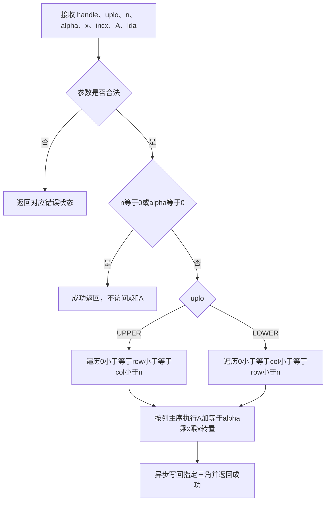
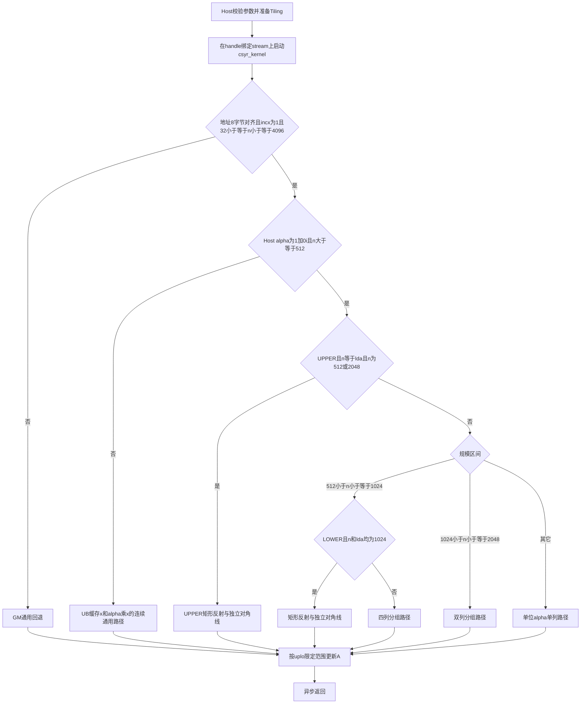

# aclblasCsyr 算子设计文档

| 项目 | 内容 |
| --- | --- |
| 算子名称 | `aclblasCsyr` |
| 任务名称 | CANN训练营东南大学-aclblasCsyr算子开发（950） |
| 目标硬件 | Ascend 950PR（arch35） |
| 软件版本 | CANN 9.1.0 |
| 开发方式 | Ascend C Kernel 直调 |
| 数据类型 | COMPLEX64（实部、虚部均为 FLOAT32） |
| 对标接口 | cuBLAS `cublasCsyr` |
| 合入仓及目录 | `cann/ops-blas`，`blas/syr/arch35/` |
| 当前设计候选提交 | `cf44e5cc668c59d793ba9d86c5715bb2b26b79e8` |
| 当前验证映射 | 服务器提交 `efc0cd008a787f7800cc273238ff1cedd952e191`，Git tree `af1ccae8ff14f8b92f03997e3f58b25899e6d788` 与本地一致 |
| 文档状态 | CSYR-026 设计与自测说明；目标机自测通过，设计评审与合入以 PR 状态为准 |

# 1. 需求背景（required）

## 1.1 需求来源

本需求来自 CANN 训练营东南大学专场“aclblasCsyr 算子开发（950）”社区任务。任务要求在 Ascend 950PR 上，基于 `cann/ops-blas` 工程，使用 Ascend C/CATLASS 完成单精度复数对称秩-1更新接口 `aclblasCsyr` 的公共 API、Host 参数处理、Device Kernel、测试代码、算子 README 和自测材料。

算子语义对齐 cuBLAS `cublasCsyr`。Netlib BLAS 没有复数 `csyr`，所以测试工程按公式自行生成 golden；三角引用、列主序和负步长遍历遵循 BLAS SYR 约定。

## 1.2 背景介绍

`aclblasCsyr` 属于 BLAS Level 2，对列主序复数对称矩阵执行原地秩-1更新：

```text
A := alpha * x * x^T + A
```

其中 `x^T` 是普通转置，不取共轭。`uplo` 指定唯一被引用和更新的上三角或下三角，另一三角不读不写；对角元素按普通复数计算，虚部不强制清零。接口通过 `handle` 使用调用方绑定的 stream 异步下发 Kernel。

### 1.2.1 aclblasCsyr 算子实现优化

任务不仅要求实现完整的 `cublasCsyr` 对齐语义，还要求四个指定规模在 Ascend 950PR 上达到任务书给出的平均耗时门槛。实现从功能正确的通用 GM 路径开始，逐步引入全 AIV 核调度、连续 complex64 的 `float2` 成对访存、单位 alpha 快路径、通用 alpha 的 UB 预计算，以及针对中等规模的双列/四列分组，以降低小矩阵下“一核一列”造成的核内线程闲置。

优化不得改变公开接口、三角访问范围、负步长、Host/Device alpha、Inf/NaN 传播、padding 和 guard 不变性。任何候选版本必须在目标硬件上重新完成构建、正确性和性能验证后，才能作为验收交付版本。

### 1.2.2 标杆算子现状分析

本任务的标杆是 NVIDIA cuBLAS 的 `cublasCsyr`，不是原有 TBE 算子，也不通过 ACLNN 框架调用。因此 CheckList 中“获取 TBE 源码并与 ACLNN 接口核对”的检查项对本任务不适用。cuBLAS 实现源码未公开，本设计以任务书、cuBLAS 公开接口文档和 BLAS SYR 数学定义作为可核验依据，不声称与不可见的 cuBLAS 内部 Kernel 实现一致。

#### 1.2.2.1 标杆算子支持的数据类型和数据格式

| 项目 | cuBLAS `cublasCsyr` | 本任务 `aclblasCsyr` |
| --- | --- | --- |
| 标量、向量和矩阵类型 | 单精度复数 `cuComplex` | COMPLEX64，实部和虚部均为 FLOAT32 |
| 矩阵布局 | 列主序 | 列主序 |
| 更新区域 | `CUBLAS_FILL_MODE_UPPER/LOWER` | `ACLBLAS_UPPER/LOWER` |
| 向量步长 | 非零 `incx`，支持正负值 | 任意非零正负 `incx` |
| 运算 | `A := alpha*x*x^T + A` | 相同，普通转置而非共轭转置 |
| 标量位置 | 由 cuBLAS pointer mode 决定 | Host 或 Device alpha |

任务算子信息以 `aclblasCsyr_Atlas950PR_task_doc.md` 和 `test_cases/README.md` 为准；两者共同限定 COMPLEX64、接口参数、正式性能点和验收口径。公共接口声明文件为 `include/cann_ops_blas.h`。

#### 1.2.2.2 标杆算子实现描述与资料路径

- 任务要求：`aclblasCsyr_Atlas950PR_task_doc.md`。
- 测试规格：`test_cases/README.md`、`test_cases/verify_performance.py`。
- 标杆公开接口：NVIDIA cuBLAS 文档的 `cublas<t>syr()` 章节，其中本任务对应 `cublasCsyr`。
- 本地 golden：测试代码按 `A(i,j)+=alpha*x(i)*x(j)` 独立实现，只计算 `uplo` 指定三角。
- 不适用项：没有可引用的 TBE 源文件，也没有 ACLNN 复用源码；代码交付目录是 `cann/ops-blas` 的 `blas/syr/arch35/`。

#### 1.2.2.3 标杆算子实现流程图



# 2. 需求分析（required）

## 2.1 外部组件依赖

| 组件 | 用途 | 依赖边界 |
| --- | --- | --- |
| CANN 9.1.0 / Ascend C 编译工具链 | 编译 arch35 Host 和 Device 代码 | 目标架构 `dav-3510` |
| AscendCL Runtime | stream、Device 内存和 Kernel 下发 | 通过现有 `aclblasHandle` 间接使用 |
| GoogleTest | 功能、精度、异常和内存保护测试 | 只用于测试，不进入生产库 |
| msprof | 采集 Kernel task time | 只用于性能证据，不改变执行逻辑 |
| cuBLAS 公开文档 | 标杆接口与语义参考 | 不链接 cuBLAS 库，不依赖其闭源实现 |

本算子不依赖 TBE、ACLNN、PyTorch 或第三方复数库，不申请额外 workspace。

## 2.2 内部适配模块

| 模块 | 适配内容 |
| --- | --- |
| `include/cann_ops_blas.h` | 新增 `aclblasCsyr` 公共 API 声明 |
| `aclblasHandle` 与 stream | 复用已有句柄、stream 和异步下发机制 |
| 平台能力查询 | 复用 `GetAivCoreCount()` 获取目标机 AIV 核数 |
| Host 参数与状态码 | 复用仓内指针位置判断、异常返回和日志约定 |
| `blas/CMakeLists.txt` | 将 arch35 Host/Kernel 源码加入生产构建 |
| `test/syr/csyr/` | 加入 GTest、任务 CSV 和独立性能 harness |

## 2.3 需求模块设计

### 2.3.1 Ascend C 算子原型与功能

公共接口声明位于 `include/cann_ops_blas.h`：

```cpp
aclblasStatus_t aclblasCsyr(
    aclblasHandle_t handle,
    aclblasFillMode_t uplo,
    const int n,
    const aclblasComplex* alpha,
    const aclblasComplex* x,
    const int incx,
    aclblasComplex* A,
    const int lda);
```

接口参数顺序与 `cublasCsyr` 一致，不新增仅供 Ascend 950PR 使用的平行 API。

### 2.3.2 Ascend C 算子相关约束与异常行为

| 参数 | 位置 | 约束与语义 | 异常行为 |
| --- | --- | --- | --- |
| `handle` | Host | 有效句柄，携带 stream | 空指针返回 `ACLBLAS_STATUS_HANDLE_IS_NULLPTR` |
| `uplo` | Host | `ACLBLAS_UPPER` 或 `ACLBLAS_LOWER` | 非法枚举返回 `ACLBLAS_STATUS_INVALID_ENUM` |
| `n` | Host | `n>=0`；`n==0` 为合法 no-op | `n<0` 返回 `ACLBLAS_STATUS_INVALID_VALUE` |
| `alpha` | Host/Device | complex64 标量；`n>0` 时不可为空 | 非法空指针返回 `ACLBLAS_STATUS_INVALID_VALUE` |
| `x` | Device | 逻辑长度 `n`，物理长度至少 `1+(n-1)*abs(incx)` | 非零 alpha 且为空时返回 `ACLBLAS_STATUS_INVALID_VALUE` |
| `incx` | Host | 以复数元素为单位，支持任意非零正负值 | `incx==0` 返回 `ACLBLAS_STATUS_INVALID_VALUE` |
| `A` | Device | 列主序，至少 `lda*n` 个 complex64，原地更新 | 非零 alpha 且为空时返回 `ACLBLAS_STATUS_INVALID_VALUE` |
| `lda` | Host | `lda>=max(1,n)` | 不满足时返回 `ACLBLAS_STATUS_INVALID_VALUE` |

与标杆接口相比，本任务未缺失 `uplo/n/alpha/x/incx/A/lda` 功能；接口名称、句柄类型和状态码使用 CANN 自有定义。任务书未要求 batched、strided-batched、图框架封装或其它数据类型，这些不属于本接口范围。

### 2.3.3 数学与内存边界

- UPPER：只读写 `0<=row<=col<n`。
- LOWER：只读写 `0<=col<=row<n`。
- 未指定三角和 `lda` padding 不得读取或写回。
- 更新不包含共轭，对角虚部参与计算。
- 每个有效矩阵元素只由一个 Block 内的一个线程写入，无原子操作和跨核写冲突。
- 通用矩阵地址使用 64 位计算；固定 512/1024/2048 专用路径经上界证明使用安全的 32 位元素偏移。

### 2.3.4 quick return 与标量位置

1. `n==0` 时直接成功返回，不解引用其它数据指针。
2. Host `alpha==(0,0)` 时直接成功返回，不访问 `x/A`。
3. Device `alpha` 的正常路径不为判零同步回 Host；Kernel 读取标量并在零值时退出。
4. Device `alpha` 与空 `x/A` 同时出现时，为区分合法零值 no-op 和非零值非法指针，Host 使用页锁定临时缓冲区执行同 stream D2H 并同步；这是异常参数路径，不影响正常异步路径。
5. Host `alpha==(1,0)` 且 `n>=512` 时可进入单位标量快路径；该路径仍保留零乘项，确保 `0*Inf=NaN` 的传播；所有路径的复数乘积都先独立舍入再加减。

### 2.3.5 需求拆解

1. 提供公共 API、arch35 Host 和 Kernel 实现。
2. 覆盖 UPPER/LOWER、正负 `incx`、padding `lda`、Host/Device `alpha` 和异常参数。
3. 连续输入使用低开销 SIMT 快路径；跨步和范围外输入使用通用 SIMT 路径。
4. 动态获取 AIV 核数，不硬编码具体卡型核数。
5. 完成任务附件 1200 条 CSV 和 6 个额外 fixture，并保存可复现性能证据。

# 3. 详细设计（required）

## 3.1 调用方式

本任务采用 **Ascend C Kernel 直调**，不经过 ACLNN、TBE 或 PyTorch 框架。调用方通过 `aclblasCsyr` 传入 `aclblasHandle`，Host 侧完成参数校验、alpha 指针位置处理、Tiling 数据准备和 Kernel 启动；Kernel 在句柄绑定的 stream 上异步执行。除 Device alpha 与空数据指针的异常组合外，接口不引入 Host 同步。

## 3.2 需求总体设计

### 3.2.1 数学与数据表示

令：

```text
alpha = ar + i*ai
x(k)  = xr(k) + i*xi(k)
```

先按 FP32 顺序计算：

```text
axReal(i) = ar*xr(i) - ai*xi(i)
axImag(i) = ar*xi(i) + ai*xr(i)
```

再更新矩阵元素：

```text
updateReal = axReal(i)*xr(j) - axImag(i)*xi(j)
updateImag = axReal(i)*xi(j) + axImag(i)*xr(j)
Ar(i,j) += updateReal
Ai(i,j) += updateImag
```

complex64 在 GM 中以两个相邻 FP32 存储。连续快路径用 `float2` 做单次 8 Byte 成对加载/存储，但实虚算术仍显式使用保证独立乘积舍入的标量表达式，不使用已经实测退化的 `float2` 打包算术运算符。

### 3.2.2 工程使能与文件布局

新增或修改以下工程文件：

- `include/cann_ops_blas.h`：公共接口声明。
- `blas/syr/arch35/csyr_host.cpp`：校验、标量处理、tiling 和启动。
- `blas/syr/arch35/csyr_kernel.cpp`：连续快路径与通用回退路径。
- `blas/syr/arch35/csyr_kernel.h`：tiling 数据与 Kernel launcher 声明。
- `blas/CMakeLists.txt`：加入生产源码。
- `test/syr/csyr/`：CMake、GTest、任务 CSV 和独立性能 harness。
- `blas/syr/README.md`、公共 API 文档：补充产品支持与接口说明。

构建目标架构为 `dav-3510`。工程默认构建实际 ASC flags 为 `-O0 -g`；实现与证据均未通过修改全局 CMake 构建类型规避默认条件。

## 3.3 Host 侧设计

### 3.3.1 参数校验流程

```text
handle 判空
  -> n<0 拒绝
  -> n==0 成功返回
  -> 校验 uplo/lda/incx/alpha
  -> 判断 alpha 指针位置
  -> Host 零 alpha 或 Device 零 alpha+空数据指针语义处理
  -> 非零时校验 x/A
  -> 获取 AIV Core 数并启动 Kernel
```

普通 Device alpha 路径保持异步。只有 Device alpha 与空数据指针组合需要 D2H 同步辨别语义。

### 3.3.2 分核与线程策略

Host 通过平台接口 `GetAivCoreCount()` 获取可用 AIV 核数：

```text
numBlocks = min(n, aivCoreNum)
numThreads = (n <= 512) ? 512 : 1024
```

目标机当前实际启动 56 个 AIV Block。以下是保留的通用列路径；1024 LOWER 和 512/2048 UPPER 专用路径采用 3.4.3.1–2 节的元素分配。通用路径中每个 Block 循环领取列：

```text
col = blockIdx.x; col < n; col += gridDim.x
```

普通路径和单位 alpha 单列路径中，同一列始终由同一 Block 处理，Block 内线程按行步进。当前设计候选对中等规模的单位 alpha 路径进一步分组：

```text
512 < n <= 1024: COLUMN_GROUPS=4, groupThreads=1024/4=256
1024 < n <= 2048: COLUMN_GROUPS=2, groupThreads=1024/2=512
其它单位 alpha 正式规模: COLUMN_GROUPS=1, groupThreads=1024
```

分组后每个 Block 同时处理相邻的 2 或 4 列，线程组内仍以 `groupThreads` 为行步长。每个 `(row,col)` 只属于一个线程组，不发生共享写入。UPPER 和 LOWER 的长短列通过循环领取列组在各 Block 间摊分。

### 3.3.3 数据分块和 Local Memory 优化策略

- 单位 alpha 路径直接从 GM 读取 x 和 A，不申请 UB；一般路径的分块单位为一个 Block 领取的 1、2 或 4 列；1024 LOWER 和 512/2048 UPPER 专用路径直接均分三角元素。
- 连续通用 alpha 路径将长度不超过4096的 x 和 `alpha*x` 各缓存一份到 UB，避免在每个矩阵元素上重复计算 alpha 缩放。
- complex64 以 `float2` 表示，每个元素为8 Byte。UB 占用公式为：

```text
xUb  = 4096 * sizeof(float2) = 4096 * 8 = 32768 Byte
axUb = 4096 * sizeof(float2) = 4096 * 8 = 32768 Byte
总 UB = 32768 + 32768 = 65536 Byte
```

- `n>4096`、`incx!=1` 或小尺寸配置不驻留完整向量，转入 GM 通用回退路径，UB 占用为0，保证规格覆盖不受 UB 容量限制。

### 3.3.4 Tiling 数据

| 字段 | 类型 | 含义 |
| --- | --- | --- |
| `numThreads` | `uint32_t` | SIMT 线程数 |
| `n` | `uint32_t` | 矩阵阶数 |
| `lda` | `uint32_t` | 列主序前导维 |
| `uplo` | `uint32_t` | 上/下三角模式 |
| `alphaReal/alphaImag` | `float` | Host alpha 值；Device alpha 时由 Kernel 覆盖 |
| `alphaIsDevice` | `uint32_t` | alpha 指针位置标志 |
| `incx` | `int64_t` | 逻辑向量步长 |

Tiling 不含数组，满足仓库 tiling 数据规范。

### 3.3.5 TilingKey 规划策略

本算子是 Kernel 直调接口，没有独立的算子编译 TilingKey，也不生成按 shape 枚举的 TilingKey。Host 只传递上表中的固定 Tiling 数据；Kernel 入口根据 `n`、`incx`、`alphaIsDevice`、`alphaReal/alphaImag` 和 `uplo`，以及 x/A 地址的 8 字节对齐情况选择模板实例。

不新增 Host TilingKey。Kernel 根据参数选择通用列模板或已验证的固定尺寸三角映射模板；后者在主循环内进行反射条件判断。

## 3.4 Kernel 侧设计

### 3.4.1 路由

下表中的 float2 快路径均额外要求 x 和 A 地址满足 8 字节对齐；公开 complex64 类型只要求 4 字节自然对齐，不满足成对访问条件时先进入 GM 回退。

| 路径 | 条件 | 用途 |
| --- | --- | --- |
| 512/2048 UPPER 专用路径 | `n==lda && n∈{512,2048} && uplo==UPPER && incx==1 && Host alpha==(1,0)` | 右矩形反射，循环外处理左半区对角线 |
| 1024 LOWER 专用路径 | `n==lda==1024 && uplo==LOWER && incx==1 && Host alpha==(1,0)` | 均分矩形反射元素，主循环外处理右半区对角线 |
| 连续单位 alpha 四列分组 | `incx==1 && Host alpha==(1,0) && 512<n<=1024` | 排除上述专用条件；每 Block 四个256线程组并行处理四列 |
| 连续单位 alpha 双列分组 | `incx==1 && Host alpha==(1,0) && 1024<n<=2048` | 排除上述专用条件；每 Block 两个512线程组并行处理两列 |
| 连续单位 alpha 单列 | `incx==1 && 512<=n<=4096 && Host alpha==(1,0)` 且不满足上述分组和专用条件 | 覆盖非专用 n=512、n>2048；每 Block 每轮处理一列 |
| 连续通用 alpha | `incx==1 && 32<=n<=4096` 且不满足上述单位 alpha 条件 | x/alpha*x 在 UB 中预计算一次，支持 Host/Device alpha |
| GM 通用回退 | x/A 未满足 8 字节对齐，或 `incx!=1`、`n<32`、`n>4096` | 覆盖任意非零正负步长和范围外规模 |

`n>=512` 仍是单位 alpha 专用路径的规模边界。CSYR-026 保留既有三角映射，但取消省略零乘项的处理：

```cpp
axReal = xRow.x - 0.0f * xRow.y;
axImag = xRow.y + 0.0f * xRow.x;
updateReal = __fma(axReal, xCol.x, 0.0f) - __fma(axImag, xCol.y, 0.0f);
updateImag = __fma(axReal, xCol.y, 0.0f) + __fma(axImag, xCol.x, 0.0f);
```

这里每个 `__fma(a,b,0)` 只用于独立舍入一个 FP32 乘积，随后再相加减。它防止普通 `a*b +/- c*d` 被收缩后，在两个有限乘积溢出时产生不同的 Inf/NaN 分类。通用 alpha 的乘法也采用同样处理。在当前 Debug 编译配置下，直接表达式比等价辅助函数封装有明显性能优势；保留实测结果，避免引入封装版本的额外开销。

### 3.4.2 连续单位 alpha 单列快路径

模板 `CsyrUbCyclicColumns<UPLO_IS_UPPER, true>` 使用 `LAUNCH_BOUND(1024)`。名称沿用统一模板，但单位 alpha 实例不访问 `xUb/axUb`：

1. 每个 Block 循环领取一列。
2. 以 `float2` 从 GM 成对读取 `x(col)`。
3. UPPER 的有效行范围为 `[0,col]`，LOWER 为 `[col,n-1]`。
4. 线程从 `rowStart+threadIdx.x` 开始，以 `blockDim.x` 步进。
5. 读取 `x(row)` 和 `A(row,col)`，按显式 FP32 复数公式更新，再成对写回 A。

该路径没有 `TPipe`、DataCopy 队列、同步或 workspace。它避免了对只有半个矩阵的 Level-2 任务引入逐列 DMA/队列固定开销。

### 3.4.3 连续单位 alpha 分组列快路径

模板 `CsyrUnitAlphaGroupedColumns<UPLO_IS_UPPER, COLUMN_GROUPS>` 把1024个线程均分为固定线程组：

```text
groupThreads = 1024 / COLUMN_GROUPS
columnGroup = threadIdx.x / groupThreads
rowLane = threadIdx.x % groupThreads
baseCol = blockIdx.x * COLUMN_GROUPS
columnStride = gridDim.x * COLUMN_GROUPS
col = baseCol + columnGroup
```

每个线程组处理一列，组内线程按 `rowLane` 遍历该列的有效三角行。四列分组用于 `512<n<=1024`，双列分组用于 `1024<n<=2048`。一般输入仍按连续规模区间路由。1024 LOWER 以及 512/2048 UPPER 在 lda=n、incx=1、Host alpha=(1,0) 时使用下述三角元素映射；其余输入保留原算法分支。

### 3.4.3.1 1024 LOWER 三角元素映射

仅在 n=lda=1024、LOWER、incx=1、Host alpha=(1,0) 时进入
`CsyrUnitAlphaLowerTriangle1024`。Host 不缓存 alpha 地址或 AIV 核数，仍动态查询核数；本轮实测为 56 Block，每 Block 1024 线程。

主循环把 1024×512 个逻辑元素平均分配给整个网格，每个线程处理 9 或 10 个元素：

```text
index = blockIdx.x*blockDim.x + threadIdx.x
index += gridDim.x*blockDim.x
col = index >> 10
row = index & 1023
当 row < col：row = 1023-row，col = 1023-col
```

左半区下三角直接更新，原矩形上三角经反射映射到右半区严格下三角。
剩余右半区 512 个对角元素在主循环外处理，使用
`diagonal=blockIdx.x+threadIdx.x*gridDim.x` 分配。这样避免在每次主循环内判断对角尾部。
两部分合计 524800 个元素，互不重叠且完整覆盖下三角；最大复数偏移 1048575，使用 32 位偏移安全。

仍使用 `float2` 成对访存和原来的显式 FP32 复数公式，不使用共轭、原子操作、额外 workspace 或同步。
专用路径的尺寸比较在入口直接计算；两个比较没有副作用，布尔按位与会同时计算二者，避免引入尺寸辅助函数。
其他输入继续使用原分组、单位 alpha 单列、通用 alpha 或 GM 回退路径。

### 3.4.3.2 512/2048 UPPER 三角元素映射

`CsyrUnitAlphaUpperTriangle<SIZE_SHIFT>` 在 N=512/2048 时实例化为 `<9>/<11>`。
适用条件见路由表。取右半区 N×(N/2) 矩形，令 col=N/2+(index>>SIZE_SHIFT)、row=index&(N-1)。
若 row>col，同时反射为 (N-1-row,N-1-col)，映射至左半区严格上三角。
左半区 N/2 个对角元素在主循环外按 blockIdx.x+threadIdx.x*gridDim.x 分配。
直接部分、反射部分、对角部分互不重叠，合计 N(N+1)/2 个元素。

56 Block 实测下，512 使用每 Block 512 线程，主循环每线程 4/5 次；2048 使用 1024 线程，每线程 36/37 次。
尺寸与列步幅为编译期常量；用移位/掩码和安全 32 位元素索引寻址。
所有有效 A 元素仍各更新一次，不声称减少矩阵数据流量；主要设计目的为均衡有效工作和简化循环。
通用 UPPER 分支移入 `CsyrUpperStandard`，保持原算法；四个性能点直接调用 VF。
完整坐标证明、版本对比与局限见优化细节文档。

### 3.4.4 连续通用 alpha 路径

模板 `CsyrUbCyclicColumns<UPLO_IS_UPPER, false>` 为每个 Block 静态分配：

- `xUb[4096]`：4096 个 `float2`，32 KiB；
- `axUb[4096]`：4096 个 `float2`，32 KiB。

流程如下：

1. Device alpha 时由 Kernel 读取实部/虚部；零值立即退出。
2. Block 内线程协作把连续 x 成对复制到 `xUb`，同步。
3. 每个向量元素只计算一次 `alpha*x(row)` 并写入 `axUb`，同步。
4. 后续循环领列时复用 `xUb[col]` 与 `axUb[row]`，避免为每个矩阵元素重复计算 alpha 缩放。

静态 UB 有效载荷为 64 KiB，不使用额外 workspace。

### 3.4.5 GM 通用回退路径

通用模板按全网格行线程分配：

```text
row = blockIdx.x*blockDim.x + threadIdx.x
row += gridDim.x*blockDim.x
```

逻辑向量索引到物理索引的映射为：

```text
incx > 0: physical(i) = i*incx
incx < 0: physical(i) = (n-1-i)*(-incx)
```

每个线程加载当前行 x，计算一次 `alpha*x(row)`，再遍历该行属于指定三角的列。该路径优先保证完整规格正确性，不承担四个连续输入性能点。

### 3.4.6 Ascend C 实现流程图



## 3.5 Ascend C 与标杆算子实现差异及原因

由于 cuBLAS Kernel 源码不可见，只比较公开语义与本任务实现方案，不推断其内部并行结构。

| 对比项 | 标杆公开语义 | Ascend C 实现 | 差异原因 |
| --- | --- | --- | --- |
| 对外句柄 | `cublasHandle_t` | `aclblasHandle_t` | 复用 CANN BLAS 运行时和状态码体系 |
| 并行划分 | 公开文档未说明 | 56个AIV Block分配列、列组或三角元素 | 适配 Ascend 950PR AIV 核与三角负载 |
| 复数运算 | COMPLEX64 SYR | 显式 FP32 实虚标量表达式 | 固定计算顺序，便于精度核对 |
| 连续访存 | 公开文档未说明 | complex64 使用8 Byte `float2` 成对访存 | 减少实部、虚部分离访存指令 |
| 通用 alpha | 公开文档未说明 | UB 中缓存 x 和 `alpha*x` | 避免矩阵元素级重复缩放 |
| 非连续步长 | 支持非零 `incx` | GM 通用回退并显式映射负步长 | 不让 UB 快路径限制完整规格 |
| workspace | 公开文档未说明 | 不申请额外 workspace | 保持调用简单并避免额外分配、同步 |

两者在公开可验证的数学公式、列主序、指定三角、普通转置、参数顺序和异步句柄语义上保持一致；实现差异只用于适配目标硬件与性能约束。

## 3.6 正确性与并发保证

- UPPER 有效范围为 `[0,col]`，LOWER 为 `[col,n-1]`；专用矩形反射映射完整覆盖指定三角且每元素恰好一次。
- 通用回退虽按行分配，但每个 `(row,col)` 也只有一个线程访问。
- 未选三角、padding 和 guard 不进入地址范围。
- `x` 只读；A 原地更新。
- Kernel 内无跨 Block 归约、原子操作或共享写入。
- Host alpha、Device alpha、正负步长使用相同数学公式。

## 3.7 已验证与已停止的方案

CSYR-025 在 CSYR-023 基础上增加 512/2048 UPPER 元素映射，仅修改 arch35 Kernel（63 行新增、16 行删除）。
先以 CSYR-024 验证 2048，再以 CSYR-025 模板化并增加 512；两次初筛均通过，该历史轮次门禁绑定 acec7ba；CSYR-026 的新门禁与结果见第 7 节。
CSYR-023 的 4138600 保留为直接回退；更早 ea8866c 及 CSYR-012–023 所有失败实验和原始证据继续保留。
此前尺寸辅助函数、UB 缓存、蛇形、shuffle、fmaf、Host 缓存等失败实验本轮没有重复。
CSYR-025 的映射优化保留于当前实现；CSYR-026 的边界修复及最新结果见第 7 节。

# 4. 支持硬件（required）

| 硬件 | 状态 | 说明 |
| --- | --- | --- |
| Ascend 950PR（arch35） | 已完成目标编译和实测 | CANN 9.1.0，目标架构 `dav-3510` |
| A2/A3（arch22） | 不在本任务承诺范围 | 不复用 arch22 资源参数或性能结论 |
| 其它产品 | 未承诺 | 需对应产品线提供实现并独立验证 |

公共接口声明可供其它产品线共用，但本任务只交付 arch35 实现。

# 5. 算子约束限制（required）

1. 数据类型固定为 COMPLEX64。
2. A 固定为列主序原地更新。
3. `uplo` 仅支持 UPPER/LOWER。
4. `n>=0`，`lda>=max(1,n)`，`incx!=0`。
5. `alpha` 可位于 Host 或 Device；x/A 位于 Device。
6. 算法执行普通转置，不取共轭，不强制对角虚部为零。
7. 连续快路径上限为 `n=4096`；更大规模走通用回退，功能正确但性能不作本任务承诺。
8. 不使用额外 workspace。

# 6. 特性交叉分析（required）

| 特性 | 交叉影响 | 处理方式 |
| --- | --- | --- |
| UPPER/LOWER | 有效行范围相反 | 编译期模板分支，避免内层动态判断 |
| 负 `incx` | BLAS 逻辑起点不同 | 通用路径以反向物理索引映射 |
| Device alpha | 常规 D2H 会破坏异步 | 正常路径在 Kernel 读取；仅异常空指针组合同步辨别 |
| alpha 为零 | 允许 x/A 为空 | Host 零值直接返回，Device 零值由异常路径或 Kernel 处理 |
| alpha 为一 | 省略零乘项会影响 Inf/NaN | 专用路径也保留零乘项；新增跨路由极值回归 |
| `lda>n` | 存在 padding | 只按有效 row 范围寻址，不访问 padding |
| 非对齐 GM 基址 | 自然 4 字节对齐不足以支持 float2 | x/A 均满足 8 字节时成对访问，否则回退标量 GM |
| 有限大数溢出 | 收缩运算改变 Inf/NaN 分类 | 显式独立舍入乘积后加减，复用原 golden 判定 |
| 大规模 | 连续 UB 容量不足 | `n>4096` 自动回退 GM 通用路径 |

# 7. 可维可测分析

## 7.1 精度与功能标准

测试 golden 独立实现 `A(i,j)+=alpha*x(i)*x(j)`，实部、虚部分别比较。标准为：

- 实部、虚部分别按 FLOAT32 混合误差标准判定：`atol=2^-16`、`rtol=2^-10`；
- 逐元素条件为 `|actual-golden| <= atol + rtol*|golden|`，匹配比例至少 `0.99`；
- 同时逐元素检查绝对误差上限 `max(1e-2, 32*ULP(|golden|))`；
- NaN/Inf 按符号与分类规则对齐；
- 未选三角、padding、x 有效区和前后 guard 逐 bit 不变；
- 非法参数返回指定状态码且不得修改数据。

当前候选 `cf44e5cc668c59d793ba9d86c5715bb2b26b79e8` 对应服务器 `efc0cd008a787f7800cc273238ff1cedd952e191`，tree 为 `af1ccae8ff14f8b92f03997e3f58b25899e6d788`。
固定 smoke 16/16、原全量 1206/1206 均通过，原全量耗时 86.565 s；新增三个 fixture 的 408/408 边界子用例通过。源码/测试提交完成验证后只追加 README 文档提交，增量构建前后源码和三个二进制 SHA256 一致，见验收包 evidence/version-proof/ 中的 verification.json 和 pre-docs-source-binary.sha256。
failures/errors/disabled/skipped 均为 0，保留完整 XML 和日志。

## 7.2 性能标准与已归档结果

以下采用开发者在服务器实际执行并截图的最新记录 `csyr026-live-screenshots-Gu6iBT`。原始日志、CSV、XML 及 13 张终端截图随验收包提供。

四点均为 COMPLEX64、列主序、lda=n、incx=1、Host alpha=(1,0)。最终正确性通过后重新采集正式 Event，
每项 warmup 20、samples 101；算术均值包含全部原始样本，不扣空 Event，不改 benchmark、门槛或计时区间。

| n / uplo | 门槛 μs | 正式 Event 均值 μs | msprof task 均值 μs |
| --- | ---: | ---: | ---: |
| 512 / UPPER | 9.90 | 8.258911 | 4.849941 |
| 1024 / LOWER | 11.00 | 9.947495 | 6.566667 |
| 2048 / UPPER | 23.64 | 21.250871 | 17.920745 |
| 4096 / LOWER | 130.79 | 122.697277 | 120.660588 |

两种口径均 4/4 通过。4096 Event 高于历史 CSYR-025 的 99.446307 μs，但修复边界语义后仍满足 130.79 μs。其它规模差异未做交错基线对照，不据此宣称普遍性能提升。严格乘积辅助函数版本曾出现性能回退，直接表达式版本通过完整门禁。

msprof 使用 `--task-time=l1 --ai-core=off`，284 条 csyr_kernel 依时间分四组，每组 20 warmup 后取 51 个 task，Block Num 均为 56。
正式构建保持默认 Debug，ASC `-O0 -g`，目标 dav-3510。源码、原始样本、复算脚本、环境与二进制哈希一同归档。

## 7.3 测试覆盖

- 1200 条任务 CSV：普通精度、边界、正负步长、padding、Inf/NaN、Host/Device alpha、性能/内存场景。
- 原有 6 个 fixture：接口、无效调用内存保护，以及 100 个确定性随机 alpha 样本。
- 固定 16 项 smoke：双三角、主要规模、padding、Device alpha 和负步长。
- 原有 1206 项 GTest，及新增 3 个 GTest（内部共 408 子用例）：148 路由、176 极值、84 独立/联合地址偏移。分开运行并保存 XML，合计 1209 项。
- 四项 ACL Event：每项 20 warmup + 101 samples。
- 四项 msprof task-time：每项 20 warmup + 51 samples。

上述数量均已在当前候选对应的 CSYR-026 可审计证据集合中归档。代码如有任何变化，必须生成新提交并重新执行受影响验证，不能沿用本轮结论。

## 7.4 兼容性与维护性

- 复用 `aclblasHandle`、stream、状态码和平台核数查询。
- 公共头文件只新增一个 API，不改变已有接口 ABI。
- UPPER/LOWER 和 alpha 路径使用模板实例，内层循环保持简单。
- 快路径和回退路径位于同一 arch35 Kernel 源文件，路由集中在 Kernel 入口。
- 失败或无收益实验、提交号、原始 CSV 和回退点均记录在 `cloud-operators/docs/history/`。

## 7.5 风险与应对

| 风险 | 影响 | 应对 |
| --- | --- | --- |
| 正确性修复存在性能代价 | 4096 比旧版耗时增加但仍达标 | 保留真实数据，采用同时满足正确性与四项性能门槛的版本 |
| 浮点化简或收缩改变边界行为 | Inf/NaN 不一致 | 保留零乘项和独立乘积舍入；跨路由极值回归 |
| Device alpha 判零引入同步 | 正常调用性能下降 | 常规路径在 Device 判断，仅异常空指针组合 D2H |
| 三角列工作量不均 | 核间负载不平衡 | Block 按固定步长循环分配列，56 核覆盖 |
| UB 容量上限 | `n>4096` 无法驻留 | 自动回退 GM 通用路径 |
| 文档与代码漂移 | 评审无法复现 | 设计绑定 `cf44e5c`，验证结果按实际被测提交单独标识；代码变化后同步更新 |

# 8. 交付与验收

交付内容包括：

1. 本设计文档；
2. `aclblasCsyr` 公共接口、Host、Kernel 和构建接入；
3. 算子 README、测试代码与任务 CSV；
4. 1206/1206 原全量、3/3 新增 fixture（408 子用例）正确性日志与 XML；
5. 四项 ACL Event 原始 CSV、汇总日志；
6. msprof `op_summary.csv`、独立复算摘要和计时口径说明；
7. 自测报告、必要截图、代码分支/提交号和 PR 链接。

当前自测通过候选为 `cf44e5c`。它继承既有三角映射，修复单位 alpha 的 Inf 传播、自然对齐地址和有限大数乘积溢出问题。旧 `acec7ba` 保留作历史复现，因已发现边界缺陷不再推荐作为新交付候选。交付代码仓为 `2401_85860193/ops-blas-aclblasCsyr`，分支 `fix/aclblasCsyr-ieee-alignment`。自测通过不等于社区设计合入或平台验收通过。后续源码、测试口径或构建变化必须重新完成受影响验证。

## 8.1 设计评审与验收流程

1. 设计文档通过 PR 提交到 `cann/cann-ops-competitions:master`，目录为 `04_tasks/01_community-task-2026/tasklist/09-29-aclblasCsyr-950/2401_85860193/docs/design.md`。
2. 设计 PR 标题为 `【CANN社区任务】aclblasCsyr算子设计文档`；创建或更新后按活动要求通知评审人，并逐项处理意见。
3. 任务平台“更新进展”的设计文档链接填写设计 PR，代码链接按活动引导填写“暂无”。报名、设计提交、进展更新和交付件使用同一个报名账号，活动中不修改账号名。
4. 设计 PR 评审通过并合入后，保存合入截图；补齐任务书要求的测试用例、自测报告、精度与性能截图、实测内存数据及复验步骤，再申请平台验收。本文的自测通过结论不等于平台验收通过。
5. 验收说明注明可供审核的个人代码仓、分支、提交号及算子和测试目录，并按活动要求完成审核账号访问设置。
6. 后台测试通过后，按活动通知提交需求 issue 和正式代码 PR；首位通过测试者须在收到通知后 2 个工作日内完成此步骤。代码 PR 完成所需 CLA、检查与评审并合入后，再由平台完成最终验收。

# 9. 参考资料

1. 任务附件：`aclblasCsyr_Atlas950PR_task_doc.md`。
2. 任务附件：`test_cases/README.md`、`verify_performance.py`。
3. [cuBLAS cublasCsyr](https://docs.nvidia.com/cuda/cublas/index.html#cublas-t-syr)。
4. [CANN ops-blas](https://gitcode.com/cann/ops-blas)。
5. [Ascend C 编程指南](https://www.hiascend.com/document/detail/zh/CANNCommunityEdition/910/ascendcopdevg/atlas_ascendc_10_0001.html)。
6. [社区任务设计文档 CheckList](https://docs.qq.com/sheet/DUHVGUFdmSFRjVFFU?tab=000001)。
7. [社区任务流程及注意事项](https://gitcode.com/org/cann/discussions/39)。
