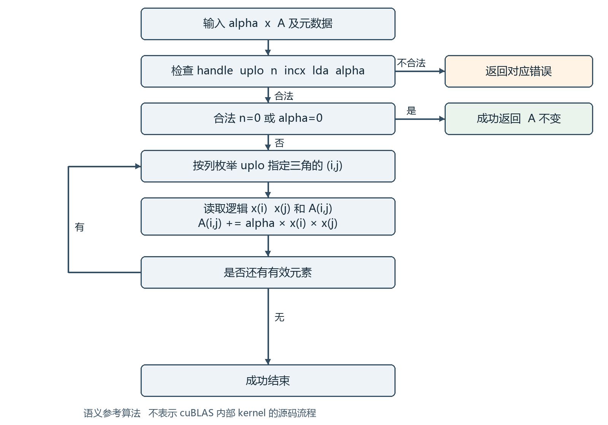
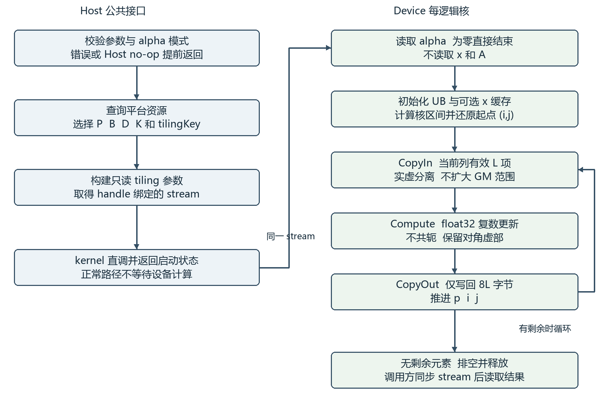

# aclblasCsyr 算子设计文档

时间：2026 年 9 月 7 日　

## 1 需求背景

### 1.1 需求来源

本项目通过昇腾 CANN 开发者训练营社区任务，为 ops-blas 新增单精度复数对称秩一更新接口 aclblasCsyr。接口行为对齐 cuBLAS cublasCsyr，工程采用 Ascend C kernel 直调模式，目标硬件为 Ascend 950PR，软件版本为 CANN 9.1.0。设计范围覆盖公共接口、Host 分发、Device kernel、测试与可维护性。

计算定义为 A ← A + alpha × x × xᵀ。其中 alpha、x 和 A 均为 complex64，xᵀ 是普通转置。仅 uplo 指定的三角区域参与运算并原地更新；另一三角不引用也不更新，对角虚部没有置零规则。本设计选择向量计算、有效三角线性分核和按列分段访存，不需要跨核归约。

### 1.2 背景介绍

### 1.2.1 算子实现优化与参考路径

这是 BLAS 新增接口开发任务，非现有 TBE 算子的 aclnn 迁移。CheckList 中的 TBE 源码文件、TBE 算子信息库和 aclnn 对应关系在本任务中不适用；其审核目的由公共接口、同族工程与标杆语义分析承接。不能为满足通用检查项而虚构 TBE 文件路径。

| 参考对象 | 路径或文件 | 在本设计中的用途 |
| --- | --- | --- |
| 公共接口 | ops-blas/include/cann_ops_blas.h | 新增 aclblasCsyr 声明 |
| 公共类型 | ops-blas/include/cann_ops_blas_common.h | 复数类型、句柄、枚举和状态码 |
| 同族实现 | ops-blas/blas/syr/arch35/ | 参考 aclblasSsyr 工程接入模式 |
| 同族测试 | ops-blas/test/syr/ssyr/ | 参考 CSV 与 GTest 接入 |
| 本任务实现 | ops-blas/blas/syr/arch35/ | 复数 Host 与 kernel 实现目录 |
| 本任务测试 | ops-blas/test/syr/csyr/arch35/ | 复数用例、golden 与测试接入 |

上述工程目录由任务书规定；同族源文件的实际文件名、导出规则及依赖版本应在固定 ops-blas commit 后补入实现记录。公共头文件名已经明确，不以未核实的私有 helper 名称作为现有接口使用。

### 设计状态与适用边界

本文是实现前设计，分块、缓存、流水及性能须经 950PR 编译和实测确认；测试尺寸不是 API 上限。Device alpha 适配、异常同步和特殊值规则列入第 5.3 节评审事项。

<!-- PAGEBREAK -->
## 1.2.2 标杆算子现状分析

### 1.2.2.1 数据类型与数据格式

cublasCsyr 的 alpha 为 cuComplex，x 与 A 为单精度复数；A 采用列主序，uplo 指定存储三角。aclblasCsyr 对应使用公共 aclblasComplex，实部和虚部各 float32。只对齐 Csyr 所要求的类型与行为，不把同一 cuBLAS 文档中 Ssyr、Dsyr、Zsyr 的其他类型并入本接口。

### 1.2.2.2 标杆语义实现描述

公开 cuBLAS 文档定义运算和接口，未给出其内部 kernel 源码；下图是依据接口语义构造的独立参考算法流程，不声称与 cuBLAS 内部调度、缓存或指令逐一一致。Netlib ssyr 是实数参考，只用于借鉴负步长和列主序遍历，不作为复数 golden 库。

对合法非 no-op 输入，按列 j 遍历有效行 i，以逻辑向量值计算 A(i,j)+=alpha×x(i)×x(j)，不求共轭。参考实现按相同公式独立生成 golden；状态码、特殊值和 no-op 另行判定，不用数值循环替代参数处理。

### 1.2.2.3 标杆语义参考流程图



该流程图用于检查数学语义和引用范围。特别是 n=0 与 alpha=0 不进入矩阵更新循环；“有效三角”包含对角，未指定三角没有任何读写步骤。参数检查先后及 Host/Device alpha 处理按第 3.1 节执行。

<!-- PAGEBREAK -->
## 2 需求分析

### 2.1 外部组件依赖

| 组件 | 要求及职责 | 适配验证方式 |
| --- | --- | --- |
| CANN 与 Ascend C | CANN 9.1.0；编译与运行 950PR kernel | 记录安装包版本，编译最小调用样例 |
| AscendCL Runtime | 设备、内存、stream、同步和计时 | 使用环境配套 API，验证非默认 stream |
| ops-blas | 公共 BLAS 接口、handle、构建与导出 | 固定 commit，核对公共头文件和同族模式 |
| C++ 测试与 GTest | CSV 参数化用例及自实现 golden | 构建并核对期望/实际执行 case 集合 |
| Python | CSV 管理、运行调度和报告整理 | 修正现有脚本的退出码与性能解析 |
| cuBLAS 文档 | cublasCsyr 语义参考 | 作为文档依据；非部署或 golden 依赖 |

CATLASS 不作为本设计的必需依赖。本算子是外积逐元素更新，首版使用 float32 Vector 运算；不引入 GEMM 的矩阵格式转换、Cube 数据类型转换或额外输出矩阵。

### 2.2 内部适配模块

Host 入口复用 ops-blas 的句柄和 stream 管理，禁止新建产品私有平行 API。使用公共 aclblasComplex 和状态码；编译期校验复数大小及实虚字段偏移，禁止未经验证就将任意结构体当作两项 float 访问。

Host 内部划分为参数校验、alpha 位置识别、资源查询、tiling 选择和 kernel 启动。设计中使用的 ResolveAlphaMode、BuildCsyrTiling 等名称只是内部职责名称，实际函数和文件名跟随仓库规范；不假定已有同名 helper 或公开指针模式接口。

Device 模块划分为逻辑索引、向量装载、复数计算、有效字节写回和队列同步。测试模块包括 CSV 适配、输入生成、独立 golden、双分量误差判定、内存保护及设备计时。

### 依赖与版本一致性

本地 asc-devkit-master 用于 API 和样例参考，最终实现以 CANN 9.1.0 安装头文件与固定仓库版本验证。950PR 的 DataCopyPad GMToUB 选择含 mode 模板参数原型；Gather 与 Scatter 的偏移单位为字节，均操作 UB LocalTensor，不是直接从 GM 任意 gather。

平台资源通过现有工程的平台能力对象取得。GetCoreNumAiv 返回 Vector 核数量，GetCoreMemSize 用于查询局部存储容量；实际启动参数需遵守工程对逻辑 Vector 核与调度 block 的映射，不能将 Cube 核数直接当作向量核数。

<!-- PAGEBREAK -->
## 2.3 需求模块设计

### 2.3.1 Ascend C 算子原型

```cpp
aclblasStatus_t aclblasCsyr(
    aclblasHandle_t handle, aclblasFillMode_t uplo, const int n,
    const aclblasComplex* alpha,
    const aclblasComplex* x, const int incx,
    aclblasComplex* A, const int lda);
```

| 参数 | 位置和类型 | 约束与语义 |
| --- | --- | --- |
| handle | Host 句柄 | 有效，携带调用 stream |
| uplo | Host 枚举 | ACLBLAS_UPPER 或 ACLBLAS_LOWER |
| n | Host int | n≥0；运行时矩阵阶数 |
| alpha | Host/Device 复数指针 | 非空；实虚均 float32；零值合法 |
| x | Device 复数向量 | n>0 时物理跨度至少 1+(n−1)×abs(incx) |
| incx | Host int | 非零；单位为复数元素，支持负值 |
| A | Device 复数矩阵 | 原地更新，列主序，物理布局 lda×n |
| lda | Host int | lda≥max(1,n)，单位为复数元素 |

UPPER 更新 0≤i≤j<n；LOWER 更新 0≤j≤i<n。A(i,j) 的复数元素地址是 A_base+i+j×lda。正步长起点 k0=0；负步长起点 k0=(n−1)×(−incx)，x(i)=x_base[k0+i×incx]。

### 2.3.2 算子相关约束与差异

CheckList 的原型和约束两项均标为“2.3.1”，本文将约束编号顺延为 2.3.2，保留两项内容。相对 cublasCsyr，目标是在任务范围内无功能缺项；Device alpha、负步长、padding 不能以“首版限制”永久排除。

只支持 complex64，不支持 complex128、FP16 复数、batch 或 packed 三角存储。A 的 lda padding 和 x 的 incx 间隔属于接口规定布局；不支持超出该语义的任意视图，不涉及广播。不返回新矩阵或视图，不要求位级确定性，不需要图框架动态 shape 注册，但 n 可在调用间变化。

A 与 x 的重叠、alpha 与被写 A 的别名不能当作已支持能力；实现不主动复制整份输入以覆盖未定义重叠行为，需在 README 与评审中说明。有效独立输入必须覆盖全部指定场景。n=0 或 alpha=0 为合法 no-op；不可通过写回镜像三角“恢复完整对称矩阵”。

地址跨度计算使用宽整数，并检查字节换算是否可表示。任意合法非零 incx 包含 INT_MIN；在求负值或绝对值前先提升为 int64，禁止 int32 的 abs 溢出。

<!-- PAGEBREAK -->
## 3 需求详细设计

### 3.1 调用方式和参数处理

调用方创建公共 handle，绑定 stream，准备 alpha/x/A，调用 aclblasCsyr；读取 Device 结果前同步同一 stream。实现使用 handle 绑定 stream 直调 kernel，不增加 aclnn 两阶段接口、PyTorch 算子注册或隐式默认 stream。

| 顺序 | 条件 | 处理结果 |
| --- | --- | --- |
| 1 | handle 为空 | HANDLE_IS_NULLPTR |
| 2 | uplo 非法 | INVALID_ENUM |
| 3 | n<0、incx=0 或 lda<max(1,n) | INVALID_VALUE |
| 4 | alpha 为空 | INVALID_VALUE |
| 5 | 以上合法且 n=0 | SUCCESS，不读取标量内容和 x/A |
| 6 | 可取得 alpha，且 alpha=(0,0) | SUCCESS，不访问 x/A 内容 |
| 7 | alpha 非零且 x/A 为空 | INVALID_VALUE |
| 8 | 正常计算路径 | 校验地址算术，分发并传播启动状态 |

表内省略状态码的 ACLBLAS_STATUS_ 前缀。单错误依据任务书；多个错误同时存在时，以上顺序是拟采用规则，须与固定工程及任务方确认，不能声称 cuBLAS 已验证相同优先级。

### Host alpha 与 Device alpha

Host alpha 在入口立即按公共类型复制实虚值；零值直接返回，非零值作为 kernel 标量参数传递，避免异步持有调用方 Host 栈地址。

Device alpha 的正常路径传递 Device 地址，由 kernel 按同一 stream 的先后依赖读取。在读取任何 x/A 前执行零值判断；不能为了选择 tilingKey 将 alpha 拷回 Host。使用受支持的精确长度 DMA 装载标量并同步，不复用未经失效处理的标量缓存值。

Device alpha 且 x/A 为空的组合涉及设备标量值与 Host 同步返回码之间的约束。该组合的最终返回语义和实现机制须在固定 ops-blas 的 pointer-mode/同族接口验证后确定；确认前不将 Host 同步拷贝作为最终方案。正常有效指针路径保持异步，不能用“先判空”悄悄改变语义。

参数异常和 Host no-op 不启动 kernel、不申请大缓冲。正常路径不分配算子专用 GM workspace；UB 内资源由每次 kernel 的 TPipe 管理。调用方保证输入、输出和 Device alpha 在 stream 完成前有效，并禁止其他 stream 无依赖地修改这些数据。

<!-- PAGEBREAK -->
## 3.2 需求总体设计

### 3.2.1 Host 侧设计

### 3.2.1.1 分核策略

采用“有效三角元素线性编号”分核。N=n(n+1)/2 是需要更新的复数元素总数。先以公共平台能力得到可用逻辑 Vector 核上限 C；初始配置 n≤32 时 P=1，否则 P=min(C,max(1,ceil(N/4096)))。4096 是初始每核目标工作量，不是平台常量；P 的性能最优值通过四项固定 case 实测选择。

令 q=floor(N/P)、r=N mod P。逻辑核 c 的区间为 [p_begin,p_end)：p_begin=c×q+min(c,r)，p_end=p_begin+q+[c<r]。所有核区间首尾相接，长度差至多 1，每个有效元素恰有一个写入者。N、区间和乘法均使用 int64/uint64 的可表示运算。

### 三角编号与二维下标还原

定义 S(j) 为第 j 列之前的有效元素数，0≤j≤n。

- UPPER：S(j)=j(j+1)/2；第 j 列包含 j+1 个元素。
- LOWER：S(j)=j(2n−j+1)/2；第 j 列包含 n−j 个元素。
- 对 p<N，用整数二分找到 S(j)≤p<S(j+1)。UPPER 的 i=p−S(j)；LOWER 的 i=j+p−S(j)。不使用浮点开方反推列号。

核只在起点做一次二分。后续按列推进，每段长度 L=min(B,列内剩余长度,p_end−p)，处理后 p+=L、i+=L；到列末则 j+=1，并按三角模式重置 i。段永不跨列，也不跨核边界。

### 小尺寸推演

n=4、UPPER 时 N=10，各列编号范围为 [0,1)、[1,3)、[3,6)、[6,10)。取 P=3，三个核区间为 [0,4)、[4,7)、[7,10)。第二核先处理第 2 列的 i=1,2，再处理第 3 列 i=0；不存在三角外访问。LOWER 的列前缀为 0,4,7,9,10，以同样方法还原。

列主序使每段 A 地址连续，按元素平衡避免按相同列数分核产生三角负载倾斜。该策略平衡算术元素数，不保证每核 DMA 段数完全一致；小尺寸启动成本、短段和跨列开销仍须 profiling。启动 wrapper 负责将逻辑 P 映射到工程要求的调度参数，Device 中的逻辑核 ID 必须覆盖 [0,P)。

<!-- PAGEBREAK -->
## 3.2.1.2 数据分块与 LocalMemory 预算

每段最多 B 个复数，初始 B=256，候选 B∈{128,256,512}。GM 保留实虚交错布局；UB 中将 A 和 x 拆为 float32 实部、虚部。A 输入和输出分别使用深度 D 的队列，D∈{1,2}。定义 align32(z)=32×ceil(z/32)。

| UB 区域 | 分配量字节 | 生命周期和用途 |
| --- | --- | --- |
| A 输入队列 | D×align32(8B) | CopyIn 完成到 Compute 消费 |
| A 输出队列 | D×align32(8B) | Compute 产生到 CopyOut 完成 |
| A 实虚、x 实虚、T0/T1 | 6×align32(4B) | 6 个串行计算临时向量 |
| 实虚偏移索引 | 2×align32(4B) | uint32 字节偏移，整个 kernel 复用 |
| x 原始装载区 | align32(8B) | x 打包或分段缓存构建 |
| 可选 x 逻辑缓存 | 2×align32(4n) | 实部、虚部各 n 项，只读复用 |
| 标量和控制区 | align32(64) | alpha 等小数据；不含编译器隐藏资源 |

总显式 UB：U=2D×align32(8B)+8×align32(4B)+align32(8B)+K×2×align32(4n)+64，其中 K∈{0,1} 表示启用 x 缓存。B 为候选值时可简化为 U=16DB+40B+K×2×align32(4n)+64。

例如 B=256、D=2、n=4096、K=1：U=8192+10240+32768+64=51264 字节，约 50.06 KiB；关闭缓存则为 18496 字节，约 18.06 KiB。这是分配模型，不是实测峰值。还需预留编译器、栈和平台要求的资源余量 R，要求 U+R≤U_available，并结合编译资源报告核对；不虚构 950PR 的固定 UB 容量。

### 缓存与降级选择

初始只在 incx=1、32<n≤4096 且 UB 预算允许时启用 K=1。按 B 大小分段装载 x 并构建实虚缓存；每核构建一份，不做跨核共享。每次调用先读 alpha 并处理零值，再读取 x。n>4096 或步长非 1 采用 K=0 通用路径，不限制合法输入。

选择顺序：先试 B=256 与符合条件的缓存；若 U 超预算，关闭缓存，再将 D 降为 1，再减小 B；每次重算公式。若最小设计缓冲仍无法满足平台资源限制，应报告资源配置错误，不越界启动。具体错误码按库已有资源错误定义映射。

CacheRead 将所需片段拷入对齐的 x 实虚临时向量，不能把任意 i 的局部偏移直接当作满足 32 字节对齐的向量基址。D=2 仅双缓冲 A 队列，计算临时区和 x 装载区串行使用；扩大流水重叠范围时必须重新计入对应缓冲，不能沿用本公式。

CacheRead 可暂借尚未参与计算的 T0 区生成 uint32 偏移 4k，以对齐的缓存根地址和 srcBaseAddr=4i，分别 Gather 实虚分量。该阶段完成后 T0 恢复为计算临时区，补齐类型复用与管线依赖；不增加第三份永久索引数组。x(j) 从已就绪缓存取得，并在 Vector→Scalar 依赖完成后使用。

<!-- PAGEBREAK -->
## 3.2.1.3 tilingKey 规划策略

本任务是 kernel 直调，不依赖图算子的 TilingContext 注册。tilingKey 作为内部 Host 分发选择键，以模板实例或 switch 调用不同 kernel 变体；不得扩大公共 BLAS 接口。n、lda、incx、P、B、区间推导参数仍以运行时 tiling 数据传递。

设 U=1 表示 UPPER，0 表示 LOWER；S=0/1/2 分别表示 incx=1、incx>1、incx<0；M=0/1 分别表示 Host/Device alpha；Q=0/1 表示 D=1/2；K 表示 x 缓存。取 tilingKey=U+2S+8M+16Q+32K。这里 U 是标志位，区别于上一节 UB 字节量。

| 维度 | 位及取值 | 选择条件 |
| --- | --- | --- |
| 三角模式 | bit0 为 0 或 1 | 由合法 uplo 确定 |
| 步长类型 | bits1至2 为 0、1、2 | 由 incx 的符号和是否为 1 确定 |
| alpha 位置 | bit3 为 0 或 1 | 由内部 alpha 位置适配确定 |
| 队列深度 | bit4 为 0 或 1 | 由工作量、UB 预算及已验证配置确定 |
| x 缓存 | bit5 为 0 或 1 | 仅 S=0、32<n≤4096、资源足够时可为 1 |

小尺寸初始策略 n≤32：P=1、D=1、K=0。其他场景以 D=2 为候选，但没有经实测证明收益时可使用 D=1。Host alpha 为零在分发前返回，没有 no-op kernel 键；Device alpha 为零由 kernel 判断，不通过 Host 同步读取来决定键。

例如：UPPER、incx=1、Host alpha、双缓冲、缓存开启时 key=49；LOWER 同条件 key=48；LOWER、负步长、Device alpha、单缓冲、不缓存时 key=12。这些值仅为本设计内部编号，不冒充仓库已有注册编号。

### Tiling 数据协议

```cpp
// 示意字段；实际对齐、打包与入口 ABI 跟随 ops-blas
struct CsyrTilingData {
    int64_t n, lda, incx, xStart;
    uint64_t totalElements;
    uint32_t logicalCoreCount, blockComplexCount;
    uint32_t tilingKey, schemaVersion;
};
```

Host alpha 按值另传，Device alpha 按地址另传；只使用模式对应的字段。所有字段在 Host 构建后保持不变；Device 校验逻辑核编号并按第 3.2.1.1 节公式计算区间。未知位、保留的 S=3、K=1 但 S≠0 等内部组合属于协议错误，不能静默分发到错误模板。

关键测试覆盖每个可达维度组合、缓存阈值前后、UB 降级及 D=1/2 的结果一致性。改变字段布局时更新 schemaVersion 和 Host/Device 两端，禁止一端新字段一端旧解析。

<!-- PAGEBREAK -->
## 3.2.2 Kernel 侧设计

### 3.2.2.1 Kernel 实现描述

设 alpha=a+ib，x(j)=p+iq，先算 t=alpha×x(j)，t.real=ap−bq、t.imag=aq+bp。同一列内复用 t。对一段 x(i)=u+iv：A.real+=u×t.real−v×t.imag，A.imag+=u×t.imag+v×t.real。所有分量按 float32 计算，不降为 FP16，也不对对角虚部特殊处理。

### CopyIn 与实虚重排

按有效 L，仅对 A_base+i+j×lda 发起 8L 字节的读取；DataCopyPad 在 UB 尾部补齐，GM 不扩大到三角外或 lda padding。950PR GMToUB 显式使用带 PaddingMode 的原型；UBToGM 另按该方向文档确认参数，不能混淆字节 stride 与 32B stride。

连续 x 以同样方式装载。非单位步长首版用精确的两个 float 标量读取构造连续 x 原始区，再做实虚分离；保证任意 incx 的正确性，不以大跨度 GM 连续拷贝替代。若采用 GlobalTensor.GetValue，按文档处理外部写入后的 Data Cache 失效，避免多次调用或前序 kernel 生成 x 时读到旧值；标量填充后补齐 Scalar→Vector 依赖。

Gather 的实部索引为 8k，虚部为 8k+4，k∈[0,L)；索引单位为字节，源是已装载到 UB 的交错 float 数组。复用同一组偏移处理 A 与 x。连续缓存路径将对应片段搬入对齐临时向量后再计算。

### Compute 与 CopyOut

用 T0/T1 完成两项乘积和加减，每个元素没有跨元素归约。完成实部后复用临时向量计算虚部，不覆盖仍需读取的 x 分量。通过 Scatter 将结果写入 UB 输出区的 8k 和 8k+4 字节位置，两组偏移互不重叠；再仅写出 8L 字节到原始 A 段。此处 Scatter 仅操作 UB，不向全矩阵发散写入。

有限值首版固定乘法结合顺序，关闭未经核验的激进 fast-math 变换；FMA 是否启用单列为编译选择，并重跑精度。Inf/NaN 场景不能依赖代数结合律推断等价，尤其不能在 alpha=(1,0) 时未经验证跳过乘法。

### 核心循环伪代码

```text
load_alpha(); if alpha == 0: return
init_queues_and_optional_x_cache()
[begin,end) = assigned_interval(core_id)
(i,j) = integer_decode(begin); p = begin
while p < end:
    L = min(B, column_remaining(i,j), end-p)
    CopyInValidSegment(i,j,L)
    ComputeComplexUpdate(i,j,L)
    CopyOutValidSegment(i,j,L)
    advance(p,i,j,L)
drain_queues_and_release()
```

<!-- PAGEBREAK -->
## 3.2.2.2 Ascend C 实现流程图

下图描述本设计的 Host 到 Device 数据通路。图中正常路径的 Device 工作均在 handle 指定 stream 内；Device alpha 与空指针的特殊处理见第 3.1 节。




### 队列同步与流水约束

A 输入使用 AllocTensor→DMA→EnQue，计算使用 DeQue 取得已就绪输入；输出使用 AllocTensor→Compute→EnQue，搬出使用 DeQue→DMA，随后 FreeTensor。输入释放在最后一次消费之后，输出复用由队列生命周期与相应依赖保证，不能在 DMA 尚未完成时直接覆盖同一缓冲。

单缓冲是可验证基础版本。双缓冲对相邻 A 段做 CopyIn/Compute/CopyOut 重叠，临时向量保持串行；同列或下一列 t 的更新不能覆盖前一段仍在使用的标量。x 原始装载区若尚被 Vector 使用，必须等待再装载，不能因 A 队列深度为 2 就假设所有缓冲都可重叠。

双缓冲调度先预取 A 段 0；处理段 s 时，在另一空闲输入槽预取 A 段 s+1，再计算并提交段 s 的输出。每段分别保存 i/j/L 描述，首尾执行预热与排空；输出槽复用遵守队列依赖，单缓冲伪代码只表示语义顺序。

核间不共享 UB，不使用跨核 barrier 或原子加；每核输出区间互不重叠。末段只计算 L 个有效复数，padding 从不进入结果判定，也不写回 GM。退出前保证已提交的输出完成所需管线依赖，调用者按 stream 同步读取最终结果。

<!-- PAGEBREAK -->
## 3.2.2.3 与标杆语义流程的差异及原因

| 差异 | 本设计处理 | 原因与不变条件 |
| --- | --- | --- |
| 顺序循环变为多核 | 有效三角线性编号分配 | 元素独立，无归约；每元素恰更新一次 |
| 标量更新变为向量段 | 每列内最多 B 个复数 | 利用连续列主序地址，不跨三角边界 |
| 交错复数变为 UB 实虚分离 | Gather、float32 运算、Scatter | 使用向量 API，GM ABI 保持不变 |
| alpha×x(j) 重复项复用 | 每列或列内分段复用 t | 减少乘法；固定结合顺序并验证特殊值 |
| x 重复 GM 读取减少 | 条件满足时每核缓存逻辑 x | 降低读取流量；不能改变逻辑步长 |
| 加入流水和 UB 补齐 | 队列同步、非对齐 DMA | 只在 UB 补齐，GM 引用范围不扩大 |

上表比较对象是第 1.2.2 节的标杆语义参考流程，不是不可获得的 cuBLAS 内部源码。验收等价性依靠接口语义、有效区域、状态码和数值标准证明，不能宣称指令或调度实现完全一致。

### 3.3 支持硬件

目标硬件为 Ascend 950PR，软件环境为 CANN 9.1.0；最终支持结论以该环境的编译、正确性和性能实测为准。虽然部分 API 文档同时列出 950DT 或其他产品，本任务不据此声明已适配这些产品；A2/A3 测试结果不能替代 950PR 验收。最终 README 的产品支持表将标注 Ascend 950PR 的实际验证状态。

### 3.4 算子约束限制

输入输出为 complex64；列主序、上下三角、任意非零 incx 以及合法 lda 全部属于必须支持范围。n=0 时 lda 仍须至少为 1，incx 仍须非零，alpha 指针非空；n 与 alpha 的 no-op 不能覆盖非法属性，组合优先级按确认后的规则执行。

性能固定 case 均为 incx=1、lda=n，但通用路径不可因此限制其他合法步长或 padding。B、缓存阈值 4096、每核目标元素数 4096 是初始内部配置，不是输入约束。输入满足物理存储大小和类型对齐；错误的悬空指针或不足的实际分配不保证能由 Host 参数检查提前检测。

读写不重叠输入的契约及第 3.1 节特殊同步路径需在接口 README 中明确。算子不申请额外完整 A，不补写另一三角，无全局临时外积；不以无关产品 API 或图算子注册机制替代公共 BLAS 接口。

<!-- PAGEBREAK -->
## 4 特性交叉分析

本算子的风险主要来自布局、指针位置、no-op 与流水的组合。每项交叉必须有明确预期和用例编号；随机尺寸扫描不能替代这些定向检查。

| 交叉特性 | 设计规则 | 验证重点 |
| --- | --- | --- |
| UPPER/LOWER × 负 incx | 三角只影响 A，步长只影响逻辑 x | 不对称复数向量，两种三角 |
| 三角边界 × 尾段 × 分核边界 | 每段受列末与核末双重裁剪 | 小质数、非整除 N/P、对角附近 |
| lda padding × 非对齐起点 | 精确 8L 字节搬运，UB 内补齐 | padding、另一三角哨兵保持不变 |
| alpha=0 × NaN/Inf 输入 | 在访问 x/A 前退出 | A 字节完全不变，非有限输入不传播 |
| n=0 × 非法属性 | 合法性检查在 no-op 之前 | incx=0、lda=0、alpha 空等组合 |
| Device alpha × 前序写入 | 使用同一 stream 的依赖和新鲜读取 | 前序 kernel 生成零/非零 alpha |
| Device alpha × 空 x/A | 采用第 3.1 节候选异常处理 | 返回码和等待行为单独确认 |
| 负步长 × INT_MIN | 先提升到 int64 再求负值 | n=1 可验证极值步长，跨度算术检查 |
| 缓存 × 多次调用 | 缓存仅属于当前 kernel，读取最新 x | 同址改值后再次调用 |
| 双缓冲 × x 临时区 | A 队列并行，临时区显式复用依赖 | 多段、跨列与尾段连续运行 |
| 多 stream × 原地 A | 独立矩阵可并发；共享写需调用方排序 | 不同矩阵结果互不干扰 |
| FMA × 极端值 | 固定配置，分类判定 NaN/Inf | 有限误差及非有限分量位置/符号 |

### 内存安全论证

分核区间不相交，p→(i,j) 映射在有效三角上为一一对应；L≤列内剩余和核内剩余，因此 A 访问总满足 i≤j 或 i≥j，且 i<n≤lda。负步长起点和终点分别落在 [0,(n−1)×abs(incx)]，逻辑向量没有倒退到 x_base 之前。

上述论证针对逻辑有效字节范围；不得以“读过但没写”满足另一三角不引用要求。代码审查确认每次 DMA 长度和地址，哨兵检查验证未改写，结合可用访存检查工具检查越界。硬件缓存行粒度不等同于程序主动扩大 DMA 范围，不应为了对齐在源代码中加载完整方块三角外数据。

列主序索引、字节换算、三角前缀与总元素数在 Host 和 Device 采用一致的宽整数规则，先完成可表示性检查再做地址计算。发生运行时地址或启动异常时，错误处理遵循固定 ops-blas 的既有映射；不新增未在公共接口中定义的参数错误码。

<!-- PAGEBREAK -->
## 5 可维可测分析

### 5.1 精度标准与性能标准

Golden 在 C++ 测试工程内独立实现复数对称秩一更新，仅处理指定三角；不能调用实数 ssyr 并丢弃虚部。先验证 n=2、alpha=1、x=[1+i,2−i]、A=0 的锚点：A00=2i、A01=A10=3+i、A11=3−4i，按 uplo 只更新三个元素。

有限值按实虚分量分别比较：|actual−golden|≤2^-16+2^-10×|golden|。每个分量的 matched_ratio≥0.99，且最大绝对误差满足任务书的 1e-2 或 32×ULP 规则。正式选择口径需确认；确认前内部使用 max_abs_error≤1e-2 并同时记录 ULP。MERE/MARE 仅为附加统计，不能替代任务书标准。

NaN/Inf 单独按确认规则比较分类、Inf 符号和所在分量；no-op 检查 A 完全不变；异常参数检查返回状态，不做空集合除法。99% 匹配率是单个 case 内的元素标准，全部必需 case 仍须分别通过。

| 固定性能 case | 参数 | 平均设备耗时上限 |
| --- | --- | --- |
| TC_PF_1001 | n=512，UPPER，incx=1，lda=512，alpha=1 | 9.9 us |
| TC_PF_1002 | n=1024，LOWER，incx=1，lda=1024，alpha=1 | 11 us |
| TC_PF_1003 | n=2048，UPPER，incx=1，lda=2048，alpha=1 | 23.64 us |
| TC_PF_1004 | n=4096，LOWER，incx=1，lda=4096，alpha=1 | 130.79 us |

建议 warmup 20 次、有效采样 100 次并复测 3 轮，满足任务要求的大于 50 次有效采样。使用设备 event/profiler，计入本次算子所需全部设备工作；GTest 整体毫秒耗时不能用于上述判断。A 重置在计时区间外，策略固定并报告缓存影响，不用连续累加结果对比单次 golden。

### 性能与内存模型

每次操作至少读取和写回 N 个 A 元素，逻辑流量约 16N 字节。无 x 缓存时还需约 8N 字节分段 x 读取；缓存时逻辑 x 装载约 8Pn 字节，未计缓存行和控制开销。复用 t 后约为每元素 4 次乘法和 4 次加减，另加各核所覆盖列的 t 计算。该模型用于定位瓶颈，不等同实测带宽或耗时。

Device A 分配为 8lda×n 字节，n>0 时 x 为 8[1+(n−1)abs(incx)] 字节。n=4096 的紧凑 A 为 128 MiB；主机采用分列 golden 与串行大用例，避免多份完整矩阵超过测试指导的 512MB 预算。分别记录 Host 峰值、Device 分配、库自带 workspace、算子额外 workspace 和 UB，避免混淆库初始化内存与算子新增内存。

<!-- PAGEBREAK -->
## 5.2 兼容性与可维护性

保持公共签名和 aclblasComplex ABI；不改变既有 Ssyr 或其他 BLAS 接口。仅在 arch35 构建中引入 950PR 专用 kernel 与相应 API，公共声明供其他产品线复用；新增导出、构建和测试条目必须在固定仓库上验证。

### 测试接入与回归

原始 CSV 共 1000 条精度与 200 条性能用例。补充非默认 stream、Host/Device alpha、空 handle、负步长极值、三角外哨兵、缓存/分块阈值和混合分布。普通随机子集中 alpha/x/A 的实虚独立生成，均匀与正态各 50%；记录 seed、μ、σ。保留全部原始 case ID，不用静默删用例形成通过结论。

精度脚本须检查进程退出码、预期/实际唯一 case 集合、零结果、超时和解析缺失。性能脚本改为解析设备微秒计时，并区分 ERROR、FAIL、PASS、NO_REF；基线按 case ID 和完整参数关联。现有基线 200 行中 190 行有数值，不能依据 README 的“待回填”描述覆盖原文件，也不能通过生成器重写清空。

单元级验证包括分核区间连续无重叠、UPPER/LOWER 编码还原、x 负步长索引、UB 预算、tilingKey 唯一与可达性。集成验证包括公共接口链接、全部原始及补充用例、四项固定性能、内存保护和干净构建复现。运行结果附 commit、环境、编译配置及日志，数值和截图来自同一候选版本。

### 模块责任与诊断信息

五人分工：A 负责公共接口和集成，B 负责 kernel 与 tiling，C 负责 golden 和精度，D 负责计时与优化，E 负责设计文档、证据和独立复现。日志记录 key、P/B/D/K、n/incx/lda/uplo 和错误位置，避免在正常 kernel 内逐元素打印。


### 5.3 实现前待确认项

下列事项不削减任何任务书要求；在实现前或相应功能合入前完成验证，并将结论与固定 commit 一并记录。

| 编号 | 待确认事项 | 完成条件与责任人 |
| --- | --- | --- |
| O1 | 固定仓库中 alpha 的位置识别、Host/Device 启动 ABI | 查明真实 API/字段并完成最小调用验证；A |
| O2 | Device alpha 与空 x/A 的组合语义 | 按固定工程机制确定状态码和同步边界；A/C |
| O3 | 多个非法参数同时出现时的优先级，以及 NaN/Inf、ULP 判定细则 | 形成测试决策表并由 A/C 复核；A/C |
| O4 | 950PR 上的可用资源和最终 P/B/D/K 配置 | 以编译资源报告、正确性回归和四项性能实测确定；B/D |

在上述事项未闭环前，本文对应内容均为实现前设计，不作为已验证实现或验收结论。
