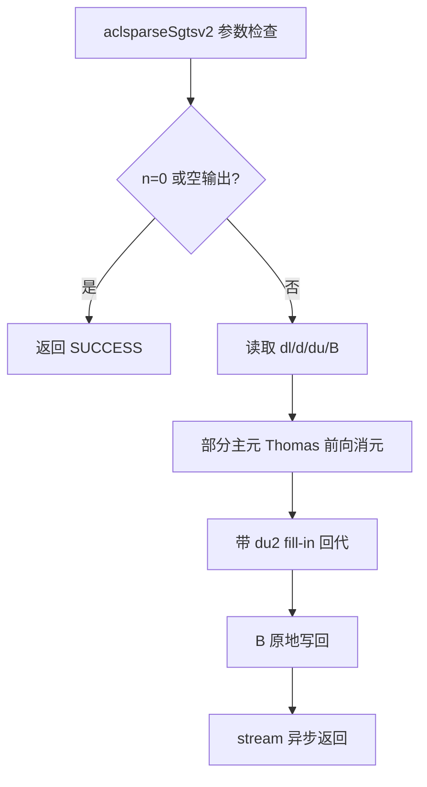
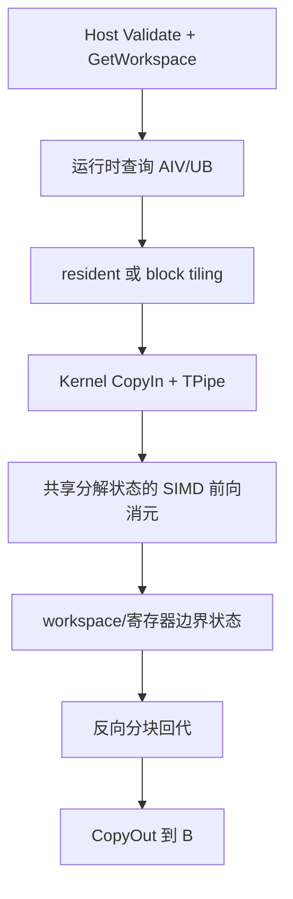
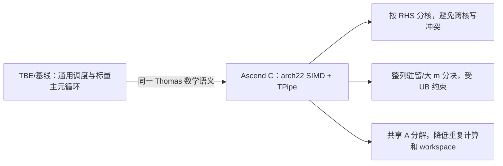

# 【社区任务】aclsparseSgtsv2 算子（A2/A3）设计文档

目标仓库：<https://gitcode.com/cann/ops-sparse>  
目标实现目录：`sparse/gtsv2/arch22/`  
目标硬件：Atlas A2/A3（DAV_2201，910B3/910B4/910_93）  
贡献者：`qq_50438052`

## 一、需求背景

### 1.1 需求来源

本设计对应 2026 年 9 月社区任务“aclsparseSgtsv2 算子开发（A2/A3）”。任务要求在
ops-sparse 中补齐 `aclsparseSgtsv2` 的 A2/A3 实现，保持既有 C++ ABI、两阶段 workspace
调用方式和 cuSPARSE 语义，并提供可复现的 UT/ST、精度、性能和内存验证材料。

### 1.2 算子与现状

`Sgtsv2` 求解列主序三对角系统 `A·X=B`。`A` 由 `dl`、`d`、`du` 三条对角线表示，`B`
原地覆盖为 `X`。接口声明已存在于 `include/cann_ops_sparse.h`，当前实现参考为
`sparse/gtsv2/arch35/`；本任务新增 `arch22` Host/Kernel，不修改公开接口和 arch35 源码。

TBE 参考路径按 CANN 传统布局记录为
`opp/built-in/op_impl/ai_core/tbe/impl`；若当前 CANN 安装未提供对应 TBE kernel，则以
仓内 arch35 实现、cuSPARSE 文档和公共 CPU golden 作为等价 baseline，并在自测报告中注明。

## 二、需求分析

### 2.1 接口与参数

```cpp
aclsparseStatus_t aclsparseSgtsv2_bufferSizeExt(
    aclsparseHandle_t handle, int m, int n,
    const float *dl, const float *d, const float *du,
    const float *B, int ldb, size_t *pBufferSizeInBytes);

aclsparseStatus_t aclsparseSgtsv2(
    aclsparseHandle_t handle, int m, int n,
    const float *dl, const float *d, const float *du,
    float *B, int ldb, void *pBuffer);
```

| 参数 | 语义/类型 | 约束 |
|---|---|---|
| `handle` | 输入，aclsparse 上下文 | 必须是有效句柄 |
| `m` | 系统阶数，int32 | `m >= 3`；负值和溢出边界由 Host 拒绝 |
| `n` | RHS 列数，int32 | `n >= 0`；`n=0` quick return |
| `dl/d/du` | 只读 FP32 一维对角线 | 逻辑长度为 `m`；约定 `dl[0]=0`、`du[m-1]=0` |
| `B` | FP32 列主序 RHS，输入输出 | `ldb >= max(1,m)`；执行后原地保存 X |
| `ldb` | B 的 leading dimension | 允许 padding，不能小于合法下界 |
| `pBufferSizeInBytes` | 输出 workspace 字节数 | 非空；查询阶段允许 `B=nullptr` |
| `pBuffer` | 执行阶段 workspace | 足量、128B 对齐；`n>0` 时不能为空 |

仅交付 FP32 `float*` ABI，不引入 batchCount、独立 X 或其他 dtype。`dl/d/du` 不被写回，
stream 由 handle 管理，调用保持异步语义。

### 2.2 功能与异常语义

采用带部分主元选取的 Thomas/LAPACK `dgtsv` 变体。第 `i` 步比较前一行主元和下对角
绝对值，必要时交换两行并产生第一、第二上对角 fill-in。奇异或零主元不添加保护分支，
按 IEEE-754 自然传播 Inf/NaN，与 arch35 和任务书语义一致。

校验顺序：句柄/枚举（本接口无枚举）→ `m/n/ldb` → 输出为空 quick return → 标量和数据
指针 → workspace 对齐。`n=0` 时查询返回 0、执行成功且不读取任何数据；正常 `n>0` 时
空指针、非法 `ldb`、未对齐 workspace 返回 `ACLSparseStatus` 参数错误。`bufferSizeExt`
与执行共用同一套 tiling 计算，避免查询值与实际 launch 不一致。

## 三、详细设计

### 3.1 数学模型

对每个 RHS 列 `b`，矩阵满足

```text
dl[i] * x[i-1] + d[i] * x[i] + du[i] * x[i+1] = b[i]
```

前向消元使用部分主元。无交换时 `mult=dl[i]/d'[i-1]`，更新 `d'[i]`、`du'[i-1]` 和
`b[i]`；交换时保存原 `du[i]` 为第二上对角 `du2'[i-1]`，并更新交换后的两行。回代为

```text
x[i] = (b'[i] - du'[i]x[i+1] - du2'[i]x[i+2]) / d'[i]
```

分解只依赖 `dl/d/du`，与 RHS 列无关。因此同一 block 的多列共享一份分解状态，减少
重复计算和 workspace；B 的每列独立进行前向/回代，保证无写冲突。

### 3.2 Host 侧设计

#### 3.2.1 分核与分块

按 RHS 列连续切分，`blockNum = min(n, GetCoreNumAiv())`，前 `n % blockNum` 个核多取一列，
其余核取 `floor(n/blockNum)` 列。核数和 UB 容量运行时查询，不硬编码 910B3、910B4 或 A3
的型号差异。

`m` 较小时采用整列驻留 UB：一次搬入对角线和该核负责的 B 列，完成前向和回代后写回。
`m` 较大时沿 m 分块，每块携带相邻行 halo；分块间只传递边界主元/上对角状态，分解结果
按核独占区域写入 workspace，回代阶段反向读取，避免核间同步和整列 UB 溢出。切分公式
使用 64 位中间量，最终转换为 tiling 字段前检查范围。

workspace：`n=0` 为 0；驻留路径返回满足 ABI 校验的最小 128B 对齐块；分块路径按
`blockNum * 3 * m * sizeof(float)` 计算并向上对齐 128B。实际实现允许进一步压缩，但查询和
执行必须使用完全相同的公式。

#### 3.2.2 tilingKey

按 `resident/block`、`n==1/multi-RHS` 和尾块是否存在选择有限的 tilingKey。key 只表达
执行路径，不改变接口语义；所有 shape、stride、block 起止列、workspace 偏移写入 tiling
数据。`blockNum=0` 仅允许在 `n=0` quick return 出现。

### 3.3 Kernel 侧设计

Kernel 采用经典 Ascend C `__aicore__` + TPipe/TQue 三段式流水，不使用 arch35 专有 SIMT
接口。每个 tile 的处理顺序为 `CopyIn → Eliminate/Compute → CopyOut`，队列负责搬运与计算
同步；辅助数组使用长期持有的 TBuf，double buffer 通过 `InitBuffer(num=2)` 配置。

伪代码：

```text
Init(tilling, pipe)
  读取 block 的列范围、m 分块和 workspace 偏移
for each m-tile in forward order:
  CopyIn(dl, d, du, B, halo)
  ApplyPartialPivotAndEliminate()
  CopyOut(updated diagonal state, B prefix, workspace)
for each m-tile in reverse order:
  CopyIn(backward state, B suffix, workspace)
  BackSubstitute(two-superdiagonal form)
  CopyOut(B tile)
```

对角线只读要求通过独立的 LocalTensor 副本满足；B 的 GM 区域是唯一输出。尾块采用有效
元素计数和对齐搬运，禁止越界读写。零除法、NaN 比较和 Inf 传播保留硬件 FP32 行为，不
在 kernel 中用条件分支“修正”奇异结果。

### 3.4 三张实现流程图

#### TBE/baseline 流程



#### Ascend C arch22 流程



#### 差异与原因



### 3.5 内存、同步和性能策略

单核 UB 预算按 `UB <= 192 KiB` 约束，至少预留输入、输出、对角线临时区和双缓冲空间；
实际值由平台查询结果和对齐规则决定。GM workspace 按 block 独占，禁止跨核重叠写入。
核内只使用 TQue/TBuf 自动同步，避免手写 flag；Host 仅在 stream 上下发 kernel，不隐式
同步。性能采样期间复用 workspace，每轮恢复 B 输入，预热不少于 10 次、正式采样不少于
30 次，报告 median/P90。重点优化大 `n` 多 RHS 场景；`n=1` 时保持正确性并记录并行度
受限这一固有特性。

## 四、支持硬件与限制

| 硬件 | 架构 | 支持 |
|---|---|---|
| Atlas A2 910B3/910B4 | DAV_2201 / arch22 | √ |
| Atlas A3 910_93 | DAV_2201 / arch22 | √ |
| Ascend 950 | arch35 | 保留现有实现，本任务不改动 |

限制：仅 FP32；`m>=3`、`n>=0`、`ldb>=max(1,m)`；调用方保证边界对角为零；不支持 CPU
fallback；奇异系统按 IEEE-754 传播；workspace 必须按查询值分配并 128B 对齐。

## 五、可维可测分析

### 5.1 精度标准

CPU golden 使用 float64 的带主元三对角求解。FP32 输出逐元素满足任务书给定的
`atol=2^-16`、`rtol=2^-10`、`A=1e-2` 判据，整体匹配率不低于 0.99，绝对误差不超过
`max(A, 32*ULP(golden))`。覆盖普通值、正负混合、小值、离群值、对角占优、需要 pivot、
零/奇异系统以及 Inf/NaN 传播。

### 5.2 性能标准

以任务书 GPU 设备 Event 的 cuSPARSE 基线为分母，NPU 使用相同 C++ 调用范围的 aclrtEvent
统计；每个 case 性能倍率须 `>=0.25`。正式场景为 `(m,n,ldb)=(8192,64,8192)`、
`(4096,64,4096)`、`(7168,128,7168)`，并覆盖完整 `performance_cases.json`。

### 5.3 测试与交付

新增 `test/gtsv2/arch22/` C++ UT/ST，复用公共 golden，覆盖参数错误、n=0、n=1/多 RHS、
padding ldb、边界 m、workspace 对齐、输入只读、B 原地、stream 异步和奇异矩阵。交付包
提供 README、编译命令、NPU 精度/性能脚本、峰值内存采集、Profiler（确认 AI Vector Core、
无 CPU fallback）和 A2/A3/A5 交叉回归记录。

### 5.4 兼容性与风险

公共接口和 arch35 文件不改动，arch22 由 SOC 过滤独立编译；950 进行编译级回归，避免
引入 arch22 专有符号。主要风险是 `n=1` 并行度低、大 m 分块边界和 FP32 消元误差累积，
分别通过边界专项用例、halo 不变式检查、float64 golden 和逐元素判据控制。910B4 若暂时
没有可用算力，则保留同一 DAV_2201 代码路径和运行时资源查询，待设备到位补测，不虚构
实测数据。

## 六、实现目录与版本记录

```text
sparse/gtsv2/arch22/                 Host、Kernel、tiling、README
test/gtsv2/arch22/                   C++ UT/ST 与 NPU wrapper
test/gtsv2/gtsv2_golden.h            公共 CPU golden（复用）
test_cases/aclsparseSgtsv2_testCase/ 任务专项精度/性能/内存脚本
```

设计文档 PR 先行；评审通过后再在 ops-sparse 的 `master` 分支提交实现、测试和报告。

