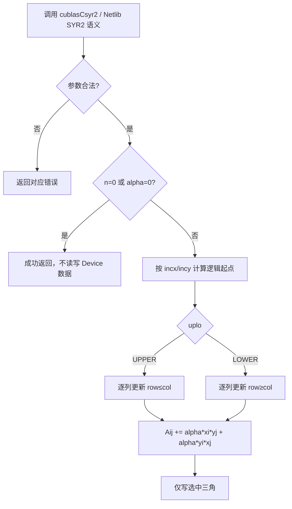

# 一、需求背景

## 1.1 需求来源

Ascend CANN 社区任务：在 Ascend 950PR 上基于 ops-blas 工程实现单精度复数对称秩-2 更新算子 `aclblasCsyr2`，并与 cuBLAS `cublasCsyr2` / Netlib `ssyr2` 的数学语义对齐。

## 1.2 背景介绍

### 1.2.1 标杆来源、TBE 源码与算子信息库核查

本任务是向 `ops-blas` 增加公共 BLAS 接口 `aclblasCsyr2` 的 Ascend C Kernel 直调实现，不是将既有 ACLNN/TBE 算子迁移为 Ascend C。因此，下列审核项的结论是**不适用**，而不是缺少材料：

| 审核对象                        | 核查结论                                                                          | 依据及替代参考                                                                                                                    |
| ------------------------------- | --------------------------------------------------------------------------------- | --------------------------------------------------------------------------------------------------------------------------------- |
| 原 TBE 算子源码路径（含文件名） | 不适用：任务书未给出`aclblasCsyr2` 的 TBE 实现，目标仓也不存在该 complex64 接口 | 数学与 API 语义以 cuBLAS`cublasCsyr2` 和 Netlib `ssyr2.f` 的对称秩-2更新为准                                                  |
| 算子信息库路径（含文件名）      | 不适用：本任务不注册 ACLNN 算子，不使用 ACLNN 算子信息库                          | 公共接口声明位于`ops-blas/include/cann_ops_blas.h`；接口不是 `aclnn*`                                                         |
| 可复用工程实现                  | 适用                                                                              | `ops-blas/blas/syr2/arch35/syr2_host.cpp`（同族 `aclblasSsyr2` 的句柄、stream 与启动框架）及 `ops-blas/blas/syr2/README.md` |

因此本文不会把同族实数 `Ssyr2` 误写成 Csyr2 的 TBE 标杆，也不会虚构 ACLNN 接口或算子信息库文件。它只作为工程接入参考；复数语义、普通转置及特殊值行为仍以任务书指定的 cuBLAS/Netlib 参考为准。

### 1.2.2 aclblasCsyr2 标杆算子现状分析

`aclblasCsyr2` 是 BLAS SYR2 的 complex64 版本，面向列主序复数对称矩阵的原地三角更新。正式实现位于 ops-blas：

```text
include/cann_ops_blas.h                    # 公共 C API
blas/syr2/arch35/csyr2_host.cpp            # Host 参数校验、tiling、stream launch
blas/syr2/arch35/csyr2_tiling_data.h       # Host–Kernel tiling ABI
blas/syr2/arch35/csyr2_kernel.cpp          # 通用 SIMT 回退及原 K1
blas/syr2/arch35/csyr2_aiv_kernel.cpp      # 连续向量 AIV 优化
test/syr2/csyr2/arch35/                    # CSV、GTest 与 NPU wrapper
```

#### 1.2.2.1 标杆支持的数据类型和数据格式

ops-blas 已有 `aclblasSsyr2` 同族实现，可复用工程接入、句柄与 stream 绑定、SIMT 启动方式及构建自动发现机制；但不能直接复用其数值实现：

| 项目     | Csyr2 要求                                           |
| -------- | ---------------------------------------------------- |
| 数据类型 | `aclblasComplex`，实部与虚部均为 FP32 的 complex64 |
| 转置语义 | 普通转置`T`，不进行复共轭                          |
| 对角线   | 对角元素虚部是普通计算结果，不强制置零               |
| 矩阵访问 | 仅引用和更新`uplo` 指定的三角；另一三角不读、不写  |
| 步长     | `incx`、`incy` 支持正负非零步长                  |

#### 1.2.2.2 标杆实现描述

任务指定的语义标杆为 Netlib `ssyr2.f` 的 SYR2 遍历规则扩展到 complex64，并与 cuBLAS `cublasCsyr2` 的参数序列保持一致：先检查 `uplo/n/incx/incy/lda`，对 `n=0` 或零 `alpha` quick return；随后仅遍历 `uplo` 选择的三角，以列主序和逻辑步长读取向量，并对每个目标元素累加两项普通复数乘法。复数版本与 Hermitian 系列不同：不做共轭，也不将对角虚部置零。

同族 `aclblasSsyr2` 只提供 Host 校验、handle 绑定 stream、Kernel 启动及构建接入的工程参考。其数据类型为 `float`，不能复用为 complex64 数值实现；尤其不得沿用会重排负步长向量的测试包装逻辑。

#### 1.2.2.3 标杆算子实现流程图



## 1.3 aclblasCsyr2 算子功能分析

计算公式：

```text
A = alpha * x * y^T + alpha * y * x^T + A
```

其中 `alpha`、`x`、`y` 与 `A` 均为 complex64；`A` 为普通复数对称矩阵，即 `A = A^T`，而非 Hermitian 矩阵。对每个被选中的坐标 `(row, col)`：

```text
A[row + col * lda] += alpha * x[row] * y[col] + alpha * y[row] * x[col]
```

输入：`handle`、`uplo`、`n`、`alpha`、`x`、`incx`、`y`、`incy`、`A`、`lda`。

输出：原地更新 `A` 的指定三角。

支持数据类型：仅 complex64（`aclblasComplex`）。

支持广播：不涉及。该接口是 BLAS 向量/矩阵接口，`x`、`y` 与 `A` 通过 `n`、`incx`、`incy`、`lda` 描述逻辑布局，不定义张量广播语义。

# 二、需求分析

## 2.1 外部组件依赖

| 组件                              | 适配状态               | 用途                                                    |
| --------------------------------- | ---------------------- | ------------------------------------------------------- |
| CANN 9.1.0 Ascend C / ACL runtime | 已适配                 | 编译 Kernel、管理 Device 内存与在 stream 上启动 Kernel  |
| Ascend 950PR（arch35）            | 已适配                 | 本任务唯一正式验收硬件                                  |
| cuBLAS / Netlib                   | 不作为运行时或生产依赖 | 仅作为 API/数学语义参考；Golden 由仓内独立 CPU 实现生成 |

不新增 CATLASS、GEMM、TBE、ACLNN 或其他生产第三方依赖。

## 2.2 内部适配模块

| 模块                 | 仓内位置                             | 适配内容                                                  |
| -------------------- | ------------------------------------ | --------------------------------------------------------- |
| 公共 BLAS API        | `include/cann_ops_blas.h`          | 新增可供其他产品线复用的`aclblasCsyr2` 声明             |
| 句柄与 stream        | `blas/syr2/arch35/csyr2_host.cpp`  | 从`aclblasHandle_t` 获取已绑定 stream，异步 launch      |
| Kernel 与 tiling ABI | `blas/syr2/arch35/csyr2_*.{cpp,h}` | AIV 优化路径、通用 SIMT 回退及`Csyr2TilingData`         |
| 构建与测试           | `test/syr2/csyr2/`                 | CSV 参数化 GTest、NPU wrapper、独立 CPU Golden 与性能记录 |

## 2.3 需求模块设计

### 2.3.1 Ascend C 算子原型

使用 Ascend C 实现 `aclblasCsyr2`，在 Ascend 950PR（arch35）上支持 complex64 的 UPPER/LOWER 三角原地更新、非连续列主序矩阵和正负向量步长；通过 handle 所绑定的 stream 异步启动 Kernel。

### 2.3.2 Ascend C 算子相关约束

1. 在 `include/cann_ops_blas.h` 新增与 cuBLAS 参数顺序一致的公共接口：

   ```cpp
   aclblasStatus_t aclblasCsyr2(
       aclblasHandle_t handle,
       aclblasFillMode_t uplo,
       int n,
       const aclblasComplex* alpha,
       const aclblasComplex* x, int incx,
       const aclblasComplex* y, int incy,
       aclblasComplex* A, int lda);
   ```
2. 支持 complex64 普通复乘和复加，保持 FP32 分量计算；不引入共轭或 Hermitian 特例。
3. 支持 `ACLBLAS_UPPER` 与 `ACLBLAS_LOWER`，且不访问未选三角。
4. 支持 `incx`、`incy` 为 `±1`、`±2`、`±3` 等任意非零 `int` 值，以及合法的 `lda >= max(1, n)` padding。
5. 支持合法 quick return：`n == 0` 或 `alpha == (0, 0)` 时不读取 Device 数据、不写 A、不启动 Kernel。
6. 以正确性优先的通用 Kernel 为基线；在 950PR profiling 有证据后，以三角分块、连续访问和 UB 向量复用优化性能，目标不低于任务提供的 TBE/cuBLAS 对标门槛。

#### 2.3.2.1 设计原则与非目标

| 原则         | 设计约束                                                                                               |
| ------------ | ------------------------------------------------------------------------------------------------------ |
| 单一公共接口 | 只新增`aclblasCsyr2`，不定义 950PR 私有 API、Device alpha 模式、批量接口或 int64 公共签名            |
| 三角语义优先 | 不以两次 GER、完整 GEMM 或完整外积中间矩阵替代三角更新；它们会增加 launch/流量，且可能读取未选三角     |
| 正确性优先   | K0 通用路径覆盖所有合法布局；性能路径不适用时必须回退 K0，不得缩小 API 支持范围                        |
| 证据驱动优化 | tile 大小、核心数、双缓冲与 SIMD 仅由目标设备编译资源报告和 profiling 决定，不按固定性能 case 名称分派 |
| 无隐式同步   | API 只向`handle` 绑定 stream 入队；异步错误由调用方在该 stream 同步时获得                            |

不在本次范围内：arch22/arch20 Kernel 移植、全仓框架重构、引入 CATLASS/GEMM 依赖、改变现有 `aclblasSsyr2` 行为、自动生成或覆盖用户提供的性能基线。

# 三、需求详细设计

## 3.1 调用方式

本算子采用 **ops-blas 句柄式 BLAS API + Ascend C Kernel 直调**，不是 ACLNN 或 PyTorch 框架算子。调用方创建 handle 并以 `aclblasSetStream` 绑定 stream，将 Host `alpha` 和 Device `x/y/A` 传入 `aclblasCsyr2`；Host 校验和 tiling 后仅向该 stream 异步入队。调用方在读回 A 前负责同步同一 stream。完整可编译调用示例位于 `ops-blas/test/syr2/csyr2/examples/example_csyr2.cpp`。


## 3.2 需求总体设计

### 算子数据模型

#### 数学公式

```text
A := alpha * x * y^T + alpha * y * x^T + A
```

复数乘法按实部/虚部分量展开：

```text
(ar + i*ai) * (br + i*bi) = (ar*br - ai*bi) + i*(ar*bi + ai*br)
```

#### 支持数据类型

| 参数         | 数据类型                                          | 存储位置             |
| ------------ | ------------------------------------------------- | -------------------- |
| `alpha`    | `const aclblasComplex*`                         | Host 标量            |
| `x`、`y` | `const aclblasComplex*`                         | Device，只读         |
| `A`        | `aclblasComplex*`                               | Device，原地读写     |
| 索引与步长   | `int` API 入参；Kernel ABI 中步长为 `int64_t` | Host / Kernel tiling |

#### 支持形状与布局

| 项目         | 支持范围                                                          |
| ------------ | ----------------------------------------------------------------- |
| 矩阵阶数     | `n >= 0`，运行时入参                                            |
| 存储顺序     | 列主序，元素地址为`row + col * lda`                             |
| 矩阵前导维   | `lda >= max(1, n)`                                              |
| 选择三角     | UPPER：`row <= col`；LOWER：`row >= col`                      |
| 向量逻辑元素 | `x[startX + i * incx]`、`y[startY + i * incy]`                |
| 负步长起点   | `start = (1 - n) * inc`，以 0 基表示等价为 `(n - 1) * (-inc)` |
| 广播         | 不支持，也不适用                                                  |

### 3.2.1 Host 侧设计

Host 侧职责是校验公共接口契约、构造稳定的 Host–Kernel tiling 数据，并在 handle 绑定 stream 上异步启动 Kernel；Host 侧不做 `aclrtSynchronizeStream`。

#### 3.2.1.1 参数校验与启动边界

| 顺序 | 条件                                                                                | 行为                                     |
| ---- | ----------------------------------------------------------------------------------- | ---------------------------------------- |
| 1    | `handle == nullptr`                                                               | 返回`ACLBLAS_STATUS_HANDLE_IS_NULLPTR` |
| 2    | `uplo` 非 UPPER/LOWER                                                             | 返回`ACLBLAS_STATUS_INVALID_ENUM`      |
| 3    | `n < 0`、`incx == 0`、`incy == 0`、`lda < max(1,n)` 或 `alpha == nullptr` | 返回`ACLBLAS_STATUS_INVALID_VALUE`     |
| 4    | `n == 0` 或 `alpha == (0,0)`                                                    | 返回成功；不读取`x/y/A`，不启动 Kernel |
| 5    | 非 no-op 调用中`x/y/A == nullptr`                                                 | 返回`ACLBLAS_STATUS_INVALID_VALUE`     |
| 6    | 其他合法输入                                                                        | 计算 tiling 并异步调用 Kernel，返回成功  |

该顺序使合法 no-op 可传递空 Device 指针，但不会掩盖非法枚举、尺寸、步长、`lda` 或空 alpha。

`-0.0` 的实部和虚部均视为零；含 NaN 的 alpha 不是零 alpha，进入复数计算路径。n=0 时 alpha 指针必须非空，但不读取 alpha 的内容。多个非法条件组合时采用上表的首个命中条件；这是当前实现及 CSV 采用的校验顺序；单个非法参数严格按任务书返回码处理，组合情况不掩盖结构错误。

#### 3.2.1.2 分核、分块与 LocalMemory 优化策略

每个矩阵坐标分配给唯一执行单元，避免跨核写冲突：

- 连续 incx=incy=1 且1≤n≤4096时，AIV 的 `numBlocks=min(n,aivCoreNum)`；其他布局按 n、SIMT 最小线程数和实际核数确定通用路径网格；
- `rowsPerBlock = ceil(n / numBlocks)`，并以 `numThreads` 对齐 SIMT 最小线程数且不超过硬件上限；
- Host 将 `n`、`lda`、`uplo`、复数 `alpha` 的实虚部及带符号 `incx/incy` 写入 `Csyr2TilingData`；
- 所有乘法前的地址和步长计算在 Kernel 中提升到足够宽的有符号类型，避免负步长和大索引溢出。

AIV 路径的 LocalMemory（UB）规划按固定上限计算：每个 float 平面容量为 `R=4096+64`，x/y 解交织及其行缩放结果共 8 个平面，A 的 AoS 列段占 2 个平面，故显式 UB 为 `UB=10×R×sizeof(float)=10×4160×4=166400` 字节/核。真实 GM 搬运长度仍由当前列的有效三角段决定；padding、向量空隙和未选三角不因对齐额外访问。

#### 3.2.1.3 tilingKey 规划策略

该 ops-blas 直调工程不使用 ACLNN/TBE 框架的 `tilingKey`。等价的可审计分派信息以 `Csyr2TilingData` 字段和 Host launch 条件传递，不能虚构未实现的 key 值：

| 分派标识     | 条件                                           | Kernel / 资源策略                                                    |
| ------------ | ---------------------------------------------- | -------------------------------------------------------------------- |
| AIV 连续路径 | `incx=1`、`incy=1`、`1≤n≤4096`         | 按`numBlocks=min(n,aivCoreNum)` 分核，使用固定 SoA UB 与行系数复用 |
| K0 通用路径  | 其他合法布局，包括负步长、padding 及`n>4096` | 64 位索引、GM 直访、按列唯一写回                                     |

`Csyr2TilingData` 传递 `n/lda/uplo/alpha/incx/incy/numBlocks/rowsPerBlock`；分派不读取 case 名称、随机 seed 或性能基线。

#### 3.2.1.4 索引、跨度与 ABI 边界

Host/Kernel 不得先以 `int` 相乘再转换。逻辑索引定义如下：

```text
N = int64(n)
sx = int64(incx); sy = int64(incy)
xStart = (sx < 0) ? (N - 1) * (-sx) : 0
yStart = (sy < 0) ? (N - 1) * (-sy) : 0
xIndex(i) = xStart + int64(i) * sx
yIndex(i) = yStart + int64(i) * sy
AIndex(i, j) = uint64(j) * uint64(lda) + uint64(i)
```

索引乘法在64位类型中完成，负步长先提升到 int64 再取相反数，避免 INT_MIN 取反溢出。调用方须提供满足物理跨度的有效 Device 分配；尺寸的 int 接口范围不表示硬件能分配相应矩阵。测试用 n=1 验证 INT_MIN/INT_MAX 步长，用 Host 负向检查覆盖不可实际分配的大尺寸，不将这些检查当作超大矩阵 Device 运算的证明。

`Csyr2TilingData` 按值传输 n、lda、uplo、alpha 实虚部、int64 步长、线程数和每 block 行数。Host alpha 在提交前拷入 tiling，调用后修改 Host 标量不会改变已提交任务。

#### 3.2.1.5 实际分派策略

| 路径         | 条件                                                      | 实现                                       |
| ------------ | --------------------------------------------------------- | ------------------------------------------ |
| AIV          | incx=incy=1、1≤n≤4096                                   | 固定对齐 SoA、行系数预计算、寄存器复数更新 |
| K0 通用 SIMT | 其他合法布局，包括负步长和 n>4096                         | 64位逻辑索引，GM 读取，分列/分行唯一写入   |
| 原 K1        | 留在原 Kernel 内供对照，当前 Host 的连续范围已由 AIV 覆盖 | x/y 的 UB 缓存；不是当前默认性能路径       |

分派仅依据输入布局和规模，不读取 case 名称、seed 或基线值。4096 是 UB 优化容量，不限制公共 API 的逻辑尺寸。

### 3.2.2 Kernel 侧设计

Kernel 划分为初始化/参数读取与执行两个阶段；执行阶段包含地址映射、GM/UB 数据搬运、复数计算和原地写回。

#### 3.2.2.1 Kernel 侧实现描述


1. 按 `uplo` 仅遍历有效三角：UPPER 使用 `row <= col`，LOWER 使用 `row >= col`。
2. 对每个逻辑行/列由唯一线程处理对应 A 元素，禁止两个核写同一坐标。
3. 通用路径按带符号步长映射 x/y 的逻辑下标；负步长不重排输入，也不在 wrapper 中改写为步长 1。
4. complex64 的普通复乘以 FP32 实部/虚部运算完成；不共轭，不修改对角虚部，不填充另一三角。
5. 连续路径可在 UB 缓存一段连续 x/y，批量处理同一行块或列块；padding、向量空隙和未选三角不得因对齐而被读取或写入。
6. Kernel 仅由 Host 在 `n > 0`、`alpha != 0` 且 x/y/A 非空时调用；调用方在读回结果前自行同步绑定 stream。

#### 3.2.2.2 Ascend C 实现流程图

```mermaid
flowchart TD
    A[Host 写入 Csyr2TilingData] --> B{连续 AIV 条件?}
    B -- 是 --> C[CopyIn: x/y AoS 解交织到 UB SoA]
    C --> D[预计算 alpha*y[row] 与 alpha*x[row]]
    D --> E[逐列 DataCopyPad 读入选中 A 段]
    E --> F[寄存器完成两项 complex64 更新]
    F --> G[CopyOut: 仅写有效三角段]
    B -- 否 --> H[K0: 64位索引映射 x/y/A]
    H --> I[按列和线程遍历选中三角]
    I --> J[GM 读取、FP32 复数更新、唯一写回]
```


#### 3.2.2.3 K0：通用 GM 基线 Kernel

K0 是所有合法布局的正确性回退路径，不依赖 UB 容量或连续步长。以列为主分配工作，和 A 的列主序布局一致：

```text
for j = blockId; j < n; j += blockCount:
    lo = (uplo == UPPER) ? 0 : j
    hi = (uplo == UPPER) ? j + 1 : n
    for i = lo + threadId; i < hi; i += threadCount:
        p = alpha * y[yIndex(i)]
        q = alpha * x[xIndex(i)]
        A[AIndex(i,j)] = (A[AIndex(i,j)] + x[xIndex(j)] * p) + y[yIndex(j)] * q
```

正确性要点如下：每个列 `j` 仅属于一个 block 的步进序列；同列的有效行 `i` 只属于一个线程的步进序列；因此每个有效三角元素恰好写一次，且不同 block 不会写同一坐标。K0 不使用原子操作、全局归约或完整 A workspace。其已知代价是列长不均、行向量重复读取和小规模启动开销；这些是 K1 优化的动机，而不是缩减 K0 适用范围的理由。

#### 3.2.2.4 AIV：对齐向量复用与寄存器计算

x/y 在 CopyIn 阶段解交织为四个 float 平面，并预计算 `alpha*y[row]` 与 `alpha*x[row]` 的四个分量平面。另用两个平面容纳 A 的 AoS 列段。每个平面容量为4096+64个 float，显式 UB 合计166400字节。额外64元素保证末个寄存器访问仍在对应 UB 存储范围内。

UPPER 在每核中复用从逻辑起点加载的向量。LOWER 若网格核数是8的倍数，或每核至多一列，按 block编号模8的余数平移初始 x/y 加载起点，使各列的 SoA 子视图保持32B对齐；其他网格按列加载，保证通用正确性。GM 搬运使用真实有效长度，禁止为满足向量对齐而访问未选三角。

每列通过 `DataCopyPad` 搬入选中 A 段，在一个寄存器计算区内完成解交织、两项复数更新和交织，最后仅搬出实际有效元素。列输入采用 B32 广播；乘、加、减独立，不使用 FMA，不对 alpha=1 或指定测试形状设置数值捷径。

复用列循环通过 MTE2→V、V→MTE3、MTE3→MTE2 事件约束读写依赖；非复用路径和退出处保留完整同步。每列只由一个核负责，不存在跨核写入重叠。原 K1 作为对照保留，未实现的三角 tile/双缓冲不列为已实现能力。

#### 3.2.2.5 浮点顺序与特殊值

采用 `(A + x[col]*(alpha*y[row])) + y[col]*(alpha*x[row])` 的行缩放顺序，不共轭，实部/虚部分开执行 FP32 运算。有限值满足同一复对称秩2公式；Inf/NaN 对重结合敏感，不能仅凭代数等价修改顺序。

独立 cuBLAS 12.6.4 对照发现，旧列缩放表达式在两个 Inf 场景中交换了 Inf/NaN 分类。行缩放表达式在44项补充对照中通过，且已将 cuBLAS 观测值直接加入 CPU/NPU 专项断言。该修正由任务书 §3.5.4 的特殊值对齐要求驱动，没有放宽阈值、删除失败或用待测 Kernel 生成 Golden。完整输入、前后结果见验证记录中的 `cublas-semantics*.json`。

#### 3.2.2.6 Ascend C 实现与标杆流程差异及原因

| 维度     | Netlib/cuBLAS 语义标杆               | Ascend C 实现                                                      | 差异原因与正确性约束                                                  |
| -------- | ------------------------------------ | ------------------------------------------------------------------ | --------------------------------------------------------------------- |
| 执行位置 | CPU 参考循环或 cuBLAS 内部实现       | 950PR 上 Host 异步 launch + arch35 Kernel                          | 适配 ops-blas 句柄和 stream；API 不在 Host 同步                       |
| 三角遍历 | 仅按`uplo` 更新一个三角            | K0 按列唯一写回；AIV 只搬运有效列段                                | 保持未选三角、padding 与 guard 不被访问                               |
| 负步长   | 通过逻辑起点和 signed increment 访问 | Kernel 使用`int64` 索引，不在 wrapper 重排输入                   | 防止负步长语义丢失和`INT_MIN` 取反溢出                              |
| 复数运算 | 普通对称秩-2更新，不共轭             | 实/虚 FP32 分量计算；行缩放顺序`(A+xj*(alpha*yi))+yj*(alpha*xi)` | 与 cuBLAS 特殊值对照的 Inf/NaN 分类一致；不以代数重排替代实际浮点语义 |
| 性能优化 | 不规定 950PR 的资源分派              | 连续布局 AIV/UB 复用，其他布局 K0 回退                             | 优化不得缩减任何合法 API 输入范围                                     |

## 3.3 支持硬件

| 支持的芯片版本         | 涉及勾选 | 说明                                  |
| ---------------------- | -------- | ------------------------------------- |
| Ascend 950PR（arch35） | √       | 正式目标平台，CANN 9.1.0              |
| 其他 Ascend 950 型号   | 辅助验证 | 同架构结果不能自动替代 950PR 正式验收 |
| Atlas A2/A3（arch22）  | ×       | 需独立 Kernel 适配，不在本次实现范围  |
| Ascend 310P（arch20）  | ×       | 需独立 Kernel 适配，不在本次实现范围  |

## 3.4 算子约束限制

1. 仅实现 complex64 的 `aclblasCsyr2`；不包含 float、double 或其他复数精度的平行 API。
2. 不支持张量广播、高维 ND 语义或批处理语义。
3. `uplo` 仅允许 UPPER/LOWER；只保证被选三角被访问和更新。
4. `incx` 和 `incy` 必须非零；`lda` 必须满足 `lda >= max(1,n)`。
5. A 与 x/y 的别名行为需要在正式接口契约确认前作为受限场景处理；实现和测试不得假设任意别名安全。
6. AIV 路径在 Ascend 950PR/CANN 9.1.0 上验证；其他产品线不自动声明支持。
7. 不采用 x/y 零列短路。alpha=0 的合法整算子 quick return 独立处理，其他特殊值按已测分量表达式计算。

# 四、特性交叉分析

| 交叉特性            | 组合                                        | 设计处理与验证重点                                                          |
| ------------------- | ------------------------------------------- | --------------------------------------------------------------------------- |
| 三角与布局          | UPPER/LOWER × 紧凑/`lda` padding         | 仅遍历并写回选中三角；未选三角、padding、guard 按位不变                     |
| 三角与步长          | UPPER/LOWER ×`incx/incy=±1/±2/±3`     | 统一由逻辑起点和 signed 64 位索引寻址；负步长不重排                         |
| quick return 与指针 | `n=0` 或 `alpha=0` × `x/y/A=nullptr` | 先完成结构和 alpha 指针校验，再合法成功返回，不访问 Device 指针             |
| 特殊值与算术顺序    | Inf/NaN × 一般复数 alpha                   | 固定行缩放 FP32 顺序，并单独比较 NaN 分类和 Inf 符号                        |
| 性能分派与通用性    | 连续、`n≤4096` × 其他合法输入           | AIV 仅优化连续范围；负步长、padding 或更大 n 自动回退 K0，不降低接口能力    |
| 异步与原地          | 绑定 stream × 连续调用/双 stream           | Host 不同步；每个目标元素唯一写入，测试验证同 stream 累加及独立 stream 隔离 |

# 五、可维可测分析

## 5.1 精度标准/性能标准

| 验收标准         | 描述                                                                                                           | 标准来源                     |
| ---------------- | -------------------------------------------------------------------------------------------------------------- | ---------------------------- |
| 数学正确性       | 对有效三角的实部、虚部分别与独立复数 Golden 比对；未选三角、padding 与保护区按位不变                           | 任务书、Netlib`ssyr2` 语义 |
| FLOAT32 分量精度 | `atol=2^-16`、`rtol=2^-10`、matched ratio ≥ 0.99；逐元素最大误差按 `1e-2` 或 `32×ULP` 的确认口径处理 | 任务书、生态精度标准         |
| 特殊值           | NaN 分类、Inf 符号、零乘 Inf 和混合 Inf/NaN 单列判定；不允许 NaN 掩盖失败                                      | 任务书补充覆盖要求           |
| 性能             | 950PR 上 warmup 后有效采样大于 50 次；四个固定 n 的平均设备耗时不高于任务书上限                                | 任务书                       |
| 内存与隔离       | 分块 Golden/回读下记录 Host RSS、Device 分配和保护区；绑定 stream、不在 Host 内同步                            | 实施计划                     |

### 固定性能门槛

| 用例       | uplo  | n / lda     | alpha  | incx / incy | 平均耗时上限 |
| ---------- | ----- | ----------- | ------ | ----------- | ------------ |
| TC_PF_1001 | UPPER | 512 / 512   | (1, 0) | 1 / 1       | 11 us        |
| TC_PF_1002 | LOWER | 1024 / 1024 | (1, 0) | 1 / 1       | 12.17 us     |
| TC_PF_1003 | UPPER | 2048 / 2048 | (1, 0) | 1 / 1       | 24.89 us     |
| TC_PF_1004 | LOWER | 4096 / 4096 | (1, 0) | 1 / 1       | 131.97 us    |

### 测试工程与数据流

测试链路必须保持 Golden 与待测 Kernel 的独立性：

```text
Python 生成器 / 验收驱动
  -> C++ CSV 参数化 GTest（唯一 case_id）
      -> CPU Golden、精度与保护区统计
      -> NPU wrapper：分配、上传、原参数调用、目标 stream 同步、分块读回
          -> aclblasCsyr2 -> Host -> arch35 Kernel
  <- GTest XML/JSON + 精度/性能/内存结构化记录 + 原始日志
```

- Golden 以 Netlib `ssyr2` 控制语义扩展为独立的复数分量实现，不能调用待测 Kernel，也不能复用 Kernel 的 tile 解码、索引 helper 或复乘函数。
- 对人工可核算例子额外用独立高精度表达式交叉检查：`alpha=1+i`、`x=[1+2i,-1+i]`、`y=[2-i,3+2i]` 时，完整数学结果为 `[[3+15i,-11+12i],[-11+12i,-13-4i]]`；一次 UPPER/LOWER 调用仍只能更新各自三角。
- 随机扩展集合中 alpha/x/y/A 的均匀与正态分布各占 50%，实部/虚部使用独立随机子序列；固定边界、特殊值和 PF 不计入该比例。记录 seed、分布参数、生成器版本、标准库及输入摘要。
- wrapper 必须保留物理布局和原始负步长，不能像同族旧 wrapper 一样重排数据并改为 `inc=1`；非法参数也必须原样传至公共 API。

### 覆盖要求

| 维度         | 覆盖内容                                                                           |
| ------------ | ---------------------------------------------------------------------------------- |
| 原始清单     | 原 1000 条精度用例全部执行；200 条 PF 同时做正确性检查与独立性能采样               |
| 形状         | n=0/1、小质数、2 的幂及 ±1、奇数、非对齐、2048/4096；测试最大值不是 API 上限      |
| 布局         | UPPER/LOWER、incx/incy 的 ±1/±2/±3 组合、紧凑 lda 和多个 padding                |
| 保护         | 向量空隙、矩阵 padding、前后 guard、未选三角与只读 x/y 的位级不变检查              |
| 标量/特殊值  | 零、一、纯虚、负数、一般复数、大值、NaN、Inf、零乘 Inf、对角虚部                   |
| 返回码/no-op | 空 handle/alpha/x/y/A、非法枚举、负 n、零步长、非法 lda，以及 no-op 与非法参数组合 |
| 异步隔离     | 非默认 stream、同 stream 连续调用、独立 handle/stream、资源销毁与错误传播          |
| 整数边界     | CPU 上验证 INT_MIN/INT_MAX 步长和端点索引，不通过分配不可承受矩阵伪造 Device 覆盖  |

### 精度判定与特殊值规则

对有效三角的实部和虚部分开判定，分量总数均为 `E=n*(n+1)/2`，不将两者混合以稀释任一分量失败。对有限值 g（Golden）与 o（输出）：

```text
d = abs(double(o) - double(g))
element_match = d <= 2^-16 + 2^-10 * abs(double(g))
ULP(g) = 2^(max(floor(log2(abs(g))), -126) - 23), g != 0
ULP(0) = 2^-149
element_cap_ok = d <= max(1e-2, 32 * ULP(g))
component_pass = matched_count / total_count >= 0.99
                 AND every element_cap_ok
case_pass = real_pass AND imag_pass
```

NaN 仅比较分类，不比较 payload；同符号 Inf 视为一致；有限/非有限不一致、单侧 NaN 或 Inf 符号不一致均为硬失败，不能消耗 1% 容差。未选三角使用原始 bit pattern 比较，避免 `NaN != NaN` 产生伪失败。

MERE/MARE 作为与生态混合阈值并列的报告指标：跳过完全相等、双 NaN 和 `abs(g)<threshold` 的分量后，以 `abs(o-g)/(abs(g)+2^-14)` 累计 MERE/MARE；无 eligible 分量时为 0。两套指标不得互相替代，最终应同时输出统计分母与最差坐标。

### 性能测量与优化实验

性能计时只覆盖真实公共 API 的设备执行区间，排除分配、H2D/D2H、Golden、比较和逐调用日志。实际 warmup=10、有效样本=60（正式要求严格大于 50），小尺寸若需批量 launch 则记录调用次数 L：

```text
分配、生成、上传、绑定 stream
warmup 后同步并检查错误
每个样本：在计时区间外恢复 A0 -> start event -> 调用 L 次 Csyr2
          -> stop event -> 等待 stop -> sample_us = elapsed_us / L
```

A 原地累加，必须在计时区间外恢复初始 A，防止批次内无限累加导致溢出或输入退化。设备事件平均值和 profiler 的单 Kernel duration 分列报告；CPU API 耗时只能作补充。保存平均值、median、p95、标准差、最大值、warmup、samples、L、计时范围及原始样本；若过线余量低于实验波动，状态为不稳定而非达标。

| 实验 | 变更项                | 保留条件                           |
| ---- | --------------------- | ---------------------------------- |
| E0   | 事件单位、L、warmup   | 分辨率与 profiler 范围可解释       |
| E1   | K0 → K1              | 同一 FP32 计算语义下精度不退化     |
| E2   | B=32/64/128           | 检查 GM 效率、尾块和 UB/寄存器占用 |
| E3   | 线程数与 block 数     | 分别评估小规模启动和大规模利用率   |
| E4   | UB 向量复用           | 重复读取下降足以抵消同步成本       |
| E5   | 双缓冲或 K2，一次一项 | profiler 原因明确且稳定收益        |

有效复数元素数为 `E=n*(n+1)/2`，仅 A 的逻辑读写量为 `Q_A=16E=8n(n+1)` 字节；四条门槛反推的有效流量率分别为 191.02、689.96、1348.77、1017.28 GB/s（n=512/1024/2048/4096）。这些只是由门槛反推的逻辑流量率，不是 950PR 峰值带宽，也不能证明任何方案必然达标。

### 内存预算、结果协议与失败处理

最大 PF（n=4096）的一份 A 为128 MiB。测试保留完整 A0、完整输出及一个 Golden 列；不再展开三角数组或保留第三份完整 Golden。进程 Host RSS 由 getrusage 记录，最终全量峰值455.390625 MiB。任务书 §3.4 不设内存硬门槛；512 MiB 是本项目自定的测试预算，非 API 尺寸上限。生产 API 无增量 GM workspace，显式 UB 166400字节/核；这些口径不能替代进程 Device 总分配测量。完整数据见验证报告。

每次运行至少记录以下结构化证据：

| 记录         | 必备字段                                                                        |
| ------------ | ------------------------------------------------------------------------------- |
| run_manifest | run_id、源码提交/diff 摘要、CSV/基线摘要、SoC、软件版本、设备号、命令、计时配置 |
| accuracy     | case、完整参数、预期/实际 API 状态、实/虚部统计、最差点、保护区和最终状态       |
| performance  | case、warmup、samples、L、原始样本、平均 us、门槛、基线来源和判定               |
| memory       | Host RSS、Device 分配、增量 workspace、测量工具和口径                           |
| failure      | 阶段、退出码、timeout/crash、原始日志、复现输入                                 |

运行状态至少区分 PASS、FAIL、ERROR、TIMEOUT、SKIPPED、NO_REF。缺失、跳过、无基线、超时、崩溃或部分执行不得汇总为 ALL PASS；GTest 结构化结果优先于日志解析，实际唯一完成集合必须与计划集合比对。

## 5.2 兼容性分析

新增公共 API，不改变既有 `aclblasSsyr2` 或其他 BLAS API 的参数与行为。接口签名置于公共头文件，避免创建仅供 950PR 使用的私有平行接口。arch22/arch20 不提供伪实现或错误地宣称支持；如未来需要移植，应复用数学契约和测试资料，但独立实现 Kernel 与资源参数。

## 5.3 实现与验证状态

公共 API、Host 参数校验、AIV 和通用 SIMT Kernel、CSV/NPU wrapper、自实现逐列 Golden、实/虚部精度累计器、性能/内存记录均已接入。行缩放修正后的空构建目录Release版本通过1210/1210项NPU回归、12/12项CPU单测、1000/1000项任务精度对账和200/200项性能对账。新增4097通用路径、独立stream/连续更新、cuBLAS特殊值分类专项及独立API示例均通过。四条固定CSV性能均值为6.101007/10.110013/20.399391/73.704643us。旧失败记录单独保留，不代替最终版本证据。

逐项任务书清单见 [验收清单](validation/csyr2-20260908/requirements.md)，原始日志、构建、哈希及最终数值见 [验证报告](validation/csyr2-20260908/README.md)。设计文档遵循官方模板；社区 PR、开发者邀请、评审合入状态须以平台真实记录为准。