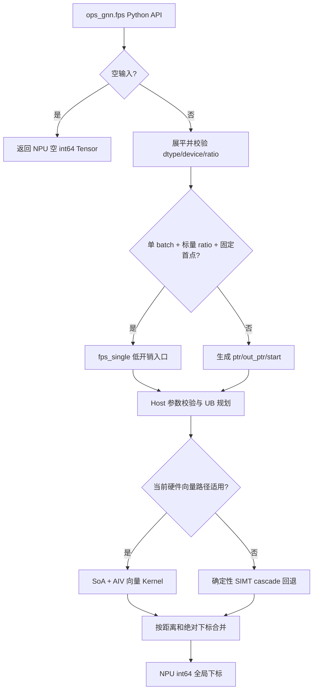

# 需求背景（required）

## 需求来源

本需求来自 CANN 2026 年 8 月社区任务“fps 算子开发（950）”。任务要求参考 `torch_cluster.fps`，在 Ascend 950 系列 NPU 上实现 Ascend C Kernel 与 PyTorch 适配层，并以 PyTorch 层 `ops_gnn.fps()` 的功能、精度和性能作为验收口径。

当前平台记录为 2026-09-03 发布的同名任务，设计 PR 使用 `tasklist/09-34-fps-950` 目录；当前下载的官方任务资源（`202609/83655ac468894ada9105565c4eea9e90.zip`，SHA256 `A8939925D517D80A2DFD227769B19C05FA36C1A08EA968C6A415CD9F75BC22FA`）中的 `fps_task_doc.md` 首行仍明确写作“8月社区任务”。因此这里保留官方任务书的“8月”原文，同时记录当前 9 月平台资源和 `09-34` 任务目录，不把目录号误解释为月份。

本修订对应现有设计 PR #1715 的同一设计文档。计数合同以最新 HiAscend 反馈所指的[私有 Issue #2](https://gitcode.com/gcw_i0yFZkCV/ops-gnn-fps-950/issues/2)为准；旧 Issue #1 的 double-count 要求与其冲突，以下旧候选结果仅作为历史证据。本文件只更新设计与验证边界，不把本地验证写成官方验收通过。

## 背景介绍

### FPS 算子实现优化

FPS（Farthest Point Sampling，最远点采样）广泛用于点云下采样、3D 检测 backbone 和几何深度学习。算法从每个 batch 的一个起点开始，反复选择距已选点集最远的点。它能在减少点数的同时尽量保留点集的空间覆盖范围。

FPS 的每轮采样依赖上一轮选出的中心点，属于强迭代依赖算法；但一轮内部对所有候选点的距离更新和最大值选择可以并行。实现需要在迭代依赖、向量吞吐、UB 容量和离散下标精确一致之间取得平衡。

### torch_cluster FPS 实现路径和相关 API 路径

- Python 接口：`torch_cluster/fps.py`
- CPU 参考：`csrc/cpu/fps_cpu.cpp`
- CUDA 参考：`csrc/cuda/fps_cuda.cu`
- 本实现 Python 接口：`python/ops_gnn/fps.py`
- 本实现 Host：`csrc/npu/fps/op_host/`
- 本实现 Kernel：`csrc/npu/fps/op_kernel/arch35/`

### 原版能力与本次实现范围

| 参数 | 参数含义 | 类型 | 支持范围 | 约束 |
| --- | --- | --- | --- | --- |
| `src` | 点特征 | Tensor | float16、float32 | NPU；`[N, *]`，内部展平为 `[N, F]` |
| `batch` | batch 归属 | 可选 Tensor | int64 | `[N]`，同一 batch 的点连续排列 |
| `ratio` | 采样比例 | 可选 float/Tensor | float16、float32 | 标量或 `[B]`，每项位于 `(0, 1]` |
| `random_start` | 是否随机首点 | bool | `True`/`False` | `False` 时使用段内下标 0 |
| `batch_size` | batch 数 | 可选 int | 正整数 | 未给定时为 `max(batch)+1` |
| `ptr` | CSR 分段边界 | 可选 Tensor/List | int64 | 单调非降，首项 0，末项 N |
| 返回值 | 全局采样下标 | Tensor | int64 | NPU，长度为各段采样数之和 |

# 需求分析（required）

## 需求描述

在 `ops-gnn` 中新增与 `torch_cluster.fps` 同签名的 Python API、四个 TorchScript overload、Ascend 950 arch35 Host/Kernel 实现、CPU golden、自测用例、性能测试和文档。最新 HiAscend Issue #2 明确采用 CPU golden 的计数规则：Python scalar `ratio` 先转换为 `src.dtype` Tensor，Tensor `ratio` 保留自身值，再在 float32 域计算 `degree × ratio` 并取 `ceil`。距离与平局仍按 CPU 数值合同逐元素对齐，42 个官方性能点均需达到标杆性能的 0.45 倍。旧 Issue #1 的 float64 double-count 与新反馈冲突，以 Issue #2 为准；旧结果保留，不通过改写 golden 放行。

## 需求拆解

1. 对齐公开 Python 签名以及 `ratio`、`batch`、`ptr`、空输入和随机起点语义。
2. 支持 float16/float32 输入和 int64 元数据/输出。
3. 每个非空 batch 按 scalar 先转换为 `src.dtype` Tensor、再在 float32 域计算 `ceil(degree_b × ratio_b)` 的 CPU golden 规则计数，至少输出 1 个；空 batch 输出 0 个。计数合同在 scalar、ptr、batch 和 TorchScript 路径中一致。
4. 对齐真实 CPU 参考的平方距离、FP16/FP32 舍入边界和最低绝对下标 tie-break；不再把 256-lane 归约顺序当作 CPU 真值。
5. 为官方 N/F/r 性能矩阵提供低开销向量路径，同时覆盖大 N、大 F 泛化形状。
6. 提供可独立复现的 61 项任务镜像、必要的扩展合同测试和 42 项性能门禁；验收方描述的 66 项测试在取得原文件前不声称已执行。

# 详细设计（required）

## 算子分析

### 数学公式

设某一 batch 的点为 $X=\{x_i\}_{i=0}^{N_b-1}$，已选下标集合为 $S_t$。对每个候选点维护到已选集合的最小平方欧氏距离：

$$
d_i^{(t)}=\min_{j\in S_t}\lVert x_i-x_j\rVert_2^2.
$$

第 $t+1$ 个采样点为：

$$
s_{t+1}=\operatorname*{argmax}_{i} d_i^{(t)},
$$

当最大距离相等时，CPU 合同在每个 segment 内选择段内下标更小的候选，即比较键为 `(distance descending, segment_index ascending)`；写回时再加该 segment 的全局 offset。该键可跨同一 segment 的 tile/线程使用，不跨 batch 合并；`index % 256` 只可作为硬件分块实现细节，不能改变公开结果。

每个 batch 的采样数按最新 Issue #2 对任务书 `ceil(ratio × N)` 的明确口径计算。令 $\hat r_b$ 为已传入 Tensor 的 ratio 值；仅当公开参数为 Python scalar 时，先把它转换为 `src.dtype` Tensor 以得到 $\hat r_b$：

$$
K_b=\begin{cases}
0,&N_b=0,\\
\max(1,\lceil \operatorname{float32}(\operatorname{float32}(N_b)\times\operatorname{float32}(\hat r_b))\rceil),&N_b>0,
\end{cases}
\qquad K=\sum_b K_b.
$$

其中乘法在 float32 域舍入后再取 `ceil`，不得先用 float64 乘积取整。例：float16 `src` 与 scalar `ratio=0.3`、`N=10000` 时，ratio 先量化为 `0.300048828125`，输出数为 3001；float32 Tensor ratio `[0.2,0.8]` 与 `ptr=[0,150,200]` 时，float32 乘积为 `[30,40]`，输出数为 70。旧 double-count 候选曾分别得到 3000 和 72，这些是新口径下必须修复的差异。空段输出 0 且不消费随机数是本实现的安全约定；Issue #2 指出原版 CPU 对零度段的行为未定义，不能将此约定称为与原版逐点一致。

### CPU 数值参考合同

HiAscend 新反馈变更的是采样数计算；距离与平局仍参考 `torch_cluster 1.6.3` CPU 路径的距离更新和 `dist.argmax()` 语义：

- FP16 输入的 `x - x[center]` 和平方保留 FP16 舍入；平方项转为 FP32 后按 CPU 的顺序累加；完整距离再舍入为 FP16，并与 FP16 的 `nearest` 状态比较。
- FP32 输入在当前 PyTorch 2.9.1 CPU、AVX512 验证环境中复现连续 reduction 的 W=8、ILP=4、cascade 加法顺序。该顺序是当前 build/dispatch 的实测合同，不无条件推广到其他 PyTorch 版本、ISA 或 CPU dispatch。
- 初始 `nearest` 使用 `+inf`，不使用 `50000` 截断距离；因此大距离输入也按 CPU 首轮距离更新。
- 每轮选择 `dist.argmax()` 的最低绝对下标。任务随包旧测试中按 `(index % 256, index)` 的规则与当前退回报告的 CPU 合同冲突；旧结果保留为历史兼容性失败证据，不作为本设计的 CPU 真值。Issue #88 仍可请求官方确认 tie-break，但它不改变当前整改目标。

### 支持数据类型

- `src`：float16、float32。
- `batch`、`ptr`、`out_ptr`、`start`、输出：int64。
- Host 内部归约暂存：按路径使用 FP16/FP32 距离和 int64 下标；精确路径不把 256 项 lane 顺序暴露为 tie-break 合同。

### 支持形状

- Python 层接受 `[N, *]`，以 `reshape(N, -1).contiguous()` 展平。
- `N=0` 时返回空输出；空 segment 的计数为 0，避免 `rand() % 0`。
- 任务功能用例覆盖 `N=1..32000`、`F=3..768`。
- 任务性能矩阵覆盖 `N=1024..16384`、`F=4/16/32/64`、`ratio=0.25/0.5/1.0`。

## 算子实现

### 实现方案

##### 整体执行流程

##### Host 侧设计

**Python 适配层**

1. 保持任务书要求的四个 `@torch.jit._overload` 公共签名不变；TorchScript 分支经 `torch.ops.ops_gnn.fps_batch` Dispatcher 入口调用同一 Host/Kernel，并保留 eager 模式的低开销 pybind 快路径。
2. `ratio=None` 转为 `0.5`；标量或 Tensor 均检查 `(0, 1]`。
3. `ptr` 优先；否则由 `batch` 计数并生成 CSR `ptr`；两者均无时生成 `[0, N]`。
4. Python scalar `ratio` 先量化为 `src.dtype` Tensor；Tensor `ratio` 保留其输入值。随后将 ratio 和 degree 转入 float32，在 float32 乘积上取 `ceil` 生成 `out_ptr`；非空段至少 1，空段为 0。eager 与 TorchScript 使用相同顺序。
5. `random_start=True` 按 segment 顺序消费进程全局 `libc rand()`，使用 `rand() % degree` 生成首点；`torch.manual_seed` 不控制该 RNG。需要 CPU/NPU 逐次复现时，在两次调用前分别以相同值调用 `libc srand`，多 batch 对拍固定单 intra-op 线程。
6. 官方性能场景满足“单 batch、标量 ratio、固定首点”，直接调用 `fps_single`，避免构造/回读小型元数据 Tensor；随机首点往返不计入 42 项性能计时。

**C++ Host 层**

1. 校验 `src` 为二维连续 NPU Tensor，dtype 为 float16/float32。
2. 批量入口校验 `ptr/out_ptr/start` 的 device、dtype、维度、连续性、首尾值、单调性和范围，并按空段规则拒绝非法随机首点。
3. 从当前 PyTorch NPU stream 下发 Kernel，不做额外 stream 同步。
4. 查询平台 UB 大小，预留中心点、点向量和归约 workspace；按 256 点对齐计算 `tile_points`，最大为 16384。256 对齐用于搬运和分块，不定义结果 tie-break。
5. 分配 `dist[N]`、输出 `out[K]`；每个 segment 的向量和回退路径携带段内下标，在同一 segment 内按 `(distance desc, segment_index asc)` 合并，胜者写回时加该 segment 的全局 offset。不同 batch/segment 相互独立，不做跨 batch 候选合并。
6. 内部 `fps_random_start(Tensor degree)` 使用 `AliasAnalysisKind::CONSERVATIVE`，因为它消费进程全局 RNG 状态；不虚构对输入 Tensor 的修改，也不允许 TorchScript CSE/重排改变 RNG 消耗。

##### Kernel 侧设计

内核包含性能向量路径和确定性精确回退路径。

**AIV 向量性能路径**

- 适用条件：`N <= 16384`；FP32 的主要验证路径为 `5 <= F <= 64`，`F<=4` 走已验证的短宽度低开销路径；FP16 在该 N 范围进入对应向量路径。
- Host 将输入从 AoS `[N,F]` 转置为 SoA `[F,N]`，使同一 feature 的点连续，便于向量搬运。
- FP16 每个 feature 先执行 FP16 `Adds` 与 FP16 `Mul`，保留 CPU 的减法和平方舍入边界；每维 square 转 FP32 后按顺序累加；全部 feature 完成后 round-to-nearest-even cast 回 FP16，再与 FP16 `nearest` 做 `Min`。
- FP32 主要路径按当前 PyTorch 2.9.1 CPU 实测 W=8、ILP=4 组织四行 partial，再按 lane 0..7 水平合并；F5-7 使用 scalar inner-sum 的四行 partial 顺序，避免改变 CPU 的加法树；F4 及以下保留等价短宽度路径。
- 当前实现的 FP32 向量 workspace 预算为 28 bytes/point；该数值和 W=8/ILP=4 绑定当前验证环境，不能外推为所有平台合同。
- `nearest = min(nearest, current_distance)` 驻留 UB；每轮同一 segment 内的最大值合并使用距离降序、段内下标升序，不依赖 tile 内 lane 顺序，最终写回时加 segment offset。

**确定性 SIMT 精确回退路径**

- FP32：`F > 64` 或 `N > 16384`；FP16：`N > 16384`。
- 线程可处理 `lane + 256*k` 的点，但线程布局只影响同一 segment 的计算分工；同一 segment 的 tile/线程胜者必须按段内下标升序处理相等最大值，再加全局 offset。不同 batch 不共享候选。
- FP16 的 delta 和 square 每步按 FP16 舍入，square 转 FP32 后顺序累加，最终距离舍入回 FP16；FP32 回退执行完整四级 cascade，显式分离 square 与加法，避免 FMA 收缩。
- 同一 segment 内跨 tile/线程的候选合并使用 `(distance desc, segment_index asc)`；实现不做跨 batch 或跨 block 的候选归并，写回时仅加该 segment 的全局 offset；不得恢复 `(index % 256, index)` 复合规则。

**batch 调度**

不同 batch 的输出区间可能共享一个 32 字节 GM transaction。当前冻结 Kernel 以一个 AIV block 顺序处理各 batch，避免不同 block 同时写同一 transaction；每个 segment 的距离状态和候选归并仍独立，写回时加各自全局 offset，不跨 batch 合并。相关 SYNC-08 静态候选仍需按实际访问和运行证据评估。官方性能矩阵均为单 batch；多 batch 的随机 CPU 对拍使用单 intra-op 线程固定全局 RNG 消耗顺序。

## 数据检测

- `src`：定义、NPU、连续、float16/float32、点数不超过 int32 上限。
- `batch`：一维、长度 N、int64；batch 点按 CSR 顺序连续排列。
- `ratio`：标量或每 batch 一项，非空且所有值位于 `(0, 1]`。
- `ptr`：一维 int64，至少两项，单调非降，首项 0、末项 N。
- `out_ptr`：长度与 `ptr` 相同、首项 0、单调非降；按最新 CPU golden 的 scalar 量化与 float32 乘积 `ceil` 生成，非空段至少 1，空段为 0。
- `start`：长度为 batch 数；非空段中满足 `0 <= start < degree`；空段不消费随机数。

## 支持硬件

| 支持的芯片版本 | 涉及勾选 |
| --- | :---: |
| Ascend 950PR / Ascend 950DT（dav-3510 / arch35） | √ |
| Atlas A2/A3（dav-2201 / arch22） | × |

## 算子约束限制

- 当前仅实现 NPU 路径，不提供 CPU fallback。
- `batch` 描述的同一 batch 点需要连续排列，这与 CSR `ptr` 语义一致。
- 输入 dtype 仅支持 float16、float32；索引和输出仅支持 int64。
- `ratio` 不支持 0、负数或大于 1 的值；空段只允许输出 0 个样本。
- `random_start=True` 消费进程全局 libc RNG；精确跨调用复现需要调用方分别设置相同的 `srand` 状态，不能仅依赖 `torch.manual_seed`。
- FPS 存在逐轮依赖，采样比例越高，迭代次数和耗时近似线性增加。

# 可维可测分析

## 精度标准/性能标准

| 验收标准 | 描述 | 标准来源 |
| --- | --- | --- |
| 精度标准 | 固定起点时，float16/float32 的 int64 输出下标与当前 CPU 数值合同逐元素完全一致；相等最大距离选择最低绝对下标 | FPS 社区任务书及 `torch_cluster 1.6.3` CPU 参考 |
| 随机性标准 | `random_start=True` 使用 libc RNG；调用方在两次调用前分别设置相同 `srand` 状态时，CPU/NPU 结果可复现 | CPU 参考实现与本地合同测试 |
| 计数标准 | scalar ratio 先转 `src.dtype` Tensor，Tensor ratio 保留输入值，再在 float32 域乘以 degree 并 `ceil`；非空段至少 1，空段为 0；所有入口一致 | FPS 任务书及最新 HiAscend Issue #2 |
| 性能标准 | 21 个形状 × 2 个 dtype 共 42 项，每项 `official_reference_ms / measured_ms >= 0.45` | FPS 社区任务书 |

## 测试用例规划

| 分类 | 用例 | 输入/参数 | 判定 |
| --- | --- | --- | --- |
| 基本功能 | 常规形状 | N=128/256/512/1024/2048，F=3/32/64 | 下标逐元素一致 |
| 泛化形状 | 大 N/大 F | `(4096,128)`、`(8192,256)`、`(512,768)`、`(32000,3)`、`(16000,128)` | 下标逐元素一致 |
| dtype | fp16/fp32 | 所有主要形状 | 按 CPU 数值边界逐元素一致 |
| batch | 单/多/每点一 batch | 4×64、5×1 | shape、dtype、全局下标一致 |
| CSR | List/Tensor、非均匀段 | `[0,32,96,128]`、`[0,40,100,120]` 等 | float32 计数和全局下标一致 |
| ratio | 标量/逐 batch/边界 | 0.01、0.25、0.5、0.9、1.0 | ceil 长度和下标一致 |
| 起点 | 固定/随机 | `random_start=False/True` | 固定起点精确一致；相同 libc `srand` 状态可复现 |
| 空输入 | `[0,3]` 与空 segment | ratio=0.5 | NPU 空 int64 输出，不执行 `rand()%0` |
| 平局 | 绝对下标不同且距离相等 | fp16/fp32，含跨 256 tile | 选择最低绝对下标；不得以 mod-256 选择 |
| 距离范围 | 大于 50000 的平方距离 | FP16/FP32 边界 witness | `+inf` 初始化不截断距离 |
| TorchScript | float/Tensor ratio × Tensor/List ptr | 四种 overload | 编译通过且 NPU 结果与 eager 一致 |
| 性能 | 官方矩阵 | 21 shapes × 2 dtypes，20 warmup + 100 iter | 42 项逐例达到 0.45 |

## 旧 v7 候选验证与新合同证据边界

以下是按旧 Issue #1 double-count 合同构建和测试的 v7 实现身份，不能视作已满足最新 Issue #2：

- 基线 Git：`17420436513bed80c6c544044b17c32888759cab`。
- Kernel `fps_kernel.cpp` SHA256：`786ab65dda37bc66f723dc49ded1cf4333ca80f33e182092c6cf8cf6cd0c1552`。
- Host `fps.cpp` SHA256：`cfc5c90f5e6637b5a712e641b547e1c2103eace70b7c80cd327d9854b44030fd`。
- Python `fps.py` SHA256：`6d32ac4edd281b5fe5d4be2f7f1ef28946f893f174863e24c337bae1f01f8f28`。
- 旧 v7 受测运行时的 `_pybind.so` SHA256 为 `d595b6aaffe1e88ccc4e991aaabad3fdab33e8dfb6a9d1a6ab416dfd44091f73`，`libopsgnn_npu_kernel.so` 为 `42d7aafeba3c232cc88187f163a98f166961d2ed330f59e6f7de509e73bfcfd8`。后续同源码 fresh build 的 `_pybind.so` 为 `397d053865878dffb5d796d17e08147daedbba3d17ee31546f232d8b58f786ec`。专项和完整仓的 FPS fixture 在各自测试进程内校验加载目录；性能进程未单独导出 `/proc/self/maps`，不得把补充见证当作当时的进程记录。

旧 v7 本地结果如下，仅适用于上一轮合同，不能替代新 Issue #2 下的复测或官方审核：

| 门禁 | 旧 v7 结果 |
|---|---|
| 原失败真实 CPU 四例 | 4/4 PASS |
| 自建扩展真实 CPU | 38/38 PASS |
| FP32 vector 宽度/形状 | 21/21 PASS |
| FP32 大形状与 `>5e4` 边界 | 5/5 PASS |
| 实际 index 加法树 witness | 3/3 PASS |
| taskbook count NPU 边界 | 11/11 PASS |
| libc random-start（含同脚本连续两次） | 10/10 PASS |
| 四种 TorchScript overload | 4/4 PASS |
| 旧 v7 的 61 场景 taskbook-count + CPU 距离/argmax 镜像 | 61/61 PASS（含 `ratio_override`，见下文） |
| 旧 v7 官方性能矩阵，warmup 20 / iter 100 | 42/42，最低 `1.0516245619x`；仅为历史门禁证据 |

同一旧源码后续 fresh build 在上一轮合同下完成 **65/65 专项、4/4 TorchScript、1634/1634 完整仓回归、42/42 性能**，最低性能比值为 `1.0479295426x`；原始边界见 `tasks/fps/submission_fix_20260921/final_package/staging/RESULT.md`。最新 Issue #2 改变计数规则，这些通过数均不可继承为新合同结果；新实现修复与完整门禁仍为 unknown。官方本次功能结论为不通过，不能把旧本地结果当作复审通过。

以上旧 v7 “61/61”是本地按当时 taskbook 计数解释构造的镜像：测试在每个期望 ceil 区间内构造 `ratio_override` 后再调用未修改的真实 CPU 距离/argmax。它不是最新 Issue #2 合同测试，不是验收方原始 66-case 套件，也不是把随包 oracle 改写为通过。Issue #2 报告记录 golden 与官方 CPU 扩展交叉对拍 **54/54**、验收专项 **63/66**，失败恰为上述三个计数用例；功能未通过，因此官方性能未执行、仓库完整回归确认跳过。报告提及的原始脚本与日志尚未作为文件取得，不能声称已运行其 66 项或官方通过。

## 必须保留的冲突和未决项

1. 旧 v7 对未改写的随包 oracle 曾为 **44 passed / 17 failed**。失败覆盖逐维 FP16 累加、256-lane tie、计数和 `torch.manual_seed` 随机起点合同；原 golden、JUnit、逐例日志必须原样保留。新 Issue #2 采纳其中的 CPU golden 计数规则，并不自动消除其余数值和平局差异；需要对修订后的冻结实现完整重跑。
2. 旧 v7 对 raw `torch_cluster` CPU 的同 61 场景曾为 **58 passed / 3 count-only failed**。三例包括 FP16 `N=10000, ratio=0.3`，以及 FP16/FP32 `ptr=[0,150,200]`、float32 Tensor ratios `[0.2,0.8]`。旧 double-count 结果分别为 3000 和 72；最新 Issue #2 明确期望 3001 和 70。旧 58/61 是修复前失败证据，不得作为新版本结果或宣称新版本已与 raw upstream 全面一致。
3. 旧 v7 的 61/61 镜像通过在每个期望 ceil 区间内构造 `ratio_override` 固定计数，然后调用未修改的真实 CPU 距离/argmax；它代表“taskbook count + raw CPU distance/argmax mirror”，不能表述为 raw upstream 61/61，也不能替代最新 65/65 专项。
4. 公共 Issue #88 仍未取得官方裁决：任务书 CPU 首索引和随包 mod-256 oracle 的 tie-break 冲突保持公开未决；当前整改按退回报告的 CPU 首索引合同执行，同时保留 45/120 分歧和相关原始证据。
5. 私有 Issue #1 的旧反馈记录 66-case 中 1 pass、2 个 FP16 失败、63 未执行；其 float64 double-count 指导已被最新 Issue #2 的 CPU golden 计数规则覆盖。本地 65/65 专项和 TorchScript 4/4 是旧合同证据，不能冒充验收方 66-case，也不能说旧反馈已被官方复核。
6. 设计文档更新、PR open、CI 通过、评审意见解决、PR merge、本地 NPU/CPU 测试、HiAscend 提交和官方验收是不同状态。本文件只记录设计和准备证据，不宣称设计已合入或任务已验收通过。

## 可维护性设计

- Python 公开语义、Host 校验、Kernel 计算分层，内部优化不改变公开接口和四个 overload。
- 向量路径和确定性精确回退路径的选择条件集中在 Kernel launcher，便于后续扩展 arch35 专门化；当前 FP32 W=8/ILP=4 仅绑定已验证 PyTorch build。
- UB 大小从平台查询，不硬编码设备 UB 总容量；tile 以 256 对齐服务搬运和归约效率，但 tie-break 始终由绝对下标合同决定。
- 测试脚本同时提供人类可读日志、JSON 和 CSV，性能门禁失败时返回非零状态；原 oracle 失败、raw CPU 计数差异、66-case 缺失均作为独立证据保留。

## 兼容性分析

FPS 为新增算子，不修改现有算子的函数签名和行为。新增导出仅在 dav-3510 构建分支启用；dav-2201 现有 `spmm_max` 构建路径不包含 FPS Host/Kernel。四个公共 overload、`batch`/`ptr`/`batch_size`/`random_start` 参数保持不变；本修订只使内部数值合同与真实 CPU 参考一致。

## 风险与降级预案

- 当前 PyTorch build 的 FP32 CPU reduction 采用 W=8/ILP=4/cascade；换版本或换 ISA 后必须重新建立加法树 witness，不能直接复用本设计的向量顺序。
- FP16 的减法、平方、FP32 累加和最终 half cast 是离散下标合同的边界；任何融合、FMA 收缩或把中间结果长期保持 FP32 都可能改变结果，需用扩展 witness 回归。
- 旧 float64 double-count 使 `ptr=[0,150,200]`、float32 Tensor ratios `[0.2,0.8]` 得到 72；最新 Issue #2 已明确按 CPU golden 的 float32 乘积得到 70。实现、回归和证据包须同步更新，在新冻结版本完整通过前不宣称官方兼容。
- Issue #88 的 tie-break 和验收方 66-case 文件仍待官方裁决/提供；取得新权威合同后，需冻结源、SO、测试和全量结果，再更新文档与实现。
- 若未来性能矩阵扩展到多 batch，可新增按对齐输出区间分组的多核调度；在证明无 GM 写冲突以及 RNG 消耗顺序可复现前不启用。

## AI 辅助声明

初稿 PR 的 AI 声明记录为 ZCode 平台的 GLM-5.3；2026-09-21 的文档修订由 Codex（Luna）在 root 给定的任务边界下完成，本次 Issue #2 口径修订由 Codex 完成。旧 v7 的 65/65、完整仓和 42 项结果以当时实际源码、SO 和原始日志为准；新合同修复需重新冻结与验证。人类操作者给出任务边界和红线，包括不修改官方测试/benchmark、保留原失败证据、区分本地与官方状态以及外部写操作需按流程授权。AI 辅助不代表官方认可或验收通过。

# 附录：修订记录

| 日期 | 版本 | 修改描述 |
| --- | --- | --- |
| 2026-09-23 | v1.0.4 | 按最新 HiAscend Issue #2 将计数改为 scalar 先量化到 src.dtype、再在 float32 域乘积取 ceil；保留旧 Issue #1 与 v7 失败证据，并将旧门禁与新合同验证分开 |
| 2026-09-21 | v1.0.3 | 以 PR #1715 live head 为基线；按最新退回报告固定 CPU+double-count 主合同，区分最新 65/65 专项与尚在运行的全 repo/42，修正 batch 独立归并语义、任务资源月份和本轮 Codex/Sol 归属 |
| 2026-09-21 | v1.0.2 | 按真实 CPU 合同修订 FP16/FP32 距离、最低绝对下标 tie、`+inf`、float64 double-ceil、libc RNG 和验证边界；披露旧 oracle、raw CPU 计数差异、66-case 缺失及 AI 辅助声明 |
| 2026-09-17 | v1.0.1 | 补充 Torch Dispatcher 注册、四种 TorchScript overload 编译与 NPU 执行验证 |
| 2026-09-17 | v1.0.0 | 完成 FPS Python/Host/arch35 Kernel、精确语义、测试与性能门禁设计 |
