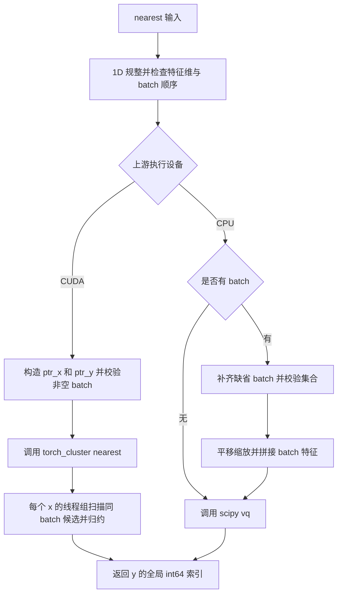
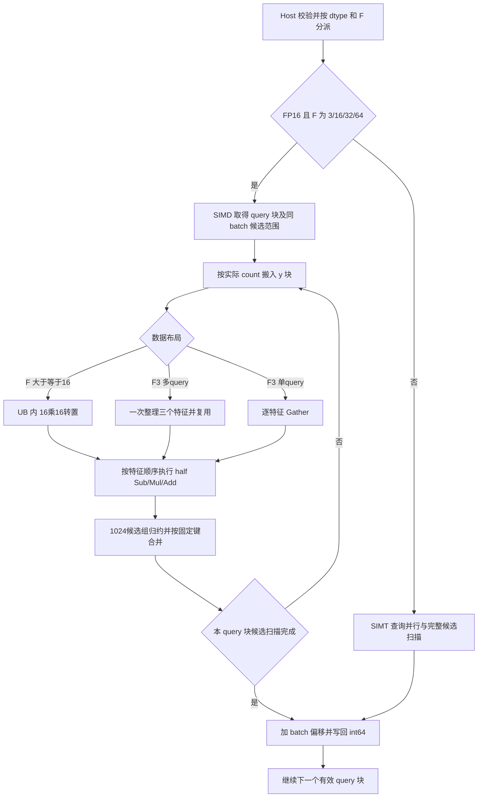

# nearest 算子设计文档

> 适配目标：Ascend 950 / arch35；上层接口：PyTorch `ops_gnn.nearest`。
> 文档版本：v0.4，SIMD 实现修订评审；参与者：transient_coder。
> 对应版本：20260909_simd。性能基准与实测结果分别列示；当前自测按冻结附件语义进行，社区评审及验收状态独立记录。

## 一、需求背景（required）

### 1.1 需求来源

本任务来自 CANN 训练营北京邮电大学专场的 [nearest 算子开发（950）任务](https://www.hiascend.com/activities/task-center/details/718ae9ad67ad47b4b82e5d366f6aa2f5)。根据任务书，使用 Ascend C 实现完整 NPU Kernel，并在 `cann/ops-gnn` 中提供与 `torch_cluster.nearest(x, y, batch_x=None, batch_y=None)` 一致的 Python 调用接口。

功能、精度和性能均通过 PyTorch 层入口验收。目标是将 `x` 中每个点分配给同一 batch 内距离最近的 `y` 点，输出该点在完整 `y` 张量中的行下标。

### 1.2 背景介绍

#### 1.2.1 算子用途与参考源码

nearest 用于点云聚类、几何数据处理和图模型中的最近点分配。输出是离散索引，距离计算中的微小数值变化也可能改变输出，因此设计同时考虑计算效率、舍入行为与确定性选择规则。

本任务是 PyTorch 扩展适配，不是历史 TBE 算子重写。官方模板及检查表中的 TBE 源文件、aclnn 信息库分析在本任务中不适用，使用下列实际来源替代：

| 层次 | 参考文件 | 分析用途 |
| --- | --- | --- |
| 上游 Python 接口 | [pytorch_cluster 1.6.3 / torch_cluster/nearest.py](https://github.com/rusty1s/pytorch_cluster/blob/1.6.3/torch_cluster/nearest.py) | 1D 规整、batch 校验、CPU/GPU 分支及公开签名 |
| 上游 C++ 注册入口 | [csrc/nearest.cpp](https://github.com/rusty1s/pytorch_cluster/blob/1.6.3/csrc/nearest.cpp) | `torch_cluster::nearest` 的注册与分派 |
| 上游 CUDA 实现 | [csrc/cuda/nearest_cuda.cu](https://github.com/rusty1s/pytorch_cluster/blob/1.6.3/csrc/cuda/nearest_cuda.cu) | batch 候选范围、距离扫描、带索引归约 |
| 任务附件 | `nearest_task_doc.md`、`test_cases/test_nearest.py`、`test_cases/benchmark_nearest.py` | 本任务的功能范围、测试参考和 36 项性能清单 |

上游 1.6.3 是本文分析所用版本；正式自测还须记录实际采用的 torch、torch_cluster、scipy 和 torch_npu 版本。不能把不同版本的参考行为默认视为相同。

#### 1.2.2 标杆现状分析

上游 Python 入口将一维输入视为单特征点集，并检查 batch 顺序。CUDA 分支通过前缀指针定位同 batch 的候选范围，调用已注册算子；一个 CUDA block 对应一个 `x` 点，线程分担候选，最后归约距离和索引。CPU 分支使用 scipy `vq`，有 batch 时会先平移、缩放并拼接 batch 特征。原上游 C++ 入口没有 CPU Kernel。

任务附件另有一个名为 `nearest_cpu` 的 Python 参考函数：按输入 dtype 逐特征计算差、平方及累加，平局按候选的 1024-lane 顺序选择。它没有直接调用上述 CPU `torch_cluster/scipy` 路径。本文明确区分两者，精度差异及评审事项见 3.2.3 和 5.1。

#### 1.2.3 标杆流程图



图 1：上游参考的执行路径。NPU 实现复用其接口和分段思想，使用原生 Ascend C Kernel 完成最近点搜索。

## 二、需求分析（required）

### 2.1 需求描述与外部组件依赖

| 组件 | 版本或范围 | 职责 |
| --- | --- | --- |
| Ascend 950 系列 | arch35 | 执行目标 Kernel |
| CANN | 9.1.0 及以上，具体构建版本记录于报告 | Ascend C 编译、运行与平台资源查询 |
| PyTorch | 2.7 及以上 | Tensor、Python 接口、扩展注册 |
| torch_npu | 与 PyTorch/CANN 配套 | NPU 设备、当前 stream 和内存生命周期 |
| ops-gnn | 最终交付所用 commit 及补丁哈希随报告保存 | 扩展构建、模块导出、源码集成 |
| torch_cluster / scipy / pytest | 冻结实际版本 | 独立 CPU 参考与自测；scipy 不参与 NPU 搜索 |

### 2.2 内部适配模块与需求拆解

| 模块 | 计划交付位置 | 责任 |
| --- | --- | --- |
| Python 包装 | `python/ops_gnn/nearest.py` | 参数校验、连续化、batch 指针生成、分派 |
| Host 入口 | `csrc/npu/nearest/op_host/nearest.cpp`、`nearest.h` | 输出分配、平台信息、分核、设备/stream、Kernel 下发 |
| NPU Kernel | `csrc/npu/nearest/op_kernel/arch35/nearest_kernel.cpp`、`nearest_kernel.h` | 精确候选扫描、距离计算、在线 argmin 和写回 |
| 内部辅助模块 | 同一算子目录内的逻辑/配置头文件 | 复用索引、比较器与调度逻辑；文件拆分可随维护需要调整 |
| 包导出与构建 | ops-gnn 现有绑定、包导出及构建文件 | 在现有工程中增加 nearest，避免冲突注册 |
| 测试 | `test/nearest/golden.py`、`test_nearest.py`、`benchmark_nearest.py` | 功能、精确索引、性能及复现步骤 |
| 最终代码仓设计文档 | `docs/experiment/design/nearest/nearest算子设计文档.md` | 与最终实现同步的设计说明 |

必须覆盖 FP16/FP32、单图和 batch、1D 与泛化特征维、异常 batch、确定性、精确索引以及完整 36 项性能。性能表中的 F=3/16/32/64 不构成公开接口的特征维上限；附件中 F=128/256/768 等情况由通用路径处理。

### 2.3 算子原型与参数约束

```python
def nearest(
    x: torch.Tensor,
    y: torch.Tensor,
    batch_x: Optional[torch.Tensor] = None,
    batch_y: Optional[torch.Tensor] = None,
) -> torch.Tensor:
    ...
```

| 名称 | 输入/输出 | 数据类型 | 逻辑格式与 shape | 约束或含义 |
| --- | --- | --- | --- | --- |
| x | 输入 | float16 / float32 | 稠密 ND，`[N,F]` 或 `[N]` | 一维按 `[N,1]` 解释；F 为正 |
| y | 输入 | 与 x 一致 | 稠密 ND，`[M,F]` 或 `[M]` | 与 x 同设备且 F 相同 |
| batch_x | 可选输入 | int64 | ND，`[N]` | 非负、有序；长度与 x 点数一致 |
| batch_y | 可选输入 | int64 | ND，`[M]` | 非负、有序；长度与 y 点数一致 |
| cluster | 输出 | int64 | ND，`[N]` | 与 x 同设备；每项是完整 y 中的全局行下标 |

两侧非空 batch ID 集合必须一致；允许重复 ID 和共同缺号。仅一侧提供 batch 时，缺省侧按 batch 0 解释，再检查集合。未排序或集合不一致在 Python 层抛出 `ValueError`。batch Tensor 与输入位于同一设备。

不执行按点或按特征的广播。非连续稠密输入在包装层规整为连续布局，转换成本计入公开入口耗时。空 x 的工作实现返回同设备空 int64 Tensor；非空 x 配空 y、F=0、dtype/shape/device 不合法时报告异常。空输入与异常检查先后顺序作为补充兼容性测试记录，不据此放宽任何任务书必选行为。

## 三、详细设计（required）

### 3.1 算子分析与调用方式

设 batch b 的候选集合为 `Y_b`，则对属于 b 的每个 x 点：

$$
D(i,j)=\sum_{f=0}^{F-1}(x_{i,f}-y_{j,f})^2,\qquad
\mathrm{cluster}_i=\underset{j\in Y_b}{\operatorname{argmin}}D(i,j).
$$

工作实现直接计算平方距离并融合 argmin，不生成完整距离矩阵。计算复杂度为 `O(Σ_b N_b M_b F)`。相同距离按固定比较规则处理，不用 epsilon 将不同距离合并成平局。

调用链为 `ops_gnn.nearest → Python 包装/注册分派 → C++ Host → 当前 NPU stream → arch35 Kernel`。带 batch 的路径使用 `torch.ops.torch_cluster.nearest(x,y,ptr_x,ptr_y)`；无 batch 路径可直接进入同一 C++ 实现，省去冗余指针 Tensor 分配。两条入口必须在相同输入下给出一致结果。

```python
import torch
import torch_npu
import ops_gnn

x = torch.tensor([[0., 0., 0.], [3., 0., 0.]], device="npu")
y = torch.tensor([[1., 0., 0.], [4., 0., 0.]], device="npu")
cluster = ops_gnn.nearest(x, y)  # int64[2]，预期全局下标 [0, 1]
```

此例仅说明调用方式，不作为已执行测试记录。公共接口不增加 tile、线程数或精度模式等用户参数。

### 3.2 算子实现与总体方案

本版仍采用同 batch 内的精确候选扫描与在线 argmin，按照 dtype 和特征维度选择计算路径。FP32 保留 SIMT 查询并行；FP16 的 F=3/16/32/64 采用顺序 half SIMD 运算，其他正 F 使用通用 SIMT。相比 v0.3，主要变化是 FP16 的数据组织、显式 UB 缓冲及同步，公开接口、候选完整性和全局 int64 输出不变。

#### 3.2.1 Host 侧设计与调用链

Python 包装层完成 1D 规整、dtype/设备/特征维校验、非连续输入连续化、batch 排序及集合校验。batch 路径按连续非空段构造 ptr_x/ptr_y；无 batch 时进入同一个 Host 的单图快路径。校验所需布尔结果可能发生同步，不把该接口描述为所有场景“零同步”。

Host 创建同设备 int64[N] 输出，通过平台信息查询 AIV 核数和 UB 容量，在当前 NPU stream 下发内核，并为输入及 ptr 存储记录 stream 生命周期。目标调用链为：

```text
ops_gnn.nearest → Python 包装 / PrivateUse1 分派 → nearest_npu
               → 当前设备、当前 stream → arch35 Kernel → int64[N]
```

令查询数量为 N，AIV 核数为 C，查询调度粒度为 Q，核数缩放因子为 c，Host 设置：

$$
P=\min\left(\left\lceil N/Q\right\rceil,\max\left(1,\left\lfloor C/c\right\rfloor\right)\right).
$$

空 x 在合法输入校验后返回空输出，不下发搜索 Kernel。N 非空时要求 M>0。核数来自平台查询，不能把本次环境核数写成所有 Ascend 950 的固定规格。

#### 3.2.2 分核、分派与 tiling 规划

SIMT 将 N 个查询按连续范围切分：第 p 核处理 `[pL,min((p+1)L,N))`，L=ceil(N/P)，核内线程以步长 T 遍历本核查询。F=3 当前为 256 线程，其余为 128；这些是当前配置，可在同语义回归后调整。

SIMD 按查询块轮转分配：第 p 核的起始 query 为 p×BX，下一块前进 P×BX，实际尾部行数为 min(BX,N-base)。BX=4 仅用于单图或单段 F=3；多 batch 使用 BX=1，避免查询复用跨段。

本工程是 PyTorch 扩展直调，以下分派规则承担 tilingKey 的等效职责，不另造不参与构建的 aclnn 数值 key。

| 输入条件（按优先顺序） | 路径 | 当前 BY | 当前 BX |
| --- | --- | ---: | ---: |
| FP16，F=3，段数≤1，N≥4096，M≥4096 | SIMD，整理候选特征供多个查询复用 | 4096 | 4 |
| FP16，F=3，其余场景且 M≥8192 | SIMD Gather | 8192 | 1 |
| FP16，F=3，其余场景且 M≥4096 | SIMD Gather | 4096 | 1 |
| FP16，F=3，其余场景 | SIMD Gather | 1024 | 1 |
| FP16，F=16 或 32 | SIMD，UB 内 16×16 转置 | 1024 | 1 |
| FP16，F=64 | SIMD，UB 内 16×16 转置 | 512 | 1 |
| FP16，其他正 F | 通用 SIMT 扫描 | 配置参数 | 1 |
| FP32 | SIMT，F=3 展开及常见 F 查询缓存 | 配置参数 | 查询独立 |

分派只依据 dtype、shape、batch 段数和平台能力，不读取测试名称、种子或计时模式。所有候选都会计算，不进行近似近邻筛选，也不跨调用缓存与输入内容相关的结果。

#### 3.2.3 FP16 SIMD 数据流

1. 每个核取得查询块及同 batch 的 y 范围，缓存有效查询坐标，为每个 query 初始化最佳距离和无效索引状态。
2. 从 y 范围逐块搬入 `count×F` 个 half 元素，count=min(BY,end-tile)，实际尾部由 DataCopyPad 处理。
3. F≥16 时按 16×16 小块把行主序候选转为特征主序，方便沿候选方向连续向量读取。候选数不足 16 的尾部先补齐转置所需区域，但后续距离和归约仍只使用 count 个有效候选。
4. F=3、BX=1 时用 Gather 取出当前特征；F=3、BX=4 时先一次性整理三个特征，供四个 query 共用。整理成本发生在本次调用内。
5. 每个 query 的距离向量先清零，特征按 f=0…F-1 顺序执行独立的 half Sub、Mul、Add，保持每一步 half 舍入。相邻阶段显式同步，不把乘加合并成改变参考舍入的表达式。
6. 按连续 1024 候选组执行带索引 ReduceMin，再按固定的 batch 局部平局键合并组内和跨 tile 的获胜者。
7. 扫描全部候选后，加回 y 的 batch 起点，写回每个 query 的全局 int64 索引。输出复用归约缓冲前、写出完成后均同步。



图 2：FP32 SIMT / FP16 SIMD 分流及候选块流水。本版采用单缓冲，不宣称已经实现搬运与计算重叠的双缓冲流水。

#### 3.2.4 LocalMemory 预算与安全边界

SIMD 同时存活的用户 UB 包括：y 输入块、可选特征主序块、五个 half 向量（差值、乘积、距离、广播 x、归约 workspace）、uint32 Gather 偏移及 32 字节归约/输出缓冲。

$$
U=2B_YF+Z+14B_Y+32,
\quad Z=\begin{cases}2B_YF,&F\ge16\ \text{或}\ B_X>1\\32,&\text{其他}\end{cases}
$$

| 分支 | 输入块/B | 特征主序区/B | 五向量及偏移/B | 归约输出/B | 合计/B |
| --- | ---: | ---: | ---: | ---: | ---: |
| F3，BY1024，BX1 | 6144 | 32 | 14336 | 32 | 20544 |
| F3，BY4096，BX1 | 24576 | 32 | 57344 | 32 | 81984 |
| F3，BY4096，BX4 | 24576 | 24576 | 57344 | 32 | 106528 |
| F3，BY8192，BX1 | 49152 | 32 | 114688 | 32 | 163904 |
| F16，BY1024 | 32768 | 32768 | 14336 | 32 | 79904 |
| F32，BY1024 | 65536 | 65536 | 14336 | 32 | 145440 |
| F64，BY512 | 65536 | 65536 | 7168 | 32 | 138272 |

这里 F32 表示 F=32，不是 float32 dtype。Host 对 SIMD 路径按最大 163904 字节做资源校验，并采用 `userBytes <= (ubBytes/10)*7` 的保守上限。内核另有编译期预算断言。框架保留、缓存、寄存器及栈资源不属于可任意占用的用户 UB。

SIMT 路径没有用户显式 UB 块，局部查询缓存及寄存器/栈由编译器分配；这不意味着 SIMD 路径的 UB 为零。全局存储主要为输入、int64[N] 输出和 batch 指针，不生成 N×M 或 N×M×F 距离矩阵。

尾部掩码限定有效地址，补齐元素不参与 argmin。各查询由唯一核/线程负责写回，无跨核原子距离/索引更新。异步调用使用当前设备/stream，输入存储通过 recordStream 保持生命周期。改变缓冲、分派或同步方式后重新进行精度及内存安全验证。

#### 3.2.5 数值、平局及兼容性

FP16 SIMD 对差值、平方和逐特征累加分别舍入为 half；SIMT 兜底保留显式 half 舍入以及平方非负处理节点，防止已观察到的算术合并破坏附件语义。FP32 保持原有 SIMT 计算路径。二者共同以整数精确比较输出索引，不使用浮点容差接纳错误下标。

对 batch 内候选局部下标 k，平局键为：

$$
\tau(k)=(k\bmod1024,\lfloor k/1024\rfloor).
$$

距离相同时选较小键；最终返回 ptr_y[b]+k。BY=512 分块时块边界也落在 1024 分组的半组边界，BY=1024/4096/8192 时按完整 1024 组处理，跨块通过同一全局于 batch 的键合并。归约顺序与 NPU 线程数相互独立。

| 与参考路径的差异 | 原因与处理 |
| --- | --- |
| CPU/scipy 的坐标缩放、batch 特征拼接，与本实现按 ptr 分段不同 | 数学归属一致不保证有限精度索引一致，保留正式口径确认项 |
| 附件逐操作 half 舍入，与全程 FP32 参考可能不同 | 当前开发冻结为附件语义；不把附件通过等同于 scipy 正式参考已通过 |
| CUDA/附件 1024-lane 顺序，与 NPU 分核、BY 不同 | 通过显式比较键维护确定性，不用执行顺序决定答案 |
| SIMD 转置、Gather 与查询复用 | 只改变数据访问和候选并行，不改变同一候选的特征累加顺序 |

相关反例与待确认问题已提交到 [nearest 官方讨论](https://gitcode.com/cann/ops-gnn/discussions/9)。本次 42/42 和 112/112 是冻结附件及其扩展自测结论；最终社区精度规则和验收结论以组织方确认及测试为准。

#### 3.2.6 性能优化及实施余量

主要优化依次为：无 batch 包装快路径降低辅助分配开销；SIMD 独立算术恢复 half 舍入；候选布局转置改善高维特征读取；四 query 复用降低大 F3 的重复整理开销；在线 argmin 减少中间矩阵写回。

本节参数表是已测版本配置。BY、BX、线程数、核数缩放、展开因子和分派阈值可以在资源预算内继续调整，但须保持公开接口、完整候选覆盖、固定数值语义和唯一写回，并对所有受影响路径重新回归。不能把调整余量解释为对未来不同算法或不同数值规则的预先评审通过。

### 3.3 支持硬件

| 支持的芯片版本 | 适配范围 |
| --- | --- |
| Ascend 950 系列 | 本任务目标；Kernel 位于 arch35，最终构建记录实际 SoC、编译器和软件版本 |

### 3.4 算子约束限制

本次必选范围为 FP16/FP32 稠密点集、int64 batch 和 int64 索引输出；不承诺 float64、bfloat16、稀疏布局、跨设备输入或反向梯度。CPU 参考仅用于测试，NPU 搜索不回退 scipy。通用路径覆盖任务要求的泛化 F，不能因优化范围而拒绝必选输入。

NaN/Inf 及全距离溢出等情况需要单独记录与参考的行为，不用无效索引冒充合法输出。所有字节数、元素数和地址乘积均需使用足够宽的整数并检查越界；优化时使用内部窄索引必须证明取值范围，输出仍为 int64。

### 3.5 调优参数与设计变更边界

| 可调整的实现细节 | 本设计保持的约束 | 修改后的验证 |
| --- | --- | --- |
| 查询/候选/特征块大小、核数与线程数 | 每个查询恰好处理一次，完整覆盖同 batch 的 y | 尾块、非对称形状、batch、完整精度和性能回归 |
| 固定 F 展开因子、查询缓存范围、分派阈值 | 通用路径完整；各路径输出语义相同 | 专用分支边界及寄存器/栈资源检查 |
| 舍入实现方式与编译器算术约束 | 冻结参考要求的舍入与索引语义不变 | 实际产物的舍入反例、平局与全部必选精度回归；不能沿用另一头文件的结果 |
| 局部变量、辅助函数、文件拆分 | 公开接口与数据类型不变 | 构建、接口、精度回归 |
| 候选预取、片上复用、缓冲份数 | 按同时存活数据重新核算容量，显式同步、无越界 | 更新资源表/数据流并重做精度与安全检查 |
| 协作归约或负载映射 | 获胜记录完整、确定性、唯一写回 | 跨线程/跨块平局、batch 偏移、资源及性能回归 |

本节给出设计中的调优范围，不代表社区对后续变更的预先批准。更换为近似搜索、改变距离表达式、精度/平局契约、公开接口或引入新的跨核 workspace 算法，应更新对应设计章节并请评审人复核。不能用“参数可调”覆盖实际发生的核心方案变化。

## 四、特性交叉分析

| 交叉特性 | 可能影响 | 处理与覆盖 |
| --- | --- | --- |
| FP16 × 高 F | 舍入误差和溢出更易改变最近点 | 保持既定算术边界，覆盖近距离及高维反例 |
| batch × 全局索引 × 平局 | 局部 key 与全局下标混淆 | 以 batch 起点换算，覆盖非零起点和跨 1024 候选 |
| 专用 F × 泛化输入 | 优化分支可能漏掉非固定宽度 | 保留通用路径，覆盖 F=1/7/17/33/65/128/256/768 |
| 非连续输入 × 小形状性能 | 连续化或元数据成本可能主导耗时 | 公开入口端到端计时，连续输入避免重复复制 |
| 多 stream × 临时 Tensor | 提前复用存储导致异步访问错误 | 使用正确设备、当前 stream 和内存生命周期管理 |
| 分块变化 × 确定性 | tile/线程划分可能改变平局结果 | 固定比较器；跨块平局及重复运行精确比较 |

## 五、可维可测分析

### 5.1 精度标准/性能标准

| 验收标准 | 要求 | 标准来源 |
| --- | --- | --- |
| 精度 | FP16/FP32 输入的 int64 索引与指定 CPU 参考逐位一致；使用 `torch.equal`，同时校验 shape、dtype、设备、范围及 batch 归属 | 任务书第 8 节 |
| 平局与确定性 | 同输入同输出，平局与正式参考一致并文档化；当前附件规则与 CPU 路径差异提交评审 | 任务书第 5/8 节及附件 |
| 性能 | 18 个 shape × 2 个 dtype，共 36 项；每项 `标杆耗时 / 实测耗时 ≥ 0.45` | 任务书第 7 节 |
| 计时入口 | `ops_gnn.nearest`；遵循随题 benchmark 的预热、同步和迭代方式 | `test_cases/benchmark_nearest.py` |

正式性能测试采用附件的 warmup=20、iters=100，测量前后同步 NPU，按循环总时间计算平均毫秒数。wrapper、ptr、连续化及内部预处理属于调用内开销；输入生成和外部数据传输在计时外。profiling 的单 Kernel 时延用于定位问题，不直接替代上述端到端成绩。

**性能用例表：** 下表均为标杆时间，不是本实现实测。K=1024，每行测试两种 dtype；单项允许的最大时延为该列时间除以 0.45。

| N | M | F | FP32 标杆/ms | FP16 标杆/ms |
| ---: | ---: | ---: | ---: | ---: |
| 1024 | 1024 | 3 | 0.084 | 0.090 |
| 4096 | 4096 | 3 | 0.125 | 0.176 |
| 8192 | 8192 | 3 | 0.223 | 0.363 |
| 16384 | 16384 | 3 | 0.583 | 0.996 |
| 32768 | 32768 | 3 | 2.093 | 3.300 |
| 1024 | 1024 | 16 | 0.117 | 0.106 |
| 1024 | 1024 | 32 | 0.222 | 0.159 |
| 1024 | 1024 | 64 | 0.363 | 0.364 |
| 8192 | 8192 | 16 | 2.374 | 1.391 |
| 8192 | 8192 | 32 | 9.111 | 4.699 |
| 8192 | 8192 | 64 | 18.096 | 17.758 |
| 32768 | 32768 | 16 | 35.776 | 19.424 |
| 32768 | 32768 | 32 | 142.734 | 71.623 |
| 32768 | 32768 | 64 | 286.879 | 278.309 |
| 4096 | 1024 | 3 | 0.113 | 0.142 |
| 8192 | 4096 | 3 | 0.175 | 0.276 |
| 16384 | 8192 | 3 | 0.371 | 0.650 |
| 32768 | 16384 | 3 | 1.090 | 1.916 |

### 5.2 功能和精度覆盖

| 用例组 | 必要检查 |
| --- | --- |
| TC-01 基础 nearest | 两种 dtype，索引与 CPU 参考完全一致 |
| TC-02 batch 对齐 | 同 batch 候选、全局下标、不同 batch 大小 |
| TC-03 batch 不一致 | 独立构造不一致集合，抛出 ValueError |
| TC-04 batch 未排序 | 分别扰动 batch_x 和 batch_y，抛出 ValueError |
| TC-05 大规模输入 | 完整执行，不只检查输出在 NPU |
| TC-06 泛化/1D | 一维与二维等价、通用 F、非整块 N/M/F |
| TC-07 无 batch/逐节点 batch | 无 batch 快路径与显式单图一致；每节点归属正确 |
| TC-08 batch 不相交 | 抛出 ValueError，不跨 batch 搜索 |
| 补充精度 | 重复 y、近距离、FP16 舍入、跨 tile/1024 平局、非零 batch 起点、不同记录种子 |
| 补充安全与兼容 | 连续/非连续、空输入政策、错误 dtype/device/shape、stream、地址边界与资源检查 |

原附件保持原样；不足的断言在独立自测中补充。测试报告记录收集数、执行数、pass/fail/skip、返回码、首个不一致索引及参考版本。缺少设备、空日志、0 用例、必选项跳过或异常退出均不能记作通过。

### 5.3 兼容性、维护与交付

保持 Python 签名、返回设备、dtype 和形状。注册复用 ops-gnn 的扩展方式，与已加载的 torch_cluster schema 做兼容检查；不覆盖已有 CPU/CUDA 实现。内部函数名和调优常数不构成公开 API。

最终自测固定同一源码/构建身份，记录设备、CANN、编译器、PyTorch/torch_npu、参考库版本、源码及扩展产物哈希、导入路径、测试命令、完整日志与 36 项原始时间。代码或编译配置变化后重新验证，不能拼接多个候选各项最快成绩。自测通过与社区验收通过分别记录。

设计评审阶段提交本文；验收阶段另交设计 PR 合入截图、完整自测代码和 README、精度与性能报告及截图、代码仓链接/分支/算子目录。源码引用、结果版本和文档描述保持一致。

### 5.4 已保存自测结果与版本对应

对应同一完整源码构建：原始附件 42/42 通过，扩展测试 112/112 通过。四轮均使用公共 PyTorch 入口、20 次预热、100 次同步计时，分别为 35/36、36/36、36/36、35/36；第 3 轮最差比值 0.507472，第 4 轮仍观察到单项偏慢，不宣称所有重复轮次稳定通过。

源码 SHA-256：`acb2ffe5212b1639517a727c034969f15a98eb07de8c6f3f9aa5962fb6cb23bc`。

内核动态库 SHA-256：`75bd04268d461b36fc788703fa53a40c680a28e306269880398326bca4914fff`。

Pybind 动态库 SHA-256：`3e26fe887d4bd91419f36de32da2344c6d3d8632e0d9930298fd23185b6b0af8`。

完整报告保留全部四轮原始记录、精度逐项日志、构建命令及环境信息。性能测试脚本本身不逐点生成 CPU 真值，不能把其 36 项性能通过描述为 36 个大形状都做过额外精确索引比对。原始附件中部分测试只检查设备，扩展测试补充索引、范围、batch 和平局检查；报告按实际断言分开说明。

## 参考依据

1. [nearest 任务入口](https://www.hiascend.com/activities/task-center/details/718ae9ad67ad47b4b82e5d366f6aa2f5)及其随题任务书、测试附件。
2. [官方设计文档模板](https://gitcode.com/cann/cann-ops-competitions/blob/master/04_tasks/01_community-task-2026/resources/design_template.md)。
3. [设计文档 CheckList](https://docs.qq.com/sheet/DUHVGUFdmSFRjVFFU?tab=000001)。
4. [北邮专场规则](https://gitcode.com/org/cann/discussions/285)、[社区任务开发流程](https://gitcode.com/org/cann/discussions/39)。
5. [2026 社区任务提交目录说明](https://gitcode.com/cann/cann-ops-competitions/blob/master/04_tasks/01_community-task-2026/README.md)。
6. [nearest 官方任务讨论与已提交的精度澄清问题](https://gitcode.com/cann/ops-gnn/discussions/9)。
