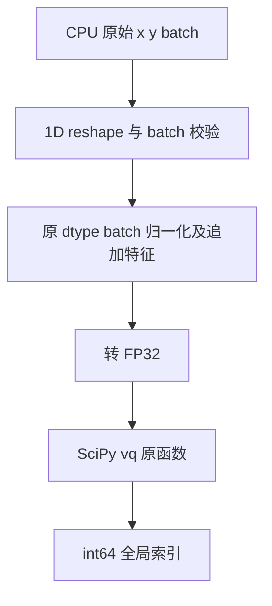
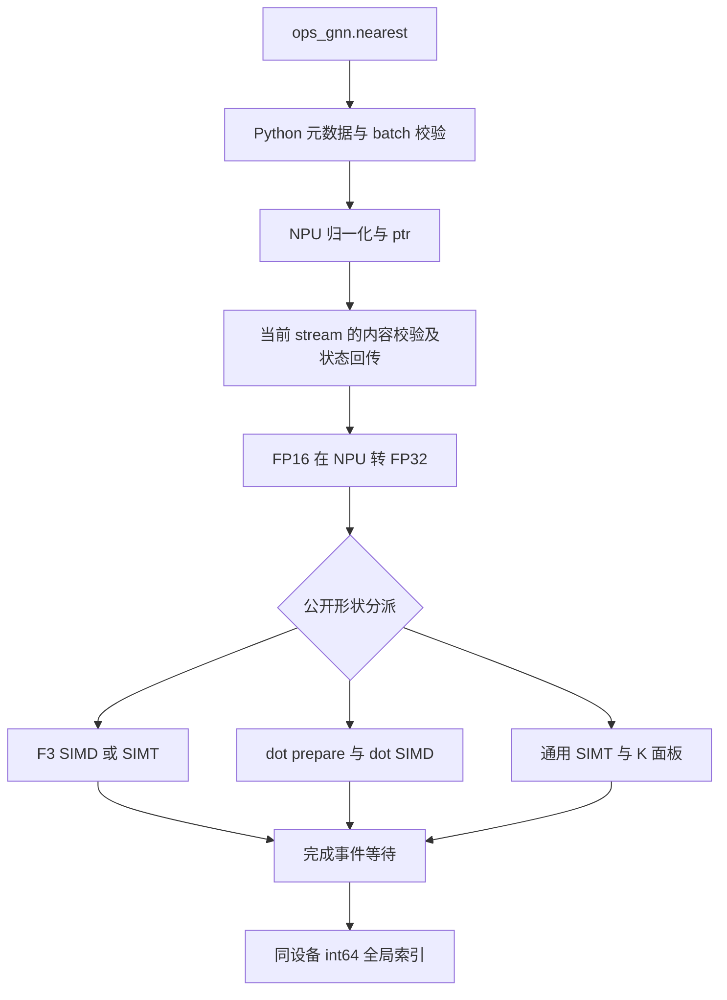

# nearest（Ascend 950）设计修订 v0.5 / c25

## 1. 需求背景

对应任务：[CANN训练营北京邮电大学-nearest算子开发(950)](https://www.hiascend.com/activities/task-center/details/718ae9ad67ad47b4b82e5d366f6aa2f5)。贡献者为 transient_coder。本修订更新已合入的[设计 PR #1437](https://gitcode.com/cann/cann-ops-competitions/pull/1437)，针对[上次验收反馈 issue #1](https://gitcode.com/transient_coder/ops-gnn/issues/1)中 FP16 索引不一致问题说明当前实现与验证。

官方已在[任务讨论帖](https://gitcode.com/cann/ops-gnn/discussions/9)明确“统一以CPU torch_cluster作为标杆，附件的用例仅供参考”。v0.4 中附件 FP16 逐操作 half 舍入及 1024-lane 平局顺序不再作为验收规则。

数学目标为对每个 x 行，在其所属 batch 的 y 行中寻找最近点，返回 y 的全局索引。浮点近邻排序以冻结 CPU 参考的实际输出判断，不以数学等价或距离容差代替索引一致性。

## 2. 需求分析与接口

```python
def nearest(x, y, batch_x=None, batch_y=None) -> torch.Tensor:
    ...
```

| 参数 | 类型与形状 | 约束 |
|---|---|---|
| x | float16/float32，[N,F] 或 [N] | NPU 稠密张量，1D 变为 [N,1] |
| y | 与 x 同 dtype，[M,F] 或 [M] | 同设备，同一正特征维 |
| batch_x / batch_y | 可选 int64，[N] / [M] | 同设备、非降序、非空 batch 集合匹配 |
| 输出 | int64，[N] | 与 x 同设备，y 全局索引 |

生产路径必须使用完整 Ascend C kernel。CPU/SciPy 仅出现在测试参考中；输入转换、校验、预处理、临时分配及同步均保留在公共调用内。原输入每次重新检查，不缓存输入对应答案。

## 3. 详细设计

### 3.1 参考行为与数值路径

开发参考固定为 torch_cluster 上游 `nearest.py` 原函数，commit `e9a855c284b45edcbf0282cf70ac09bee0ce4e49`，源文件 SHA-256 `26e6075a5a9980835795f3cf78035ecacae26340247903a5c8c4cc793a66d028`。测试实际执行此未修改的原函数，不声称已安装完整 torch_cluster 扩展包。

PyTorch 2.7.1+cpu、NumPy 1.26.4、SciPy 1.16.0、SciPy OpenBLAS 0.3.28/SkylakeX、单线程是为复现冻结的工程选择，非官方指定版本。参考代码与 SciPy `_vq`、OpenBLAS 库均记录哈希。

无 batch 时，FP16 在 NPU 上先转 FP32，随后计算距离。存在 batch 时，先按原输入 dtype 做平移、除以全局范围、追加 batch 特征，再转 FP32。不能把 batch 简化成原坐标上的分组暴力搜索。

有效特征维小于5时使用分开的 FP32 减、乘、加；有效特征维大于等于5时对齐冻结参考的 `(-2 dot + norm_x) + norm_y` 浮点路径。一般 GEMM 路径以448为K面板基准，最后两块按16对齐平衡；小矩阵路径保留16路FMA及尾块归约顺序。分派只依赖公开 shape、dtype、batch/grid，不依赖测试名称、随机种子或输入内容。

有限有效距离的平局按 CPU 参考的首次最小索引处理。NPU 完整扫描候选，按距离及全局索引归约，不再使用旧 `%1024` 键。


```mermaid
flowchart TD
    A[CPU 原始 x y batch] --> B[1D reshape 与 batch 校验]
    B --> C[原 dtype batch 归一化及追加特征]
    C --> D[转 FP32]
    D --> E[SciPy vq 原函数]
    E --> F[int64 全局索引]
```

### 3.2 Python 与 Host

Python 检查张量种类、设备、dtype、形状、存储格式、batch 长度及 sorted 条件，用 `unique_consecutive` 和计数构造压缩 ptr，允许共同缺号及排序负标签。空 x 带 batch 时仍先检查集合一致性。

NPU batch 归一化使用 `nearest_scale`，按二进制浮点尾数、指数和商余数实现 round-to-nearest-even，并处理 subnormal。点数据保持在 NPU；Host 仅取得归一化所需的极值标量和校验状态。

Host 在当前 NPU stream 上执行有限值/ptr 校验 kernel。ptr 元数据校验后复制，内容校验通过前不把 ptr 用于距离地址计算。每个校验 block 输出8个 int64 状态，只搬回新产生的状态。线程局部、按 ACL context 区分的池复用 pinned Host 存储与 SYNC event，不复用校验结论。等待使用 `aclrtQueryEventStatus` 和 `std::this_thread::yield()`；异常时等待或隔离仍被 DMA 使用的资源，避免提前释放。

使用 `OptionalNPUGuard`、调用方当前 stream 与 `NPUCachingAllocator::recordStream` 维护设备与存储生命周期。距离完成事件也在该 stream 上记录并等待，返回同设备 int64 结果。

### 3.3 分核、分块及资源

核数从平台 AIV 能力与 N 计算；UB 容量从平台查询，不把另一型号的核数或 UB 大小作为常量。当前最大显式用户 UB 预算为163,904字节，Host 在启动前检查资源。

| 路径 | 分派与组织 | 显式 UB 字节 |
|---|---|---:|
| F=3 SIMD 大块 | batch≤1，N/M≥4096，BY=4096，BX=8 | 163872 |
| F=3 SIMD 常规 | batch≤1，BY=1024，BX=4 | 40992 |
| F=3 SIMD 分段 | 多 batch，BY=1024，BX=1 | 40992 |
| F=16 dot SIMD | 无 ptr，N×M>1200，M≤1048576，BY=2048，BX=4 | 163872 |
| F=32 dot SIMD | 同上，BY=1024，BX=4 | 147488 |
| F=64 dot SIMD | 同上，BY=512，BX=4 | 139296 |
| SIMT 通用 | 其他形状或分段路径，完整扫描与在线 argmin | 不使用上述 SIMD UB 数组 |

F=3 另有仅按 shape/grid 判断的320线程 SIMT 分派：当每核查询行落在257至320范围时避免256线程路径第二次迭代。其他 SIMT 路径按配置使用128或256线程。

F=3 搬入候选块并转为 feature-major，在同 batch 内复用多条 x。dot SIMD 先生成 y 转置及 x/y 范数，再按候选方向向量计算；临时 GM 空间为 `4×(F×M+N+M)` 字节，不建立完整 N×M 距离矩阵。FP16 转换的 FP32 临时量亦在当前调用内分配并计时。

UB 公式分别为 F3 `2×BY×F×4 + 4×BY×4 + 32`，dot `BY×F×4 + 4×BY×4 + 32`。尾块按真实 count 搬运和归约，索引最终写回8字节。


```mermaid
flowchart TD
    A[ops_gnn.nearest] --> B[Python 元数据与 batch 校验]
    B --> C[NPU 归一化与 ptr]
    C --> D[当前 stream 的内容校验及状态回传]
    D --> E[FP16 在 NPU 转 FP32]
    E --> F{公开形状分派}
    F --> G[F3 SIMD 或 SIMT]
    F --> H[dot prepare 与 dot SIMD]
    F --> I[通用 SIMT 与 K 面板]
    G --> J[完成事件等待]
    H --> J
    I --> J
    J --> K[同设备 int64 全局索引]
```

### 3.4 目录与构建

实现位于 `csrc/npu/nearest/op_host`、`csrc/npu/nearest/op_kernel/arch35`、`python/ops_gnn/nearest.py`，由现有 CMake/pybind 接入；注册 `torch_cluster::nearest` 的 PrivateUse1 后端，不注册 CPU 回退。标准功能入口为 `python -m pytest test/nearest -vv --tb=short -W ignore::UserWarning`。

目标为 Ascend950PR / dav-3510，CANN9.1.0。当前发布保持 c25 的原始141文件内容，新增交付说明和本修订；完整树哈希不能与仅原始141文件的冻结摘要混淆。

## 4. 可维可测分析

### 4.1 精度与覆盖

每项检查同设备、int64、shape、索引范围、batch归属及 `torch.equal`。保存完整输入、CPU参考、失败实际值和加载身份；失败、缺项、skip/xfail、非零退出均不得通过。

2026-09-18 同一 c25 实现的新服务器验证：保存失败12/12、原42/42、专项171+50/221、标准入口62/62、边界290/290、完整仓库1632/1632，均无skip/xfail。套件之间存在重叠，不将这些数量相加当作独立用例总量。标准62项为原42加20项项目补充，不冒称取得并运行了评审原版52项。

已修补的实际问题包括：FP16 采用 CPU 的 FP32 距离路径，高维FMA/K分块舍入，排序负batch标签，空x带batch集合检查，以及标准pytest支撑文件隔离。针对 issue #1 八个形状保留完整尺寸回归，未把缩小反例当成原形状通过。

### 4.2 性能与重复

题目标准为完整18 shapes×2 dtype，共36项，每项 `标杆ms/实测ms≥0.45`。公共 PyTorch 入口，20次预热、100次调用，两端同步，所有内部处理计入。

2026-09-18 预声明首轮36/36通过，最差0.540639737；额外五轮均36/36通过0.45和内部0.49，最差依次为0.541378273、0.541510532、0.540381005、0.541053652、0.541071426。每轮先验证全部性能输入索引，同一构建、同一冻结输入，不拼最快项。

旧失败项8192/4096/3、float16以原保存输入连续复测300.067秒，共11686窗口/1168600次计时调用；每窗口前精度通过，0.45/0.49失败窗口均为0，最慢100调用窗口平均0.259192884ms。此固定输入观测不证明长期或混合负载长尾根除。

### 4.3 兼容性及待明确范围

本次软件为 Python3.12.13、CANN9.1.0、torch2.7.1+cpu、torch_npu2.7.1.post8；驱动25.7.rc1，旧记录为25.7.rc1.6。新编译 kernel及pybind与旧c25二进制哈希一致，但不声称整个服务器完全相同或已建立驱动因果归因。

尚待官方明确的参考边界：高FP16 batch标签的特征舍入、空y、有限值溢出和零范围batch等。具体行为以代码和归档诊断为准，不编造合法索引或宣称覆盖所有未定义输入。

完整内部并发、持续压力、内存及sanitizer检查本次未执行；历史工具对950的覆盖不足没有改称通过。以上是自测与申请复验材料，不是社区验收通过声明。

## 5. 冻结身份

- c25原始141文件摘要：`f0b18cf4d0df0046ed5fa0c22d50dd430fa61ed0554be97f2e729c27427f8769`
- kernel：`6ff7a8c8bfc8e08b52a2f245319f640269d21fe06be540960aa8037a9f18dc5e`
- pybind：`16c3a98316e59ac1e826588bd0324d976be105b1ff4e6fed9418dfff6d4c4996`
- 原测试框架：`dc56c7ce565e53ec243631045cb78dda6137dddc765ad06079a99f5cc6ed1c48`

具体提交号、报告和原始结果见本次验收交付清单。AI辅助：OpenAI Codex用于设计核对、实现迭代、测试及文档整理；结论均依据记录的实际构建与运行结果。
