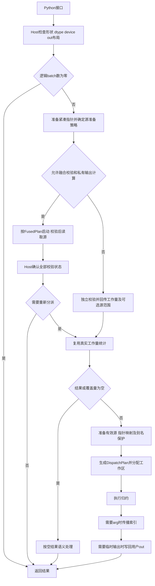

# Segment CSR 算子设计文档

本文描述当前 Ascend C 与 PyTorch 实现，适用于 Ascend950PR / DAV_3510 / CANN 9.1.0。文档按[官方设计模板](https://gitcode.com/cann/cann-ops-competitions/blob/master/04_tasks/01_community-task-2026/resources/design_template.md)组织，重点说明CSR段并行策略、确定性保证与indptr校验。设计对应的源码、运行库及测试结果由[验证索引](https://gitcode.com/Tustarsss/segment_csr/blob/segment-csr-remote/docs/experiment/reports/segment_csr/regular_20260908/index.json)记录哈希；构建入口见[开发说明](https://gitcode.com/Tustarsss/segment_csr/blob/segment-csr-remote/docs/segment_csr/README.md)。

# 需求背景（required）

## 需求来源

社区任务“segment_csr 算子开发”要求实现与 `torch_scatter` 对齐的 PyTorch 前向接口，支持确定性分段归约，并完成指定类型的功能和性能验收。实现采用 Ascend C Kernel、C++ Host 适配与 Python 接口三层结构。

## 背景介绍

### 应用场景

CSR 行指针直接给出每个段在源张量中的连续行区间，可用于 GNN 邻接聚合、稀疏特征池化和批量分段统计。不同段和不同特征的输出相互独立，可按工作量分配到多个 AIV 核；单个长段也可沿特征维并行。

# 需求分析（required）

## 需求描述

实现七种dtype、五种归约模式及六个公开前向接口，支持广播、非连续布局和可选out；所有归约在NPU执行。

### 公开接口

```python
segment_sum_csr(src, indptr, out=None) -> Tensor
segment_add_csr(src, indptr, out=None) -> Tensor
segment_mean_csr(src, indptr, out=None) -> Tensor
segment_min_csr(src, indptr, out=None) -> Tuple[Tensor, Tensor]
segment_max_csr(src, indptr, out=None) -> Tuple[Tensor, Tensor]
segment_csr(src, indptr, out=None, reduce="sum") -> Tensor
```

`add` 与 `sum` 共用实现。通用 `segment_csr` 在 `min/max` 模式下只返回值；对应子接口返回值与 INT64 索引。接口不增加 `dim_size`，不接受 `mul`，非法归约名抛出 `ValueError`。

| 项目 | 约定 |
|---|---|
| 源类型 | FP16、FP32、BF16、INT8、UINT8、INT32、INT64 |
| 行指针 | INT64，与src位于同一NPU；支持前缀广播和非连续布局 |
| 输出值 | 形状按段数替换归约轴，dtype和device与src一致 |
| 用户out | 支持合法非连续布局及ND/NCHW/NCDHW基础格式；内部地址不能重叠；返回同一Tensor对象 |
| arg | INT64，形状与输出值相同；使用原始归约轴行号，严格首胜 |
| 空输入与空段 | 按CPU标杆语义处理，详见数值设计 |
| 执行范围 | 前向；启用梯度记录且src或out需要梯度时明确拒绝 |
| 确定性 | 固定计算结构与合并顺序；不使用全局原子归约 |
| 性能验收 | FP16/FP32/INT32/INT64，29组形状×4种归约，共464项；每项reference/NPU≥0.45 |
| 精度验收 | 通过PyTorch公开接口与同dtype的CPU `torch_scatter` 标杆比较 |

FP16/FP32/INT32/INT64参加功能和性能验收；BF16/INT8/UINT8参加功能验收。确定性不等同于必须逐行求和：当前浮点实现保留逐行累加，整数实现采用模加法固定树及部分跨核固定合并，两者均按对应数值语义验证。

## 需求拆解

| 需求 | 设计落实 | 验证重点 |
|---|---|---|
| CSR段并行 | 段、特征块、整数行分区三层任务划分；按真实段长和负载选择分派 | 等长、偏斜、稀疏空段、多batch、单个长段及尾块 |
| 完全确定性 | 浮点固定行序；整数固定树与固定分区合并；无全局原子 | 重复执行逐位比较、整数溢出语义、严格首胜arg |
| indptr硬性约束 | Host元数据检查，设备逐次检查单调性与取值范围 | 负数、逆序、越界、高32位、非法输入不修改out |
| 接口与布局 | 六接口、输出形状推断、紧凑广播映射及统一逻辑复制 | 非连续src/indptr/out、高rank、别名、版本与stream |
| 精度与性能 | 保持任务测试及容差，使用公开PyTorch接口验收 | 七dtype功能，四dtype×四归约×29形状正式性能 |

# 详细设计（required）

## 算子分析

### 数学公式与支持形状

令 `d = indptr.dim() - 1`，定义：

- `B = prod(src.shape[:d])`：逻辑batch数。
- `N = src.shape[d]`：归约轴的源行数。
- `C = prod(src.shape[d+1:])`：每行特征数。
- `S = indptr.shape[-1] - 1`：每个batch的段数。

输入逻辑形状为 `[B,N,C]`，指针广播后的逻辑形状为 `[B,S+1]`，结果为 `[B,S,C]`。Python输出保留原始rank，仅把第 `d` 维替换为 `S`。指针前缀的每个维度必须等于对应src维度或为1。

对于batch `b`、段 `s`，设 `p=indptr[b,s]`、`q=indptr[b,s+1]`。合法端点满足 `0≤p≤q≤N`，不要求覆盖全部源行。每个特征 `c` 独立执行：

| 归约 | 非空段计算 |
|---|---|
| sum/add | 累加 `src[b,p:q,c]` |
| mean | 求完整段和，按源dtype规定的位置窄化分子和段长，再执行除法 |
| min/max | 从规定初值开始严格比较；只有更优值才更新值及行索引 |

源窗口裁剪和紧凑指针映射只改变物理寻址，不改变以上逻辑坐标、归约区间和arg含义。

### 支持数据类型

src及out支持FP16、FP32、BF16、INT8、UINT8、INT32、INT64，indptr与arg固定为INT64。形状遵循上述B/N/C/S映射，指针前缀支持广播；非连续物理布局由Host适配，不改变数学定义。

## 算子实现

### 实现方案

#### 模块划分

| 模块 | 职责 |
|---|---|
| `python/ops_gnn/segment_csr.py` | 六个公开接口、归约名及梯度路径检查 |
| `op_host/segment_csr.cpp` | 参数校验、输入准备、状态回传、计划选择、别名及生命周期管理 |
| `op_host/tensor_layout.h` | ND分配、格式与负视图适配、高维逻辑复制、外部输入所有权 |
| `op_host/layout_validation.h` | 用户out的内部地址不重叠判定 |
| `segment_csr_kernel.h` / `segment_csr_tiling.h` | 启动接口、Host计划和设备参数定义 |
| `segment_csr_kernel.cpp` | 独立校验、路由、SIMT归约及arg传播 |
| `segment_csr_schedule.h` | Host与设备共用的资格、成本及工作区上界计算 |
| `segment_csr_vector.h` | 常规对齐向量归约、分组流水线及融合校验 |
| `segment_csr_generic.h` / `segment_csr_generic_math.h` | 通用特征块DMA与调度、寄存器归约数学 |
| `segment_csr_work_queue.h` | 长段筛选、工作量前缀、任务表及遍历 |
| `segment_csr_narrow.h` / `segment_csr_split.h` | 窄整数warp归约、整数行分区与固定合并 |
| `segment_csr_pointer.h` / `segment_csr_transport.h` | 统一物理寻址、批次映射、按位复制及空结果写入 |

上述设备文件位于 `csrc/npu/segment_csr/op_kernel/arch35/`。Host计划负责分派与分配，Kernel外层负责DMA及事件，VF负责UB与寄存器计算，使调度、搬运和数值逻辑各自可独立核对。

#### 调用流程



每次调用都验证本次指针内容。只有私有输出允许与校验融合计算；用户out在独立校验成功后才会被修改。所有设备阶段按调用者当前stream顺序排队。

### Host侧设计

#### 布局规范化

内部归约输入与输出统一使用连续ND物理布局。`EmptyND`集中处理分配，四维内部张量通过一维ND存储再view恢复形状，避免后端自动选择NCHW而改变裸指针解释。

输入先处理物理格式、连续性和惰性取负标记。需要复制高维张量时，先删除单例轴并按源、目的stride共同合轴；仍超过框架复制维数限制时，使用1/2/4/8字节按位SIMT复制核。整数搬运不经过浮点中转，storage offset由实际data_ptr保留。UINT8负视图按模256语义处理。

用户out先检查设备、dtype、shape、基础物理格式及inference tensor写入规则。连续、非负视图且为ND时允许直接写入；其余合法基础布局使用临时ND输出，最后通过统一逻辑复制写回。

#### out内部不重叠判定

不同逻辑元素的物理地址不能相同。空张量先按零维度处理；非空张量依次使用以下判定：

1. 按stride排序的跨度充分条件。
2. 检查原始跨度后约去stride公因子，使用模逻辑元素数的跨度证明及可逆模乘变换。
3. 两维碰撞检查和最多16MiB临时存储的双向差分搜索。
4. 精确求解非零有界差分向量是否满足 `Σ stride[i]×difference[i]=0`。

这些快速证明和搜索预算只改变判定方法，不改变合法性。合法交错布局可以通过检查；存在实际内部重叠的out在任何写入前拒绝。

#### 指针广播免展开

对显式零stride展开的指针，先缩回对应单例轴，规范化并验证紧凑存储。

| 指针形式 | 设备表示 |
|---|---|
| 无广播 | 按逻辑batch直接索引紧凑端点行 |
| 全部batch共享 | `sharedPointers=1`，所有batch读取第一行 |
| 部分前缀广播 | 生成每个逻辑batch一个INT64行索引，由`pointerLayout`指向映射表 |

映射表大小为 `8B` 字节，避免生成 `8B(S+1)` 字节的展开端点表。合法性检查只扫描紧凑指针；工作量统计按广播倍率恢复到逻辑batch范围。

#### 有效源窗口

独立校验可同时返回非空段的最小起点和最大终点。对于达到64KiB的原生、基础格式、非连续src，只连续化所有batch共同的有效行包围区间；全空段不复制未使用的原生源。窗口不超过64KiB时使用按位复制核，避免框架复制的额外临时工作区。

`sourceRows/sourceRowOffset`记录物理窗口行距与偏移；逻辑 `rows=N` 保持不变。统一寻址函数保证SIMT、Vector、Generic及整数分区读取相同的原始行。

在源准备前生成完整 `FusedPlan`，核对dtype、宽度、行索引范围、指针容量与状态容量。非二次幂向量宽度需要复制上述大型非连续源时，使用独立校验和窗口准备；二次幂宽度在满足完整融合资格时使用融合策略。该选择不限制合法输入。

#### 别名、版本与stream生命周期

对已规范化的连续ND输入和可直接写入的out，按真实字节区间分别检查src/out、indptr/out重叠。共享Storage本身不代表地址重叠，独立DLPack Storage也不能掩盖物理重叠。比较使用地址差与nbytes，避免末地址加法溢出。

真实重叠时，比较待克隆输入的总字节数与结果字节数：克隆较小的输入侧，或选择临时输出并在所有读取完成后写回。非连续out原本就通过临时输出隔离读写。

原生输入、指针和实际写入的原生用户out均记录消费stream。外部分配器输入在校验前复制到自有存储，原始参数保活至校验完成。调用方建立生产者到消费者的stream依赖，并保活外部分配器out的所有者。

直接裸指针写入用户out时显式增加版本计数；逻辑copy-back由复制路径增加版本。空src保留用户out内容时不增加版本。

#### indptr校验

Host先校验元数据，设备再校验本次指针值，职责如下：

| 检查位置 | 检查项 | 处理原则 |
|---|---|---|
| Host | src与indptr rank均≥1，indptr rank≤src rank | 确定归约轴d，不接受无归约轴的输入 |
| Host | indptr为INT64，device与src相同，最后一维长度≥1 | 由长度推导S，提供out时要求归约轴大小为S |
| Host | 每个指针前缀维度等于对应src维度或为1 | 在读取内容前确认广播映射合法 |
| 设备 | 每个端点在[0,N]，相邻端点非降序 | 先确认对应区间合法，再允许源读取；相等端点表示空段 |
| 设备 | 零段时唯一端点也须在[0,N]；零特征保留端点检查 | 输出为空不等于指针可跳过检查；零batch没有逻辑指针行 |
| Host汇总 | 所有设备状态均有效 | 非法时抛出异常；用户out尚未被修改 |

首端点为0、末端点为N是常见形态，不是必需条件。部分覆盖和未引用源行合法；INT64端点不能先截断到INT32再判定。每次调用都重新校验，不能因为Tensor对象或Storage未变就沿用上次结论。

##### 融合校验与独立校验

**融合校验**用于无用户out、无arg且满足资格的私有输出。常规向量核每核预取不超过4096段的端点；小段特征分块入口验证完整小指针表。行数不超过INT32_MAX时，同时检查INT64端点的高、低32位，保证合法后才进行源DMA。

每核发布32B状态，包含合法性、最大段长、覆盖量及是否暂缓归约。Host确认全部核状态后返回，或复用这些统计重新分派。非法输入触发错误并丢弃私有结果。

融合状态优先使用Host映射内存。状态存储按线程/context管理，每次调用重置发布字；Host有界轮询，超限后同步当前stream以传播设备错误。映射不可用时使用设备状态及固定大小回传。该缓存只复用存储，不缓存指针有效性；退出时排空相关stream再解除映射。

**独立校验**用于用户out、arg及其他非融合调用。8个AIV各执行256个SIMT线程，按warp回传64份状态。普通路径使用192个INT64槽，依次保存合法最大段长、覆盖量及连续分核负载；窄通道增加64个中长段计数槽；源窗口路径再增加64个最小起点和64个最大终点槽，共384个INT64。

只有完整校验成功后才使用统计、启动普通归约或修改out。INT8/UINT8 mean同时检查窄化后除数是否为零。

#### Tiling参数与分派计划

| 结构 | 主要内容 | 生命周期 |
|---|---|---|
| `Tiling` | B/N/C/S、dtype、reduce、coreIndex、共享指针、部分广播映射、源窗口 | 按值传入设备核，当前ABI为80字节 |
| `RoutingStats` | 实际覆盖量、平均/最大段长、连续核/循环任务峰值、中长段计数及统计有效标记 | 本次调用的Host统计 |
| `FusedPlan` | 实际核数、是否使用小段特征分块 | 源准备与融合启动共用 |
| `DispatchPlan` | 路由、整数行分区数、工作区字数 | 分配与普通启动共用 |

设备核数通过平台API获得并按任务数量裁剪。当前验证设备返回56个AIV；代码不将该核数写成固定部署条件。独立入口显式提供路由统计，设备地址由本次运行建立，不从fixture文件恢复旧指针地址。

本实现由`DispatchPlan`的显式路由枚举及dtype/reduce编译分支承担模板中tilingkey的分支选择职责，不另设脱离计划的第二套分派编码。

### Kernel侧设计

#### CSR段并行策略

CSR的段边界已由indptr给出，无需排序或全局原子竞争。以输出坐标`(b,s,c)`为所有权单位，采用以下并行层次：

| 输入负载 | 核间任务划分 | 核内计算与输出所有权 |
|---|---|---|
| 常规对齐宽通道 | Vector将连续段区间分配到AIV | 分组搬入相邻段，每个特征独立累加，每个输出只由所属核写入 |
| 长段、特征较宽 | Generic把一个段拆成多个特征块 | 核间分担不同特征，单个特征的行遍历顺序保持不变 |
| 长短段混合或段集中 | Mixed分离长短段；Balanced按累计工作量切分任务 | 长段与短段输出集合互斥，消费者处理独占的段/特征块 |
| C=1的长整数段 | SplitInteger把同段划成固定行区间 | 各核写独占部分结果，第二阶段固定顺序合并并唯一写回 |
| 通用小负载及其余合法输入 | SIMT按输出元素网格步进 | 每线程负责完整段的一个特征，无线程间原子累加 |

核数按平台能力与真实任务量裁剪；空段数量和未引用源行不直接代表有效并行度。单核超过UB容量的段分块读取，carry跨块保存，末块才完成最终类型转换和mean。由此把核间负载分配与单个结果的计算顺序分开管理。

#### 普通路由顺序

空结果由Host提前处理。非空工作按以下顺序选择：

| 顺序 | 路由 | 选择与执行原则 |
|---|---|---|
| 1 | `SplitInteger` | C=1整数，实际长段工作量足以摊薄分区及合并成本时使用固定行分区 |
| 2 | `Vector` | 无arg、B=1、N≤INT32_MAX，FP16/FP32/INT32/INT64且32≤C≤256、C为16倍数；当前负载无需长段特征重排 |
| 3 | `Generic` / `Balanced` | N与DMA步长满足向量寻址范围，平均段长达到dtype/特征块成本门槛；按实际循环负载决定是否均衡 |
| 4 | `Mixed` | 平均段长较小但存在达到cutoff的长段，分别处理长段和短段 |
| 5 | `Simt` | 其余合法输入使用通用线程归约 |

`CanReduceVector`由融合、普通和Mixed短段入口共用。Generic的普通特征块为64列，INT64为32列；其平均段长门槛按dtype成本、特征块数量和通道利用率计算。

长段判断同时使用最大段长和真实负载，不能只看平均值。连续分核失衡由峰值工作量、最长段、可用核数和重排成本共同判断；C≥128的长段可改用特征块并行。INT64/C128在负载均衡时保留已测的常规向量分派。窄通道Mixed的cutoff结合中长段计数及建表成本计算，筛选与分配始终使用同一结果。

#### 常规Vector分组流水线

每个AIV拥有连续段区间，完整预取指针或按小指针块流式读取。组大小来自真实覆盖量和输入槽容量，随后按端点跨度缩小，避免把未引用源行算入工作量。

两个输入槽交替执行 `CopyIn → Compute → CopyOut`。每槽承载64KiB有效数据并独占512B尾部空间，容纳最大INT64成对寄存器的掩码尾部读取。普通输出使用两个槽，每槽最多32KiB；指针、carry和状态均在UB中独立分配。

计算采用以下分组方式：

- 实际等长的四段使用四条独立累加链，交错执行同一行位置的计算。
- C32的FP16/FP32/INT32将两个独立段打包进同一寄存器，支持四段或八段分组。
- 融合校验复用局部等长证明，直接按起点与长度规划整组；预分配out的sum/mean在独立校验后也扫描本核已预取指针并使用同一等长计算。
- FP16/C32、每核最多1024段的等长sum/mean可集中保存本核输出，最后一次写回。
- INT64使用成对寄存器；其min/max保留单累加链。

单段超过输入槽容量时沿行分块，carry保存完整累加精度，最后一块才执行最终窄化和mean。FP32长段预读四行后按原行序累加。局部等长且段长为二次幂时，可使用已验证的mean缩放或整数移位实现。

输出使用L2旁路，输入保留默认缓存策略。小段数的宽通道融合入口直接按特征块分派，网格向上取整以覆盖最后一个特征块。

#### Generic特征并行

任务单位为 `(batch, segment, feature_tile)`。普通类型每块最多64个特征，INT64每块最多32个特征；GM只读取真实列范围，UB对每行补齐。双输入槽预取长段，值carry与可选索引carry保存跨块状态。

不同特征块独立计算。浮点每个特征沿原行序累加；整数四行预读先合并整数对，再累加模部分和。min/max使用严格比较并保留最早胜出行号，在适用索引范围内用INT32进行核内传播，写回INT64。

C=1整数使用连续行DMA，使寄存器lane并行处理不同行。sum/mean采用模部分和与固定树；min/max先确定严格极值，再选择最早有效行号。较密集的短整数极值段使用固定warp比较树；无arg调用不生成索引传播。

#### Mixed与Balanced工作量调度

Mixed将长段和短段分开处理：生产者每次检查最多64段，把满足cutoff的长段写入独占任务区；短段由适用的Vector或SIMT路径计算；通用向量消费者处理长段的特征块。

任务表记录段索引、累计工作前缀、段长加调度成本，每项32B，每生产者另有32B头部。消费者按累计工作量划分负责区间，以二分查找定位起点后顺序消费。正的段处理成本保证空段也有明确归属。

Balanced用于平均段长达到Generic门槛但循环任务分配失衡的输入。单batch可以由端点差加段成本直接构造前缀，多batch使用任务表。仅对需要进一步判断的候选启动工作量测量；测量、建表与消费共享设备状态，通过stream顺序衔接，不增加Host同步。

融合入口发现长段或负载集中时，可以在原状态中请求重新分派。Host复用已验证的端点统计，重新启动对应路线；已产生的私有输出允许被后续有序归约覆盖。

#### 整数跨核行分区

`SplitInteger`处理C=1的INT8/UINT8/INT32/INT64长段。分区数依据真实覆盖量、最长段、有效并行度、指针扫描及启动成本选择；INT64最多64份，其他整数最多32份，并受实际核数和分区粒度限制。

第一阶段复用Generic，生成各固定行区间的模部分和或严格极值。第二阶段按固定分区顺序合并，每个输出只有一个最终写者。mean分区阶段计算sum，完整分子合并后才进行源dtype窄化及除法；极值合并保留首胜和原始行索引。

#### SIMT通用路线

每个线程负责一个或多个 `(batch, segment, feature)` 输出，读取紧凑指针映射，按逻辑区间遍历源行。线程网格步进覆盖全部结果，无跨线程原子累加。相同数值规则用于普通SIMT与Mixed短段处理。

#### min/max索引传播

归约阶段以三种索引状态区分语义：

| 状态 | 含义 | 传播处理 |
|---|---|---|
| `0≤arg<N` | 非空段产生严格胜出值 | 更新当前特征的carry |
| `arg=N` | 空段 | 保留sentinel，不更新carry |
| `arg=-1` | 非空段未产生严格胜出值 | 使用之前的carry，初值为0 |

传播按逻辑段顺序跨batch延续。少量段采用每个特征的线性扫描；当 `ceil(B×S/1024)≥4` 时，先并行扫描1024段的块，再传播块摘要，最后补齐各块未解析前缀。归约值不参与该传播阶段。

### 确定性保证与数值设计

| 类型/模式 | 实现规则 |
|---|---|
| FP32 sum/add | FP32累加，每个特征保持递增行序 |
| FP16/BF16 sum/add | FP32累加，输出时窄化到源dtype |
| 浮点mean | 完整段和与段长按CPU语义窄化后相除；FP32处理非正规数及舍入边界 |
| 整数sum/add | 模加法保持对应整数位宽的可观察结果；INT64始终使用整数运算 |
| 整数mean | 完整分子和除数按源类型处理，商向零截断；符合条件的局部等长段使用带符号偏置的算术右移 |
| min/max | 与CPU一致的初始极值、严格比较、首胜和最终dtype转换；NaN不会通过严格比较更新值 |

FP32 mean通过精确二进制放大/缩小避免除法FTZ影响，并在非正规数边界使用缩放域融合残差修正。局部段长被完整证明为二次幂时，使用精确二进制倒数乘法；整数移位路径只用于已证明的2/4/8/16/32/64行等长段。

边界处理如下：

- 空段的值为0，min/max的arg为原始行数N。
- 空src且提供out时保持out内容；未提供out时初始化结果。arg按原始行数写入sentinel。
- 零batch无需读取指针内容；零特征或零段结果不执行归约，但保留相应端点校验。
- 非空INT8/UINT8 mean的窄化除数必须非零；段长为256倍数时在写入out前拒绝。
- 部分覆盖、源窗口、特征尾块、广播及非连续写回均保留原始逻辑坐标。

确定性由固定行序或固定整数树、固定分区合并顺序、严格首胜、明确的最终写者及有序阶段交接共同保证。不同特征、不同段的执行先后可以变化，单个结果的计算结构不依赖核间竞争。

### 内存与同步设计

#### UB与GM工作区

| 路径/用途 | 空间规划 |
|---|---|
| Vector输入 | 两槽，每槽65536+512B |
| Vector指针 | 全量每核最多4096段及结束端点，或两个1056B小指针槽 |
| Vector输出 | 普通双槽各最多32KiB；适用FP16/C32分支使用最多64KiB集中输出 |
| Vector其他UB | 值carry、96B状态、按需路由端点；整体小于228KiB |
| Generic输入 | 两槽，每槽64KiB有效数据及尾部空间；按真实列搬运并在UB补齐 |
| arg摘要 | 适用时分配 `8×ceil(BS/1024)×C` 字节 |
| 部分广播映射 | `8B` 字节 |
| Mixed任务表 | 每生产者32B头部加若干32B候选项 |
| 整数分区 | 值区按源dtype紧凑保存并对齐；仅实际需要arg时分配INT64索引区 |

Mixed每生产者候选容量取分组枚举上界、`floor(totalRows/cutoff)`及可用中长段计数的较小值。筛选cutoff、候选容量和消费者参数由同一计划决定，避免分配与写入上界不一致。

#### 事件与所有权

| 数据流 | 顺序保证 |
|---|---|
| 指针MTE2→Scalar/Vector | 对应MTE2_S、MTE2_V事件后读取端点 |
| 输入槽MTE2→Vector | MTE2_V交接后计算；V_MTE2令牌允许后续复用该槽 |
| 值/索引carry | 保持在UB，跨块读取前执行对应Vector本地存储屏障 |
| 输出槽Vector→MTE3 | V_MTE3后写回；MTE3_V完成后才能复用输出槽 |
| 状态Vector→Scalar→GM | 先V_S读取统计，仅融合入口执行状态发布及对应排空 |
| 建表→消费、分区→合并、归约→arg、临时输出→copy-back | 使用同一stream的先后启动顺序 |

双缓冲的分配与取址共用槽步长常量。函数退出前排空仍持有的事件和输出槽；不同阶段使用独占写入区域，不依赖全局原子或全局barrier完成归约。

## 支持硬件

| 项目 | 当前实现与验证 |
|---|---|
| 任务要求 | Ascend 950系列，CANN≥9.1.0，PyTorch≥2.7及配套torch_npu |
| 已验证产品 | Ascend950PR_9579，DAV_3510 |
| 已验证软件 | CANN 9.1.0、PyTorch 2.7及配套torch_npu |

### 构建配置

生产目标为Ascend950PR / DAV_3510 / CANN 9.1.0，通过仓库 `scripts/remote/env.sh` 配置环境，`scripts/remote/build.sh`构建。当前真机为Ascend950PR_9579，设备查询28个AICore，平台返回56个AIV。

核代码使用Bisheng编译。该归约单元启用 `--cce-long-scbz=true`以容纳向量分支跨度，启用 `--cce-ftz=false`保留SIMT非正规数。独立真机和仿真入口链接同一目标环境设备代码，并记录源码、库和fixture身份。

## 算子约束限制

- 公开接口及dtype、形状、广播规则见需求分析，不提供dim_size，不接受mul模式。
- 当前实现范围为前向计算；梯度记录开启且src或out需要梯度时明确拒绝。
- out必须内部地址不重叠；支持的基础格式为ND/NCHW/NCDHW。合法非连续布局通过临时ND结果写回。
- INT8/UINT8 mean的非空段在源类型窄化后的除数须非零；非法情形在修改out前拒绝。
- 调用方负责生产者到消费者的stream依赖，以及外部分配器out的所有者生命周期。原生分配器的消费stream由实现记录。
- Vector的宽度、batch和行索引范围是内部路由条件；不满足时使用其他合法路径，不作为公开接口的额外限制。

# 可维可测分析

## 精度标准/性能标准

| 验收标准 | 描述 | 标准来源 |
|---|---|---|
| 功能与接口 | 六个PyTorch接口、七dtype、广播/非连续/out/arg/空输入，与CPU标杆核对 | 任务书“功能实现要求”“功能验收用例” |
| 精度 | 按《生态算子开源精度标准》采用单标杆判据，保留原题比较与既定误差阈值；整数及arg按精确语义比较 | 任务书“精度要求”、精度标准及原题测试 |
| 确定性 | 相同输入重复运行结果逐位一致；任务书允许浮点sum按误差阈值判断 | 任务书“算子约束限制” |
| 性能 | 464个唯一组合逐项reference_ms/npu_ms≥0.45 | 任务书“性能要求”及固定耗时表 |

## 兼容性分析

Python签名、归约别名、通用min/max仅返回值与子接口返回(value,arg)的行为均保持不变。当前以CPU torch_scatter 2.1.2为语义标杆；不同布局、广播表示与内部路由共享同一数值及arg规则。aclnn为任务书可选项，本实现通过PyTorch适配层调用Ascend C启动接口。

公开参数与返回类型不受内部Tiling调整影响；Host和Kernel按同一源码构建并记录哈希，独立入口同步传递当前统计参数。验证范围为上述950PR/CANN9.1环境。

## 验证方法

功能验证通过公开PyTorch接口执行，保留原题及原容差。专项测试覆盖路由、数值、arg、布局、别名、stream、容量与内存峰值。独立fixture显式核对目标路由，定向仿真检查对应设备分支。

正式性能固定为464个唯一组合，每项20次预热、100次调用，计时末尾同步；每项 `reference_ms/npu_ms≥0.45`。功能、精度、正式性能和补充接口性能分别统计。补充接口与边界性能测试记录逐项耗时、运行库身份和CPU亲和性，不替代正式矩阵的验收门槛。

## 当前验证结果

| 验证范围 | 结果 |
|---|---|
| 功能 | 7874项：自有7047、原题646、补充176、同CSR源码COO交叉5 |
| CPU精度 | 34815/34815通过，异常0 |
| 独立真机 | 167/167通过 |
| 向量宽度定向仿真 | 4/4通过，设备二进制与最终库一致 |
| 强制状态映射失败 | 670项通过，确认实际触发回退 |
| 正式性能 | 464/464达标，最低reference/NPU为0.47583119 |
| 常规接口补充 | 196项，覆盖宽度、out、batch及min/max是否返回arg |
| 宽度边界补充 | 144项，覆盖全空、短段及中长段 |

常规mean接口的代表耗时如下，N=65536、S=4096；每次测量20次预热、100次调用、计时末尾同步，表中为重复测量的中位数：

| 场景 | 当前接口耗时 |
|---|---:|
| FP32/C96，返回值 | 13.51μs |
| INT64/C96，返回值 | 15.07μs |
| FP32/C256，预分配out | 42.21μs |
| INT64/C256，预分配out | 64.63μs |

## 精度口径与证据

主验收使用同dtype的CPU `torch_scatter`，浮点按既定精度判据、整数和arg按对应精确语义比较。附加FP64诊断中的312项差异单独记录，不能替代CPU标杆成绩或写为FP64全量通过；原始输入、逐项结果和判据保留在验证报告中。

[当前验证状态](https://gitcode.com/Tustarsss/segment_csr/blob/segment-csr-remote/docs/segment_csr/VALIDATION.md)、[自验证报告](https://gitcode.com/Tustarsss/segment_csr/blob/segment-csr-remote/docs/experiment/reports/segment_csr/regular_20260908/segment_csr算子自验证报告.xlsx)及[证据索引](https://gitcode.com/Tustarsss/segment_csr/blob/segment-csr-remote/docs/experiment/reports/segment_csr/regular_20260908/index.json)保存最终源码/库哈希、环境、命令、退出码、精度与性能逐项数据。完整证据目录为 `results/remote/regular_20260908_m1g8x0iq/`，最终运行库快照为 `release`。各次失败和复测记录保留，仿真耗时不作为真机性能成绩。
