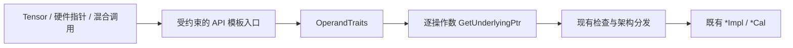

# Ascend C Basic API 指针化扩展（CUBE）设计文档

| 项目 | 内容 |
| --- | --- |
| 任务 | 9 月社区任务：AscendC Basic_API 优化实现（CUBE 侧矩阵类接口扩展） |
| 提交账号 | `yhh-max` |
| 目标仓库 | `cann/asc-devkit` `master` |
| 代码范围 | `include/basic_api/`、`impl/basic_api/`、`tests/api/basic_api/` |
| 目标环境 | Ascend 950 系列，CANN 9.0.0～9.1.0，毕昇 ASC |
| 文档状态 | 实现前设计，测试结果将在自测报告中如实记录 |

## 1. 需求背景

### 1.1 需求来源

本需求来自 CANN 社区任务“Ascend C Basic API 指针化扩展（CUBE）”。现有矩阵类 Basic API 主要以 `LocalTensor`/`GlobalTensor` 暴露数据操作数，底层实现最终使用 `__gm__`、`__cbuf__`、`__ca__`、`__cb__`、`__cc__`、`__ubuf__` 等硬件地址。本任务在不改变数值、布局、同步和架构门控的前提下，使同一对外 API 同时接受 Tensor、裸指针及合法的混合参数。

实现遵循任务书指定的工程模式：在模板入口使用统一的 `GetUnderlyingPtr` 萃取地址，复用既有 `*Impl`/`*Cal`，不引入额外 Device 拷贝，不修改 VECTOR 或 DMA 分册接口。

### 1.2 当前实现与问题

典型调用链为：

```text
用户 API（Tensor 参数）
  -> 参数/架构检查
  -> GetPhyAddr() + 地址空间转换
  -> *Impl / *Cal
  -> 硬件指令
```

底层已普遍接受硬件指针，但入口固定为 Tensor，导致静态分配的 L1/L0/UB 数组无法直接复用同一 API。直接机械替换存在以下风险：

1. `LocalTensor::GetPhyAddr()` 在部分设备编译路径返回整数地址，不能仅从返回类型反推元素类型。
2. `GlobalTensor` 地址可能带 cache 属性，必须先保存属性再取得物理地址。
3. LoadData 的目的位置、Fixpipe 的输出位置、Mmad 的 bias 位置会影响分发；裸指针必须通过地址空间限定符提供等价信息。
4. 多操作数接口必须分别推导，不能假设 dst、src、workspace 类型相同。
5. 既有 Tensor 调用、显式模板参数、默认配置及架构宏均不得发生行为变化。

### 1.3 接口范围核对与评审确认项

2026-09-16 对任务书及其直接链接表格逐行核对，发现范围口径不一致：

| 来源 | 实际口径 |
| --- | --- |
| 任务书正文 | 21 个 API 名称、61 个重载 |
| §2.4 专用清单 | 60 行、19 个分组标签、57 个去重签名 |
| 接口总表中类型码 C（按原始序号去重） | 64 行、25 个函数名 |

专用清单中的 `MmadBitMode` 是分组标签而非函数名，其中 3 行与 `Mmad`/`MmadMx` 行重复，另有 1 行存在 `const` 差异。设计与首轮开发以任务书直接指定的 §2.4 专用清单 60 行为基线，逐行保留追踪记录；评审若确认缺失的第 61 个签名或额外 2 个 API，则在同一台账补入后再冻结代码范围。不会自行纳入总表中可能属于其他分册的条目。

专用清单当前分组如下：

| 分组 | 行数 | 头文件 |
| --- | ---: | --- |
| `DumpAccChkPoint` / `DumpTensor` | 2 / 4 | `kernel_operator_dump_tensor_intf.h` |
| `Fixpipe` / `SetFixPipeConfig` | 16 / 2 | `kernel_operator_fixpipe_intf.h` |
| `IBSet` / `IBWait` / `SyncAll` | 1 / 1 / 1 | `kernel_operator_block_sync_intf.h` |
| `InitDetermineComputeWorkspace` / `NotifyNextBlock` / `WaitPreBlock` | 1 / 1 / 1 | `kernel_operator_determine_compute_sync_intf.h` |
| `InitConstValue` / `LoadData` / `LoadDataWithTranspose` | 1 / 11 / 2 | `kernel_operator_mm_intf.h` |
| `LoadImageToLocal` / `Mmad` / `MmadMx` | 1 / 4 / 4 | `kernel_operator_mm_intf.h` |
| `MmadBitMode` 分组 | 4 | `kernel_operator_limits_intf.h` |
| `PopStackBuffer` | 1 | `kernel_tpipe.h` |
| `SetAddrWithOffset` | 2 | `kernel_tensor.h` |

请评审重点确认：以 60 行专用清单还是正文 21/61 为最终验收范围；`MmadBitMode` 重复行如何计数；正文所称 SPM 是否仅指清单中的 `PopStackBuffer`。

## 2. 需求分析

### 2.1 功能要求

| ID | 要求 | 验收方式 |
| --- | --- | --- |
| F1 | 清单内 Tensor 操作数支持等价裸指针 | 每个签名至少完成编译覆盖 |
| F2 | 支持合法的 Tensor/指针混用 | 多操作数接口覆盖代表性组合 |
| F3 | Tensor 路径完全兼容 | 既有单测、样例和显式模板调用回归 |
| F4 | 指针与 Tensor 数值一致 | 相同输入分别与独立 golden 对比 |
| F5 | 地址空间和 const 属性正确 | 编译正例与负例 |
| F6 | 不改变底层数值语义 | 复用现有 `*Impl`/`*Cal`，差异审查 |
| F7 | 不跨分册扩散 | 变更文件与 60 行台账双向核对 |

### 2.2 非功能要求

- 指针适配只发生在编译期，不新增与输入规模相关的临时 Device 内存。
- 不增加额外数据搬运或运行时分支；模板实例化后应与原路径落到同一后端。
- 保留 `__NPU_ARCH__`、pipeline attribute、SFINAE、`FixpipeConfig` 和默认实参。
- 裸指针调用者负责生命周期、容量、对齐及布局；不使用 `void*` 绕过类型检查。

## 3. 详细设计

### 3.1 总体方案



对外入口将固定 Tensor 包装类型泛化为操作数模板类型。`OperandTraits` 提供元素类型、是否为 Tensor、读写属性及可获得的位置；`GetUnderlyingPtr` 只负责地址萃取：

```cpp
template <typename T>
__aicore__ inline auto GetUnderlyingPtr(const GlobalTensor<T>& value)
{
    return value.GetPhyAddr();
}

template <typename T>
__aicore__ inline auto GetUnderlyingPtr(const LocalTensor<T>& value)
{
    return value.GetPhyAddr();
}

template <typename Ptr,
    typename = Std::enable_if_t<IsHardwarePointer<Ptr>::value>>
__aicore__ inline Ptr GetUnderlyingPtr(Ptr value)
{
    return value;
}
```

实际实现优先复用仓库届时已有的公共 helper。元素类型由 `OperandTraits<Operand>::PrimType` 得到，而不是从 `decltype(GetUnderlyingPtr(...))` 单独推导；调用端按已校验的目标位置转换为具体硬件指针。若 VECTOR/DMA 分册已合入同名 helper，本任务只复用，不重复定义。

### 3.2 重载兼容策略

1. 每个数据操作数使用独立模板参数，例如 `DstOperand`、`SrcOperand`、`WorkspaceOperand`。
2. 仅允许 Tensor 或带 Ascend 地址空间的类型化指针参与实例化；写目标拒绝 const 指针。
3. 全 Tensor 调用保持现有优先级和语义。若采用新增泛型重载，则用 SFINAE 要求“至少一个操作数为硬件指针”，避免与旧重载竞争；若评审要求按任务书直接泛化原签名，则用静态断言和编译回归证明无歧义。
4. `PrimT`、配置对象、参数结构体及非类型模板参数保持原含义，不把操作数包装类型误当成元素类型。

### 3.3 分组实现

#### LoadData 与 InitConstValue

- 逐操作数取得地址，并根据 Tensor 的 `GetPosition()` 或裸指针地址空间选择 L1→L0A/L0B/UB、GM→L1/L0 等原有分支。
- 2D、3D、transpose、bit-mode、MX scale 各自保留现有参数结构和架构门控。
- 对仍接收 Tensor 的中间 `LoadDataImpl`，适配下沉至最窄的 `*Cal` 指针层，不伪造 Tensor 对象。

#### Mmad 与 MmadMx

- dst、fm、filter、bias 分别提取为 L0C、L0A、L0B、C2/L0C 合法地址。
- 保留 init/累加、unit flag、GEMV、MX scale 和 bit-mode 语义。
- Tensor bias 继续依据 `GetPosition()` 分发；裸指针必须由地址空间表达位置。若编译器不能区分 C2 与 L0C 指针类型，则该组合在评审确认前保持编译拒绝，不以错误分支代替。

#### Fixpipe 与 SetFixPipeConfig

- dst、L0C src、workspace 独立泛化，覆盖 GM/L1/UB 目的地及三类参数结构。
- GM Tensor 在地址规范化前提取 cache mode，随后再传物理地址；裸 `__gm__` 指针沿既有默认 cache 语义。
- `config.format`、`config.isToUB`、量化/relu workspace 和 `uint64_t` 约束不变。

#### 同步、Dump、TPipe 与 Tensor 辅助接口

- `IBSet`、`IBWait`、`SyncAll` 及 determine-compute 三接口保留事件顺序与内存可见性，只替换工作区表示。
- Dump 保留开关宏、`desc`、`ShapeInfo`、偏移和长度单位；低比特类型不做未经证明的指针算术。
- `PopStackBuffer` 必须保留 TPipe 栈状态和容量检查；如裸指针无法表达必要元数据，则先维持 Tensor 接口并在范围确认项中说明，禁止降低安全性。
- `SetAddrWithOffset` 保留 deprecated 属性及 Host/Device 两份语义，验证指针化是否有实际可调用意义后再实施。

### 3.4 计划变更边界

| 目录 | 变更 |
| --- | --- |
| `include/basic_api/` | 清单内声明、模板约束、必要注释 |
| `impl/basic_api/` | 公共 traits/helper 与清单内入口适配 |
| `tests/api/basic_api/` | 逐签名编译矩阵、负例、Tensor 回归 |
| `examples/01_simd_cpp_api/03_basic_api/` | 代表性 LoadData/Mmad/Fixpipe 指针样例及 README（评审允许时） |

不修改底层指令算法、不移除架构门控、不更改 VECTOR/DMA 对外接口。

### 3.5 兼容、迁移与回退

这是源代码级兼容扩展，不改变二进制数据布局。迁移按“公共 helper → LoadData/Mmad → Fixpipe → 辅助接口”分批提交，每批同时加入对应测试。旧 Tensor 路径持续可用，调用方可逐接口迁移而无需一次性切换。

若某组出现回归，可连同该组测试单独回退；公共 helper 仅在无剩余调用者后回退。不存在数据迁移或运行期回滚步骤。

## 4. 可维可测分析

### 4.1 测试矩阵

建立台账字段：`清单行号、去重签名、源文件、架构、Tensor、全指针、混用、负例、运行用例、结果`。60 行均须有结论，重复项标注映射而不重复声称覆盖。

| 类别 | 代表用例 | 判定 |
| --- | --- | --- |
| 编译覆盖 | 60 行 Tensor/指针实例化 | 合法组合通过，无歧义 |
| 编译负例 | 错误地址空间、dtype、const dst、`void*` | 编译失败 |
| LoadData | 2D/3D/transpose/MX，shape 1/32/1024/2048 的可落地 tile | 与 Tensor/golden 一致 |
| Mmad | FP16/BF16/INT8、累加、bias、GEMV/MX | 符合生态精度标准 |
| Fixpipe | L0C→GM/L1/UB、量化 workspace | 输出和哨兵区正确 |
| 同步/辅助 | 多核工作区、Dump、stack buffer | 无死锁/越界，行为一致 |
| 回归 | `bash build.sh -t` 及受影响官方样例 | 全部通过 |

每个运行用例使用同一份输入分别执行改造后 Tensor 路径与指针路径，并各自对独立 CPU golden；避免仅做路径间对比导致“双错互证”。纯搬运要求逐位一致，计算接口按任务书引用的生态算子精度标准判定。

### 4.2 950 真机验证与证据

自测报告记录代码 commit、设备型号、SoC/驱动/CANN/ASC 版本、编译与运行命令、dtype、shape、seed、误差指标、PASS/FAIL 及截图。架构不支持项必须记录编译门控与原因，不计为通过。性能无强制指标，仅检查无新增拷贝、同步和规模相关临时内存；可选记录 Tensor/指针路径耗时作为回退观察。

### 4.3 风险与对策

| 风险 | 对策 |
| --- | --- |
| 范围 21/61 与表格不一致 | PR 中请求确认；逐行台账冻结范围 |
| 泛型重载抢占原接口 | SFINAE + 显式模板/全 Tensor 编译回归 |
| Local 地址丢失元素类型 | `OperandTraits` 与地址萃取分离 |
| GM cache 属性丢失 | 先取属性、后规范化地址 |
| C2/L0C bias 无法区分 | 地址空间静态约束；不做猜测分发 |
| 多分册重复 helper | 合入前搜索并复用唯一公共实现 |
| 仅 Host 编译假通过 | 使用目标 ASC 与 Ascend 950 真机验收 |

## 5. 交付流程

1. 本设计文档在 `cann-ops-competitions` 提交 PR 并完成范围确认。
2. 设计评审通过后，在 `asc-devkit` 建立需求 Issue，关联设计 PR。
3. 在个人 fork 开发代码、测试与 README，完成静态检查和 950 真机自测。
4. 提交代码 PR、自测报告和易用性 Issue；邀请 `Ascend-CANN` 为开发者。
5. 仅在设计文档评审通过、代码达标且交付件齐全后生成验收 ZIP，并在任务广场提交。

## 参考资料

- [任务专用接口清单](https://docs.qq.com/sheet/DYWVocVFXamRFQXBD?tab=000001)
- [接口总表](https://docs.qq.com/sheet/DYXpIenNSTkp4SXBh)
- [asc-devkit](https://gitcode.com/cann/asc-devkit)
- [社区任务设计模板](https://gitcode.com/cann/cann-ops-competitions/blob/master/04_tasks/01_community-task-2026/resources/design_template.md)
- [社区任务参与说明](https://gitcode.com/cann/cann-ops-competitions/blob/master/04_tasks/01_community-task-2026/README.md)
