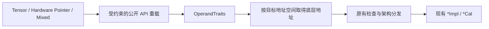

# [Requirement|需求建议]: 【社区任务】AscendC Basic_API优化实现(CUBE侧矩阵类接口扩展)设计文档评审申请

| 项目 | 内容 |
| --- | --- |
| 社区任务 | 9 月社区任务：AscendC Basic_API 优化实现（CUBE 侧矩阵类接口扩展） |
| 提交账号 | `zhangwei0402` |
| 目标代码仓 | `cann/asc-devkit` `master` |
| 设计基线 | 任务书记载 21/61；公开表完整解析 19/60；实现按官方答疑 |
| 目标硬件 | Ascend 950 系列（`dav-3510`） |
| 目标软件 | CANN 9.0.0～9.1.0、毕昇 ASC |
| 代码范围 | `include/basic_api/`、`impl/basic_api/`、`tests/api/basic_api/` |

# 需求背景（required）

## 需求来源

本需求来源于“9 月社区任务-AscendC Basic_API 优化实现（CUBE 侧矩阵类接口扩展）”。任务要求在保持现有 `LocalTensor` / `GlobalTensor` 调用兼容的前提下，为任务书 2.4 节列出的 CUBE Basic API 增加硬件地址空间裸指针调用能力。

任务书正文声明 **21 个 API、61 个重载**，但任务专用公开表的完整元数据逐行解析为 **19 个名称、60 个签名**。官方在任务答疑中明确：表内接口全部指针化；`LoadDataWithStride`、`PopStackBuffer`、`SetAddrWithOffset` 纳入；其他表外接口不要求。因此实现以公开签名和该逐项答疑为准，同时保留 21/61 原文差异，不用数量反推额外 API。门户的其他展示数字只作来源差异记录。

## 背景介绍

### 当前调用模型

现有 CUBE Basic API 的公开入口主要接受 Tensor 包装类型，而架构实现最终使用 `__gm__`、`__cbuf__`、`__ca__`、`__cb__`、`__cc__`、`__ubuf__` 等硬件地址空间指针。典型调用链如下：

```text
LocalTensor / GlobalTensor
  -> Basic API 公开重载
  -> GetPhyAddr()、位置检查和架构分发
  -> 现有 *Impl / *Cal
  -> 硬件指令
```

静态分配或原生 C 风格的 Kernel 已经持有硬件指针，但目前不能直接复用相同的 CUBE API。调用者需要自行绕过公开入口或重新包装为 Tensor，增加了迁移成本，也不利于 Tensor 与 Pointer 两种编程范式共存。

### 目标调用模型

改造后保持原 Tensor 调用不变，同时支持类型、地址空间均明确的裸指针：

```cpp
AscendC::LoadData(a2Local, a1Local, loadParams);
AscendC::Mmad(cLocal, a2Local, b2Local, mmParams);
AscendC::Fixpipe(outputGlobal, cLocal, fixpipeParams);

AscendC::LoadData((__ca__ half*)a2Addr, (__cbuf__ half*)a1Addr, loadParams);
AscendC::Mmad((__cc__ float*)cAddr,
    (__ca__ half*)aAddr, (__cb__ half*)bAddr, mmParams);
AscendC::Fixpipe((__gm__ half*)outputAddr,
    (__cc__ float*)cAddr, fixpipeParams);
```

两条路径必须落到同一套架构后端，不增加额外数据搬运，不改变数值、布局、同步及缓存语义。

# 需求分析（required）

## 需求描述

在现有 CUBE Basic API 上进行非破坏式指针扩展：

1. 任务书 21/61 原文和公开表 19/60 均建立可追溯记录；实现范围按公开签名与官方答疑执行。
2. 有 Tensor 数据操作数的接口增加等价硬件指针调用能力；多操作数接口允许任务书要求的合法 Pointer/Tensor 混用。
3. 原有 Tensor 声明、模板实参、默认参数、架构门控和运行结果保持不变。
4. Pointer 与 Tensor 在相同输入、数据类型和布局下输出一致。
5. 仅做入口适配并复用既有 `*Impl` / `*Cal`，不得重写底层计算语义。

## 范围基线

任务公开表中的接口按职责归为以下几组；以 60 条完整函数签名台账及官方明确的表外项为实施清单，不仅按函数名去重计数：

| 分组 | API 项 | 主要公开头文件 |
| --- | --- | --- |
| 数据与调试 | `DumpAccChkPoint`、`DumpTensor` | `kernel_operator_dump_tensor_intf.h` |
| CUBE 写回 | `Fixpipe`、`SetFixPipeConfig` | `kernel_operator_fixpipe_intf.h` |
| 核间同步 | `IBSet`、`IBWait`、`SyncAll` | `kernel_operator_block_sync_intf.h` |
| Determine Compute 同步 | `InitDetermineComputeWorkspace`、`NotifyNextBlock`、`WaitPreBlock` | `kernel_operator_determine_compute_sync_intf.h` |
| CUBE 搬入 | `InitConstValue`、`LoadData`、`LoadDataWithStride`、`LoadDataWithTranspose`、`LoadImageToLocal` | `kernel_operator_mm_intf.h` |
| CUBE 计算 | `Mmad`、`MmadMx`、任务表中的 `MmadBitMode` 重载组 | `kernel_operator_mm_intf.h`、`kernel_operator_limits_intf.h` |
| TPipe / Tensor 辅助 | `PopStackBuffer`、`SetAddrWithOffset` | `kernel_tpipe.h`、`kernel_tensor.h` |

`MmadBitMode` 在任务表中是单独统计的重载组，代码中仍表现为 `Mmad` / `MmadMx` 接收 `MmadBitModeParams` 的重载。本项目会按任务表原始行号记录它，不虚构同名公开函数。

附件中的 14 个样例用于功能验证和代表路径对拍。样例中出现但不属于 2.4 节冻结清单的接口只作为调用链依赖，不在本任务中擅自扩展其公开签名。

## 需求拆解

| ID | 子需求 | 验收方式 |
| --- | --- | --- |
| R1 | 公开表 60 条签名和官方明确表外项逐条定位到声明、转发和后端 | 覆盖台账无缺项 |
| R2 | Tensor、Pointer 及合法混合参数可编译 | Header Checker 与实例化测试 |
| R3 | 地址空间、元素类型和 const 属性不丢失 | 编译正例/负例 |
| R4 | Pointer 与 Tensor 数值等价 | 同输入双路径及独立 golden 对比 |
| R5 | 原 Tensor 路径不受影响 | 任务附件及任务范围 Tensor 回归通过；全量基线差异单列 |
| R6 | 不引入额外拷贝和规模相关临时内存 | 代码审查与生成代码检查 |
| R7 | 不修改 VECTOR / DMA 分册语义 | 变更文件清单审查 |

# 详细设计（required）

## 总体方案



实现只扩展公开声明与接口转发层。架构后端中已经接受裸指针的 `*Impl` / `*Cal` 保持不变。

## 地址与类型适配

任务书给出的 `GetUnderlyingPtr` 思路用于统一 Tensor 与 Pointer，但实现时需要将“元素类型”和“地址值”分开处理。原因是 `LocalTensor<T>::GetPhyAddr()` 在设备编译路径可能返回整数地址，单独依赖返回类型无法恢复 `T` 及 L1/L0/UB 地址空间。

设计采用两个职责明确的组件：

1. `OperandTraits<Operand>`：提供元素类型、Tensor/Pointer 分类、读写属性，以及 Tensor 可用时的位置元数据。
2. `GetUnderlyingPtr(operand)`：Pointer 直接返回；Tensor 返回 `GetPhyAddr()`。具体硬件地址空间转换仍放在每个 API 调用点，不从整数地址推测地址空间。

示意代码如下，具体类型工具优先复用仓库已有实现：

```cpp
template <typename Pointer,
    typename Std::enable_if<Internal::IsPointerOperand<Pointer>, bool>::type = true>
__aicore__ inline auto GetUnderlyingPtr(const Pointer& value)
{
    return value;
}

template <typename T>
__aicore__ inline auto GetUnderlyingPtr(const LocalTensor<T>& value)
{
    return value.GetPhyAddr();
}

template <typename T>
__aicore__ inline auto GetUnderlyingPtr(const GlobalTensor<T>& value)
{
    return value.GetPhyAddr();
}
```

调用点根据已经通过 traits 和地址空间校验的目的位置，显式转为 L0A、L0B、L0C、L1、UB 或 GM 指针。写目标不接受 const 指针，且不使用 `void*` 绕过编译期类型检查。

## 重载兼容策略

原 Tensor 重载原样保留，新增重载仅在至少一个数据操作数为硬件指针时参与匹配：

```cpp
template <typename Dst, typename Src0, typename Src1,
    Std::enable_if_t<HasHardwarePointer<Dst, Src0, Src1>::value, int> = 0>
__aicore__ inline void Mmad(Dst dst, Src0 src0, Src1 src1,
    const MmadParams& params);
```

该策略保证：

- 纯 Tensor 调用仍命中现有重载，不改变重载优先级；
- 每个操作数独立推导，可支持合法混用；
- 显式元素类型、`FixpipeConfig` 等既有模板实参仍保持原次序；
- 非法地址空间、const 写目标和无类型指针在编译期失败。

若同名泛型重载在毕昇 ASC 上产生歧义，则对该组改为地址空间明确的具体指针重载，仍保持上述兼容原则。

## 分组实现

### LoadData / InitConstValue / LoadImageToLocal

- 根据目标地址空间选择现有 L1→L0A、L1→L0B、GM→L1/L0 等 `*Cal` 分支。
- 2D、3D、transpose、MX、bit-mode 继续使用原参数结构体和架构门控。
- Tensor 路径继续执行 `TPosition` 检查；Pointer 路径由地址空间类型提供等价的静态约束。
- 不构造伪 Tensor，不增加中间拷贝。

### Mmad / MmadMx / MmadBitMode 重载组

- dst、fm、filter、bias 独立取得 L0C、L0A、L0B 及合法 bias 地址。
- 保留初始化/累加、unit flag、GEMV、MX scale、bias 和 bit-mode 语义。
- Pointer 与 Tensor 均转发到现有 `MmadCal` 或当前架构对应后端。

### Fixpipe / SetFixPipeConfig

- dst、L0C src、workspace 独立泛化，保留 L0C→GM/L1/UB 各通路。
- `FixpipeConfig`、format、`isToUB`、量化/ReLU workspace 和 `uint64_t` 约束不变。
- GlobalTensor 路径保留现有 cache 属性处理；裸 `__gm__` 指针使用既有指针路径的默认 cache 语义。

### Dump、同步、TPipe 与 Tensor 辅助接口

- Dump 保留开关宏、描述符、shape、偏移及长度单位，只替换被 dump 数据的表示。
- `IBSet`、`IBWait`、`SyncAll` 及 Determine Compute 三接口保持事件顺序和内存可见性。
- `PopStackBuffer` 保留 TPipe 栈状态与容量检查；不能由裸指针表达的元数据不得被静默省略。
- `SetAddrWithOffset` 保留原 deprecated 属性及 Host/Device 两套语义。

## 计划变更文件

| 目录/文件 | 计划改动 |
| --- | --- |
| `include/basic_api/` 中任务签名所在头文件 | 新增指针重载声明、约束及必要注释 |
| `impl/basic_api/` 对应 `*_intf_impl.h` | 地址适配并转发到现有后端 |
| `impl/basic_api/` 公共工具位置 | 在无现成实现时增加唯一的 traits/helper；与其他分册共用而不重复定义 |
| `tests/api/basic_api/ascendc_header_checker/` | 公开头和重载实例化检查 |
| `tests/api/basic_api/ascendc_case_*` | Pointer/Tensor 对拍及回归用例 |

不修改任务范围外的 VECTOR / DMA 对外语义，不重写 `dav_*` 架构算法实现。

## 支持硬件

| 支持的芯片版本 | 涉及勾选 |
| --- | --- |
| Ascend 950PR / Ascend 950DT（`dav-3510`） | √ |

已有接口的其他架构声明与门控保持不变。仅在其他架构存在的签名做编译覆盖并在报告中注明，不把目标硬件不可运行项记录为真机通过。

## 约束限制

1. 裸指针调用者负责地址生命周期、容量、对齐、数据布局及正确地址空间。
2. Pointer 路径不放宽原 API 的 dtype、shape、stride、format、repeat 等约束。
3. 不允许通过整数或 `void*` 自动猜测地址空间。
4. 不改变原有 Tensor 路径的断言、同步和数值语义。
5. 任务书声明的软件基线为 CANN 9.0.0～9.1.0；附件样例若与当前 master API 存在版本差异，在自测报告中单独记录，不把兼容 shim 混入交付代码。

# 可维可测分析

## 精度标准/性能标准

| 验收项 | 标准 |
| --- | --- |
| 功能 | 公开表 60 条签名及官方明确的表外项均有声明、实现和可审计验证结论 |
| 精度 | Pointer 与 Tensor 在相同输入、dtype、shape、布局下结果一致，并各自通过独立 golden |
| 数据范围 | 合法测试数据位于 `[-100, 100]` |
| Shape | 覆盖 1、32、1024、2048；矩阵接口按 M/K/N 等价缩放为合法 tile |
| 回归 | 原有 Tensor Basic API 用例全量通过 |
| 性能 | 无额外性能指标；不得新增数据搬运、运行时分支或规模相关临时内存 |

## 测试方案

建立公开表 60 条签名覆盖台账，并对官方明确表外项单列记录。字段为：任务表行号、完整签名、架构、声明位置、转发目标、Tensor 编译、Pointer 编译、混合编译、负例、运行用例、结果。

测试分四层：

1. **Header Checker / 签名 smoke**：任务范围的 Pointer/Tensor 实例化无歧义；固定 CANN 9.1 与 master 新版公共依赖的全量检查差异单独记录。
2. **编译负例**：错误地址空间、const 写目标、元素类型不匹配、`void*` 等必须拒绝。
3. **功能对拍**：复用任务附件的 `batch_matmul`、`fixpipe_l0c2gm`、`fixpipe_l0c2l1`、`fixpipe_l0c2ub`、`load_data_2dmx_l12l0`、`load_data_2dv2_l12l0`、`load_data_l12l0`、`load_data_with_stride`、`mmad`、`mmad_gemv`、`mmad_load3dv2`、`mmad_mx`、`mmad_unitflag` 等任务范围路径，增加 Pointer/Tensor 双路径调用并分别与 golden 比较；官方明确排除的 sparse 接口不作为本次扩展验收项。
4. **回归测试**：执行任务附件和任务范围 Basic API 回归；检查原 Tensor 路径、显式模板参数和 Ascend 950 编译门控。master 全量检查若受 CANN 9.2 公共依赖阻断，必须单列而不得记为通过。

自测报告记录代码 commit、设备型号、SoC/驱动/CANN/ASC 版本、编译运行命令、dtype、shape、随机种子、误差指标、PASS/FAIL 和截图。架构不可达项如实标记，不以 Host 编译代替 Ascend 950 真机结果。

## 风险与规避措施

| 风险 | 规避措施 |
| --- | --- |
| 任务书 21/61、公开表 19/60 与门户展示口径冲突 | 保留原文和抓取证据，按公开签名与官方逐项答疑执行，不用数量反推扩项 |
| 泛型重载抢占原 Tensor 接口 | 保留原重载；新增重载要求至少一个硬件指针，并做显式模板回归 |
| LocalTensor 地址返回整数导致类型丢失 | 元素类型由 `OperandTraits` 获取，地址空间由调用目标明确指定 |
| GM cache 元数据丢失 | Tensor 路径保留现有属性处理；指针路径采用既有默认语义 |
| 多分册重复定义公共 helper | 开发前检索 master，统一复用一个公共实现 |
| 仅 CPU/Host 编译产生假通过 | Header Checker、毕昇 ASC 编译和 Ascend 950 真机三层验证 |

## 兼容性分析

本改造为源代码级增量扩展：不移除或修改原 Tensor 重载，不改变数据布局和二进制存储，不更改底层计算语义。新增指针重载通过模板约束与原接口隔离；既有调用无需迁移，可按接口逐步采用 Pointer 范式。

## 实现与验证结果

- asc-devkit 实现 commit：`f7066d64513256457dcb95c3110e26d0d2887426`。
- 实现在公开头保留 Tensor 重载，新增受约束 Pointer/混合重载，公共 traits/helper 集中于 `impl/basic_api/utils/kernel_utils_pointer.h`。
- Ascend 950PR / CANN 9.1.0 / `dav-3510` 上，任务附件主样例、FP4/MX、2D/3D BitMode、Mmad/MmadMx、Fixpipe、同步、Dump、TPipe/Tensor 辅助接口均有有效通过证据。
- `InitConstValue`、`LoadImageToLocal`和双输入 `SetFixPipeConfig` 分别使用 Tensor/Pointer 同输入对拍，输出逐字节一致。
- 任务范围的 Ascend 950 指针签名在 CANN 9.1 上集中编译通过。master 全量 Header Checker 仍受 CANN 9.2 公共依赖阻断，不记为通过。
- 性能按任务书记为“无强制 case”。静态审计未发现 Pointer 适配新增动态内存、规模相关临时内存或额外数据搬运；不将该结论表述为时延实测。

# 交付流程

1. 在 `cann-ops-competitions` 提交本设计文档 PR，完成设计评审。
2. 设计通过后，在 `asc-devkit` 新建 `Requirement|需求建议` Issue，关联设计 PR。
3. 在个人 fork 的功能分支完成代码、Header Checker、UT、附件样例改造和 README。
4. 在 Ascend 950 上完成自测并整理测试报告、日志和截图。
5. 提交 `asc-devkit` 代码 PR、易用性 Issue，补齐交付链接。
6. 将代码、设计书、测试用例、README、自测报告和链接索引按任务书推荐结构打包为 ZIP 后提交验收。

# 参考资料

- [任务专用接口清单](https://docs.qq.com/sheet/DYWVocVFXamRFQXBD?tab=000001)
- [asc-devkit](https://gitcode.com/cann/asc-devkit)
- [社区任务设计模板](https://gitcode.com/cann/cann-ops-competitions/blob/master/04_tasks/01_community-task-2026/resources/design_template.md)
