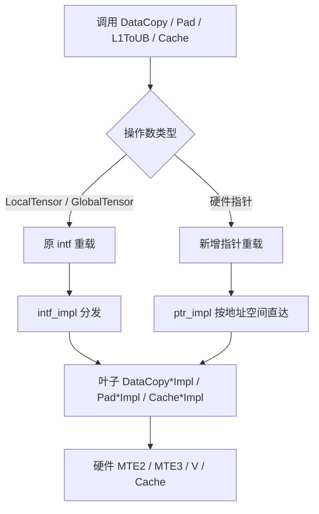

# [Requirement|需求建议]: 【社区任务】Ascend C Basic API 指针化扩展（DMA）设计文档评审申请

| 项 | 内容 |
| --- | --- |
| 活动 | CANN 社区任务 2026 |
| 任务编号 | 09-42 |
| 任务 | 9月社区任务-AscendC Basic_API优化实现（搬运类接口扩展） |
| 分册 | DMA（数据搬运 / 缓存，总表类型码 **D**） |
| 团队 / gitcode 账号 | `gcw_PHGs4N5Q` |
| 目标仓 | [`cann/asc-devkit`](https://gitcode.com/cann/asc-devkit) · `master` |
| 变更目录 | `include/basic_api/`、`impl/basic_api/`（可选：`tests/api/basic_api/`、`examples/01_simd_cpp_api/03_basic_api/`） |
| 适配硬件 | Ascend 950 系列（主验 `dav-3510` / Ascend950PR） |
| CANN 版本 | 9.0.0 ~ 9.1.0 |
| 设计文档模板 | [asc-devkit#1222](https://gitcode.com/cann/asc-devkit/issues/1222)、[design_template.md](https://gitcode.com/cann/cann-ops-competitions/blob/master/04_tasks/01_community-task-2026/resources/design_template.md) |

> 本文为交付件 1（算子设计文档）。评审通过后，按任务书第 4 节再在 asc-devkit 以 Issue 同步终稿。

---

# 一、需求背景（required）

## 1.1 需求来源

本设计对应社区任务书《Ascend C Basic API 指针化扩展（DMA · 数据搬运 / 缓存）》。任务要求在 **完全保持** 现有 `LocalTensor` / `GlobalTensor` 接口功能与兼容性的前提下，为 DMA 类 Basic API 增加硬件地址空间裸指针入参能力，使开发者可在 `__aicore__` / `__vector__` kernel 内直接调用：

```cpp
template <uint32_t blockLength>
__vector__ __global__ void dma_ptr_kernel(__gm__ float* x, __gm__ float* y, __gm__ float* z)
{
    AscendC::InitSocState();
    __ubuf__ float xPtr[blockLength];
    __ubuf__ float zPtr[blockLength];
    auto offset = block_idx * blockLength;
    AscendC::Mutex::Lock<PIPE_MTE2>(0);
    AscendC::DataCopy(xPtr, x + offset, blockLength);
    AscendC::Mutex::Unlock<PIPE_MTE2>(0);
    // 计算处理，忽略
    AscendC::Mutex::Lock<PIPE_MTE3>(0);
    AscendC::DataCopy(z + offset, zPtr, blockLength);
    AscendC::Mutex::Unlock<PIPE_MTE3>(0);
}
```

交付目标仓为 **asc-devkit** 开源仓的 `include/basic_api` 与 `impl/basic_api`。本任务**不是** GE / aclnn 三段式算子，不注册 Host 算子，不新增搬运指令语义。

官方接口清单（5 个 API 名、**44** 条重载行）：[basic_api_list_dma_api](https://docs.qq.com/sheet/DYXRHY3hFem9kWXBJ)。姊妹册 VECTOR / CUBE 并行，接口范围互不重叠。

任务书文件名常写「9 月」，正文标题仍写「8 月社区任务」，以活动页任务编号 **09-42** 与 DMA 分册范围为准。

## 1.2 背景介绍

### Basic API DMA 分层现状

| 层 | 位置 | 入参形态 |
| --- | --- | --- |
| ① 对外接口 | `include/basic_api/kernel_operator_data_copy_intf.h`、`kernel_operator_cache_intf.h` | 现以 `LocalTensor` / `GlobalTensor` 为主 |
| ② Tensor 分发 | `impl/basic_api/kernel_operator_data_copy_intf_impl.h` 等 | 读 position / ShapeInfo / cache hint，再转指针 |
| ③ 叶子 Impl | `impl/basic_api/dav_3510/kernel_operator_data_copy_impl.h` 等 | **已经是** `__ubuf__` / `__gm__` / `__cbuf__` / `__cc__` / `__fbuf__` 指针 |

叶子层已具备指针能力，缺口在 ① 层未对外暴露同名指针重载。典型叶子签名：

```cpp
template <typename T>
__aicore__ inline void DataCopyGM2UBImpl(
    __ubuf__ T* dst, __gm__ T* src, const DataCopyParams& intriParams, const uint8_t cacheMode = 0);
```

### 现状问题

| 维度 | 现状 | 问题 |
| --- | --- | --- |
| 编程范式 | 公开 API 只吃 Tensor 包装 | C 指针 / SIMT / 代码生成场景必须先构造 Tensor，再由内部 `GetPhyAddr()` 取回地址 |
| 底层能力 | `*Impl` 已按硬件指针实现 | 能力具备，封装层未对齐 |
| 兼容性 | 大量 Tensor 样例与 UT | 扩展不得改变 Tensor 路径解析、pipe 属性与数值语义 |
| 分册边界 | VECTOR / DMA / CUBE 并行 | 禁止改 LoadData / Mmad / VECTOR 计算类接口 |

## 1.3 本册接口范围

| API 名称 | 职责 | 头文件 | 官方重载数 |
| --- | --- | --- | ---: |
| `DataCopy` | GM/UB/L1/L0C 等连续、Params、ND2NZ/DN2NZ、Slice、NDDMA、Enhanced、CO12 | `kernel_operator_data_copy_intf.h` | 27 |
| `DataCopyPad` | GM↔UB / GM→L1 等 Pad、ExtParams、Nd2Nz Pad | 同上 | 11 |
| `DataCopyL1ToUB` | L1→UB（count / Params，含 `subBlockId`） | 同上 | 2 |
| `DataCachePreload` | Data Cache 预取 | `kernel_operator_cache_intf.h` | 1 |
| `DataCacheCleanAndInvalid` | Data Cache 清理 / 失效 | 同上 | 3 |
| **合计** | | | **44** |

**不在本册**：`Copy`（VECTOR）、`SetPadValue`、`NdDmaDci`、`SetLoopModePara`、`ICachePreLoad`、`GetICachePreloadStatus`、Mmad / Fixpipe / LoadData（CUBE 或他册）。

源码中另有受旧架构宏保护的 `Nz2DnParamsFull` 等声明，不在官方 44 行内，本设计**不扩展**。

---

# 二、需求分析（required）

## 2.1 需求描述

在 asc-devkit Basic API 上为 DMA 五个接口增加指针与 Tensor **双重输入**：裸指针与 LocalTensor / GlobalTensor 的等价用法均可调用同一套对外 API 名。相同数据布局下，指针路径与 Tensor 路径数值一致；原 Tensor 用例回归必须通过。指针扩展为编译期入参适配，**不引入**与输入规模线性相关的额外 Device 内存拷贝，不插入隐式 barrier。

适配硬件：Ascend 950（`dav-3510`）。精度对标生态实验标准（纯搬运以有效字节位级一致为主；随路 Enhanced 转换沿用原 API golden）。本任务**无**强制性能 KPI。

## 2.2 需求拆解

| 编号 | 子项 | 产出 |
| --- | --- | --- |
| R1 | 地址空间指针重载（显式 `__ubuf__` / `__gm__` / `__cbuf__` / `__cc__` / `__fbuf__`） | `kernel_operator_data_copy_intf.h` + `kernel_operator_data_copy_ptr_impl.h` |
| R2 | Cache 指针重载 | `kernel_operator_cache_intf.h` + 对应 ptr impl |
| R3 | 共用指针萃取 helper | `include/basic_api/kernel_operator_ptr_utils.h` 中 `GetUnderlyingPtr`（可供 VECTOR 册复用） |
| R4 | 3510/5102 cache hint 与 Tensor 对齐 | `GetPtrCacheMode` / `ExtractCacheMode` |
| R5 | 保持全部原 Tensor 重载、SFINAE、`__inout_pipe__`、默认模板参数 | 不改写 Tensor 包装层为万能 `T,U` |
| R6 | 样例 / 自测覆盖代表性通路 | 官方 `examples/01_simd_cpp_api/03_basic_api/` 改造或等价 kernel |

## 2.3 目标与非目标

| 目标 | 要求 |
| --- | --- |
| Pointer 调用 | 合法地址空间裸指针（含数组衰减）可直接调用同名 API |
| Tensor 兼容 | 两操作数均为 Tensor 时仍解析原重载，检查 / 模板 / pipe 不变 |
| 底层复用 | 指针路径直达已有 `DataCopyGM2UBImpl` 等叶子，不复制算法 |
| 资源语义 | 不分配 staging buffer、不隐式同步、不新增 Device 线性拷贝 |
| 范围边界 | 只改 DMA/Cache 本册文件 |

| 非目标 | 说明 |
| --- | --- |
| 万能模板 `DataCopy(const T& dst, const U& src, ...)` | 与现有 Tensor 重载二义，且难以保留 `__inout_pipe__(MTE2/MTE3)` |
| 改写 Tensor 路径为 `GetUnderlyingPtr` | helper 提供即可，当前 Tensor 入口保持原实现 |
| 为 3510 unsupported 路线发明新搬运 | 声明存在 ≠ 950 可执行；不调用 Fixpipe 凑行 |
| 把错误空间组合转成 `void*` 静默下发 | 错误组合应在重载解析期失败 |

## 2.4 关键兼容事实

1. `LocalTensor::GetPhyAddr()` 在 Device 与 CPU Debug 返回类型不同；`GlobalTensor` 高位可能编码 L2/cache hint。指针路径必须在 3510/5102 上走 `ExtractCacheMode`，不能默认 cacheMode=0。
2. Slice 在 `shapeValue == 0` 时 Tensor 可回退 ShapeInfo；裸指针无 ShapeInfo，Pointer Slice **要求各维显式 shapeValue**。
3. `DataCachePreload` 模板参数是 offset 类型（实现约束 `int16_t` / `int64_t`），源固定为 GM `uint64_t`，不能把该模板当元素类型。
4. 目的指针拒绝 const pointee；不把普通 Host 指针、`void*`、双重指针当作通用候选。
5. 3510 上 GM↔L1 的可执行核类型与 AIV 简单往返并不总是同一条路径；L1 相关用例须按官方样例（cube / 对应 pipe）验收，不能为凑覆盖在 AIV 上硬跑 unsupported 路线。

---

# 三、详细设计（required）

## 3.1 算子 / 接口分析

本任务无独立数学公式。语义是**数据搬运与缓存操作**：有效载荷按原 `*Impl` 逐字节（或随路 Enhanced 规定的转换）从源地址空间到目的地址空间。

支持的元素类型与 Tensor 路径一致：由各重载的 `T` / `U` 及 `PrimT<T>` SFINAE 决定（含 `half` / `bfloat16_t` / 整型量化对）。形状由 `count`、`DataCopyParams` / `DataCopyExtParams`、`Nd2NzParams`、`Dn2NzParams`、`SliceInfo`、`MultiCopyParams`、Pad 参数承载，不从裸指针猜测。

## 3.2 总体方案

```text
Tensor/Tensor  -> 原重载（position / Shape / cache / 容量检查） ----+
                                                                    |--> 原 *Impl
Pointer        -> 显式地址空间重载 --------------------------------+     原同步约定
                 GetPtrCacheMode(src|dst) 仅 3510/5102
                 不分配、不插入 barrier
```



图 1 指针路径与 Tensor 路径汇合到同一叶子实现

### 为何不用任务书示意的 `template <typename T, typename U>`

任务书示意：

```cpp
template <typename T, typename U>
__aicore__ inline void DataCopy(const T& dst, const U& src, const uint32_t count)
{
    DataCopyImpl(GetUnderlyingPtr(dst), GetUnderlyingPtr(src), count);
}
```

该写法会与现有数十个 Tensor 重载形成二义，且无法按通路保留 `__inout_pipe__(MTE2)` / `MTE3` / `V`。本设计改为：**原 Tensor 重载一字不改；按合法源/目的地址空间新增一组显式指针重载**。`GetUnderlyingPtr` 仍放入公共头，供 VECTOR 册或后续把包装层收拢时复用，**当前 Tensor 重载不改写成调用它**。

## 3.3 Host 侧设计

本任务无独立 Host tiling、无 workspace、无 aclnn 注册。Host 侧仅：

- 按原样例准备 GM 输入 / 输出；
- 使用 `ccec` / 毕昇 ASC，目标架构 `dav-3510`；
- 精度脚本（`gen_data.py` / `verify_result.py` 或等价）对比 Tensor 路径与指针路径。

不新增与输入规模线性相关的 Device 分配。

## 3.4 Kernel 侧接口设计

### 3.4.1 公共 helper

```cpp
namespace AscendC {
template <typename U>
__aicore__ inline auto GetUnderlyingPtr(const U& val)
{
    if constexpr (Std::is_pointer_v<U>) {
        return val;
    } else {
        return val.GetPhyAddr();
    }
}
}
```

指针重载实现中，3510/5102 的 cache 与 Tensor 对齐：

```cpp
template <typename T>
__aicore__ inline uint8_t GetPtrCacheMode(__gm__ T* addr)
{
#if (__NPU_ARCH__ == 3510) || (__NPU_ARCH__ == 5102)
    return ExtractCacheMode(addr);
#else
    (void)addr;
    return 0;
#endif
}
```

### 3.4.2 指针重载族（与官方 44 行对应）

保留官方 Tensor 签名（附录 A 按行追踪）。指针侧按**空间组合 × 参数族**展开，而不是用一个万能模板吞掉 pipe 属性。代表性声明如下（均位于 `AscendC` 命名空间，`__aicore__ inline`）。

**DataCopy · count（对应 DMA-021 / 026 / 030 等）**

```cpp
template <typename T>
__aicore__ inline __inout_pipe__(MTE2) void DataCopy(__ubuf__ T* dst, __gm__ T* src, const uint32_t count);
template <typename T>
__aicore__ inline __inout_pipe__(MTE2) void DataCopy(__cbuf__ T* dst, __gm__ T* src, const uint32_t count);
template <typename T>
__aicore__ inline __inout_pipe__(MTE3) void DataCopy(__gm__ T* dst, __ubuf__ T* src, const uint32_t count);
template <typename T>
__aicore__ inline __inout_pipe__(MTE3) void DataCopy(__gm__ T* dst, __cbuf__ T* src, const uint32_t count);
template <typename T>
__aicore__ inline void DataCopy(__ubuf__ T* dst, __ubuf__ T* src, const uint32_t count);
template <typename T>
__aicore__ inline void DataCopy(__cbuf__ T* dst, __ubuf__ T* src, const uint32_t count);
template <typename T>
__aicore__ inline void DataCopy(__ubuf__ T* dst, __cbuf__ T* src, const uint32_t count);
```

**DataCopy · DataCopyParams（对应 DMA-023 / 028 / 031 等）**

```cpp
template <typename T>
__aicore__ inline __inout_pipe__(MTE2) void DataCopy(__ubuf__ T* dst, __gm__ T* src, const DataCopyParams& repeatParams);
template <typename T>
__aicore__ inline __inout_pipe__(MTE2) void DataCopy(__cbuf__ T* dst, __gm__ T* src, const DataCopyParams& repeatParams);
template <typename T>
__aicore__ inline __inout_pipe__(MTE3) void DataCopy(__gm__ T* dst, __ubuf__ T* src, const DataCopyParams& repeatParams);
template <typename T>
__aicore__ inline __inout_pipe__(MTE3) void DataCopy(__gm__ T* dst, __cbuf__ T* src, const DataCopyParams& repeatParams);
template <typename T>
__aicore__ inline void DataCopy(__ubuf__ T* dst, __ubuf__ T* src, const DataCopyParams& repeatParams);
template <typename T>
__aicore__ inline void DataCopy(__cbuf__ T* dst, __ubuf__ T* src, const DataCopyParams& repeatParams);
template <typename T>
__aicore__ inline void DataCopy(__ubuf__ T* dst, __cbuf__ T* src, const DataCopyParams& repeatParams);
template <typename T>
__aicore__ inline void DataCopy(__cbuf__ T* dst, __cbuf__ T* src, const DataCopyParams& repeatParams);
template <typename T>
__aicore__ inline void DataCopy(__fbuf__ T* dst, __cbuf__ T* src, const DataCopyParams& repeatParams);
```

**DataCopy · ND2NZ / DN2NZ / Slice / Enhanced / CO12**

- `Nd2NzParams` / `Dn2NzParams`：`__cbuf__←__gm__`、`__ubuf__←__gm__`、`__cbuf__←__ubuf__`，保留 `enableSmallC0` 与 `__inout_pipe__(MTE2)`。
- Slice：`__ubuf__←__gm__`、`__gm__←__ubuf__`，`dimValue` 默认值与 Tensor 行一致；指针路径不隐式补 ShapeInfo。
- Enhanced：`__ubuf__←__gm__` / `__cbuf__←__gm__` / `__gm__←__ubuf__` / `__gm__←__cbuf__` / `__cbuf__←__ubuf__` / `__ubuf__←__ubuf__`；双 dtype SFINAE 行保持 `PrimT` 约束，不新增转换对。
- CO12：`__gm__←__cc__`、`__cbuf__←__cc__`，参数仍为 `DataCopyCO12DstParams`。
- NDDMA：`__ubuf__←__gm__`，模板 `<T, dim, const NdDmaConfig& config>` 与 Tensor 行一致。

**DataCopyPad（对应 DMA-034～044）**

```cpp
template <typename T, PaddingMode mode = PaddingMode::Normal>
__aicore__ inline __inout_pipe__(MTE2) void DataCopyPad(
    __ubuf__ T* dst, __gm__ T* src, const DataCopyParams& dataCopyParams, const DataCopyPadParams& padParams);
template <typename T, PaddingMode mode = PaddingMode::Normal>
__aicore__ inline __inout_pipe__(MTE2) void DataCopyPad(
    __cbuf__ T* dst, __gm__ T* src, const DataCopyParams& dataCopyParams, const DataCopyPadParams& padParams);
template <typename T, PaddingMode mode = PaddingMode::Normal>
__aicore__ inline __inout_pipe__(MTE3) void DataCopyPad(
    __gm__ T* dst, __ubuf__ T* src, const DataCopyParams& dataCopyParams);
// ExtParams / PadExtParams / Nd2Nz Pad 同理，默认值只写在 intf 声明，impl 定义不再重复默认实参
```

`PaddingMode` 默认值仅保留在接口声明，避免 intf / ptr_impl 双重默认导致重定义。

**DataCopyL1ToUB（DMA-032 / 033）**

```cpp
template <typename T, uint8_t subBlockId = 0>
__aicore__ inline void DataCopyL1ToUB(__ubuf__ T* dst, __cbuf__ T* src, const DataCopyParams& repeatParams);
template <typename T, uint8_t subBlockId = 0>
__aicore__ inline void DataCopyL1ToUB(__ubuf__ T* dst, __cbuf__ T* src, const uint32_t count);
```

保留 Mix 1:2 与 `subBlockId` 0/1 语义。

**DataCache（DMA-001～004）**

```cpp
template <typename T, CacheLine entireType, DcciDst dcciDst>
__aicore__ inline void DataCacheCleanAndInvalid(__gm__ T* dst);
template <typename T, CacheLine entireType, DcciDst dcciDst>
__aicore__ inline void DataCacheCleanAndInvalid(/* 对应 Local 空间的硬件指针 */ T* dst);
template <typename T, CacheLine entireType>
__aicore__ inline void DataCacheCleanAndInvalid(__gm__ T* dst);
template <typename OffsetType>
__aicore__ inline void DataCachePreload(__gm__ uint64_t* src, const OffsetType cacheOffset);
```

三参数 `DataCacheCleanAndInvalid` **不**擅自给 `DcciDst` 加默认值。

### 3.4.3 叶子映射（不改数值语义）

| 指针重载 | 复用叶子 |
| --- | --- |
| `__ubuf__ ← __gm__` count/Params | `DataCopyGM2UBImpl` |
| `__cbuf__ ← __gm__` | `DataCopyGM2L1Impl` |
| `__gm__ ← __ubuf__` | `DataCopyUB2GMImpl` |
| `__gm__ ← __cbuf__` | `DataCopyL12GMImpl` |
| `__ubuf__ ← __ubuf__` | `DataCopyUB2UBImpl` |
| Pad GM→UB / UB→GM / GM→L1 | `DataCopyPadGm2UBImpl` 等既有 Pad Impl |
| L1→UB | 既有 `DataCopyL1ToUB` Impl |
| Cache | 既有 Cache Impl |

3510 上部分 Enhanced / MTE3 Pad / NDDMA 路线若 Tensor 路径已 `#if` 忽略或 early-return，指针路径**保持同一守卫**，不为凑覆盖改语义。

## 3.5 文件与工程落点

```text
asc-devkit/
├── include/basic_api/
│   ├── kernel_operator_data_copy_intf.h   # 新增指针声明，保留全部 Tensor 声明
│   ├── kernel_operator_cache_intf.h       # Cache 指针声明
│   └── kernel_operator_ptr_utils.h        # GetUnderlyingPtr
├── impl/basic_api/
│   ├── kernel_operator_data_copy_ptr_impl.h
│   └── kernel_operator_cache_ptr_impl.h   # 或并入既有 cache impl
└── tests/api/basic_api/                   # 建议：编译覆盖 + Tensor/指针对照
```

验证 fork 头文件时，毕昇可能优先 `-isystem` toolkit。自测工程应避免整树替换 `kernel_operator.h`（与 CANN 9.1 tuple / debug 宏不兼容），采用「跳过 toolkit 的 ptr_impl 宏 + 注入仓库 `kernel_operator_data_copy_ptr_impl.h`」的叠加方式。

## 3.6 支持硬件

| 芯片 / 架构 | 本任务验收 |
| --- | --- |
| Ascend 950PR / 950DT（`DAV_3510`） | √ 主验 |
| 其它已有 Tensor 架构路径 | 不收窄原 Tensor 能力；指针重载按既有 `__NPU_ARCH__` 守卫复用叶子 |

## 3.7 约束限制

| 约束 | 说明 | 异常 |
| --- | --- | --- |
| 兼容性 | Tensor 路径功能与能力不变 | 原用例回归失败即不通过 |
| 改造范围 | 只扩指针入参，不改 `*Impl` 数值语义 | 与官方精度不一致须修指针适配或回退 |
| 地址空间 | 空间类型参与重载，不能用整数地址冒充 | 错误组合应编译失败 |
| Slice | 指针必须显式各维 `shapeValue` | 不允许 0 回退 ShapeInfo |
| 对齐 / stride / pad | 沿用官方各方向单位（元素 / 字节 / 32B / C0） | 越界、重叠不承诺 memmove |
| 同步 | 适配层不增删等待 | 调用方负责 MTE2_V、V_MTE3、跨核可见性 |
| 3510 L1 | GM↔L1↔GM 须按可执行核类型验收 | 不适用路线记 SKIP，不伪造成 PASS |
| 分册 | 不改 VECTOR/CUBE | 评审要求拆 PR |

---

# 四、可维可测分析

## 4.1 精度标准 / 性能标准

| 验收标准 | 描述 | 标准来源 |
| --- | --- | --- |
| 精度 | 指针路径与改造前 Tensor 路径同布局结果一致；纯搬运比较有效字节；padding / canary 按定义核对；Enhanced 随路转换沿用原 golden。实验标准参考 rtol=1e-4、atol=1e-5、error_ratio=1e-3（搬运类以位拷贝为主） | 任务书 §3.2；[experimental_standard](https://gitcode.com/cann/opbase/blob/master/docs/zh/ops_precision_standard/experimental_standard.md) |
| 性能 | **无**额外时延 KPI；自测报告可说明相对 Tensor 路径无明显回退（指针路径少一次 position 分支，预期不劣） | 任务书 §3.3 |
| 内存 | 无与规模线性相关的额外 Device 拷贝 | 任务书 §3.4 |

## 4.2 测试用例设计

每个官方重载行 DMA-001～DMA-044 建立追踪记录，覆盖：

| 维度 | 场景 |
| --- | --- |
| 调用形态 | Tensor/Tensor 回归；Pointer/Pointer；允许的混合（Tensor 仍走原重载） |
| 模板 | 自动推导、显式 dtype、`enableSmallC0`、`PaddingMode`、`dim/config`、`subBlockId`、`CacheLine`/`DcciDst` |
| 地址空间 | GM、UB、L1、L0C、Fixpipe 合法路线；错误空间负例须编译失败 |
| Shape | 1 / 32 / 1024 / 2048 或等价 M/K/N；Slice 维、NDDMA dim 1～5 |
| 边界 | count=0/1、尾块、不对齐、stride/padding 边界 |
| 生命周期 | 首次 / 重复调用、buffer 复用、异步未完成即读的负例 |
| 3510 | L1 相关走 cube 或官方允许路径；不适用记 SKIP 并写明架构 |

建议数据取值范围 `[-100, 100]`（或接口合法域）。至少改造 `examples/01_simd_cpp_api/03_basic_api/` 中 DataCopy / DataCopyPad 代表性用例为指针写法。

本任务性能测试 case：**无**（报告中注明即可）。

## 4.3 兼容性分析

- **ABI / 源码兼容**：只增加重载，不删除、不改变原 Tensor 函数签名与默认参数。
- **行为兼容**：Tensor 路径不改叶子调用顺序与检查。
- **编译兼容**：指针重载用地址空间类型区分，避免与 Tensor 重载二义。
- **多架构**：3510 特有守卫与 Tensor 一致；旧架构指针重载仅在已有叶子存在时启用。

---

# 五、风险与待确认

| 编号 | 问题 | 处理 |
| --- | --- | --- |
| O-01 | 任务书 9 月 / 8 月标题不一致 | 以 09-42 DMA 分册为准 |
| O-02 | 44 行含旧架构互斥声明，3510 部分 unsupported | 运行 / 兼容 / 不适用分类，不适用不伪造成 PASS |
| O-03 | 浮点实验标准排除纯搬运 | 纯搬运用位比较；Enhanced 用原 golden |
| O-04 | toolkit `-isystem` 覆盖 fork 头 | 自测用叠加 include，不以整树替换 `kernel_operator.h` |
| O-05 | 同任务多份设计 PR | 本目录以团队名 `gcw_PHGs4N5Q` 区分，评审按账号认领 |

---

# 附录 A：官方 44 条重载追踪（Tensor 基线）

签名来自官方表格，作为改造追踪行。指针形态见 §3.4.2，不重复粘贴全部 Tensor 原文。

| ID | API | 官方表格行 | Tensor 基线要点 |
| --- | --- | ---: | --- |
| DMA-001 | `DataCacheCleanAndInvalid` | 2 | `<T, CacheLine, DcciDst>(const GlobalTensor<T>&)` |
| DMA-002 | `DataCacheCleanAndInvalid` | 3 | `<T, CacheLine, DcciDst>(const LocalTensor<T>&)` |
| DMA-003 | `DataCacheCleanAndInvalid` | 4 | `<T, CacheLine>(const GlobalTensor<T>&)` |
| DMA-004 | `DataCachePreload` | 5 | `<T>(const GlobalTensor<uint64_t>&, const T)` |
| DMA-005 | `DataCopy` Enhanced | 6 | UB←UB，`bfloat16←float` SFINAE |
| DMA-006 | `DataCopy` Enhanced | 7 | `__inout_pipe__(V)`，`int16←int32` |
| DMA-007 | `DataCopy` Enhanced | 8 | `__inout_pipe__(V)`，`int8←int32` |
| DMA-008 | `DataCopy` Enhanced | 9 | `__inout_pipe__(V)`，`uint8←int32` |
| DMA-009 | `DataCopy` Enhanced | 10 | `__inout_pipe__(V)`，`float←half` |
| DMA-010 | `DataCopy` Enhanced | 11 | `half←float` |
| DMA-011 | `DataCopy` Enhanced | 12 | `__inout_pipe__(V)`，`half←int32` |
| DMA-012 | `DataCopy` DN2NZ | 13 | `<T, enableSmallC0>`，`__inout_pipe__(MTE2)` |
| DMA-013 | `DataCopy` ND2NZ | 14 | `<T, enableSmallC0>`，`__inout_pipe__(MTE2)` |
| DMA-014 | `DataCopy` CO12 | 15 | `GlobalTensor ← LocalTensor`，`DataCopyCO12DstParams` |
| DMA-015 | `DataCopy` CO12 | 16 | Local←Local，`DataCopyCO12DstParams` |
| DMA-016 | `DataCopy` Params | 17 | Local←Local，`DataCopyParams` |
| DMA-017 | `DataCopy` NDDMA | 18 | `<T, dim, NdDmaConfig>`，`MultiCopyParams` |
| DMA-018 | `DataCopy` Enhanced | 19 | Local←Global，MTE2 + Enhanced |
| DMA-019 | `DataCopy` ND2NZ | 20 | Local←Global，`Nd2NzParams`，MTE2 |
| DMA-020 | `DataCopy` Slice | 21 | Local←Global，`SliceInfo[]`，MTE2 |
| DMA-021 | `DataCopy` count | 22 | Local←Global，`count`，MTE2 |
| DMA-022 | `DataCopy` Enhanced | 23 | Global←Local，MTE3 + Enhanced |
| DMA-023 | `DataCopy` Params | 24 | Global←Local，MTE3 |
| DMA-024 | `DataCopy` NZ2ND | 25 | Global←Local，`Nz2NdParamsFull`，MTE3 |
| DMA-025 | `DataCopy` Slice | 26 | Global←Local，`SliceInfo[]`，MTE3 |
| DMA-026 | `DataCopy` count | 27 | Global←Local，`count`，MTE3 |
| DMA-027 | `DataCopy` Enhanced | 28 | Local←Local + Enhanced |
| DMA-028 | `DataCopy` Params | 29 | Local←Local，`DataCopyParams` |
| DMA-029 | `DataCopy` ND2NZ | 30 | Local←Local，`Nd2NzParams` |
| DMA-030 | `DataCopy` count | 31 | Local←Local，`count` |
| DMA-031 | `DataCopy` Params | 32 | Local←Global，MTE2，`DataCopyParams` |
| DMA-032 | `DataCopyL1ToUB` | 33 | `<T, subBlockId>`，Params |
| DMA-033 | `DataCopyL1ToUB` | 34 | `<T, subBlockId>`，count |
| DMA-034 | `DataCopyPad` | 35 | Ext + PadExt，`PrimT` SFINAE，MTE2 |
| DMA-035 | `DataCopyPad` | 36 | `<T, PaddingMode>` Ext + PadExt，MTE2 |
| DMA-036 | `DataCopyPad` | 37 | `<T, PaddingMode>` Params + PadParams，MTE2 |
| DMA-037 | `DataCopyPad` | 38 | `<T, PaddingMode>` UB→GM Ext，MTE3 |
| DMA-038 | `DataCopyPad` | 39 | `<T, PaddingMode>` UB→GM Params，MTE3 |
| DMA-039 | `DataCopyPad` | 40 | Ext + PadExt，MTE2（无 PaddingMode 模板） |
| DMA-040 | `DataCopyPad` | 41 | Params + PadParams，MTE2 |
| DMA-041 | `DataCopyPad` | 42 | UB→GM Ext，MTE3 |
| DMA-042 | `DataCopyPad` | 43 | UB→GM Params，MTE3 |
| DMA-043 | `DataCopyPad` | 44 | Local←Local Ext + `Nd2NzParams` |
| DMA-044 | `DataCopyPad` | 45 | Local←Local Params + `Nd2NzParams` |

完整 Tensor 原文签名与仓内 `kernel_operator_data_copy_intf.h` / `kernel_operator_cache_intf.h` 及已合入范例 `09-42-Basic_API_DMA/fengyemao/docs/design.md` 附录一致；实现以源码头文件为准逐条勾选。
