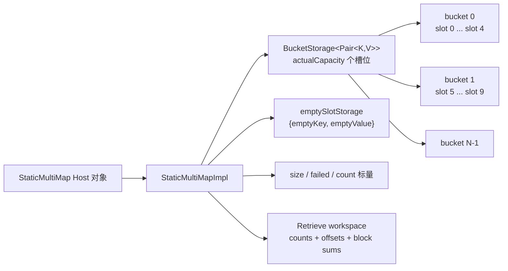
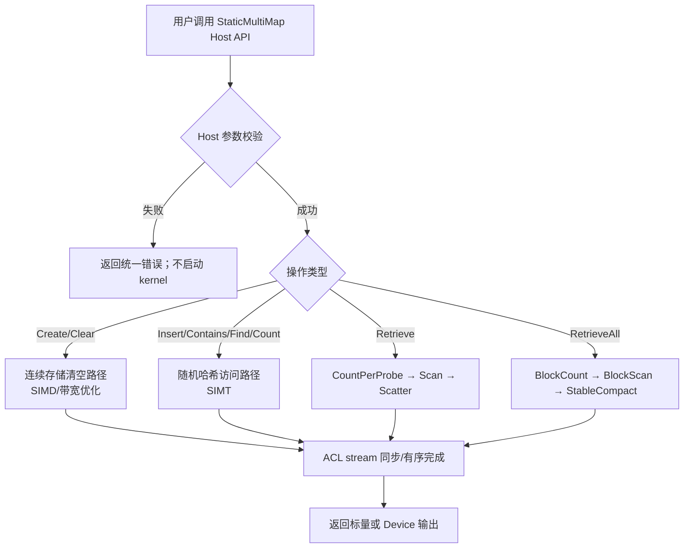
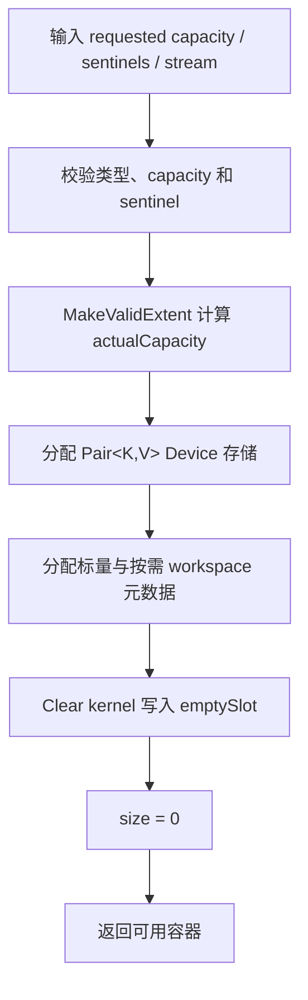
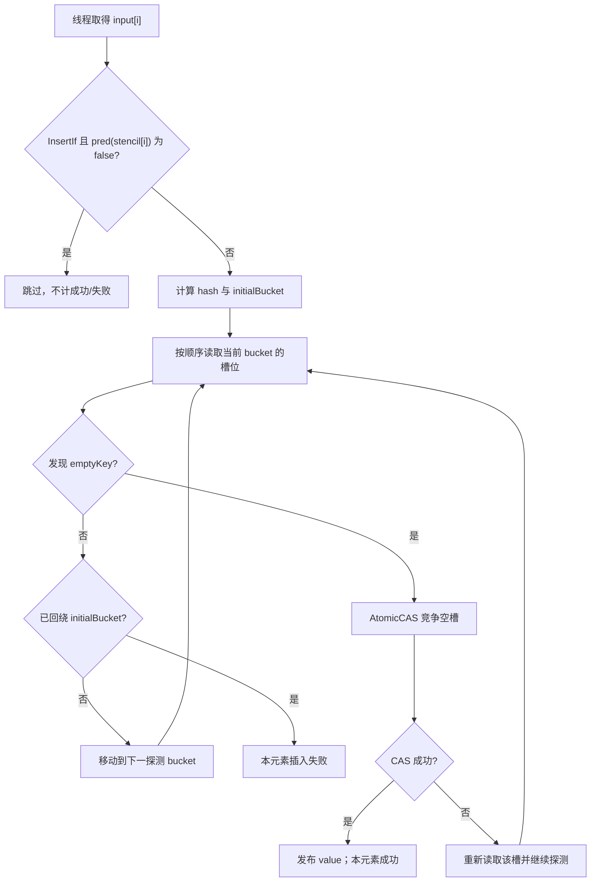
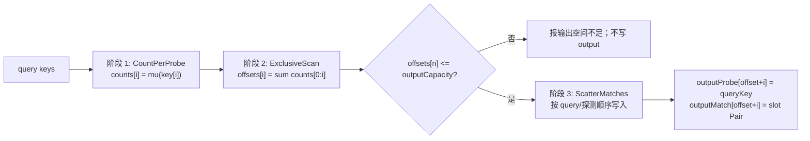
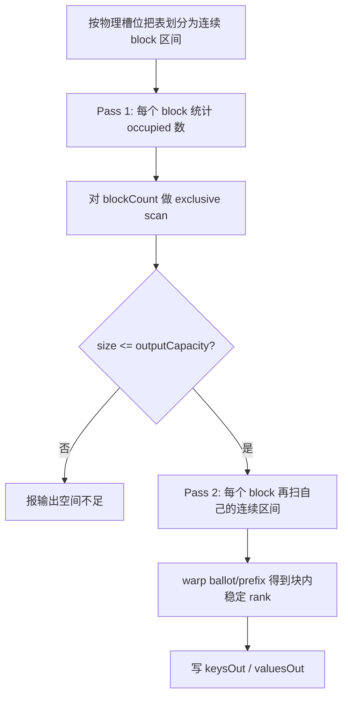
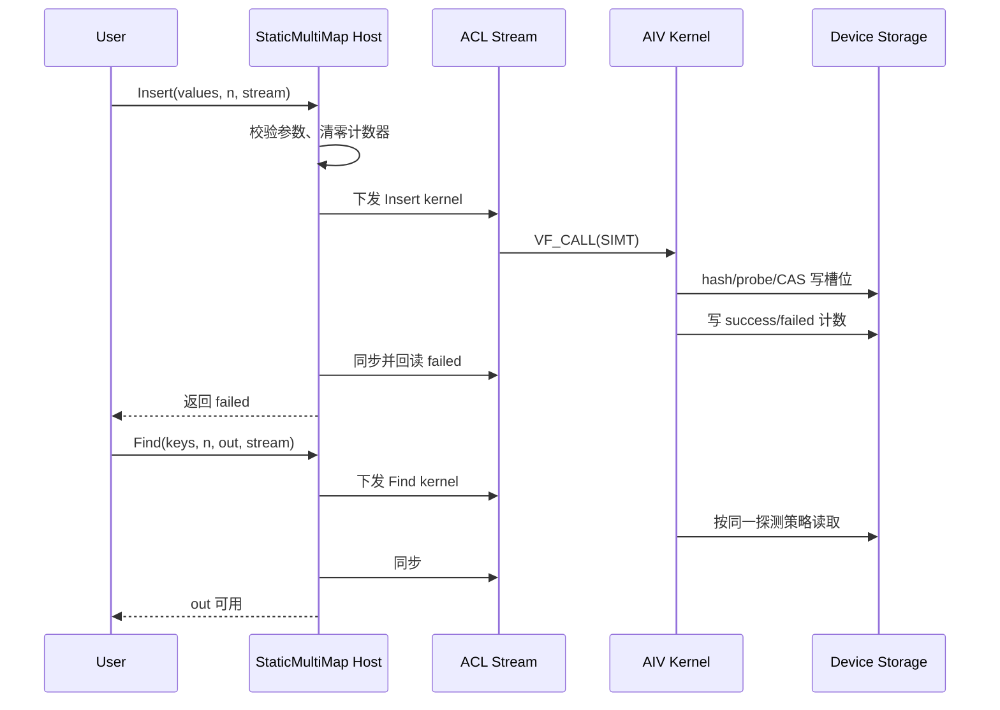

# StaticMultiMap 容器设计文档

| 项目 | 内容 |
| --- | --- |
| 文档状态 | 设计评审稿 |
| 任务 | 9 月社区任务：static_multimap 容器开发（Atlas 950） |
| 作者账号 | `gcw_mP551mSI` |
| 目标仓库 | `cann/cann-ops-competitions`（设计文档）；`cann/ops-collections`（后续代码） |
| 参考实现 | NVIDIA cuCollections `static_multimap` |
| 适配版本 | CANN 9.0.0-beta.2 及以上 |

# 需求背景（required）

## 需求来源

社区任务要求参考 NVIDIA cuCollections 的 `static_multimap`，在昇腾 NPU 上采用 Ascend C 与 C++ 实现功能一致的静态多值键值映射容器，并按 ops-collections 的纯头文件容器工程模式组织代码。

本阶段仅完成设计文档，不进行功能或性能实验。后续实现、测试与验收应在本设计通过评审后开展。

参考资料如下：

1. 任务书：`static_multimap_task_doc.md`。
2. cuCollections 参考接口：`include/cuco/static_multimap.cuh`、`include/cuco/static_multimap_ref.cuh`。
3. ops-collections 复用基线：`include/static_map.h`、`include/static_map_ref.h`、`include/detail/open_addressing/`、`include/detail/storages/`。
4. 设计模板：`cann-ops-competitions/04_tasks/01_community-task-2026/resources/design_template.md`。

为保证后续评审和实现可复现，本设计调研使用的基线版本为：

| 基线 | 分支/提交 |
| --- | --- |
| NVIDIA cuCollections | `dev@532795b81e72e3fe4ce2b26eb0c5abc8abb1e2b4` |
| cann/ops-collections | `master@9d12996d4317e28420d74bcb1ec4d3b3507599ce` |
| cann/cannbot-skills | `master@036cd390c61adfc0ff372dac1c8f66066b975eb1` |
| cann/cann-ops-competitions 模板仓 | `master@f4b451f985786e88e753e1b10c11d7c8c70b1c9b` |

## 背景介绍

### StaticMultiMap 功能背景

`StaticMultiMap` 是固定容量、无序、允许等价键重复出现的关联容器。容器元素为 `Pair<Key, Value>`；同一个 `Key` 可以对应一个或多个 `Value`，完全相同的键值对也允许重复插入。

与普通 `StaticMap` 的差异是：

| 维度 | StaticMap | StaticMultiMap |
| --- | --- | --- |
| 键约束 | 同一 key 最多保留一个元素 | 同一 key 可对应多个槽位 |
| Insert 遇到同 key | 判定重复，不再插入 | 继续寻找空槽并插入 |
| Find | 返回唯一 value | 返回一个匹配 value |
| Count | 每个 key 结果为 0 或 1 | 返回 key 的实际 multiplicity |
| Retrieve | 非核心接口 | 返回查询 key 对应的全部匹配元素 |
| RetrieveAll | 非核心接口 | 返回容器中的全部键值对 |

容器采用开放寻址哈希表。每个批量输入由多个 AIV 核上的 SIMT 线程并行处理；键经哈希函数映射到初始桶，冲突时按探测策略访问后续桶。容量在构造后保持不变，插入不会自动扩容。

### cuCollections 语义分析

cuCollections `static_multimap` 提供 Host 侧批量操作和 Device 侧单元素 ref 操作。与本任务直接相关的语义如下：

1. `insert` 将输入范围内的每个键值对作为独立元素插入，允许等价键重复。
2. `insert_if` 仅在对应 `stencil` 元素满足谓词时插入。
3. `contains` 对每个查询 key 输出是否至少存在一个匹配。
4. `contains_if` 在谓词为 false 时固定输出 false。
5. `find` 对每个查询 key 返回一个匹配 value；未命中返回 `emptyValue`。
6. `find_if` 在谓词为 false 或未命中时返回 `emptyValue`。
7. `count` 返回所有查询 key 在容器中出现次数之和；查询 key 自身重复时会重复计数。
8. `retrieve` 返回所有查询 key 对应的全部匹配，分别写入 probe-key 输出和 match-pair 输出。
9. `retrieve_all` 返回容器中的全部键和值。
10. `clear` 清空所有槽位，但不改变容量。

本设计保留上述功能语义，并按 ops-collections 习惯用“Device 首地址 + 元素个数”替换迭代器范围。

### ops-collections 现状分析

ops-collections 已提供可复用的 `StaticMap` 基础设施：

| 现有模块 | 可复用能力 | StaticMultiMap 需要新增的能力 |
| --- | --- | --- |
| `Pair` / `Extent` / `Storage` | 数据类型、容量表达、桶存储策略 | 无 |
| `BucketStorage` / `BucketStorageRef` | Device 内存分配、槽位视图 | 无 |
| `murmurhash3_32` / `LinearProbing` / `DoubleHashing` | 哈希和探测 | 无 |
| `AtomicCasWrap` | 32/64 位原子槽位竞争 | 允许重复键的插入判定 |
| `OpenAddressingRefImpl` | StaticMap 的 Insert/Find/Contains/Count | multiplicity 计数、全匹配遍历 |
| `ArgStorage` | Device 标量初始化和 Host 回读 | Retrieve 的 offset/workspace 管理 |
| `StaticMap` kernel | SIMT 网格步进、Clear SIMD 路径 | Retrieve/RetrieveAll 稳定输出 kernel |

StaticMap 的“遇到等价 key 即结束”逻辑不能原样复用。StaticMultiMap 需新增独立的 ref 实现或为公共开放寻址实现增加 `AllowsDuplicates` 编译期策略；本设计优先采用独立 `detail/static_multimap/` 实现，避免改变既有 StaticMap 行为。

# 需求分析（required）

## 需求描述

在 Atlas 950 系列及后续支持 SIMT 的昇腾产品上实现固定容量 `StaticMultiMap`，要求：

1. 支持 Create、Destroy、Clear、Insert、InsertIf、Contains、ContainsIf、Find、FindIf、Count、Retrieve、RetrieveAll。
2. Key 和 Value 支持 I32、I64；验收组合为 I32/I32、I64/I64。
3. 支持空输入、重复 key、重复 pair、不同 multiplicity、命中/未命中、容量边界等合法场景。
4. 与 cuCollections 对应接口保持语义一致；相同输入和相同容器状态下结果确定且可重复。
5. 采用 ops-collections 的纯头文件工程模式，不引入新的第三方依赖。
6. 所有性能用例达到任务书规定的 `性能 / 标杆性能 >= 0.4`。

## 数学语义

把容器状态记为键值对多重集：

`M = multiset{(k, v)}`。

键 `k` 的 multiplicity 定义为：

`mu_M(k) = |{(k_i, v_i) in M | KeyEqual(k, k_i)}|`。

各查询接口语义如下：

| 接口 | 形式化语义 |
| --- | --- |
| Contains(k) | `mu_M(k) > 0` |
| Find(k) | 若 `mu_M(k) > 0`，返回确定探测顺序中的第一个匹配 value；否则返回 `emptyValue` |
| Count(k[0:n]) | `sum(i=0..n-1, mu_M(k[i]))` |
| Retrieve(k[0:n]) | 按 query 下标升序、每个 query 内按探测顺序输出全部匹配 |
| RetrieveAll() | 按物理槽位下标升序输出全部非空槽位 |

`Retrieve` 的输入查询 key 可以重复。若同一个 key 在查询数组中出现两次，其全部匹配也会输出两次，与 cuCollections 的逐 probe-key 语义一致。

## 需求拆解

| 需求域 | 子需求 | 设计响应 |
| --- | --- | --- |
| 生命周期 | Create / Destroy / Clear | Host 管理存储；Create/Clear 用带宽型清空 kernel；Destroy 保证流安全后释放 |
| 写入 | Insert / InsertIf | SIMT 开放寻址；重复 key 不短路；槽满返回失败计数 |
| 单结果查询 | Contains / ContainsIf / Find / FindIf | 每个线程处理查询 key；遇首个空槽早停 |
| multiplicity | Count | 扫描至首个空槽，累加所有匹配；跨 query 做 64 位归约 |
| 变长输出 | Retrieve | 计数、exclusive scan、稳定回填三阶段 |
| 全量输出 | RetrieveAll | 按物理槽位做稳定压缩，不使用全局原子抢占输出位置 |
| 确定性 | 相同状态重复调用输出一致 | 明确定义探测顺序和输出顺序；禁用原子 append 决定最终顺序 |
| 泛化 | I32/I64、空输入、满载、重复 key | 模板实例化 + 参数校验 + 边界用例 |
| 性能 | 100M 规模、0.5 occupancy | 随机访问走 SIMT 直访 GM；连续清空/遍历走带宽优化路径 |

## 接口设计

### Owning 容器原型

Create/Destroy 分别映射为 C++ 构造函数和析构函数；其余任务接口使用大驼峰命名。下述原型是后续实现约定，辅助查询 `Size/Capacity/Data/Ref` 不计入任务要求的 12 个验收接口。

```cpp
namespace aclco {

static constexpr size_t defaultMultiMapBucketSize = 5;

template <class Key,
          class T,
          class Extent = Extent<size_t>,
          class KeyEqual = aclco::EqualTo<Key>,
          class ProbingScheme = aclco::LinearProbing<aclco::murmurhash3_32<Key>>,
          class Storage = aclco::Storage<defaultMultiMapBucketSize>>
class StaticMultiMap {
 public:
  using SizeType = typename Extent::ValueType;
  using KeyType = Key;
  using MappedType = T;
  using ValueType = aclco::Pair<Key, T>;

  // Create
  constexpr StaticMultiMap(Extent capacity,
                           Key emptyKey,
                           T emptyValue,
                           KeyEqual const& pred = {},
                           ProbingScheme const& probingScheme = {},
                           Storage storage = {},
                           aclrtStream stream = nullptr);

  StaticMultiMap(StaticMultiMap const&) = delete;
  StaticMultiMap& operator=(StaticMultiMap const&) = delete;
  StaticMultiMap(StaticMultiMap&&) = default;
  StaticMultiMap& operator=(StaticMultiMap&&) = default;

  // Destroy
  ~StaticMultiMap();

  void Clear(aclrtStream stream);

  // 返回未成功插入的元素数；重复 key/pair 不视为失败。
  SizeType Insert(void* values,
                  Extent valueNum,
                  aclrtStream stream);

  template <typename StencilT, typename Predicate>
  SizeType InsertIf(void* values,
                    Extent valueNum,
                    StencilT* stencil,
                    Predicate pred,
                    aclrtStream stream);

  void Contains(void* keys,
                Extent keyNum,
                void* output,
                aclrtStream stream) const;

  template <typename StencilT, typename Predicate>
  void ContainsIf(void* keys,
                  Extent keyNum,
                  StencilT* stencil,
                  Predicate pred,
                  void* output,
                  aclrtStream stream) const;

  void Find(void* keys,
            Extent keyNum,
            void* outputValues,
            aclrtStream stream) const;

  template <typename StencilT, typename Predicate>
  void FindIf(void* keys,
              Extent keyNum,
              StencilT* stencil,
              Predicate pred,
              void* outputValues,
              aclrtStream stream) const;

  // 返回所有 probe key 的 occurrence 总和。
  SizeType Count(void* keys,
                 Extent keyNum,
                 aclrtStream stream) const;

  // outputProbe 为 Key[]，outputMatch 为 Pair<Key,T>[]；返回实际输出数。
  SizeType Retrieve(void* keys,
                    Extent keyNum,
                    void* outputProbe,
                    void* outputMatch,
                    Extent outputCapacity,
                    aclrtStream stream) const;

  // keysOut/valuesOut 为分离数组；返回当前元素数。
  SizeType RetrieveAll(void* keysOut,
                       void* valuesOut,
                       Extent outputCapacity,
                       aclrtStream stream) const;

  [[nodiscard]] SizeType Size() const noexcept;
  [[nodiscard]] constexpr SizeType Capacity() const noexcept;
  [[nodiscard]] ValueType* Data() const noexcept;
  [[nodiscard]] auto Ref() const noexcept;
};

}  // namespace aclco
```

接口参数顺序以 cuCollections 的 `first, last, ...outputs..., stream` 为基线：`first/last` 被 `void* + Extent` 替换；为满足输出空间校验，`Retrieve/RetrieveAll` 在 `stream` 前增加 `outputCapacity`。

### Device Ref 原型

`StaticMultiMapRef` 是不拥有存储的轻量可复制对象，供 kernel 内使用。任务要求的 Host 批量接口由它组合实现。

```cpp
template <class Key,
          class T,
          class KeyEqual,
          class ProbingScheme,
          class StorageRef>
class StaticMultiMapRef {
 public:
  using SizeType = typename StorageRef::SizeType;
  using ValueType = aclco::Pair<Key, T>;

  COLLECTION_HOST_DEVICE constexpr StaticMultiMapRef(
      ValueType emptySlot,
      KeyEqual const& pred,
      ProbingScheme const& probingScheme,
      StorageRef storageRef) noexcept;

  COLLECTION_SIMT_DEVICE bool Insert(ValueType value) noexcept;
  COLLECTION_SIMT_DEVICE bool Contains(Key key) const noexcept;
  COLLECTION_SIMT_DEVICE T Find(Key key) const noexcept;
  COLLECTION_SIMT_DEVICE SizeType Count(Key key) const noexcept;

  template <typename Callback>
  COLLECTION_SIMT_DEVICE SizeType VisitMatches(
      Key key, Callback&& callback) const noexcept;
};
```

`VisitMatches` 是 Retrieve 的内部原语：按确定的桶/槽顺序访问全部匹配，并将匹配序号传给 callback。

### 接口语义与返回值

| 任务接口 | C++ 映射 | 输入/输出 | 返回或效果 |
| --- | --- | --- | --- |
| Create | 构造函数 | capacity、emptyKey、emptyValue、策略、stream | 分配并清空实际容量槽位；失败抛出异常 |
| Destroy | 析构函数 | 容器和关联执行流状态 | 等待必要操作完成并释放 Device 存储 |
| Clear | `Clear` | stream | 所有槽位置为 empty，Size 归零，Capacity 不变 |
| Insert | `Insert` | Pair 数组、valueNum、stream | 返回插入失败数 |
| InsertIf | `InsertIf` | Pair 数组、valueNum、stencil、pred、stream | 仅 pred=true 的元素参与；返回参与元素中的失败数 |
| Contains | `Contains` | keys、keyNum、bool output、stream | 每个 key 输出是否命中 |
| ContainsIf | `ContainsIf` | keys、keyNum、stencil、pred、bool output、stream | pred=false 固定输出 false |
| Find | `Find` | keys、keyNum、value output、stream | 命中输出首个匹配 value；未命中输出 emptyValue |
| FindIf | `FindIf` | keys、keyNum、stencil、pred、value output、stream | pred=false 或未命中输出 emptyValue |
| Count | `Count` | keys、keyNum、stream | 返回所有 query 的 occurrence 总数 |
| Retrieve | `Retrieve` | query keys、两个输出、outputCapacity、stream | 返回匹配总数并稳定输出 probe/match |
| RetrieveAll | `RetrieveAll` | keysOut、valuesOut、outputCapacity、stream | 返回容器 Size 并稳定输出全部元素 |

### 参数约束和异常语义

| 参数/状态 | 合法条件 | 异常处理 |
| --- | --- | --- |
| capacity | `capacity > 0`，可转换为有效桶容量 | 0、溢出或 Device 分配失败时 Create 失败 |
| Key / Value | I32 或 I64；验收时二者同型 | 非支持类型在编译期 `static_assert` |
| emptyKey | 不得出现在任何有效输入 key 中 | Host 可检测的场景报参数错误；Device 数据违规属于调用方错误 |
| emptyValue | 不得作为有效 value 插入，用于 Find miss | 可检测时报参数错误；文档明确保留值 |
| values / keys | `num > 0` 时为有效 Device 地址 | 空指针报参数错误；`num == 0` 时允许为空且快速返回 |
| numInputs | `[0, capacity]`，且地址范围足够 | 超出范围或 SizeType 溢出时报参数错误 |
| stencil | `uint32_t[numInputs]` Device 数组 | 空指针、长度不足或类型不符时报参数错误 |
| Predicate | Device 可调用，返回可转 bool；按值传入 | 不满足编译约束时编译失败 |
| output | Device 地址，容量满足接口要求 | 空指针或 outputCapacity 不足时不启动写 kernel并报错 |
| stream | 有效 `aclrtStream`；空流按 ACL 默认流语义处理 | ACL 调用失败按仓库统一错误机制上报 |
| 并发 | 同一容器上的写/读操作在同一流排序，或由调用方建立跨流依赖 | 未同步的跨流读写不保证正确；容器对象本身非 Host 线程安全 |

# 详细设计（required）

## 算子分析

### 数据结构与内存布局

实际容量由 `MakeValidExtent<ProbingScheme, Storage>` 根据请求容量、桶大小和探测方式向上调整。默认桶大小为 5，槽位是紧凑的 `Pair<Key, Value>` 数组。



槽位状态仅由 key 判断：

- `slot.key == emptyKey`：空槽。
- `slot.key != emptyKey`：有效元素。

本任务没有 Erase 接口，因此不需要墓碑状态。没有删除留下的探测链空洞，查询遇到首个空槽即可安全终止。

### 哈希与探测

默认采用与 StaticMap 一致的 `murmurhash3_32<Key>` 和 `LinearProbing`：

1. `hash = SanitizeHash(hasher(key))`。
2. `bucketCount = actualCapacity / bucketSize`。
3. `initialBucket = hash % bucketCount`。
4. 线性探测后续桶；每个桶内按槽位下标升序检查。
5. 最多回绕到 initialBucket 一次，防止满表死循环。

模板参数允许后续替换为 `DoubleHashing`。所有操作必须使用相同 `KeyEqual`、Hasher 和 ProbingScheme，避免插入与查询路径不一致。

### 确定性定义

任务要求“相同输入和容器状态下结果确定且可重复”。本设计把“容器状态”定义为包括实际槽位布局在内的完整状态，并规定：

1. `Find/FindIf` 返回从 initialBucket 开始，按探测桶顺序和桶内槽位升序遇到的第一个匹配 value。
2. `Retrieve` 按 query 下标升序排列；同一 query 内按上述探测顺序排列。
3. `RetrieveAll` 按物理槽位下标升序排列。
4. 禁止用全局 `AtomicAdd` 取得输出下标，因为线程调度会导致输出次序变化。
5. Contains、Count 和插入成功/失败计数本身与遍历顺序无关。

并行 Insert 在冲突时由原子操作决定最终槽位归属；一旦插入完成且容器状态不再变化，所有查询输出顺序固定。验收时除校验集合语义外，还应对同一状态连续调用进行逐元素重复性校验。

## 总体架构



代码按以下目录组织：

```text
ops-collections/
├── include/
│   ├── static_multimap.h
│   ├── static_multimap_ref.h
│   └── detail/
│       └── static_multimap/
│           ├── static_multimap.inl
│           ├── static_multimap_ref.inl
│           ├── static_multimap_impl.h
│           ├── kernels.h
│           └── scan.h
├── tests/
│   └── static_multimap/
├── tests/performance/
│   └── static_multimap/
└── docs/
    └── static_multimap_API文档和使用示例.md
```

## Host 侧设计

### Create

Create 对应构造函数，执行顺序如下：



Create 的主要成本是 Device 分配和全表初始化。任务性能用例 capacity 为 100,000,000，因此清空应按连续内存带宽优化，不使用逐 Host 循环。

### Destroy

析构前必须保证关联 stream 上使用该存储的 kernel 已完成。同步版本 Destroy 先完成必要的 stream 同步，再由 RAII allocator 释放：

1. 主表存储。
2. empty sentinel Device 标量。
3. 失败计数、size、block sums 等标量/小数组。
4. Retrieve 按峰值缓存的 workspace。

析构不启动与容量线性相关的清空 kernel；释放后的指针置空，避免重复释放。

### 参数校验

Host 在 kernel 下发前完成可验证项：

1. 容量和计数范围、整数乘法溢出。
2. `num > 0` 时输入输出指针非空。
3. `outputCapacity` 不小于所需元素数。
4. stream 和 ACL 调用返回码。
5. 当前对象未销毁，且不存在未建立依赖的跨流操作。

Device 数组的实际分配长度和每个元素是否等于 sentinel 无法从裸 `void*` 完整验证，由调用方遵守接口契约；测试覆盖违规输入的可检测部分。

### 分核与线程策略

哈希访问属于不规则随机访问，采用 SIMT。线程数为编译期常量，`LAUNCH_BOUND` 与 `Simt::Dim3` 使用同一值。

| kernel 类别 | workItems | 线程策略 | blockDim 策略 |
| --- | --- | --- | --- |
| Insert/Contains/Find/Count | numInputs | 默认 1024 线程/核 | `min(aivCoreNum, ceil(numInputs / 1024))`，至少 1 |
| Retrieve Count/Scatter | numInputs | 默认 1024 线程/核 | 同查询 kernel |
| Clear | actualCapacity | 连续搬运优先 | 根据容量和平台 AIV 核数满核分块 |
| RetrieveAll Count/Compact | actualCapacity | 连续槽位分段 | 每核处理连续区间，保证稳定顺序 |
| Scan block sums | blockCount | 单核或分层 scan | 根据 blockCount 选择 1～多核 |

SIMT kernel 统一使用 64 位 grid-stride 索引：

```cpp
for (uint64_t i = blockIdx * threadNum + threadIdx;
     i < workItems;
     i += static_cast<uint64_t>(blockNum) * threadNum) {
  // process i
}
```

`numInputs == 0` 时 Host 直接返回，不启动空 kernel。随机访问直接读写 GM，由 DCache 缓解重复桶访问；除 scan/核内压缩需要共享暂存外，不额外把整批输入搬入 UB。

SIMT 路径必须为 DCache 保留不少于 32 KB 的本地内存预算，不能把全部本地存储分给 UB。哈希查询 kernel 不申请与输入规模相关的 UB；scan 和块内稳定压缩仅申请固定大小的 per-core TBuf，并在实现阶段按目标 CANN/芯片查询到的实际本地内存上限校验。

### Workspace 管理

| workspace | 大小 | 生命周期 | 用途 |
| --- | --- | --- | --- |
| scalar counters | O(1) | 容器全生命周期 | failed、selected、size、totalCount |
| retrieveCounts | `keyNum * sizeof(SizeType)` | 按历史峰值缓存 | 每个 query 的 multiplicity |
| retrieveOffsets | `(keyNum + 1) * sizeof(SizeType)` | 按历史峰值缓存 | 稳定输出起始位置 |
| blockSums/Offsets | O(blockNum) | 按历史峰值缓存 | 分层 scan、RetrieveAll 稳定压缩 |

不复制输入 keys/values，不创建第二份哈希表。Retrieve 的 counts/offsets 是变长输出所需工作空间；同一容器后续调用复用已分配空间，减少热路径 malloc/free。

## Kernel 侧设计

### Insert / InsertIf

#### 插入流程



StaticMultiMap 与 StaticMap 的关键区别：CAS 失败后即使发现槽中 key 与待插入 key 等价，也必须继续探测，不能返回 DUPLICATE。每个被选择的输入都应独立占用一个槽位，直到表满。

#### I32 与 I64 原子发布

| 组合 | 槽位宽度 | 发布方式 |
| --- | --- | --- |
| I32/I32 | 8 字节 | 把完整 Pair 打包为 64 位，单次 CAS 完成占槽和 payload 发布 |
| I64/I64 | 16 字节 | 对 64 位 key 做 CAS 占槽，成功线程写 value，并执行必要的内存栅栏 |

对于 I64/I64，批量接口在同一 stream 中保证后续查询 kernel 不早于 Insert 完成。Device ref 若允许同一 kernel 内并发查询，则 Find/Count/VisitMatches 命中后需使用 `WaitForPayload` 或等价发布状态，避免读取尚未写完的 value。

#### 失败和 size 计数

每线程在寄存器中累计 success/failed/selected；warp 内归约后由少量线程写全局计数，避免每个输入都对同一标量做 AtomicAdd。同步 Insert 返回 `failed`，同时用 `success` 更新容器 size。

`InsertIf` 中 `pred=false` 的元素既不是成功也不是失败；返回值只统计 `pred=true` 但因容量不足未插入的元素。

### Contains / ContainsIf

对每个 query key：

1. 计算初始桶。
2. 按桶/槽顺序读取 slot key。
3. 命中等价 key，输出 true 并结束。
4. 遇到 emptyKey，输出 false 并结束。
5. 回绕一周仍未命中，输出 false。

ContainsIf 在进入探测前判断谓词；`pred=false` 直接写 false，避免无效哈希访问。

### Find / FindIf

Find 与 Contains 共用探测骨架，命中时读取对应 value。为保证确定性，不允许多个线程竞争写同一 query 的输出；一个 query 始终由一个逻辑线程按确定顺序完成。

FindIf 在 `pred=false` 时写 `emptyValue`。未命中也写 `emptyValue`。因此 `emptyValue` 必须是保留值，不允许作为有效 payload 插入。

### Count

单 query 计数伪代码：

```cpp
SizeType CountOne(Key key) const {
  SizeType count = 0;
  auto it = probingScheme.MakeIterator<bucketSize>(key, capacity);
  auto initial = *it;
  do {
    for (uint32_t s = 0; s < bucketSize; ++s) {
      auto slot = table[*it + s];
      if (slot.first == emptyKey) return count;
      if (keyEqual(key, slot.first)) ++count;
    }
    ++it;
  } while (*it != initial);
  return count;
}
```

每线程计算若干 query 的局部总和，先做 warp/核内归约，再写入 per-block sum；最后用小规模归约得到 64 位总数并回读 Host。整数加法无顺序精度问题，结果确定。

### Retrieve

Retrieve 是变长输出，采用三阶段稳定算法。



阶段 1 与 Count 共用 `CountOne`。阶段 2 使用分层 exclusive scan：

1. 每个 block 对连续 counts 分段做本地 scan，并输出 block sum。
2. 对 block sums 做 scan。
3. 把 block offset 加回本地 offsets。
4. `offsets[keyNum]` 即总输出数。

阶段 3 中 query `i` 的写区间固定为 `[offsets[i], offsets[i+1])`，线程按 ref 的 `VisitMatches` 顺序写入，不需要全局原子 append，因此输出稳定。

### RetrieveAll

RetrieveAll 不能为每个槽位分配一份 flag/offset 工作区，否则会增加与 capacity 线性重复的 Device 内存。设计采用分块两遍扫描：



不同 block 的输出区间由 block offset 固定；block 内按槽位下标升序计算 rank。最终全局顺序等同于物理槽位升序，且 workspace 仅为 O(blockNum)。

### Clear

Clear 把全部 Pair 槽位恢复为 `{emptyKey, emptyValue}`，并将 size 清零。

- I32/I32 槽位为 8 字节，可按 64 位连续写。
- I64/I64 槽位为 16 字节，按对齐向量/成对 64 位连续写。
- 大容量走多核连续分块与双缓冲/批量写优化。
- 尾部不足对齐块时使用安全尾块处理，不越界。

Clear 完成后所有历史 ref/iterator 语义失效，新的查询只观察空表。

## 数据流和时序



同一 stream 内的操作自然有序。不同 stream 使用同一容器时，调用方必须用 ACL event 或 stream synchronization 建立 happens-before；否则写写、写读并发不在本任务保证范围内。

## tilingkey 与模板实例化

本容器是纯头文件直调 kernel，不走常规算子注册/tiling data 下发流程。运行路径主要由接口类型和模板类型决定，无需额外 runtime tilingkey：

| 编译期维度 | 路径 |
| --- | --- |
| `Key=T=int32_t` | 8 字节 packed CAS 路径 |
| `Key=T=int64_t` | key CAS + payload publish 路径 |
| 普通接口 | 无 stencil 的快路径 |
| `*If` 接口 | Predicate 模板实例化路径 |
| ProbingScheme | LinearProbing / DoubleHashing 模板实例化 |

运行期仅根据 `numInputs`、`capacity` 和平台 AIV 核数确定 blockDim 和分段长度。

## 关键 Ascend C API 核验

已在云端 CANN 9.1.0 环境对本设计涉及的 SIMT 基础能力做头文件级核验。该核验只确认 API 存在和所需整数类型声明，不替代后续 CANN 9.0.0-beta.2 最低版本编译回归。

| 能力 | API/封装 | CANN 9.1.0 头文件 | 核验结论 |
| --- | --- | --- | --- |
| VF 启动 | `AscendC::Simt::VF_CALL` | `asc/include/interface/simt_api/cpp/kernel_simt_utils.h` | 存在 |
| 线程/核索引 | `GetThreadIdx/GetThreadNum/GetBlockIdx/GetBlockNum` | `asc/include/interface/simt_api/cpp/kernel_simt_common_intf.h` | 存在，返回 `uint32_t` |
| GM 原子 CAS | `asc_atomic_cas`，由仓内 `AtomicCasWrap` 封装 | `asc/include/simt_api/device_atomic_functions.h` | GM I32/U32/I64/U64 重载存在 |
| 内存栅栏 | `asc_threadfence` / `asc_threadfence_block` | `asc/include/simt_api/device_sync_functions.h` | 存在 |
| warp 稳定 rank/归约 | `asc_ballot`、`asc_shfl*`、`asc_reduce*` | `asc/include/simt_api/device_warp_functions.h` | 整数 ballot/shuffle 能力存在 |

实现阶段仍需以 ops-collections 的公共宏和包装层为首选，不直接复制底层 API 声明；目标架构值由已安装 CANN 工具链和仓库构建配置确定，不在设计文档中硬编码。

## 性能优化策略

1. **操作类型分流**：随机哈希访问使用 SIMT，Clear/RetrieveAll 的连续访问使用带宽优化路径。
2. **桶内连续读取**：一次探测访问连续 `bucketSize` 个槽位，提高 cache line 利用率。
3. **I32 packed CAS**：key/value 一次原子发布，减少全局原子次数。
4. **I64 依赖写**：仅对 key 做一次 CAS，成功后普通写 payload，避免两次串行原子。
5. **早停**：Contains/Find/Count/Retrieve 遇到首个 emptyKey 即停止；0.5 occupancy 下控制平均探测长度。
6. **局部计数后归约**：减少对单一全局计数器的原子争用。
7. **稳定输出不使用全局 append**：Retrieve 用 offset，RetrieveAll 用 block offset，兼顾确定性和并行度。
8. **Workspace 复用**：按历史峰值扩容并缓存，热路径不重复分配。
9. **空输入快路径**：0 元素不启动 kernel。
10. **64 位索引**：避免 100M 规模下字节偏移和计数中间值溢出。

## 支持硬件

| 支持的芯片版本 | 状态 |
| --- | --- |
| Atlas 950 系列产品 | 支持 |
| 后续支持 Ascend C SIMT 的昇腾产品 | 具备适配基础，需按产品完成编译与回归 |

## 算子约束限制

1. CANN 版本要求 9.0.0-beta.2 及以上；构建工具 CMake 3.16 及以上。
2. 验收 dtype 为 I32/I32、I64/I64，Key 与 Value 类型相同。
3. 容量静态固定，Insert/InsertIf 不自动扩容。
4. `emptyKey`、`emptyValue` 是保留值，不得作为有效数据插入。
5. 无 Erase 接口；Clear 是唯一批量删除方式。
6. 建议目标 occupancy 不高于 0.5；接近满载时探测长度会显著增加，满表元素返回插入失败。
7. Predicate 必须可在 Device 侧调用且可按值传递；不得依赖 Host 指针。
8. 输出指针不得与容器存储或彼此发生未定义重叠。
9. 同一容器的跨流并发读写由调用方同步；容器对象非 Host 线程安全。
10. Retrieve 的最大输出数为 `sum(mu(query[i]))`，可能大于容器 Size；调用方应先 Count 或提供足够 outputCapacity。

# 特性交叉分析

| 特性交叉 | 风险 | 设计处理 |
| --- | --- | --- |
| I64 × 并发插入 | key 已发布但 value 尚未完成 | stream 顺序 + payload 发布/等待协议 |
| 高 multiplicity × Count/Retrieve | 单 query 探测链长、输出量大 | 完整探测；64 位计数；Retrieve 预计算 offset |
| 重复 query × Retrieve | 相同匹配需要重复输出 | query-major offset，每个 query 独立枚举 |
| 满表 × 未命中查询 | 不存在 empty 槽，无法早停 | 探测回绕检测，最多扫描一周 |
| 小输入 × 满核启动 | 启动和空转开销过大 | 动态 blockDim，至少一核，不动态改变线程常量 |
| 大 capacity × Clear | 初始化带宽主导 | 连续分块、对齐写、满核并行 |
| RetrieveAll × 确定性 | Atomic append 导致乱序 | block 两遍扫描 + 稳定块内 rank |
| outputCapacity × 变长输出 | 写越界 | 写 kernel 前取得 required count 并校验 |
| LinearProbing × 高 occupancy | primary clustering | 验收 occupancy=0.5；保留 DoubleHashing 模板选项 |
| 空输入 × nullptr | 常规校验可能误报 | `numInputs==0` 先快速返回，允许数据指针为空 |

# 可维可测分析

## 精度标准/性能标准

| 验收标准 | 设计目标 | 标准来源 |
| --- | --- | --- |
| 功能标准 | 12 个接口行为符合任务书与 cuCollections 对应语义 | 社区任务书 |
| dtype 标准 | I32/I32、I64/I64 全覆盖 | 社区任务书 |
| 确定性标准 | 同一输入和不变槽位状态下逐元素输出一致 | 社区任务书 |
| 性能标准 | 所有指定用例 `本实现性能 / 标杆性能 >= 0.4` | 社区任务书 |
| 等价时延 | `本实现时延 <= 标杆时延 / 0.4` | 社区任务书 |
| 内存标准 | 除容器、输出和必要 workspace 外，不产生输入规模的重复 Device 拷贝 | 社区任务书 |

本文是设计阶段文档，不填写未经执行的实测数据。功能日志、性能数据和截图在设计评审通过后的实现/自验阶段提交。

## 功能测试方案

功能测试按任务书共 1086 个展开用例组织，覆盖：

| 维度 | 关键场景 | 预期检查 |
| --- | --- | --- |
| dtype | I32/I32、I64/I64 | 全部接口实例化、无截断/溢出 |
| 生命周期 | Create/Destroy/Clear 多容量 | 指针有效、容量取整、清空后 Size=0 |
| 输入规模 | 0、1、小批量、大批量、capacity 边界 | 无越界、返回计数正确 |
| multiplicity | 1、多值、完全相同 pair 重复 | Count/Retrieve multiplicity 正确 |
| matching rate | 0、0.1、0.5、1.0 | Contains/Find/Count/Retrieve 命中语义正确 |
| InsertIf | stencil 全 0、全 1、交替、随机 | 仅谓词为 true 的元素改变状态 |
| ContainsIf/FindIf | predicate true/false 混合 | false 位置分别输出 false/emptyValue |
| 容量 | 空表、半满、近满、满表、溢出尝试 | 无死循环，失败数正确 |
| sentinel | emptyKey/emptyValue 边界 | 合法输入不与 sentinel 混淆 |
| 确定性 | 同一状态连续调用 10 次 | Find/Retrieve/RetrieveAll 输出逐元素相同 |
| 跨调用 | 分批 Insert 后查询 | 状态累积和 Size 正确 |

## Golden 设计

Host 侧使用 `std::unordered_multimap<Key, Value>` 或排序后的 `std::vector<Pair<Key,Value>>` 构建语义 golden：

1. Insert/InsertIf：比较成功数、失败数和最终多重集。
2. Contains/ContainsIf：逐 query 比较 bool。
3. Find/FindIf：未命中必须等于 emptyValue；命中结果必须属于该 key 的 value 多重集，并额外检查重复调用结果一致。
4. Count：按 query 逐个计算 multiplicity 后求和；重复 query 重复累计。
5. Retrieve：按 query 切分输出，比较每段的 pair 多重集；再执行重复性逐元素比较。
6. RetrieveAll：比较全表 pair 多重集；再执行重复性逐元素比较。
7. Clear：所有查询未命中，RetrieveAll 返回 0。

cuCollections 参考实现用于交叉确认接口语义；由于参考实现对部分输出顺序和多匹配 Find 的具体元素不作顺序保证，精度比较以语义集合为主，确定性则按本设计的更强约束单独验证。

## 性能测试方案

按任务书执行 32 个性能用例：

| 接口 | dtype | 关键参数 | 用例数 |
| --- | --- | --- | --- |
| Create、Destroy | I32/I32、I64/I64 | Capacity=100,000,000 | 4 |
| Insert、RetrieveAll | I32/I32、I64/I64 | NumInputs=100,000,000，Occupancy=0.5，Multiplicity=1 | 4 |
| Contains、Find、Retrieve、Count | I32/I32、I64/I64 | NumInputs=100,000,000，Occupancy=0.5，Multiplicity=1，MatchingRate=0.1/0.5/1 | 24 |

性能记录要求：

1. 首次运行预热，不计入正式统计。
2. 固定输入、容器状态、stream 和编译选项。
3. 记录多轮时延的中位数，并保留原始日志。
4. 按 `达标系数 = 标杆时延 / 本实现时延` 计算，要求不低于 0.4。
5. 分别记录 kernel 时延与必要的同步/回读开销，接口口径与标杆保持一致。
6. 若未达标，使用 profiling 定位原子争用、DCache miss、探测长度、scan 或同步开销，不用删减语义规避用例。

## 可维护性分析

1. `StaticMultiMap` 不修改 `StaticMap` 对外接口，新增实现位于独立目录。
2. 公共 Pair/Storage/Hash/Probing/Allocator 继续复用，避免重复基础设施。
3. 允许重复键的差异封装在 ref；Host API 和 kernel 不散布重复判定分支。
4. Count 与 Retrieve 共用 match 遍历原语，降低语义漂移风险。
5. 确定性顺序在接口契约中显式定义，测试可直接锁定。
6. workspace 由统一管理器扩容和复用，避免各接口独立分配。

## 风险与规避措施

| 风险 | 影响 | 规避措施 |
| --- | --- | --- |
| 原子竞争严重 | Insert 性能下降 | packed CAS、局部失败计数、控制 occupancy、分析热点 key |
| 高 multiplicity 形成长簇 | Count/Retrieve 时延增加 | 完整探测正确性优先；容量预留；可选 DoubleHashing |
| I64 payload 可见性 | Find 读取中间态 | 同流有序；Device 并发场景使用发布/等待协议 |
| Scan workspace 过大 | Retrieve 内存压力 | 仅 counts/offsets 两个必要数组；按峰值复用；严格溢出检查 |
| RetrieveAll 输出乱序 | 重复执行不一致 | 禁止全局 atomic append，采用稳定 block 压缩 |
| 输出容量不足 | Device 越界 | 写入前回读 required count 并校验 |
| 满表探测死循环 | kernel 不结束 | initialBucket 回绕终止条件 |
| 裸 void* 类型错误 | 数据解释错误 | 文档契约、测试工厂、编译期模板类型和 Host 可检测项校验 |

## 兼容性分析

1. 新增 `StaticMultiMap`，不改变既有 StaticMap/StaticSet/DynamicMap/BloomFilter/RoaringBitmap 行为。
2. 复用仓库既有命名空间、模板类型、ACL stream 和 allocator 约定。
3. 只依赖 CANN、ACL 和仓库已有头文件，不新增第三方运行时依赖。
4. 默认探测与存储策略保持和 StaticMap 一致，便于统一维护和性能对比。
5. 后续若公共开放寻址 ref 增加 `AllowsDuplicates` 策略，可在不改变对外接口的前提下合并重复实现。

## 评审通过后的交付计划

1. 在 ops-collections 实现 `static_multimap.h`、`static_multimap_ref.h` 和 `detail/static_multimap/`。
2. 补齐 `tests/static_multimap/` 1086 个展开功能用例对应的测试矩阵。
3. 补齐 `tests/performance/static_multimap/` 32 个性能用例。
4. 生成全部功能/性能日志和自测报告。
5. 编写 `docs/static_multimap_API文档和使用示例.md` 并更新仓库 README。
6. 设计文档和代码分别按社区任务要求提交 PR；提交前核验账号、邮箱、分支、diff 和提交数量。
