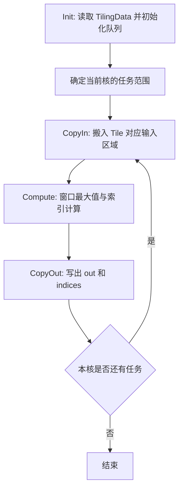

# MaxPool2dWithMask 算子设计文档

# 1 需求背景

## 1.1 需求来源

通过 CANN 社区任务完成 MaxPool2dWithMask 算子的 Ascend C 实现。算子对外接口与
`aclnnMaxPool2dWithMask` 保持一致，完成后提交至 `ops-nn` 仓库
`experimental/pooling/max_pool2d_with_mask` 目录。

## 1.2 背景介绍

MaxPool2dWithMask 是带索引输出的二维最大池化算子。算子在输入特征图的每个
batch、channel 平面上滑动池化窗口，输出窗口最大值，并同步输出最大值对应的
索引信息，供配套反向算子使用。

本任务基于已有 TBE 能力，使用 Ascend C 重新实现，在保证接口、功能和精度一致的
基础上，通过合理的多核切分、UB 分块和流水调度提升执行效率。

### 1.2.1 原实现能力

| 参数 | 类别 | 数据类型 | 数据格式 | 说明 |
| --- | --- | --- | --- | --- |
| self | 输入 | FLOAT16、FLOAT、BFLOAT16 | NCHW、ND | 四维输入特征图 |
| kernelSize | 属性 | INT64 列表 | - | 池化窗口大小，长度为 1 或 2 |
| stride | 属性 | INT64 列表 | - | 池化步长；空列表时取 kernelSize |
| padding | 属性 | INT64 列表 | - | 输入边缘填充大小 |
| dilation | 属性 | INT64 列表 | - | 窗口内采样步幅，本任务仅支持 1 |
| ceilMode | 属性 | BOOL | - | 输出尺寸是否采用向上取整 |
| out | 输出 | FLOAT16、FLOAT、BFLOAT16 | NCHW、ND | 最大池化结果 |
| indices | 输出 | INT8 | NCHW、ND | 最大值索引信息的存储容器 |

BFLOAT16 数据类型仅在 Atlas 800T A2 上支持。

# 2 需求分析

## 2.1 需求描述

使用 Ascend C 实现 MaxPool2dWithMask，支持任务书规定的数据类型、数据格式及合法
属性组合，正确处理 padding、尾块和 `ceilMode`，并输出可供反向算子使用的索引信息。

## 2.2 需求拆解

1. 完成算子原型注册、输出 shape/dtype 推导和 ACLNN 两段式接口适配；
2. 支持 FLOAT16、FLOAT、BFLOAT16 输入，输出数据类型与输入一致；
3. 支持 NCHW、ND 四维输入及合法的窗口、步长和 padding 组合；
4. 确保最大值与索引结果具有确定性，并与原实现保持一致；
5. 根据输入规模、窗口参数和硬件资源进行多核及 UB 切分；
6. 在 Atlas 800T A2 上达到任务书规定的性能要求，并适配 Atlas 300V Pro。

## 2.3 外部组件依赖

不涉及外部组件依赖。

## 2.4 内部适配模块

适配 ACLNN 接口、GE 算子原型、Host Tiling 和 Ascend C Kernel。

# 3 详细设计

## 3.1 算子分析

### 3.1.1 数学定义

对于输出位置 `(n, c, oh, ow)`，其池化结果为：

$$
out(n,c,oh,ow)=
\max_{\substack{0\le kh<K_H\\0\le kw<K_W}}
self(n,c,oh\times S_H-P_H+kh,\ ow\times S_W-P_W+kw)
$$

超出输入边界的位置按负无穷处理。

当 `ceilMode=False` 时，输出高度计算为：

$$
H_{out}=
\left\lfloor
\frac{H_{in}+2P_H-D_H(K_H-1)-1}{S_H}
\right\rfloor+1
$$

输出宽度计算方式相同。`ceilMode=True` 时采用向上取整，并根据池化边界规则修正
最后一个完全落在 padding 区域的窗口。

`indices` 的 shape 为：

$$
[N,C,K_H\times K_W,
(\lceil H_{out}\times W_{out}/16\rceil+1)\times2\times16]
$$

其数据类型为 INT8，内部保存与每个输出位置对应的通道内索引信息。

### 3.1.2 确定性规则

窗口按照从上到下、从左到右的顺序参与比较。仅当新元素严格大于当前最大值时更新
最大值与索引，因此多个位置具有相同最大值时保留最先出现的位置，保证执行结果不受
分块和核数变化影响。

## 3.2 Host 侧设计

### 3.2.1 参数校验与推导

Host 侧完成以下处理：

- 校验输入 rank、dtype、format 以及输入输出的一致性；
- 将长度为 1 的属性扩展为 H/W 两个方向，空 `stride` 归一化为 `kernelSize`；
- 校验 `kernelSize`、`stride` 为正数，`padding` 位于合法范围，`dilation` 为 1；
- 根据输入 shape 和属性推导 `out`、`indices` 的 shape；
- 对非法输出尺寸、溢出及不支持的平台数据类型返回参数错误。

### 3.2.2 Tiling 总体策略

Host 根据输入空间大小、输出空间大小、数据类型、池化窗口和平台 UB 容量选择合适的
计算方案。总体原则如下：

1. 将 N、C 合并为互相独立的平面任务，优先在平面之间进行多核均分；
2. 单个平面较大时，再沿输出空间切分，每个 Tile 处理连续的输出区域；
3. Tile 大小依据输入覆盖范围、输出结果、索引结果及临时计算空间共同确定；
4. 对常见窗口与步长组合使用专用计算分支，其余合法场景使用通用分支；
5. 尾块由 TilingData 显式描述，Kernel 统一完成边界处理，避免越界访问。

TilingData 主要包含输入输出几何信息、窗口与步长参数、每核任务范围、Tile 大小、
有效数据长度及实现分支标识。

### 3.2.3 分核策略

可并行任务按连续区间分配给 AI Vector Core。能够均分时各核任务量一致；不能均分时，
余数分配给前若干个核。对于任务量较小的场景减少启用核数，避免调度开销大于计算收益。

## 3.3 Kernel 侧设计

Kernel 采用 `Init` 和 `Process` 两阶段结构，`Process` 由数据搬入、池化计算和结果搬出
组成。

### 3.3.1 数据搬入

根据当前输出 Tile 反推所需输入范围。有效区域通过 DMA 搬入 UB，padding 区域使用负
无穷补齐；对于非对齐尾部使用带 padding 的搬运接口处理。相邻 Tile 通过队列管理输入
缓冲，尽量重叠搬运与计算。

### 3.3.2 最大值与索引计算

对窗口内有效元素执行最大值比较，并同步维护对应索引。计算以向量操作为主，依据数据
类型和窗口特征选择适合的处理粒度。低精度类型在保证结果一致的前提下进行必要的类型
转换，索引计算使用整数类型，避免大 shape 下的精度损失。

### 3.3.3 结果搬出

池化值按输出数据类型写入 `out`，索引按照约定布局写入 `indices`。对于最后一个
Tile，仅搬出有效元素；索引容器未使用区域保持为零。

## 3.4 性能优化原则

在不改变计算语义的前提下，主要采用以下通用优化：

- 根据 Shape 自适应选择分核和 Tile 粒度，提高多核负载均衡；
- 增大连续搬运粒度，减少小块 DMA 和重复地址计算；
- 使用双缓冲衔接 CopyIn、Compute、CopyOut；
- 复用 UB 中的中间结果，降低重复读取和重复归约；
- 对常见窗口参数提供轻量分支，减少通用流程的额外开销；
- 对小 Shape 控制核数和初始化成本，对大 Shape 提高并行度与数据复用率。

具体参数由 Host 根据硬件资源动态计算，不依赖固定 Shape。

## 3.5 支持硬件

| 硬件平台 | 支持情况 |
| --- | :---: |
| Atlas 800T A2 | √ |
| Atlas 300V Pro | √ |

## 3.6 算子约束限制

1. `self` 为四维 NCHW/ND Tensor；
2. `kernelSize`、`padding`、`dilation` 长度为 1 或 2，`stride` 长度为 0、1 或 2；
3. `dilation` 仅支持 1；
4. 输入数据暂不支持 NaN、负无穷；
5. BFLOAT16 仅 Atlas 800T A2 支持；
6. Atlas 推理系列产品上的 `ceilMode=True` 需满足任务书规定的步长限制；
7. `indices` 为连续 INT8 Tensor，其 shape 必须符合接口定义。

# 4 特性交叉分析

本算子为独立的池化算子实现，不涉及融合、量化及广播特性交叉。

# 5 可维可测分析

## 5.1 测试方案

精度测试覆盖三种数据类型、不同输入规模、窗口大小、步长、padding、`ceilMode`、
非对齐尾块和并列最大值等场景。`out` 按生态算子精度标准比对，`indices` 按整数结果
进行精确比对。

性能测试在相同硬件、CANN 版本、输入参数和预热条件下，对比 Ascend C 与原 TBE
实现的算子级耗时，并覆盖小 Shape、常用网络 Shape 和大 Shape。

## 5.2 验收标准

| 验收项 | 标准 | 来源 |
| --- | --- | --- |
| 精度 | 满足生态算子开源精度标准，索引结果精确一致 | 任务书 |
| A2 性能 | 整体性能不低于原 TBE 实现的 95% | 任务书 |
| 小 Shape | 未达标场景按任务书要求提供性能分析 | 任务书 |
| 300V Pro | 完成功能与精度验证，并满足任务书性能说明 | 任务书 |

## 5.3 兼容性分析

本实现不改变 `aclnnMaxPool2dWithMask` 的参数顺序、属性语义、输出 shape 和数据类型。
新增代码位于 `experimental/pooling/max_pool2d_with_mask`，不修改已有算子的外部行为，
可与配套反向算子按照既有接口约定配合使用。
